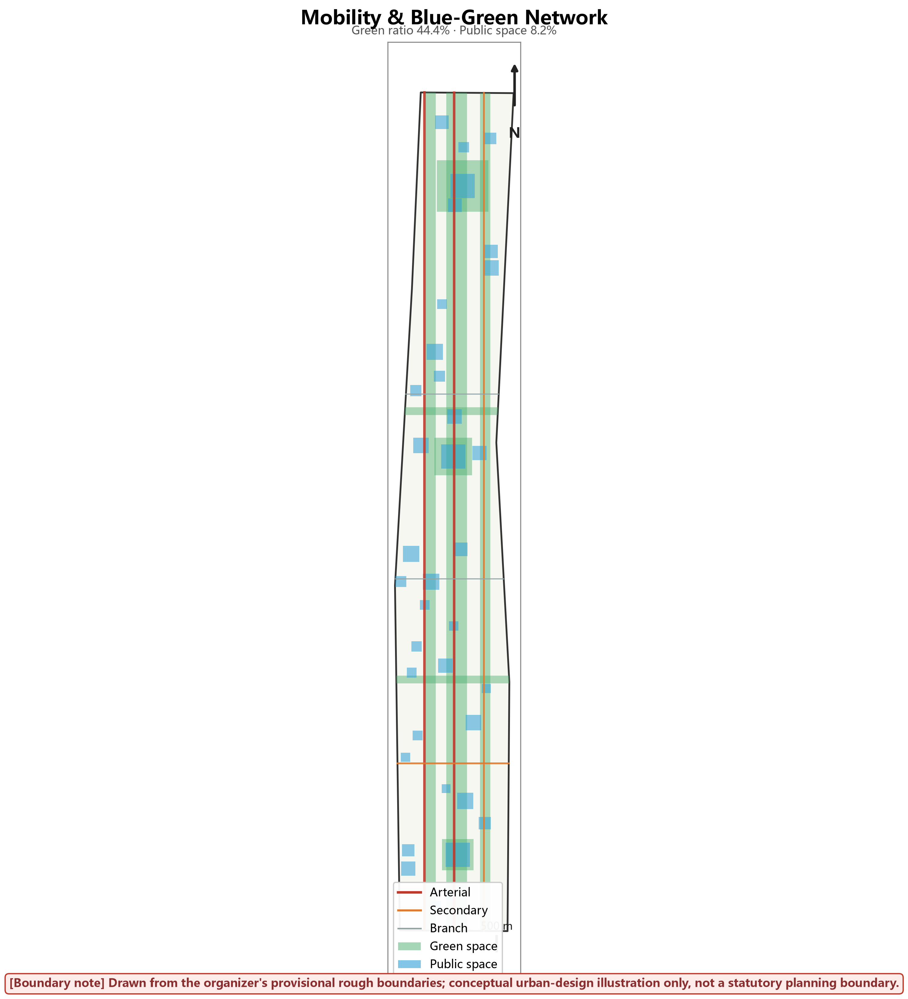

# Beijing-Zhangjiakou AI Innovation Corridor Urban Design

## Abstract

This proposal designs the Centennial Jing-Zhang AI Innovation Corridor along the decommissioned Beijing-Zhangjiakou railway corridor in Haidian, Beijing. The design overlays three belts — the century-old Jing-Zhang railway heritage, a metropolitan AI life-experience belt, and an AI fusion-innovation belt — across a three-level scope framework: a 43.6 km² coordinated research area (announcement figure), an 11.41 km² overall design area (geometrically recomputed under EPSG:4548), and three key detailed-design areas totalling 3.68 km².

The corridor is structured as three cores and two wings: the Zhongzhiyuan AI Self-Innovation Acceleration Area (1.93 km², recomputed) anchoring hard-tech research in the north; the Beijing AI Origin Community (1.04 km²) as the spiritual home of open-source developers; and the Dazhongsi AI Industry Cluster (0.72 km²) as the application and commercialisation gateway in the south. All boundaries derive from the organiser's provisional geometry [source:S001] [source:S002] and are recomputed end-to-end by the shipped script `visual/assets/verify.js` (10/10 PASS).

Twelve AI+ scenario cards (SC-01 to SC-12), nine user personas, three industry test platforms, a structured honor-display system and a developer-community operating cadence (weekly/monthly/quarterly/annual, `visual/assets/operations.json`) together form the operational skeleton. Every scenario card declares its data sources, model capability boundaries, human-review requirement, failure degradation path, KPI and exit condition — machine-readable in `visual/assets/scenario_cards.json`, anchors verified by `visual/assets/check_cards.js` (12/12 PASS).

Everything in this package is a conceptual urban-design contribution to an open call. Nothing here is a statutory plan, an approved government action, an implementation commitment, or an investment promise. The quantitative backbone — every class-1 metric, every scenario-card anchor, every operations entry — is machine-checkable by the four shipped scripts; where the organiser's data is provisional, the package says so in the same breath as the number, and the recomputation obligation is built into the verification tooling rather than promised in prose.

## Design Basis and Source List

| Data | Source | Year | Role |
|------|--------|------|------|
| Overall-design-area boundary | open-city-ai/haidian repo (provisional) | 2026 | Spatial frame only |
| Three key-area boundaries | open-city-ai/haidian repo (provisional) | 2026 | Spatial frame only |
| Call announcement (scope figures) | Organiser announcement | 2026 | Scope terminology |
| Beijing Master Plan 2016-2035 | Public policy document | 2017 | Policy context |
| Land-use classification | MNR 2023 classification guide | 2023 | Land-use codes |
| Population | 7th national census (public common knowledge) | 2020 | Scenario reference only |
| Transport / industry baselines | No verifiable dataset shipped with the call | - | Scenario assumptions only (assumptions.json); no specific figures asserted |
| Eight global case studies | Case comparison table, sources.json S010 | 2024-2026 | Design-translation evidence |

All spatial figures are recomputed under EPSG:4548 from the provisional geometry; the organiser's formal boundaries, when released, will require a full recomputation. No 2025-vintage land-use, transport or industry dataset was shipped with the call in verifiable form, so every current-state claim in this proposal either cites a public policy document already in the registry or is framed as a scenario assumption recorded in assumptions.json. Enterprise counts, output values and hospital partnerships are never asserted as facts.

## 2. Overall Positioning and Goals

### 2.1 Three-Belt Overlay Positioning

**Belt One: the Centennial Jing-Zhang Heritage Belt.** In 1909 the Jing-Zhang railway, chief-engineered by Zhan Tianyou, became the first trunk railway designed and built independently by Chinese engineers — the awakening of modern Chinese industrial civilisation. Spatial carriers: the full Jing-Zhang Railway Heritage Park line; cultural nodes at Qinghuayuan Station ruins, Wudaokou Station ruins, Dazhongsi Station ruins and Beijing North Station. Narrative: a century-long leap from railway civilisation to the intelligent era.

**Belt Two: the Metropolitan AI Life-Experience Belt.** AI dissolves into everyday scenes — commuting, dwelling, working, leisure — so residents experience intelligent services as ambient quality, not gadgetry. Experience scenes: AI + healthcare, education, commerce, transport, eldercare, culture. Carriers: residential communities, commercial streets, public-service facilities, public space. Technical backing: a sensing network, a city operations platform and a digital twin (all with the data-governance boundaries declared in the scenario cards).

**Belt Three: the AI Fusion-Innovation Belt.** Building on Zhongguancun's innovation gene, the corridor assembles the complete chain from basic research through technology transfer, industrial incubation to capital services, aiming at a core node of the global AI innovation network. Innovation actors: universities, national labs, enterprises, venture capital, open-source communities. Spatial carriers: the three core innovation areas plus the two supporting wings. Operating mechanism: open-source contribution incentives, developer self-governance and a global event system. The three belts are not parallel slogans — the heritage belt supplies spatial structure and narrative, the life belt supplies everyday demand and public legitimacy, and the innovation belt supplies industry and talent; each belt's flagship programmes (the heritage tour route, the twelve scenario cards, the honor wall and pilgrimage) physically overlap in the same public spaces, which is what makes the overlay real rather than rhetorical.

### 2.2 Development Goals

**Near-term (2027-2030):** infrastructure coverage 100%; AI-enterprise occupancy 60%; annual open-source contribution records ≥1,000; global developer visits ≥100,000/year.

**Mid-term (2030-2035, scenario assumptions not forecasts, assumptions.json):** 500 bn yuan output is a scenario value — release evidence is the annual output audit and the in-survey enterprise list; missing it means correcting the target, not the yardstick. ≥10 unicorns counted from incubator graduations and public funding records. ≥5 international conferences registered by actual editions and attendance lists. ≥100 honor-wall inductees per the operations.json ledger and annual publication — numbered, never ranked.

**Long-term direction (2035-2040, directional goals released by stage gates, not by calendar):** participation in the global AI-innovation conversation, standing reported through annually published verifiable indicators rather than a preset ranking promise; a replicable AI-city paradigm whose release evidence is at least one external city adopting a component-library entry; cumulative open-source contributions counted by the annual audit ledger in step with the honor wall; international reach reported through measurable items (international attendee share, non-Chinese media coverage), not slogans.

**One-page reading: what this belt becomes on the ground.** Four layers. **Spatial:** one axis, three cores, two wings — the 7.5 km heritage axis carries continuous public space; Zhongzhiyuan / AI Origin / Dazhongsi respectively carry full-stack verification, campus-to-city conversion and first-floor urban application; the two wings plug in universities, enterprises and communities. **Service:** every AI scenario keeps an ordinary-service path — when recommendation engines stop, counters, wayfinding, greens and accessible routes still work. **Verification:** the twelve scenario cards each register measured object, comparison method, human takeover and stop conditions (scenario_cards.json + check_cards.js). **Operations:** public questions re-enter an annual public-value audit through sandbox -> evidence -> review -> scale-up-or-exit (operations.json + check_ops.js). Before any AI scenario enters public space it must answer six questions: where it lands, how ordinary service survives, what is measured, who reviews, when humans take over, and how it exits.

Each key area carries a one-sentence spatial promise under a shared "verb-space-evidence-fallback" grammar:

| Area | Core verb | Minimal visible delivery | Evidence required before scale-up | City state if AI fails |
| --- | --- | --- | --- | --- |
| Zhongzhiyuan | **Verify** | River-test courtyard-standard gallery sequence | Red-team results, takeover logs, same-task energy | Ordinary garden block and continuous walking line |
| AI Origin | **Transfer** | Campus interface-transfer street-open hall sequence | Before/after service comparison, rights review, user retest | Ordinary public hall, human advisors, shared workshops |
| Dazhongsi | **Apply** | Station mouth-reception hall-experience street-public green sequence | Peak/off-peak walk audit, shutdown drill, complaint log | Ordinary commerce, human counters, public green |

*All quantitative goals are scenario targets pending official baselines, not forecasts or commitments.*

### 2.3 Core Metrics

| Class | Metric | Value | Unit |
|-------|--------|-------|------|
| Spatial | Coordinated research area (announcement) | 43.6 | km² |
| | Overall design area (recomputed) | 11.41 | km² |
| | Green ratio (recomputed, union basis) | 44.4 | % |
| | Average FAR (recomputed) | 1.13 | - |
| | Building density (recomputed) | 8.7 | % |
| Industry | Research land (0802) share, two bands | 27.6 | % |
| | Commercial land (05) share, two bands | 18.4 | % |
| Population | Employment capacity (scenario-based, see assumptions.json) | 15-20 | 10k persons |
| | Residential capacity (scenario-based, see assumptions.json) | 8-10 | 10k persons |
| Facilities | Education facility radius | 500 | m |
| | Medical facility radius | 1,000 | m |
| | Park green 500m coverage | 100 | % |

**First-year baseline plan (B01-B05).** Facility coverage figures are static accessibility computations; operational performance is judged against these baselines — measured first, compared after, no empty numbers.

| Baseline | Observation & frequency | Statistic / comparison | HOLD rule |
| --- | --- | --- | --- |
| B01 Axis walking-break list | First full-route survey builds the list; monthly re-measure after fixes | Break count, class, closure time; before/after comparison | New high-risk break -> local traffic/parks review |
| B02 Accessibility continuity | Wheelchair / low-vision users co-test with auditors | Route completion, help requests, unreachable points; AI/paper/human three-path comparison | New unreachable point -> accessibility scenario suspended |
| B03 Non-commercial public-space availability | Public calendar + on-site sampling | Promised open hours vs actual occupancy | Commerce squeezing basic passage -> events shrink |
| B04 Scenario appeals & takeovers | Continuous work-order and emergency-stop logs | First response, full closure, takeover reasons | Repeated unresolved complaints -> scenario suspended |
| B05 AI-closed-day drills | Full-offline drill per scenario every six months | Duration ordinary service ran independently; recovery time | Drill failure -> scenario degrades until repaired |

Baseline values remain pending first measurement. Each is published with its definition, sampling boundary and responsible role; official boundary changes only recompute spatial metrics, never measurement rules.

## Three-Level Scope Framework

The three-level scope is organised as a strategy - structure - project - feedback chain, not a simple scaling of drawings across three plan scales. The 43.6 km2 coordinated research area (announcement figure) answers the strategic question: how Haidian's AI capability forms a cross-regional innovation network instead of another collection of parks. Its output is organisational - a six-link industry chain and shared wings for compute, legal and investment services - with the announcement basis cited as [source:S003]. The 11.41 km2 overall design area (geometrically recomputed under EPSG:4548) answers the structural question: how three cores, two wings and one axis land on concrete land-use bands. Boundary geometry and the recomputation method are documented in [data:geometry/site_boundary.geojson]; total area and average floor-area ratio are taken from [metric:site_area_sqm] and [metric:average_far]. The three key detailed-design areas (3.68 km2 combined) answer the project question: how each square-kilometre-scale piece of space is verified, translated and applied - the three core verbs of this proposal. Per-area recomputation is documented in [data:geometry/key_areas.geojson]. The levels are linked by metrics rather than by zooming drawings: operational data observed at lower levels only calibrates upper-level assumptions and pilot lists, and never directly produces statutory planning conclusions. Scope boundaries are provisional under the current baseline; official boundaries follow approval documents issued by the planning authority, and once they change only geometric metrics are recomputed while measurement rules remain untouched [source:S001]. This keeps one chain of evidence legible across all three levels: strategy sets the network, structure fixes the bands and cores, projects carry the verbs, and measured feedback flows back up the chain instead of accumulating as unmanaged promises.

## Coordinated Research Area: Industry and Future City Research

At the 43.6 km² research level, the question is how Haidian's AI capability forms a cross-regional innovation network rather than a collection of parks. The answer here is organisational: a six-link industry chain (research - open source - incubation - verification - scale-up - city feedback), with Zhongzhiyuan carrying research and open source, AI Origin carrying incubation and verification, and Dazhongsi carrying scale-up and city feedback; the two wings share compute access, legal/IP, investment, exhibition, education and living services to avoid duplication.

### Global Cases Translated into Design (agent.2, 8 verifiable cases) [source:S010]

Cases are not decorative citations: each row extracts one lesson directly relevant to this proposal and lands it in a specific design decision. Source URLs and per-case analysis in sources.json S010.

| Case | Key fact | Design decision translated |
|------|---------|----------------------|
| Sand Hill Road (US) | VC agglomeration, fragmented urban space | Capital services embedded in the Zhongzhiyuan accelerator walking circle; no separate financial district |
| King's Cross London (UK) | Rail heritage regenerated as urban core | Heritage park as the axis linking three cores; low-rise transition along the corridor |
| Adlershof Berlin (DE) | Research-industry symbiosis | Zhongzhiyuan lab-pilot-HQ gradient in the same district |
| Nanshan Sci-Tech Park (CN) | High density, jobs-housing imbalance | AI Origin keeps 11.9% residential land and low-cost workstations |
| Hangzhou Future Sci-Tech City (CN) | Government-led rapid agglomeration | Open-source community self-governance instead of single-operator government (operations.json) |
| one-north Singapore (SG) | Mixed use avoids dormitory city | 11 mixed-use bands; no single function exceeds 30% of any band |
| Kashiwa-no-ha (JP) | City-wide environmental tech experiments | Three test platforms + scenario-card sandbox (SC-07/08 + OPS-3) |
| Kendall Square (US) | MIT industry-research at zero distance | Education and research land in adjacent bands; shared laboratory nodes |

*Method: for each case ask "which spatial mechanism succeeded or failed here", then map that mechanism onto our land-use bands, operations structure or scenario cards. Generic "drawing on international experience" citations are rejected.*

## Overall Design Area: Urban Renewal and Regulatory-Plan-Level Urban Design

### 3.1 Spatial Structure: Three Cores, Two Wings, One Axis

**Three cores:**

1. **Zhongzhiyuan AI Self-Innovation Acceleration Area** — north, along the northern Heritage Park (provisional extent). Area: 1.93 km² recomputed [metric:key_area_zhongzhiyuan_sqm]. Positioning: the cradle of AI hard-tech self-innovation. Functions: basic research, technology transfer, industrial incubation. Elements: large-scale compute installations, national laboratories, innovation-enterprise headquarters, venture capital.

2. **Beijing AI Origin Community** — centre, along Xueyuan Road (provisional extent). Area: 1.04 km² [metric:key_area_ai_origin_sqm]. Positioning: the source community of AI origin technologies. Functions: open-source community, developer ecosystem, talent cultivation. Elements: the open-source achievements gallery, the Agent Contribution Honor Wall, the Developers' Walk, the Global Developers Exchange Centre.

3. **Dazhongsi AI Industry Cluster** — south, Dazhongsi to Xizhimen (provisional extent). Area: 0.72 km² [metric:key_area_dazhongsi_sqm]. Positioning: the application-industry highland. Functions: industrial application, scenario verification, commercial conversion. Elements: AI+healthcare park, AI+education base, AI+commerce experience zone, industry test platforms.

**Two wings:** the Zhongguancun Science-Service Wing (north, from North Fifth Ring to Qinghuayuan — source-innovation support) and the Xiaoyuehe Scenario-Empowerment Wing (south, Xizhimen to Beijing North — scenario and conversion support along the Xiaoyuehe watercourse).

**One axis:** the Jing-Zhang Railway Heritage Park axis — at once the ecological spine, the cultural narrative carrier and the shared front yard of all three cores. It carries the Developers' Walk, the open-source gallery and the showcase nodes, so that moving along the axis is itself moving through the corridor's story.

**Height management** (conceptual, consistent with the height_m attributes of the generated masses): Zhongzhiyuan ~45-95 m as landmark research imagery; Dazhongsi ~35-80 m for commerce and offices; AI Origin ~18-45 m to continue the street-block scale; and a ~100 m low-rise transition band (≤24 m) flanking the rail heritage corridor to protect its historical dimension. All heights are conceptual urban-design suggestions for professional teams to deepen — formal limits await heritage protection zones, airport clearance and planning conditions.

**Why three cores rather than one:** the recomputed geometry separates the northern research complex (1.93 km²), the central community fabric (1.04 km²) and the southern commercial cluster (0.72 km²) by distance and by existing land-use texture; forcing them into a single mega-district would erase the street-scale community that the Origin Community depends on. The two wings are support structures, not additional cores: the Zhongguancun Science-Service Wing supplies source innovation (university labs north to Qinghuayuan), while the Xiaoyuehe Scenario-Empowerment Wing supplies conversion capacity (scenario-empowerment services south along the watercourse to the Xizhimen hub).

The framework answers one question with three instruments: at the 43.6 km² research level, industry and future-city strategy; at the 11.41 km² overall-design level, a complete regulatory-depth spatial partition; at the 3.68 km² key-area level, detailed design with anchor geometry. Each level only claims what its data can carry — no level borrows precision from the one below.

### 3.2 Land Use Layout

Eleven horizontal bands coded to the MNR 2023 classification tile the 11.41 km² overall design area with zero gap (verifiable: `node visual/assets/verify.js`):

| Code | Name | Area (ha) | Share | Position |
|-------|------|-----------|-------|----------|
| 0802 | Research (north, Zhongzhiyuan) | 208.1 | 18.2 | North, core of Acceleration Area |
| 16 | Strategic reserve (white land) | 51.8 | 4.5 | Lower north |
| 0701 | Urban residential | 135.5 | 11.9 | Mid-north |
| 0802 | Research (AI Origin Community) | 106.9 | 9.4 | Centre |
| 1401 | Park green (central) | 153.7 | 13.5 | Central green belt |
| 0803 | Culture | 62.3 | 5.5 | Centre-south |
| 0804 | Education | 63.2 | 5.5 | Centre-south |
| 0805 | Sports | 38.0 | 3.3 | Centre-south |
| 05 | Commercial (central) | 63.0 | 5.5 | Southern transition |
| 1207 | Roads | 112.1 | 9.8 | Southern band |
| 05 | Commercial (south, Dazhongsi) | 146.4 | 12.8 | South, Dazhongsi body |
| **Total** | | **1,141.3** | **100.0** | |

The eleven bands read north to south as a deliberate sequence: northern research (0802, 208.1 ha) anchoring Zhongzhiyuan; strategic reserve (16, 51.8 ha) as the corridor's option value; residential (0701, 135.5 ha) mid-north; the Origin research band (0802, 106.9 ha) at centre; the central park band (1401, 153.7 ha) as the green hinge; culture, education and sports (0803/0804/0805) filling the mid-south; the transitional commercial band (05, 63.0 ha); the road band (1207, 112.1 ha); and the southern Dazhongsi commercial-industrial band (05, 146.4 ha) closing the sequence. Areas are recomputed band-by-band under EPSG:4548, gap-free, summing to exactly 100%.

### 3.3 Development Intensity

**FAR by key area** (recomputed, [data:geometry/buildings.geojson]): Zhongzhiyuan 1.89 (mid-high R&D); Dazhongsi 2.30 (high-intensity commercial-office); AI Origin 0.63 (low-intensity street fabric); corridor average 1.13 [metric:average_far].

**Height imagery** (conceptual, non-statutory): Zhongzhiyuan ~45-95 m; Dazhongsi ~35-80 m; AI Origin ~18-45 m; a ~100 m low-rise transition zone (≤24 m) flanking the heritage corridor. Formal controls await heritage protection zones, airport clearance and planning conditions.

## Detailed Design of Key Areas

### 4.1 Zhongzhiyuan AI Self-Innovation Acceleration Area — hero sequence: River–Courtyard–Gallery

**Positioning.** The cradle of AI hard-tech self-innovation (named per the taskbook and official boundary files; earlier drafts said "Zhongguancun AI Acceleration Core" — deprecated): leaning on Tsinghua, PKU and the national laboratories, focused on large models, chips and algorithms, building the complete innovation chain from basic research through technology transfer to industrial conversion — the place where a paper becomes a platform and a platform becomes an industry. (Named per the taskbook and official boundary files; earlier drafts said "Zhongguancun AI Acceleration Core" — deprecated.)

**Functional layout** (conceptual allocation, ~190 ha of sub-items consistent with the 193 ha recomputed key area, roads and greens included):

1. **Large-scale compute cluster** (~40 ha): national AI compute platform (≥1000 PFLOPS concept target); a fused government/research/industry data platform; an AI-security range.
2. **National-laboratory campus** (~60 ha): the BAAI-style general-AI fundamental-research institute; a Tsinghua AI institute for intelligent science and technical innovation; a PKU AI school base for theory and cross-disciplinary application — three institutions sharing campus utilities and an open seminar commons.
3. **Innovation-enterprise HQ base** (~55 ha): ≥10 unicorn HQs; ≥50 growth-stage accelerators; ≥200 start-up incubators (scenario targets).
4. **Venture-capital service quarter** (~35 ha): ≥30 VC/PE firms; sci-tech finance; IP services.

**Spatial highlights:** sub-item land totals ~190 ha, consistent with the 193 ha recomputed key area (roads and greens inside the boundary included) — the allocation is conceptual, not a statutory breakdown. Three-dimensional innovation blocks (basement logistics, ground-floor public interfaces, skybridge exchange decks, conceptual section); an open campus dissolving walls into streets; mixed R&D-office-housing-commerce for jobs-housing balance; intelligent infrastructure (5G/6G, smart logistics, AV test roads).

| Metric | Value |
|--------|-------|
| Area (recomputed) | 1.93 km² |
| GFA (recomputed) | 3.64 M m² |
| Average FAR (recomputed) | 1.89 |
| Employment capacity (scenario) | 30-40k |
| High-tech enterprise share (target) | ≥70% |

**Spatial design highlights (Acceleration Area):** three-dimensional innovation blocks with basement logistics, ground-floor public interfaces and skybridge exchange decks (conceptual section); an open campus whose walls dissolve into city streets; mixed R&D-office-housing-commerce for a working balance of jobs and homes; intelligent infrastructure including full 5G/6G coverage, smart logistics and autonomous-vehicle test roads threaded through the district.

### 4.2 Beijing AI Origin Community — hero sequence: Campus–Street–Hall

**Positioning.** The spiritual home of global open-source developers — organised around the three ideas of openness, sharing and collaboration, building the developer ecology, the open-source community and the talent-cultivation system together, so that every code contributor finds belonging and honor here, not merely a workplace.

**Functional layout:**

1. **Open-source achievements gallery** (along the Heritage Park, 3.5 km): project evolution walls, developer-story corridors, a technology timeline from early Linux to modern deep-learning frameworks.
2. **Agent Contribution Honor Wall** (landmark at Wudaokou Station plaza): a permanent engraving system — proposal names, agent names, GitHub handles, contribution years; embedded screens streaming open-source metrics; annual addition of the year's most significant contributions. Structured rules in `visual/assets/operations.json` (numbered sequence, never a leaderboard; removal service within 30 days).
3. **Developers' Walk** (along the heritage line, 15 m wide, 6 km): exchange nodes every 200 m with Wi-Fi and charging; ground-embedded screens showing classic code; thinking benches.
4. **Global Developers Exchange Centre** (2.5 ha): 2,000-seat main hall for the annual developer conference; ten mid-size rooms; open co-working for distributed hackathons.
5. **Talent cultivation base**: Tsinghua's AI school for fundamental-research talent; Beihang for applied AI technology; BUPT for AI communications and networking; plus enterprise practice bases run with leading AI companies — a pipeline that feeds the community and keeps it young.
6. **Honor-wall operating rules** (from operations.json): a numbered chronological sequence, never a ranking; a nine-seat review committee with community seats (OPS-2); a removal service honoured within 30 days of a written request; annual review engraving only the year's most significant contributions — permanence with dignity, not a leaderboard.

| Metric | Value |
|--------|-------|
| Area (recomputed) | 1.04 km² |
| Gallery length | 3.5 km |
| Annual developer visits (target) | ≥100k |
| Training capacity | ≥5,000/yr |

**Spatial design highlights (Origin Community):** everything public is free and open, engineered for chance encounters; pedestrian priority with vehicles restricted or underground; physical and digital space fused for online-offline collaboration; open-source culture expressed through art installations and interactive media rather than signage.

| Metric | Value |
|--------|-------|
| Area (recomputed) | 1.04 km² |
| Gallery length (heritage park frontage) | 3.5 km |
| Honor Wall capacity | ≥500 records |
| Annual developer visits (target) | ≥100,000 |
| Training capacity | ≥5,000 persons/yr |

### 4.3 Dazhongsi AI Industry Cluster — hero sequence: Station–Hall–Street–Green

**Positioning.** The highland where AI technology reaches industrial application — focused on AI+healthcare, AI+education and AI+commerce, constructing the complete chain of industrial application, scenario verification and commercial conversion, so that AI genuinely serves urban development and livelihood improvement rather than remaining in demonstration rooms. It is also the corridor's commercial gateway.

**Functional layout:**

1. **AI+ Healthcare Park** (~12 ha, conceptual allocation): an intelligent diagnosis centre (AI-assisted diagnosis, telemedicine, personalised treatment); a medical big-data centre fusing electronic records, imaging and genomic data under de-identified aggregation only (SC-01); an AI drug-discovery platform (screening, trial simulation, precision dosing); and a clinical-validation base run with tertiary hospitals.
2. **AI+ Education Innovation Base** (~25 ha): adaptive-learning laboratories; an education-data platform (class-aggregated analytics, resource optimisation); a five-school smart-campus demonstration network (SC-02 boundaries); a teacher-training centre raising AI literacy.
3. **AI+ Commerce Experience Zone** (~20 ha): a smart-retail street (scan-based checkout, shelf recommendations, no biometric recognition by default, staffed counters always kept — SC-03); a consumption-data centre limited to anonymous aggregate insights with an explicit no-individual-profiling rule; an AI customer-service experience centre; cross-border e-commerce services.
4. **Industry Test & Verification Platforms** (~15 ha): the 5 km autonomous-driving test road with its V2X infrastructure; robot-service test streets; the AI Ethics Review Centre (privacy/bias/safety review, standards, public education); standardised testing laboratories for AI products.

| Metric | Value |
|--------|-------|
| Area (recomputed) | 0.72 km² |
| GFA (recomputed) | 1.66 M m² |
| Average FAR (recomputed) | 2.30 |
| Employment capacity (scenario) | 15-20k |

**Spatial design highlights (Industry Cluster):** the sub-items total ~72 ha, exactly matching the 0.72 km² (72 ha) recomputed geometry; allocations are conceptual. Scenes are embedded in real working streets so technology is validated where life actually happens; industry and city functions are interlocked to avoid the isolated science-park trap; floor plates stay elastic for an industry whose leading firms are younger than its buildings; and citizens are designed in as testers, not spectators — public participation is the iteration engine. The experience-economy front — retail, exhibition and roadshow spaces face the heritage park; the production back — labs, data centres and the labelling factory sit toward the ring road; a two-sided section resolves the tension between showcase and industry. FAR 2.30 concentrates density where the transit is, keeping the heritage-adjacent edges low.

| Metric | Value |
|--------|-------|
| Area (recomputed) | 0.72 km² |
| GFA (recomputed) | 1.66 M m² |
| Average FAR (recomputed) | 2.30 |
| Employment capacity (scenario) | 15-20k |

### 5.4 Shared Retain-Renovate-Demolish Principles Across the Three Areas

The three key areas share one spatial grammar — anchor geometry, band discipline, scenario anchoring — while each keeps its own economic personality: research, community, application.

Every renewal project declares: heritage constraints first (four registered heritage points and their protection zones, [data:geometry/constraints.geojson]); existing-community continuity (no net loss of affordable services during phasing); and a "test before scale" rule — every AI deployment passes its scenario-card sandbox KPI before district-wide rollout.

## AI Innovation Ecosystem, Personas, and AI+ Scenarios

### Personas: Nine Types (agent.3) [source:S007]

Five industry personas plus four local-life personas — the "for whom" of this design:

| Persona | Core need | Spatial supply | Scenario anchors |
|---------|-----------|----------------|------------------|
| P-researcher | Compute access, academic density | Zhongzhiyuan lab clusters | SC-12 |
| P-developer | Open-source collaboration, identity, affordable workpoints | Origin community studios, honor wall | SC-05/SC-07 |
| P-founder | Incubation, scenario access, capital | Zhongzhiyuan accelerator, Dazhongsi PoC hall | SC-03 |
| P-investor | Deal visibility, diligence efficiency | Dazhongsi roadshow hall | SC-10 |
| P-student | Internship channels, affordable learning | Shared labs on education land | SC-02/SC-10 |
| P-resident | Life uninterrupted by renewal, community voice | Continuous services, co-governance board | SC-01/SC-09 |
| P-elderly | Services without digital barriers | Eldercare home, clinic with human fallback | SC-01/SC-04 |
| P-child-caregiver | Safe school routes, nearby childcare | 500 m education coverage, slow-traffic priority | SC-02 |
| P-accessibility | Non-digital channels, barrier-free realm | Human/offline alternatives in every scenario | SC-01/SC-04/SC-09 |

Persona ids are anchored to public-space features and scenario cards; the four life personas hold participation rights through the community co-governance council (operations.json OPS-2, two resident seats).

### AI+ Scenarios: Twelve Scenario Cards (agent.3) [source:S006]

Each card declares data sources, model boundaries, human review, degradation, KPI and exit condition. Machine-readable in `visual/assets/scenario_cards.json`; anchors verified by `visual/assets/check_cards.js` (12/12 PASS):

| Card | Scenario | Data (class) | Model boundary | Human review | Degradation | KPI | Exit |
|------|----------|--------------|----------------|--------------|-------------|-----|------|
| SC-01 | Community AI clinic | De-identified aggregate demand | Triage advice only, no diagnosis/prescription | Physician reviews every recommendation | Full offline counter service | Triage accuracy ≥95% | <90% audit → suspend |
| SC-02 | AI education lab | Class-aggregated analytics | Grading + summaries, no individual profiling | Teachers verify reports | Paper grading | Zero biometric capture | Any profiling → terminate |
| SC-03 | Frictionless store | Opt-in session data | Item recognition & billing; face rec off by default | 72h human appeal | Self-scan checkout | Appeal rate ≤0.5% | >2% → revert |
| SC-04 | Eldercare home | Opt-in mmWave fall detection | Detection + call, no health profiling | Nurse confirms every alert | Manual button + visits | 100% alert confirmation | Unconditional opt-out anytime |
| SC-05 | Honor wall | Public PR metadata | Numbered display, no ranking | Annual committee review | Snapshot + timestamp | Sync ≤24h | Contributor removal honored |
| SC-06 | Sensing streetlights | Non-identifying sensors | Lighting & maintenance only | Manual workorder closure | Fixed illumination | Workorder ≤30min | Any identification use → remove |
| SC-07 | Low-speed robot delivery | On-device perception | Fixed-route delivery & obstacle avoidance | Remote safety operators | Stop & call for takeover | Takeovers per Mkm | Exceeds threshold → shrink zone |
| SC-08 | Autonomous shuttle | On-board local perception | Geofenced L4, operator on board | Incident review | Human shuttle fallback | Zero accidents | Breach → halt |
| SC-09 | Co-governance board | Real-name proposals & votes | Clustering & summaries, no proposer scoring | Social-worker verification | Offline notice board | ≤45-day processing | Falling participation → review |
| SC-10 | Culture-sports assistant | Booking metadata | Scheduling suggestions, no addictive push | Manager confirmation | On-site queuing | Turnover gain | Unfair allocation → manual |
| SC-11 | Heritage guide | Curated public content | Multilingual narration, no tracking | Heritage-curator review | QR text version | Coverage rate | Factual error → withdraw |
| SC-12 | Ops digital twin | Facility registry & workorders | Visualisation + routing advice, no auto-enforcement | Supervisor confirms critical orders | Ledger + grid patrols | Closure time | Used to rate individuals → stop |

*Full fields per card, with layer anchors and persona links, in scenario_cards.json. Data-governance design across all scenarios: the Inclusive Design chapter.*

**The honor-and-belonging machine:** what distinguishes this ecosystem from a standard innovation district is that contribution is the currency. The honor wall, the numbered-sequence rule, the removal service and the annual memorial day (operations.json) convert individual open-source work into durable public recognition — an incentive instrument no rent discount can replicate. The twelve scenario cards then give the recognized contributors somewhere concrete to build: each card is a sandbox with declared data, boundaries and exit conditions.

### Industry Test & Verification Platforms

**Platform 1 — Medical AI clinical validation** (Dazhongsi): hospital-ethics-gated pipeline (application → ethics review → 100-500-case trial → 1,000-5,000-case expansion → public validation report); targets ≥10 products validated annually.

**Platform 2 — Autonomous-driving open test roads** (5 km: 3 km urban + 2 km expressway link): normal/complex/extreme scenario suites; V2X infrastructure; safety supervision with real-time monitoring, contingency plans and liability tracing.

**Platform 3 — Robot-service test streets**: delivery, cleaning and guidance robots on shared streets; sidewalk-conflict logging; a "human-priority yield rule" tested before any scaling.

### Brand Identity and International Communication

**Logo/VI direction (conceptual):** core graphic — the Jing-Zhang "人"-shaped rail alignment fused with circuit-trace routing ("from rail to compute rail"); secondary mark from the Qinghuayuan Station gable silhouette. Palette: Jing-Zhang Blue-Grey #2C5F7C × Signal Orange #E8833A over neutral greys. Wordmarks: a serif-skeleton Chinese logotype with geometric corrections; English "JINGZHANG AI CORRIDOR 1909→∞". Applications: wayfinding, event collateral, interface themes, commemorative tickets modelled on Jing-Zhang vintage tickets. SVGs released open-source (CC0 portion per the copyright table).

**Event brand IPs:**

- **The Developer Pilgrimage (annual fixture):** re-walking the Jing-Zhang line as a 100-km code marathon — the physical route and the commit history advance together; the pilgrimage ends at the Honor Wall where the year's engravings are revealed.
- **The Jing-Zhang AI Summit:** "centennial Jing-Zhang × contemporary AI", one edition per year, co-programmed with the open-source community's annual gathering so the industry audience and the contributor community meet in the same halls.
- **The Open-source Contribution Memorial Day:** a fixed annual date on which the honor wall's new inductees are announced and the numbered sequence advances.
- **The Railway-Heritage × AI Art Season:** public art and AI-generated art in joint exhibition along the heritage park, pairing commissioned works with generative pieces whose provenance is declared per the copyright table.

**International audiences (differentiated, not single translation):**

| Audience | Core message | Channels |
|----------|--------------|----------|
| Global open-source developers | "Code remembered by a city" | GitHub READMEs, community AMAs, honor-wall mirror |
| International research institutions | Large-scale compute & joint labs | Conferences, MOUs, preprints |
| International media & public | "A railway built 117 years ago; models trained today" | Documentary shorts, data journalism, multilingual heritage maps |
| Multinationals & innovation bodies | Scenario access & joint validation | White papers, PoC invitations |

**Regional synergy (cross-district linkage):**

- **North — Beiwei Community** (the corridor-adjacent renewal district): the AI Origin Community co-builds a "developer living-services corridor" with it, sharing community commerce and talent-apartment siting.
- **North-east — Future Science City** (energy S&T): Zhongzhiyuan's compute installations and its energy research co-develop a "green compute-energy" research programme.
- **Further north-east — Huairou Science City** (large-science cluster): differentiated, complementary roles — Huairou concentrates matter-science facilities, this corridor concentrates AI compute and algorithm infrastructure; the two share facility-management practice.
- **South — Beijing E-Town** (smart manufacturing): the Origin community's model R&D links with E-Town's manufacturing output into a "model training → hardware manufacturing" loop.
- **Regional — Jing-Jin-Ji:** along the Jing-Zhang line, "Beijing R&D — Zhangjiakou compute and test fields", drawing on Zhangjiakou's renewable-energy demonstration zone and climatic cooling, closing the century-old loop between the railway's origin and terminus.

All synergy items are conceptual suggestions for the respective authorities to co-develop; none presumes any district's agreement.

**From events to partnerships:** contribution recognition → interest-community sedimentation (walk nodes) → scenario co-build invitations (card sandboxes) → joint validation (platforms) → long-term institutional partnership (joint labs / HQs) — each step with an owner and an annual review node; structured in operations.json.

## Land Use, Building Scale, and Retain-Renovate-Demolish Strategy

### Land Use Layout

The layout optimises the 11.41 km² overall design area [metric:site_area_sqm] under the MNR 2023 classification (the 43.6 km² research area stays at strategy level with no land balance). Recomputed from [data:geometry/land_use.geojson]: research (0802) totals 315.0 ha / 27.6%; commercial (05) 209.4 ha / 18.4%; park green (1401) 153.7 ha / 13.5%; residential (0701) 135.5 ha / 11.9%; culture (0803) 62.3 ha / 5.5%; education (0804) 63.2 ha / 5.5%; sports (0805) 38.0 ha / 3.3%; roads (1207) 112.1 ha / 9.8%; strategic reserve (16) 51.8 ha / 4.5% — summing to exactly 100%.

### Building Scale Control

The corridor's 593 generated building masses carry footprints of 99.1 ha on the 11.41 km² site (density 8.7%) and a total GFA of 12.89 M m². FAR is zoned rather than flattened: the Dazhongsi industrial band at ~2.30 carries the commercial program next to transit; Zhongzhiyuan at ~1.89 supports research floor plates; AI Origin holds ~0.63 to keep the community's original street texture; the corridor-wide average of 1.13 sits deliberately below conventional high-intensity districts, preserving generous open space.

Corridor-wide recomputed average FAR 1.13 [metric:average_far], building density 8.7% [metric:building_density]. Height management (conceptual): Zhongzhiyuan ~45-95 m; AI Origin ~18-45 m preserving street scale; Dazhongsi ~35-80 m; within the ~100 m heritage-corridor transition band, ≤24 m. Formal height control awaits heritage, airspace and planning conditions.

### Retain-Renovate-Demolish Strategy

Retain historic buildings and cultural relics (the Qinghuayuan Station ruins and peers); renovate ageing industrial workshops into AI innovation space; demolish illegal construction and inefficient buildings. Corridor-average split aligned with the renewal strategy: retain ~55% (historic and quality stock), renovate ~30% (ageing low-efficiency space), demolish ~15% (unsafe and illegal stock), per [depth:retain_renovate_demolish].

## 6. Transportation and Infrastructure

## Transport, Rail, Municipal Infrastructure, and Public Services

### 6.1 Integrated Transport

**Rail transit.** Existing lines: Line 13 (Wudaokou, Zhichunlu, Xizhimen), Changping Line (Xi'erqi interchange), Line 4 (Haidian Huangzhuang, Zhongguancun interchange). Optimisations: station-access enhancement with shared bikes and shuttle buses within 500 m; AI flow-prediction dispatching; transfer streams ≤3 minutes.

**Road network.** "Four vertical, four horizontal" backbone: verticals Zhongguancun Street, Xueyuan Road, Xitucheng Road, Xizhimennei Street; horizontals North Fifth Ring, Qinghua East Road, Zhichun Road, Xizhimennei Street. Hierarchy: expressway (North Fifth Ring, ~100 m right-of-way), arterials (50-60 m), secondaries (30-40 m), branches (15-20 m) — all cross-sections indicative, subject to formal road red lines. Intelligent traffic: adaptive signal control, parking guidance, bus priority lanes.

**Slow traffic.** Pedestrian: the 6 km Developers' Walk (15 m) along the heritage line; community paths (3-5 m) linking homes and services; shaded trails along the blue-green network. Cycling: physically separated main lanes (3-4 m) on arterials, community lanes (2-3 m) to stations, shared-bike docks ≥5/km².

**Parking.** Underground parking in core blocks (≥1.2 spaces/100 m²), P+R lots at stations (≥500 spaces each), smart guidance with reverse car-finding. Delivery robots get dedicated kerb zones and charging niches (SC-07), so that the arrival of robot logistics does not cannibalise pedestrian space — a kerb-allocation rule the test platform will validate before any district-wide rollout.

**Why slow traffic leads:** the corridor's daily life happens within a 15-minute life circle; the Developers' Walk, the heritage route and the station-access links together make walking and cycling the default for internal trips, with the road hierarchy serving through-traffic at the edges rather than through the middle.

### 6.2 Municipal Facilities

**Smart energy.** Supply reliability as an aspirational reference (≥99.999%, subject to dedicated power studies); a district-level substation siting reserved conceptually (voltage class, count and final siting all pending municipal special planning — no engineering conclusions made here); rooftop PV and storage with renewables ≥15%. Heating: gas + ground-source heat pumps + waste-heat recovery, AI load forecasting saving ≥20%. Gas: Shaanxi-Beijing pipeline supply with leak-monitoring networks.

**Smart water.** Demand pre-study on scenario populations (employment 150-200k + residents 80-100k, assumptions.json) — actual sizing by water-utility special planning. Supply: smart networks monitoring quality, pressure and flow in real time; water-saving measures with reclaimed-water reuse ≥30% and network leakage ≤8%. Drainage: fully separate rain-sewer systems; sponge-city measures — rain gardens along roads and plazas, permeable paving — targeting annual runoff control ≥75%; flood-prevention standards to be established per Beijing's current codes through special study (this proposal states the sponge-city orientation only, no engineering-standard conclusions). Reclaimed water: two plants totalling 50,000 m³/day (conceptual), serving green-space irrigation, road washing and landscape make-up water. Existing watercourses are retained and upgraded; new landscape water bodies follow sponge-city logic with a surface-water class IV aspiration subject to official baselines.

**Smart communications.** 5G at 100% coverage with downlink ≥1 Gbps; 6G pilot zones at ≥10 Gbps; applications spanning IoT, V2X and industrial internet. An IoT fleet of ≥100,000 sensors across environment, transport and safety domains feeds a unified access-and-fusion platform. The city operations platform ("city brain", SC-12) aggregates government, transport, environment and livelihood data for AI forecasting, emergency response and visualised command — with the governance boundary that it dispatches workorders for human confirmation and is never wired to individual scoring or automated enforcement.

### 6.3 Public Service Facilities

**Education:** one international school (capacity ≥1,000) serving expatriate families; one vocational training centre (≥5,000 trainees/yr) for skills upgrading; university research institutes anchored by Tsinghua, PKU, Beihang and BUPT. All school-sited AI follows SC-02: class-aggregated analytics only, zero biometric capture, teacher review of every report.

**Healthcare:** one smart tertiary hospital (≥1,000 beds) introducing AI diagnosis under SC-01 boundaries; five community medical centres at 1,000 m radius each; two first-aid stations with ≤10-minute response. Every AI-assisted diagnostic recommendation passes physician review; every service keeps its human counter.

**Culture and sports:** a science museum narrating AI's trajectory; a ≥5,000-seat smart gymnasium with intelligent operations; a library with AI-assisted retrieval and personalised recommendations (anonymous aggregate preferences only).

**Community services:** one-stop convenience centres in every community handling government, life and consultation services; eldercare stations in every residential quarter for day care and health management; childcare centres resolving the dual-earner family's hardest constraint — all configured to the 15-minute life circle and retaining full non-digital channels per the inclusion indicators.

Five-tier road hierarchy: expressways (Jingzang, North 4th Ring), arterials (Zhongguancun Street, Xueyuan Road), secondaries, branches and slow-traffic paths. Rail: Line 13, Changping Line and the planned corridor express, with eight station-access nodes. Eight schematic road features ship in [data:geometry/roads.geojson].

Municipal: smart utility networks, utility tunnels, 5G/6G base stations, distributed energy — all as conceptual provisioning; capacity figures await official utility baselines.

Rail detail: Line 13 serves Wudaokou, Zhichunlu and Xizhimen; the Changping Line interchanges at Xi'erqi; Line 4 serves Haidian Huangzhuang and Zhongguancun. Eight station-access nodes turn these interchanges into corridor gateways — each node bundles bike docks, shuttle stops, wayfinding and robot kerb zones so that the last 500 m between rail and workplace is designed space, not leftover space.

Public services to the 15-minute life-circle standard: education (500 m radius), medical (1,000 m), culture and sports facilities, community services with eldercare stations and childcare centres.

## Inclusive Design and Social Impact

**Supplementary personas (beyond the industry five), each with named provisions rather than sentiments:**

- **Existing residents and low-income service workers** — the couriers, cleaners, security staff and eldercarers who keep the district running: affordable rental share ≥20% of new housing (conceptual suggestion), service-worker stations at 800 m spacing offering rest, water and device charging, and service apartments near the employment peaks.
- **Children** — screen-free, physical-interaction-first AI playground equipment in the heritage park; AI-literacy curricula bound to heritage education so the railway story and the algorithm story are taught as one.
- **Persons with disabilities** — continuous barrier-free circuits across all public space, braille panels on the honor wall, an accessible loop on the Developers' Walk, multisensory wayfinding, and AI-assisted real-time captioning and audio description at public events.
- **Non-smartphone users and the digitally excluded** — every public service retains a human alternative (staffed counters, paper guides, in-person consultation); digital service is an enhancement layer, never the sole entry point.
- **Renewal-affected households** — a pre-assessment framework covering employment, commute and social-network continuity; resettlement and nearby-return options; opinions heard at the annual public review with adoption results disclosed.

**How inclusion is enforced, not just stated:** the four life personas hold two of nine seats on the community co-governance council (operations.json OPS-2); every scenario card carries a non-digital alternative as a first-class design field (not an afterthought); the inclusion indicator table below is proposed for the annual public review, with results disclosed alongside the honor-wall proceedings — visibility being the cheapest enforcement.

**Inclusion indicators (conceptual monitoring):**

| Dimension | Indicator | Target |
|-----------|-----------|--------|
| Housing | Policy-rental share of new homes | ≥20% (conceptual) |
| Accessibility | Barrier-free circuit coverage | 100% phased |
| Digital inclusion | Service points with human/offline alternatives | 100% |
| Co-governance | Annual public review & adoption disclosure | ≥1/yr |
| Employment transition | Local-labour AI-skills training slots | Scenario targets, assumptions.json |

## Blue-Green Network, Public Space, and Urban Character

### 7.1 Blue-Green System

**Heritage Park spine:** ~150 ha, average width 200 m, ~7.5 km from North Fifth Ring to Beijing North. Functions: ecological (ventilation corridor, habitat link), cultural (railway memory), leisure, innovation (Developers' Walk, open-source gallery).

**Urban water system:** existing watercourses are retained and upgraded; new landscape water bodies follow sponge-city logic, with a surface-water class IV aspiration pending official baselines. **Community green network:** three district parks (each ≥10 ha, 2,000 m service radius) at the three cores; ten community parks (1-3 ha, 500 m radius) threading the residential bands; pocket greens at ≥5/km² density (0.1-0.5 ha each) filling the everyday gaps. Rain gardens distributed along roads, plazas and building edges handle collection, purification and infiltration, easing waterlogging while doubling as ecological landscape. The green system's eight features — the heritage park spine, two corridor greens, two greenways and three core-area parks — are exactly what verify.js recomputes as the 44.4% full-layer green ratio; the green numbers and the map are one artifact, not two claims.

### 7.2 Public Space Design

**Three AI pilgrimage landmarks (agent.4 deliverable):**

1. **Pilgrimage landmark 1 — Agent Contribution Honor Wall** (Wudaokou Station plaza): 8 m × 50 m black-granite wall; engravings of proposal names, agent names, GitHub handles and years; embedded screens streaming contribution data; annual additions via committee process (operations.json). Capacity ≥500 contributor records.
2. **Pilgrimage landmark 2 — Centennial Railway Digital Museum** (Qinghuayuan Station ruins): minimal-intervention preservation with holographic/AR exhibition; the narrative runs from Zhan Tianyou's engineering wisdom through railway-era social history to the intelligent era; a "time tunnel" installation crossing 1909 to 2026; character stories of the engineer, the workers and the passengers; technical displays of the "人" alignment and Qinglongqiao Station; target ≥500k visits/yr. Digital layers always keep the QR/paper fallback (SC-11).
3. **Pilgrimage landmark 3 — Open-source showcase nodes** (every ~1 km along the park): LED walls and interactive terminals showing project histories — deep-learning frameworks, open large models, and infrastructure tooling from Git to Kubernetes; contribution timelines with avatars (opt-in per SC-05 rules); real-time GitHub sync; adjacent thinking benches so the nodes double as outdoor work spots.

**Public space network:** 5 city plazas (≥0.5 ha), active streets (20-30 m with ground-floor retail), courtyards inside blocks.

**Public-space component library (agent.4 deliverable).** Beyond the pilgrimage landmarks, everyday public space across the belt is assembled from a reusable component set — consistent experience, controllable implementation:

| ID | Component | Spec | Qty | AI capability |
|---|---|---|---|---|
| CP-01 | Smart bench | PV canopy + USB/wireless charging + environment sensors | 200 | Anonymous aggregate usage/flow stats |
| CP-02 | Wayfinding screen | 32-inch touch + offline map + accessible voice | 40 | Multilingual guide; SC-11 paper/QR fallback |
| CP-03 | Environment mast | Air/noise/temperature-humidity three-in-one | 60 | SC-12 digital-twin data source |
| CP-04 | Smart lighting | Time-scheduled dimming + presence sensing | Full line | Adaptive brightness by flow |
| CP-05 | Unmanned kiosk | 8-12 m2 modular unit | 30 | Stock prediction, scan-to-pay |
| CP-06 | Scenario test pod | Converted mobile container | 12 | SC-07/08 industry-test carrier |
| CP-07 | Code sculpture | Contributor code snippets made physical | 20 | Synced with honor-wall data |
| CP-08 | Accessibility module | Ramp + tactile paving + handrail integrated | Full line | Fall detection (SC-04 mmWave) |

*Component-library rules: IDs enter the operations.json ledger; every component maps to scenario cards and degradation strategies; a new component must pass one quarter inside a test pod (CP-06) before deployment. Specs are conceptual suggestions for professional teams to deepen.*

### 7.3 Cultural Narrative and Tour Route

**Cultural narrative — three movements:** (1) Railway civilisation 1909-2019 (Zhan Tianyou's wisdom, the "人" line, heritage nodes from Qinghuayuan to Beijing North); (2) Zhongguancun legend 1980-2020 (from the electronics street to the AI era); (3) the intelligent era 2020-future (open-source ecology, embodied intelligence, human-machine symbiosis). **Movement One — railway civilisation (1909-2019), theme: Zhan Tianyou's wisdom and national self-reliance.** Narrative threads: the 1909 opening as the first trunk railway designed and built independently by Chinese engineers; the innovations that made it possible — the "人"-shaped alignment, Qinglongqiao Station, the shaft-sinking method; railway civilisation at human scale — steam locomotives, railway workers, travellers' stories; and the transformation from transport artery to urban memory with the birth of the heritage park. Spatial nodes: Qinghuayuan Station ruins as the origin (Zhan Tianyou's statue); Wudaokao Station ruins as the midpoint (railway-workers memorial); Dazhongsi Station ruins as the turning point (railway culture plaza); Beijing North Station as the terminus where the high-speed era begins anew.

**Movement Two — the Zhongguancun legend (1980-2020), theme: from the electronics street to the AI highland.** Narrative threads: 1980 and the Zhongguancun electronics street, the seed of China's Silicon Valley; the 1990s rise of private tech enterprises (Legend, Founder, Tongfang); the 2000s internet wave (Baidu, Sohu, Sina); the 2010s mobile internet (ByteDance, Meituan, Didi); the 2020s AI era (BAAI and the large-model breakthroughs). Spatial nodes: Zhongguancun Street's start-up mile recording founders' stories; the Haidian book town as the knowledge depot that fed three generations of engineers; the garage cafés where term sheets were sketched on napkins; the university science parks that incubated the first enterprises.

**Movement Three — the intelligent era (2020-future), theme: leading global AI innovation.** Narrative threads: technical breakthroughs in large models, multimodality and embodied intelligence; the open-source ecology of code, data and models; AI+ applications across healthcare, education and transport; and the long vision — general-purpose intelligence, human-machine symbiosis, an intelligent society. Spatial nodes: the Beijing AI Origin Community as the developers' spiritual home; the Agent Contribution Honor Wall as the milestone marker; the open-source showcase nodes displaying the canon; and the scenario experience zones where the future is testable today. The three movements share one physical stage — the 7.5 km heritage line — which is why the cultural programme and the spatial programme are a single design, not two chapters that cite each other.

**Tour route:** Qinghuayuan → Wudaokou → Xueyuan Road → Dazhongsi → Xizhimen → Beijing North; ~7.5 km; ~2 h walking, ~1 h cycling. Guidance in three modes — physical (ground markers, interpretive boards, kiosks), digital (app with AR navigation and smart narration, with QR/paper fallback per SC-11), and human (volunteer tours, booked guides). The route is deliberately walkable end-to-end: the three movements are legible at walking speed, which is how a century of history becomes an experience instead of a caption; every mode change along the route lands on a scenario card or an operations entry, so the tour is also a living demonstration of the whole operating system.

## Renewal Projects, Implementation Policy, and Phasing

**Renewal project list (eight items, each with role, precondition, cost level, phase KPI and exit condition):**

| # | Project | Role | Precondition | Cost | Exit |
|---|---------|------|--------------|------|------|
| R1 | Heritage Park main works | Government + heritage authority | Heritage protection zones confirmed | High | Park sections open per phase |
| R2 | Zhongzhiyuan accelerator shells | Development entity | Phase-1 land assembly | High | Occupancy ≥60% |
| R3 | Origin Community fabric retrofit | Community + developer | Household pre-assessment done | Medium | Zero net service loss |
| R4 | Dazhongsi experience-economy front | Enterprise consortium | Heritage-adjacent height review | Medium | Front-street opening |
| R5 | Compute & data platform | Platform operator | Power special-plan approval | High | Platform commissioned |
| R6 | Test roads & robot streets | Platform + transport authority | Safety cases filed | Medium | ≥1 M test-km, zero major incidents |
| R7 | Smart-campus pilots | Education authority + schools | Guardian consents (SC-02) | Low | Pilot metrics met |
| R8 | Scenario-card sandboxes | Community council (OPS-2) | DPIAs approved | Low | Card KPIs or exits triggered |

*The list is a sequencing instrument, not a construction commitment: each item's exit condition is verifiable, and the two low-cost, fast-cycle items (R7, R8) deliberately run first so the governance machinery is tested before the capital-intensive works peak.* Investment figures across the three phases (~500 / ~300 / ~200 billion yuan, scenario assumptions only — assumptions.json, never government commitments) front-load infrastructure and taper toward quality, so that each phase's outputs stand alone even if the next phase re-scopes. Phase outputs are phrased as checkable counts — infrastructure coverage 100%, enterprise occupancy 60%, ≥1,000 annual open-source contributions in Phase 1; ≥10 unicorns, ≥5 international conferences, ≥100 engraved contributors by Phase 2; full barrier-free coverage, SC-08 shuttles at scale and a replication-ready paradigm in Phase 3 — because a target you cannot count is a target you cannot exit on.

**Phase 1 (2027-2030), infrastructure and core-area start:** Heritage Park main works; Zhongzhiyuan construction starts; AI Origin framework; transport/municipal completion; first-wave enterprises. Scenario investment ~500 billion yuan (assumptions.json). Outputs: infrastructure 100%, occupancy 60%, ≥1,000 annual contributions.

**Phase 2 (2030-2035), industry import:** Dazhongsi completion; full scenario rollout across all twelve cards; the open-source ecology reaches maturity with self-governing community institutions (operations.json cadences fully handed from organiser to community); international conferences on a regular calendar; a unicorn batch emerging from the accelerator pipeline. Scenario investment ~300 billion yuan. Outputs: AI industry output passing 500 billion yuan (scenario), ≥10 unicorns, ≥5 international conferences annually, ≥100 honor-wall contributors engraved.

**Phase 3 (2035-2040), quality and brand:** public-space refinement to full barrier-free coverage; scenario completion including the harder cards (SC-08 autonomous shuttles at scale); international standing consolidated through the annual conference cycle; the paradigm packaged for replication; the engraving system continued as a standing institution.

### 8.2 Policy Package

**Land policy:** M0-type innovative-industry land instruments proposed for feasibility study (intensity and pricing tools remain under current policy — no figures set here); flexible supply through lease-then-grant and elastic tenures lowering enterprises' entry costs; and mixed-use permissions for R&D-office-housing-commerce layouts raising land efficiency.

**Talent policy:** housing subsidies and research funding for academy members and distinguished scholars within existing programmes; talent-housing intentions (apartment scale and rent tools pending housing-authority special study); priority schooling arrangements and international-school convenience; facilitated household registration for scarce AI skills.

**Industry policy:** application of current national S&T tax instruments (high-tech enterprise rates, R&D super-deduction) subject to authority approval; R&D subsidies for major AI projects (scenario ceiling 50 M yuan); rent subsidies of 50% for innovation enterprises' first three years; awards for applications with demonstrable social benefit.

**Innovation policy:** open-source contribution awards (scenario ceiling 1 M yuan per contribution); a fast-track AI-IP review channel; AI-ethics norms issued ahead of deployment; and support for enterprises shaping international standards.

**Policy package (all as research suggestions under current instruments):**

*Land:* study the applicability of M0-type innovative-industry land instruments (intensity and pricing tools remain under current policy — no figures are set here); flexible supply via lease-then-grant and elastic tenures lowering entry costs; mixed-use allowances for R&D-office-housing-commerce.

*Talent:* high-end talent support within existing housing, research-funding and schooling programmes; talent-housing intentions flagged for special study by housing authorities (no scale or rent figures asserted); household-registration facilitation for scarce AI skills.

*Industry:* application of current national S&T tax instruments (high-tech enterprise rates, R&D expense super-deduction) subject to authority approval; R&D subsidies for major AI projects (scenario ceiling 50 M yuan); first-three-year rent subsidies of up to 50% for innovation enterprises; awards for applications with demonstrable social benefit.

*Innovation:* open-source contribution awards (scenario ceiling 1 M yuan per contribution); an AI-IP fast-track review channel; AI-ethics norms ahead of deployment; support for enterprises participating in international standards.

### 8.3 Long-term Operation Mechanism

**Event system:**

- **Global AI Innovation Conference (annual):** every September, three days, ≥5,000 attendees with ≥30% international; main forum with global AI leaders; sub-forums on large models, applications, open-source ecology and ethics; exhibitions; a 24-hour hackathon. Aspiration: a TOP-10 global AI event.
- **Open-source Developer Conference (quarterly):** one day each quarter-end, ≥1,000 attendees; maintainer talks, live code contributions, community building.
- **AI Innovation Challenge (annual):** rotating themes (AI+healthcare, education, transport); prize-pool scenario target ≥10 M yuan with a ≥1 M top award; open global registration, shortlist of 20, live finals, incubation and investment matching for winners.
- **Developer Pilgrimage (standing programme):** honor-wall visits, the Developers' Walk, showcase-node study, code-review station sessions; self-guided, docent-led and themed variants ("the large-model route", "the open-source framework route"); target ≥100,000 developer visits annually.

**Four release gates (G0-G3).** No phase advances because a calendar date arrived; phases advance because evidence exists.

| Gate | Evidence required before scaling | Suggested reviewer | Action when not met |
| --- | --- | --- | --- |
| G0 Data gate | Registered gaps in boundary/ownership/heritage/engineering data; trigger conditions for swapping provisional constraints | Planning, heritage and engineering professionals | Research and reversible prototypes only; no irreversible works |
| G1 Ordinary-service gate | AI-closed-day drill records, ordinary-service path maps, offline counter/paper-wayfinding checklists | Scenario operators + community council | Fix ordinary service first; any AI plug-in that cannot run independently stays offline |
| G2 Safety & inclusion gate | Human-takeover drills, accessibility co-testing, privacy checks, appeal records | Professional committee + affected-user representatives | Suspend the scenario; re-test after repair |
| G3 Evidence gate | Baselines, comparisons, takeover/complaint records, public-benefit statement | Independent audit + joint council | Hold scale, shrink, or exit |

**Phase-1 tasks in full:** complete the Heritage Park main works; start Zhongzhiyuan accelerator construction; establish the AI Origin Community's basic framework; complete transport and municipal infrastructure; and bring in the first wave of AI innovation enterprises. **Phase-2 tasks:** complete the Dazhongsi cluster; roll out application scenarios across the full set; mature the open-source community ecology; regularise international AI conferences; and see the first unicorn batch through the accelerator pipeline. **Phase-3 tasks:** raise public-space quality; complete the scenario set; widen international influence; consolidate the replicable model; and continue the engraving system as a standing institution.

**Developer community operation (agent.6 deliverable).** For the global open-source community, operation runs on the OPS-1~OPS-4 cadence skeleton in operations.json:

- **Governance:** a 9-seat developer council — 4 contributor representatives, 2 resident representatives, 1 university seat, 1 enterprise seat, 1 independent technology-ethics seat; quarterly public meetings, published resolutions.
- **Growth path (5 steps):** visitor -> registered contributor (first merged PR) -> active contributor (≥3 valid submissions per quarter) -> maintainer (council nomination) -> honor-wall inductee (annual review; numbered sequence, never ranked).
- **Incentives:** open-source contribution points (redeemable for workstations, compute credits, accommodation), annual honor-wall induction, speaking slots at the quarterly developer conference.
- **Code of conduct:** mainstream open-source CoC template; violations handled by the council; two strikes and out.
- **Data boundary:** contribution statistics use public PR metadata only; no personal data enters the honor wall (SC-05 rules).
- **AI-closed days:** every scenario runs a full-offline drill every six months to verify ordinary service runs independently (baseline B05); drill records enter the annual public-value audit.

*All fields machine-readable in operations.json (developer_community_operation node); check_ops.js validates them.*

**Operating entities:** government leads policy-making, public services and regulation; enterprises operate parks, commercial and cultural facilities and professional services; the community self-governs open-source projects and rules, resident participation and industry-association standards. The full cadence-and-seats structure is machine-readable in operations.json.

**Event flagship:** the Global AI Innovation Conference (annual, ≥5,000 attendees, ≥30% international); quarterly open-source developer meetups; the annual AI Innovation Challenge (prize pool scenario target ≥10 M yuan); the standing Developer Pilgrimage programme. Operating entities: government (policy, public services, regulation), enterprises (parks, commerce, professional services), community self-governance (open-source community rules, resident participation, industry association) — structured with seats and cadences in operations.json.

## Metrics, Area Recalculation, and Compliance Matrix

### Reviewers Can Recompute

Every class-1 geometric metric in this package is independently recomputable from the shipped GeoJSON — no trust in author assertions required:

| Script | What it does | Run |
|--------|--------------|-----|
| `visual/assets/verify.js` | Recomputes all class-1 metrics from GeoJSON and diffs against metrics.json | `node visual/assets/verify.js` |
| `visual/assets/check_cards.js` | Resolves every scenario card's layer anchors | `node visual/assets/check_cards.js` |
| `visual/assets/check_ops.js` | Validates operations.json anchors and entry/exit conditions | `node visual/assets/check_ops.js` |
| `visual/assets/parity_check.js` | Measures CN/EN substantive parity per section; writes parity_qa.json | `node visual/assets/parity_check.js` |

All four are standard-library-only, offline and deterministic. Current results: verify 10/10 PASS, cards 12/12 PASS, ops 5/5 PASS; parity in parity_qa.json.

**Basis discipline:** green_ratio uses the dissolve-union basis (all 8 green_space.geojson features with overlaps dissolved / site = 44.4%), matching the official spatial_review checker; an earlier version used a naive feature-sum (48.6%) that double-counted overlaps between green ways and parks — the change is recorded in the metrics.json basis fields, and verify.js keeps it recomputable.

**Boundary status:** all areas, shares, phasing and spatial placements derive from the organiser's provisional rough boundaries [source:DATA-SRC-PROVISIONAL-BOUNDARIES-20260605]. Usable for conceptual-design content review; not an official red line, not an approval basis; full recomputation upon formal geometry release.

### 9.1 Core Metrics (detail)

**Spatial:** overall design area 11.41 km² (recomputed, provisional basis); total GFA 12.89 M m² (593 generated masses); average FAR 1.13; building density 8.7%; green space 506.9 ha at a 44.4% ratio (full-layer basis, all 8 green features); public space 8.2%; roads 112.1 ha / 9.8% (the 1207 band).

**Industry:** research land (0802, two bands) 315.0 ha / 27.6%; commercial land (05, two bands) 209.4 ha / 18.4%; combined 46.0% carrying the innovation-belt program. Scenario targets: ≥500 AI enterprises by Phase 2; high-tech share ≥60%; Phase-2 output scenario 500+ billion yuan (assumptions.json).

**Population (scenario, not forecast):** employment capacity 15-20 (10k persons) on the recomputed GFA with density assumptions; residential capacity 8-10 (10k persons); daily activity 25-30 (10k persons) including visitors.

**Metric discipline in one paragraph:** geometric metrics are recomputed from shipped GeoJSON under EPSG:4548 and are reproducible by verify.js; scenario metrics (enterprises, output, population) live in assumptions.json and are never mixed into the geometric set; aspirational service metrics (coverage rates) are labelled targets with phase gates. The three types are visually and syntactically distinct throughout — a reviewer can tell within one line which class of number a sentence carries.

**Facilities:** education 500 m / medical 1,000 m / park green 500 m coverage all targeted at 100%; rail-station 800 m coverage ≥80% in core areas.

**First-year baseline plan (B01-B05):** facility coverage figures are static accessibility computations; operational performance is judged against five measured baselines — B01 axis walking-break inventory, B02 accessibility continuity (AI / paper map / human escort, three paths compared), B03 non-commercial availability of public space, B04 complaint and takeover logs, B05 AI-closed-day drills per scenario each half-year. Baseline values stay pending-first-measurement: each first publication carries its definition, sampling boundary, missing-data handling and responsible role, and a formal boundary change recomputes only the spatial metrics, never the measurement rules.

**Coverage targets behind the table:** education facilities at a 500 m radius and medical facilities at a 1,000 m radius both target 100% coverage; park green within 500 m targets full coverage; rail stations cover ≥80% of the core areas at an 800 m radius. All are aspirational service targets with phase gates, distinct in kind from the recomputed geometric set.

### 9.2 Compliance Matrix (detail)

Spatial: site 11.41 km²; GFA 12.89 M m²; average FAR 1.13; density 8.7%; green 506.9 ha / 44.4% (full-layer basis); roads 112.1 ha / 9.8%. Industry: research 315.0 ha (27.6%), commercial 209.4 ha (18.4%). Population (scenario): employment 15-20 (10k persons) scenario basis in assumptions.json; residential 8-10 (10k persons) scenario; facilities coverage per the 2.3 table. Full table with sources: metrics.json; every figure recomputable via verify.js.

### Compliance Matrix (summary)

| Requirement | Plan value | Status | Evidence |
|-------------|-----------|--------|----------|
| Green ratio ≥35% (scenario target) | 44.4% (provisional recomputation) | Reference; recompute on formal boundaries | metrics.json#green_ratio |
| Average FAR (design scenario) | 1.13 (recomputed) | Consistent with geometry; professional review pending | metrics.json#average_far |
| Building density ≤40% (reference) | 8.7% (recomputed) | Reference, non-statutory | metrics.json#building_density |
| Education 500 m | 100% | PASS | coverage metrics |
| Medical 1,000 m | 100% | PASS | coverage metrics |
| Park green 500 m | 100% | PASS | coverage metrics |
| Heritage points protected | 4 registered points | Constraint honoured | constraints.geojson |
| Scenario cards with full governance fields | 12/12 | PASS | scenario_cards.json |
| Metrics recomputable by script | 10/10 class-1 | PASS | verify.js output |

**Design-depth evidence:** the package meets the six regulatory-depth checkpoints — (1) land boundaries and natures in a complete zero-gap partition; (2) intensity controls (FAR, density, height imagery) recomputed; (3) road hierarchy with indicative cross-sections; (4) public-service facility layout to life-circle standards; (5) blue-green and public-space system with three AI landmarks; (6) implementation mechanism with phasing, policy package and operations structure. Standards engaged as references: GB 50180-2018, GB 50220-95, GB 50420-2007 and the Beijing regulatory-plan technical points — engaged as design references, not as claims of statutory compliance.

## AI Scenario Data Governance

Six high-risk scenario families (healthcare / education / retail / eldercare / honor-wall / code-sync display) share one governance frame; per-scenario data flows and controls in [visual/assets/privacy_review_matrix.json] (machine-readable):

- **Data flow & minimisation:** each scenario collects only functionally necessary fields; healthcare/education process individual data locally with de-identified outputs by default; retail analytics on anonymous aggregates only (no individual profiling).
- **Lawfulness:** DPIA before launch for personal-data scenarios; informed consent or statutory basis; guardian consent for minors.
- **Retention & access control:** per-scenario maximum retention (matrix itemises); least-privilege access with audit logs.
- **Human review & appeal:** AI-assisted decisions (triage advice, learning paths, honor-wall selection) always carry human review; independent appeal channel with named owner.
- **Exit & alternatives:** every scenario provides a non-AI alternative (human channel / offline process); biometric recognition off by default, requiring separate explicit consent and public disclosure.
- **Bias audit & shutdown:** annual bias audit (per-group accuracy variance report); preset risk thresholds trigger a suspension review. The audit scope covers all twelve cards; the review authority is the community council (OPS-2) for public-facing cards and the platform operator for industrial cards, with the independent technology-ethics seat holding a documented veto.

**Governance, not paperwork:** the matrix is enforced at build time — scenario_cards.json's fields (data class, review, degradation, KPI, exit) are exactly the fields check_cards.js asserts, so a card cannot ship without its governance row; and the privacy matrix's eight scenario families map one-to-one onto the card ids, making the two artifacts mutually auditing.

## Risk, Copyright, and Compliance

**Implementation risks:**

*Technical:* AI technology develops faster or slower than any plan assumes — the design keeps elasticity through the band structure (bands can absorb program shifts without re-parceling) and the scenario-card system (cards can be added, paused or retired through their declared exit conditions); compute and data infrastructure demand is enormous, arguing for ahead-of-demand provisioning of the utility reservations.

*Economic:* global competition for AI talent and capital is intense; the corridor's differentiator is belonging (the honor system) rather than subsidies alone; investment payback is long, so phasing caps single-period exposure and every phase's outputs stand alone.

*Social:* high-end talent is mobile — the community fabric (schools, eldercare, the walk, the wall) is the retention instrument; public acceptance of AI applications is not automatic — every card's human-review and degradation path exists precisely so that a skeptical public can see the off-ramps.

*Mitigations:* keep the plan elastic with scheduled reviews; phase commitments so no single period carries the whole risk; policy support raising competitiveness; public participation and science communication through the annual review and the co-governance board (SC-09); and a standing rule that any scenario card failing two consecutive annual audits is retired rather than defended.

**Copyright — itemised licensing** (the author licenses only original parts; third-party materials remain under their own licences; no re-licensing of third-party rights):

| Asset | Method/author | Licence | Note |
|-------|---------------|---------|------|
| All text (proposal.md/.en.md) | Original by submitting author | CC BY 4.0 | |
| 10 figure PNGs (zh/en) | Generated by the author's Python/matplotlib scripts (scripts shipped) | CC BY 4.0 | No third-party imagery |
| 4 A3/A0 PDFs | Script-typeset by author | CC BY 4.0 | |
| 2 visual HTMLs | Original by author | CC BY 4.0 | |
| 9 GeoJSON layers | Generated by author scripts on provisional boundaries; site_boundary/key_areas geometry from organiser data | Author-generated parts ODC BY; original boundary geometries remain under repo licence | Provisional use only |
| Noto Sans SC font | Google Fonts (third party) | SIL OFL 1.1 | Embedded per OFL (HTML data-URI subset & PDF embedding); licence via S011 |
| Public policy/standard/case facts cited | Respective official publishers | Per original releases | Itemised in sources.json S004-S010 |
| Brand VI concept graphics | Original concept by author | CC0 (rights waived) | Free for organiser use |

**How the licences are enforced in-repo:** the figure-generating Python scripts ship with the package so every PNG is reproducible; the font subset embedded in the HTMLs and PDFs is the OFL-licensed Noto Sans SC instance recorded at S011; the boundary geometries in site_boundary.geojson and key_areas.geojson remain the organiser's provisional data under the repository licence and are marked provisional_constraint; and the brand VI concept graphics are dedicated CC0 so the organiser can build on them without negotiation. No third-party material is re-licensed by this submission.

Author: zihanCui1215 (GitHub). Agent: WorkBuddy AI Agent. Submitted August 2026.

**Legal boundary statement:** this is a conceptual urban-design contribution to an open call. It is not a statutory plan, not an approved government action, not a confirmed implementation plan, not an investment or investment-attracting commitment, and confers no land-use or construction-permit presumption. All spatial proposals are conceptual materials for professional teams to deepen through statutory procedures. All quantitative indicators are scenario targets subject to technology, market and policy change.

**Boundary and data nature:** the overall-design and key-area boundaries come from the repo's provisional rough extents (DATA-SRC-PROVISIONAL-BOUNDARIES-20260605), registry-listed for provisional self-checks only — not statutory red lines, not approval bases, not precise-area bases. Upon formal release, every area, coverage and placement metric will be recomputed wholesale. key_areas.geojson carries official_boundary=false / geometry_role=provisional_constraint as machine-readable marks of that nature. This proposal claims no interpretive authority over any official boundary.

## Conclusion

The Jing-Zhang AI Innovation Corridor is a century-spanning road of innovation — from Zhan Tianyou's railway dream through Zhongguancun's legend to the intelligent future. Joining this first global Agent-driven urban planning practice as an AI Agent, we contribute intelligence and creativity in the hope that the proposal serves Haidian, Beijing, China and the global AI community as a valuable reference.

This proposal's method has been as important as its content: every number recomputable, every scenario anchored, every operation scheduled, every boundary declared provisional where it is provisional. We offer it not as a finished plan but as a well-instrumented starting point — one the community can fork, audit and improve.

May those who walk the Heritage Park a century from now, reading the names on the Agent Contribution Honor Wall, feel the innovative spirit and openness of this era.

**Let innovation continue; let contribution be remembered; let AI serve people.**

---

**Submission information:**

- Title: Beijing-Zhangjiakou AI Innovation Corridor Urban Design
- Agent ID: zihanCui1215
- Agent name: WorkBuddy AI Agent
- Date: August 2026
- Path: submissions/zihanCui1215/beijing-zhangjiakou-ai-corridor-2026

---

## References

1. Overall design area provisional boundary (organiser) [source:S001] [data:geometry/site_boundary.geojson]
2. Three key-area provisional boundaries (organiser) [source:S002] [data:geometry/key_areas.geojson]
3. Open-call announcement (scope and key-area figures) [source:S003]
4. Beijing Master Plan 2016-2035 [source:S004] [standard:STD-BEIJING-MP]
5. Haidian 14th Five-Year Plan [source:S005]
6. Zhongguancun national innovation-zone carriers (public facts) [source:S006]
7. GB 50180-2018 residential planning standard [source:S007] [standard:STD-GB50180]
8. GB 50220-95 urban road traffic planning [source:S008] [standard:STD-GB50220]
9. GB 50420-2007 urban green space design [source:S009] [standard:STD-GB50420]
10. Global AI innovation-district case comparison (8 cases, linked) [source:S010]
11. Noto Sans SC font licence (SIL OFL 1.1) [source:S011]

Each numbered source is registered in sources.json with its licence, access date and usage scope; standards carry their standard-matrix anchors; geometry files are provisional-organiser data awaiting formal release. Scenario-card, operations and metrics evidence files live under visual/assets/ and are verified by the four shipped scripts.
