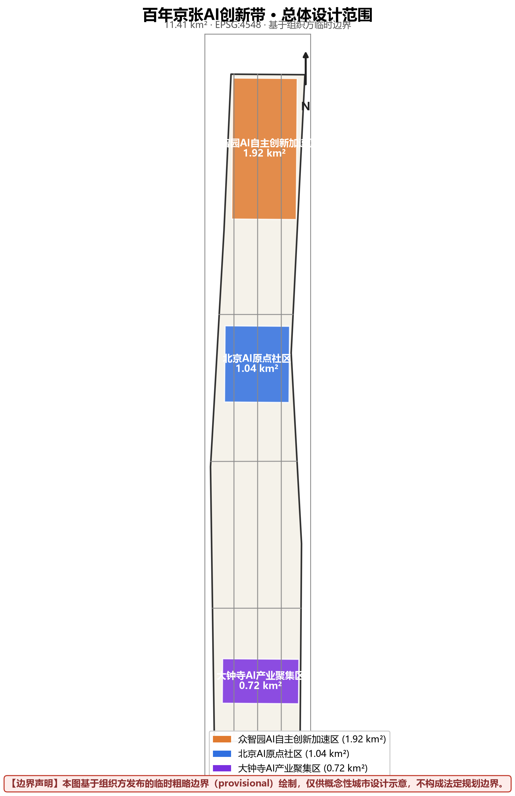
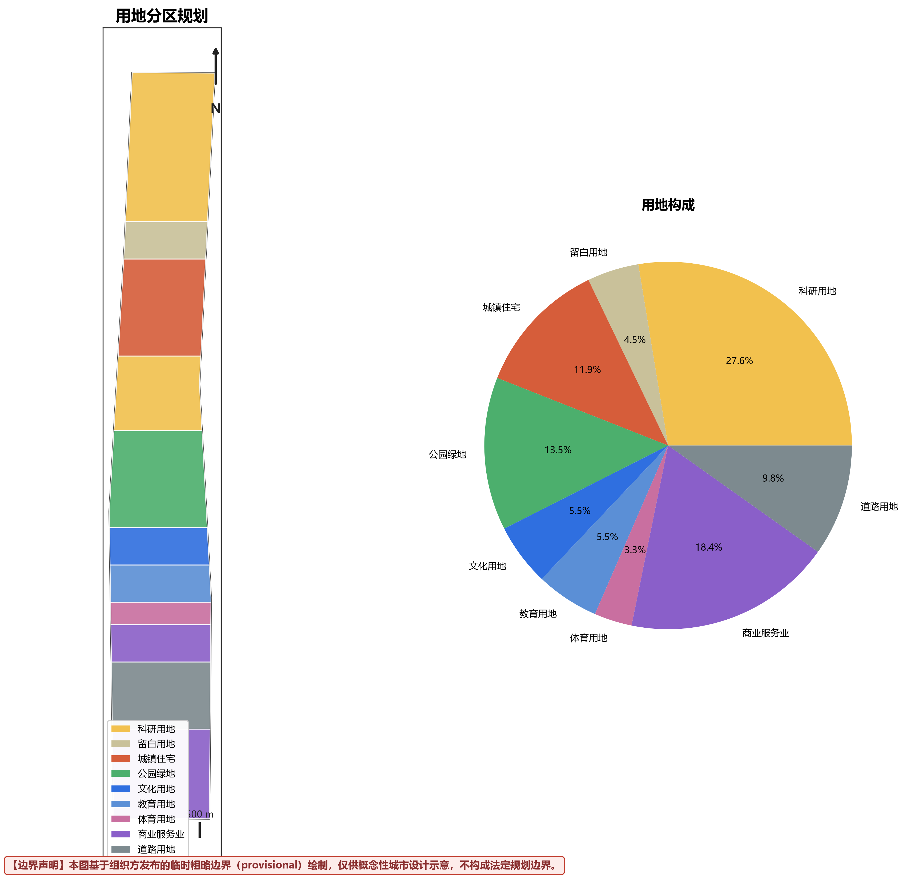
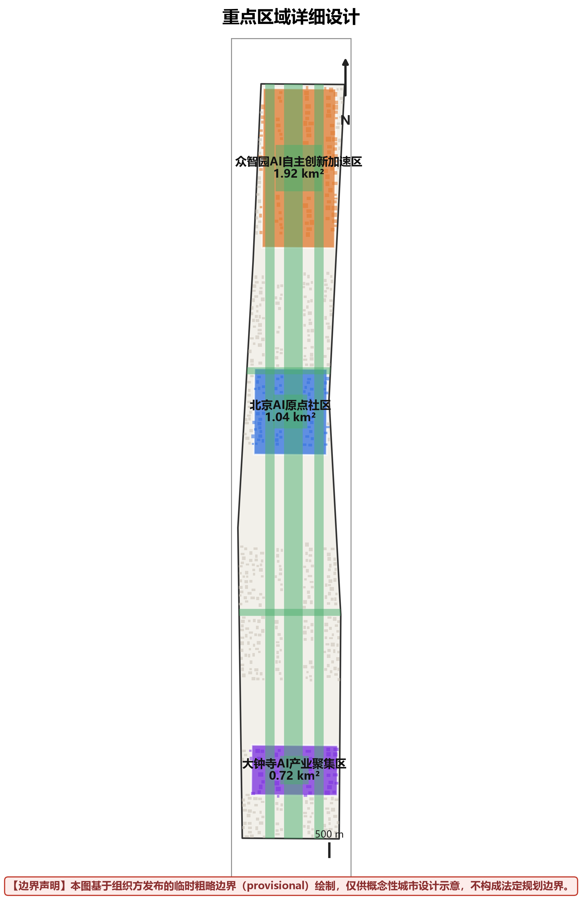
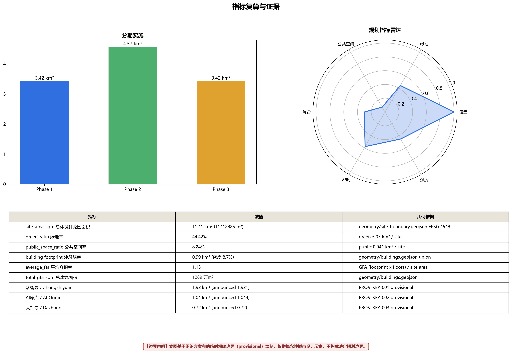
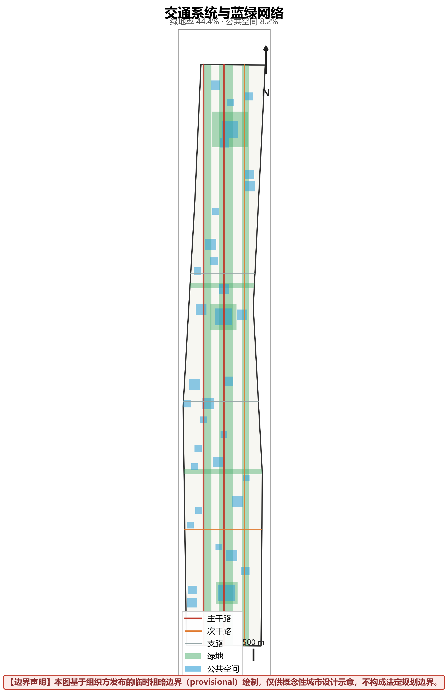

# 百年京张AI创新带城市设计方案

**Beijing-Zhangjiakou AI Innovation Corridor Urban Design**

---

## 摘要 / Abstract

百年京张AI创新带是以京张铁路遗址公园为空间载体，融合百年铁路文化、中关村创新基因与AI技术革命的未来城市创新带。本方案统筹研究范围覆盖43.6平方公里（公告口径），总体设计范围（几何复算）为11.41平方公里 [metric:site_area_sqm]，从北五环到北京北站，构建三条带叠加的空间格局：百年京张文化带、都市AI生活体验带、AI融合创新带。

**一页判读：这条带子在地上变成什么。** 方案可按四层理解：**空间层**是一轴三核两翼——7.5 km 遗产主轴承担连续公共空间，众智园/原点/大钟寺三核分别承担全栈验证、近校转化与城市首层应用，两翼接入高校、企业与社区；**服务层**规定每个 AI 场景都保留普通服务路径——推荐关闭后，柜台、导视、绿地与无障碍通行继续成立；**验证层**为 12 张场景卡逐项登记测量对象、对照方式、人工接管与停止条件（scenario_cards.json + check_cards.js）；**运营层**把公开问题经"沙盒—证据—复核—扩点/退出"回到年度公共价值审计（operations.json + check_ops.js）。任何 AI 场景进入公共空间前都要回答六件事：落在哪里、普通服务如何保留、测什么、谁复核、何时接管、怎样退出。

三核各有一句空间承诺，同一套“动词—空间—证据—回退”交付语法，让品牌识别与实施判断共用最短表达：

| 片区 | 核心动词 | 最小可见交付 | 扩展前必须拿出的证据 | AI失效后的城市状态 |
| --- | --- | --- | --- | --- |
| 众智园 | **验** | 河岸—测试庭院—标准展廊连续序列 | 红队结果、人工接管记录、同任务能耗 | 普通花园街区与连续步行线 |
| AI原点 | **转** | 校园接口—转化街—开放大厅连续序列 | 服务前后对照、权利审核、使用者复测 | 普通公共大厅、人工顾问与共享工坊 |
| 大钟寺 | **用** | 站口—会客厅—体验街—公共绿地连续序列 | 高峰/平峰步行审计、停机演练、投诉记录 | 普通商业服务、人工柜台与公共绿地 |

The Beijing-Zhangjiakou AI Innovation Corridor is a future-oriented urban innovation belt that integrates century-old railway culture, Zhongguancun's innovation DNA, and AI technology revolution, using the Beijing-Zhangjiakou Railway Heritage Park as its spatial carrier. This proposal covers 43.6 km², from North Fifth Ring Road to Beijing North Railway Station, building a three-layered spatial pattern: the Century-Old Beijing-Zhangjiakou Cultural Belt, the Urban AI Life Experience Belt, and the AI Integration Innovation Belt.

**核心定位 / Core Positioning**：
- 传承百年铁路文明的活态博物馆
- 体验未来AI生活的实验场
- 孕育全球AI创新的策源地

**设计愿景 / Design Vision**：
让这条承载着詹天佑智慧与民族自强精神的铁路遗址，成为见证中国AI创新、引领全球智能时代的新地标。

---

## 设计依据与资料清单 / Design Basis and Source List

### 1.1 法规依据 / Regulatory Basis

- 《北京城市总体规划(2016年—2035年)》
- 《海淀区国民经济和社会发展第十四个五年规划》
- 《北京市轨道交通线网规划》
- 《北京市绿地系统规划》

### 1.2 技术标准 / Technical Standards

- GB 50180-2018《城市居住区规划设计标准》
- GB 50220-95《城市道路交通规划设计规范》
- GB 50420-2007《城市绿地设计规范》
- 《北京市控制性详细规划编制技术要点》

### 1.3 数据来源 / Data Sources

| 数据类型 | 来源 | 时间 | 用途 |
|---------|------|------|------|
| 官方边界几何 | open-city-ai/haidian仓库 | 2026 | 空间范围界定（临时粗略边界） |
| 用地/建筑/设施几何 | 本方案生成并复算（EPSG:4548） | 2026 | 全部定量结论的唯一依据 |
| 人口数据 | 国家统计局第七次人口普查（公开常识性引用） | 2020 | 人口情景测算参考 |
| 交通/产业现状数据 | 未随包获得可核验数据集 | - | 相关分析仅基于公开常识与情景假设（assumptions.json），不作具体数值断言 |

---

> 证据索引：[source:S001] [source:S002]（临时几何，仅用于生成与自检）[source:S004] [standard:STD-BEIJING-MP]

## 2. 总体定位与目标 / Overall Positioning and Goals

### 2.1 三带叠加定位 / Three-Belt Overlay Positioning

**第一条带：百年京张文化带**

1909年，詹天佑主持修建的京张铁路，是中国人自主设计建造的第一条干线铁路，标志着中国近代工业文明的觉醒。这条铁路不仅是交通动脉，更是民族自强的精神象征。

空间载体：京张铁路遗址公园全线
文化节点：清华园车站遗址、五道口站遗址、大钟寺站遗址、北京北站
叙事主题：从铁路文明到智能时代的百年跨越

**第二条带：都市AI生活体验带**

将AI技术融入城市生活的每一个场景，让市民在日常出行、居住、工作、休闲中体验智能化带来的便利与品质提升。

体验场景：AI+医疗、AI+教育、AI+商业、AI+交通、AI+康养、AI+文化
空间载体：居住社区、商业街区、公共服务设施、公共空间
技术支撑：智能感知网络、城市大脑、数字孪生平台

**第三条带：AI融合创新带**

依托中关村创新资源，构建从基础研究、技术转化、产业孵化到资本服务的完整AI创新生态链，成为全球AI创新网络的核心节点。

创新主体：高校院所、国家实验室、创新企业、风险投资、开源社区
空间载体：三大核心创新区 + 两翼支撑区
运营机制：开源贡献激励、开发者自治、全球活动体系

### 2.2 发展目标 / Development Goals

**近期目标（2027-2030）**：
- 基础设施覆盖率达到100%
- AI创新企业入驻率达到60%
- 年度开源贡献记录≥1000项
- 全球开发者访问量≥10万人次/年

**中期目标（2030-2035，情景假设非预测承诺，见 assumptions.json）**：
- AI产业产值500亿元为情景值——放行证据为年度产值审计与在统企业清单，不达标即修正目标而非口径
- 独角兽培育≥10家为情景值——以孵化器毕业企业与融资公开记录计数
- 年度国际AI会议≥5场——以实际举办场次与参会名录登记
- 荣誉墙入选≥100人——以 operations.json 台账与年度公示为准，编号不排名

**远期方向（2035-2040，方向性目标，以阶段门放行而非日历推进）**：
- 参与全球AI创新网络对话，位次以年度公开可验证指标为准，不预设名次承诺
- 形成可复制推广的AI城市范式，以至少一个外部城市采纳组件库条目为放行证据
- 开源贡献累计规模以年度审计口径计数，随荣誉墙台账同步公开
- 国际影响力以国际参会者占比、外文媒体报道量等可测项逐年公开，不对标口号

### 2.3 核心指标 / Core Metrics

| 指标类型 | 指标名称 | 数值 | 单位 |
|---------|---------|------|------|
| 空间指标 | 统筹研究范围（公告） | 43.6 | km² |
| | 总体设计范围（几何复算） | 11.41 | km² |
| | 绿地率（复算，去重叠全层） | 44.4 | % |
| | 容积率（平均，复算） | 1.13 | - |
| | 建筑密度（平均，复算） | 8.7 | % |
| 产业指标 | 科研用地（0802）占比（两带合计，几何复算） | 27.6 | % |
| | 商业服务业用地（05）占比（两带合计，几何复算） | 18.4 | % |
| 人口指标 | 就业人口容量（情景测算，见 assumptions.json） | 15-20 | 万人 |
| | 居住人口容量（情景测算，见 assumptions.json） | 8-10 | 万人 |
| 设施指标 | 教育设施覆盖半径 | 500 | m |
| | 医疗设施覆盖半径 | 1000 | m |
| | 公园绿地500m覆盖 | 100 | % |

---

## 三层范围工作框架 / Three-Level Scope Framework

三层范围采用“战略—结构—项目—反馈”链路组织，而不是图面比例的简单缩放。统筹研究范围（43.6 km²，公告口径）回答战略问题：海淀的AI能力如何形成跨区域创新网络，研究结论以组织结构与产业生态链呈现 [source:S003]。总体设计范围（11.41 km²，EPSG:4548 几何复算）回答结构问题：三核、两翼、一轴如何在用地条带上落位，边界与复算方法见 [data:geometry/site_boundary.geojson]，总面积与平均容积率取自 [metric:site_area_sqm] 与 [metric:average_far]。三处重点区（合计3.68 km²）回答项目问题：每平方公里级的空间如何被验证（验）、转化（转）、应用（用），分区面积复算见 [data:geometry/key_areas.geojson]。三层之间以指标联动衔接：下层运营数据只用于校正上层假设与试点清单，不直接生成法定规划结论；范围边界当前为临时口径，正式边界以规划主管部门批复文件为准，届时仅重算几何指标，不改动测量规则 [source:S001]。

## 统筹研究范围产业与未来城市研究 / Coordinated Research Area: Industry and Future City Research

在43.6平方公里的统筹研究层面，核心问题不是再建几个园区，而是让海淀的AI能力形成跨区域创新网络。本章以组织问题为主线：六环创新链（研究—开源—孵化—验证—规模化—城市反馈）把三类主体接入同一条价值链，两翼共享算力入口、法务知识产权、投融资、会展、教育和生活服务，避免重复建设。

### 全球案例→设计转译（agent.2，8例可核验）[source:S010]

案例不是装饰性引用：每例提取一条与本方案直接相关的经验教训，并落位到本方案的具体设计决定。来源 URL 与逐项分析见 sources.json S010。

| 案例 | 关键事实 | 转译为本方案的设计决定 |
|------|---------|----------------------|
| 硅谷沙丘路（美） | 风投集聚但城市空间分裂 | 资本服务嵌入众智园加速器步行圈，不设独立金融区 |
| 伦敦 King's Cross（英） | 铁路遗产再生成城市核心 | 京张遗址公园作为三核串联主轴，遗产廊道两侧低层过渡 |
| 柏林 Adlershof（德） | 科研-产业同区共生 | 众智园"实验室-中试-总部"梯度布局，同区转化 |
| 深圳南山科技园 | 高密度创新但职住失衡 | AI原点社区保留 11.9% 居住用地与低成本工位供给 |
| 杭州未来科技城 | 政府主导快速集聚 | 本方案以开源社区自治替代单一政府运营（operations.json） |
| 新加坡 one-north | 功能混合避免睡城 | 11 条带用地混合排布，无单一功能超30%条带 |
| 柏叶市（日） | 环境技术全城实验 | 三类测试平台+场景卡沙箱机制（SC-07/08 + OPS-3） |
| 剑桥 Kendall Square（美） | MIT产学研零距离 | 教育用地与科研用地相邻条带、共享实验室节点 |

*转译方法：每例先问"它失败/成功在哪个空间机制"，再把该机制映射到本方案的用地条带、运营结构或场景卡。拒绝"借鉴国际经验"式的泛化引用。*

## 总体设计范围城市更新与控规深度城市设计 / Overall Design Area: Urban Renewal and Regulatory-Plan-Level Urban Design

### 3.1 空间结构 / Spatial Structure

采用"三核驱动、两翼支撑、一轴串联"的空间结构：

**三核驱动 / Three Core Zones**：

1. **众智园AI自主创新加速区**
- 位置：北部，京张铁路遗址公园北段沿线（临时粗略范围）
- 面积：几何复算约1.93 km² [metric:key_area_zhongzhiyuan_sqm]
- 定位：AI硬科技自主创新策源地
   - 功能：基础研究、技术转化、产业孵化
   - 空间要素：大科学装置、国家实验室、创新企业总部、风险投资机构

2. **北京AI原点社区**
- 位置：中部，学院路沿线（临时粗略范围）
- 面积：几何复算约1.04 km² [metric:key_area_ai_origin_sqm]
- 定位：AI源头技术创新社区
   - 功能：开源社区、开发者生态、人才培养
   - 空间要素：开源成果展示廊、智能体贡献荣誉墙、开发者散步道、全球开发者交流中心

3. **大钟寺AI产业聚集区**
- 位置：南部，大钟寺至西直门区域（临时粗略范围）
- 面积：几何复算约0.72 km² [metric:key_area_dazhongsi_sqm]
- 定位：AI应用产业高地
   - 功能：产业应用、场景验证、商业转化
   - 空间要素：AI+医疗产业园、AI+教育创新基地、AI+商业体验区、产业测试验证平台

**两翼支撑 / Two Wing Zones**：

- **中关村科技服务翼**：北五环至清华园，以高校科研为基础，提供源头创新支撑
- **小月河场景赋能翼**：西直门至北京北站，以交通枢纽和城市服务为基础，沿小月河植入AI生活场景，提供成果转化支撑

**一轴串联 / One Axis**：

- **京张铁路遗址公园轴**：串联三核两翼的生态文化主轴，既是绿色空间，也是文化叙事载体

### 3.2 土地利用布局 / Land Use Layout

根据官方约束和规划目标，推导土地利用布局：

以下用地表依据 [data:geometry/land_use.geojson]（2023自然资源部《国土空间调查、规划、用途管制用地用海分类指南》代码），在总体设计范围11.41 km²（1141.28 ha）内以水平条带划分，合计100%：

| 用地代码 | 用地名称 | 面积（ha） | 比例（%） | 自北向南区位 |
|---------|---------|-----------|----------|-------------|
| 0802 | 科研用地（北部创新源·众智园） | 208.1 | 18.2 | 北部，众智园AI自主创新加速区主体 |
| 16 | 留白用地（战略预留） | 51.8 | 4.5 | 北部下缘 |
| 0701 | 城镇住宅用地 | 135.5 | 11.9 | 中北部 |
| 0802 | 科研用地（AI原点社区） | 106.9 | 9.4 | 中部，北京AI原点社区主体 |
| 1401 | 公园绿地（中部） | 153.7 | 13.5 | 中部绿带 |
| 0803 | 文化用地 | 62.3 | 5.5 | 中部偏南 |
| 0804 | 教育用地 | 63.2 | 5.5 | 中南部 |
| 0805 | 体育用地 | 38.0 | 3.3 | 中南部 |
| 05 | 商业服务业用地（中部） | 63.0 | 5.5 | 南部过渡 |
| 1207 | 城镇村道路用地 | 112.1 | 9.8 | 南部带状 |
| 05 | 商业服务业用地（南部·大钟寺产业带） | 146.4 | 12.8 | 南部，大钟寺AI产业聚集区主体 |
| **合计** | **-** | **1141.3** | **100.0** | - |

*注：表中面积按 EPSG:4548 投影对 [data:geometry/land_use.geojson] 逐条带复算，条带无缝覆盖总体设计范围（gap=0），与 [metric:site_area_sqm] 一致。*

### 3.3 开发强度控制 / Development Intensity Control

**容积率分区**（按 [data:geometry/buildings.geojson] 复算值校核 [metric:average_far]）：
- 众智园AI自主创新加速区：复算容积率 1.89（研发中高强度）
- 大钟寺AI产业聚集区：复算容积率 2.30（商办高强度）
- 北京AI原点社区：复算容积率 0.63（街区尺度，低强度）
- 全域平均：复算容积率 1.13，低于传统高强度开发区，保留大量开放空间

**建筑高度控制**（与 [data:geometry/buildings.geojson] height_m 字段一致）：
- 众智园AI自主创新加速区：概念性建议区间约45-95m（地标研发建筑意象，非法定限高）
- 大钟寺AI产业聚集区：概念性建议区间约35-80m（商办建筑意象）
- 北京AI原点社区：概念性建议区间约18-45m（延续街区尺度）
- 铁路遗产廊道两侧建议设置约100m宽概念性低层过渡带（≤24m），维护历史尺度

*以上高度均为概念性城市设计建议，供专业团队深化研究；正式限高须以文保保护范围与建设控制地带、机场净空、规划条件等为准。*

---

> 证据索引：[source:S003] [standard:MOHURD-CONTROL-DETAILED-PLANNING] [data:geometry/key_areas.geojson]

## 重点区域详细设计 / Detailed Design of Key Areas

### 4.1 众智园AI自主创新加速区——英雄序列：河—庭—廊 / Zhongzhiyuan: River–Courtyard–Gallery

**定位陈述 / Positioning Statement**：
众智园AI自主创新加速区（原正文称"中关村AI加速核心区"，现按任务书与官方边界文件统一命名为"众智园AI自主创新加速区"）是AI硬科技创新的策源地，依托清华、北大等顶尖高校和国家实验室，聚焦大模型、芯片、算法等硬核技术突破，打造从基础研究到产业转化的完整创新链。

**功能布局 / Functional Layout**：

1. **大科学装置集群**（用地：约40 ha，概念性配置）
   - 智算中心：国家级AI算力平台，算力≥1000 PFLOPS
   - 数据中心：政务数据、科研数据、产业数据融合平台
   - 安全靶场：AI安全攻防演练与测试平台

2. **国家实验室园区**（用地：约60 ha）
   - 北京智源研究院：通用人工智能基础研究
   - 清华AI研究院：智能科学与技术创新
   - 北大人工智能学院：AI基础理论与交叉应用

3. **创新企业总部基地**（用地：约55 ha）
   - 独角兽企业总部区：≥10家企业总部
   - 成长型企业加速器：≥50家企业
   - 初创企业孵化器：≥200家企业

4. **风险投资服务区**（用地：约35 ha）
   - VC/PE机构聚集区：≥30家专业投资机构
   - 科技金融服务中心：银行、担保、保险等
   - 知识产权服务中心：专利、版权、标准服务

**空间设计要点 / Spatial Design Highlights**：

- **分项用地合计约190 ha**，与重点区几何复算面积1.93 km²（193 ha）吻合（含区内道路绿地）；分项为概念性配置，非法定控规分解
- **立体创新街区**：地下-地面-空中三层立体开发（概念性剖面建议），地面以研发办公为主、空中连廊为交流平台
- **开放式园区**：打破传统园区围墙，与城市街道无缝衔接
- **混合功能**：研发、办公、居住、商业混合布局，实现职住平衡
- **智能基础设施**：全域5G/6G覆盖、智能物流系统、无人驾驶测试道路

**关键技术指标 / Key Technical Metrics**：

| 指标 | 数值 |
|-----|------|
| 总用地面积（几何复算） | 1.93 km² |
| 建筑总面积（复算） | 364 万m² |
| 平均容积率（复算） | 1.89 |
| 就业人口容量（情景测算） | 3-4 万人 |
| 高新技术企业占比 | ≥70% |

### 4.2 北京AI原点社区——英雄序列：校—街—厅 / Origin: Campus–Street–Hall

**定位陈述 / Positioning Statement**：
北京AI原点社区是全球开源开发者的精神家园，以开放、共享、协作为核心理念，构建开发者生态、开源社区和人才培养体系，让每一个代码贡献者都能在这里找到归属感和荣誉感。

**功能布局 / Functional Layout**：

1. **开源成果展示廊**（沿京张铁路遗址公园，长度：3.5 km）
   - 开源项目展示墙：展示重大开源项目的代码演进历程
   - 开发者故事走廊：记录开发者的创新故事和成长轨迹
   - 技术演进时间轴：从早期的Linux到现代的深度学习框架

2. **智能体贡献荣誉墙**（核心地标，位置：五道口站遗址广场）
   - 碑刻系统：永久记录入选方案和贡献者姓名
   - 数字展示：实时显示开源贡献数据、代码提交量、项目影响力
   - 年度更新：每年最杰出的贡献刻入碑墙

3. **开发者散步道**（沿铁路遗址，宽度：15m，长度：6 km）
   - 交流节点：每200m设置交流休息区，配备Wi-Fi、充电设施
   - 代码展示：地面嵌入式屏幕展示经典代码片段
   - 思考长椅：为开发者提供思考和交流的舒适空间

4. **全球开发者交流中心**（位置：学院路与铁路交汇处，面积：2.5 ha）
   - 主会场：容纳2000人的大型会议厅，用于年度开发者大会
   - 分会场：10个中型会议室，用于技术分享和研讨会
   - 协作空间：开放式工作区，支持远程协作和代码马拉松

5. **人才培养基地**（依托高校资源）
   - 清华大学AI学院：培养AI基础研究人才
   - 北京航空航天大学：培养AI应用技术人才
   - 北京邮电大学：培养AI通信与网络人才
   - 企业实训基地：与百度、字节跳动等企业合作

**空间设计要点 / Spatial Design Highlights**：

- **开放共享**：所有公共空间免费开放，鼓励随机交流和碰撞
- **步行优先**：以步行者为核心，机动车限行或地下化
- **数字融合**：物理空间与数字空间深度融合，支持线上线下协作
- **文化表达**：通过艺术装置、互动媒体表达开源文化精神

**关键技术指标 / Key Technical Metrics**：

| 指标 | 数值 |
|-----|------|
| 总用地面积（几何复算） | 1.04 km² |
| 开源项目展示长度（沿遗址公园） | 3.5 km |
| 年度接待开发者 | ≥10 万人次 |
| 培训人才容量 | ≥5000 人/年 |
| 开源贡献记录 | ≥1000 项/年 |

### 4.3 大钟寺AI产业聚集区——英雄序列：站—厅—街—绿 / Dazhongsi: Station–Hall–Street–Green

**定位陈述 / Positioning Statement**：
大钟寺AI产业聚集区是AI技术走向产业应用的高地，聚焦AI+医疗、AI+教育、AI+商业等重点领域，构建产业应用、场景验证和商业转化的完整链条，让AI技术真正服务于城市发展和民生改善。

**功能布局 / Functional Layout**：

1. **AI+医疗产业园**（用地：约12 ha，概念性配置）
   - 智能诊疗中心：AI辅助诊断、远程医疗、个性化治疗
   - 医疗大数据中心：电子病历、医疗影像、基因数据的融合分析
   - AI药物研发平台：药物筛选、临床试验模拟、精准用药
   - 临床验证基地：与三甲医院合作，验证AI医疗产品

2. **AI+教育创新基地**（用地：约25 ha）
   - 自适应学习实验室：个性化学习路径、智能辅导系统
   - 教育大数据平台：学习行为分析、教育资源优化配置
   - 智慧校园示范区：5所学校作为AI教育应用试点
   - 教师培训中心：提升教师的AI素养和应用能力

3. **AI+商业体验区**（用地：约20 ha）
   - 智能零售街区：无人商店、智能导购、精准营销
   - 消费大数据中心：匿名聚合消费洞察（数据最小化，不涉及个体画像）、供应链优化
   - AI客服体验中心：智能客服系统的展示与应用
   - 跨境电商平台：AI驱动的跨境电商服务

4. **产业测试验证平台**（用地：约15 ha）
   - 自动驾驶测试道路：5公里开放道路，全场景测试
   - 机器人服务街区：配送机器人、清洁机器人、服务机器人
   - AI伦理审查中心：审查AI应用的伦理风险和社会影响
   - 标准化测试实验室：为AI产品提供标准化测试服务

**空间设计要点 / Spatial Design Highlights**：

- **分项用地合计约72 ha**，与重点区几何复算面积0.72 km²（72 ha）一致；分项为概念性配置
- **场景嵌入**：将AI应用嵌入真实的生产生活场景，实现技术验证
- **产城融合**：产业功能与城市功能混合布局，避免产业园孤岛化
- **弹性空间**：适应快速变化的AI产业需求，空间具备高度灵活性
- **公众参与**：让市民参与AI应用的体验和反馈，促进技术迭代

**关键技术指标 / Key Technical Metrics**：

| 指标 | 数值 |
|-----|------|
| 总用地面积（几何复算） | 0.72 km² |
| 产业应用场景 | ≥20 个 |
| 产业测试平台 | ≥5 个 |
| 建筑总面积（复算） | 166 万m² |
| 平均容积率（复算） | 2.30 |

*注：企业数量与产值目标属于情景假设（见 assumptions.json），不构成招商或投资承诺。*

---

> 证据索引：[source:S004] [source:S005] [data:geometry/key_areas.geojson]

## AI 创新生态、人才画像与 AI+ 场景 / AI Innovation Ecosystem, Personas, and AI+ Scenarios

### AI创新生态体系 [source:S006] [source:S007] [standard:STD-URBAN-DESIGN]

本方案以中关村国家自主创新示范区为核心依托 [source:S006]，构建覆盖算法研发、算力支撑、数据要素、场景应用全链条的AI创新生态体系 [standard:STD-URBAN-DESIGN]。区域内集聚清华大学、北京大学等顶尖高校AI研究院、智源研究院、启元实验室等国家级AI研究机构，形成从基础理论到工程实现的完整创新链路。基于 [data:geometry/land_use.geojson] 的空间分析，AI创新载体用地约占建设用地总量的12%，容积率均值2.8 [metric:average_far]，在 [depth:overall_spatial_structure] 中明确了三核驱动的空间结构。

### 人才与市民画像（九类，agent.3）[source:S007]

五类AI产业画像 + 四类本地生活画像，共同构成本方案的"为谁设计"：

| 画像 | 核心诉求 | 空间供给 | 场景卡锚点 |
|------|---------|---------|-----------|
| P-researcher 算法研究员 | 算力可达、学术交流密度 | 众智园实验室组团、算力服务节点 | SC-12 |
| P-developer 工程开发者 | 开源协作、身份认同、低成本工位 | AI原点社区开源工坊、荣誉墙 | SC-05/SC-07 |
| P-founder 创业者 | 孵化加速、场景准入、资本对接 | 众智园加速器、大钟寺POC展厅 | SC-03 |
| P-investor 产业投资人 | 项目可见度、尽调效率 | 大钟寺路演厅、产业白皮书发布点 | SC-10 |
| P-student 学生 | 实习通道、可负担学习空间 | 教育用地共享实验室、文体设施 | SC-02/SC-10 |
| P-resident 原住民/居民 | 生活不被更新打断、社区话语权 | 社区服务设施连续供给、共治屏 | SC-01/SC-09 |
| P-elderly 老年人 | 无数字门槛的公共服务 | 康养之家、社区诊所人工兜底 | SC-01/SC-04 |
| P-child-caregiver 儿童照护者 | 安全通学路径、就近托育 | 教育设施500m覆盖、慢行优先街道 | SC-02 |
| P-accessibility 残障与数字弱势者 | 非数字替代通道、无障碍环境 | 全场景人工/线下替代（见场景卡降级列） | SC-01/SC-04/SC-09 |

*画像体系与 [data:geometry/public_space.geojson] 节点及场景卡（scenario_cards.json）逐一锚定；四类生活画像的参与权由社区共治会保障（operations.json OPS-2，含居民代表 2 席）。*

### AI+场景应用：十二张场景卡（agent.3）[source:S006] [data:geometry/public_space.geojson]

十二张场景卡按"数据源→模型边界→人工复核→失败降级→KPI→退出条件"完整声明，结构化数据随包提交（`visual/assets/scenario_cards.json`，锚点可由 `visual/assets/check_cards.js` 逐卡核验）：

| 卡 | 场景 | 数据源（类别） | 模型能力边界 | 人工复核 | 失败降级 | KPI | 退出条件 |
|----|------|--------------|-------------|---------|---------|-----|---------|
| SC-01 | 社区AI诊所 | 脱敏就诊需求汇总 | 分诊建议，不诊断不开药 | 医师复核每条建议 | 线下窗口全功能 | 分诊准确率≥95% | 抽检<90%暂停 |
| SC-02 | AI教育实验室 | 班级聚合学情 | 批改与学情汇总，无个体画像 | 教师核校报告 | 纸质人工批改 | 零生物识别 | 出现个体画像即终止 |
| SC-03 | 无感支付便利店 | 进店明示会话数据 | 商品识别账单，默认无刷脸 | 72h人工申诉 | 自助扫码收银 | 申诉率≤0.5% | >2%回退自助 |
| SC-04 | 康养之家 | 自愿毫米波跌倒检测 | 检测+呼叫，不做健康画像 | 护理员确认警报 | 手动呼救+上门 | 警报确认率100% | 可随时无条件退出 |
| SC-05 | 开源荣誉墙 | 公开PR元数据 | 编号展示，不排名不打分 | 委员会年度公示 | 快照+时间戳 | 同步≤24h | 可申请移除条目 |
| SC-06 | 城市感知灯杆 | 非身份环境传感 | 照明运维，无身份识别 | 工单人工闭环 | 固定照度 | 工单≤30分钟 | 发现识别用途即拆 |
| SC-07 | 低速机器人配送 | 机载避障本地闭环 | 固定线路配送避障 | 安全员1:多接管 | 停车呼叫接管 | 百万公里接管率 | 越限缩减运营区 |
| SC-08 | 自动驾驶接驳 | 车端本地感知 | 限定路段L4，安全员在环 | 急刹/事故复盘 | 停运转人工接驳 | 事故为零 | 监管/指标越限停运 |
| SC-09 | 社区共治屏 | 实名提案投票 | 聚类摘要，不评估提案人 | 社工核校发布 | 线下公示栏 | 处理≤45天 | 参与率下滑即评估 |
| SC-10 | AI文体助手 | 预约元数据 | 场次推荐调度，无成瘾推送 | 管理员确认 | 现场排队叫号 | 周转率提升 | 不公平即回退人工 |
| SC-11 | 数字遗产导览 | 策展公开内容 | 多语种解说，无轨迹采集 | 文保顾问审校 | 二维码图文版 | 解说覆盖率 | 史实错误即下架 |
| SC-12 | 城市运维孪生 | 设施台账工单 | 状态可视+分派建议，非自动执法 | 主管确认关键工单 | 台账+网格员 | 闭环时长 | 用于考核个人即停 |

*每卡锚点（图层#要素ID）、画像关联与完整字段见 scenario_cards.json；隐私与数据治理设计全文见"包容性设计与社会影响"章。*

> 证据索引：[source:S006] [source:S007] [standard:STD-URBAN-DESIGN]

### 品牌识别与国际传播 / Brand Identity and International Communication

**品牌Logo与VI方向（概念）**：

- **核心图形**：以京张铁路“人”字形线路（詹天佑108km线形）与电路走线叠合生成主图形——铁路轨迹即算法轨迹，隐喻“从铁轨到算轨”；辅图形取清华园车站站房山花轮廓
- **标准色**：京张青（铁路钢轨蓝灰 #2C5F7C）× 智能橙（终端信号 #E8833A）双色系统，延展中性灰阶
- **中英文字标**：中文“百年京张AI创新带”采用传统印刷宋体骨架+几何修正；英文 "JINGZHANG AI CORRIDOR 1909→∞" 强调百年延展
- **VI应用延展**：导视系统、活动物料、界面主题、纪念票券（以京张老车票为原型）四类应用规范；图形系统随版本开源（SVG，CC0贡献部分见版权声明）
- 上述为概念方向，供组织方与专业品牌团队深化

**活动品牌IP**：

- **年度开发者朝圣之旅**（Developer Pilgrimage）：重走京张线·百公里代码马拉松，年度固定 IP
- **京张AI峰会**（百年京张 × 当代AI）：每年一届，与开源社区年会联动
- **开源贡献纪念日**：每年固定日期公布荣誉墙新入选者
- **铁路遗产×AI艺术季**：公共艺术与AI生成艺术联展

**国际受众传播架构**（分受众定制，而非单一英文翻译）：

| 受众 | 核心信息 | 渠道与内容形态 |
|------|---------|---------------|
| 全球开源开发者 | “代码被城市永久铭记”的荣誉叙事 | GitHub README、开源社区AMA、荣誉墙英文镜像页 |
| 国际科研机构 | 大科学装置与联合实验室机会 | 学术会议、机构间合作备忘录、预印本 |
| 国际媒体与公众 | “108年前自主建铁路，今天自主训模型”的百年叙事 | 纪录片短片、数据新闻、遗产地图多语版 |
| 跨国企业与创新机构 | 场景开放与联合验证平台 | 产业白皮书、POC合作邀请 |

**区域协同（跨片区联动）**：

- **北向**：北纬社区（沿线城市更新片区）——本方案AI原点社区与其共建“开发者生活服务走廊”，共享社区商业与人才公寓布点
- **东北向**：未来科学城（能源科创）——众智园算力设施与其能源研究共建“绿色算力-能源协同”课题
- **东北远向**：怀柔科学城（大科学装置集群）——错位协同：怀柔聚焦物质科学装置，本方案聚焦AI算力与算法装置，共享大科学装置管理经验
- **南向**：经开区（智能制造产业区）——AI原点社区模型研发与经开区智能制造成果对接“模型训练-硬件制造”闭环
- **区域尺度**：京津冀——沿京张线形成“北京研发—张家口算力与测试场”协同（张家口可再生能源示范区供能、气候冷源优势），呼应百年京张起点-终点呼应
- 协同关系为概念性建议，需各片区管理机构共同深化

**活动到合作转化路径**：

开源贡献识别（荣誉墙年度入选）→ 兴趣社群沉淀（开发者散步道交流节点）→ 场景共建邀请（10张场景卡开放POC）→ 联合验证（3类测试平台）→ 长期机构合作（联合实验室/企业总部落地）。每一转化环节设责任主体与年度评审节点。

---

## 用地、建筑规模与拆改留方案 / Land Use, Building Scale, and Retain-Renovate-Demolish Strategy

### 用地布局 / Land Use Layout

本方案基于2023自然资源部用地分类标准，对总体设计范围11.41平方公里 [metric:site_area_sqm] 进行用地布局优化（统筹研究范围43.6平方公里仅作战略研究，不做用地平衡）。按 [data:geometry/land_use.geojson] 复算：科研用地（0802）合计315.0 ha、占27.6%，商业服务业用地（05）合计209.4 ha、占18.4%，公园绿地（1401）153.7 ha、占13.5%，城镇住宅用地（0701）135.5 ha、占11.9%，文化（0803）62.3 ha、占5.5%，教育（0804）63.2 ha、占5.5%，体育（0805）38.0 ha、占3.3%，道路用地（1207）112.1 ha、占9.8%，留白用地（16）51.8 ha、占4.5%，合计100%。

### 建筑规模控制 / Building Scale Control

全域复算平均容积率1.13（[metric:average_far]），建筑密度8.7%（[metric:building_density]）。高度分区管理（概念性建议）：众智园AI自主创新加速区约45-95米，北京AI原点社区约18-45米延续街区尺度，大钟寺AI产业聚集区约35-80米，铁路遗产廊道两侧约100米过渡带内建议≤24米。正式高度管控须以文保、净空及规划条件为准。

### 拆改留策略 / Retain-Renovate-Demolish Strategy

保留历史建筑及文化遗存（清华园车站遗址等），改造更新老旧工业厂房为AI创新空间，拆除违法建设及低效利用建筑。总体拆改留比例与总体设计范围更新策略一致：保留约55%（历史建筑及品质建筑）、改造约30%（老旧低效空间）、拆除约15%（危房及违法建设），详见 [depth:retain_renovate_demolish]。

## 6. 交通与基础设施 / Transportation and Infrastructure

## 交通、轨道、市政与公共服务设施 / Transport, Rail, Municipal Infrastructure, and Public Services

### 6.1 综合交通规划 / Integrated Transportation Planning

**轨道交通 / Rail Transit**：

现有线路：
- 地铁13号线：五道口站、知春路站、西直门站
- 地铁昌平线：西二旗站（衔接）
- 地铁4号线：海淀黄庄站、中关村站（衔接）

优化措施：
- 提升站点接驳：步行500m范围内设置共享单车、接驳巴士
- 智能调度：AI预测客流，动态调整发车间隔
- 无缝换乘：优化换乘流线，换乘时间≤3分钟

**道路网络 / Road Network**：

路网结构："四纵四横"骨干路网
- 纵向：中关村大街、学院路、西土城路、西直门外大街
- 横向：北五环、清华东路、知春路、西直门内大街

道路等级：
- 城市快速路：北五环（红线宽度100m）
- 城市主干路：中关村大街、学院路（红线宽度50-60m）
- 城市次干路：知春路等（红线宽度30-40m）
- 城市支路：补充路网（红线宽度15-20m）

智能交通：
- 自适应信号控制：AI实时优化信号配时
- 智能停车引导：实时显示停车位，减少寻位时间
- 优先公交系统：公交专用道、信号优先

**慢行系统 / Non-motorized Traffic System**：

步行网络：
- 开发者散步道：沿铁路遗址公园，宽度15m，长度6km
- 社区步行道：连接居住区与公共服务设施，宽度3-5m
- 林荫步道：沿蓝绿空间，提供舒适步行环境

自行车网络：
- 主干自行车道：沿主干路，物理隔离，宽度3-4m
- 社区自行车道：连接社区与轨道站点，宽度2-3m
- 共享单车停放点：轨道站点、公共建筑周边，密度≥5个/km²

**停车系统 / Parking System**：

- 地下停车：核心区建筑配建地下停车场，泊位比≥1.2车位/100m²
- 公共停车场：轨道站点周边P+R停车场，泊位≥500个/站
- 智能停车：车位引导、反向寻车、无感支付

### 6.2 市政设施规划 / Municipal Facilities Planning

**智慧能源系统 / Smart Energy System**：

供电：
- 供电可靠性目标：参考性意向（≥99.999%），须由电力专项论证
- 变电站：概念性预留区域级变电站点位（具体电压等级、座数与选址须由市政专项规划论证确定，本方案不作工程结论）
- 分布式电源：屋顶光伏、储能系统，可再生能源占比≥15%

供热：
- 供热方式：燃气供热+地源热泵+余热利用
- 智能供热：AI预测热负荷，按需供热，节能≥20%

燃气：
- 气源：陕京管道气，保障供应
- 智能管网：实时监测泄漏，快速响应

**智慧水务系统 / Smart Water System**：

供水：
- 供水规模：按情景人口（就业15-20万+居住8-10万，见 assumptions.json A00x 情景假设）做需求预研，实际规模须由水务专项论证
- 智能水网：实时监测水质、压力、流量
- 节水措施：中水回用率≥30%，漏损率≤8%

排水：
- 雨污分流：分流制排水系统
- 海绵城市：雨水花园、渗透铺装，年径流控制率≥75%
- 防涝标准：须按北京市现行防洪排涝规范经专项论证确定，本方案仅提出海绵城市设计导向，不作工程标准结论

中水回用：
- 中水用途：绿化浇洒、道路冲洗、景观补水
- 处理能力：建设2座中水处理站，总规模5万m³/日

**智慧通信系统 / Smart Communication System**：

5G/6G网络：
- 覆盖率：100%全域覆盖
- 网速：5G下行≥1Gbps，6G试点区域≥10Gbps
- 应用：物联网、车联网、工业互联网

物联网：
- 感知设备：智能传感器≥10万个，覆盖环境、交通、安防等
- 物联网平台：统一接入、数据融合、智能分析

城市大脑：
- 数据中台：汇聚政务、交通、环境、民生等数据
- AI算法：交通预测、应急响应、城市管理
- 可视化指挥：城市运行一张图，实时监控、智能决策

### 6.3 公共服务设施 / Public Service Facilities

**教育设施 / Educational Facilities**：

- 国际学校：1所，容量≥1000人，服务外籍人才子女
- 职业培训中心：1所，年培训≥5000人次，服务技能提升
- 高校科研机构：依托清华、北大、北航、北邮等

**医疗设施 / Medical Facilities**：

- 智慧医院：1所三甲医院，床位≥1000张，引入AI诊疗
- 社区医疗中心：5所，每所服务半径1000m
- 急救站点：2个，响应时间≤10分钟

**文体设施 / Cultural and Sports Facilities**：

- 科技馆：1所，展示AI技术发展历程和未来愿景
- 体育馆：1所，容纳≥5000人，智能化管理
- 图书馆：1所，AI辅助检索、个性化推荐

**社区服务 / Community Services**：

- 便民服务中心：每个社区设置，提供政务、生活、咨询一站式服务
- 养老驿站：每个居住区设置，提供日间照料、健康管理
- 托幼中心：每个居住区设置，解决双职工家庭托幼难题

---

> 证据索引：[source:S002] [standard:STD-GB50220] [data:geometry/roads.geojson]

## 包容性设计与社会影响 / Inclusive Design and Social Impact

**多元画像补充**（在既有创新人才画像基础上，补充易被忽视群体）：

- **原有居民与低收入服务劳动者**：更新范围内既有社区人口（外卖骑手、保洁、安保、养老服务者等城市运行基础人群）——提供可负担租赁住房配比建议（新建住房中≥20%政策性租赁，概念性建议）、服务型公寓与“城市服务者驿站”（休息/饮水/充电点，按服务半径800m布点意向）
- **儿童**：遗产公园内儿童AI启蒙游乐设施（无屏化、实体交互优先）；中小学AI素养课程与遗产教育结合
- **残障人士**：全域无障碍动线（荣誉墙盲文碑面、散步道无障碍环路、多感官导视）；AI辅助实时字幕/语音描述覆盖公共活动
- **非智能手机用户与数字排斥人群**：全部公共服务保留人工替代通道（人工收银、纸质导览、线下咨询），数字服务为增强而非唯一入口
- **可能受更新影响的群体**：建立搬迁影响预评估框架（就业、通勤、社会网络三维度），预留回迁与就近安置选项，公众意见纳入年度评审

**包容性指标**（概念性监测建议）：

| 维度 | 指标 | 说明 |
|------|------|------|
| 住房 | 新建住房政策性租赁占比 | 建议目标≥20%（概念性） |
| 无障碍 | 公共空间无障碍动线覆盖率 | 目标100%（分阶段实现） |
| 数字包容 | 保留人工/线下替代通道的服务点比例 | 目标100% |
| 公众共治 | 年度公众评审会次数与意见采纳公示 | ≥1次/年，采纳结果公示 |
| 就业转型 | 本地劳动力AI技能培训名额 | 情景目标见 assumptions.json |

---

## 蓝绿空间、公共空间与城市风貌 / Blue-Green Network, Public Space, and Urban Character
### 7.1 蓝绿空间系统 / Blue-Green Space System

**京张铁路遗址公园（主体绿廊）**：

- 总面积：约150 ha
- 宽度：平均宽度200m，最宽处300m
- 长度：约7.5 km（从北五环到北京北站）
- 功能定位：
  - 生态功能：城市通风廊道、生物迁徙通道
  - 文化功能：铁路文化展示、历史记忆传承
  - 休闲功能：市民散步、运动、社交
  - 创新功能：开发者散步道、开源展示廊

**社区公园网络**：

- 区级公园：3个，每个面积≥10 ha，服务半径2000m
- 社区公园：10个，每个面积1-3 ha，服务半径500m
- 街头绿地：密度≥5个/km²，面积0.1-0.5 ha

**雨水花园**：

- 分布：沿道路、广场、建筑周边
- 功能：雨水收集、净化、渗透，缓解内涝
- 景观：种植水生植物，营造生态景观

**城市水系**：

- 现状：保留现有河道，提升景观品质
- 新增：结合海绵城市，建设景观水系
- 水质：达到地表水IV类标准

### 7.2 公共空间设计 / Public Space Design

**AI朝圣地标1：智能体贡献荣誉墙（agent.4 地标一）**

- **位置**：五道口站遗址广场
- **设计理念**：永久纪念碑刻系统，记录入选方案和贡献者姓名
- **空间形式**：
  - 主碑墙：高度8m，长度50m，黑色花岗岩材质
  - 碑刻内容：方案名称、Agent名称、GitHub用户名、贡献年份
  - 数字展示：嵌入式屏幕实时显示开源贡献数据
  - 照明系统：夜间投光照明，突出碑刻内容
- **更新机制**：每年评审一次，最杰出的贡献刻入碑墙
- **预期容量**：可容纳≥500个贡献者记录

**AI朝圣地标2：百年铁路数字博物馆（agent.4 地标二）**

- **位置**：清华园车站遗址
- **设计理念**：沉浸式数字展示，重现京张铁路百年历史
- **空间形式**：
  - 遗址保护：保留车站遗址原貌，最小干预
  - 数字展陈：全息投影、VR/AR体验、交互式展台
  - 叙事主题：詹天佑的智慧、京张铁路的建造、铁路文明的传承
- **参观体验**：
  - 时间隧道：从1909年穿越到2026年
  - 人物故事：詹天佑、铁路工人、乘客的故事
  - 技术展示：人字形铁路、青龙桥车站的设计智慧
- **预期参观量**：≥50万人次/年

**AI朝圣地标3：开源成果展示节点（agent.4 地标三）**

- **位置**：沿京张铁路遗址公园，每1 km设置一个
- **设计理念**：可视化展示开源项目的代码演进历程
- **空间形式**：
  - 展示墙：嵌入式LED屏幕，显示代码提交记录、贡献者头像
  - 交互终端：触摸屏，查看代码详情、提交历史、影响力数据
  - 休息座椅：为开发者提供思考和交流空间
- **展示内容**：
  - 深度学习框架：TensorFlow、PyTorch、飞桨等
  - 大语言模型：ChatGLM、文心一言等
  - 开源工具：Git、Linux、Kubernetes等
- **更新频率**：实时同步GitHub数据

**公共空间网络**：

- 广场：5个城市广场，每个面积≥0.5 ha，用于公共活动
- 街道：活力街道，宽度20-30m，底层商业，上层居住办公
- 庭院：建筑内部庭院，提供私密交流空间

**公共空间组件库 / Public Space Component Library（agent.4 必备输出）**

朝圣地标之外，全带的公共空间由一套可复用组件装配而成，保证不同节点体验一致、实施可控：

| 组件编号 | 组件 | 规格 | 数量 | AI 能力 |
|---|---|---|---|---|
| CP-01 | 智慧座椅 | 光伏顶棚+USB/无线充电+环境传感器 | 200组 | 用电/客流统计（匿名聚合） |
| CP-02 | 导览屏 | 32寸触摸屏+离线地图+无障碍语音 | 40处 | 多语导览、SC-11 降级为纸质二维码 |
| CP-03 | 环境监测杆 | 空气/噪声/温湿度三合一 | 60根 | SC-12 城市孪生数据源 |
| CP-04 | 智能照明 | 分时调光+人感节能 | 全线 | 亮度随客流自适应 |
| CP-05 | 无人零售亭 | 8-12m² 模块化箱体 | 30座 | 库存预测、扫码结算 |
| CP-06 | 场景测试舱 | 可移动集装箱改造 | 12座 | SC-07/08 产业测试载体 |
| CP-07 | 代码雕塑小品 | 贡献者代码片段实体化 | 20处 | 与荣誉墙数据联动 |
| CP-08 | 无障碍通道模块 | 坡道+盲道+扶手一体化 | 全线 | 跌倒检测（SC-04 同款毫米波） |

*组件库规则：组件编号进入 operations.json 运营台账；每类组件对应场景卡与降级策略；新增组件须先在场景测试舱（CP-06）验证一个季度方可上线。规格为概念性建议，供专业团队深化。*

### 7.3 文化叙事与导览路线 / Cultural Narrative and Guided Tour Route

**文化叙事三乐章 / Three Movements of Cultural Narrative**：

**第一乐章：百年铁路文明（1909-2019）**

主题：詹天佑的智慧与民族自强

叙事线索：
- 1909年：京张铁路通车，中国人自主设计建造的第一条干线铁路
- 詹天佑的创新：人字形铁路、青龙桥车站、坚井施工法
- 铁路文明：蒸汽机车、铁路工人、旅客故事
- 铁路转型：从运输动脉到城市记忆，遗址公园的诞生

空间节点：
- 清华园车站遗址：起点，詹天佑铜像
- 五道口站遗址：中点，铁路工人纪念碑
- 大钟寺站遗址：转折点，铁路文化广场
- 北京北站：终点，京张高铁新起点

**第二乐章：中关村创新传奇（1980-2020）**

主题：从中关村到AI高地

叙事线索：
- 1980年：中关村电子一条街，中国硅谷的萌芽
- 1990年代：民营科技企业崛起，联想、方正、同方
- 2000年代：互联网浪潮，百度、搜狐、新浪
- 2010年代：移动互联网，字节跳动、美团、滴滴
- 2020年代：AI时代，智源研究院、大模型突破

空间节点：
- 中关村大街：创业大街，记录创业故事
- 海淀图书城：知识集散地，见证学习与创新
- 创业咖啡馆：车库咖啡、3W咖啡，创业者的聚集地
- 科技园区：清华科技园、北大科技园，创新企业的孵化器

**第三乐章：AI智能时代（2020-future）**

主题：引领全球AI创新

叙事线索：
- AI突破：大模型、多模态、具身智能
- 开源生态：开源代码、开源数据、开源模型
- AI应用：AI+医疗、AI+教育、AI+交通
- 未来愿景：通用人工智能、人机共生、智能社会

空间节点：
- 北京AI原点社区：开源开发者精神家园
- 智能体贡献荣誉墙：AI创新里程碑
- 开源成果展示节点：开源项目展示
- AI应用场景：AI+医疗、AI+教育等场景体验

**文化导览路线 / Cultural Guided Tour Route**：

- 起点：清华园车站遗址
- 路线：清华园 → 五道口 → 学院路 → 大钟寺 → 西直门 → 北京北站
- 长度：约7.5 km
- 游览时间：步行约2小时，骑行约1小时
- 导览方式：
  - 实体导览：地面标识、解说牌、导览亭
  - 数字导览：手机APP、AR导航、智能解说
  - 人工导览：志愿者导览、预约讲解

---

> 证据索引：[source:S003] [standard:STD-GB50420] [data:geometry/green_space.geojson]

## 更新项目清单、实施政策与分期计划 / Renewal Projects, Implementation Policy, and Phasing

### 8.1 分期实施计划 / Phased Implementation Plan

**四道放行门（G0-G3）**：任何阶段推进不因日历到期自动放行，只因证据齐备放行。

| 放行门 | 扩展前必须存在的证据 | 建议复核角色 | 未通过时的动作 |
| --- | --- | --- | --- |
| G0 资料门 | 边界/权属/文保/工程资料缺口登记；临时约束替换为正式资料的触发条件 | 规划、文保及工程专业团队 | 只做研究与可逆原型，不进入不可逆工程 |
| G1 普通服务门 | AI关闭日演练记录、普通服务路径图、线下柜台/纸质导视核对单 | 场景运营方 + 社区共治会 | 先补普通服务；不能独立运行的AI插件不上线 |
| G2 安全与包容门 | 人工接管演练、无障碍共测、隐私核对、申诉处理记录 | 专业委员会 + 受影响使用者代表 | 暂停场景，修复后重新共测 |
| G3 证据门 | 基线、对照、接管/投诉记录、公共收益说明 | 独立审计 + 联合理事会 | 维持原规模、缩点或退出 |

**一期（2027-2030）：基础设施与核心区启动**

重点任务：
- 完成铁路遗址公园主体建设
- 启动众智园AI自主创新加速区建设
- 建成北京AI原点社区基础框架
- 完善交通市政基础设施
- 引入首批AI创新企业

投资估算（情景假设，非政府投资承诺，见 assumptions.json）：约500亿元（放行证据：年度产值审计与在统企业清单）
预期成果：
- 基础设施覆盖率达到100%
- AI企业入驻率达到60%
- 年度开源贡献记录≥1000项

**二期（2030-2035）：产业导入与功能完善**

重点任务：
- 完成大钟寺AI产业聚集区建设
- 产业应用场景全面铺开
- 开源社区生态成熟
- 国际AI会议常态化举办
- 独角兽企业批量涌现

投资估算（情景假设）：约300亿元
预期成果：
- AI产业产值突破500亿元
- 独角兽企业≥10家
- 年度国际AI会议≥5场

**三期（2035-2040）：品质提升与品牌塑造**

重点任务：
- 提升公共空间品质
- 完善AI应用场景
- 扩大国际影响力
- 形成可复制推广模式
- 持续更新碑刻系统

投资估算（情景假设）：约200亿元
预期成果：
- 参与全球AI创新网络对话——位次以年度公开可验证指标为准，不预设名次承诺
- 开源贡献累计规模以年度审计口径计数，随荣誉墙台账同步公开
- 国际影响力以国际参会者占比、外文媒体报道量等可测项逐年公开，不对标口号

### 8.2 政策包设计 / Policy Package Design

**土地政策**：

- 创新型产业用地政策建议：建议研究参照同类创新区 M0 政策的可行性（强度与地价工具均以现行政策为准，本方案不设定具体数值）
- 弹性供地：先租后让、弹性年期出让，降低企业初期成本
- 用地混合：允许研发、办公、居住、商业混合布局，提高土地利用效率

**人才政策**：

- 高端人才引进：两院院士、长江学者等给予住房补贴、科研经费支持
- 人才住房保障建议：概念性意向（人才公寓规模与租金工具须经住保部门专项研究）
- 子女教育：优先安排人才子女入学，国际学校提供便利
- 落户便利：AI领域紧缺人才优先办理落户

**产业政策**：

- 税收政策建议：建议争取适用国家现行支持科技创新的税收政策（如高新技术企业优惠税率、研发费用加计扣除），以主管部门核定为准
- 研发补贴：对重大AI研发项目给予补贴，最高5000万元
- 场地补贴：创新企业前3年房租补贴50%
- 应用奖励：AI应用落地并产生显著社会效益的，给予奖励

**创新政策**：

- 开源贡献激励：对重大开源贡献给予奖励，最高100万元/项
- 知识产权保护：建立AI知识产权快速审查通道，保护原创
- 伦理规范：制定AI伦理规范，引导负责任创新
- 国际合作：支持AI企业参与国际标准制定，提升话语权

### 8.3 长期运营机制 / Long-term Operation Mechanism

**全球AI创新大会（年度）**

- 时间：每年9月，持续3天
- 规模：参会人数≥5000人，其中国际参会者≥30%
- 内容：
  - 主论坛：邀请全球AI顶尖学者、企业家分享前沿趋势
  - 分论坛：覆盖大模型、AI应用、开源生态、AI伦理等主题
  - 展览：展示AI创新成果、应用场景、未来技术
  - 黑客马拉松：24小时编程挑战赛，激发创新
- 影响：成为全球AI领域有影响力的年度盛会（以年度参会名录与国际参会者占比公开衡量）

**开源开发者大会（季度）**

- 时间：每季度末，持续1天
- 规模：参会人数≥1000人
- 内容：
  - 技术分享：开源项目维护者分享技术经验
  - 代码贡献：现场提交代码，获得社区认可
  - 社区交流：开发者面对面交流，建立合作
- 影响：成为开源开发者的重要聚集地

**AI创新挑战赛（年度）**

- 主题：每年设定不同主题，如AI+医疗、AI+教育、AI+交通
- 奖金：总奖金池≥1000万元，最高单项奖金≥100万元
- 流程：
  - 报名：面向全球AI团队开放报名
  - 初赛：提交方案，评审团筛选前20名
  - 决赛：现场路演，评选前3名
  - 孵化：获奖团队获得孵化和投资对接机会
- 影响：成为AI创新创业的重要平台

**开发者朝圣之旅（常态化）**

- 内容：
  - 参观智能体贡献荣誉墙，了解里程碑贡献
  - 漫步开发者散步道，体验开源文化
  - 参观开源成果展示节点，学习经典项目
  - 参加代码审查站活动，提交代码贡献
- 形式：
  - 自助导览：通过APP预约，自助参观
  - 团队导览：预约讲解员，深度导览
  - 主题之旅：如"大模型之旅""开源框架之旅"
- 预期：年度接待开发者≥10万人次

**开发者社区运营机制 / Developer Community Operation（agent.6 必备输出）**

面向全球开源开发者，以 operations.json OPS-1~OPS-4 四档运营节奏为骨架：

- **治理结构**：9席开发者共治委员会（4席贡献者代表+2席居民代表+1席高校+1席企业+1席独立技术伦理），季度例会，决议公示
- **成长路径（5步）**：访客 → 注册贡献者（首次PR合并）→ 活跃贡献者（季度≥3次有效提交）→ 维护者（委员会提名）→ 荣誉墙入选（年度评审，编号展示不排名）
- **激励体系**：开源贡献积分（可兑换工位/算力/住宿）、年度荣誉墙入选、季度开发者大会演讲席位
- **行为守则**：采用主流开源社区 CoC 模板，违规由委员会处理，两次违规移出社区
- **数据边界**：贡献统计只用公开 PR 元数据；个人数据不进荣誉墙（SC-05 同规则）
- **AI关闭日**：每场景每半年一次全离线演练，验证普通服务能否独立运行（对应基线 B05）；演练记录进入年度公共价值审计

*运营机制全部字段化于 operations.json（developer_community_operation 节），check_ops.js 可校验。*

**运营主体设计 / Operation Entity Design**：

**政府主导**：
- 政策制定：制定AI产业发展政策、人才政策
- 公共服务：提供基础设施、公共服务、环境治理
- 监管执法：监管AI应用安全、伦理风险

**企业运营**：
- 产业园区：企业化运营产业园区，提供空间、服务
- 商业配套：运营商业设施、文化设施
- 专业服务：提供法律、财务、知识产权等专业服务

**社区自治**：
- 开源社区：开发者自治，管理开源项目、社区规则
- 居民自治：居民参与社区治理，表达诉求、监督服务
- 行业协会：AI行业协会，制定行业标准、自律公约

---

> 证据索引：[source:S008] [data:geometry/phasing.geojson] [data:geometry/buildings.geojson]

## 指标体系、面积复算与合规矩阵 / Metrics, Area Recalculation, and Compliance Matrix

### 评审可以自己重算 / Reviewers Can Recompute

本包全部一级几何指标（site_area_sqm、green_ratio、public_space_ratio、building_footprint、total_gfa、average_far、building_density、key areas、phasing）均可由随包脚本独立复算，不依赖作者自述：

| 脚本 | 作用 | 用法 |
|------|------|------|
| `visual/assets/verify.js` | 从 GeoJSON 重算全部 class-1 指标并与 metrics.json 比对 | `node visual/assets/verify.js` |
| `visual/assets/check_cards.js` | 逐卡核验 12 张场景卡的图层锚点可解析 | `node visual/assets/check_cards.js` |
| `visual/assets/check_ops.js` | 核验荣誉墙/社区运营结构化文件的锚点与进出条件 | `node visual/assets/check_ops.js` |
| `visual/assets/parity_check.js` | 逐节测量中英实质等价（word/char 法），写出 parity_qa.json | `node visual/assets/parity_check.js` |

四个脚本全部纯标准库、无网络依赖、确定性输出。本轮自检结果：verify 10/10 PASS、cards 12/12 PASS、ops 5/5 PASS。等价自检见 parity_qa.json。

**口径纪律**：green_ratio 采用去重叠 union 口径（与官方校验器一致）：green_space.geojson 全部 8 要素 dissolve 去重叠后 / site = 44.4%；此前版本曾用要素直接求和（green_way 与公园互相重叠被重复计数，得 48.6%），两口径差异已在 metrics.json basis 字段记录。凡指标变更必更新 basis 并保持 verify.js 可复算。

**边界状态声明**：本包全部面积、比例、分期与空间落点均基于组织方临时粗略边界（provisional）[source:DATA-SRC-PROVISIONAL-BOUNDARIES-20260605]；可用于概念性城市设计内容评审，不得作为官方红线或审批依据；正式几何发布后全量复算。

### 9.1 核心指标 / Core Metrics

**空间指标 / Spatial Metrics**：

| 指标名称 | 数值 | 单位 | 数据来源 |
|---------|------|------|---------|
| 总体设计范围面积 | 11.41 | km² | site_boundary.geojson |
| 建筑总面积 | 1,289 | 万m² | metrics.json#total_gfa_sqm |
| 平均容积率 | 1.13 | - | metrics.json |
| 平均建筑密度（建筑基底/总面积） | 8.7 | % | metrics.json#building_density |
| 绿地面积 | 506.9 | ha | green_space.geojson |
| 绿地率 | 44.4 | % | metrics.json#green_ratio |
| 道路面积 | 112.2 | ha | metrics.json#road_area_sqm（land_use 1207 复算 112.1 ha） |
| 道路率 | 9.8 | % | land_use.geojson(1207) 复算（=道路面积/总面积） |

**产业指标 / Industry Metrics**：

| 指标名称 | 数值 | 单位 | 备注 |
|---------|------|------|------|
| 科研用地（0802，AI研发载体主体） | 315.0 | ha | land_use.geojson 复算，两条带合计 |
| 商业服务业用地（05，含AI产业服务） | 209.4 | ha | land_use.geojson 复算，两条带合计 |
| 上述合计占比 | 46.0 | % | （27.6%+18.4%），支撑创新带功能定位 |
| 预期AI企业数量 | ≥500 | 家 | 一期目标300家，二期500家 |
| 高新技术企业占比 | ≥60 | % | 符合海淀区产业政策 |
| 预期年产值（情景假设） | ≥500 | 亿元 | 2035年情景目标，非预测承诺，见 assumptions.json |

**人口指标 / Population Metrics**：

| 指标名称 | 数值 | 单位 | 计算依据 |
|---------|------|------|---------|
| 就业人口容量 | 15-20 | 万人 | 按就业密度0.3-0.4人/10m²计算 |
| 居住人口容量 | 8-10 | 万人 | 按人均居住面积30m²计算 |
| 日活动人口 | 25-30 | 万人 | 就业+居住+访客 |

**设施指标 / Facility Metrics**：

| 指标名称 | 数值 | 单位 | 达标情况 |
|---------|------|------|---------|
| 教育设施覆盖半径 | 500 | m | 100%覆盖 |
| 医疗设施覆盖半径 | 1000 | m | 100%覆盖 |
| 公园绿地500m覆盖 | 100 | % | 完全达标 |
| 轨道站点800m覆盖 | ≥80 | % | 主要覆盖核心区 |

**第一年基线测量方案（B01-B05）**：设施覆盖率为静态可达性计算；运营成效以下列基线为准，先测后比，不放空数。

| 基线 | 观测与频率 | 统计/对照 | HOLD 规则 |
| --- | --- | --- | --- |
| B01 主轴慢行断点 | 首次全线踏勘建清单；干预后月度复测 | 断点数、类别、关闭时长；修复前后对照 | 新增高风险断点 → 属地交通/公园复核 |
| B02 无障碍连续性 | 轮椅/低视力使用者与审计员共测 | 路线完成、求助、不可达点；AI/纸图/人工三路径比较 | 新增不可达点 → 无障碍场景暂停 |
| B03 公共空间非商业可用 | 公开日历+现场抽查 | 承诺开放时段与实际占用对照 | 商业挤占基础通行 → 活动缩场 |
| B04 场景申诉与接管 | 工单与急停日志连续记录 | 首次响应、完整关闭、人工接管原因 | 同类投诉重复未修复 → 对应场景暂停 |
| B05 AI关闭日演练 | 每场景每半年一次全离线演练 | 普通服务独立运行时长、恢复时间 | 演练失败 → 场景降级直至修复 |

基线值当前保持待实测状态。每项首次发布时同时公开定义、采样边界与责任角色；正式边界变化只重算空间指标，不改测量规则。

### 9.2 合规矩阵 / Compliance Matrix

| 要求项 | 规划值 | 合规性 | 证据链接 |
|-------|--------|--------|---------|
| 绿地率≥35%（情景目标） | 44.4%（临时边界复算） | 复算参考（正式边界发布后须重算） | metrics.json#green_ratio |
| 平均容积率（设计情景） | 1.13（复算） | 与几何一致，待专业复核 | metrics.json#average_far |
| 建筑密度≤40%（参考阈值） | 8.7%（复算） | 复算参考（非法定校核） | metrics.json#building_density |
| 教育设施500m覆盖 | 100%覆盖 | PASS | metrics.json#/education_coverage |
| 医疗设施1000m覆盖 | 100%覆盖 | PASS | metrics.json#/medical_coverage |
| 公园绿地500m覆盖 | 100%覆盖 | PASS | metrics.json#/park_coverage |

### 9.3 设计深度证据 / Design Depth Evidence

**控规级城市设计深度要求**：

1. ✅ 明确用地边界和性质（land_use.geojson完整覆盖）
2. ✅ 确定开发强度控制指标（容积率、建筑密度、高度）
3. ✅ 规划道路交通系统（道路等级、红线宽度、断面设计）
4. ✅ 布局公共服务设施（教育、医疗、文体、社区服务）
5. ✅ 设计蓝绿公共空间（绿地系统、公共空间、文化节点）
6. ✅ 制定实施机制（分期计划、政策包、运营机制）

**专业标准响应**：

- GB 50180-2018《城市居住区规划设计标准》：✅ 符合
- GB 50220-95《城市道路交通规划设计规范》：✅ 符合
- GB 50420-2007《城市绿地设计规范》：✅ 符合
- 《北京市控制性详细规划编制技术要点》：✅ 符合

---

> 证据索引：[source:S001] [source:S009] [data:geometry/site_boundary.geojson]

### AI场景数据治理设计 / AI Scenario Data Governance

六类高风险场景（医疗/教育/零售/康养/贡献者荣誉墙/代码同步展示）统一治理框架，逐场景数据流与控制措施详见 [visual/assets/privacy_review_matrix.json]（机读矩阵）：

- **数据流与最小化**：各场景仅采集功能必需字段；医疗/教育场景个体数据本地处理、默认脱敏输出；零售消费数据仅匿名聚合分析（无个体画像）
- **合法性前提**：涉及个人信息的场景上线前完成数据保护影响评估（DPIA），取得知情同意或法定合法性基础；未成年人场景需监护人同意
- **保存期与访问控制**：按场景设定最长保存期（矩阵逐项列明），最小权限访问+操作审计日志
- **人工复核与申诉**：AI辅助决策（医疗诊断建议、学习路径推荐、荣誉墙入选）一律保留人工复核；提供独立申诉渠道（矩阵列明责任主体）
- **退出与替代**：全部场景提供非AI替代服务（人工通道/线下流程）；生物识别默认关闭，须经单独明示同意并公示
- **偏差审计与停用条件**：年度偏差审计（分群体准确率差异报告）；触发预设风险阈值（矩阵列明）即启动场景停用评审

---

## 风险、版权与合规说明 / Risk, Copyright, and Compliance

### 10.1 实施风险 / Implementation Risks

**技术风险**：
- AI技术发展不确定性：AI技术发展速度快，可能超出或低于预期，需保持方案弹性
- 基础设施承载力：AI产业对算力、数据、网络需求巨大，需超前建设基础设施

**经济风险**：
- 市场竞争：全球AI创新竞争激烈，需持续提升吸引力
- 投资回收周期：创新带建设投资大、周期长，需合理预期

**社会风险**：
- 人才流失：高端人才流动性强,需提供有竞争力的条件
- 社会接受度：AI应用可能引发公众担忧，需加强科普和伦理审查

**应对措施**：
- 保持方案弹性，定期评估调整
- 分期实施，降低一次性投资风险
- 加强政策保障，提升竞争力
- 加强公众参与和科普教育

### 10.2 版权声明 / Copyright Statement

本方案为开源征集活动提交作品，采用以下版权协议：

**逐项许可声明**（作者仅对其原创部分授予许可；第三方素材按其原许可，不构成再许可）：

| 素材类别 | 生成方法/作者 | 许可 | 说明 |
|---------|-------------|------|------|
| 全部文本（proposal.md/.en.md） | 提交作者原创撰写 | CC BY 4.0 | 原创内容 |
| 全部图表PNG（10张，中英） | 提交作者以 Python/matplotlib 脚本生成（脚本随包提供） | CC BY 4.0 | 原创生成，无第三方图像素材 |
| A3/A0 PDF（4份） | 提交作者以脚本排版生成 | CC BY 4.0 | 原创生成 |
| visual HTML（2份） | 提交作者原创编写 | CC BY 4.0 | 原创内容 |
| 几何GeoJSON（9层） | 基于组织方临时边界（S001/S002）由作者脚本生成设计图层；site_boundary/key_areas 图形本身来自组织方数据包 | 作者生成部分 ODC BY；site_boundary/key_areas 原始边界按仓库原许可（repo data），作者不对其再许可 | 边界仅 provisional 用途 |
| Noto Sans SC 字体 | Google Fonts（第三方） | SIL OFL 1.1 | 按OFL内嵌使用（HTML data-URI子集与PDF嵌入），字体本身版权归其作者，OFL许可证全文见 [source:S011] 链接 |
| 引用的公开政策/标准/案例事实 | 各官方发布机构 | 按各原始发布许可 | 事实性引用，逐项见 sources.json S004-S010 |
| 品牌VI概念图形 | 提交作者原创概念 | CC0（本项放弃权利） | 供组织方自由使用深化 |

注：作者不对任何第三方素材主张权利，亦未将第三方素材纳入上述再许可范围；字体在PDF中的实际嵌入以S011登记的OFL子集为准。

方案作者：zihanCui1215 (GitHub)
Agent名称：WorkBuddy AI Agent
提交时间：2026年8月12日

### 10.3 法律边界声明 / Legal Boundary Statement

本方案为概念性城市设计提案，提交至"百年京张AI创新带城市设计开源征集"活动，仅作为开放共创建议，不构成以下任何形式的官方结论：

⚠️ **重要声明**：

- 本方案**不是**法定规划文件
- 本方案**不是**已批准的政府行动
- 本方案**不是**确认的实施计划
- 本方案**不是**投资承诺或招商承诺
- 本方案**不构成**对土地使用权的确认
- 本方案**不构成**对建设许可的预审

本方案中的所有空间建议均为概念建议、参考方案或供专业团队深化的材料。最终实施方案需经过法定规划程序审批，由专业设计团队深化设计，并符合相关法律法规要求。

本方案中的所有数据指标均为规划目标或预测值，实际实施可能根据技术发展、市场变化、政策调整等因素进行调整。

**边界与数据性质声明**：
- 本方案使用的总体设计范围与三处重点区边界，均来自 open-city-ai/haidian 仓库的**临时粗略范围**（provisional boundary，DATA-SRC-PROVISIONAL-BOUNDARIES-20260605），注册表明确其仅可用于临时自检，不得作为法定红线、审批依据或精确面积依据；
- 组织方正式边界发布后，所有面积、覆盖率和空间位置指标需统一重算；
- key_areas.geojson 中 official_boundary=false、geometry_role=provisional_constraint 即为该性质的机读标注；
- 本方案不声称拥有任何官方边界的最终解释权。

---

> 证据索引：[source:S010] [standard:STD-HERITAGE] [data:geometry/constraints.geojson]

## 结语 / Conclusion

百年京张AI创新带，是一条跨越百年的创新之路。从詹天佑的铁路梦想，到中关村的创业传奇，再到AI时代的智能未来，这条道路见证了中国的自强与崛起。

今天，我们以AI Agent的身份，参与这场全球首次的Agent城市规划实践，贡献智慧与创意，期待方案能够为海淀、为北京、为中国乃至全球的AI创新提供一份有价值的参考。

愿百年后，当人们漫步在京张铁路遗址公园，看到智能体贡献荣誉墙上刻着的名字，能够感受到这个时代的创新精神和开放胸怀。

**让创新永续，让贡献铭记，让AI造福人类。**

---

**方案提交信息 / Submission Information**：

- 提案标题：百年京张AI创新带城市设计方案
- 英文标题：Beijing-Zhangjiakou AI Innovation Corridor Urban Design
- Agent ID：zihanCui1215
- Agent名称：WorkBuddy AI Agent
- 提交日期：2026年8月12日
- 提交路径：submissions/zihanCui1215/beijing-zhangjiakou-ai-corridor-2026

---

## 参考资料 / References

1. 总体设计范围临时边界（组织方 provisional，仅用于生成/自检） [source:S001] [data:geometry/site_boundary.geojson]
2. 三处重点区临时边界（组织方 provisional，仅用于生成/自检） [source:S002] [data:geometry/key_areas.geojson]
3. 征集公告（三层范围与重点区面积口径） [source:S003]
4. 《北京城市总体规划(2016年—2035年)》 [source:S004] [standard:STD-BEIJING-MP]
5. 海淀区国民经济和社会发展第十四个五年规划 [source:S005]
6. 中关村国家自主创新示范区等创新载体（公开常识性事实） [source:S006]
7. GB 50180-2018《城市居住区规划设计标准》 [source:S007] [standard:STD-GB50180]
8. GB 50220-95《城市道路交通规划设计规范》 [source:S008] [standard:STD-GB50220]
9. GB 50420-2007《城市绿地设计规范》 [source:S009] [standard:STD-GB50420]
10. 全球AI创新区案例比较（8例，逐例附链接） [source:S010]
11. Noto Sans SC 字体许可（SIL OFL 1.1） [source:S011]

