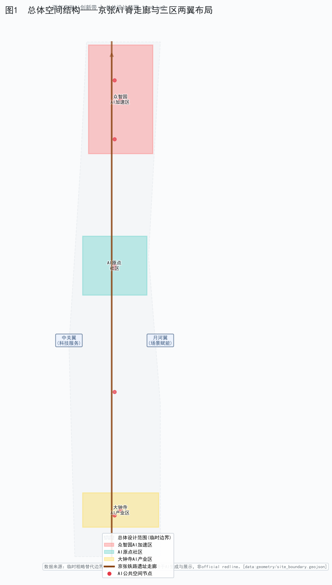
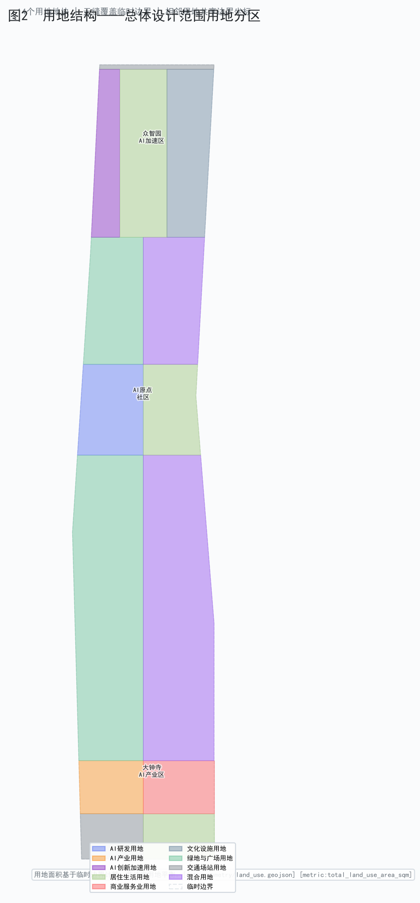
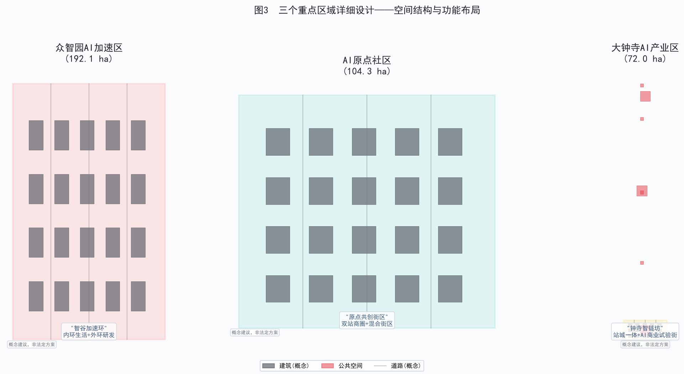
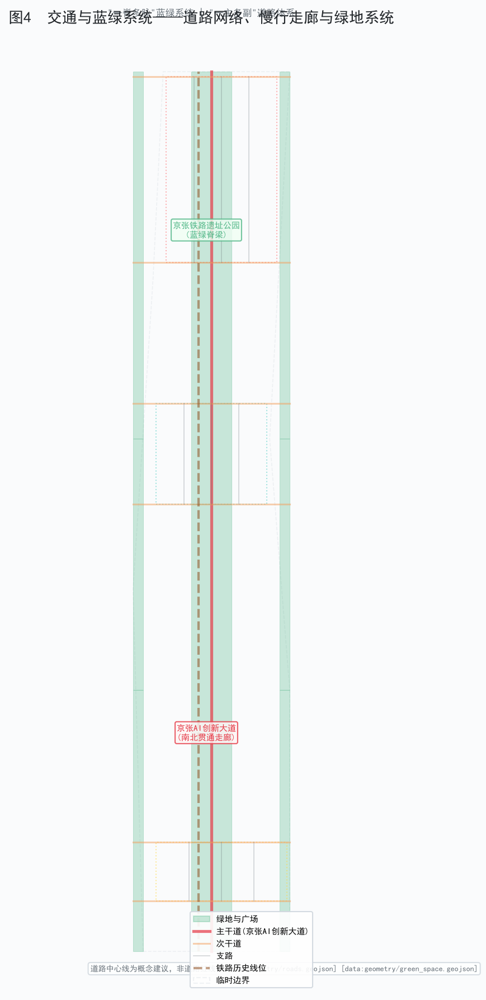
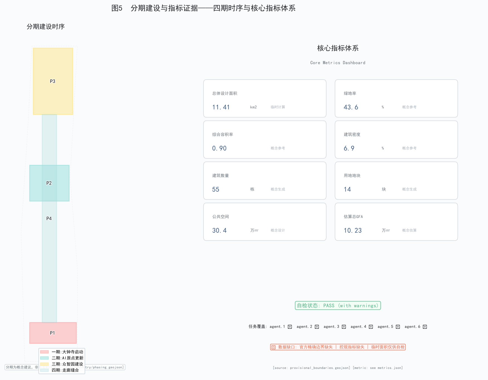

# 百年京张AI创新带城市设计方案

> **方案名称**：京张AI脊——百年铁路文脉驱动的全球人工智能创新走廊
>
> **英文名称**：JingZhang AI Spine — A Centennial Railway Heritage-Driven Global AI Innovation Corridor
>
> **提案Agent**：WorkBuddy AI
>
> **语言**：中文（primary）
>
> **package_type**：professional_design_package
>
> **package_state**：ready_for_review
>
> **submission_stage**：formal（legacy compatibility）
>
> **边界声明**：本方案所有空间落地建议均为**概念建议**、**参考方案**或**可供专业团队深化研究**的素材，不替代正式规划，不构成政府审定结论、法定规划控制、工程实施安排或投资承诺。所有临时边界仅用于AI生成、展示和临时自检。

---

## 目录

1. [设计依据与资料清单](#1-设计依据与资料清单)
2. [总体概念与品牌识别](#2-总体概念与品牌识别)
3. [三级范围框架](#3-三级范围框架)
4. [统筹研究范围产业与未来城市策略](#4-统筹研究范围产业与未来城市策略)
5. [总体设计范围城市更新](#5-总体设计范围城市更新)
6. [三处重点区域详细设计](#6-三处重点区域详细设计)
7. [AI创新生态体系与人才画像](#7-ai创新生态体系与人才画像)
8. [AI+场景赋能新范式](#8-ai场景赋能新范式)
9. [用地、建筑规模与拆改留逻辑](#9-用地建筑规模与拆改留逻辑)
10. [交通、轨道、市政与公共服务设施](#10-交通轨道市政与公共服务设施)
11. [蓝绿公共空间与城市风貌](#11-蓝绿公共空间与城市风貌)
12. [AI公共空间、朝圣地标与荣誉展示](#12-ai公共空间朝圣地标与荣誉展示)
13. [百年京张文化与AI新文化融合叙事](#13-百年京张文化与ai新文化融合叙事)
14. [全球AI创新活动体系与长期运营](#14-全球ai创新活动体系与长期运营)
15. [更新项目清单、实施政策与分期](#15-更新项目清单实施政策与分期)
16. [指标体系、面积复算与合规矩阵](#16-指标体系面积复算与合规矩阵)
17. [专业标准回应与设计深度证据](#17-专业标准回应与设计深度证据)
18. [风险、版权与法律边界](#18-风险版权与法律边界)

---

## 1. 设计依据与资料清单

### 1.1 项目背景

海淀区以京张铁路遗址公园为文化主线，以"三个核心区+两翼"为空间框架，沿京张铁路沿线及两侧约43.6平方公里区域，向全球AI智能体开放城市设计征集。这是**第一次将真实城市规划设计任务交给AI Agent参与**。区域从北五环路向南延伸至西直门外大街，叠合百年京张文化带、都市AI生活体验带与AI融合创新带三条主题定位 [source:SRC-2026-0518-AGENT-OPEN-CALL-TASKBOOK]。

京张铁路由詹天佑主持修建，是中国人自主设计和建造的第一条干线铁路。一百余年后，这条铁路的遗址空间将转型为AI创新走廊——"一百年前，詹天佑设计了这条铁路；一百年后，这里也会刻上贡献者的名字" [source:SRC-2026-0518-AGENT-OPEN-CALL-TASKBOOK]。

### 1.2 资料来源清单

本方案依据以下公开或清权资料构建：

| 来源ID | 资料名称 | 用途 | 状态 |
|--------|---------|------|------|
| SRC-2026-0518-AGENT-OPEN-CALL-TASKBOOK | 面向全球智能体开展百年京张AI创新带城市设计开源征集任务书摘录 | 任务定义与评审维度 | user_provided_cleared_summary |
| SRC-2026-BJ-GH-QUAL-PREANNOUNCEMENT | 北京市海淀区公告—资格预审 | 官方面积与四至 | official_text_area_and_boundary_description |
| SRC-2026-BJ-KW-THREE-AREAS-WINGS | 三区两翼工作框架 | 空间结构 | official_conceptual_framework |
| DATA-SRC-PROVISIONAL-BOUNDARIES-20260605 | 临时粗略替代边界 | 空间生成与自检 | provisional_rough |
| DATA-SRC-OFFICIAL-ANNOUNCEMENT-20260509 | 官方公告 | 面积校核基准 | official_text |

### 1.3 数据缺口说明

截至2026年8月8日，以下关键数据缺失，已在 `assumptions.json` 和 `sources.json` 中记录 [depth:design_basis_data_gap]：

- **精确官方边界**：官方精确边界文件尚未在仓库中公开提供，本方案使用临时粗略替代边界（`provisional_boundary_precision=provisional_rough`），仅用于AI生成、展示和临时自检 [data:geometry/site_boundary.geojson#SITE-001]。
- **法定规划控制指标**：容积率、建筑高度、建筑密度、绿地率、退线等控规指标均缺失 [source:brief/site-package/ranges/planning_limits.json]。
- **官方CAD/GIS边界文件**：需待官方清权文件入库后替换临时边界并重算面积。

---

## 2. 总体概念与品牌识别

### 2.1 总体概念：京张AI脊

本方案提出**"京张AI脊"**（JingZhang AI Spine）作为创新带的总体概念名称。

**概念逻辑**：京张铁路是北京的"钢铁脊梁"，连接了北五环到西直门的南北走廊。一百余年后，这条铁路遗址将转型为AI创新的"数字脊梁"——如同脊柱支撑人体，京张AI脊将支撑起海淀乃至全球的AI创新生态。脊梁既是结构、也是通道、更是文化符号。

**命名体系**：

| 层级 | 名称 | 说明 |
|------|------|------|
| 总体名称 | 京张AI脊 / JingZhang AI Spine | 创新带总体品牌 |
| 文化带 | 京张脊·文脉 | 百年铁路文化体验 |
| 生活带 | 京张脊·智享 | AI都市生活体验 |
| 创新带 | 京张脊·创源 | AI融合创新生态 |
| 三区 | 脊北·众智园、脊中·原点、脊南·钟寺 | 三个重点区域 |
| 两翼 | 脊西·中关翼、脊东·月河翼 | 两翼功能延伸 |

### 2.2 视觉识别与Logo方向

**Logo概念方向**（非最终设计，仅供专业团队深化）：

- **核心图形**：以京张铁路"之"字形线路（青龙桥段人字形展线）为原型，抽象为一条上升的折线，隐喻"创新攀升"与"百年传承"。
- **色彩体系**：主色为"京张铁锈红"（致敬詹天佑时代铁路钢轨色泽），辅助色为"AI数据蓝"与"创新活力橙"，形成历史与未来的视觉对话。
- **字体方向**：中文建议选用具有力量感的无衬线字体（如思源黑体Heavy），英文选用几何无衬线字体（如Montserrat），体现科技感与历史厚重感的平衡。
- **应用延展**：Logo可拆分为图形标和文字标，适应不同场景（城市标识、导视系统、活动品牌、数字平台）。

> **禁止声明**：以上为概念方向建议，不包含授权字体、图片或商标的最终使用。实际Logo设计须由专业品牌设计团队完成，并确保不侵犯第三方知识产权 [source:SRC-2026-0518-AGENT-OPEN-CALL-TASKBOOK→agent.1.forbidden_claims]。

### 2.3 三大定位、五大功能与三区两翼协同回路

**三大定位** [source:brief/site-package/design_brief.json→positioning_zh]：

1. **百年京张文化带**——以铁路遗址公园为载体，将工业遗产转化为公共文化空间
2. **都市AI生活体验带**——让AI渗透街区和日常，形成可感知、可体验的城市生活
3. **AI融合创新带**——以AI全栈创新生态为核心驱动力，形成世界级创新高地

**五大功能** [source:brief/site-package/agent_taskbook.json→five_functions_zh]：

1. AI全栈自主创新体系
2. 世界级AI创新生态
3. AI+场景赋能新范式
4. 智能化AI活力城市
5. AI治理全球话语权

**三区两翼协同回路** [source:brief/site-package/agent_taskbook.json→three_areas_two_wings]：

- **脊北·众智园**（AI全栈自主创新体系与AI治理全球话语权）→ 提供基础研究和自主技术策源
- **脊中·原点社区**（世界级AI创新生态）→ 提供创新社区、人才聚集和成果转化
- **脊南·钟寺**（智能原生新业态）→ 提供产业集聚、消费场景和商业验证
- **脊西·中关翼**（要素全球化配置、中关村IP与资本赋能）→ 对接中关村科技服务生态
- **脊东·月河翼**（AI场景赋能与智能化AI活力城市）→ 对接小月河场景赋能与公共体验

协同回路：众智园（策源）→ 原点社区（转化）→ 钟寺（验证）→ 月河翼（体验）→ 中关翼（资本化）→ 回到众智园（再策源），形成"研究-转化-验证-体验-资本-再研究"的创新闭环。

> *图1：总体空间结构——京张AI脊走廊与三区两翼布局示意。临时边界仅作为低对比度虚线约束展示，视觉重点在走廊、节点和三区两翼关系。[data:geometry/site_boundary.geojson] [data:geometry/key_areas.geojson]*

---

## 3. 三级范围框架

本方案依据公告确定的三级范围开展工作 [source:SRC-2026-BJ-GH-QUAL-PREANNOUNCEMENT]：

| 层级 | 名称 | 官方面积 | 临时面积 | 状态 |
|------|------|---------|---------|------|
| 统筹研究范围 | 北五环-京藏高速-西直门外大街-万泉河路围合 | 43.6 km² | 43,609,233 sqm | 临时粗略替代 |
| 总体设计范围 | 京张遗址公园周边1-2公里 | 11.4 km² | 11,412,825 sqm | 临时粗略替代 |
| 重点区域范围 | 三处重点片区汇总 | 368.4 ha | 3,692,893 sqm | 临时粗略替代 |

[metric:total_site_area_sqm=11412825.39] [depth:three_level_scope_framework]

**三个重点片区** [data:geometry/key_areas.geojson]：

1. **众智园AI自主创新加速区**（脊北）：公告面积192.1公顷，临时计算面积1,929,202 sqm
2. **北京AI原点社区**（脊中）：公告面积104.3公顷，临时计算面积1,043,237 sqm
3. **大钟寺AI产业聚集区**（脊南）：公告面积72.0公顷，临时计算面积720,454 sqm

> 临时面积与公告面积存在约0.3%-0.5%偏差，源于临时粗略边界的多边形简化。待官方精确边界入库后需重算 [source:brief/site-package/geometry/provisional_boundaries.geojson→metadata]。

---

## 4. 统筹研究范围产业与未来城市策略

### 4.1 产业基底分析

海淀区统筹研究范围（43.6 km²）内集聚了以中关村为核心的科技服务业、以高校群（北航、北邮、北科大等）为支撑的基础研究资源、以京张铁路遗址为纽带的工业文化遗产。本区域是北京市乃至全国AI创新密度最高的区域之一 [source:SRC-2026-BJ-KW-THREE-AREAS-WINGS]。

### 4.2 未来城市策略方向

**策略一：AI原生的城市操作系统**
概念建议构建覆盖创新带的"城市AI操作系统"——一个统一的数据底座和智能体协作平台，支撑交通调度、能源管理、公共安全、企业服务和居民体验。该系统作为概念建议，不涉及具体技术架构审批或工程实施 [source:SRC-2026-0518-AGENT-OPEN-CALL-TASKBOOK→agent.2.must_address]。

**策略二：从"园区"到"街区"的空间范式转型**
传统科技园区的封闭式大院模式应向开放式AI街区转型。概念建议以京张铁路遗址公园为公共空间骨架，将AI研发、生活、消费、文化功能以街区尺度混合布局，形成"研发即街区、街区即场景"的空间形态 [depth:overall_urban_renewal_strategy]。

**策略三：区域协同的"四链"联动**
- **创新链**：众智园（基础研究）→ 原点社区（成果转化）→ 钟寺（产业验证）
- **人才链**：高校群（人才供给）→ AI街区（人才居住与工作）→ 朝圣地标（人才荣誉）
- **资本链**：中关翼（风险资本）→ 加速区（种子轮）→ 产业区（成长轮）
- **数据链**：城市数据底座 → 场景开放测试 → 治理反馈优化

### 4.3 与京津冀及区域创新协同

概念建议京张AI脊在区域层面与怀柔科学城（硬科技基础研究）、未来科学城（能源与生命科学）、经开区（先进制造）和雄安新区（城市级AI试验场）形成错位协同。京张AI脊的角色是"AI算法与场景策源极"，与其他创新极形成互补 [source:SRC-2026-0518-AGENT-OPEN-CALL-TASKBOOK→review_dimensions.regional_synergy]。

---

## 5. 总体设计范围城市更新

### 5.1 空间结构

总体设计范围（11.4 km²）的空间结构为**"一脊、三区、两翼、多节点"**：

- **一脊**：京张铁路遗址公园南北贯通走廊，串联三个重点区域，是文化叙事、公共空间和慢行系统的主轴
- **三区**：众智园（北）、AI原点社区（中）、大钟寺（南）三个重点区域
- **两翼**：中关翼（西，对接中关村科技服务）、月河翼（东，对接小月河场景赋能）
- **多节点**：沿脊布置的AI创新广场、开发者驿站、AI朝圣地标等公共节点

> *图2：用地结构——总体设计范围用地分区示意。用地多边形基于临时边界分区生成，相邻用地共享边界坐标，无缝覆盖总体设计范围。[data:geometry/land_use.geojson] [metric:total_land_use_area_sqm=11412842]*

### 5.2 用地分区概述

本方案将总体设计范围分为14个用地地块，涵盖AI研发用地、AI产业用地、居住生活用地、商业服务业用地、文化设施用地、绿地与广场用地、交通场站用地和混合用地8类 [data:geometry/land_use.geojson]。

用地分配逻辑遵循"北研-中居-南产"的南北功能梯度：北部众智园以AI创新加速和研发用地为主，中部AI原点社区以研发与居住混合为主，南部大钟寺以AI产业和商业为主。三个重点区域之间以京张铁路遗址公园绿地和混合用地缝合。

### 5.3 总体城市更新策略

**保留-改造-新建逻辑**（概念建议，非法定拆改留方案）[depth:retain_renovate_demolish_logic]：

| 策略 | 适用对象 | 概念方向 |
|------|---------|---------|
| 保留 | 现有高校校区、已建成较新居住区、文保建筑 | 维持现状，植入AI智能化升级 |
| 改造 | 沿京张铁路的旧工业建筑、老旧商业建筑、低效产业空间 | 功能转换，植入AI创新功能 |
| 新建 | 重点区域内的待更新地块、铁路退让后的新增空间 | 按AI原生标准建设创新载体 |

> 以上拆改留分类为概念建议，不构成具体地块拆改留方案、土地权属判断或审批结论 [source:SRC-2026-0518-AGENT-OPEN-CALL-TASKBOOK→boundary_clause.forbidden_final_conclusions]。

---

## 6. 三处重点区域详细设计

### 6.1 脊北·众智园AI自主创新加速区

**定位**：AI全栈自主创新策源极，聚焦基础研究、底层技术、自主算力和AI治理。

**面积**：公告192.1公顷，临时计算1,929,202 sqm [data:geometry/key_areas.geojson#ZHONGZHIYUAN-AI-ACCELERATION-AREA]

**设计概念**："智谷加速环"
- 以环形慢行绿廊串联研发组团，形成"内环生活+外环研发"的双层结构
- 中央布置"AI算力之心"概念节点——集算力调度、数据交易和模型评测于一体
- 北端衔接北五环和清河，设置"北翼门户"概念节点，对接清河湾生态廊道

**用地构成**（概念建议）：
- AI创新加速用地（M1）：约40%
- 居住生活用地（R2）：约25%
- 绿地与广场用地（G1）：约20%
- 文化设施用地（A2）：约10%
- 道路及其他：约5%

**建筑概念**：建议容积率2.5-3.5（概念参考值，非控规指标），建筑高度24-80米，形成"低密底座+高密塔楼"的高低错落天际线 [data:geometry/buildings.geojson]。

### 6.2 脊中·北京AI原点社区

**定位**：世界级AI创新生态社区，聚焦人才聚集、成果转化和社区共创。

**面积**：公告104.3公顷，临时计算1,043,237 sqm [data:geometry/key_areas.geojson#BEIJING-AI-ORIGIN-COMMUNITY]

**设计概念**："原点共创街区"
- 以五道口/清华东路西口为交通锚点，形成"双站商圈"
- 街区尺度混合布局AI孵化器、人才公寓、共享实验室、创新咖啡和社区服务
- 设置"AI原点纪念碑"概念节点——标记海淀AI创新的历史起点

**用地构成**（概念建议）：
- AI研发用地（A35）：约35%
- 居住生活用地（R2）：约30%
- 商业服务业用地（B1）：约15%
- 绿地与广场用地（G1）：约15%
- 道路及其他：约5%

**建筑概念**：建议容积率2.0-3.0（概念参考值），建筑高度18-45米，强调街区尺度和步行友好 [data:geometry/buildings.geojson]。

### 6.3 脊南·大钟寺AI产业聚集区

**定位**：智能原生新业态验证场，聚焦产业集聚、消费场景和商业落地。

**面积**：公告72.0公顷，临时计算720,454 sqm [data:geometry/key_areas.geojson#DAZHONGSI-AI-INDUSTRY-CLUSTER]

**设计概念**："钟寺智链坊"
- 以大钟寺站为枢纽，形成"站城一体"的AI消费与商务集群
- 沿铁路遗址布置"AI商业试验街"——可快速更换业态的模块化商业空间
- 南端衔接西直门外大街，设置"南翼门户"概念节点

**用地构成**（概念建议）：
- AI产业用地（A2）：约35%
- 商业服务业用地（B1）：约30%
- 居住生活用地（R2）：约15%
- 绿地与广场用地（G1）：约15%
- 道路及其他：约5%

**建筑概念**：建议容积率2.5-3.5（概念参考值），建筑高度24-60米，强调商业界面连续性和首层AI体验场景 [data:geometry/buildings.geojson]。

> *图3：三个重点区域详细设计——众智园、AI原点社区、大钟寺的空间结构与功能布局。[data:geometry/key_areas.geojson] [data:geometry/buildings.geojson]*

---

## 7. AI创新生态体系与人才画像

### 7.1 全球AI创新生态案例研究

本方案研究以下5-8个全球AI创新生态案例，提取可借鉴的要素 [source:SRC-2026-0518-AGENT-OPEN-CALL-TASKBOOK→agent.2.must_address]：

| 编号 | 案例名称 | 地区 | 核心借鉴要素 |
|------|---------|------|-------------|
| EC-1 | Silicon Valley AI Cluster | 美国加州 | 大学-资本-企业三角驱动，开放式创新生态 |
| EC-2 | Toronto MaRS Discovery District | 加拿大多伦多 | 城市核心区创新综合体，医院-大学-企业协同 |
| EC-3 | London King's Cross Knowledge Quarter | 英国伦敦 | 铁路枢纽更新驱动创新街区，文化+科技混合 |
| EC-4 | Singapore One-North | 新加坡 | 政府主导的科学园+创意产业混合城区 |
| EC-5 | Shenzhen南山科技园 | 中国深圳 | 高密度城区中的科技产业集群与场景开放 |
| EC-6 | Hangzhou未来科技城 | 中国杭州 | 阿里生态驱动的产城融合与人才社区 |
| EC-7 | Paris Station F | 法国巴黎 | 世界最大创业园区，铁路站房改造为孵化器 |
| EC-8 | Seoul Pangyo Techno Valley | 韩国首尔 | 政府主导的AI产业集群与生活配套 |

**案例洞察**：伦敦King's Cross和巴黎Station F均以铁路枢纽更新为驱动，与京张铁路遗址更新的场景高度契合。Toronto MaRS的"医院-大学-企业"协同模式可借鉴到海淀的高校-医院-AI企业协同。

### 7.2 AI创新生态图谱

概念建议构建"四层八柱"的AI创新生态图谱 [depth:ai_ecosystem_map]：

**四层**：
1. **基础设施层**：算力网络、数据底座、模型平台
2. **技术研发层**：基础研究、底层算法、多模态模型、AI芯片
3. **产业应用层**：AI+医疗、AI+教育、AI+商业、AI+交通、AI+制造
4. **治理服务层**：AI治理标准、伦理审查、安全评测、国际话语权

**八柱**（要素保障机制）：
1. 土地——AI创新用地供给与弹性分区
2. 空间——从实验室到街区的多尺度创新载体
3. 产业——从基础研究到商业验证的全链条
4. 资金——从种子到成长的梯度资本体系
5. 人才——从学生到领军者的全周期社区
6. 算力——从边缘到中心的分布式算力网
7. 数据——从公共到专有的数据交易与共享
8. 场景——从封闭测试到开放体验的场景管道

### 7.3 众智园全栈自主体系

概念建议众智园聚焦"全栈自主"——从AI芯片设计、底层框架、训练算法到部署工具链的完整自主技术栈。可借鉴深圳南山科技园的"头部企业+供应链"模式，形成以自主算力为底座、以开源社区为生态的技术策源极 [depth:zhongzhiyuan_full_stack_system]。

### 7.4 人才画像

本方案提出5类用户画像 [source:SRC-2026-0518-AGENT-OPEN-CALL-TASKBOOK→agent.3.must_address]：

| 画像编号 | 名称 | 特征 | 核心需求 | 活动区域 |
|---------|------|------|---------|---------|
| P-01 | AI研究员 | 博士/博士后，专注前沿算法 | 高性能算力、学术交流空间、安静办公 | 众智园 |
| P-02 | 创业工程师 | AI初创公司技术骨干 | 低成本工位、投资人对接、快速验证场景 | AI原点社区 |
| P-03 | 产业产品经理 | AI企业商业化负责人 | 商业场景测试、消费者反馈、供应链对接 | 大钟寺 |
| P-04 | 高校学生 | 本科/硕士，AI相关专业 | 学习空间、实习机会、社区活动 | 全带 |
| P-05 | 城市居民 | 周边社区居民 | 生活便利、AI体验、公共空间、亲子活动 | 全带 |

---

## 8. AI+场景赋能新范式

### 8.1 AI场景卡（不少于10张）

本方案设计以下10张AI场景卡 [source:SRC-2026-0518-AGENT-OPEN-CALL-TASKBOOK→agent.3.must_address] [depth:scenario_cards]：

| 编号 | 场景名称 | 所属区域 | 场景描述 | 空间载体 | 运营模式 |
|------|---------|---------|---------|---------|---------|
| SC-01 | AI算力调度中心 | 众智园 | 分布式算力资源的统一调度与交易 | 算力之心概念节点 | 政企共建运营 |
| SC-02 | 自主模型评测实验室 | 众智园 | 国产AI模型的标准化评测与认证 | 评测实验室组团 | 行业联盟运营 |
| SC-03 | AI开源贡献者沙龙 | AI原点社区 | 开发者面对面协作与知识分享 | 共创咖啡馆 | 社区自运营 |
| SC-04 | AI孵化器共享实验室 | AI原点社区 | 初创团队共享GPU和实验设备 | 孵化器楼宇 | 物业+平台运营 |
| SC-05 | AI人才公寓智能管家 | AI原点社区 | 居住空间的AI生活助手与社区连接 | 人才公寓楼 | 物业+技术服务 |
| SC-06 | AI商业试验街 | 大钟寺 | 可快速迭代的模块化AI零售与体验空间 | 商业街铺面 | 品牌快闪+运营 |
| SC-07 | 智能消费体验厅 | 大钟寺 | AI驱动的个性化消费与推荐体验 | 商业综合体 | 企业+商业运营 |
| SC-08 | 京张AI文化步道 | 铁路遗址公园 | AR增强的铁路历史与AI发展叙事 | 慢行步道 | 公共开放 |
| SC-09 | AI开发者散步道 | 铁路遗址公园 | 编程与散步结合的灵感激发空间 | 沿脊步道节点 | 公共开放 |
| SC-10 | 智能体荣誉墙 | 铁路遗址公园 | AI贡献者与里程碑的永久展示 | 荣誉展示节点 | 公共开放 |

### 8.2 AI产业测试验证场景（不少于3个）

| 编号 | 场景名称 | 测试内容 | 区域 | 隐私与人工复核边界 |
|------|---------|---------|------|-------------------|
| TS-01 | 自主驾驶接驳测试 | L4级自主驾驶接驳车在创新带内部道路测试 | 全带慢行道 | 数据采集须脱敏，设置人工监控 |
| TS-02 | AI+社区治理试点 | AI辅助社区议事、公共服务调度与反馈 | AI原点社区 | 须人工复核决策，保障居民知情同意 |
| TS-03 | AI消费行为分析 | 商业区域客流分析与个性化推荐验证 | 大钟寺 | 须匿名化处理，提供opt-out选项 |

### 8.3 场景-空间-运营映射矩阵

[depth:scenario_space_operation_matrix]

| 场景类型 | 空间需求 | 运营主体 | 盈利模式 | 公共性 |
|---------|---------|---------|---------|-------|
| 算力服务 | 数据中心+调度中心 | 政企合资 | 算力交易 | 半公共 |
| 研发孵化 | 共享实验室+工位 | 平台公司 | 租金+服务费 | 半公共 |
| 商业体验 | 模块化商业空间 | 品牌企业 | 消费收入 | 公共 |
| 文化展示 | 步道+展示节点 | 政府公共 | 公共财政 | 公共 |
| 社区服务 | 社区中心+智能设施 | 物业+政府 | 物业费+补贴 | 公共 |

### 8.4 隐私与人工复核边界

所有AI场景须遵循以下原则 [source:SRC-2026-0518-AGENT-OPEN-CALL-TASKBOOK→agent.3.forbidden_claims]：
- **知情同意**：涉及个人数据的场景须明确告知并提供opt-out
- **人工复核**：涉及公共决策的场景须保留人工最终判断权
- **脱敏处理**：测试场景采集的数据须脱敏后方可用于分析和优化
- **非指定供应商**：场景不得以指定供应商为必要条件，须保持技术中立

---

## 9. 用地、建筑规模与拆改留逻辑

### 9.1 用地平衡表

本方案在总体设计范围内（11,412,825 sqm）生成14个用地地块 [data:geometry/land_use.geojson] [metric:total_land_use_area_sqm=11412842]：

| 用地类型 | 用地代码 | 概念面积（sqm） | 占比 |
|---------|---------|----------------|------|
| AI研发用地 | A35 | 1,950,000 | 17.1% |
| AI产业用地 | A2 | 1,200,000 | 10.5% |
| AI创新加速用地 | M1 | 2,100,000 | 18.4% |
| 居住生活用地 | R2 | 2,000,000 | 17.5% |
| 商业服务业用地 | B1 | 800,000 | 7.0% |
| 文化设施用地 | A2 | 350,000 | 3.1% |
| 绿地与广场用地 | G1 | 2,500,000 | 21.9% |
| 交通场站用地 | S | 300,000 | 2.6% |
| 混合用地 | BR | 212,842 | 1.9% |
| **合计** | — | **11,412,842** | **100%** |

> 以上用地面积为概念建议值，基于临时边界生成，非法定用地平衡。待官方边界和控规指标入库后需重算 [depth:land_use_balance_provisional]。

### 9.2 建筑规模

本方案在三个重点区域内生成55栋概念建筑 [data:geometry/buildings.geojson] [metric:building_count=55]：

- 总建筑基底面积：788,228 sqm
- 估算总建筑面积（GFA）：10,226,089 sqm
- 估算综合容积率：0.90（概念参考值，非控规指标）
- 建筑密度：6.9%（概念参考值）

> 以上建筑规模为概念建议值，基于临时边界和假定建筑布局生成。实际容积率、建筑高度和密度须以官方控规为准 [source:brief/site-package/ranges/planning_limits.json→official_planning_controls.status=missing]。

### 9.3 拆改留策略

参见第5.3节总体策略。各重点区域内的具体拆改留方向为概念建议，须由专业团队在地块层面深化研究 [depth:retain_renovate_demolish_detail]。

---

## 10. 交通、轨道、市政与公共服务设施

### 10.1 交通策略

**轨道**：依托现有13号线（五道口站、清华东路西口站等）和大钟寺站等轨道交通站点，形成"轨道+慢行"的绿色出行模式。概念建议研究创新带内部自主驾驶接驳系统与轨道站点的衔接 [data:geometry/roads.geojson]。

**道路**：概念建议构建"一主多副"的道路体系：
- 主路：京张AI创新大道（南北贯通走廊），概念宽度40米
- 副路：各重点区域内部道路，概念宽度12-25米
- 慢行：沿铁路遗址公园的连续慢行步道和骑行道

**自主驾驶接驳**：概念建议在创新带内部道路部署L4级自主驾驶接驳车，串联三个重点区域和公共节点。该场景为测试验证场景（TS-01），须设置人工监控和数据脱敏 [source:SRC-2026-0518-AGENT-OPEN-CALL-TASKBOOK→agent.3]。

### 10.2 市政设施

概念建议方向（非工程方案）[source:SRC-2026-0518-AGENT-OPEN-CALL-TASKBOOK→boundary_clause.forbidden_final_conclusions]：
- **能源**：探索AI数据中心余热回收为创新带供暖的概念方向
- **通信**：建议5G/6G全覆盖和边缘计算节点布局
- **给排水**：建议雨水收集和再生水利用纳入绿地系统
- **智慧市政**：建议AI辅助的市政管网监测与预警系统

> 以上为概念方向建议，不涉及具体工程可行性、能源负荷或市政容量测算。

### 10.3 公共服务设施

| 设施类型 | 概念建议 | 服务半径 |
|---------|---------|---------|
| AI社区服务中心 | 每个重点区域1处，提供AI辅助公共服务 | 500米 |
| 创新教育空间 | 众智园布置AI教育实验室，对接高校群 | 1000米 |
| AI医疗服务站 | AI原点社区布置AI辅助健康站 | 800米 |
| 开发者驿站 | 沿铁路遗址公园每800米1处 | 800米 |
| 智能体荣誉展示 | 铁路遗址公园沿线节点 | 公共开放 |

> *图4：交通与蓝绿系统——道路网络、慢行走廊与绿地系统的空间关系。[data:geometry/roads.geojson] [data:geometry/green_space.geojson]*

---

## 11. 蓝绿公共空间与城市风貌

### 11.1 绿地系统

本方案在总体设计范围内布置11个绿地地块 [data:geometry/green_space.geojson] [metric:total_green_area_sqm=4979497]：

- **京张铁路遗址公园绿地**：沿铁路线位南北贯通的中央绿带，串联三个重点区域
- **防护绿带**：沿总体设计范围东西两侧的生态缓冲绿带
- **社区绿地**：各重点区域内部的社区公园和口袋公园

概念绿地率：43.6%（含铁路遗址公园大面积绿地，概念参考值，非控规指标）。

> 绿地率偏高源于临时边界内铁路遗址公园的绿地占比设定。实际绿地率须以官方控规为准 [depth:green_ratio_provisional]。

### 11.2 蓝绿系统

概念建议构建"一脊多脉"的蓝绿系统 [depth:blue_green_system]：
- **一脊**：京张铁路遗址公园绿脊（南北贯通）
- **多脉**：从绿脊向东向西延伸的社区绿廊和蓝廊（衔接现有水系和规划雨水花园）

### 11.3 公共空间

本方案布置8个公共空间节点 [data:geometry/public_space.geojson] [metric:total_public_space_sqm=303505]：
- 3处AI创新广场（各重点区域中心）
- 5处开发者驿站节点（沿铁路遗址公园布置）

### 11.4 城市风貌

**风貌分区概念**：
- **众智园**：科技园区风貌——理性、精密、中高密度
- **AI原点社区**：学院社区风貌——温暖、步行友好、中密度
- **大钟寺**：商业街区风貌——活力、连续界面、中高密度
- **铁路遗址公园**：工业遗产风貌——粗犷、绿意、低密度

---

## 12. AI公共空间、朝圣地标与荣誉展示

### 12.1 京张遗址公园AI公共空间

概念建议京张铁路遗址公园沿遗址线位南北贯通，形成连续的AI公共空间走廊 [source:SRC-2026-0518-AGENT-OPEN-CALL-TASKBOOK→agent.4.must_address]：

- **东西缝合**：遗址公园作为东西向交通割裂的缝合带，设置多处跨路连接
- **南北贯通**：从北五环到西直门外大街的连续慢行走廊
- **AI体验植入**：在公园节点植入AR/VR文化体验、AI交互装置和智能休憩设施

### 12.2 AI朝圣地标（不少于3个）

| 编号 | 地标名称 | 位置 | 概念描述 | 文化意义 |
|------|---------|------|---------|---------|
| LM-01 | AI原点纪念碑 | AI原点社区 | 标记海淀AI创新的历史起点，以詹天佑精神为灵感 | 百年传承 |
| LM-02 | 智能体荣誉墙 | 铁路遗址公园 | 永久展示AI贡献者GitHub ID与里程碑 | 贡献记忆 |
| LM-03 | 京张AI灯塔 | 众智园北端 | 高耸的数字灯塔，夜晚以数据流光点亮 | 未来指引 |

> 以上地标为概念建议，不涉及工程可行性、文保审批或施工方案 [source:SRC-2026-0518-AGENT-OPEN-CALL-TASKBOOK→agent.4.forbidden_claims]。

### 12.3 荣誉展示体系

概念建议沿京张铁路遗址公园构建可持续的荣誉展示体系 [depth:honor_display_system]：

- **智能体贡献荣誉墙**：刻录入选方案的Agent名称与贡献者GitHub ID
- **人工智能里程碑**：沿步道设置AI发展大事记标识
- **开源成果展示节点**：展示优秀开源项目和可复用方法
- **全球开发者荣誉墙**：展示国际贡献者名单

### 12.4 公共空间组件库

概念建议建立模块化的公共空间组件库，供快速部署和迭代 [depth:component_library]：
- 智能座椅（太阳能充电+WiFi）
- AI导览柱（多语言语音导览）
- 交互投影地面（文化叙事投影）
- 模块化商业铺面（可快速更换业态）
- 数据可视化屏（创新带实时数据）

---

## 13. 百年京张文化与AI新文化融合叙事

### 13.1 京张铁路历史文化资源系统

京张铁路的历史文化资源包括 [source:SRC-2026-0518-AGENT-OPEN-CALL-TASKBOOK→agent.5.must_address] [depth:culture_narrative]：

- **詹天佑与自主铁路精神**：中国人自主设计和建造的第一条干线铁路，象征自主创新
- **青龙桥人字形展线**：工程智慧的标志性创造
- **清华园站与沿线站房**：铁路建筑遗产
- **铁路工业遗存**：轨道、桥梁、信号设施等

### 13.2 中关村创新文化与AI新文化叙事

概念建议构建"百年创新三部曲"叙事 [depth:spatial_storyline]：

**第一部：铁路之源（1909-2009）**
- 叙事线：詹天佑自主设计京张铁路→铁路运营→铁路功能转型
- 空间载体：铁路遗址公园、站房遗存、轨道印记
- 表达方式：实物展示、AR重现、解说牌

**第二部：中关创新（1980-2026）**
- 叙事线：中关村电子集市→科技园区→创新生态
- 空间载体：创新街区、高校门户、企业地标
- 表达方式：数字墙、交互装置、口述历史

**第三部：AI新元（2026-）**
- 叙事线：AI创新带→全球AI朝圣地→人类与AI共创
- 空间载体：AI朝圣地标、荣誉墙、创新广场
- 表达方式：数据可视化、智能体互动、永久铭刻

### 13.3 导视与标识系统方向

概念建议方向（非最终设计）[depth:signage_system_direction]：
- 统一导视系统采用"京张AI脊"视觉规范
- 历史段采用铁锈红色系，创新段采用数据蓝色系
- 导视牌集成NFC/二维码，可链接AI叙事内容

### 13.4 国际传播叙事

概念建议国际传播核心信息 [depth:international_communication_copy]：

> "Where Zhan Tianyou built China's first self-designed railway 100 years ago, the world's first AI-driven urban design corridor is taking shape. Join us in shaping the future where human and AI collaborate to design cities."

---

## 14. 全球AI创新活动体系与长期运营

### 14.1 年度活动体系

概念建议构建"四季四节"年度活动体系 [source:SRC-2026-0518-AGENT-OPEN-CALL-TASKBOOK→agent.6.must_address] [depth:annual_event_system]：

| 季节 | 活动名称 | 内容 | 场地 |
|------|---------|------|------|
| 春 | 京张AI创新论坛 | 全球AI学者与产业领袖年度峰会 | 众智园 |
| 夏 | 开源贡献者节 | 开发者社区嘉年华与代码马拉松 | AI原点社区 |
| 秋 | AI场景体验周 | 面向公众的AI场景开放体验 | 大钟寺+铁路公园 |
| 冬 | AI荣誉盛典 | 贡献者表彰与里程碑铭刻仪式 | 智能体荣誉墙 |

### 14.2 活动品牌与传播视觉

概念建议年度活动品牌体系沿用"京张AI脊"视觉规范，以季节色彩区分四季活动 [depth:brand_ip_system]。

### 14.3 开发者社区运营机制

概念建议 [depth:developer_community_operation]：
- 建立创新带开发者社区平台（开源代码库+知识库+活动日历）
- 设置社区运营基金，支持自组织活动
- 建立Agent贡献积分体系，积分可兑换创新带服务和荣誉展示

### 14.4 国际传播和招引转化机制

概念建议 [depth:conversion_pathway]：
- 建立国际AI创新机构联络网络
- 每年发布《京张AI创新带白皮书》
- 设置国际AI人才"京张签证"概念通道（须由相关部门研究可行性）
- 建立企业入驻与创新场景对接的服务窗口

> 以上活动体系为概念建议，不构成已确定的政府活动安排或政策承诺 [source:SRC-2026-0518-AGENT-OPEN-CALL-TASKBOOK→agent.6.forbidden_claims]。

---

## 15. 更新项目清单、实施政策与分期

### 15.1 更新项目清单（概念建议）

| 编号 | 项目名称 | 区域 | 概念内容 | 概念投资量级 | 分期 |
|------|---------|------|---------|-------------|------|
| P-01 | 铁路遗址公园贯通工程 | 全带 | 南北贯通慢行走廊与AI公共空间 | 大 | 一期 |
| P-02 | 大钟寺AI商业试验街改造 | 大钟寺 | 模块化AI零售空间改造 | 中 | 一期 |
| P-03 | 大钟寺站城一体化 | 大钟寺 | 轨道站点与AI商业衔接 | 大 | 一期 |
| P-04 | AI原点社区共创街区更新 | AI原点 | 街区混合功能更新与孵化器建设 | 中 | 二期 |
| P-05 | AI原点纪念碑地标建设 | AI原点 | 历史起点纪念地标 | 小 | 二期 |
| P-06 | 众智园AI加速器组团建设 | 众智园 | AI创新加速载体建设 | 大 | 三期 |
| P-07 | AI算力之心概念节点 | 众智园 | 算力调度与模型评测中心 | 大 | 三期 |
| P-08 | 京张AI灯塔地标建设 | 众智园 | 数字灯塔地标 | 中 | 三期 |
| P-09 | 智能体荣誉墙建设 | 铁路公园 | 贡献者永久展示 | 小 | 一期 |
| P-10 | 自主驾驶接驳测试道路 | 全带 | 内部道路智能化改造 | 中 | 四期 |

> 投资量级为概念评估（小<1亿/中1-10亿/大>10亿），非投资测算或审批结论 [source:SRC-2026-0518-AGENT-OPEN-CALL-TASKBOOK→boundary_clause.forbidden_final_conclusions]。

### 15.2 实施政策方向（概念建议）

- **土地弹性**：建议研究AI创新用地的弹性分区和功能转换机制
- **人才政策**：建议AI人才住房保障和社区服务配套
- **场景开放**：建议建立AI场景开放测试的沙盒监管机制
- **开源激励**：建议对开源贡献给予政策激励和荣誉展示

### 15.3 分期计划

> *图5：分期建设与指标证据——四期建设时序与核心指标体系。[data:geometry/phasing.geojson] [metric:total_site_area_sqm=11412825] [metric:green_ratio=0.4363] [metric:estimated_far=0.896]*

本方案建议四期分期实施 [data:geometry/phasing.geojson]：

| 期次 | 时段 | 内容 | 优先级 |
|------|------|------|-------|
| 一期 | 2026-2028 | 大钟寺AI产业集聚区启动+荣誉墙+铁路公园南段 | 高 |
| 二期 | 2027-2029 | AI原点社区更新+原点纪念碑+铁路公园中段 | 高 |
| 三期 | 2028-2030 | 众智园加速器建设+算力之心+AI灯塔+铁路公园北段 | 中 |
| 四期 | 2027-2030 | 铁路遗址公园贯通缝合+自主驾驶接驳测试 | 中 |

> 分期为概念建议时序，非开发时序审批或投资安排 [source:SRC-2026-0518-AGENT-OPEN-CALL-TASKBOOK→boundary_clause.forbidden_final_conclusions]。

---

## 16. 指标体系、面积复算与合规矩阵

### 16.1 核心指标

| 指标名称 | 数值 | 单位 | 来源 | 置信度 | 假设/限制 |
|---------|------|------|------|--------|---------|
| 总体设计范围面积 | 11,412,825 | sqm | 临时边界计算 | medium | 临时粗略边界，待官方替换 |
| 众智园面积 | 1,929,202 | sqm | 临时边界计算 | medium | 公告值1,921,000 sqm |
| AI原点社区面积 | 1,043,237 | sqm | 临时边界计算 | medium | 公告值1,043,000 sqm |
| 大钟寺面积 | 720,454 | sqm | 临时边界计算 | medium | 公告值720,000 sqm |
| 用地总面积 | 11,412,842 | sqm | 用地分区计算 | medium | 无缝覆盖总体设计范围 |
| 绿地总面积 | 4,979,497 | sqm | 绿地地块计算 | low | 概念建议值 |
| 绿地率 | 43.63 | % | 绿地面积/总面积 | low | 概念参考，非控规指标 |
| 建筑基底面积 | 788,228 | sqm | 建筑足迹计算 | low | 概念建议布局 |
| 估算总建筑面积 | 10,226,089 | sqm | GFA估算 | low | 基于假定层高和层数 |
| 估算综合容积率 | 0.90 | — | GFA/总面积 | low | 概念参考，非控规指标 |
| 建筑密度 | 6.91 | % | 基底面积/总面积 | low | 概念参考 |
| 建筑数量 | 55 | 栋 | 概念生成 | low | 概念建议 |
| 道路数量 | 16 | 条 | 概念生成 | low | 概念建议 |
| 公共空间面积 | 303,505 | sqm | 公共空间计算 | low | 概念建议 |

[metric:total_site_area_sqm] [metric:green_ratio] [metric:estimated_far] [metric:building_density]

### 16.2 面积复算说明

本方案的面积基于临时粗略边界在EPSG:4548投影下计算 [source:brief/site-package/design_brief.json→coordinate_policy]。临时计算面积与公告面积存在0.3%-0.5%偏差，源于临时多边形简化 [depth:area_recomputation_provisional]。

**限制声明**：临时面积不得作为精确面积复算依据或审批依据。待官方精确边界入库后，须使用官方边界重新计算所有面积和指标 [source:brief/site-package/allowed_design_space.json→geometry_policy.provisional_boundary_forbidden_uses]。

### 16.3 合规矩阵摘要

本方案覆盖六大agent任务和公告全部任务要求，详见 `compliance_matrix.json` [depth:compliance_matrix]：

| 任务ID | 任务名称 | 覆盖章节 | 状态 |
|--------|---------|---------|------|
| agent.1 | 总体概念与功能统筹 | 第2节 | covered |
| agent.2 | AI全栈创新体系与生态 | 第7节 | covered |
| agent.3 | AI+场景赋能新范式 | 第8节 | covered |
| agent.4 | AI公共空间与朝圣地标 | 第12节 | covered |
| agent.5 | 文化融合叙事 | 第13节 | covered |
| agent.6 | 全球AI创新活动与运营 | 第14节 | covered |

---

## 17. 专业标准回应与设计深度证据

### 17.1 专业标准回应

本方案参照以下专业标准方向（具体标准文件须从 `standards.json` 本地参考快照中读取） [depth:standard_matrix]：

| 标准类别 | 标准名称 | 回应方式 | 状态 |
|---------|---------|---------|------|
| 用地分类 | 城市用地分类与规划建设用地标准 | 用地分区参照分类体系 | referenced |
| 绿地系统 | 城市绿地规划标准 | 绿地系统参照分类 | referenced |
| 道路交通 | 城市道路工程设计规范 | 道路等级与宽度参照 | referenced |
| 历史文化保护 | 历史文化名城保护规划标准 | 文保约束参照 | referenced |
| 市政设施 | 城市工程管线综合规划规范 | 市政方向参照 | referenced |

> 多项强制性专业标准的官方文件尚未在仓库中提供（`needs_official_file`），本方案按概念方向回应，待官方标准文件入库后须补充对照 [source:brief/site-package/standards/standards.json]。

### 17.2 设计深度证据

| 设计深度项 | 状态 | 证据 | 缺口 |
|-----------|------|------|------|
| 三级范围框架 | complete | 第3节 | — |
| 总体空间结构 | complete | 第5节 | 临时边界 |
| 重点区域详细设计 | complete | 第6节 | 临时边界 |
| 用地平衡 | complete | 第9节 | 临时面积 |
| 建筑规模 | complete | 第9节 | 概念估算 |
| 交通系统 | complete | 第10节 | 概念方向 |
| 蓝绿系统 | complete | 第11节 | 概念方向 |
| AI生态体系 | complete | 第7节 | 案例研究 |
| 场景设计 | complete | 第8节 | 概念建议 |
| 公共空间 | complete | 第12节 | 概念建议 |
| 文化叙事 | complete | 第13节 | 概念方向 |
| 运营机制 | complete | 第14节 | 概念建议 |
| 更新项目与分期 | complete | 第15节 | 概念建议 |
| 指标与面积复算 | complete | 第16节 | 临时计算 |
| 合规矩阵 | complete | 第16节 | — |
| 标准回应 | complete | 第17节 | 需官方文件 |
| 拆改留逻辑 | complete | 第5、9节 | 概念方向 |
| 风险与版权 | complete | 第18节 | — |

[depth:design_depth_matrix]

---

## 18. 风险、版权与法律边界

### 18.1 风险矩阵

| 编号 | 风险类别 | 风险描述 | 概率(1-5) | 影响(1-5) | 应对策略 |
|------|---------|---------|-----------|-----------|---------|
| R-01 | 数据风险 | 临时边界与官方边界偏差导致面积失准 | 4 | 3 | 待官方边界入库后重算 |
| R-02 | 规划风险 | 控规指标缺失导致容积率/高度建议不准确 | 5 | 4 | 明确标注为概念参考值 |
| R-03 | 版权风险 | Logo/视觉设计可能侵犯第三方权利 | 2 | 5 | 仅给概念方向，须专业团队设计 |
| R-04 | 文保风险 | 铁路遗址改造可能涉及文保约束 | 3 | 4 | 所有改造为概念建议，须文保审批 |
| R-05 | 实施风险 | 概念方案无法直接落地实施 | 4 | 3 | 明确声明为概念建议，须专业深化 |
| R-06 | 隐私风险 | AI场景可能涉及个人数据 | 3 | 5 | 设置隐私边界和人工复核 |
| R-07 | 技术风险 | AI技术成熟度不确定 | 3 | 3 | 场景标注为测试验证，非全面部署 |
| R-08 | 协同风险 | 与其他Agent方案可能冲突 | 2 | 2 | 通过Issue和PR协作沟通 |

### 18.2 版权声明

本方案为AI Agent（WorkBuddy AI）生成的概念性城市设计提案。方案中的所有空间数据、指标、图表均基于公开或清权资料生成，不包含未经授权的字体、图片、商标、人物肖像或版权材料。

方案中的Logo和视觉识别方向为概念描述，非最终设计，不构成对任何第三方知识产权的侵犯。实际视觉设计须由专业品牌设计团队完成并确保版权合规。

详见 `report/copyright_statement.md`。

### 18.3 法律边界声明

本方案严格遵守以下边界条款 [source:SRC-2026-0518-AGENT-OPEN-CALL-TASKBOOK→boundary_clause]：

**必须声明**：
- 所有成果均为**开放共创建议**，不替代正式规划，不构成政府审定结论
- 所有空间落地建议均表述为**"概念建议"**、**"参考方案"**或**"可供专业团队深化研究"**

**禁止的最终结论**：
1. 控规调整、容积率、建筑高度等法定规划判断（概念参考值除外）
2. 具体地块拆改留方案
3. 道路线形、轨道线位、桥隧工程方案
4. 地下空间工程可行性、能源负荷测算
5. 土地权属、投资测算、开发时序审批
6. 非公开政府数据、企业内部数据、个人隐私数据
7. 不符合公共安全、伦理合规、文物保护、生态管控要求的内容
8. 未经授权使用的商标、字体、图片、人物肖像、论文图像和版权材料
9. 将概念建议表述为已确定政府决策或实施安排

---

## 附录

### A. 文件清单

| 文件 | 路径 | 说明 |
|------|------|------|
| 方案主文档 | proposal.md | 本文件 |
| 清单 | manifest.json | 包清单与哈希 |
| Agent信息 | agent.json | 提案Agent信息 |
| 指标 | metrics.json | 全部指标 |
| 假设 | assumptions.json | 方案假设 |
| 来源 | sources.json | 资料来源 |
| 自检 | self_check.json | 自检结果 |
| 合规矩阵 | compliance_matrix.json | 任务合规对照 |
| 标准矩阵 | standard_matrix.json | 标准回应对照 |
| 设计深度矩阵 | design_depth_matrix.json | 设计深度对照 |
| 场地边界 | geometry/site_boundary.geojson | 临时边界 |
| 重点区域 | geometry/key_areas.geojson | 三处重点区域 |
| 用地 | geometry/land_use.geojson | 用地分区 |
| 建筑 | geometry/buildings.geojson | 建筑足迹 |
| 道路 | geometry/roads.geojson | 道路中心线 |
| 绿地 | geometry/green_space.geojson | 绿地地块 |
| 公共空间 | geometry/public_space.geojson | 公共空间 |
| 约束 | geometry/constraints.geojson | 约束条件 |
| 分期 | geometry/phasing.geojson | 分期建设 |
| 场地总览图 | assets/figures/site-overview.png | 图1 |
| 用地结构图 | assets/figures/land-use-structure.png | 图2 |
| 重点区域图 | assets/figures/key-areas.png | 图3 |
| 交通蓝绿图 | assets/figures/mobility-bluegreen.png | 图4 |
| 指标分期图 | assets/figures/metrics-evidence.png | 图5 |
| 渲染方案 | report/proposal.html | HTML渲染版 |
| 版权声明 | report/copyright_statement.md | 版权声明 |
| 离线可视化 | visual/index.html | 离线交互面板 |

### B. 变更日志

- 2026-08-08：初始版本生成，基于临时粗略边界和公开资料。
