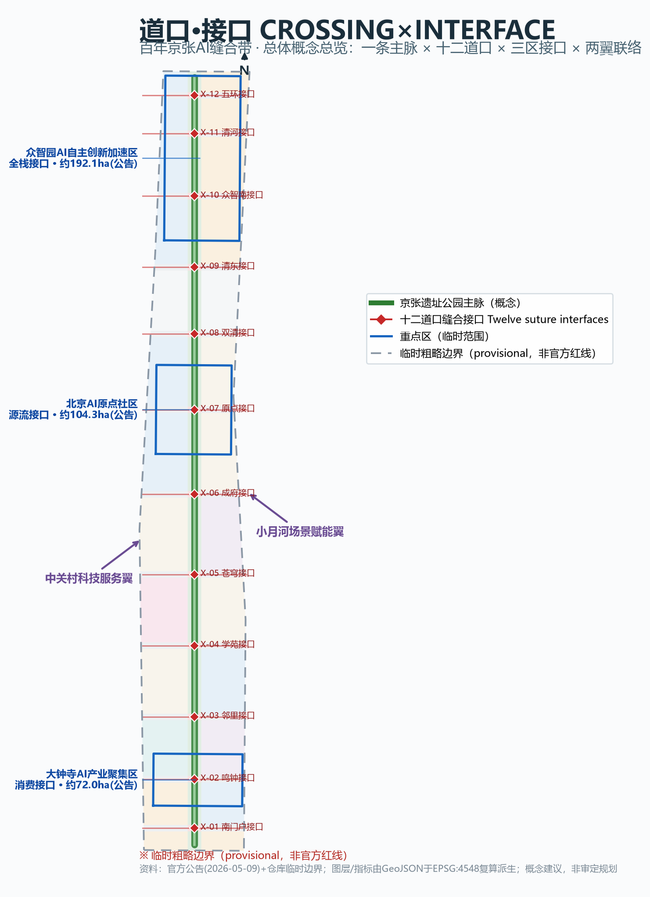
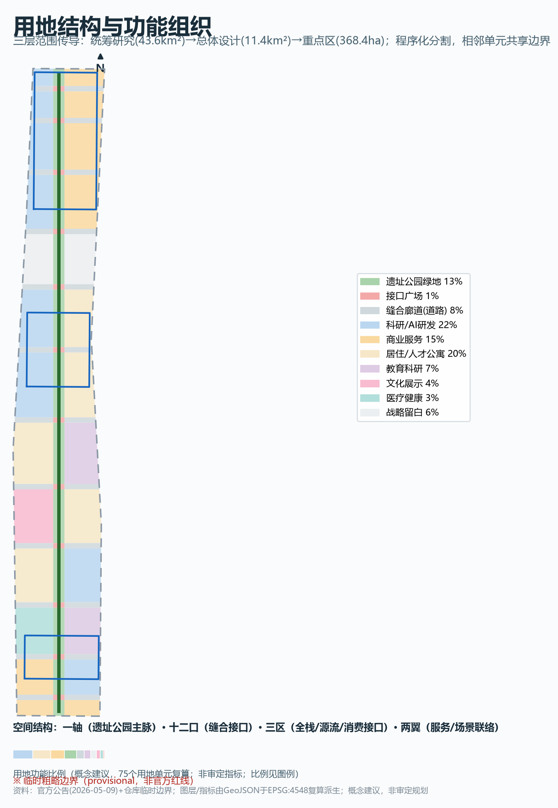
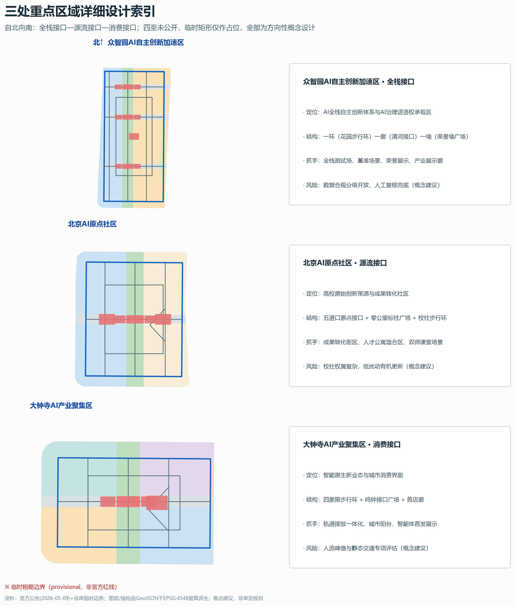
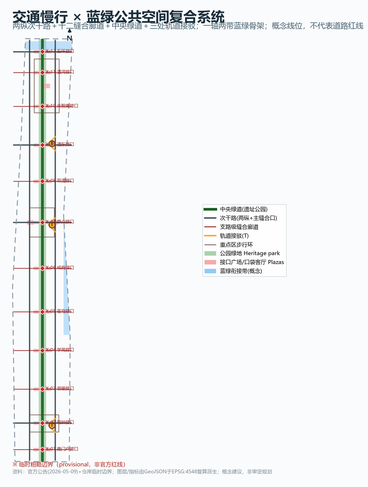
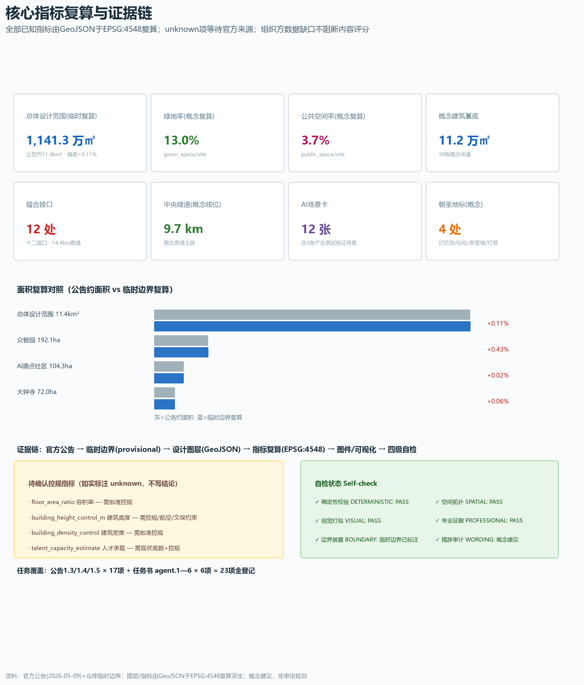

# CROSSING×INTERFACE: Urban Design Proposal for the Centennial Jing-Zhang AI Suture Belt

> A century ago, the Jing-Zhang Railway sutured a divided city through its level crossings — place names like Wudaokou and Sidaokou are the urban memory of that suture. A century later, this proposal argues: turn the centennial crossings into the city's AI-era interfaces. All spatial proposals are conceptual suggestions or reference schemes for professional teams to deepen; they do not constitute any approved planning conclusion.

## Design Basis and Source List

Evidence discipline precedes design judgment. The public source registry governs which materials may support formal claims, which are background-only, and which are provisional intake leads [source:SOURCE-REGISTRY]. The controlling documents are the official pre-announcement and the cleared agent-facing taskbook [source:OFFICIAL-ANNOUNCEMENT][source:AGENT-TASKBOOK]. Formal-task evidence includes the announcement's project name, three scope levels, areas, textual boundary descriptions, design tasks and deliverable context, plus the taskbook's ten co-creation principles, six required agent tasks and unified boundary clause, and the official snapshots of MOHURD/MNR professional standards [source:SITE-PACKAGE]. Provisional generation relies on the maintainer-derived provisional rough boundaries, fitted to the announcement's textual extents and approximate areas under EPSG:4548, usable only for AI generation, display and intake self-check [source:BOUNDARY-SOURCE][source:KEY-AREA-SOURCE]. The "three areas and two wings" public narrative is background context [source:BEIJING-KW-THREE-AREAS], and the processed fact pack only navigates tasks and missing data [source:PROCESSED-FACT-PACK][source:MISSING-DATA-CHECKLIST].

Key data gaps: no official precise redline, no official key-area polygons, no approved regulatory controls (FAR, height, density, green ratio, setbacks), no road redlines, ownership, municipal utilities or existing-building baseline. The response is a three-layer separation: geometry uses provisional boundaries with prominent labeling; metrics register statutory controls as unknown with formulas and required sources; narrative phrases every spatial landing as a conceptual suggestion. Once official geometry arrives, land use, buildings, green and public space, roads, phasing layers and every area metric must be recalculated as one chain [depth:risk_missing_data].

## Three-Level Scope Framework

The three scopes cascade from strategy to detailed design [depth:three_level_scope_framework]. The coordinated research area (~43.6 km²) hosts industry strategy, future-city research and regional synergy on the provisional research boundary [data:geometry/constraints.geojson#CONS-SITE-PROV][metric:research_area_sqm]. The overall design area (~11.4 km²) — the urban and industrial districts within 1–2 km of the Jing-Zhang heritage park — carries regulatory-plan-depth urban design and hosts all submitted layers and metric recalculation [data:geometry/site_boundary.geojson#SITE-001][metric:site_area_sqm]. The key detailed-design area (~368.4 ha) comprises, north to south, the Zhongzhiyuan AI Acceleration Area (~192.1 ha), the Beijing AI Origin Community (~104.3 ha) and the Dazhongsi AI Industry Cluster (~72.0 ha) [data:geometry/key_areas.geojson#KEY-001][metric:key_area_total_sqm].

Disclosure: all three scopes currently rely on provisional rough boundaries (EPSG:4548 fit deviation 0.02%–0.43%). They must never be treated as official redlines, approval basis or precise-area evidence. After official geometry is published, the land-use partition, building footprints, green and public spaces, road lengths, phasing extents, all area/ratio metrics, the five core figures and the offline visualization must be recalculated as one chain.

## Coordinated Research Area: Industry and Future City Research

**Overall concept: CROSSING×INTERFACE.** The railway's material legacy is not only tracks and stations but a complete set of devices that let a severed city meet again; AI-era urban infrastructure likewise needs interfaces between systems and citizens that are legible, negotiable, pausable and passable. A level crossing's operating grammar — advance notice, gate descent, two-way confirmation, ordered passage, reopening — is precisely the governance syntax AI should follow when entering the city. The proposed belt name: Chinese "道口·接口——百年京张AI缝合带", English "JINGZHANG CROSSINGS — The Interface Belt", slogan "Turn centennial crossings into urban interfaces." The naming system has three levels: the spine (heritage park vitality belt), the twelve crossings (reviving historic crossing names), and the AI service "interfaces" beneath each crossing. The name answers all three positionings at once: cultural belt (crossings are real heritage place names), life-experience belt (interfaces are tangible service touchpoints), and fusion-innovation belt (interfaces carry industrial testing and opening) [source:AGENT-TASKBOOK].

**Logo and visual identity direction.** A double motif of the railway crossbuck "X" and the Chinese character "口": two track lines cross into a diamond node whose negative space reads as "口", the crossing point being the interface. Palette: rail teal-grey, signal red, sleeper warm wood. The identity provides direction only; no existing trademark, typeface or portrait is used without authorization; final design is left to professional teams [standard:PROJECT-AGENT-OPEN-CALL-TASKBOOK].

**Three areas and two wings synergy loop.** Zhongzhiyuan hosts the full-stack self-reliance system and AI governance voice (full-stack interface); the AI Origin Community hosts the world-class innovation ecosystem (source-flow interface between university invention and industrial conversion); Dazhongsi hosts AI-native business (consumption interface); the Zhongguancun wing provides global factor allocation and capital empowerment, the Xiaoyuehe wing provides scenario empowerment. The loop runs "research in Zhongzhiyuan, conversion in the Origin Community, application in Dazhongsi, services in the two wings, display on the spine," stitched into a walkable continuum by the twelve crossing interfaces [source:BEIJING-KW-THREE-AREAS].

**Global cases as mechanism transfers (public common knowledge; no fabricated rosters or figures).** Silicon Valley–Stanford shows university interfaces need low-threshold conversion space and long tolerance for failure; Kendall Square shows mixed use and public realm sustain innovation density; King's Cross shows rail-heritage renewal can become a city-scale living room; Tokyo Station–Yaesu shows station integration multiplies district value; One-North shows work-live-learn communities retain talent; Werksviertel shows industrial relics can be activated incrementally; Zhangjiang AI Island shows vertical testbeds anchor clusters. Their transfers here are: conversion space at the source-flow interface, mixed public realm in the Origin Community, heritage-as-living-room on the spine, three transit connection interfaces, full-time talent amenities, incremental spine renewal, and the full-stack testbed in Zhongzhiyuan [source:AGENT-TASKBOOK][metric:global_case_count].

**Future city form judgment.** AI-era spatial organization should move from zoning to interface networks: compute, data and scenarios become municipal-grade elements, and the city needs pluggable, auditable, exitable interface space — test segments can close, scenarios can roll back, data can settle locally. Spatially: the heritage spine is the bus, the twelve crossings are slots, the three key areas are functional modules, and the northern strategic reserve is the long-term expansion slot [depth:overall_spatial_structure][data:geometry/land_use.geojson#LU-001].

## Overall Design Area: Urban Renewal and Regulatory-Plan-Level Urban Design

The spatial structure is "one spine, twelve crossings, two wing links." The land-use partition is generated programmatically inside the provisional boundary; adjacent units share boundary coordinates with no gaps and no overlaps [data:geometry/land_use.geojson#LU-001][metric:land_use_cell_count][depth:land_use_layout].

**One spine**: the central greenway of the heritage park runs about 9.7 km (concept alignment) as the backbone of the cultural belt and the bus of all interfaces [data:geometry/roads.geojson#RD-SPINE-GREENWAY][metric:heritage_spine_greenway_length_m]. **Twelve crossings**: south to north — Shouyi South-Gate, Mingzhong (Dazhongsi station), Sidaokou Neighborhood, Xueyuan, Cangqiong, Chengfu, Wudaokou Origin, Shuangqing, Qingdong (Qinghua East Road West), Zhongzhi-South, Qinghe, and Wuhuan interfaces. Each crossing combines an east-west suture corridor, an interface plaza and two pocket living-rooms, directly answering the announcement's call for north-south continuity, east-west connection and slow-mobility breakpoint repair [metric:crossing_interface_count]. **Two wing links**: concept secondary roads on the west and east flanks extend the suturing capacity into both hinterlands [data:geometry/roads.geojson#RD-W-LOOP].

**Urban renewal framework.** Renewal objects fall into four classes: underused space along the heritage park, campus-park-neighborhood fusion zones around the Origin Community, industry-carrying zones in Zhongzhiyuan and Dazhongsi, and community repair belts in the south and Shuangqing. Guiding functional proportions (concept only): research plus industry services about 30%, housing and community services about 25%, green and open space about 15%, with commercial, education, culture, health and roads sharing the rest — recalculated from 75 land-use cells, with strategic reserves for long-term uncertainty [metric:green_ratio][depth:development_intensity_controls]. Total building scale is not concluded without regulatory controls; 39 concept footprints express the spatial logic of renewal volume (roughly 30% retained, 30% renovated, 40% new as classification intent) [data:geometry/buildings.geojson#BD-001][metric:building_footprint_area_sqm].

**Innovation indicator system.** Instead of unverifiable outcome claims, the proposal uses five recalculable process indicators — interface density, scenario openness, slow-mobility connectivity, green accessibility and honor accumulation — all derived from layers and scenario cards, avoiding invented output or fiscal commitments [metric:scenario_card_count][depth:metrics_recalculation].

**Heritage park vitality belt.** The southern segment (Dazhongsi–Chengfu) is the city living-room, the middle (Wudaokou–Shuangqing) the campus-community fusion segment, and the north (Zhongzhiyuan–Qinghe) the garden-innovation segment. Mingzhong, Wuhuan and Wudaokou are candidate landmark landscape nodes (concepts), matching the announcement's south-end, north-end and overpass node requirements [data:geometry/public_space.geojson#PS-001].

**Urban character.** The keynote is "warm wood within rail teal-grey": low-rise heritage edges, mid-density research masses, landmark volumes only at gateways; height, intensity, roofscape and massing are conceptual guidance only, with all statutory control values registered as pending [depth:height_massing_character].

## Detailed Design of Key Areas

Each key area forms a readable sub-scheme of positioning, structure, building renewal, transport, public space, AI scenarios and implementation risk. Key-area extents are unpublished; the provisional rectangles are placeholders, and all conclusions are directional [source:KEY-AREA-SOURCE][depth:three_key_area_detailed_design].

**Zhongzhiyuan AI Acceleration Area (~192.1 ha, provisional).** Positioned as the full-stack interface: a chip–framework–model–application–governance display-and-test chain organized as "one ring, one corridor, one wall" — a garden pedestrian ring linking research clusters, the Qinghe corridor bringing blue-green ecology in, and the Marshalling-Yard Agent Honor Wall plaza for contribution display [data:geometry/key_areas.geojson#KEY-001][metric:zhongzhiyuan_area_sqm]. Renewal leans retain-and-renovate with inserted lab platforms (concept classification); regional connection relies on the Wuhuan and Qingdong interfaces (concepts); green-space scenarios include outdoor reasoning fields and grove salons. Risk: full-stack testing touches data compliance and must open in graded steps with human review.

**Beijing AI Origin Community (~104.3 ha, provisional).** Positioned as the source-flow interface: a campus-community fusion structure of "release–incubate–live," anchored by the Wudaokou Origin interface and the Kilometer-Zero plaza concepts [data:geometry/key_areas.geojson#KEY-002][metric:ai_origin_area_sqm]. Per the announcement, renewal explores low-disturbance organic modes; slow-mobility loops link the conversion blocks with talent-apartment mixes; Wudaokou and Qinghua East Road West transit connections improve access. Risk: complex campus-community ownership requires consensus first.

**Dazhongsi AI Industry Cluster (~72.0 ha, provisional).** Positioned as the consumption interface around agents, smart terminals and content consumption: a four-quadrant pedestrian ring, the Mingzhong interface plaza and an AI-native first-store corridor, answering the four-quadrant walkability and bicycle-parking tasks [data:geometry/key_areas.geojson#KEY-003][metric:dazhongsi_area_sqm]. Station integration is expressed as a concept strategy of transit connection and ground-level linkage (no engineering conclusions); the planned green space is a city balcony plus test lawn. Risk: peak crowd handling of consumption scenarios needs dedicated assessment.

## AI Innovation Ecosystem, Personas, and AI+ Scenarios

Six concept personas (built from public common knowledge, no personal data): fundamental researchers (quiet reasoning space, compute interface), students and young scholars (low-cost trial-and-error and a stage), developers and founders (scenario, data and capital interfaces), residents and seniors (trustworthy AI public services with non-digital fallbacks), international visitors and returnees (multilingual services), and city operators (auditable, exitable governance interfaces) [metric:persona_count].

**Twelve AI scenario cards** — each registers location, users, operating data, privacy boundary, human review, operator concept, linked layer and main risk; all are conceptual suggestions [metric:scenario_card_count]: (1) Crossing slow-mobility pilot on the spine and corridors with anonymous flows and one-button human takeover; (2) heritage-park cultural guide using public cultural materials with editorial review; (3) enterprise-service copilot in Zhongzhiyuan and the service wing using public policy data without commercial secrets; (4) health-service navigation near the AI+health zone with minimized, locally settled data and navigation-only scope; (5) public-safety operations review on plazas with full traceability and appeal channels; (6) low-speed autonomous shuttle test (industrial test scenario) on a fenced segment with onboard safety officer; (7) robot delivery and inspection test (industrial test scenario) on limited routes with remote takeover; (8) open benchmark for spatial-intelligence models (industrial test scenario) with cleared datasets and a benchmark committee; (9) AI+education double-teacher classrooms keeping a pure-human option; (10) the Agent Honor Wall and open-source tour with voluntary registration and correction mechanisms; (11) low-carbon energy coordination advising only, never direct control; (12) multilingual international visitor services with no identity retention. Scenarios 6–8 are the three industrial test-and-verify cards; "testing" never means "approved for operation" [source:AGENT-TASKBOOK]. The scenario-space-operation mapping: cards hang on interface plazas, plazas string along the spine, the spine plugs into the three key areas, and operations follow an apply–sandbox–inform–open–review loop [depth:blue_green_public_space].

## Land Use, Building Scale, and Retain-Renovate-Demolish Strategy

Land use follows the MNR territorial classification codes: 75 units cover the whole provisional overall design area [metric:land_use_cell_count][standard:MNR-LAND-USE-CLASSIFICATION-GUIDE]. The spine carries park green and interface plazas (1401/1403), the twelve corridors carry road use (1207), key areas mix research (0802) and commercial services (05), the east hosts education (0804), housing and talent apartments (0701) concentrate mid-corridor, culture (0803) and health (0806) each get a band, and strategic reserves (16) sit in the north and middle.

Thirty-nine concept building footprints sit inside research, commercial, residential, education, culture and health units, totaling about 112,000 sqm of footprint (concept recalculation), expressing distribution logic rather than any total-scale conclusion [metric:building_footprint_area_sqm][data:geometry/buildings.geojson#BD-001]. Retention classification is conceptual: heritage edges and existing campus fabric lean retain, inefficient factories and vacant plots lean renovate-or-rebuild — roughly 30/30/40 as renewal-rhythm intent; any parcel-level conclusion awaits ownership, baseline and regulatory confirmation [depth:retain_renovate_demolish][depth:development_intensity_controls]. Space supply follows a life-cycle: nursery space in reserves and renovated stock, pilot platforms in Zhongzhiyuan, headquarters and display at Dazhongsi and gateways, and interface-ready recycling for failed uses.

## Transport, Rail, Municipal Infrastructure, and Public Services

The transport strategy: give the severed east-west back to walking and cycling, keep north-south for public and slow mobility [depth:traffic_rail_slow_parking]. The concept network comprises two north-south secondary roads, twelve suture corridors (Mingzhong, Wudaokou, Qingdong and Wuhuan at concept secondary level, the rest branch), one central greenway and three transit connection interfaces — about 47 km of concept centerlines, of which suture corridors total about 14.4 km and the greenway 9.7 km [metric:road_network_total_length_m][metric:stitch_corridor_total_length_m]. Three transit connections serve Dazhongsi station, Wudaokou and Qinghua East Road West (concept locations); the Dazhongsi four-quadrant link is expressed as a pedestrian ring concept. Bicycle stations sit at corridor ends; underground–ground parking linkage remains a strategy, not an engineering scheme.

Municipal and new-infrastructure fusion (concepts): distributed energy and edge-compute micro-nodes combine with interface plazas; waste-heat cascades, photovoltaic canopies over slow corridors and microclimate regulation in the park express the new-infrastructure agenda spatially; pipe capacities, alignments and engineering feasibility are all pending items without calculation claims [source:MISSING-DATA-CHECKLIST]. Public services follow a "five-minute interface circle": each plaza compounds community services, health navigation and self-service governance, with talent amenities densified along the middle housing belt [data:geometry/land_use.geojson#LU-001].

## Blue-Green Network, Public Space, and Urban Character

The blue-green skeleton is "one axis, two belts, twelve mouths": the heritage spine (about 1.489 million sqm of concept green, 13.0% green ratio), the Qinghe and Xiaoyuehe concept connection belts (non-statutory, analysis-helper layers), and twelve crossings pushing blue-green experience sideways into both flanks [metric:green_space_area_sqm][data:geometry/green_space.geojson#GS-001][data:geometry/constraints.geojson#CONS-WATER-N]. The public-space system combines 12 interface plazas, 24 pocket living-rooms and 4 landmark plazas — about 422,000 sqm (3.7% public-space ratio, concept recalculation) — each plaza a three-in-one interface for events, scenario testing and quiet stay [metric:public_space_ratio][metric:public_space_area_sqm].

**AI pilgrimage landmarks and honor display (four concept nodes, more than the required three)**: the Gatehouse Crossing Memory Hall plaza (Wudaokou) turns gates, signals and timetables into a walk-in memory device; the Kilometer-Zero AI Origin Marker plaza marks the starting point of original innovation; the Marshalling-Yard Agent Honor Wall plaza (Zhongzhiyuan) displays registered contributions of open-source contributors and agents with correction mechanisms; the Mingzhongtai AI Industry Beacon plaza (Dazhongsi) is a launch balcony for AI-native business [metric:ai_landmark_count][data:geometry/public_space.geojson#PS-001].

Urban character guidance by zone: low and warm at heritage edges, solid and mid-density for research, tall and simple only at gateways; green public roofs encouraged; high-saturation reflective materials discouraged [standard:MOHURD-URBAN-DESIGN-MEASURES][depth:height_massing_character].

## Renewal Projects, Implementation Policy, and Phasing

Fourteen concept renewal projects are registered by type, location, dependency and phase (all conceptual suggestions) [metric:renewal_project_count][data:geometry/phasing.geojson#PH-1]: near-term (2026–2028) covers the southern spine activation, Mingzhong interface with the Dazhongsi four-quadrant ring, the Sidaokou, Xueyuan, Cangqiong and Chengfu interfaces; mid-term (2028–2031) covers the Wudaokou Origin interface with the memory hall, Kilometer-Zero marker with the conversion blocks, Shuangqing talent-community repair and the Qingdong transit connection; long-term (2031–2035) covers the Zhongzhi-South interface and industry gallery, the honor wall with the full-stack testbed, the Qinghe blue-green connection and the Wuhuan gateway with the northern reserve.

Policy concepts: package each crossing as an "interface renewal unit" combining corridor, plaza, pocket rooms and adjoining plots; run scenario sandboxes under an apply–assess–inform–open–review loop; link a community co-building fund with open-source contribution incentives; organize public participation through exhibitions, interface open days and annual scenario hearings [source:AGENT-TASKBOOK].

**Long-term operation and global event system (concepts)**: one conference (Jingzhang AI City Interface Conference), one festival (Crossing Maker Festival), one challenge (City Interface Scenario Challenge) and one annual honor list; developer-community operation works like a marshalling yard — urban problems are broken into claimable "cars" and marshalled into the scenario "train" after review; public experience routes link the four landmarks and twelve crossings into a one-day pilgrimage loop; international communication uses bilingual narrative and a "Century of Crossings" exhibition; the conversion funnel runs participate–test–settle–co-build. All events, investment and funding content are proposals and mechanisms, never confirmed arrangements or commitments [depth:phasing_implementation].

## Metrics, Area Recalculation, and Compliance Matrix

The principle: only recalculable numbers are written as numbers; anything else is honestly unknown. The overall design area recalculates to about 11.413 million sqm under EPSG:4548 on the provisional boundary — a 0.11% fit deviation from the announced ~11.4 km² that reflects provisional fitting, not an official area conclusion [metric:site_area_sqm][source:BOUNDARY-SOURCE]. The three key areas recalculate to about 1.929, 1.043 and 0.720 million sqm (about 3.693 million sqm combined), also provisional [metric:key_area_total_sqm]. The 13.0% green ratio and 3.7% public-space ratio derive from the green and public-space layers over the provisional boundary: the green ratio underwrites garden-district talent life, the public-space ratio matches the "one interface plaza every 800 m" sociability target [metric:green_ratio][metric:public_space_ratio]. The ~112,000 sqm building footprint is a concept distribution and does not infer FAR; FAR, height control and density are registered unknown in metrics.json with their required official sources [metric:floor_area_ratio].

Process indicators: 12 suture interfaces and ~14.4 km of suture corridors answer east-west suturing; the ~9.7 km greenway answers north-south continuity; 12 scenario cards (3 industrial test scenarios), 6 personas, 4 landmark concept nodes, 14 renewal projects and 3 phases form the auditable operations checklist [metric:heritage_spine_greenway_length_m][metric:industrial_test_scenario_count]. Every announcement task (1.3/1.4/1.5) and every agent taskbook requirement (agent.1–agent.6) is registered in compliance_matrix.json with sections, layers, metrics, drawings, visual sections, sources, assumptions and self-check evidence; standard and depth responses live in standard_matrix.json and design_depth_matrix.json with readable explanation in the matching chapters [depth:metrics_recalculation].

## Risk, Copyright, and Compliance

Eight-dimension self-assessment (risk.json): data privacy, policy uncertainty and implementation complexity score high, mitigated by minimized collection with human takeover, full-chain recalculation after official releases, and phased delivery — each high score names a professional or public review path; technology maturity, spatial dispute, public acceptance, operations cost and equity score lower with their own mitigations [depth:risk_missing_data].

Copyright and compliance: all cited material is officially public or cleared; global cases are common-knowledge summaries; no non-public drawings, internal controls, personal data or unauthorized material is used; IP follows the announcement's Article 8.1 framework with attribution to the applicant — see report/copyright_statement.md [source:OFFICIAL-ANNOUNCEMENT]. Boundary clauses are enforced item by item: no invented rosters, investments, output or fiscal commitments; test scenarios are never described as approved operations; concept landmarks are never described as approved construction; provisional boundaries are never described as official redlines; every spatial landing is phrased as a conceptual suggestion, reference scheme or material for professional deepening. The missing-data list and the recalculation list after official boundary release are registered in the assumptions and missing-data files [source:MISSING-DATA-CHECKLIST].

## References

The following materials genuinely shaped this proposal, in order of importance; the complete machine-readable index lives in sources.json and the three matrix files [source:SITE-PACKAGE].

1. Beijing Municipal Commission of Planning and Natural Resources (Haidian Branch): Pre-qualification Announcement of the Centennial Jing-Zhang AI Innovation Belt Urban Design International Solicitation, 2026-05-09 [source:OFFICIAL-ANNOUNCEMENT].
2. Excerpt of the Agent-Facing Open-Call Taskbook (user-provided cleared document), 2026-05-18 [source:AGENT-TASKBOOK].
3. Beijing Municipal Science & Technology Commission / Zhongguancun Administrative Committee: "Three Areas and Two Wings" for a World-Class AI Cluster, 2026-04-03 [source:BEIJING-KW-THREE-AREAS].
4. MOHURD: Urban Design Management Measures, 2017 [standard:MOHURD-URBAN-DESIGN-MEASURES].
5. MOHURD: Measures for the Preparation and Approval of Regulatory Detailed Planning of Cities and Towns [standard:MOHURD-CONTROL-DETAILED-PLANNING].
6. Ministry of Natural Resources: Guide to Land and Sea Use Classification for Territorial Spatial Survey, Planning and Control, 2023-11 [standard:MNR-LAND-USE-CLASSIFICATION-GUIDE].
7. Repository provisional geometry: provisional_boundaries.geojson and provisional_boundaries_basis.md [source:BOUNDARY-SOURCE].
8. Repository processed materials: agent_fact_pack.md, missing_data_checklist.csv, source_use_matrix.csv [source:PROCESSED-FACT-PACK].
