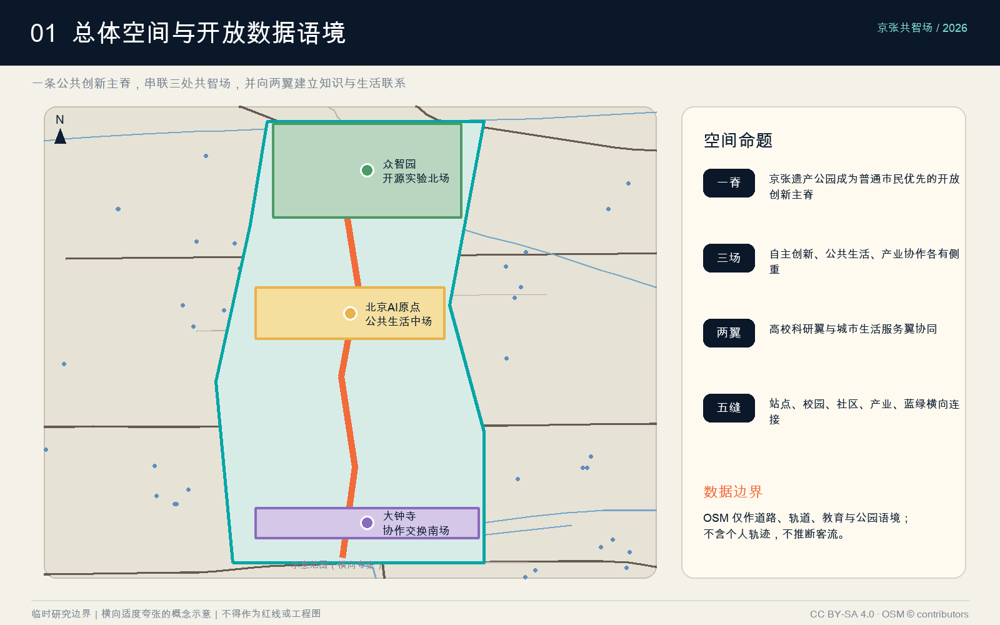
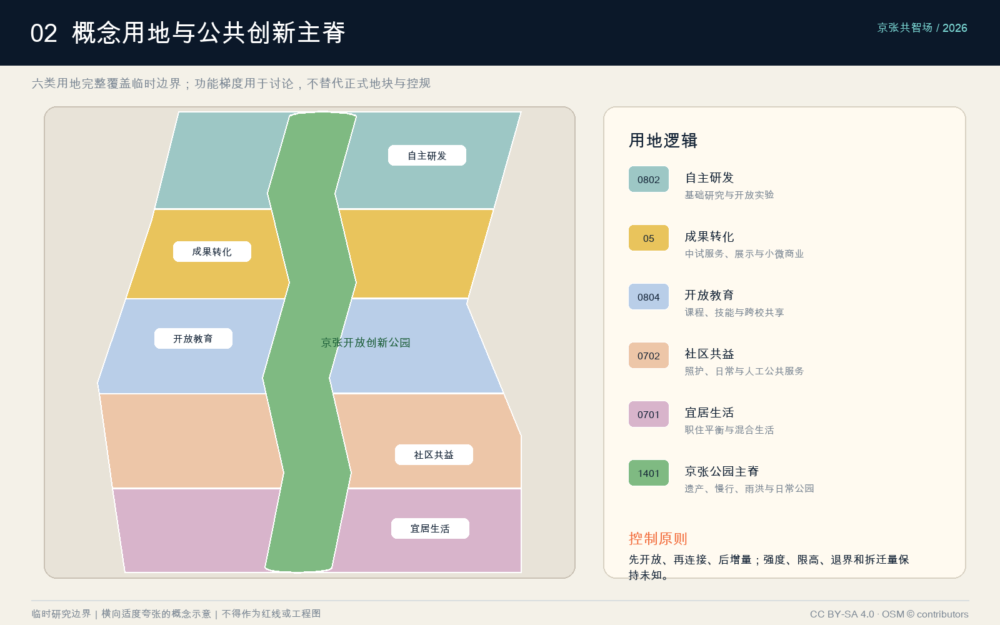
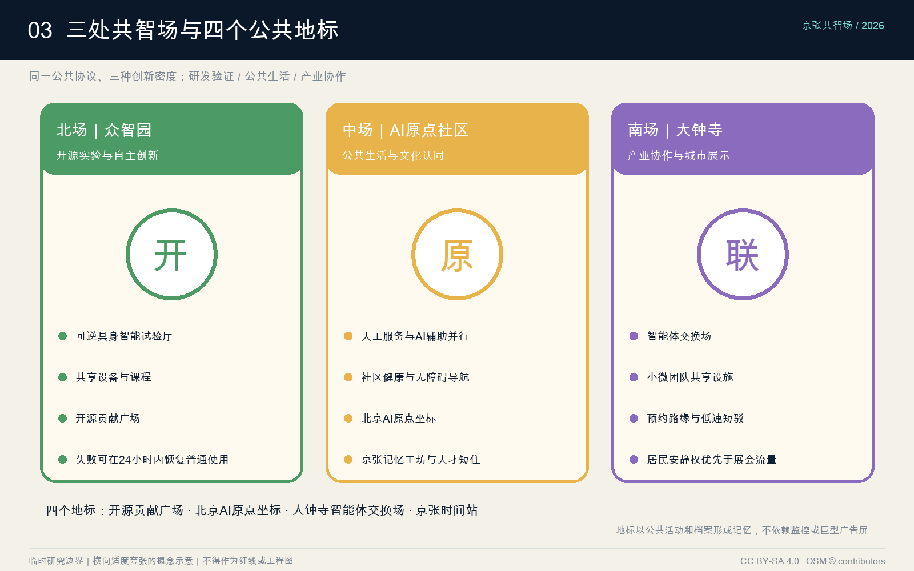
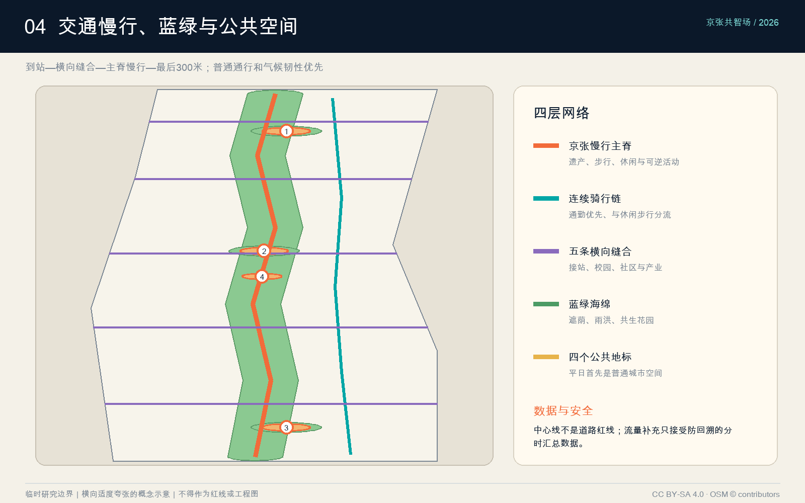
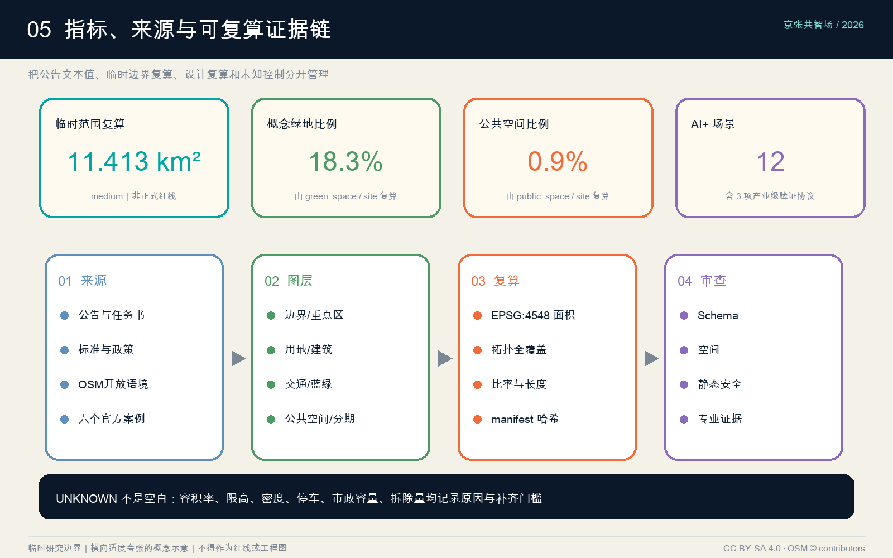

# 京张共智场：Jing-Zhang AI Commons

本方案把“AI 创新带”理解为一套城市公共协议，而不是一排封闭园区或一组持续采集个人行为的设备。空间上，以百年京张遗产廊道为连续公共主脊，串联众智园、北京 AI 原点社区和大钟寺三处共智场，并向学院路—中关村与北下关—西直门两翼建立知识、生活和产业连接。运营上，以公开议题、可逆试点、人工复核、公众退出和季度复盘形成长期城市实验机制。成果的精确边界、强度、限高、拆迁和市政容量均服从后续正式资料；本次提供可复算的概念框架与清晰的数据缺口。[source:SRC-2026-BJ-GH-QUAL-PREANNOUNCEMENT] [standard:PROJECT-OFFICIAL-ANNOUNCEMENT]

## 设计依据与资料清单

资料按“约束、背景、方法、设计”四级管理。第一层是公告和任务书，确定项目目标、43.6 平方公里统筹研究、约 11.4 平方公里总体设计、三处共 368.4 公顷重点设计以及六项智能体任务；第二层是住建与自然资源标准，约束城市设计表达、控规边界和用地代码；第三层是北京市、海淀区政策与六个创新城区案例，用于解释产业和运营机制；第四层才是本智能体生成的用地、建筑原型、慢行、蓝绿、公共空间与分期建议。[source:SRC-DATA-REGISTRY] [source:SRC-PROCESSED-FACT-PACK] [standard:MOHURD-URBAN-DESIGN-MEASURES]

空间资料存在一项决定性限制：仓库提供的是临时粗略边界，不是正式坐标红线。方案完整保留 `official_boundary=false`、`geometry_role=provisional_constraint`、来源、公告约面积和投影复算面积；任何比例均称为“基于临时边界的概念指标”。容积率、建筑密度、限高、退界、道路红线、权属、文保边界和市政容量缺失，统一保持 unknown，不以邻近项目或案例值代填。[source:SRC-PROVISIONAL-BOUNDARIES-2026] [depth:existing_conditions_diagnosis] [depth:risk_missing_data] [data:geometry/site_boundary.geojson#SITE-PROV-001]

外部数据只补足语境。2026-08-07 的 OSM 提取覆盖道路、轨道、水系以及具名教育、医疗和公园对象；在临时范围外扩 1,500 米内按名称和类型去重，识别到 147 个教育/图书馆标注、31 个医疗标注和 53 个公园标注。它们只提示可能的协同对象，不能代表学位、床位、服务容量或真实客流。本方案没有使用可识别个人的骑手、网约车、快递或连续位置轨迹，也不把平台热力图截图当作开放数据。[source:SRC-OSM-CONTEXT-20260807] [metric:osm_education_anchor_count]

## 三层范围工作框架

第一层“统筹研究范围”以约 43.6 平方公里的政策与创新网络为对象，研究产业链、人才日常、院校合作、全球活动和两翼协作，不绘制虚假的全域法定图。第二层“总体设计范围”以约 11.4 平方公里临时 polygon 为生成框架，提出“一脊、三场、两翼、五类横向缝合”的概念结构：一脊是京张开放创新公园；三场是北部自主创新、中部原点社区、南部产业协作；两翼分别连接高校科研与城市生活服务；横向缝合聚焦站点、校园、社区、产业和蓝绿网络。[metric:announced_research_scope_area_sqm] [metric:announced_overall_design_area_sqm] [depth:three_level_scope_framework]

第三层“三处重点区域”总公告面积 368.4 公顷，采用“同一公共协议、三种创新密度”深化。众智园强调基础研发和具身智能验证，北京 AI 原点社区强调公共生活与文化认同，大钟寺强调产业协作和城市级展示。三者共享开放空间、场景准入、隐私审查、数据字典、失败复盘和年度活动，但各自避免功能同质化。[metric:announced_key_area_total_sqm] [metric:key_area_count] [data:geometry/key_areas.geojson#three-provisional-key-areas]

范围之间通过“问题—空间—运营—证据”闭环连接：统筹层提出产业和人才问题，总体层配置可达性和公共资源，重点区把问题变成可逆场景，运营层用安全、包容、使用和维护指标评估；只有通过复盘的试点才扩大。这个框架响应“总体概念与功能统筹”，同时避免用局部炫技替代全带公共价值。[standard:PROJECT-AGENT-OPEN-CALL-TASKBOOK] [depth:overall_spatial_structure]

## 统筹研究范围产业与未来城市研究

创新生态采用“经济资产、空间资产、网络资产”三联模型。经济资产包括基础模型、具身智能、科学智能、AI 工具链、算力与安全；空间资产包括可负担研发、中试共享、短住住房、公共绿地和站点连接；网络资产包括高校—企业—社区协作、开源治理、资本与首批用户。海淀的优势不是从零造城，而是把分散优势通过一条可步行、可见、可参与的公共脊重新编排。[source:SRC-2026-BJ-KW-THREE-AREAS-WINGS] [source:SRC-2026-HAIDIAN-1X1] [source:SRC-BROOKINGS-INNOVATION-DISTRICTS] [standard:PROJECT-OFFICIAL-ANNOUNCEMENT]

六个案例只提取机制，不复制指标：新加坡 one-north 提供“工作—生活—学习—游憩”和创业社区的复合逻辑；伦敦 Knowledge Quarter 说明机构邻近仍需网络组织；Kendall Square 把公共绿地、创新步道和高频社群活动结合；多伦多 MaRS 把研究、创业、资本、客户与测试床连成服务平台；Paris-Saclay 强调城市尺度示范、公共交通和生物多样性；Barcelona 22@ 说明生产性城区更新必须与住房、绿色空间和连接性同步。[source:SRC-JTC-ONE-NORTH] [source:SRC-KQ-LONDON] [source:SRC-KENDALL-SQUARE] [source:SRC-MARS-TORONTO] [source:SRC-PARIS-SACLAY] [source:SRC-BARCELONA-22AT] [metric:case_study_count]

对京张的转译是“五种共享”：共享问题库，让企业、居民和高校共同定义议题；共享中试，让昂贵设备按时段开放；共享首批用户，通过自愿招募和伦理审查测试；共享公共空间，让创新过程可见；共享失败档案，公布无效试点及退出原因。产业招商从“面积出租”转为“任务组队”，每个入驻团队至少对应一个公开问题、一个本地协作伙伴和一项可衡量公共贡献。[depth:municipal_new_infrastructure] [source:SRC-2026-0518-AGENT-OPEN-CALL-TASKBOOK]

人才策略围绕一天而非一次招聘：15 分钟可获得安静工作位、托育/照护、运动、餐饮、文化和社群；30 分钟可连接轨道、高校和核心研发节点；夜间仍有安全可辨识的慢行与公共活动。评价人才城区不只看高薪岗位，还看青年进入门槛、服务劳动者通勤与休息、居民参与权、短住转长期的住房路径以及国际来访者的语言可达性。[depth:existing_conditions_diagnosis] [metric:persona_count]

## 总体设计范围城市更新与控规深度城市设计

总体结构是“一条公共创新主脊＋五个横向缝合口＋六类概念用地”。主脊沿京张遗产方向组织步行、骑行、雨洪、文化解释和可逆试验；横向通廊把东西两侧现有道路、站点、校园和社区接到主脊；六类用地采用自然资源分类子集：科研 0802、商业服务 05、教育 0804、社区服务 0702、居住 0701、公园绿地 1401。它们完整覆盖临时 polygon 且互不重叠，表达功能梯度而非法定地块。[data:geometry/land_use.geojson#conceptual-complete-partition] [metric:land_use_zone_count] [standard:MNR-LAND-USE-CLASSIFICATION-GUIDE] [depth:land_use_layout]

更新方法是“先开放、再连接、后增量”。先把连续公共空间、入口、照明、无障碍和导视做成最低共识；再用横向慢行、共享大厅和公共服务弥合封闭地块；最后只在公共服务与交通承载通过后增加建筑原型。现状建筑尚无测绘，本方案不画真实拆除红线，而以“保留待调查、适应性再利用候选、可逆亭、增量候选”四类决策门槛替代草率拆改结论。[depth:retain_renovate_demolish] [standard:MOHURD-CONTROL-DETAILED-PLANNING]

控制语言分三栏：已知栏只放公告约面积、任务和合法分类；建议栏放功能、连通、公共空间、建筑原型与分期；待确认栏放容积率、密度、限高、退界、停车、市政和文保。城市天际线建议采用“主脊低、节点可识别、两侧渐变、历史界面留白”，但不填写米数；建筑界面建议首层开放、院落可穿行、设备后勤与公众路径分离，最终数值必须进入正式控规和建筑专业程序。[depth:development_intensity_controls] [depth:height_massing_character] [standard:MOHURD-ARCH-DESIGN-DEPTH-2016]

## 重点区域详细设计

众智园 AI 自主创新加速区定位为“开源实验北场”。空间以开放算力学习馆、研发院、可逆试验厅和青年加速坊围合开源实验花园；主脊侧是公众可见的展示与课程界面，后侧才布置安全分区和设备物流。场景重点是具身智能低速验证、研究设备预约和高校课程共创。退出机制要求测试失败或出现安全事件时，场地在 24 小时内恢复普通公共使用；正式边界与工程隔离距离待专项确认。[data:geometry/buildings.geojson#BLDG-101] [depth:three_key_area_detailed_design]

北京 AI 原点社区定位为“公共生活中场”。AI 原点坐标不是巨型屏幕，而是一处可停留、可讨论、可理解模型局限的市民空间；周边布置社区共益服务站、京张记忆工坊、共享院和短住人才原型。场景优先服务老年人、儿童照护者、访客和服务劳动者，包括无障碍导览、社区健康导航、技能机会匹配与文化解释。任何个性化服务都保留人工柜台与纸面路径。[data:geometry/public_space.geojson#PUBLIC-002] [source:SRC-2017-MOHURD-URBAN-DESIGN-MEASURES]

大钟寺 AI 产业聚集区定位为“协作交换南场”。以产业会客厅、中小企业加速器、首发首秀街坊和慢行接驳驿站围合智能体交换场；重点解决研发成果如何找到制造、场景、采购和运维伙伴。首层设置小尺度可租单元和共享会议设施，降低初创团队进入门槛；活动时段与居民安静时段分开，物流采用预约路缘和低速短驳，不把公共空间长期变成展会后场。[data:geometry/phasing.geojson#PHASE-002] [metric:conceptual_building_count]

三处重点区共享四个标志节点：开源贡献广场记录可验证的公共贡献；北京 AI 原点坐标解释海淀创新史；大钟寺智能体交换场组织供需对接；京张时间站把铁路时间、城市更新与年度开源周叠合。地标以活动、档案和空间品质形成记忆，不依赖持续播放广告或采集访客身份。[metric:landmark_count] [data:geometry/key_areas.geojson#three-provisional-key-areas]

## AI 创新生态、人才画像与 AI+ 场景

五类主要使用者共同校验方案：来访研究者需要短时工作、设备和多语导航；初创团队需要低成本试验、首批用户与合规支持；学生和青年毕业生需要课程、实习、展示与可负担日常；既有居民和老年人需要清晰、可退出且有人工替代的公共服务；骑行配送、保洁、安保等服务劳动者需要可休息、可补给、不被算法惩罚的空间。任何场景若只优化前两类人，就不视为公共创新成功。[metric:persona_count] [standard:PROJECT-AGENT-OPEN-CALL-TASKBOOK]

十二张场景卡采用统一字段“使用者—时段—空间—最小数据—人工复核—成功指标—失败回退”：

- S01 无障碍共行：路口与入口提供触觉、语音和高对比导视，成功看独立到达率，设备失效时保留连续物理标识。
- S02 多语来访助手：在站点和共享大厅回答空间与活动问题，只处理当次会话，不建立访客画像。
- S03 低速具身验证环：限定时段、限定速度、现场安全员、物理急停，成功看无伤害运行和人工接管质量。
- S04 弹性路缘：按时段切换无障碍上下客、配送和活动装卸，以匿名占用时长优化，不跟踪个人司机。
- S05 研究设备共享：高校与企业公布可预约时段、培训要求和维护责任，成功看跨机构有效使用而非预约量。
- S06 社区健康导航：只提供机构位置、开放时间和人工转介，不做诊断、不存健康身份。
- S07 技能机会匹配：以用户主动填写的技能和偏好推荐课程/岗位，允许查看原因、纠错和删除。
- S08 京张文化解释：用可核验档案叠加现场故事，明确事实、推断和创作三类标签。
- S09 公共空间编排：根据活动申请、天气和维护条件安排场地，不使用人脸客流；居民安静权是硬约束。
- S10 园区能源协同：在建筑级汇总粒度展示负荷与削峰建议，设备控制始终保留人工权限。
- S11 极端天气互助：发布避暑、避雨、饮水、充电与人工服务点，通信中断时保留实体地图和广播。
- S12 低速末端配送：只在固定线路和窗口运行，设置骑手休息、手动交接与投诉通道，不以试点压低劳动报酬。

[metric:scenario_count] [depth:municipal_new_infrastructure]

三项产业级验证协议把“展示”变成可退出的实验。T1 具身智能低速环验证感知盲区、人工接管和公共冲突；T2 多智能体城市沙盒用合成或匿名汇总数据测试路缘、活动和能源协同；T3 隐私优先公共服务单元比较纯人工、端侧辅助与云端辅助三种流程。每项都设红线指标、公开日志、独立安全负责人、投诉通道和自动到期日，默认不续期。[metric:testbed_scenario_count] [source:SRC-MARS-TORONTO] [depth:municipal_new_infrastructure]

治理采用四道门：必要性审查先问是否必须使用 AI；数据审查限制字段、粒度、留存和访问；空间审查保障无障碍、安静与普通通行；季度复盘公开收益、伤害、偏差、运维和退出决定。禁止把人脸识别、设备指纹或连续个人轨迹作为进入公共空间的条件；重要决定必须可解释、可申诉并由人承担责任。[source:SRC-2026-0518-AGENT-OPEN-CALL-TASKBOOK] [data:geometry/constraints.geojson#selected-osm-context]

## 用地、建筑规模与拆改留方案

概念用地不是按单一产业园分仓，而是沿主脊形成五个生活—创新带和一个连续公园带。科研带靠近北部自主创新节点；商业服务带承接成果转化；教育带连接开放课程与实验；社区服务带补齐照护和日常；居住带提供人才与既有居民共同使用的生活设施；1401 公园绿地贯穿全域。用地分区由同一边界差集生成，避免几何空洞和重叠，但未来必须按正式地块、权属、道路和现状重新切分。[data:geometry/land_use.geojson#LU-001] [metric:green_space_area_sqm] [standard:MNR-LAND-USE-CLASSIFICATION-GUIDE]

十二个建筑基底被定义为“原型”，每处重点区四类：公众共享大厅、研发/验证设施、社区或文化设施、生活/接驳配套。它们共同强调可穿行首层、共享院落、设备后勤独立、屋顶雨水与可逆室内分隔。基底联合面积可从 GeoJSON 复算，但不能推导总建筑面积和容积率，因为层数、限高、退界和正式地块均未知。[metric:building_footprint_area_sqm] [data:geometry/buildings.geojson#conceptual-prototypes]

拆改留决策采用证据门槛：具有历史、结构或持续社区价值的建筑优先保留；结构允许且功能可转换者进入适应性再利用候选；只有在结构安全、公共利益、碳成本、安置与公众程序均完成后才讨论拆除；新增建筑先用可逆亭和小体量验证需求。现阶段 `demolition_area_sqm` 保持 unknown，避免以渲染图替代逐栋调查。[depth:retain_renovate_demolish] [metric:conceptual_building_count] [standard:MOHURD-ARCH-DESIGN-DEPTH-2016]

强度与高度使用“规则而非假数值”：主脊界面优先低层开放和树冠连续，地标靠公共活动辨识；邻近社区控制噪声、眩光和压迫；研发设备层高与后勤需求必须由专业核验；任何新增容量都要同时证明轨道/慢行承载、公共服务、能源和雨洪能力。正式控规到位前，floor_area_ratio、building_density 和 maximum_building_height_m 均不填写设计目标。[depth:development_intensity_controls] [depth:height_massing_character]

## 交通、轨道、市政与公共服务设施

交通结构以“到站—横向缝合—主脊慢行—最后 300 米”组织。连续绿道承担步行与休闲，东侧骑行链提供更直接通勤，五条东西通廊连接两侧道路、站点、校园和社区；重点区入口设置无障碍上下客、共享单车整理、配送预约和普通步行的分时路缘。所有道路为概念中心线，不能解释为红线、车道数或交通组织批复。[data:geometry/roads.geojson#conceptual-network] [metric:conceptual_road_centerline_length_m] [depth:traffic_rail_slow_parking]

公开地图显示周边教育与轨道资源密集，但不提供可靠的断面流量和人群 OD。因此方案不绘制“精确热力图”，而提出安全的数据补充协议：由主管部门或运营者提供不含设备标识的 15 分钟汇总进出量、站点分时客流、路口转向量、路缘占用时长和事故点；小样本步行访谈由自愿参与者完成；所有数据在空间和时间上达到防止回溯个人的粒度。[source:SRC-OSM-CONTEXT-20260807] [data:geometry/constraints.geojson#osm-context-lines]

市政采用“先测容量、再定增长”。一期设置开放数据字典、建筑级能耗汇总、雨水花园监测、公共充电与应急电源示范；二期才根据给排水、电力、热力、再生水和通信专项确定增量。边缘计算节点仅处理场景必要数据，物理设备有资产编号、责任单位、维护周期和断电安全状态；不把摄像头数量或屏幕面积当作智能化水平。[depth:municipal_new_infrastructure] [standard:MOHURD-CONTROL-DETAILED-PLANNING]

公共服务以“现有资源协同＋缺口核验”推进。教育标注用于邀请学校、大学和图书馆加入开放课程，不用于判断学位平衡；医疗标注只支持位置与转介；社区服务以步行可达、人工服务、儿童和老年友好为先。停车总量、学校容量和医疗床位保持未知，待设施台账和服务人口口径确认。[metric:osm_education_anchor_count] [source:SRC-KQ-LONDON]

## 蓝绿空间、公共空间与城市风貌

蓝绿系统把京张主脊视为连续的城市海绵与文化公园：树冠遮荫、下凹绿地、透水铺装和雨水花园按维护能力渐进配置；三处重点区各有一座共生花园，既服务日常休息，也承担低风险环境监测教育。现有水系来自 OSM 语境线，需专项测绘后才能确定蓝线、行洪和生态控制；本方案的绿色联合面积和比例只在临时范围内复算。[data:geometry/green_space.geojson#GREEN-001] [metric:green_ratio] [depth:blue_green_public_space]

公共空间以“普通使用优先”约束 AI 活动。四个地标平日首先是可坐、可走、可遮荫、可无障碍到达的城市空间；举办演示时不封闭全部通道，不强制扫码，不把居民变成默认测试对象。公共空间联合面积与比例可复算，但不等同于法定公共空间或绿地率控制。[data:geometry/public_space.geojson#four-civic-places] [metric:public_space_area_sqm] [metric:public_space_ratio]

风貌语言来自三种时间：铁路工业材料表达“百年京张”，开放院落与朴素结构表达“中关村协作文化”，可替换构件、清晰接口和可见维护表达“AI 新文化”。色彩以砖红、深铁灰、植被绿和少量信息青为主；夜景以低位连续照明和节点识别为主，避免巨型媒体立面、眩光和全天广告。模型、代码和社区档案通过可阅读展陈呈现，事实、推断与艺术表达分栏标注。[source:SRC-2017-MOHURD-URBAN-DESIGN-MEASURES] [standard:MOHURD-URBAN-DESIGN-MEASURES]

年度运营形成稳定节奏：春季“开放问题季”由社区和机构发布议题；夏季“京张开源周”集中课程、测试与成果复盘；秋季“AI 原点日”讨论历史、伦理和青年作品；冬季“失败档案展”公开停止的项目及原因。每周有小型开放办公室，每月有一次居民审查会，每季度发布场景安全与公共价值报告，让地标由持续共同活动而非一次性造型获得身份。[source:SRC-KENDALL-SQUARE] [source:SRC-JTC-ONE-NORTH]

## 更新项目清单、实施政策与分期计划

更新项目分为十项：P01 京张开放创新公园主脊；P02 五条横向缝合通廊；P03 众智园开源实验花园与可逆试验厅；P04 AI 原点公共服务单元；P05 大钟寺产业交换场；P06 四个公共地标；P07 共享设备与课程平台；P08 隐私优先场景治理室；P09 建筑级能源雨洪示范；P10 年度开源活动与失败档案。每项都有空间载体、责任伙伴、最小数据、公众接口、退出条件和下一期资料门槛。[depth:renewal_project_list] [data:geometry/phasing.geojson#three-stage-plan]

一期 2026—2028 先做公共主脊、导视、无障碍、可逆小节点和三项测试协议，尽量利用现有空间；二期 2028—2031 在正式边界、控规、测绘、交通和市政资料齐备后深化三处重点区；三期 2031 年以后依据就业—住房—服务—碳—安全绩效渐进织补。时间是建议窗口，不是开工承诺；每一期都设置“继续、修改、停止”三种决策。[depth:phasing_implementation] [data:geometry/phasing.geojson#PHASE-001]

实施政策包括：公共首层和共享设施换取运营支持；小微团队按公共贡献与安全表现获得短周期空间；场景采用限时许可和可撤销接口；数据合同要求目的限定、最小字段、删除日期和审计权；居民、服务劳动者和无障碍代表进入评审；维护经费在建设预算前锁定。公共采购优先开源接口和可替换部件，减少单一供应商锁定。[source:SRC-PARIS-SACLAY] [source:SRC-BARCELONA-22AT]

绩效不以设备数量衡量，而看五组指标：公共性（普通通行、低门槛活动、居民参与）、创新性（跨机构项目、有效中试、公开失败）、包容性（无障碍、服务劳动者休息、青年进入）、安全性（事件、人工接管、申诉关闭）、韧性（树荫、雨洪、能耗与维护）。扩张条件是连续两个季度通过安全与公共性门槛；若伤害或排斥上升，先缩减或退出。[metric:testbed_scenario_count] [metric:scenario_count]

## 指标体系、面积复算与合规矩阵

指标分“公告文本值、临时边界复算、设计方案复算、待确认控制”四类。43.6 平方公里、约 11.4 平方公里和三处重点区公告面积属于文本值；`site_area_sqm` 来自临时 polygon 的 EPSG:4548 投影复算；绿色、公共空间、建筑基底和道路长度来自提交图层；容积率、限高、密度、停车、市政容量和拆除量保持 unknown。这样做允许同行复查设计内部一致性，又不把数据精度说得比来源更高。[metric:site_area_sqm] [metric:announced_key_area_total_sqm] [depth:metrics_recalculation]

- [metric:site_area_sqm] = 11412825.386 sqm；置信度 medium；公式：area(EPSG:4548, provisional submitted site boundary)。
- [metric:announced_research_scope_area_sqm] = 43600000 sqm；置信度 high；公式：43.6 km2 × 1,000,000。
- [metric:announced_overall_design_area_sqm] = 11400000 sqm；置信度 high；公式：11.4 km2 × 1,000,000。
- [metric:announced_key_area_total_sqm] = 3684000 sqm；置信度 high；公式：(192.1 + 104.3 + 72.0) ha × 10,000。
- [metric:building_footprint_area_sqm] = 118160.004 sqm；置信度 medium；公式：union area(EPSG:4548, conceptual building envelopes)。
- [metric:green_space_area_sqm] = 2086486.181 sqm；置信度 medium；公式：union area(EPSG:4548, proposed green spaces)。
- [metric:public_space_area_sqm] = 97759.936 sqm；置信度 medium；公式：union area(EPSG:4548, proposed public spaces)。
- [metric:green_ratio] = 0.182819 ratio；置信度 medium；公式：green_space_area_sqm / provisional_site_area_sqm。
- [metric:public_space_ratio] = 0.008566 ratio；置信度 medium；公式：public_space_area_sqm / provisional_site_area_sqm。
- [metric:conceptual_road_centerline_length_m] = 24633.882 m；置信度 medium；公式：sum length(EPSG:4548, conceptual road and slow-mobility centerlines)。
- [metric:key_area_count] = 3 count；置信度 high；公式：count(provisional key areas)。
- [metric:land_use_zone_count] = 6 count；置信度 high；公式：count(complete conceptual land-use zones)。
- [metric:conceptual_building_count] = 12 count；置信度 high；公式：count(conceptual building prototypes)。
- [metric:scenario_count] = 12 count；置信度 high；公式：count(AI+ scenario cards)。
- [metric:persona_count] = 5 count；置信度 high；公式：count(primary personas)。
- [metric:landmark_count] = 4 count；置信度 high；公式：count(civic innovation landmarks)。
- [metric:testbed_scenario_count] = 3 count；置信度 high；公式：count(industry validation protocols)。
- [metric:case_study_count] = 6 count；置信度 high；公式：count(comparable official-source cases)。
- [metric:osm_education_anchor_count] = 147 count；置信度 low；公式：count(unique named OSM education/library objects within 1,500 m of provisional site)。
- floor_area_ratio = unknown；原因：公开包未提供批准的容积率控制与正式红线。
- maximum_building_height_m = unknown；原因：公开包未提供限高、航空净空与景观视廊控制。
- building_density = unknown；原因：缺少正式地块与批准控制，概念基底不得替代建筑密度。
- parking_supply_count = unknown；原因：缺少交通调查、停车普查与配建标准适用结论。
- municipal_capacity_index = unknown；原因：缺少给排水、电力、热力、通信与再生水现状容量数据。
- demolition_area_sqm = unknown；原因：缺少权属与现状建筑测绘，本方案不作实际拆除量承诺。

`compliance_matrix.json` 对公告 17 项任务与 6 项智能体任务逐条链接正文、图层、指标、图纸、来源、假设和自检；`standard_matrix.json` 响应五项必选标准并把建筑专业深度标为资料缺口；`design_depth_matrix.json` 覆盖 15 项设计深度，其中强度、限高和逐栋拆改留诚实标为 data_gap。五张图、A3 册、A0 展板和离线 HTML 使用同一指标源。[data:geometry/site_boundary.geojson#SITE-PROV-001] [data:geometry/key_areas.geojson#KEY-PROV-001] [data:geometry/land_use.geojson#LU-006] [data:geometry/buildings.geojson#BLDG-101] [data:geometry/roads.geojson#ROAD-001] [data:geometry/green_space.geojson#GREEN-001] [data:geometry/public_space.geojson#PUBLIC-001] [data:geometry/constraints.geojson#OSM-RAIL] [data:geometry/phasing.geojson#PHASE-001]

深度索引：[depth:existing_conditions_diagnosis] [depth:three_level_scope_framework] [depth:overall_spatial_structure] [depth:land_use_layout] [depth:development_intensity_controls] [depth:height_massing_character] [depth:retain_renovate_demolish] [depth:traffic_rail_slow_parking] [depth:municipal_new_infrastructure] [depth:blue_green_public_space] [depth:three_key_area_detailed_design] [depth:renewal_project_list] [depth:phasing_implementation] [depth:metrics_recalculation] [depth:risk_missing_data]

标准索引：[standard:PROJECT-OFFICIAL-ANNOUNCEMENT] [standard:PROJECT-AGENT-OPEN-CALL-TASKBOOK] [standard:MOHURD-URBAN-DESIGN-MEASURES] [standard:MOHURD-CONTROL-DETAILED-PLANNING] [standard:MNR-LAND-USE-CLASSIFICATION-GUIDE] [standard:MOHURD-ARCH-DESIGN-DEPTH-2016]

## 风险、版权与合规说明

首要空间风险是临时边界与正式红线可能不一致，缓解方式是保留来源标志、隔离公告面积与复算值、把所有控制性结论设为待确认并提供一键重算路径。其次是现状缺口导致拆改、交通和市政判断过早，缓解方式是以可逆公共空间和调查门槛作为一期重点，而不是先承诺大体量建设。[source:SRC-PROVISIONAL-BOUNDARIES-2026] [depth:risk_missing_data]

技术风险包括自动化伤害、偏差、网络安全、供应商锁定和高运维成本。每个 AI 场景必须通过必要性审查、限定空间与时段、最小数据、人工安全员、物理回退、日志审计、自动到期和公众申诉；公共通行与基础服务不得以同意数据采集为条件。成果 HTML 完全离线，无脚本、表单、远程字体、网络请求、信标或分析追踪；生成过程没有运行仓库安装器，也没有调用会上传材料的自动评审脚本。[source:SRC-2026-0518-AGENT-OPEN-CALL-TASKBOOK]

公平风险包括高端创新排挤居民、服务劳动者被算法化管理、无障碍成为展示性附加。缓解方式是把人工服务、休息补给、低门槛活动、安静权、无障碍代表和退出权写入空间及运营协议；绩效按不同人群分别披露，不用总体平均掩盖差异。[metric:persona_count]

本方案原创文字、图形和设计数据采用 CC BY-SA 4.0；OpenStreetMap 派生语境继续遵守 ODbL 并署名 © OpenStreetMap contributors；外部案例只做短摘要与机制归纳，不复制受保护图件。任何后续使用者必须继续保留临时边界、数据置信度和用途限制，不得删除限制后将概念成果包装成法定或工程文件。[source:SRC-OSM-CONTEXT-20260807]

## 参考资料

以下清单与 `sources.json` 一致；链接用于人工复核，离线 HTML 不自动加载任何外部资源。每条都说明“可用于什么”和“不可推出什么”，以防来源权威被越级使用。[source:SRC-DATA-REGISTRY]

- [source:SRC-2026-BJ-GH-QUAL-PREANNOUNCEMENT] 百年京张AI创新带城市设计国际方案征集资格预审公告。定位：https://ghzrzyw.beijing.gov.cn/zhengwuxinxi/tzgg/hd/202605/t20260509_4643047.html。用途：项目名称、三层范围约面积、三处重点区约面积和正式任务。 限制：公告文本不能替代缺失的精确红线、控规附件与专业现状数据。
- [source:SRC-2026-0518-AGENT-OPEN-CALL-TASKBOOK] 面向全球智能体城市设计开源征集任务书摘录。定位：brief/site-package/agent_taskbook.json。用途：共创原则、六项智能体任务、场景、品牌与运营要求。 限制：不能用于正式红线、法定控制或工程可行性认定。
- [source:SRC-PROVISIONAL-BOUNDARIES-2026] 总体设计范围与三处重点区临时粗略 polygon。定位：brief/site-package/geometry/provisional_boundaries.geojson。用途：概念生成、离线展示与临时拓扑自检。 限制：不可作为正式红线、审批、征拆、放样或精确面积依据。
- [source:SRC-DATA-REGISTRY] Repository public source registry。定位：data/source_registry.json。用途：区分正式可用、背景参考、临时数据与待复核数据。 限制：登记状态本身不提升上游资料的法律效力。
- [source:SRC-PROCESSED-FACT-PACK] Agent fact pack and source-use matrix。定位：data/processed/agent_fact_pack.md。用途：任务导航、范围、必选项和缺资料清单。 限制：是导航层，不是新增权威来源。
- [source:SRC-2026-BJ-KW-THREE-AREAS-WINGS] “三区两翼”打造世界级AI集聚地。定位：https://kw.beijing.gov.cn/xwdt/kcyx/xwdtcyfz/202604/t20260403_4573808.html。用途：产业生态与京张创新带背景。 限制：背景政策不能替代地块控制和项目承诺。
- [source:SRC-2026-HAIDIAN-1X1] 海淀区“1+X+1”现代化产业体系建设布局。定位：https://www.bjhd.gov.cn/ztzx/2026/2026jjshgzlfzdh/yw/202603/t20260303_4806875.shtml。用途：AI核心产业、科技服务和场景开放方向。 限制：区级产业方向不等同于具体项目审批。
- [source:SRC-2017-MOHURD-URBAN-DESIGN-MEASURES] 城市设计管理办法。定位：https://www.mohurd.gov.cn/gongkai/zc/wjk/art/2023/art_17339_775476.html。用途：城市特色、公共空间、建筑体量与风貌响应。 限制：本方案仍需与现行地方规则和正式控规衔接。
- [source:SRC-MOHURD-CONTROL-DETAILED-PLANNING] 城市、镇控制性详细规划编制审批办法。定位：https://www.gov.cn/zhengce/2022-01/25/content_5711967.htm。用途：区分法定控制、设计建议和待确认条件。 限制：公开包未提供本项目批准控规成果。
- [source:SRC-2023-MNR-LAND-USE-CLASSIFICATION] 国土空间调查、规划、用途管制用地用海分类指南。定位：https://www.gov.cn/zhengce/zhengceku/202311/content_6917279.htm。用途：GeoJSON land_use_code 的分类术语。 限制：仓库仅内置项目子集，法定阶段需核对完整现行代码表。
- [source:SRC-OSM-CONTEXT-20260807] OpenStreetMap context extract: rail, roads, education, health, parks and water。定位：https://www.openstreetmap.org/copyright。用途：公开道路、轨道、水系与具名教育/医疗/公园语境；仅支持背景诊断。 限制：存在缺漏、重叠与更新延迟；不用于客流、个人轨迹、红线、权属或工程判断。
- [source:SRC-JTC-ONE-NORTH] one-north estate。定位：https://www.jtc.gov.sg/find-land/jtc-key-estates/one-north?estate=one-north。用途：工作—生活—学习—游憩混合、创业社区和绿色步行联系的机制对照。 限制：仅作案例机制比较，不移植指标或空间边界。
- [source:SRC-KQ-LONDON] Knowledge Quarter London。定位：https://www.knowledgequarter.london/。用途：以邻近性、网络组织和跨机构共享连接知识节点。 限制：仅作组织机制比较。
- [source:SRC-KENDALL-SQUARE] Kendall Square innovation ecosystem。定位：https://kendallsquare.org/visit-kendall/。用途：高密度创新邻近、公共绿地、创新步道与持续社群活动。 限制：仅作运营与公共空间机制比较。
- [source:SRC-MARS-TORONTO] MaRS Discovery District。定位：https://www.marsdd.com/about/。用途：研究、创业、资本、客户与城市测试床的协同机制。 限制：仅作创新服务与测试协议比较。
- [source:SRC-PARIS-SACLAY] Paris-Saclay urban innovation ambitions。定位：https://epa-paris-saclay.fr/nos-ambitions/innovation/。用途：城市尺度试验、公共交通、生物多样性和混合校园。 限制：仅作实施与韧性机制比较。
- [source:SRC-BARCELONA-22AT] Barcelona Impulsa and 22@ regeneration。定位：https://ajuntament.barcelona.cat/economiatreball/sites/default/files/2025-05/web_impulsa_2025-05-14_eng.pdf。用途：生产性城区更新、功能混合、绿色空间和连接性。 限制：仅作城市更新机制比较。
- [source:SRC-BROOKINGS-INNOVATION-DISTRICTS] The rise of innovation districts。定位：https://www.brookings.edu/articles/rise-of-innovation-districts/。用途：以经济、物理和网络资产三类框架组织案例比较。 限制：研究框架不替代本地调查和公众决策。
