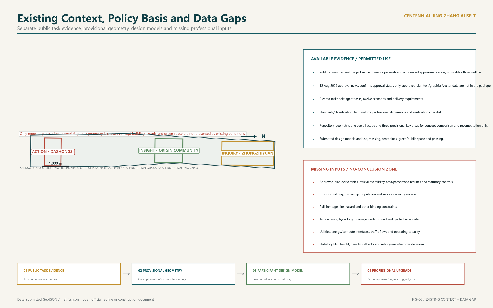
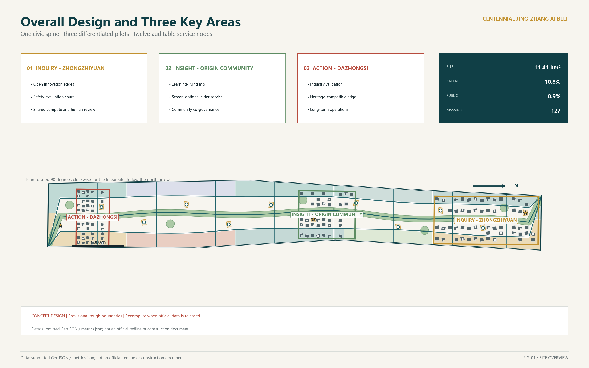
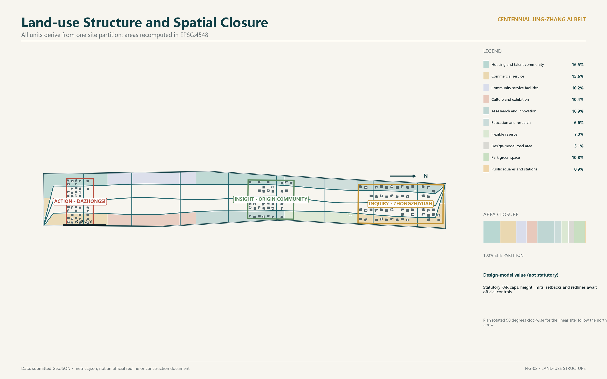
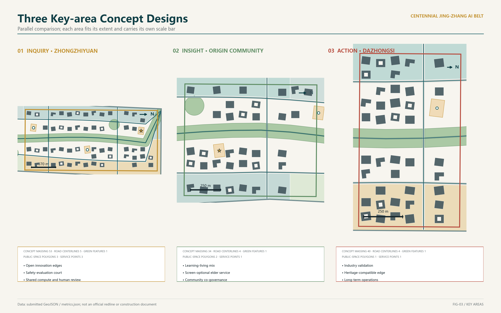
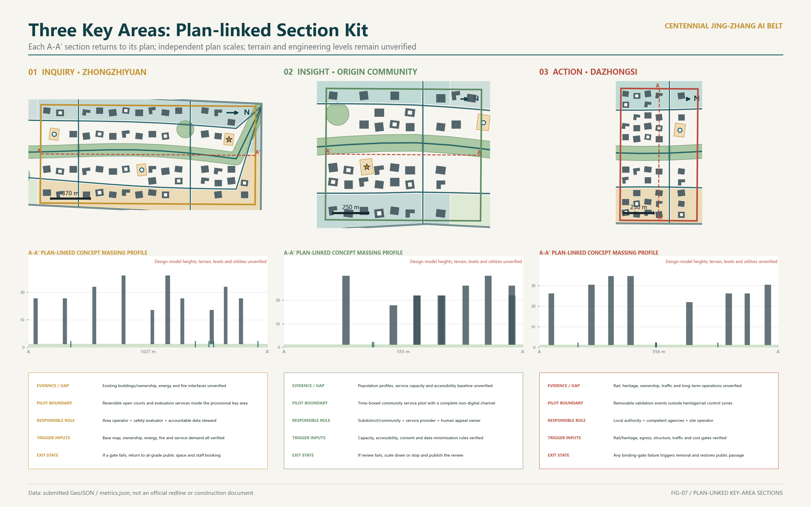
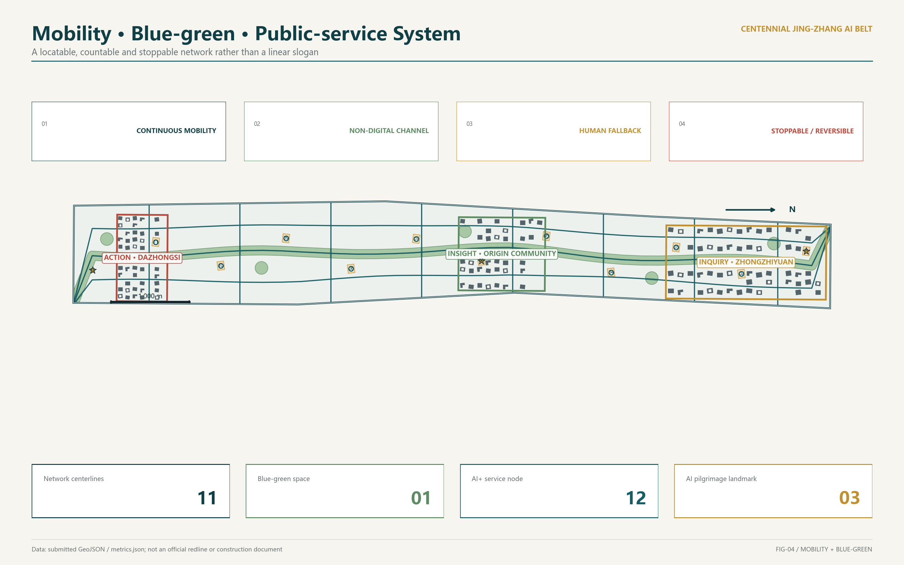
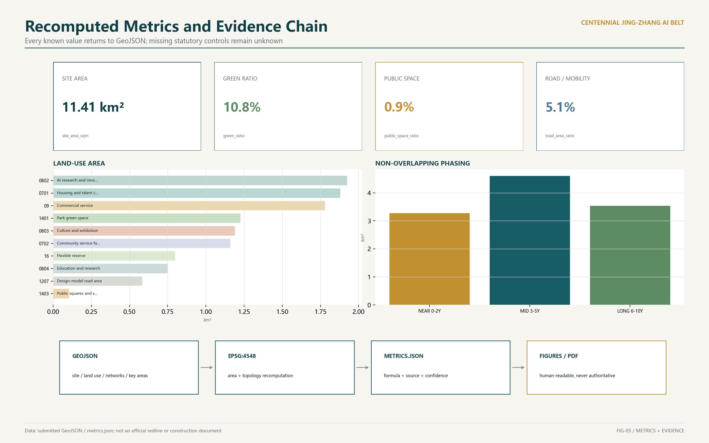

# THE LUCID SHANSHUI

> “Knowing others is intelligence; knowing oneself is lucidity.” Here, lucidity means visible, accountable, and stoppable. AI should not obscure the city; it should make service ownership, data boundaries, and human choice clearer.

**The sole operating protocol is Visible Responsibility · Visible Boundary · Visible Exit.** Responsibility names the service owner and human appeal role; boundary discloses spatial, data, time, and professional gates; exit predefines scale-down, stop, and restoration of the ground-level public service. Every pilot follows one path: Disclosure → Desk Review → Time-boxed Pilot → Public Review → Renew/Scale Down/Stop. “Lucid shanshui” is only a character language of courts, arcades, tree rows, and restrained colour—not a second governance concept.

**Status of the work.** This document completes a conceptual framework for further work by urban-design, transport, utility, landscape, architecture, operations, and legal teams. It is not a statutory plan, engineering feasibility study, investment commitment, or parcel-level retain/renovate/demolish decision. The spatial model uses provisional boundaries. Every judgment that depends on official controls, ownership, rail protection, underground utilities, terrain and hydrology, or an existing-building survey remains pending confirmation.

## Design Basis and Source List

The first layer of authority is the official announcement and the Agent taskbook. Together they control the three scope levels, the “three areas and two wings,” professional tasks, deliverable depth, and six Agent tasks. The proposal therefore treats the Centennial Jingzhang Cultural Belt, Urban AI Life Experience Belt, and AI-Integrated Innovation Belt as one public-space and innovation-service framework, not as three unrelated slogans. [source:DATA-SRC-OFFICIAL-ANNOUNCEMENT-20260509] [standard:PROJECT-AGENT-OPEN-CALL-TASKBOOK]

On 12 August 2026, the Beijing municipal-government portal reported that the neighbourhood-level control plan had been approved on 11 August. It covers the 2024–2035 period, nine neighbourhoods and about 1,668.2 hectares, and describes “one belt and one axis, two centres and multiple nodes,” north–south continuity and east–west walking/cycling connections, green public space leading renewal, and an integrated fifteen-minute living-and-innovation service circle. The page proves only public approval status and this textual direction. The approved document, maps, GIS/CAD, parcel controls, heights, and FAR controls have not been obtained; no machine control is inferred from the news page. [source:DATA-SRC-JINGZHANG-CONTROL-PLAN-APPROVAL-20260812] [assumption:A-APPROVED-PLAN-DATA-GAP-001]

The second layer is the repository’s provisional boundaries, local standard snapshots, and this iteration’s reproducible spatial design model. Submitted geometry, metrics, and matrices are the auditable evidence. Cases without a registered exact source remain a research list and do not prove site facts, statutory controls, or engineering feasibility. [source:DATA-SRC-PROVISIONAL-BOUNDARIES-20260605] [source:SUBMISSION-SPATIAL-DESIGN-MODEL-V2]

Missing inputs include the official overall and key-area boundaries, existing buildings and ownership, heritage and rail-protection requirements, road redlines and traffic counts, terrain and groundwater, flood and sponge-city conditions, underground utilities and municipal capacity, population and employment, and development cost. These gaps do not prevent conceptual discussion, but they prevent exact FAR, height, a continuous underground corridor, parcel decisions, or investment timing from becoming formal conclusions. [depth:risk_missing_data] [standard:MOHURD-CONTROL-DETAILED-PLANNING]

## Three-Level Scope Framework

The **coordinated research area** frames Jingzhang heritage, Haidian’s AI value chain, and regional collaboration; the current GeoJSON does not replace its official boundary. The **overall design area** uses provisional constraint `SITE-001`; its current model area is about 11.41 square kilometres and is used only to normalize this iteration’s areas and figures. The **three key areas** use low-confidence provisional extents to organize distinct design questions, not parcel or approval boundaries. [data:geometry/site_boundary.geojson#SITE-001] [metric:site_area_sqm]

| Level | Question answered in this iteration | Available output | Trigger for the next depth |
|---|---|---|---|
| Coordinated research | How can the belt connect research, industry, communities, and heritage? | Value-chain hypothesis, case comparison, three-areas/two-wings relationship | Official research extent, industry/employment statistics, regional mobility data |
| Overall design | How do public space, functions, walking, and phasing form one framework? | Provisional land use, roads, green/public space, and phasing model | Official boundary, control plan, survey, ownership, and utility records |
| Three key areas | What must each area solve first, how can it pilot, and when must it stop? | Three differentiated conceptual development briefs | Verified key-area boundaries, building survey, and implementing entities |

The three key areas are located through `PROV-KEY-001`, `PROV-KEY-002`, and `PROV-KEY-003`. Their count is auditable; their shape and area must be replaced and recomputed when official data arrive. [data:geometry/key_areas.geojson#PROV-KEY-001] [metric:key_area_count]

## Coordinated Research Area: Industry and Future City Research

The industry proposition is not to “build another park.” It is to complete the chain from research and development to testing, transfer, and public accountability. Universities and institutes frame problems; full-stack firms and developers build tools; real but controlled public settings host verification; professional operators maintain services; and the public keeps channels for information, appeal, and exit. Space therefore has three roles: low-threshold collaboration, retractable experimentation, and durable public memory. [depth:existing_conditions_diagnosis] [source:DATA-SRC-AGENT-TASKBOOK-20260518]

The table provides the taskbook-required comparison of eight global cases. It defines questions to test rather than copying scale, governance, or investment models. Every case is registered in `sources.json` as `background_only`: it may support directional comparison but not site facts, statutory controls, or performance promises. Professional development must still verify fitness for each specific claim. [standard:PROJECT-AGENT-OPEN-CALL-TASKBOOK]

| Background case | Research question | Restrained translation for this proposal |
|---|---|---|
| Zhongguancun development | How can research enter everyday public life over time? | Let the Origin Community host open learning and public explanation, without copying industry numbers [source:CASE-ZGC-SINCE-1988] |
| King’s Cross | How can infrastructure heritage become ordinary public space? | Keep the railway time trace and begin with continuous ground-level walking and reversible use [source:CASE-LONDON-KINGS-CROSS] |
| Station F | How can a large innovation platform lower entry barriers for small teams? | Divide shared testing, display, and support into phaseable service units [source:CASE-PARIS-STATION-F] |
| Kendall Square | How can institutions, firms, and communities collaborate at close range? | Connect the key areas through open days and scenario-validation channels [source:CASE-BOSTON-KENDALL] |
| Sand Hill Road | How can capital services stay connected to R&D? | Define the Zhongguancun service wing as a professional-service network, not a new development promise [source:CASE-SILICON-VALLEY-SANDHILL] |
| Nangang | How can a mobility hub and industry services retain daily life? | At Dazhongsi, solve interchange, shade, rest, and ground-floor publicness first [source:CASE-TAIPEI-NANGANG] |
| Hefei Science Island | How can research facilities coordinate with ecology? | Require ecological, energy, and safety gates before any Zhongzhiyuan pilot [source:CASE-HEFEI-SCIENCE-ISLAND] |
| Amsterdam Algorithm Register | How can public AI become visible and accountable? | Treat equipment and service registration as a voluntary transparency protocol [source:CASE-AMSTERDAM-ALGORITHM-REGISTER] |

## Overall Design Area: Urban Renewal and Regulatory-Plan-Level Urban Design

The overall structure is **one heritage public spine, three differentiated pilot areas, and two kinds of cross-belt service connection**. The heritage spine remains continuous at ground level by default, linking railway memory, commuting, public services, and blue-green space. The lateral links serve Zhongguancun professional services and Xiaoyuehe community scenarios. Thirteen polygons across ten territorial-spatial classification codes provide seamless conceptual coverage; they are not a statutory land-use amendment. [data:geometry/land_use.geojson#LU-001] [metric:land_use_coverage_ratio]

The “Time Valley” is no longer a continuous underground project. It becomes three condition-triggered section types:

1. **Type A: ground-level heritage trail, the default along the belt.** Paving, tree rows, rain gardens, movable amenities, and railway-memory markers create continuity without excavation.
2. **Type B: existing-level-change section.** Terraces, ramps, and seating create a local valley effect only where surveys confirm usable existing level change, drainage, and an equivalent accessible route. No excavation depth is assumed.
3. **Type C: local sunken pilot.** It enters option study only after professional verification of rail safety, heritage, groundwater, flood, utilities, evacuation, accessibility, structure, and whole-life cost. Pilots are not presumed to connect underground.

If a critical input is absent, emergency access is weakened, equivalent accessibility cannot be achieved, drainage risk remains uncontrolled, diversion cost is disproportionate, or operational ownership is unclear, Types B/C stop and revert to the Type A ground solution. This iteration completes a section-selection rule and exit mechanism, not an underground-engineering feasibility claim. [standard:MOHURD-URBAN-DESIGN-MEASURES] [depth:height_massing_character]

Statutory intensity, height, density, setbacks, and parking remain pending official data. The current `buildings.geojson` contains 127 low-confidence concept massings in the three provisional key areas. Their footprint, floors, and design-model floor area are recomputable, but they are not an existing-building inventory or development commitment. [data:geometry/buildings.geojson#BLDG-0001] [metric:building_feature_count]

## Detailed Design of Key Areas

The three areas no longer receive the same bands. Each has a distinct conceptual development task: R&D verification, campus–community stitching, and station-city daily life. “Detailed design complete” here means that the spatial question, conceptual move, deployment gate, exit condition, and missing-data list are fully stated. It does not mean parcel design, engineering checks, or approval conditions are complete. [depth:three_key_area_detailed_design] [data:geometry/key_areas.geojson#PROV-KEY-002]

| Key area | Existing evidence / data gap | Plan relationship | Section strategy | Pilot boundary | Responsible roles | Trigger inputs | Exit state |
|---|---|---|---|---|---|---|---|
| Zhongzhiyuan AI Independent-Innovation Acceleration Area [data:geometry/key_areas.geojson#PROV-KEY-001] | Only a provisional extent and concept massing exist; buildings/ownership, energy, fire, and ecological interfaces are unverified | Public test courts and explanation halls line the open edge; R&D logistics stay inside behind an ecological buffer | Ground continuity is default; unmeasured level changes cannot become Type B/C sections | Reversible open courts and evaluation services inside the provisional area and outside verified protection limits | Area operator + safety evaluator + accountable data steward | Base map, ownership, energy, fire, ecology, and service demand jointly pass review | Failure at any gate returns to ground public space, staff booking, or controlled indoor display |
| Beijing AI Origin Community [data:geometry/key_areas.geojson#PROV-KEY-002] | Only a provisional extent exists; population, service capacity, ground-floor ownership, and accessibility are unverified | A campus–community–heritage-park walking stitch places quiet study, tactile models, and staffed service on a ground loop | A step-free ground loop is retained; any terrace must prove equivalent access and drainage | Time-boxed community-service pilot with a complete non-digital channel throughout | Subdistrict/community + service provider + human appeal owner | Access policy, capacity, accessibility, consent, and data-minimisation rules pass | Failed review scales down to booked events or stops digital functions while basic staffed service remains |
| Dazhongsi AI Industry Cluster [data:geometry/key_areas.geojson#PROV-KEY-003] | Only a provisional extent exists; rail, heritage, ownership, traffic, utilities, and long-term operations are unverified | Station interchange, public ground floor, and heritage setting are resolved before industry services are added | A shaded ground arcade is default; no sunken move proceeds without dedicated review | Removable validation events and street micro-renewal outside verified heritage/rail controls | Local authority + competent agencies + site operator | Rail/heritage, egress, structure, traffic, utilities, and cost gates pass | Failure of any hard gate removes the pilot and devices and restores original public passage |

All three area briefs share four non-negotiable principles: facial recognition is not the default entrance; service remains usable without a smartphone; complaints can transfer to a person; and a pilot can stop without removing the underlying public service. The key-area figure communicates distinct tasks and relationships; it does not prove formal redlines or engineering dimensions.

## AI Innovation Ecosystem, Personas, and AI+ Scenarios

The ecosystem follows “problem definition → controlled test → professional review → small-scale operation → public retrospective → expand or stop.” Five primary users are considered: student developers needing affordable development and display space; R&D teams needing safe test interfaces; older residents needing legible daily services; families needing safe learning and rest; and visitors needing multilingual arrival and contextual explanation. Personas describe service barriers and do not require sensitive personal profiles. [standard:PROJECT-AGENT-OPEN-CALL-TASKBOOK] [source:DATA-SRC-AGENT-TASKBOOK-20260518]

The twelve cards share one deployment protocol, while each produces different evidence on a risk-based review rhythm. Every responsible body is a proposed role still to be confirmed. The periods below are self-imposed conceptual pilot timeboxes, not approved operating terms; KPIs are verification records and contain no untested performance number.

| Scenario | User / location | Flow | Responsibility | Non-AI baseline | Evidence method / review frequency | Validity | Renew / scale down / stop | KPI |
|---|---|---|---|---|---|---|---|---|
| 01 Registry of Public Sensing | Residents, visitors / public-facility entrance | Read purpose/term → object → track response | District operator + accountable data steward | Paper register + staffed desk | Cross-sample tickets and device register / public monthly review | 90-day concept pilot | Pause if ownership, traceability, or appeal chain is incomplete; renew only after repair | Registration completeness, traceability, appeal closure |
| 02 Clear Screen-Free Walk | Older people, children, visitors / continuous ground trail | Tactile/large-print guidance → rest → ask staff | Public-space maintainer + access reviewer | Fixed map + tactile signs + attendant | Observe screen-free route completion / quarterly access review | 180-day concept pilot | Scale down/stop if completion does not improve on pre-pilot observation or route defects remain | Screen-free completion, repaired breaks, rest-point availability |
| 03 Inquiry Tactile Model Hall | Students, blind/low-vision visitors / community cultural facility | Touch model → optional explanation → ask | Cultural operator + accessibility tester | Physical model + human guide + Braille/print | Task-based user test / review each term | One-term concept pilot | Disable the related digital explanation if the accessibility test fails; keep model and guide | Accessibility test result, content correction, response record |
| 04 Study Deep-Reading Room | Students, residents / quiet indoor public space | Borrow print → book table → discuss | Community/library operator | Print catalogue + librarian search + offline booking | Sample citation and opening logs / monthly review | 90-day concept pilot | Pause retrieval overlay if source notices are incomplete or basic reading is displaced | Source completeness, opening record, quiet-space complaints |
| 05 Sincerity Algorithm Clinic | Public-service users / near service counter | State issue → check rule → human appeal → receipt | Service provider + professional + independent reviewer | Full staffed counter + paper receipt | Professional sample of referral records / weekly review | 30-day concept pilot | Stop immediately and transfer to staff after a safety event, unexplained decision, or failed human service | Referral error, human transfer, appeal closure |
| 06 Rectify Edge Experiment Market (industry test) | Developers, public / demountable test area | Test note → review → timed demo → feedback → retrospective | Site operator + safety panel + data steward | Offline counter + paper process + physical feedback card | Consent, complaint, and removal records / monthly review | One-market-season concept pilot | Stop the stall/session after a data-boundary breach, unmanageable complaint, or scope expansion | Voluntary use, removal execution, feedback closure |
| 07 Cultivate Safety-Drill Court (industry test) | Red teams, firms, observers / isolated test space | Publish boundary → exercise → log → human review → summary | Professional security team + site operator | Human evaluation + physical isolation + immediate stop | Issue and shutdown ledgers / review after every session | 90-day concept pilot | Stop if a critical issue remains open, the test leaks, or isolation fails | Issue grading, closure, recurrence record |
| 08 Family Elder-Friendly Loop | Older people, carers / community ground route | Choose short loop → rest/drink → ask for help → return | Community + maintainer + human help owner | Volunteer escort + physical signs + staffed point | Observe independent passage and inspect hazards / monthly review | 180-day concept pilot | Scale down/temporarily close if independent passage does not improve or heat, water, or lighting risk remains | Independent passage, amenity availability, help response |
| 09 Stewardship Open Compute Day (industry test) | Small teams, students / controlled shared facility | Apply → purpose/resource review → timed use → log → retrospective | Facility operator + security/energy reviewer | Staff approval + offline schedule + human technical support | Booking, delivery, energy, and termination logs / monthly review | 180-day concept pilot | Scale down/stop if resources are not delivered, energy/security limits are breached, or ownership is absent | Resource delivery, energy disclosure, termination record |
| 10 Practice Quiet Retail Street | Commuters, hearing/sensory-sensitive users / station ground floor | Physical/tactile choice → staffed transaction → optional digital help | Retail operator group + passage maintainer | Cash/physical receipt + complete staffed service | Channel completion and noise/clear-width inspection / quarterly review | 180-day concept pilot | End digital-first routing if non-digital completion worsens, an app is forced, or nuisance persists | Non-digital completion, noise complaints, clear passage |
| 11 Ground-Floor Five-Piece Set | Everyone / street frontage and forecourt | Shade → seat → drink → toilet → help | Owner + district operator + repair owner | Named manager + physical directions + alternatives | Item-by-item availability and repair ledger / quarterly community review | One-year concept pilot | Disable overlays and repair/scale down if a basic facility stays unavailable without an alternative | Basic-facility availability, repair closure, alternative directions |
| 12 Virtue Answer Bell Event | Residents, visitors / cultural node | Read notice → join or bypass → optional soundscape → comment | Cultural operator + heritage/safety reviewer + human appeal owner | Silent visual version + moderator + public hearing | Event record plus annual public retrospective | One-year-renewable concept pilot | Cancel a session after a heritage, noise, content, or safety failure; hearing decides annual renewal, scale-down, or stop | Bypass availability, correction response, stop-decision execution |

Cards 06, 07, and 09 are the three industry test-and-validation scenarios. Every card starts small, time-limited, and retractable. It advances only when safety, accessibility, maintenance, complaints, and public-value records all support the next step. A service is assessed under the Generative AI Interim Measures only when its actual business falls within the scope of providing generated content to the domestic public. The proposed registers, human fallback, and stop switches are a stricter design protocol, not a claim of universal legal duties. [standard:GENERATIVE-AI-INTERIM-MEASURES] [metric:scenario_node_count]

The six Agent tasks form a readable chain: agent.1 is addressed by the name, twin-rail wordmark, and palette; agent.2 by the eight-case comparison, ecosystem, and three areas/two wings; agent.3 by five personas and twelve cards; agent.4 by three public landmarks and maintainable components; agent.5 by railway strata, academy gardens, and bell culture; agent.6 by quarterly review, annual activity, and an open scenario catalogue. Each is a mechanism for professional development, not a confirmed programme. [source:DATA-SRC-AGENT-TASKBOOK-20260518] [metric:global_case_count]

## Land Use, Building Scale, and Retain-Renovate-Demolish Strategy

The thirteen land-use polygons use ten classification codes for conceptual residential, industry/commerce, community service, cultural, R&D, education/research, flexible reserve, road, green, and plaza functions. They test coverage and spatial relationships. Professional development must still reconcile them parcel by parcel with the official control plan; participant function names are not statutory conclusions. [standard:MNR-LAND-USE-CLASSIFICATION-GUIDE] [metric:land_use_total_area_sqm]

Building scale now uses only recomputable outputs from the new spatial model: 127 concept massings occupy about 475,392 square metres; their design-model floor area is about 2,525,728 square metres; and their combined key-area design-model FAR is 0.683943. All are low-confidence, non-existing, and non-statutory comparison values. Formal `floor_area_ratio`, building density, and height remain null. Earlier building counts, height sequences, and operational percentages that could not be recomputed from authoritative geometry have been removed. [metric:design_model_total_floor_area_sqm] [metric:design_model_key_area_floor_area_ratio]

Retain/renovate/demolish uses four gates: verify heritage and railway value; complete ownership and structural survey; compare continued use, repair, and reversible addition; only then consider demolition or new build. Every parcel remains “survey pending” until all gates are passed, and no conclusion may be inferred from appearance or AI imagery. Planning and architecture professionals continue any statutory-control work. [depth:retain_renovate_demolish] [standard:MOHURD-ARCH-DESIGN-DEPTH-2016]

## Transport, Rail, Municipal Infrastructure, and Public Services

The transport sequence is “connect ground-level walking first, verify public-transport interfaces second, and subordinate vehicle organization to safety and service.” The current `roads.geojson` contains one continuous greenway, two north–south concept streets, eight east–west shared-branch centrelines, and one merged road polygon. They describe the design network, not existing road redlines, rail alignment, parking supply, or engineering geometry. Professional development requires passenger-flow, junction, bus-stop, rail-protection, fire-access, and parking surveys. [data:geometry/roads.geojson#ROAD-CL-001] [metric:road_centerline_length_m]

Municipal and new infrastructure follows “small units, disconnectable operation, legible accounts.” Edge devices should use existing facilities where possible, meter energy and maintenance, and degrade to ordinary signs or staffed service when offline. `constraints.geojson` currently has no usable feature, so underground utilities, energy, communications, sanitation, fire, and disaster-resilience remain a professional survey list, not capacity conclusions. [data:geometry/constraints.geojson] [depth:municipal_new_infrastructure]

Public-service facilities begin with the physical services in the twelve cards, rather than treating an app as a facility. Article 39 of the Barrier-Free Environment Construction Law applies its staffed-service requirement to the enumerated public-service matters. Human fallback in the other cards is a voluntary inclusive-design rule and still requires place- and service-specific legal review. [standard:BARRIER-FREE-ENVIRONMENT-LAW] [standard:ELDERLY-SMART-TECH-PLAN-2020-45]

## Blue-Green Network, Public Space, and Urban Character

The model contains a continuous park system, twelve public-space polygons, and twelve scenario nodes. The current green ratio is about 10.77% and the public-space-polygon ratio about 0.92%. These are design-model values on a provisional boundary, not statutory green/public-space controls, and must be projected and recomputed whenever the official boundary or scheme changes. [data:geometry/green_space.geojson#GREEN-001] [metric:green_ratio]

The public-space priority is not more devices. It is a ground network that is continuous, stayable, understandable, and maintainable. Twelve public-space polygons and twelve scenario nodes organize rest, service, and cultural memory; three nodes are AI pilgrimage landmarks. Their count verifies this proposal only and does not mean that a facility has been built or licensed. [data:geometry/public_space.geojson#PUBLIC-001] [metric:ai_landmark_count]

Character control works at three levels. The city scale keeps the railway direction and open skyline relationships. The district scale emphasizes courts, arcades, tree rows, and public ground floors. Components use celadon blue, ink blue, restrained cinnabar accents, and the twin-rail/lucid identity. Persistent bright media facades, compulsory sound-light interaction, screens that obstruct sightlines, and unmaintainable devices are excluded. Dimensions, materials, fire, structure, and heritage compatibility await professional confirmation. [depth:blue_green_public_space] [standard:MOHURD-URBAN-DESIGN-MEASURES]

## Renewal Projects, Implementation Policy, and Phasing

The project list uses gates: establish public value first, verify operation second, and add construction only after evidence. Every package must preserve data, complaint, maintenance, and exit records before advancing. Because quantities, rates, and funding sources are absent, cost remains “pending survey and estimate”; no investment number is invented. [depth:renewal_project_list] [data:geometry/phasing.geojson#PHASE-001]

| Project package | Current stage | Precondition for the next stage | Cost status | Safe fallback after failure |
|---|---|---|---|---|
| Ground heritage trail and break repair | Near-term concept pilot | Road, rail protection, accessibility, and maintenance owner confirmed | Pending survey and estimate | Keep existing passage and reduce to signs/rest micro-renewal |
| Public sensing registry and algorithm clinic | Near-term operations pilot | Data responsibility, complaint channel, and staffed counter confirmed | Pending system boundary | Stop digital service; keep paper record and staffed advice |
| Origin Community low-screen public living room | Near/mid term | Site access, fire safety, operations, and community consent | Pending building survey | Use bookable events without fixed construction |
| Three Zhongzhiyuan industry tests | Mid-term controlled pilots | Safety, energy, ecology, and access zoning reviewed | Pending facility list | Move to closed indoor tests or online open day |
| Dazhongsi five-piece ground floor and cultural event | Mid term | Heritage, station, fire, commercial ownership, and noise assessed | Pending interface survey | Retain basic street amenities and remove digital devices |
| Condition-triggered Types B/C | Long-term option | All engineering triggers passed and Type A shown insufficient | Pending dedicated feasibility study | Adopt Type A ground section |

`PHASE-001`, `PHASE-002`, and `PHASE-003` form a complete, non-overlapping concept phasing partition inside the current provisional extent and express strategic order only. Spatial allocation and real programmes must still be rebuilt once official base mapping, project boundaries, dependencies, and delivery bodies are known before project-management use. [data:geometry/phasing.geojson#PHASE-002] [depth:phasing_implementation]

Long-term operations may include quarterly scenario retrospectives, an annual open catalogue, developer residencies, heritage interpretation, and a “Season of Lucid Virtue.” Names, dates, hosts, and resources are not confirmed. The value is a continuing apply–pilot–evaluate–remember mechanism, not a claim that a government event has been scheduled. [standard:PROJECT-AGENT-OPEN-CALL-TASKBOOK] [source:DATA-SRC-AGENT-TASKBOOK-20260518]

## Metrics, Area Recalculation, and Compliance Matrix

The three core spatial metrics are recomputed from submitted geometry in EPSG:4548: site area about 11,412,825 square metres, green ratio 0.107678, and public-space-polygon ratio 0.009234. Land use and phasing both cover the provisional boundary without gaps or overlaps. These remain low-confidence design-model values, but formulas, sources, and recalculation triggers are auditable. [metric:site_area_sqm] [metric:land_use_coverage_ratio] [metric:phasing_coverage_ratio]

| Metric family | Current status | Proper review use |
|---|---|---|
| Site, green, and public space | Geometry-recomputable; provisional boundary | Compare internal spatial allocation, not statutory controls |
| Key areas, landmarks, and scenario nodes | Structured spatial features can be counted | Check spatial task coverage, not delivery quantities [metric:scenario_node_count] |
| Building massing | 127 low-confidence concept massings are recomputable | Compare the three key areas; not existing stock or statutory capacity [metric:building_feature_count] |
| FAR, height, density, parking, utility capacity | Pending official data | Excluded from design ranking and implementation commitments [metric:floor_area_ratio] |

The three matrices now use item-specific evidence: each requirement cites only directly relevant sections, layers, metrics, drawings, sources, and standards. They no longer use an “all files prove all items” template. `complete` in the design-depth matrix means “the conceptual judgment, boundary, trigger, and professional handoff are completely described.” It does not mean that surveys, statutory controls, or engineering design are complete. [depth:metrics_recalculation] [standard:PROJECT-OFFICIAL-ANNOUNCEMENT]

## Risk, Copyright, and Compliance

| Risk | Current control | Blocker before implementation |
|---|---|---|
| Provisional overall and key-area extents | Mark all as provisional/low confidence and attach recomputation triggers | No parcel or area commitment before importing official boundaries [source:DATA-SRC-PROVISIONAL-BOUNDARIES-20260605] |
| Underground space and engineering safety | Type A ground solution is default; Types B/C require full review | Any unverified rail, heritage, hydrology, utility, evacuation, or accessibility issue triggers exit |
| AI privacy, bias, or interruption | Data minimization, human fallback, complaint record, stop switch | No public operation without accountable owner, lawful basis, and human alternative [standard:GENERATIVE-AI-INTERIM-MEASURES] |
| Overbroad accessibility claim | Separate enumerated legal services from voluntary inclusive design | Do not claim full legal compliance before place-specific professional review [standard:BARRIER-FREE-ENVIRONMENT-LAW] |
| Time-limited elderly digital-inclusion policy | Use as service-design background, not a 2026 project duty | Do not claim local implementation without current local policy and process evidence [standard:ELDERLY-SMART-TECH-PLAN-2020-45] |
| AI image confused with fact | Renderings communicate experience; geometry/metrics carry spatial claims | Concept images with scales, north arrows, or technical borders cannot be measurement or engineering evidence |

The proposal and imagery were created with Agent assistance; generation method, file scope, and limitations are recorded in `report/copyright_statement.md`. AI images must not impersonate site photographs, historical archives, or coordinate drawings. Background cases cannot be promoted into site facts or formal-control evidence. Trademarks, portraits, fonts, reference images, and third-party material require item-level rights review before dissemination or implementation. [depth:risk_missing_data] [source:SUBMISSION-SPATIAL-DESIGN-MODEL-V2]

Final judgment belongs to people and professional teams. This proposal is not government approval, planning permission, engineering feasibility, investment commitment, or a confirmed event programme. When source data change, update authoritative geometry and metrics first, then matrices, prose, drawings, and web pages, preserving one evidence chain. [standard:PROJECT-AGENT-OPEN-CALL-TASKBOOK] [source:SUBMISSION-SPATIAL-DESIGN-MODEL-V2]

## References

The list below indexes the main basis for this iteration. Complete URLs, status, permitted uses, and known gaps remain in `sources.json` and the repository standards registry. Background cases are not site facts, and local standard snapshots do not replace case-specific legal or professional advice.

1. Haidian Branch, Beijing Municipal Commission of Planning and Natural Resources, qualification pre-announcement for the Centennial Jingzhang AI Innovation Belt urban-design call. [source:DATA-SRC-OFFICIAL-ANNOUNCEMENT-20260509]
2. Repository maintainers, cleared Agent taskbook excerpt and co-creation boundaries. [source:DATA-SRC-AGENT-TASKBOOK-20260518]
3. Ministry of Housing and Urban-Rural Development, Measures for the Administration of Urban Design. [standard:MOHURD-URBAN-DESIGN-MEASURES]
4. Ministry of Housing and Urban-Rural Development, Measures for the Preparation and Approval of Regulatory Detailed Plans for Cities and Towns. [standard:MOHURD-CONTROL-DETAILED-PLANNING]
5. Ministry of Natural Resources, land/sea-use classification guide for territorial spatial investigation, planning, and use control. [standard:MNR-LAND-USE-CLASSIFICATION-GUIDE]
6. 2016 architectural design-document depth provision registry item; without a cleared official file, it is only a depth-review reminder. [standard:MOHURD-ARCH-DESIGN-DEPTH-2016]
7. Cyberspace Administration of China and other departments, Interim Measures for Generative AI Services, cited only within its service scope. [standard:GENERATIVE-AI-INTERIM-MEASURES]
8. Barrier-Free Environment Construction Law, with Article 39 read within its enumerated service contexts. [standard:BARRIER-FREE-ENVIRONMENT-LAW]
9. State Council General Office plan on older people’s difficulties with smart technologies, used as historical policy and design background. [standard:ELDERLY-SMART-TECH-PLAN-2020-45]

Sources in this iteration include the announcement, taskbook, professional standards, provisional boundaries, the reproducible spatial design model, and global cases explicitly downgraded to background research. Submitted geometry has the highest authority, followed by metrics and matrices; prose and images explain but do not replace structured evidence. [source:CASE-JINGZHANG-HISTORY] [depth:three_level_scope_framework]
