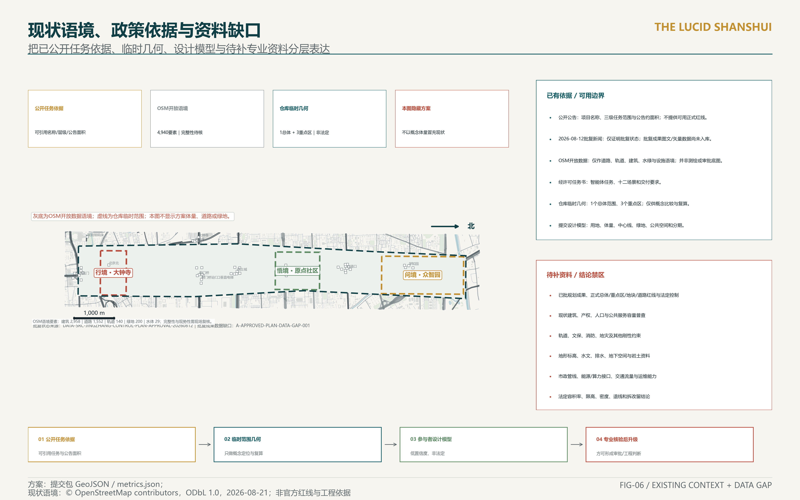
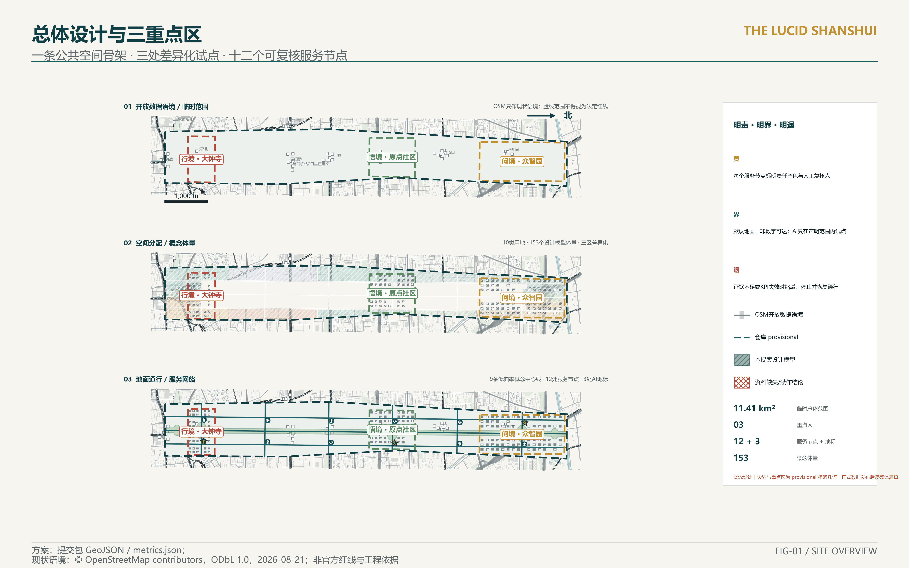
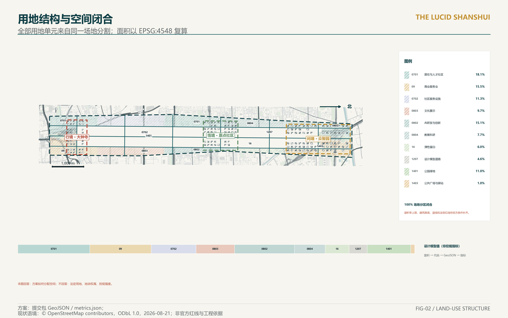
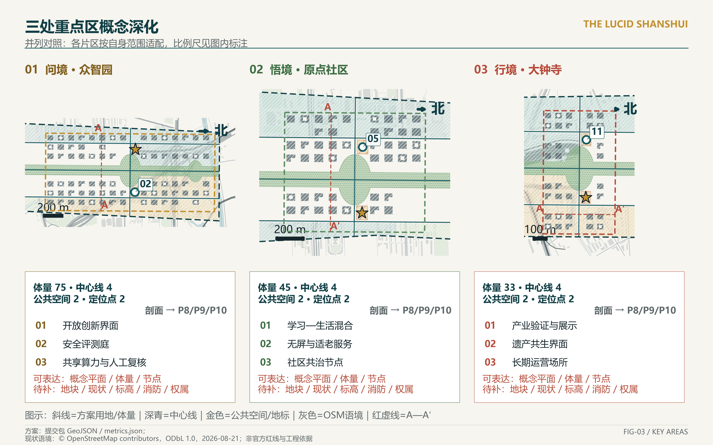
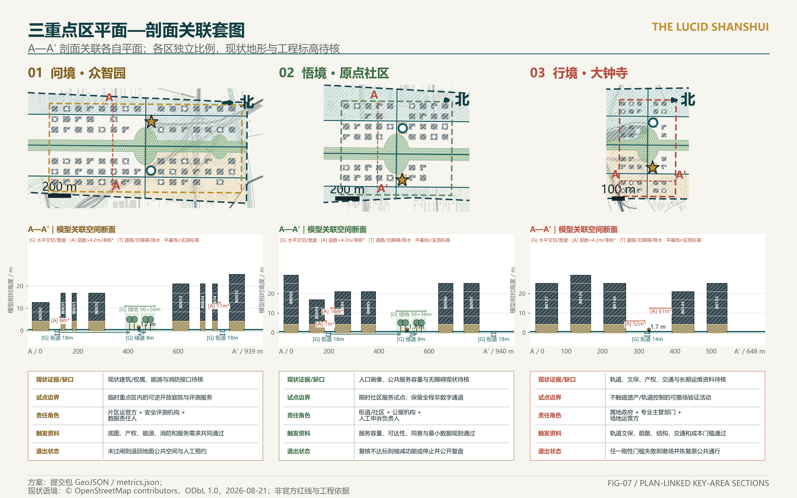
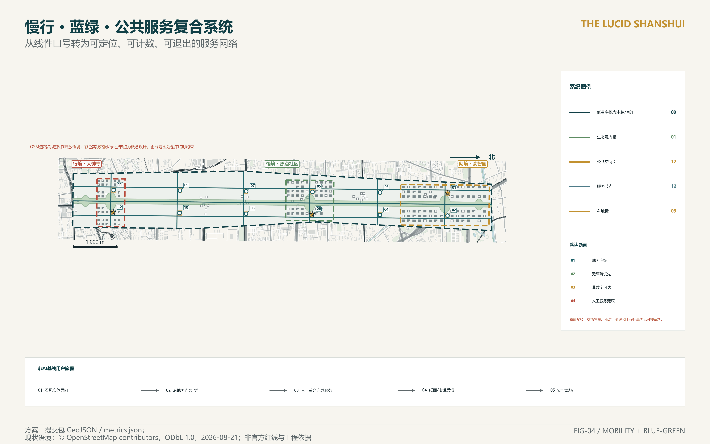
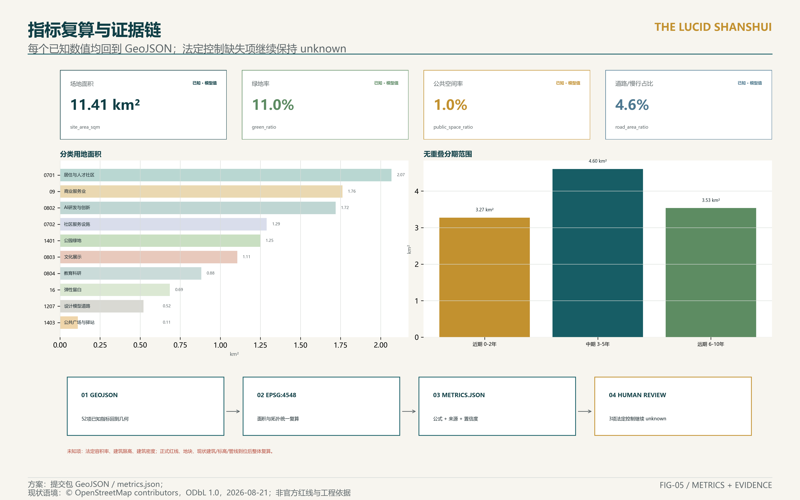

# 京张明带·数字山水 THE LUCID SHANSHUI

> 「知人者智，自知者明。」本方案把“明”理解为可见、可问责、可退出：AI 不应遮蔽城市，而应让服务责任、数据边界和人的选择更清楚。

**唯一操作协议：明责·明界·明退。** 明责，是每项服务写明责任角色与人工申诉人；明界，是公开空间、数据、时限和专业门槛；明退，是预先约定缩减、停止及恢复地面公共服务的状态。所有试点只走“公开说明→桌面核验→限时试点→公开复盘→续期/缩减/停止”一条路径。“数字山水”仅作为院落、廊下、树阵与克制色彩的风貌语言，不是第二套治理概念。

**成果状态。** 本稿完成的是可供城市设计、交通、市政、景观、建筑、运营与法务团队继续深化的概念设计框架，不是法定规划、工程可研、投资承诺或地块拆改留结论。当前空间模型使用临时边界；凡依赖官方控规、权属、轨道保护、地下管线、地形水文或既有建筑普查的判断，均保留为待确认事项。

## 设计依据与资料清单

第一层依据是项目公告与智能体任务书，分别控制三层研究范围、三区两翼、专业任务、交付深度和六项智能体任务。本方案据此把“百年京张文化带、都市 AI 生活体验带、AI 融合创新带”合并为一条公共空间与创新服务并重的骨架，而不是三套彼此独立的口号。[source:DATA-SRC-OFFICIAL-ANNOUNCEMENT-20260509] [standard:PROJECT-AGENT-OPEN-CALL-TASKBOOK]

北京市政府门户 2026 年 8 月 12 日公开报道：相关街区层面控规于 8 月 11 日获批，规划期为 2024—2035 年，涉及 9 个街区、约 1668.2 公顷，并以“一带一轴、两心多点”、南北贯通/东西连通步行骑行、绿色公共空间引领更新及一刻钟生活圈与创新圈融合为文字脉络。该页面只证明公开批复状态和上述文本方向；正式批复文件、图则、GIS/CAD、地块控制线、高度和容积率尚未取得，本方案不据新闻页推导任何机器控制。[source:DATA-SRC-JINGZHANG-CONTROL-PLAN-APPROVAL-20260812] [assumption:A-APPROVED-PLAN-DATA-GAP-001]

第二层依据是仓库临时边界、本地标准快照与本轮可复现空间设计模型。提交几何、指标和矩阵是可复核证据；未登记精确来源的案例只进入待核研清单，不承担场地事实、法定控制或工程可行性证明。[source:DATA-SRC-PROVISIONAL-BOUNDARIES-20260605] [source:SUBMISSION-SPATIAL-DESIGN-MODEL-V2]

为增强概念图对周边关系的可读性，本轮另登记 2026 年 8 月 21 日取得的 OpenStreetMap contributors / Overpass API 背景快照（ODbL 1.0）。经查询范围裁切和 EPSG:4548 拓扑保持简化后，快照包含七类共 4,940 个上下文要素；它只用于背景辨识和提出后续调查问题，不参与提交边界、用地、道路、重点区或指标计算。其完整性、位置精度与现势性仍须现场、官方资料或专业测绘核验，不得作为测绘成果、红线、控规图则、审批底图或工程依据。[source:DATA-SRC-OSM-OVERPASS-CONTEXT-20260821] [assumption:A-OSM-CONTEXT-LIMIT-001]

当前资料缺口包括：官方总体设计边界和三处重点区红线、现状建筑及权属、文保与轨道保护要求、道路红线与交通流量、地形标高与地下水、洪涝与海绵条件、地下管线和市政容量、人口就业与开发成本。缺口不阻止概念讨论，但阻止精确容积率、建筑高度、连续地下空间、拆改留和投资时序成为正式结论。[depth:risk_missing_data] [standard:MOHURD-CONTROL-DETAILED-PLANNING]

## 三层范围工作框架

**统筹研究范围**用于讨论京张遗产、海淀 AI 产业链与区域协同，不以当前 GeoJSON 代替官方研究范围；**总体设计范围**采用 `SITE-001` 临时约束范围，当前模型面积约 11.41 平方公里，仅用于本轮方案内的面积归一和图件生成；**重点区域范围**采用三处低置信度临时范围，用来安排差异化设计问题，不作为地块或审批边界。[data:geometry/site_boundary.geojson#SITE-001] [metric:site_area_sqm]

| 层级 | 本轮回答的问题 | 可用成果 | 进入下一深度的触发资料 |
|---|---|---|---|
| 统筹研究 | 创新带与周边科研、产业、社区如何协同 | 产业链假设、案例比较、三区两翼关系 | 官方研究范围、产业与就业统计、区域交通数据 |
| 总体设计 | 公共空间、功能、慢行和分期如何形成共同骨架 | 临时边界内的用地、道路、绿地、公共空间和分期模型 | 官方边界、控规、现状测绘、权属和市政资料 |
| 三个重点区 | 每一区域先解决什么、如何试点、何时退出 | 三套不同的概念深化任务书 | 经核实的重点区红线、建筑普查和项目实施主体 |

三处重点区分别以 `PROV-KEY-001`、`PROV-KEY-002`、`PROV-KEY-003` 定位。它们的数量可核查，形状和面积则必须在正式数据到位后整体替换并重算。[data:geometry/key_areas.geojson#PROV-KEY-001] [metric:key_area_count]

## 统筹研究范围产业与未来城市研究

产业判断不是“再造一个园区”，而是补齐从研究、开发、测试、转化到公共问责的链条：高校和科研机构提出问题，全栈企业与开发者形成工具，真实但受控的公共场景进行验证，专业运营团队负责维护，公众拥有知情、申诉与退出通道。空间由此承担三种角色：低门槛协作场、可撤回试验场、长期公共记忆场。[depth:existing_conditions_diagnosis] [source:DATA-SRC-AGENT-TASKBOOK-20260518]

下表是任务书要求的八个全球案例比较表，只定义“要验证的问题”，不复制其规模、治理制度或投资模式。案例已在 `sources.json` 标记为 `background_only`，可支撑方向比较，但不作为场地事实、法定控制或绩效承诺；进入专业深化前仍须按具体结论复核来源适用性。[standard:PROJECT-AGENT-OPEN-CALL-TASKBOOK]

| 背景案例 | 提取的研究问题 | 对本项目的克制转译 |
|---|---|---|
| 中关村发展脉络 | 科研成果如何持续进入城市公共生活 | 以原点社区承担开放学习与公共解释，而非复制产业指标 [source:CASE-ZGC-SINCE-1988] |
| King’s Cross | 基础设施遗产如何成为日常公共空间 | 保留铁路时间线索，先做连续地面步行和可逆使用 [source:CASE-LONDON-KINGS-CROSS] |
| Station F | 大体量创新载体如何降低小团队进入门槛 | 把共享测试、展示和辅导拆成可分期服务单元 [source:CASE-PARIS-STATION-F] |
| Kendall Square | 研究机构、企业与社区如何形成近距离协作 | 在重点区之间建立开放日和场景验证通道 [source:CASE-BOSTON-KENDALL] |
| Sand Hill Road | 资本服务如何与研发空间保持连接 | 把中关村服务翼定义为专业服务网络而非新增开发承诺 [source:CASE-SILICON-VALLEY-SANDHILL] |
| 南港 | 交通节点与产业服务如何兼容日常生活 | 大钟寺先解决换乘、遮阴、休憩和首层公共性 [source:CASE-TAIPEI-NANGANG] |
| 合肥科学岛 | 科研设施如何与生态环境协调 | 众智园试点必须先通过生态、能源和安全门槛 [source:CASE-HEFEI-SCIENCE-ISLAND] |
| 阿姆斯特丹算法登记 | 公共 AI 如何被看见和追责 | 将设备与服务登记设计为自愿提高透明度的运营协议 [source:CASE-AMSTERDAM-ALGORITHM-REGISTER] |

区域协同不是“伙伴名单”，而是五类待发起、待授权、可停止的接口。北纬社区、未来科学城、怀柔科学城、经开区及京津冀均未确认参与，本方案也不声称政府、机构、企业、场地、数据或资源承诺。下表“验证证据”是联动启动前与运行中必须形成的记录，不是已取得的合作证明。[source:DATA-SRC-AGENT-TASKBOOK-20260518] [assumption:A-COLLAB-001]

| 建议联动对象（当前均未确认） | 建议议题 | 要素流与一带接口 | 责任类型（建议角色） | 启动/续期必需的验证证据 | 退出条件 |
|---|---|---|---|---|---|
| 北纬社区 | 适老、无屏公服与社区共设计 | 公开或经同意的服务问题→原点社区原型；不含个人身份的任务测试与人工服务改进清单→社区复核 | 需求拥有者＋公服运营者＋无障碍/申诉复核人 | 授权的问题清单、最小数据说明、无屏任务记录、投诉与人工接管台账 | 未取得社区/服务授权，基本人工服务受损，或投诉无法闭环，即停止数字联动并保留非 AI 基线 |
| 未来科学城 | 研究问题、开发方法与可复现评测 | 公开研究问题/方法规格→众智园受控测试；版本化测试日志、失败样例和边界说明→建议科研复核 | 科研联络人＋方法评审人＋测试运营者＋数据/知识产权责任人 | 公开合作范围、测试协议、数据与知识产权清单、可复现报告和独立复核记录 | 权利、数据、算力、安全责任未定，或结果不可复现，则不外传数据或现场部署，仅保留公开方法研讨 |
| 怀柔科学城 | 科学仪器/大科学装置的公众理解与可解释交互 | 已公开、可转述的科研议题→触摸模型与文化节点；理解偏差、纠错和无障碍记录→建议科学传播复核 | 内容权利责任人＋科学审校人＋公共传播/无障碍评测人 | 可公开性与许可清单、内容版本、专家审校、用户理解/纠错记录 | 必须依赖未公开/受限数据，授权或事实审校不完整，或纠错无法实施，即下架相应内容 |
| 经开区 | 生产环节、产品安全与可维护性的小规模产业验证 | 公开产品需求/工程检查表→边缘市集或安全庭院；安全、运维、停机和撤场记录→建议产业验证复盘 | 产业问题拥有者＋沙箱运营者＋安全/工程评审人＋运维责任人 | 试验授权、沙箱边界、安全报告、版本/更改记录、停机和恢复演练 | 场地、资源、成本、安全或运维责任未闭环，或性能不可复现，则停止试验并不形成采购/投资暗示 |
| 京津冀 | 开放协议、跨城市场景复现和区域经验目录 | 版本化场景协议和非 AI 基线→建议区域同行节点；去标识比较结果、场地差异与失败经验→一带开放目录 | 区域召集人＋协议管理人＋各地测试责任人＋独立方法复核人 | 公开征集与自愿参与记录、共同测试规格、各地基线、跨地复现报告和差异说明 | 无共同规则、数据流动不具备合法/授权基础，或各地基线不可比，即停止跨域绩效声称并仅公开本地结果 |

## 总体设计范围城市更新与控规深度城市设计

总体结构为“**一条遗产公共脊、三个差异化试点区、六条横向服务联系**”。遗产公共脊优先在地面连续，连接铁路记忆、日常通勤、公共服务和蓝绿空间。为避免把无依据的波浪误作现场线位，本轮用临时总范围内部横截面中点、范围质心和三个临时重点区质心加权拟合一条近直线概念主轴；两侧概念街按法向恒距 330 米，六条横向联系由重点区位置和最大约 1,800 米间距推导。除明确标注的临时总体范围与重点区约束外，彩色道路、绿地、用地和体量才是参与者设计模型；它们不是现状、法定或工程线位。十三个用地要素按十类国土空间分类代码形成当前概念模型的无缝覆盖，但不是法定用地调整。[data:geometry/land_use.geojson#LU-001] [metric:land_use_coverage_ratio] [assumption:A-ROAD-001]

“时间河谷”由连续地下工程改为三类条件触发断面：

1. **A 型：地面遗产游径，为全线默认断面。** 通过铺装、树阵、雨水花园、可移动设施和铁路记忆标识形成连续体验，不要求开挖。
2. **B 型：既有高差借势断面。** 仅在测绘确认已有高差、排水和无障碍路线可兼容时，用台地、坡道和看台形成局部“谷感”，不先设工程深度。
3. **C 型：局部下沉试点断面。** 只在轨道安全、文保、地下水、洪涝、管线、疏散、无障碍、结构和全生命周期成本全部通过专业论证后进入方案比选；试点之间不预设连续连接。

任一关键资料缺失、应急通道受损、无障碍无法等效、排水风险不可控、迁改代价失衡或运营责任不清，B/C 型立即退出，恢复为 A 型地面方案。这里完成的是“断面选择规则与退出机制”，不是地下工程可行性结论。[standard:MOHURD-URBAN-DESIGN-MEASURES] [depth:height_massing_character]

法定开发强度、建筑高度、密度、退界和停车指标继续标记为待正式数据补齐。当前 `buildings.geojson` 含三个临时重点区内的 153 个低置信度概念体量，统一沿概念主轴的切向/法向框架排布，可复算方案基底、层数和设计模型建筑面积，但不能被解释为现状建筑普查或建设量承诺。[data:geometry/buildings.geojson#BLDG-0001] [metric:building_feature_count]

## 重点区域详细设计

三处重点区不再套用同一组色带，而是分别形成“研发验证、校园—社区、站城生活”三种概念深化任务。所谓“详细设计完成”，特指空间问题、概念动作、部署门槛、退出条件和待补数据已完整定义；并不表示地块设计、工程校核或审批条件已经完成。[depth:three_key_area_detailed_design] [data:geometry/key_areas.geojson#PROV-KEY-002]

| 重点区 | 现有证据 / data gap | 平面关系 | 剖面策略 | 试点边界 | 责任角色 | 触发资料 | 退出状态 |
|---|---|---|---|---|---|---|---|
| 众智园 AI 自主创新加速区 [data:geometry/key_areas.geojson#PROV-KEY-001] | 仅有临时范围和概念体量；现状建筑/权属、能源、消防及生态接口待核 | 公共测试庭与解释厅沿开放边布置，研发物流居内，并以生态缓冲分隔 | 默认地面连续；已有高差未经测绘不转为 B/C 型 | 临时重点区内、经确认保护边界外的可逆开放庭院与评测服务 | 片区运营方＋安全评测机构＋数据责任人 | 底图、产权、能源、消防、生态和服务需求共同通过 | 未过任一闸门即退回地面公共空间、人工预约或室内受控展示 |
| 北京 AI 原点社区 [data:geometry/key_areas.geojson#PROV-KEY-002] | 仅有临时范围；人口画像、公服容量、首层权属和无障碍现状待核 | 校园—社区—遗产公园步行缝合，安静学习、触摸模型与人工服务沿地面环布置 | 保持无台阶地面环；任何台地须证明等效无障碍和排水 | 限时社区服务试点，始终保留完整非数字通道 | 街道/社区＋公服机构＋人工申诉负责人 | 开放政策、容量、可达性、同意与最小数据规则通过 | 复核不达标即缩减为预约活动或停止数字功能，保留基本人工服务 |
| 大钟寺 AI 产业集聚区 [data:geometry/key_areas.geojson#PROV-KEY-003] | 仅有临时范围；轨道、文保、产权、交通、管线和长期运维资料待核 | 站前换乘—首层公共界面—遗产环境依次组织，产业服务退居第二层 | 地面遮阴连廊为默认；无专项论证不采用下沉动作 | 不触碰经确认遗产/轨道控制的可撤场验证活动和街道微更新 | 属地政府＋专业主管部门＋场地运营方 | 轨道文保、疏散、结构、交通、管线和成本门槛通过 | 任一刚性门槛失败即撤场，取消装置并恢复原公共通行 |

三套重点区方案共享四项底线：不以人脸识别作为默认入口；服务可脱离手机；出现投诉可人工接管；试点可在不破坏基本公共服务的情况下停止。重点区图用于表达差异化任务和联系，不承担正式红线或工程尺寸证明。

## AI 创新生态、人才画像与 AI+ 场景

生态链按“问题提出—受控测试—专业复核—小规模运行—公开复盘—决定扩大或停止”组织。五类主要用户是：需要低成本开发与展示空间的学生开发者、需要安全测试接口的研发团队、需要清晰日常服务的社区长者、需要亲子学习和休憩的家庭、需要多语言抵达与背景解释的访客。画像只定义服务障碍，不采集个人敏感档案。[standard:PROJECT-AGENT-OPEN-CALL-TASKBOOK] [source:DATA-SRC-AGENT-TASKBOOK-20260518]

十二张场景卡采用同一部署协议，但各自生成不同证据并按风险确定复核节奏。责任均为待确认的建议角色；下列期限是本方案自设的概念试点时限，不是已批准的运营期限，KPI 也只是待记录的核验项，不含未经测试的绩效数值。

| 场景 | 用户 / 位置 | 流程 | 责任 | 非 AI 基线 | 证据方法 / 复核频率 | 有效期 | 续期 / 缩减 / 停止 | KPI |
|---|---|---|---|---|---|---|---|---|
| 01 明察·公共感知登记 | 居民、访客 / 公共设施入口 | 查看用途与期限→异议→查进度 | 区域运营方＋数据责任人 | 纸质台账＋现场服务台 | 工单与设备登记交叉抽样 / 每月公开复核 | 90 日概念试点 | 责任、追溯或申诉链不完整即暂停；补齐后才续期 | 登记完整度、问题可追溯性、申诉闭环 |
| 02 澄心·无屏慢行 | 长者、儿童、访客 / 连续地面游径 | 触觉/大字导向→休息→人工问路 | 公共空间维护方＋无障碍复核人 | 固定地图＋触觉标识＋值守人员 | 无屏路径完成观察 / 每季度无障碍复核 | 180 日概念试点 | 无屏完成不优于启用前观察或路线缺陷未修复即缩减/停止 | 无屏完成情况、断点修复、休息设施可用性 |
| 03 问学·触摸模型厅 | 学生、视障访客 / 社区文化设施 | 触摸模型→可选讲解→提问 | 文化运营方＋无障碍测试人 | 实物模型＋人工讲解＋盲文纸本 | 任务式使用测试 / 每学期复核 | 一学期概念试点 | 可达性测试不通过即停用相关数字讲解，保留实物与人工服务 | 可达性通过情况、内容纠错、问题回复 |
| 04 习静·深阅读室 | 学生、居民 / 安静室内公共空间 | 纸本取阅→预约长桌→讨论 | 社区/图书运营方 | 纸本目录＋馆员检索＋线下预约 | 引用与开放日志抽样 / 每月复核 | 90 日概念试点 | 来源提示不完整或基本阅读被挤占即暂停检索叠加 | 来源完整性、开放时段、安静环境投诉 |
| 05 诚问·算法问诊台 | 公共服务使用者 / 服务窗口附近 | 说明问题→核对规则→人工申诉→留凭证 | 服务提供方＋专业人员＋独立复核人 | 全程人工窗口＋纸质凭证 | 转介记录专业抽检 / 每周复核 | 30 日概念试点 | 出现安全事件、无法解释或无法人工办理时立即停止并人工接管 | 错误转介、人工转接、申诉闭环 |
| 06 正验·边缘实验市集（产业测试） | 开发者、公众 / 可撤摊试验场 | 测试说明→审查→限时演示→反馈→复盘 | 场地运营方＋安全评审组＋数据责任人 | 线下服务窗＋纸质流程＋实体反馈卡 | 同意、投诉与撤场记录 / 每月复核 | 一季市集概念试点 | 数据越界、投诉无法处置或演示超界即停止该摊位/场次 | 自愿使用情况、撤场执行、反馈闭环 |
| 07 修安·安全演练庭院（产业测试） | 红队、企业、观察者 / 隔离测试空间 | 公示边界→演练→记问题→人工复核→摘要 | 专业安全团队＋场地运营方 | 人工评测＋实体隔离＋立即停止键 | 问题台账与停机记录 / 每场结束复核 | 90 日概念试点 | 高危问题未闭环、测试外溢或隔离失效即停机 | 问题分级、闭环与复发记录 |
| 08 齐家·适老慢行环 | 长者、照护者 / 社区地面路径 | 选短环→休息饮水→求助→返回 | 社区＋维护方＋人工求助负责人 | 志愿者陪行＋实体导视＋值守点 | 独立通行观察与隐患巡检 / 每月复核 | 180 日概念试点 | 独立通行未改善或高温、积水、照明等风险未控即缩减/临时关闭 | 独立通行情况、设施可用性、求助响应 |
| 09 治业·开放算力日（产业测试） | 小团队、学生 / 受控共享设施 | 申请→用途/资源审核→限时使用→记录→复盘 | 设施运营方＋安全/能源复核人 | 人工审批＋线下排期＋人工技术支持 | 预约、兑现、能耗与终止日志 / 每月复核 | 180 日概念试点 | 资源无法兑现、能耗/安全越界或责任缺位即缩减/停止 | 资源兑现情况、能耗披露、违规终止记录 |
| 10 践行·静音商业街 | 通勤者、听障与感官敏感者 / 站前首层 | 实体/触觉选择→人工交易→可选数字辅助 | 商业运营联盟＋通行维护方 | 现金/实体凭证＋全程人工服务 | 分渠道完成与噪声/净宽巡检 / 每季度复核 | 180 日概念试点 | 非数字办理较基线恶化、强制应用或持续扰民即停止数字优先 | 非数字完成情况、噪声投诉、通行净宽 |
| 11 厚土·首层五件套 | 所有人 / 沿街首层和站前空间 | 遮阴→就座→饮水→卫生间→求助 | 产权方＋街区运营方＋维修责任人 | 明确管理人＋实体指引＋替代设施 | 逐项可用性巡检与维修台账 / 每季度社区复核 | 一年概念试点 | 基本设施持续失效且无替代即停用叠加功能并启动修复/缩减 | 基本设施可用性、维修闭环、替代指引 |
| 12 明德·答钟公共事件 | 居民、访客 / 文化节点 | 看说明→参与或绕行→可选声景→反馈 | 文化运营方＋文保/安全复核人＋人工申诉人 | 无声视觉版本＋现场主持＋公开听证 | 每场活动记录并年度公开复盘 | 一年一续的概念试点 | 文保、噪声、内容或安全门槛失败即取消场次；年度听证决定续期/缩减/停止 | 绕行可用性、纠错响应、停止决定执行 |

场景 06、07、09 是三项产业测试与验证场景。所有卡先在小范围、限时、可撤回条件下运行；只有安全、可达、维护、投诉和公众价值记录同时成立，才进入下一轮。若某项服务向境内公众提供生成式内容，才按其具体业务范围评估生成式 AI 相关义务；本方案提出的登记、人工兜底和停止开关是更严格的设计协议，不冒充普遍法定义务。[standard:GENERATIVE-AI-INTERIM-MEASURES] [metric:scenario_node_count]

六项任务形成对应闭环：agent.1 由名称、双轨字标和色彩系统回答；agent.2 由八案例比较、生态链和三区两翼回答；agent.3 由五类画像和十二卡回答；agent.4 由三处公共地标与可维护部件回答；agent.5 由铁路地层、书院庭园和大钟文化回答；agent.6 由季度复盘、年度活动和开放目录回答。各项均为可供后续团队深化的机制草案，不是已确定活动安排。[source:DATA-SRC-AGENT-TASKBOOK-20260518] [metric:global_case_count]

## 用地、建筑规模与拆改留方案

当前十三个用地面采用十类分类代码，覆盖居住、产业商业、社区服务、文化、研发、教育科研、弹性留白、道路、绿地和广场等概念用途。它们用于检查覆盖和空间关系，后续仍须与正式控规逐地块校译；提交者赋予的功能名称不构成法定用地结论。[standard:MNR-LAND-USE-CLASSIFICATION-GUIDE] [metric:land_use_total_area_sqm]

建筑规模只使用新空间模型的可复算输出：153 个概念体量的总基底约 590,834 平方米，设计模型总建筑面积约 3,030,160 平方米，三重点区合计设计模型容积率为 0.820538。它们服务于形态比较，均为低置信度、非现状、非法定指标；正式 `floor_area_ratio`、建筑密度和建筑高度继续为空值。原稿中无法由权威几何复算的建筑数量、高度序列和运营比例已全部撤出。[metric:design_model_total_floor_area_sqm] [metric:design_model_key_area_floor_area_ratio]

拆改留采用四道门：先核实文保与铁路遗产价值，再完成权属和结构安全普查，再比较继续使用、修缮和可逆加建，最后才讨论拆除与新建。任何地块在四道门完成前只标记“待调查”，不依据建筑外观或 AI 图像作结论；涉及法定控制时由专业规划和建筑团队接续。[depth:retain_renovate_demolish] [standard:MOHURD-ARCH-DESIGN-DEPTH-2016]

## 交通、轨道、市政与公共服务设施

交通策略按“地面慢行先贯通、公共交通接口再校核、机动车组织服从安全与服务”的顺序推进。当前 `roads.geojson` 含一条低曲率概念主轴、两条恒距平行概念街、六条正交横向共享联系及一个合并道路面，用于表达清楚的设计网络。主轴仅从临时范围与三个重点区的关系推导，不吸附 OSM 轨道，也不能解释为现状道路红线、轨道线位、停车供给或工程线形。正式深化需要客流、路网、交叉口、公交站点、轨道保护、消防和停车调查。[data:geometry/roads.geojson#ROAD-CL-001] [metric:road_centerline_length_m] [assumption:A-ROAD-001]

市政和新型基础设施采用“小单元、可断开、账目清楚”的原则：边缘设备优先利用既有设施，单独计量能耗和维护，断网时退化为普通标识或人工服务。当前 `constraints.geojson` 尚无可用要素，因此地下管线、能源容量、通信、环卫、消防和防灾只形成专业调查清单，不形成容量结论。[data:geometry/constraints.geojson] [depth:municipal_new_infrastructure]

公共服务设施以十二张场景卡中的实体服务为入口，避免把应用程序当作设施。无障碍环境建设法第 39 条的人工办理要求仅针对法条列举的公共服务事项；其他场景中的人工兜底是本方案主动采用的普惠设计规则，仍需按具体场所和业务进行合规判断。[standard:BARRIER-FREE-ENVIRONMENT-LAW] [standard:ELDERLY-SMART-TECH-PLAN-2020-45]

## 蓝绿空间、公共空间与城市风貌

当前模型把一套沿直线主轴连续识别、由绿道及六处过街联系串联的绿地系统，连同三个重点区绿地房间、两个门户房间、十二处公共空间面和十二个成对服务节点，作为可复算方案图层：绿地比例约 10.97%，公共空间面比例约 0.99%。绿地面在道路穿越处断开，因此“连续”指网络识别与通行意图，不是单一连通 polygon。这些是临时边界上的设计模型值，不是法定绿地或公共空间指标；正式边界或空间方案改变时必须重新投影计算。[data:geometry/green_space.geojson#GREEN-001] [metric:green_ratio] [assumption:A-GREEN-PUBLIC-001]

公共空间的核心不是增加装置，而是建立“连续、可停留、可理解、可维护”的地面网络。十二处公共空间面与十二个场景节点组织休憩、服务和文化记忆，其中三处为 AI 朝圣地标；数量只用于方案内部核验，不代表已经建设或取得场地许可。[data:geometry/public_space.geojson#PUBLIC-001] [metric:ai_landmark_count]

风貌控制分三层：城市层保留铁路方向性和开敞天际关系；街区层强调院落、廊下、树阵与首层公共界面；部件层使用天青、黛蓝、朱砂点色和“双轨—明字”识别。禁止用持续高亮媒体立面、强制声光互动、遮挡视线的悬挂屏和无法维护的复杂装置制造“未来感”。所有尺寸、材质、防火、结构和文保适配待专业设计确认。[depth:blue_green_public_space] [standard:MOHURD-URBAN-DESIGN-MEASURES]

agent.4 以“荣誉可核验、失败也留档”为原则建立三级展示体系。它不生成排名，不使用未清权人名、肖像、机构标识或商标，也不把入选试点表述为政府背书。贡献者名称只在书面同意、署名范围和权利已复核时显示，并提供纠错/申诉渠道。[source:DATA-SRC-AGENT-TASKBOOK-20260518]

| 荣誉展示层 | 入选证据 | 公开字段 | 复核与撤展 |
|---|---|---|---|
| H1 明题·公开问题 | 来源、问题拥有者、试点边界、期限和申诉责任齐备 | 问题、适用范围、非 AI 基线、当前状态、更新日期 | 每季复核；拥有者、边界或申诉链缺失即撤展 |
| H2 正验·可复核贡献 | 版本化交付物、方法/测试记录、权利清单、专业或公众复核结论齐备 | 经同意的署名/角色、方法、证据、限制、纠错链接；不公布不可比的排名 | 每次版本变更复核；证据失效、权利异议或拒不纠错即暂停展示 |
| H3 明鉴·退场与守护档案 | 续期、缩减或停止决定，恢复记录与可转用教训完整 | 决定依据、失败边界、恢复结果、责任类型和可公开教训 | 年度听证/专业复核；隐私、安全或权利风险出现即下架敏感内容，保留非识别性结论 |

公共空间组件库不预设固定产品或供应商，而是一组带安装门槛、维护证据和退出动作的参考部件。具体尺寸、材料、位置和数量只能在测绘、权属、无障碍、防火、结构与文保复核后由专业团队确定。

| 组件族 | 最小公共基线 | 安装前置 | 维护证据 | 退出动作 |
|---|---|---|---|---|
| C01 责任与期限牌 | 大字/高对比实体文本，无手机也能查询责任、期限、人工服务和投诉方式 | 责任人、文案、多语和可达性复核 | 月度内容/联系有效性记录 | 信息失效即覆盖或撤下，不得留存过期承诺 |
| C02 边界标记与停止件 | 可见的试点范围、物理绕行和人工停止方式，不占基本通道 | 边界、净宽、紧急和人工接管测试 | 每场开启/停止/恢复记录 | 边界漂移、停止失效或通行受损即撤除全部试点件 |
| C03 无屏导向与休息件 | 固定地图、触觉/大字信息、可座、遮阴和人工问路不依赖数字层 | 无障碍路径、视线、排水、热环境和养护责任确认 | 月度设施可用性与无屏任务记录 | 存在绊倒、积水、高温或无人维护风险即缩减/临时关闭 |
| C04 可拆展示与受控测试舱 | 实物说明、非 AI 演示和可绕行路线始终存在 | 场地授权、防火/结构、隔离供电/网络、数据和撤场方案通过 | 每场安全检查、故障、能耗和撤场记录 | 授权到期、隔离失效、风险越界或不能原状恢复即停用撤场 |
| C05 荣誉与复盘框 | 实体可读摘要、更正日期和人工纠错渠道；数字链接只作可选补充 | 证据、署名同意、权利、隐私和无障碍复核 | 季度证据/权利重验与更正台账 | 证据或同意撤回即更新/下架，被记录者可申诉 |

## 更新项目清单、实施政策与分期计划

项目清单采用“先公共性、再验证、后建设量”的闸门制。每个项目在进入下一阶段前必须留下数据、投诉、维护和退出记录；当前没有工程量、单价和资金来源，因此成本栏统一为“待测绘与估算”，不制造投资数字。[depth:renewal_project_list] [data:geometry/phasing.geojson#PHASE-001]

| 项目包 | 当前阶段 | 下一阶段前置条件 | 成本状态 | 失败后的安全退路 |
|---|---|---|---|---|
| 地面遗产游径与断点修补 | 近期概念试点 | 道路、轨道保护、无障碍和维护主体确认 | 待测绘与估算 | 保留现状通行，缩减为标识与休憩微更新 |
| 明察登记与算法问诊 | 近期运营试点 | 明确数据责任、投诉渠道和人工窗口 | 待系统边界确认 | 停止数字服务，保留纸质台账与人工咨询 |
| 原点社区低屏幕公共客厅 | 近期/中期 | 场地开放、消防、运营与社区共识 | 待建筑普查 | 改为预约活动，不进行固定建设 |
| 众智园产业测试三场景 | 中期受控试点 | 安全、能耗、生态和访问分区通过复核 | 待设施清单 | 转为室内封闭测试或线上公开日 |
| 大钟寺首层五件套与文化事件 | 中期 | 文保、站城、消防、商业产权和噪声评估 | 待接口调查 | 仅保留基本街道设施，取消数字装置 |
| 条件触发断面 B/C 型 | 远期备选 | 全部工程触发条件通过且地面方案不足 | 待专项可研 | 采用 A 型地面断面 |

`PHASE-001`、`PHASE-002`、`PHASE-003` 在当前临时范围内形成完整且不重叠的概念分期，只表达策略顺序；取得官方底图、项目边界、依赖关系和实施主体后，仍须整体重建空间分配与真实工期，方可用于项目管理。[data:geometry/phasing.geojson#PHASE-002] [depth:phasing_implementation]

长期运营以工作名“**明带开放验证季 / Lucid Belt Open Validation Season**”串联年度节律；名称和商标待检索/清权，日期、主办方、合作方、场地和资源均未确定。agent.6 不以一次性节庆代替运营，而是把年度活动品牌、开发者社区、国际传播和受控试点转化成一条有证据门槛的链。[standard:PROJECT-AGENT-OPEN-CALL-TASKBOOK] [assumption:A-COLLAB-001]

| 年度环节（工作名） | 开发者社区机制 | 国际传播物 | 从线索到受控试点的转化门 | 必留证据 | 不通过时的状态 |
|---|---|---|---|---|---|
| Q1 明题·开放问题月 | 双语公开问题板、新人导读、行为准则和人工联络人；不收集非必要个人数据 | 双语问题卡、来源等级、场地/政府状态和征集边界 | 合作线索只在存在可联系的问题拥有者、公开/已清权资料、预期用户与非 AI 基线时进入任务定义 | 线索来源、联系同意、问题定义、权利/数据初筛 | 记为“待核线索”，不对外宣布合作、不组建现场试点 |
| Q2 共研·开发者协作营 | 公开任务、版本库、维护人值守、安全报告与贡献署名同意 | 双语方法简报、可复现桌面原型、无障碍摘要和授权说明 | 数据、知识产权、安全、无障碍、人工复核和可维护性桌面审查全部通过，才可申请场地闸门 | 版本/变更日志、贡献者权利、威胁/风险清单、独立桌面复核 | 作为开放研究原型归档，不进入公共场地或资源申请 |
| Q3 正验·受控验证季 | 项目维护人、场地值守、专业评审和公众申诉角色分离 | 双语试点卡、实时状态、风险/限制、非 AI 基线与停止方式 | 只有场地书面授权、责任主体、经复核边界、限时期、维护资源、人工兜底、投诉和立即停止/恢复方案齐备时才启动 | 授权与责任 RACI、基线、日志、事件/投诉、维护、停止演练和恢复记录 | 不启动或立即停止并恢复原公共服务；不将试点转为默认常设 |
| Q4 明鉴·公开复盘与目录 | 维护人报告成功、失败和停止，公众/专业复核决定续期、缩减或终止 | 双语场景目录、方法包、负面结果、纠错和版权/许可记录；只声称已验证范围 | 专业评估和公开复盘后只有“续期、缩减、停止”三种运营决定；采购、投资、审批或异地复制必须另走各自法定/专业程序 | 评估报告、申诉处置、复盘纪要、决定和执行/恢复记录 | 证据不足即缩减/停止；不对外声称绩效、背书、招商、投资或审批成果 |

## 指标体系、面积复算与合规矩阵

三项核心空间指标由提交几何在 EPSG:4548 中复算：场地面积约 11,412,825 平方米，绿地比例 0.109655，公共空间面比例 0.009947。用地和分期均实现临时边界内无缝、无重叠的完整覆盖；这些仍是低置信度设计模型值，但公式、来源和重算触发可核查。[metric:site_area_sqm] [metric:land_use_coverage_ratio] [metric:phasing_coverage_ratio]

| 指标族 | 当前可用状态 | 评审用法 |
|---|---|---|
| 场地、绿地、公共空间 | 几何可复算，边界为临时 | 比较方案内部空间分配；不得当作法定指标 |
| 重点区、地标与场景节点 | 结构化要素可计数 | 检查空间任务覆盖；不表示落地数量 [metric:scenario_node_count] |
| 建筑体量 | 153 个低置信度概念体量可复算 | 比较三重点区形态；不代表现状或法定容量 [metric:building_feature_count] |
| 容积率、高度、密度、停车、市政容量 | 待正式数据补齐 | 不进入方案优劣量化或实施承诺 [metric:floor_area_ratio] |

三套矩阵采用逐项证据：每一要求只引用与其直接相关的章节、图层、指标、图纸、来源和标准，不再用“所有文件证明所有事项”的模板式映射。设计深度中的 `complete` 表示“概念判断、边界、触发条件和专业接续任务表达完整”，不能被解读为现状调查、法定控制或工程设计已经完成。[depth:metrics_recalculation] [standard:PROJECT-OFFICIAL-ANNOUNCEMENT]

## 风险、版权与合规说明

| 风险 | 当前控制 | 进入实施前的阻断条件 |
|---|---|---|
| 临时边界与粗略重点区 | 全部标注临时、低置信度并设置重算触发 | 官方边界未导入前不得形成地块和面积承诺 [source:DATA-SRC-PROVISIONAL-BOUNDARIES-20260605] |
| 地下空间与工程安全 | 地面 A 型为默认，B/C 型须逐项论证 | 任一轨道、文保、水文、管线、疏散或无障碍条件未通过即退出 |
| AI 隐私、偏差和服务中断 | 最小数据、人工兜底、投诉记录、停止开关 | 责任主体、合法性基础或人工替代不清不得公开运行 [standard:GENERATIVE-AI-INTERIM-MEASURES] |
| 无障碍适用范围误读 | 区分法定列举服务与自愿普惠设计 | 具体场所未完成专业审查不得宣称“依法全面满足” [standard:BARRIER-FREE-ENVIRONMENT-LAW] |
| 老年数字包容政策时效 | 只作为服务设计背景，不写成 2026 年现行项目义务 | 本地政策和实际服务流程未核实不得作落实结论 [standard:ELDERLY-SMART-TECH-PLAN-2020-45] |
| AI 图像与事实混淆 | 渲染只作概念体验，空间结论回到 GeoJSON/metrics | 含比例尺、北针或技术图框的概念图不得作为测量和工程证据 |

本方案及图像由智能体协助生成，生成方式、文件范围和限制见 `report/copyright_statement.md`。AI 图像不得冒充现场照片、历史档案或坐标图；背景案例不得升级为场地事实或正式控制证据。商标、肖像、字体、参考图和第三方内容在公开传播或实施前仍需逐项清权。[depth:risk_missing_data] [source:SUBMISSION-SPATIAL-DESIGN-MODEL-V2]

最终判断由人类与专业团队完成。方案不构成政府审定、规划许可、工程可行性、投资承诺或已确定活动安排；资料更新后，应先更新权威几何和指标，再更新矩阵、正文、图纸和网页，保持单一证据链。[standard:PROJECT-AGENT-OPEN-CALL-TASKBOOK] [source:SUBMISSION-SPATIAL-DESIGN-MODEL-V2]

## 参考资料

以下条目是本轮设计判断的主要索引，完整的 URL、来源状态、用途限制和已知缺口以 `sources.json` 与仓库标准登记为准。背景案例不等同于场地事实，标准快照不替代个案法律意见或专业审查。

1. 北京市规划和自然资源委员会海淀分局：《百年京张 AI 创新带城市设计国际方案征集资格预审公告》。[source:DATA-SRC-OFFICIAL-ANNOUNCEMENT-20260509]
2. 仓库维护者：面向智能体的任务书摘录与共创边界。[source:DATA-SRC-AGENT-TASKBOOK-20260518]
3. 住房和城乡建设部：《城市设计管理办法》。[standard:MOHURD-URBAN-DESIGN-MEASURES]
4. 住房和城乡建设部：《城市、镇控制性详细规划编制审批办法》。[standard:MOHURD-CONTROL-DETAILED-PLANNING]
5. 自然资源部：《国土空间调查、规划、用途管制用地用海分类指南》。[standard:MNR-LAND-USE-CLASSIFICATION-GUIDE]
6. 《建筑工程设计文件编制深度规定（2016 年版）》登记项；当前缺正式清权文件，仅作深度检查提示。[standard:MOHURD-ARCH-DESIGN-DEPTH-2016]
7. 国家互联网信息办公室等：《生成式人工智能服务管理暂行办法》；仅在其服务范围内引用。[standard:GENERATIVE-AI-INTERIM-MEASURES]
8. 《中华人民共和国无障碍环境建设法》；第 39 条按法条列举服务场景理解。[standard:BARRIER-FREE-ENVIRONMENT-LAW]
9. 国务院办公厅：解决老年人运用智能技术困难实施方案；作为历史政策与设计背景使用。[standard:ELDERLY-SMART-TECH-PLAN-2020-45]
10. OpenStreetMap contributors / Overpass API：2026 年 8 月 21 日背景上下文快照，ODbL 1.0；仅作背景辨识，完整性与现势性待核。[source:DATA-SRC-OSM-OVERPASS-CONTEXT-20260821]

本轮来源包括公告、任务书、专业标准、临时边界、可复现空间设计模型及明确降级为背景研究的全球案例。本方案的空间证据以提交几何为最高优先级，指标与矩阵随后，正文与图像用于解释而不替代结构化证据。[source:CASE-JINGZHANG-HISTORY] [depth:three_level_scope_framework]
