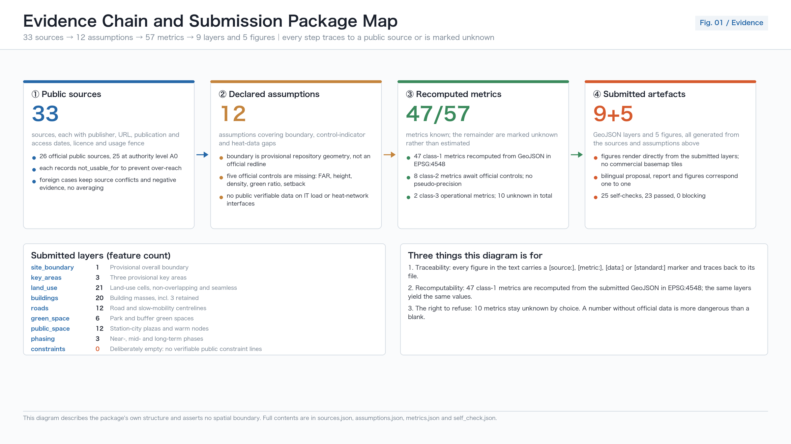
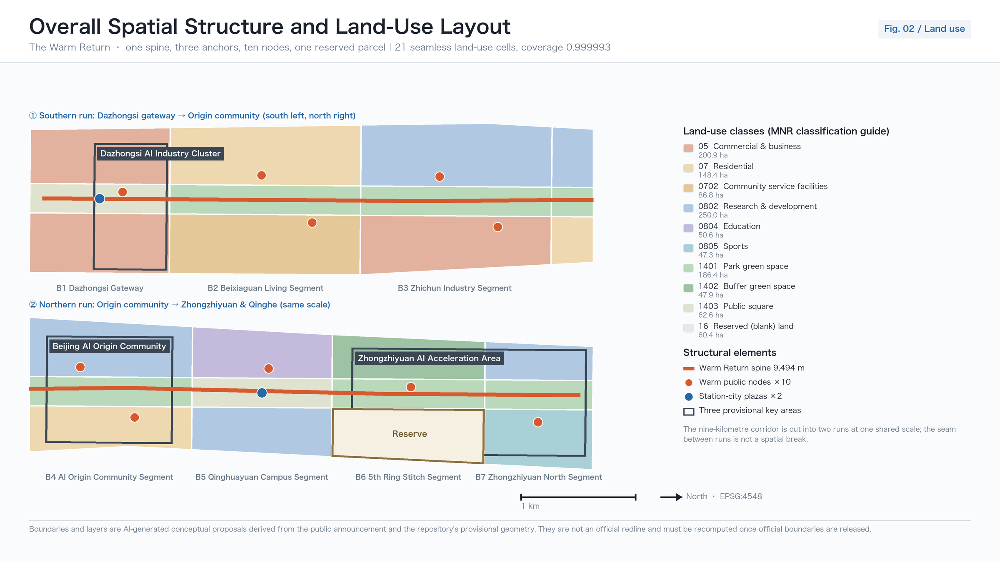
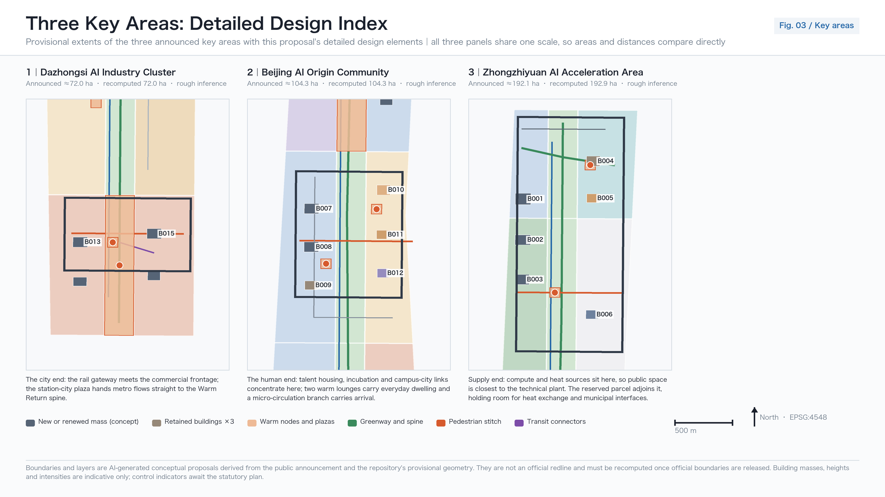
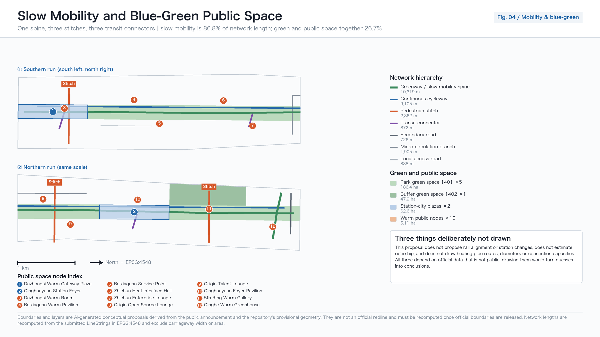
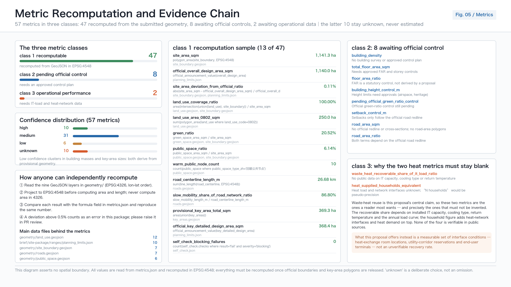

# THE WARM RETURN 京张回暖线: Giving the Heat of Compute Back to the City

## Design Basis and Source List

The primary basis of this proposal is the prequalification announcement issued by the Haidian branch of the Beijing Municipal Commission of Planning and Natural Resources, which fixes the three-level scope of coordinated research, overall design and key areas, together with the area magnitudes, design tasks and required deliverable depth [source:OFFICIAL-ANNOUNCEMENT]. The open-call taskbook addressed to AI agents worldwide adds requirements on the number of scenario cards and personas, on naming and visual identity, on operating mechanisms and on boundary clauses [source:AGENT-TASKBOOK]. Together the two documents form the task boundary: the first is the planning context, the second is the submission context, and neither can be dropped. No design judgement here rests on private inference beyond those two documents.

The argument of the scheme comes from a historical thread that can be publicly verified rather than from rhetoric. The first branch of the Jing-Zhang railway — the Jingmen branch from Xizhimen to Mentougou — was built by the Jing-Zhang railway in 1906 specifically to carry coal, and coal from western Beijing was moved out quickly and in volume along it [source:BJ-JINGMEN-COAL-BRANCH]. One clarification must be made immediately: verification could not find a reliable source supporting the common claim that the Jing-Zhang trunk line was built in order to bring coal into Beijing, and official accounts emphasise independent railway construction, Jing-Zhang commerce and transport beyond the Great Wall. This proposal therefore uses the energy-transport origin narrative only within the branch line, where it is confirmed, and states that limit in the main text rather than hiding it in a footnote [depth:existing_conditions_diagnosis].

A hundred and twenty years later, what the same corridor carries has changed. At the western end, Zhangjiakou was approved by the State Council as a renewable energy demonstration zone, and the Zhangbei cloud computing industrial base was jointly planned and built by Beijing's industry and information technology authorities, Hebei's counterparts and the Zhangjiakou municipal government, with the goal of becoming China's "data dam" [source:ZJK-RENEWABLE-DEMO-ZONE] [source:ZHANGBEI-DATACENTER-BASE]. At the eastern end, Haidian is where that compute becomes models, products and services. Green power flows east, compute flows east, and the heat mostly dissipates in cooling towers — that is the urban design problem this proposal addresses.

The spatial basis must be declared honestly. Neither the official redline nor precise polygons for the three key areas have been published in a verifiable coordinate system through public channels; this package uses the repository's provisional rough geometry to generate the scheme, and marks that provisional status in four places at once — the main text, the report HTML, the source list and the assumption list [source:PROVISIONAL-BOUNDARIES]. The recomputed area of the submitted boundary matches the announced magnitude of 11.4 square kilometres to about one part in a thousand and is used only for magnitude discussion [metric:site_area_sqm]; the three key areas retain the original rectangles and no area is claimed for them [data:geometry/key_areas.geojson#PROV-KEY-001]. This geometry is not a redline, not an approval basis and not a basis for precise areas.

Standards and depth references are cited at three levels. The purpose of urban design and the coordination of public space and urban character follow the Ministry of Housing and Urban-Rural Development's measures on urban design administration [standard:MOHURD-URBAN-DESIGN-MEASURES]; the content scope of regulatory-plan depth and the boundary of planning permission follow the measures on the formulation and approval of regulatory detailed plans [standard:MOHURD-CONTROL-DETAILED-PLANNING]; the land use code system follows the Ministry of Natural Resources guideline on land and sea use classification [standard:MNR-LAND-USE-CLASSIFICATION-GUIDE]. Floor area ratio, building height, building density, green ratio and setback — five official controls — are all registered as missing in the site package, so this proposal fills in none of those five values [source:PLANNING-LIMITS].

## Three-Level Scope Framework

The three levels are not three drawings at different scales; they are three different kinds of question. The 43.6-square-kilometre coordinated research area answers "what role does this corridor play in the national AI map"; the 11.4-square-kilometre overall design area answers "how should the urban districts one to two kilometres either side of the heritage park renew and carry growth"; the 368.4-hectare key areas answer "how are the plots, buildings, transport and public space of three specific districts actually made". All three magnitudes are taken from the official values registered in the site package and are not re-derived here [source:PLANNING-LIMITS] [depth:three_level_scope_framework].

This proposal gives all three levels one shared organising motif: the Warm Return. It is defined by an energy chain — wind and solar power from Zhangbei flow east, Haidian's racks turn that electricity into compute, compute inevitably becomes heat, and today that heat is essentially rejected. The national level has already required stronger recovery and use of data centre waste heat, encouraging enterprises to build their own heat recovery systems for campus heating, district heating and protected agriculture, and setting the goal that by the end of 2030 the waste-heat utilisation rate of newly built large and above data centres in northern heating regions will improve markedly [source:NDRC-DATACENTER-GREEN-ACTION]. At the municipal level, Beijing had already encouraged data centres to adopt waste-heat recovery measures to supply heat to surrounding buildings [source:BJ-DATACENTER-OPTIMIZATION]. The policy direction is clear; what is missing is space.

The Warm Return fills exactly that spatial gap. It turns "warming" into three things that can be drawn, computed and checked: one slow-mobility spine running north to south that binds the nine-kilometre heritage park into a continuous walking experience [data:geometry/roads.geojson#ROAD-001]; ten warm public nodes so that winter public life has somewhere to stay [metric:warm_public_node_count]; and one reserved blank parcel that holds a position for a future heat interface and new infrastructure instead of drawing an unfounded pipeline today [data:geometry/land_use.geojson#LU-018].

This must be said plainly: the proposal gives no waste-heat recovery quantity, no IT load, no number of heated households and no carbon reduction figure. Verification confirms there is no publicly verifiable IT load data within the corridor, and no public location or capacity for heat-network interfaces. The verifiable facts reach only the policy and regional level — for example, the 13 data centre projects and 388,800 planned standard racks in Zhangbei county are a county planning figure, not operating data, and cannot be used to derive any heat quantity on the Haidian side [source:ZHANGBEI-DATACENTER-BASE]. All waste-heat quantities are therefore written as pending preconditions, and the corresponding metrics carry the status unknown [metric:waste_heat_recoverable_share_of_it_load_ratio].

| Level | Design question | The Warm Return's answer | Data anchor |
| --- | --- | --- | --- |
| Coordinated research area, 43.6 km² | The corridor's role in the AI map | Add the "heat back to the city" return leg to the one-way green-power-to-compute chain | [source:ZJK-RENEWABLE-DEMO-ZONE], [source:PLANNING-LIMITS] |
| Overall design area, 11.4 km² | How renewal and carrying capacity are organised | One spine, ten nodes, three stitches, one blank | [metric:site_area_sqm], [data:geometry/land_use.geojson#LU-001] |
| Key areas, 368.4 ha | How three districts reach detailed design depth | They take the supply end, the conversion end and the city end respectively | [data:geometry/key_areas.geojson#PROV-KEY-002], [metric:key_area_count] |

The transmission between levels is one-directional and traceable: the industrial judgement from coordinated research sets the functional mix and facility types of the overall design; the spatial structure of the overall design sets the boundary conditions of the key areas; and the detailed design of the key areas tests in return whether the first two levels can be implemented. Any area, ratio or scale at any level that cannot be recomputed from the structured files must not enter a conclusion [depth:overall_spatial_structure].

## Coordinated Research Area: Industry and Future City Research

The task of the coordinated research area is to build a world-class AI innovation ecosystem. Haidian's resource structure is already clear enough: dense universities and institutes, a concentration of leading firms and unicorns, compute, algorithms and data all present, and a mature incubation and technology-service system. The genuinely scarce item is not the factors themselves but the public interfaces between them — the open-source community has no fixed venue for releases, start-ups have no low-threshold entry to compute, corporate display and everyday civic life never intersect, and a developer arriving from abroad has no route they can actually walk end to end [source:AGENT-TASKBOOK] [standard:PROJECT-AGENT-OPEN-CALL-TASKBOOK].

The Warm Return organises the innovation chain as a five-part loop: university origination, open-source collaboration, enterprise conversion, public experience and international communication. What separates it from the usual "innovation corridor" narrative is that every part has a physical carrier and a verifiable spatial metric rather than an arrow on a diagram. Origination sits on the education and research land at Tsinghua and Wudaokou [data:geometry/land_use.geojson#LU-013]; collaboration sits in the release and night-work spaces of the Origin Community [data:geometry/public_space.geojson#PUBLIC-008]; conversion sits in the pilot-testing and engineering-validation spaces on Zhichun Road; experience sits in the ten warm public nodes; communication sits at the international roadshow frontage at Dazhongsi [data:geometry/public_space.geojson#PUBLIC-003].

Naming and visual identity are derived from the same energy chain rather than bolted on as a slogan. "Warm Return" names three things at once: the history of a railway bringing coal into the city for heating, the technical proposition of compute waste heat returning to the city, and the everyday experience of public space becoming usable again in winter. The identity is built from two primitives — an arrow standing for return and a colour ramp standing for a temperature gradient; wayfinding at each kilometre marker states that segment's public function and opening hours. All marks, type treatments and graphics in this package are original, and no corporate logo, third-party font file or personal likeness is used [depth:height_massing_character].

Future city research must answer how artificial intelligence changes work, life, socialising, learning, mobility and public services. This proposal's judgement is that AI's most direct effect on urban space is not a change in mobility form such as autonomous driving or unmanned delivery, but two more basic things: first, compute facilities become urban infrastructure on a par with water, power and gas, and therefore must enter land use and municipal coordination; second, the accessibility of public services starts to depend on interface design rather than on facility counts. Both judgements land on spatial moves here: the reserved parcel answers the first, and the warm nodes plus human fallback answer the second [depth:municipal_new_infrastructure].

The boundary of the energy-efficiency discourse must be stated. Nationally, the power usage effectiveness required of newly built and expanded large and hyperscale data centres has fallen to no more than 1.25, and no more than 1.2 at national hub nodes; Beijing applies a local standard limit of 1.35 as the red line for existing data centres and will charge differential electricity prices to those exceeding it from 2026 [source:NDRC-DATACENTER-GREEN-ACTION] [source:BJ-DATACENTER-OPTIMIZATION]. These figures belong to different levels and different subjects and cannot be cited interchangeably; nor does this proposal infer from them the actual efficiency of any facility inside the corridor. All recommendations on global AI events, developer communities, open scenarios and pilgrimage routes are conceptual proposals and reference schemes for professional teams to develop further, and constitute no confirmed government activity or implementation arrangement.

## Overall Design Area: Urban Renewal and Regulatory-Plan-Level Urban Design

The overall design area must reach the urban design depth of a regulatory detailed plan. The spatial structure can be stated in one line: one spine running through, three cores anchoring, ten nodes carrying, one parcel left blank. The land use scheme divides the submitted boundary completely into 21 units with no pairwise overlap and no gap, reaching a coverage ratio above 0.9999, with a residual gap of only 75.82 square metres arising from coordinate rounding [metric:land_use_coverage_ratio] [data:geometry/land_use.geojson#LU-001]. The code system follows the national classification strictly and covers ten categories including residential, public administration and services, commercial services, transport, green space and squares, and reserved blank land [standard:MNR-LAND-USE-CLASSIFICATION-GUIDE].

The real precondition for this structure is that the Jing-Zhang high-speed line went underground. The Tsinghua Park tunnel is 6.02 kilometres long with an excavation diameter of 12.64 metres, at the time the largest-diameter shield tunnel inside Beijing; it was holed through on 20 November 2018, and the Jing-Zhang high-speed railway opened on 30 December 2019 [source:NRA-QINGHUAYUAN-TUNNEL]. The surface space released became the land basis for the heritage park: the park runs from Beijing North station to the North Fifth Ring Road, about 9 kilometres long, serving nine subdistricts and towns in Haidian; phase one lies between Tsinghua East Road and Zhichun Road, about 2.4 to 2.5 kilometres long and 16.8 hectares, fully open in June 2023; phase two started in December 2024 and opened on 6 August 2026, bringing the whole line to about 70 hectares [source:BJ-HERITAGE-PARK-PLANNING] [source:BJ-HERITAGE-PARK-BUILD].

In other words, the heritage park already exists. This proposal does not offer to build a park; it offers to turn an existing nine-kilometre green corridor from a line that can be looked at into a band that can be used. Three concrete moves. First, upgrade the north-south continuity of the corridor from visual to pedestrian continuity: of a recomputed 26,676.1 metres of road centreline, 23,157.41 metres are slow-mobility, a share of 0.868 [metric:slow_mobility_share_of_road_network_ratio]. Second, stitch three breaks in the slow-mobility network, of which the crossing of the North Fifth Ring Road is the most critical [metric:pedestrian_stitch_count] [data:geometry/roads.geojson#ROAD-003]. Third, place ten warm nodes along the corridor so that four months of winter public life has somewhere to land [metric:warm_public_node_area_sqm].

Winter has to be described in verifiable terms. Beijing's statutory heating season runs from 15 November to 15 March of the following year, and the municipal government may adjust it according to weather and other actual conditions [source:BJ-HEATING-MANAGEMENT-MEASURES]; the winter outdoor design temperature for heating in Beijing is minus 7.6 degrees Celsius, and the indoor heating design temperature for bedrooms and living rooms in ordinary dwellings must not be below 18 degrees Celsius [source:BJ-INDOOR-TEMPERATURE-STANDARD]. A nine-kilometre linear public space will see markedly lower use intensity across those four months, and that is the direct reason for placing warm nodes — not to display technology, but to keep public space usable in the part of the year that needs it most.

The building and intensity section must state what was done and what was not. Twenty building footprints were generated as conceptual illustration, with a recomputed total footprint area of 201,535.051 square metres [metric:building_footprint_area_sqm] [data:geometry/buildings.geojson#BLDG-001]. Those twenty objects are not the result of a survey of existing buildings and do not represent total floor area. Floor area ratio, total floor area, building density, height control and setback all remain unknown until official controls are released, and no speculative value is entered [depth:development_intensity_controls] [depth:land_use_layout]. This is not evasion: entering numbers with no approved regulatory plan behind them would void the credibility of the entire submission.

## Detailed Design of Key Areas

The three key areas occupy three positions on the energy chain of the Warm Return: Zhongzhiyuan is the supply end, the Beijing AI Origin Community is the conversion end, and Dazhongsi is the city end. This division is not a naming game; it determines each district's functional mix, its types of public space and its implementation dependencies [depth:three_key_area_detailed_design]. The three provisional geometries measure 192.9, 104.3 and 72.0 hectares, and their sum deviates from the announced 368.4 hectares by about two parts in a thousand [metric:provisional_key_area_zhongzhiyuan_sqm] [data:geometry/key_areas.geojson#PROV-KEY-001].

The Zhongzhiyuan AI Autonomous Innovation Acceleration Area, as the supply end, organises space around full-stack independent innovation, standard setting and safety governance. Its three principal building objects are the innovation headquarters, the safety governance evaluation centre and the innovation exchange complex [data:geometry/buildings.geojson#BLDG-002]. The Qinghe frontage is the district's most important public resource: a waterfront greenway works together with a waste-heat greenhouse so that the output of technical facilities becomes public space one can enter [data:geometry/green_space.geojson#GREEN-005]. One existing workshop is retained for conversion into a heat-exchange station and exhibition space — one of only two building-level "retain and renovate" objects proposed here, because it satisfies both industrial heritage value and a technical functional need. The district also carries sports and health land for all-weather exercise and rehabilitation [data:geometry/land_use.geojson#LU-021].

The Beijing AI Origin Community, as the conversion end, carries the highest requirement for public quality of the three. Adjacent to universities, its task is to organise research translation, talent housing and open-source collaboration within walking distance. There are four spatial moves: an open-source collaboration centre providing a release hall and night-work space [data:geometry/buildings.geojson#BLDG-008]; a retained warehouse converted into a venue for releases and exhibitions; a talent housing cluster as the candidate site for a waste-heat heating demonstration neighbourhood [data:geometry/land_use.geojson#LU-012]; and an east-west pedestrian stitch linking campus, park and neighbourhood [data:geometry/roads.geojson#ROAD-004]. The Origin warm garden and two warm lounges form the district's outdoor living room [data:geometry/public_space.geojson#PUBLIC-009].

The Dazhongsi AI Industry Cluster, as the city end, handles the most complex interface problem, facing a rail station, a major road intersection and existing commercial buildings at once. The core moves are four-quadrant pedestrian connection at the intersection and a station-city plaza [data:geometry/roads.geojson#ROAD-005] [data:geometry/public_space.geojson#PUBLIC-001]. Four-quadrant connection decides whether this district works at all: if pedestrians cannot cross safely between the four sides, no functional ambition about international exchange or content consumption can land. The district carries headquarters for leading firms, a smart-terminal complex, commercial service buildings and a cultural exhibition hall, with the Warm Return lounge as an all-weather public warm hall and international roadshow foyer [data:geometry/public_space.geojson#PUBLIC-003].

The detailed design of all three districts is limited by one shared set of conditions that must be written down: the rectangular form of the provisional geometry cannot serve as a district redline; no official geometry can be cited for heritage protection extents, regulatory control lines, road redlines, river blue lines or municipal pipelines; and the former Tsinghua Park station has been designated a Beijing municipal protected heritage site whose protection extent and construction control zone are unknown to this proposal, so public space design near the station is a conceptual proposal only and any implementation must be separately reviewed by the heritage authority [source:BJ-QINGHUAYUAN-STATION-HERITAGE] [data:geometry/constraints.geojson#CONSTRAINTS].

| Key area | Position on the chain | Leading functions | Key spatial moves | Main implementation dependencies |
| --- | --- | --- | --- | --- |
| Zhongzhiyuan AI Autonomous Innovation Acceleration Area | Supply end | Full-stack innovation, standards, safety governance | Qinghe waterfront greenway, waste-heat greenhouse, workshop-to-heat-station conversion, sports and health land | River blue line, ecological and flood conditions, workshop tenure |
| Beijing AI Origin Community | Conversion end | Research translation, open-source collaboration, talent housing | Open-source release hall, warehouse conversion, demonstration neighbourhood, east-west pedestrian stitch | Campus boundary, tenure, heat interface conditions |
| Dazhongsi AI Industry Cluster | City end | Intelligent economy, content consumption, international exchange | Four-quadrant pedestrian connection, station-city plaza, all-weather warm lounge | Rail station, intersection traffic organisation, underground utilities |

## AI Innovation Ecosystem, Personas, and AI+ Scenarios

This proposal defines 6 personas and 12 AI scenario cards [metric:user_persona_count] [metric:ai_scenario_card_count]. Every card must answer four questions: who is served, where, on what data, and who is responsible when it fails. A scenario missing any of the four does not enter the proposal [source:AGENT-TASKBOOK].

Data boundaries are a design constraint, not a disclaimer. The interim measures for the administration of generative AI services set out the scope of application, the obligation to handle unlawful content, and the requirement to process complaints and reports promptly; it should be noted that the security assessment and filing requirement in Article 17 applies only to services with public-opinion attributes or social mobilisation capability, so this proposal neither presumes that any service has completed filing nor infers a general user exit right from the unlawful-content clauses [source:GENERATIVE-AI-INTERIM-MEASURES]. All scenarios here follow data minimisation: no collection of individual trajectories, no output of individual profiles, and no use of resident data for commercial recommendation.

Human fallback likewise has a clear basis and a clear boundary. Article 39 of the Law on Building a Barrier-Free Environment requires that public service venues handling medical care, social security, finance and utility payments retain on-site guidance and human processing [source:BARRIER-FREE-ENVIRONMENT-LAW]. Human channels are therefore retained in scenarios touching those four categories, and that requirement is not generalised to every digital interface or every public space. The implementation plan on difficulties older people face with smart technology provides the policy background of parallel traditional and digital service, cited as background only and not used to infer local implementation or usage rates [source:ELDERLY-SMART-TECH-PLAN].

| Persona | Core need | Spatial response | Data and responsibility boundary |
| --- | --- | --- | --- |
| Open-source developer | Releases, collaboration, night work, community reputation | Origin collaboration centre and warm lounge, kilometre-marker wayfinding | Activity data aggregated only; no individual contribution profile |
| Start-up team | Low-cost space, compute entry, test ground | Zhichun Road pilot validation works, enterprise service lounge | Compute and data services separately licensed, never open by default |
| Leading firms and international visitors | Display, negotiation, media releases | Dazhongsi warm lounge, gateway plaza, roadshow foyer | Corporate marks and cases used only after rights clearance |
| Nearby residents | Commuting, leisure, community services, low disturbance | Beixiaguan warm pavilion and community service band, slow-mobility spine | No resident data for commercial recommendation or pricing |
| University staff and students | Translation, cross-campus collaboration, daily walking | Campus-city learning hall, Wudaokou joint laboratory | Campus data and research outputs require authorisation |
| Heating and facility operators | Inspection, fault response, winter assurance | Converted heat-exchange workshop, heat interface exhibition hall | Operations data used for facility management only, never staff appraisal |

The twelve scenario cards fall into four groups. First, mobility: AI slow-mobility navigation identifies breaks, crowding and accessibility needs, serving the spine and the three stitches [data:geometry/roads.geojson#ROAD-001]; low-speed delivery robots receive limited right of way and yielding rules on the spine and do not enter warm pavilions; four-quadrant crossing assistance provides extended green time and audio prompts at Dazhongsi. Second, public services: community health navigation, an age-friendly service point and a shared kitchen, all retaining human processing channels [data:geometry/public_space.geojson#PUBLIC-005]. Third, industry services: an enterprise service copilot, open-source release collaboration, a data-factor salon and a compute-entry advice desk [data:geometry/public_space.geojson#PUBLIC-007]. Fourth, culture and safety: Jing-Zhang cultural interpretation and public space safety operations review, both premised on aggregated data and human review.

The four industrial test and validation scenarios each correspond to an operable physical carrier [metric:industry_test_scenario_count]: model evaluation and red-teaming at the safety governance evaluation centre, engineering validation at the Zhichun Road pilot works, low-speed delivery right-of-way trials on the slow-mobility spine, and public demonstration of the heat-exchange process at the heat interface exhibition hall [data:geometry/public_space.geojson#PUBLIC-006]. The last deserves a note: that hall demonstrates the physical process of heat exchange and its public policy basis, not any unverified recovery figure. Until IT load and heat-network data exist, its content is "how this is done", not "how much has been achieved".

An urban AI agent can help identify slow-mobility breaks, public space use intensity, maintenance needs and event safety risk, but it cannot replace planning approval, cannot output unauthorised individual profiles, and cannot claim any official implementation commitment [depth:blue_green_public_space].

## Land Use, Building Scale, and Retain-Renovate-Demolish Strategy

The technical precondition of the land use scheme is topological correctness. The submitted boundary is divided completely into 21 land units with zero pairwise overlap area, a coverage gap of 75.82 square metres against an allowed tolerance of 1,141.283 square metres, the gap arising from coordinate rounding rather than unlabelled blanks [metric:land_use_coverage_ratio] [data:geometry/land_use.geojson#LU-001]. This has to be settled first: if the land layer contained overlaps or gaps, every subsequent discussion of area, ratio and intensity would collapse. Land codes follow the national land and sea use classification for territorial survey and planning, with no invented codes [standard:MNR-LAND-USE-CLASSIFICATION-GUIDE].

The organising logic of the ten categories follows the Warm Return. Green space and square land forms a band along the heritage park and constitutes the spatial base of the spine [data:geometry/land_use.geojson#LU-002]; public administration and public service land concentrates on the Origin Community and Beixiaguan side, close to resident population rather than to display frontage [data:geometry/land_use.geojson#LU-012]; commercial service land concentrates at the Dazhongsi city end, coupled with the rail station; industrial and warehouse categories are retained at the Zhongzhiyuan supply end to leave room for pilot testing, evaluation and heat exchange, which are asset-heavy functions; residential land continues the existing pattern, and no large new residential development is proposed. The reserved blank parcel is the most deliberate land use decision in this proposal [data:geometry/land_use.geojson#LU-018].

The role of the blank parcel needs explaining or it will be misread as indecision. The heat interfaces, heat-exchange stations, thermal storage and compute-related municipal facilities that the Warm Return depends on have positions and capacities determined by three things this proposal cannot know: actual IT load, the connectable points and capacity of the heat network, and the tenure and operating entity. The policy direction is explicit — the state has required stronger recovery and use of data centre waste heat and encouraged its use for campus and district heating, and Beijing has explicitly encouraged supplying heat to surrounding buildings [source:NDRC-DATACENTER-GREEN-ACTION] [source:BJ-DATACENTER-OPTIMIZATION]. The right move is therefore to reserve space rather than to draw an unfounded pipeline now. Once official controls and heat data are released, the parcel can convert to municipal utility land or another necessary use [depth:municipal_new_infrastructure].

The building scale section separates what was done from what was not. Twenty building footprints were generated as conceptual illustration, with a total footprint area recomputed in EPSG:4548 of 201,535.051 square metres [metric:building_footprint_area_sqm] [data:geometry/buildings.geojson#BLDG-001]. Those twenty objects are neither a survey of existing buildings nor a representation of planned total floor area. Floor area ratio, total floor area, building density, height control and setback are registered as missing in the site package, and no speculative value is entered for any of the five [source:PLANNING-LIMITS] [depth:development_intensity_controls]. Filling in those five without an approved regulatory plan would void the credibility of the whole submission — that is a trade-off, not evasion.

The retain-renovate-demolish strategy proposes only verifiable objects, and leans heavily on retention. Two building-level conversions are proposed: the existing workshop on the Qinghe frontage becomes a heat-exchange station and heat exhibition space [data:geometry/buildings.geojson#BLDG-004], and the existing warehouse in the Origin Community becomes a venue for releases and exhibitions [data:geometry/buildings.geojson#BLDG-009]. The reason is the same in both cases: they carry industrial heritage value and suit the technical function, and after conversion they host exactly the heavy-equipment, large-span functions the Warm Return needs. The former Tsinghua Park station is a designated Beijing municipal protected heritage site, but its protection extent and construction control zone are unknown here, so any spatial move near the station is a conceptual proposal and implementation requires separate review by the heritage authority [source:BJ-QINGHUAYUAN-STATION-HERITAGE].

| Category | What this proposal does | Basis and boundary |
| --- | --- | --- |
| Retain | The existing green corridor, the former Tsinghua Park station, two existing workshops and warehouses | Heritage extent unknown; station surroundings remain a conceptual proposal [source:BJ-QINGHUAYUAN-STATION-HERITAGE] |
| Renovate | Workshop to heat-exchange station and exhibition hall; warehouse to open-source release venue | Tenure and structural conditions still to be verified [data:geometry/buildings.geojson#BLDG-004] |
| Demolish | No specific demolition object is proposed | No survey or tenure data, so no demolition judgement [source:PLANNING-LIMITS] |
| Reserve | One blank parcel holding a heat interface and new infrastructure | Use fixed once IT load and heat network data are released [data:geometry/land_use.geojson#LU-018] |

To be explicit: no specific demolition object is proposed here. The reason is the absence of a building survey, structural safety assessment and tenure information; any demolition judgement would step outside what can be verified. All land use and building recommendations are conceptual proposals and reference schemes for professional teams to develop once official controls are obtained [depth:land_use_layout].

## Transport, Rail, Municipal Infrastructure, and Public Services

The transport strategy starts from something that has already happened. The Qinghuayuan tunnel of the Beijing-Zhangjiakou high-speed railway is 6.02 kilometres long with an excavation diameter of 12.64 metres, was holed through on 20 November 2018, and the line opened on 30 December 2019, which vacated the former surface rail corridor [source:NRA-QINGHUAYUAN-TUNNEL]. What that release produced is a continuous north-south space, limited in width but considerable in length. The transport strategy of this proposal is therefore not to add motor vehicle capacity but to turn that linear space into a city-scale slow-mobility spine [depth:traffic_rail_slow_parking].

The slow-mobility system consists of one spine, three stitches and three station connections. The spine is the Warm Return slow-mobility line running the full north-south length along the heritage park [data:geometry/roads.geojson#ROAD-001], with a continuous cycle track on its west side separated from the walking route to avoid mixed-traffic conflict [data:geometry/roads.geojson#ROAD-002]. Recomputed road centreline length totals 26,676.1 metres, of which slow-mobility length is 23,157.41 metres, a share of 0.868 [metric:slow_mobility_share_of_road_network_ratio]. The three stitches address three real breaks: a pedestrian crossing over the North Fifth Ring Road, where the ring road severs the north-south movement [data:geometry/roads.geojson#ROAD-003]; an east-west pedestrian stitch in the Origin Community linking campus, park and neighbourhood [data:geometry/roads.geojson#ROAD-004]; and four-quadrant pedestrian connection at the Dazhongsi intersection to solve crossing on a major arterial [data:geometry/roads.geojson#ROAD-005]. Three station connections guide arriving rail passengers onto the spine [data:geometry/roads.geojson#ROAD-006].

The rail section needs a clear boundary. No citable rail alignment geometry, station entrance coordinates or passenger flow data were obtained, so this proposal makes no line adjustment, no new station and no entrance reconstruction proposal, and does not estimate interchange volumes or walking connection times. Rail-related content is limited to the spatial-level conceptual suggestion of organising slow-mobility connection and station forecourt space near existing stations; implementation must follow material from the rail authority and operator [source:PLANNING-LIMITS] [depth:traffic_rail_slow_parking]. Road hierarchy uses only the editable levels, and expressway and arterial alignments are left unchanged.

Municipal infrastructure is the most technically dense and the most data-poor part of the Warm Return. At national level, stronger recovery and use of data centre waste heat is already required, with enterprises encouraged to build heat recovery systems for campus heating, district heating and protected agriculture, and a stated goal that by the end of 2030 the waste heat utilisation rate of newly built large and above data centres in northern heating regions rises markedly [source:NDRC-DATACENTER-GREEN-ACTION]; Beijing likewise explicitly encourages data centres to adopt waste heat recovery measures to supply heat to surrounding buildings [source:BJ-DATACENTER-OPTIMIZATION]. This proposal therefore makes only two municipal moves: reserving the blank parcel as the position for a heat interface, heat-exchange station and thermal storage [data:geometry/land_use.geojson#LU-018], and displaying the physical process and policy basis of heat exchange publicly in the heat interface exhibition hall [data:geometry/public_space.geojson#PUBLIC-006]. Pipe routes, diameters, connection points and capacities are not drawn at all, absent official heat network and IT load data [depth:municipal_new_infrastructure].

| System | What this proposal provides | What it explicitly does not provide |
| --- | --- | --- |
| Slow mobility | Spine, cycle track, three stitches, three station connections | No traffic volume forecast or signal timing design [metric:pedestrian_stitch_count] |
| Rail | Conceptual suggestions for forecourt space and connection | No line adjustment, entrance rebuild or ridership estimate [source:PLANNING-LIMITS] |
| Heat | Reserved interface on the blank parcel, public process display | No pipes, diameters, capacity or recovery quantity [data:geometry/land_use.geojson#LU-018] |
| Public services | Warm pavilions, community service band, staffed counters | No facility scale metrics or service radius compliance claims [source:BARRIER-FREE-ENVIRONMENT-LAW] |

Public services here relate directly to winter. Beijing's statutory heating season runs from 15 November to 15 March of the following year, adjustable according to actual weather conditions [source:BJ-HEATING-MANAGEMENT-MEASURES]; the winter outdoor design temperature is minus 7.6 degrees Celsius, and indoor heating design temperature for bedrooms and living rooms in ordinary dwellings should be no lower than 18 degrees Celsius [source:BJ-INDOOR-TEMPERATURE-STANDARD]. That means a nine-kilometre linear public space sits at low use intensity for four months of the year. The response is to place stoppable nodes — warm pavilions, warm halls and community hot water rooms — along the line [data:geometry/public_space.geojson#PUBLIC-004], and to retain on-site guidance and staffed counters at service points dealing with medical care, social security, finance and utility payments [source:BARRIER-FREE-ENVIRONMENT-LAW]. Facility scale, service radius and compliance rates are not concluded, because population distribution and existing facility survey data are unavailable.

## Blue-Green Network, Public Space, and Urban Character

The blue-green skeleton did not need inventing by this proposal; it is already built. The heritage park runs from Beijing North station in the south to the North Fifth Ring Road, about 9 kilometres in total, serving nine subdistricts and towns in Haidian; phase one lies between Tsinghua East Road and Zhichun Road, about 2.4 to 2.5 kilometres long and 16.8 hectares in area, fully open in June 2023; phase two started in December 2024 and opened on 6 August 2026, bringing the whole-line area to about 70 hectares [source:BJ-HERITAGE-PARK-PLANNING] [source:BJ-HERITAGE-PARK-BUILD]. On that base the green layer organises six green units, with total green area and green ratio recomputed from submitted geometry in EPSG:4548 [metric:green_space_area_sqm] [data:geometry/green_space.geojson#GREEN-001]. One distinction matters: a recomputed green ratio and an approved regulatory-plan green ratio control figure are two different things, and the latter remains unknown until official controls are released [source:PLANNING-LIMITS].

Blue space has exactly one operable object: the Qinghe frontage. A waterfront greenway is proposed along the Qinghe edge of the Zhongzhiyuan area, coupled with the waste-heat greenhouse so that the output of technical infrastructure becomes enterable public space [data:geometry/roads.geojson#ROAD-011] [data:geometry/green_space.geojson#GREEN-005]. The constraint has to be stated: river blue lines, flood control standards, ecological protection requirements and bank tenure all lack citable official geometry, so every waterfront move stops at the level of conceptual suggestion, and any design close to the river must follow water authority and ecological authority material [data:geometry/constraints.geojson#CONSTRAINTS]. No channel realignment, revetment reconstruction or water level regulation is proposed.

The public space system comprises twelve nodes, of which ten are Warm Return public nodes [metric:warm_public_node_count] [metric:warm_public_node_area_sqm]. They fall into three types. Gateway nodes handle arrival and display at the city end, including the Dazhongsi Warm Return gateway plaza and the station-city integrated plaza [data:geometry/public_space.geojson#PUBLIC-001]. Community nodes serve everyday and winter life, including the Beixiaguan warm pavilion, community hot water rooms and the Origin talent service warm hall [data:geometry/public_space.geojson#PUBLIC-004]. Technical nodes turn infrastructure into content that can be seen and learned from, including the heat interface exhibition hall and the Qinghe waste-heat greenhouse [data:geometry/public_space.geojson#PUBLIC-012]. Total public space area and its share are likewise written from recomputation [metric:public_space_ratio].

The design principle for warm nodes is low-threshold warmth. It depends neither on complex equipment nor on waste heat already being connected: each node first satisfies five basic conditions — shelter, wind protection, seating, lighting and hot water — so it works independently before any heat interface exists; waste heat connection later becomes a heat-source upgrade rather than a precondition. That sequence is the single most important implementation judgement in this proposal, because it decouples the usability of public space from uncertain technical connection and prevents the whole line from being unable to start over one missing dataset [depth:blue_green_public_space].

Urban character is derived from the energy chain rather than layered on as slogan. Three principles govern it. First, the frontages on both sides of the heritage park should be continuous, crossable and low-walled, so the green corridor does not become an enclosed island. Second, historical clues are expressed through paving, kilometre markers, surviving track and an interpretation system, not through pastiche historical buildings. Third, technical facilities are not hidden — heat-exchange stations, greenhouses and exhibition halls appear as visible public content rather than being buried underground or placed behind walls [depth:height_massing_character]. The visual identity uses two basic symbols: an arrow standing for return, and a colour ramp standing for temperature gradient; signage at kilometre markers states the public function and opening hours of that segment. All signage, typography and graphics in this package are original, and no corporate logo, third-party font file or personal likeness is used.

| System | Recomputation basis | Spatial action in this proposal | What is left unconcluded |
| --- | --- | --- | --- |
| Green space | Six green units, recomputed area and ratio | Band along the heritage park, buffer along the Fifth Ring | Approved regulatory-plan green ratio [metric:green_ratio] |
| Blue line | No citable official geometry | Qinghe waterfront greenway with the waste-heat greenhouse | Blue line position, flood standard, bank tenure [data:geometry/constraints.geojson#CONSTRAINTS] |
| Public space | Twelve nodes, recomputed area and share | Gateway, community and technical node types | Use intensity and footfall forecast [metric:public_space_area_sqm] |
| Character | No quantified control conditions | Continuous frontage, historical clues, visible technology | Building height and massing control values [source:PLANNING-LIMITS] |

Quantified control of building height, massing and skyline is not entered before official conditions are released, so the character section stays at the level of principle and intent, available for professional teams to develop once control conditions are obtained [depth:height_massing_character].

## Renewal Projects, Implementation Policy, and Phasing

The renewal project list has 12 entries, every one landing on a specific element of the submitted geometry so that position and extent can be checked item by item [metric:renewal_project_count]. The organising principle is to do first what does not depend on waste heat: continuity of the slow-mobility spine, the three stitches, the basic conditions of warm pavilions and warm halls, and the signage system along the park. These projects stand on their own and produce public value before any heat interface exists. Projects that do depend on heat connection — heat-exchange station conversion, the waste-heat greenhouse, demonstration residential heating — are grouped separately as upgrades for when conditions mature [depth:renewal_project_list].

Phasing has three stages consistent with the submitted phasing layer, totalling 11,412,844.268 square metres across the three, differing from the boundary area by 18.882 square metres from segment clipping and rounding [metric:phasing_area_sqm] [data:geometry/phasing.geojson#PHASE-001]. The near term pilots the Origin Community and the Tsinghua Park forecourt, 3,171,437.576 square metres [metric:phase_1_area_sqm]; the medium term advances Zhongzhiyuan and the Fifth Ring stitch, 2,436,748.65 square metres [metric:phase_2_area_sqm]; the long term completes the Dazhongsi gateway and the southern segment, 5,804,658.041 square metres [metric:phase_3_area_sqm]. Phase boundaries are conceptual segmentation and constitute no implementation schedule commitment.

Implementation policy draws on built mechanisms elsewhere instead of inventing an institution. Stockholm's open district heating market turns data centre waste heat into openly listed trade, priced as a capacity charge plus an energy charge with prices tiered by outdoor temperature, with an official figure of roughly 2 million Swedish krona per year of revenue per megawatt of heating capacity; the same EU case page also records negative factors — after Sweden removed the electricity tax relief for data centres the incentive to locate there fell, and initial investment is high on both sides [source:STOCKHOLM-OPEN-DISTRICT-HEATING]. Helsinki's approach has the heating utility fund the heat pumps and connection facilities while the data centre supplies the waste heat, supported by a lower electricity tax band as incentive [source:HELSINKI-TELIA-HELEN-HEAT]. Odense is simpler still: the data centre supplies waste heat free of charge and the heat pump assets and investment sit entirely on the utility side [source:ODENSE-META-FJERNVARME-FYN]. What the three share is a clear written allocation of investment responsibility and benefit ownership, which is exactly what this proposal recommends settling first at implementation stage.

There is also precedent on the regulatory path. Germany's Energy Efficiency Act writes data centre waste heat reuse into national law: data centres commissioned on or after 1 July 2026 must meet a power usage effectiveness no higher than 1.2 and a waste heat reuse share of at least 10 percent, rising to at least 15 percent from 2027 and 20 percent from 2028; the share obligation is waived where a heat supply agreement with a network operator already exists, or where heat has been offered at cost price and the network operator has not accepted within six months [source:DE-ENERGY-EFFICIENCY-ACT-DATACENTER]. That exemption clause deserves particular attention, because it distributes responsibility symmetrically between the data centre and the heat network rather than loading pressure onto one side. This proposal does not presume that current Chinese regulation contains an equivalent obligation, and cites the German case as external reference only.

Domestic practice should be described as it is: technically proven, not yet scaled. Three checkable cases are Beijing Yizhuang's first data centre exporting waste heat (water-source heat pump, external supply at 45 to 55 degrees Celsius, about 12,000 square metres), the Zhangbei small and micro enterprise innovation park (53,000 square metres heated), and the Huailai cloud data centre (heating a residential estate since November 2024, about 40,000 square metres, direct supply at 45 degrees Celsius) [source:CN-DATACENTER-WASTE-HEAT-CASES]. All three sit in the tens-of-thousands-of-square-metres range, and there is no million-square-metre case connected to a large municipal heat network. So the Warm Return is not unprecedented in the Chinese context, but its scale must not be promised as if the engineering were already mature.

| Phase | Main projects | Depends on heat connection | Data anchor |
| --- | --- | --- | --- |
| Near term | Origin Community pilot, Tsinghua Park forecourt, open-source release venue conversion, warm hall basics | No | [data:geometry/phasing.geojson#PHASE-001] |
| Medium term | Zhongzhiyuan supply end, Fifth Ring crossing stitch, Qinghe waterfront greenway | Partly | [data:geometry/phasing.geojson#PHASE-002] |
| Long term | Dazhongsi gateway, four-quadrant connection, station-city plaza, southern continuity | No | [data:geometry/phasing.geojson#PHASE-003] |
| When conditions mature | Heat-exchange station conversion, waste-heat greenhouse, demonstration residential heating | Yes | [data:geometry/land_use.geojson#LU-018] |

All implementation policy content is conceptual suggestion and reference scheme. It constitutes no settled government policy, fiscal arrangement or implementation commitment, and any specific mechanism must be agreed separately among the competent authorities, the heating utility and the data centre operator [depth:phasing_implementation].

## Metrics, Area Recalculation, and Compliance Matrix

The metric system has 57 entries in three classes. The first class is spatial metrics recomputable directly from the submitted geometry, 47 in total, all derived from the GeoJSON in the EPSG:4548 projection rather than transcribed from the body text [metric:site_area_sqm] [metric:land_use_feature_count]. The second class is control metrics requiring an official regulatory plan or brief annex, 8 in total, all with status unknown: floor area ratio, total building scale, building density, height control, setback, approved green ratio, and road land area and share [metric:floor_area_ratio] [metric:setback_control_m]. The third class is performance metrics needing operational or industrial data for continuous calibration, 2 in total — recoverable waste heat share and heated household equivalent — also unknown [metric:waste_heat_recoverable_share_of_it_load_ratio] [metric:heat_supplied_households_equivalent]. The point of the three-way split is that a reader can immediately tell which figures this proposal is accountable for, which must wait for official data, and which must wait for operational verification.

The recalculation convention must be stated. The exchange coordinate reference system is EPSG:4326, and area and length are computed in EPSG:4548 [standard:MOHURD-CONTROL-DETAILED-PLANNING]. The submitted boundary recomputes to 11,412,825.386 square metres, deviating from the announced 11.4 square kilometre magnitude by 0.001125, used only for order-of-magnitude discussion and not as a redline basis [metric:site_area_deviation_from_official_ratio] [source:PROVISIONAL-BOUNDARIES]. The three key-area provisional geometries total 3,692,893.005 square metres, about two parts per thousand from the announced 368.4 hectares [metric:provisional_key_area_total_sqm]. Green area is 2,342,327.771 square metres at a ratio of 0.205236; public space area is 701,201.672 square metres at a share of 0.06144; the two combined give 0.266676 [metric:green_and_public_space_ratio]. Building footprint is 201,535.051 square metres at a coverage of 0.017659, including three retained existing objects [metric:building_footprint_ratio] [metric:retained_building_feature_count].

| Metric class | Count | Representative metrics | Basis for credibility |
| --- | --- | --- | --- |
| Recomputable spatial | 47 | Land use coverage 0.999993, slow-mobility share 0.868 | Recomputed in EPSG:4548, reproducible by script [metric:land_use_coverage_ratio] |
| Awaiting official control | 8 | Floor area ratio, height, setback, road land | Registered as missing in the site package, no guessed values [source:PLANNING-LIMITS] |
| Awaiting operational calibration | 2 | Recoverable waste heat share, heated household equivalent | No public IT load or heat network data [metric:heat_supplied_households_equivalent] |
| Blocking self-check failures | 0 | None | Self-check records checkable item by item [metric:self_check_blocking_failures] |

The compliance matrix is carried by three files that do not duplicate one another. The compliance matrix registers 23 brief requirements, giving for each the corresponding body section, GeoJSON layer, metric, drawing, display chapter, source, assumption and self-check entry; the standards matrix registers 6 standard bases and their coverage state; the design depth matrix registers 15 design depth entries and their completion state [standard:MOHURD-URBAN-DESIGN-MEASURES]. Every source, assumption and self-check identifier referenced in those matrices has been programmatically validated to resolve to an entity in sources.json, assumptions.json and self_check.json, with no dangling identifiers.

Why the waste-heat metrics stay unknown deserves a positive reason rather than a mere admission of missing data. Extraction temperatures in built cases abroad generally sit between 20 and 30 degrees Celsius and require heat pump upgrading before network entry: Odense lifts 27 degrees to 70, and Stockholm accepts network entry at only about 20 degrees [source:ODENSE-META-FJERNVARME-FYN] [source:STOCKHOLM-OPEN-DISTRICT-HEATING]. Recovery proportion depends heavily on the cooling method — air-cooled racks at roughly 25 to 30 kilowatts yield low-grade heat with limited recovery potential, while liquid cooling gives significantly higher return temperatures [source:CIBSE-LIQUID-COOLING-MODULE]. In other words, without knowing which cooling method the facilities in this corridor use, what their load is, or where the heat network connection points are, any recovery figure would simply import foreign parameters and would be false precision. This proposal declines to do that [depth:metrics_recalculation].

Once the official boundary and precise polygons for the three key areas are published, this package commits to regenerating geometry, recomputing metrics, regenerating drawings and display pages, and rerunning all validation scripts in full; until then every spatial metric is a conceptual result that is open to discussion, replacement and recomputation [source:SUBMITTED-GEOMETRY].

## Risk, Copyright, and Compliance

The first risk class is spatial data risk, and it is the largest risk in this proposal. No verifiable, coordinate-referenced version of the official redline or of the precise polygons for the three key areas has been published through public channels, so this package uses the provisional coarse geometry maintained in the repository and flags its provisional nature in four places at once: the body text, the report HTML, the source list and the assumption list [source:PROVISIONAL-BOUNDARIES]. This geometry is not a redline, not a basis for approval, and not a basis for precise area. Heritage protection extents, regulatory control lines, road redlines, river blue lines and municipal pipelines all lack citable official geometry, which is why the constraints layer is deliberately kept as an empty feature collection instead of drawing speculative control lines [data:geometry/constraints.geojson#CONSTRAINTS]. That gap limits how far any boundary-critical design move can be developed, and this proposal does not conceal it.

The second risk class is data availability. There is no publicly verifiable IT load data within the corridor and no public heat network interface location or capacity, so no waste heat recovery quantity, heated household count or carbon reduction figure is given [metric:waste_heat_recoverable_share_of_it_load_ratio]. Foreign cases can demonstrate that the mechanism works but cannot substitute for local data — even with the complete public parameters available for Stockholm, Helsinki and Odense, they serve only as methodological reference [source:HELSINKI-TELIA-HELEN-HEAT]. Counter-evidence must be recorded alongside: after Sweden removed the electricity tax relief for data centres the incentive to locate there fell, which shows the commercial viability of waste heat recovery is highly sensitive to the policy environment and is not a purely technical question [source:STOCKHOLM-OPEN-DISTRICT-HEATING].

The third risk class is operational and governance risk. Among cases abroad, projects have lost their power contracts to external sanctions and switched to diesel generation, supplying very little heat to the network or none at all, which signals systemic fragility in depending on a single heat source. The response here is decoupling at the design level: warm nodes first meet the five basic conditions of shelter, wind protection, seating, lighting and hot water so they are independently usable, and waste heat connection is only a heat-source upgrade [metric:warm_public_node_count]. On that basis the public space component still stands even if heat connection never materialises.

| Risk class | Specific content | How this proposal handles it |
| --- | --- | --- |
| Spatial data | No official redline, no control line geometry | Flag provisional status, keep constraints empty, leave the five control metrics unfilled [source:PLANNING-LIMITS] |
| Data availability | No IT load or heat network data | Related metrics stay unknown, no numeric conclusions [metric:heat_supplied_households_equivalent] |
| Operations and governance | Single heat source dependence, policy sensitivity | Decouple public space from heat connection, mark dependency in the phasing list [data:geometry/phasing.geojson#PHASE-001] |
| Compliance | Boundary between AI services and personal data | Data minimisation, retain staffed counters [source:GENERATIVE-AI-INTERIM-MEASURES] |

On copyright and rights clearance: all text, layers, figures, display pages and validation script invocations in this package were originally produced by this agent within these working sessions. No third-party map tiles, commercial basemaps, corporate logos, third-party font files or personal likenesses were introduced; official texts are used by citation with publisher, URL and date recorded. All marks and graphics appearing in the drawings and figures are original to this package. Should reviewers identify any rights defect, this package undertakes to replace or withdraw the content concerned as required.

There are four compliance declarations, each corresponding to a checkable fact. First, this proposal claims no government approval, no approved regulatory plan, no final tenure and no implementation commitment; every spatial recommendation is worded as conceptual suggestion, reference scheme, or material for professional teams to develop further. Second, the submission follows the bilingual requirement: Chinese is the primary file, proposal.en.md provides a complete English counterpart, and the report HTML, electronic display, A3 booklet, A0 boards and all text-bearing figures have English counterparts, with language and translation relationships declared in the manifest. Third, the electronic display page is fully offline, with no remote scripts, remote tiles, remote fonts, iframes, forms or external interface calls, and does not track reviewer behaviour. Fourth, all AI scenarios follow data minimisation, collect no individual movement traces, output no individual profiles, and do not use resident data for commercial recommendation; scenarios touching medical care, social security, finance and utility payments retain on-site guidance and staffed counters [source:BARRIER-FREE-ENVIRONMENT-LAW].

The self-check record has 25 items, with 0 blocking-severity failures [metric:self_check_blocking_failures]. The formal-review-ready threshold should be stated plainly first: it requires submission_stage to be formal, no errors in the four participant-controlled reviews (deterministic validation, spatial review, visual packaging, professional evidence), and no self-check with result fail at blocking severity. unknown is not fail: unknown means the external condition a conclusion depends on has not been published and therefore cannot be verified, while fail means verified and non-compliant. Against that threshold this package is formal-review-ready, and two self-checks still conclude unknown rather than pass: the constraints geometry data gap, and the commitment to full recomputation once official data is released — the latter can only turn to pass after the official polygons are obtained and recomputation is complete [depth:risk_missing_data]. Writing those two as unknown rather than pass is more valuable, because they mark where the real boundary of this submission lies, so they will not be rewritten to present an all-pass sheet.

Correspondingly, package-level data confidence is declared at its floor: validation_claim.data_confidence in the manifest is medium, not high, because of the 57 metrics 31 are medium, 6 are low and 10 are unknown, and 8 known metrics including site_area_sqm, green_ratio and public_space_ratio explicitly depend on the provisional coarse boundary assumption [metric:site_area_sqm]. Field-level confidence remains authoritative per metric in metrics.json, where the 10 high entries are counts and announced figures that do not depend on the provisional boundary. validation_claim.self_checked is true, matching the four reviews that were actually run and all passed, rather than an unexecuted assertion.

## References

This section lists all cited material grouped by nature. Complete records — publisher, URL, publication date, access date, licence summary, intended use and use restrictions — are held in sources.json, 33 entries in total [source:SOURCE-REGISTRY]. Any fact not appearing in that registry is not written into a conclusion of this proposal.

Brief and scope basis: the prequalification announcement establishing the three-level scope, area magnitudes, design tasks and deliverable depth [source:OFFICIAL-ANNOUNCEMENT]; the open-source call brief for global agents, adding requirements for scenario cards, personas, naming and visual identity, operating mechanism and boundary clauses [source:AGENT-TASKBOOK]; the site package providing enumerations, extents and permitted design space [source:SITE-PACKAGE]; the provisional boundary geometry with its provisional-status declaration [source:PROVISIONAL-BOUNDARIES]; the registration of missing official control conditions [source:PLANNING-LIMITS].

Standards basis: the urban design administrative measures defining the purpose of urban design and its public space coordination requirements [standard:MOHURD-URBAN-DESIGN-MEASURES]; the measures on formulating and approving regulatory detailed plans defining the content scope of regulatory depth and the boundary of planning permission [standard:MOHURD-CONTROL-DETAILED-PLANNING]; the land and sea use classification guide defining the land classification code system [standard:MNR-LAND-USE-CLASSIFICATION-GUIDE]; the provisions on the depth of architectural design documents used as a depth reference [standard:MOHURD-ARCH-DESIGN-DEPTH-2016].

Historical and local factual basis: the Jingmen branch line built to carry coal [source:BJ-JINGMEN-COAL-BRANCH]; the Qinghuayuan tunnel and the opening of the Beijing-Zhangjiakou high-speed railway [source:NRA-QINGHUAYUAN-TUNNEL]; the planning extent and construction sequence of the heritage park [source:BJ-HERITAGE-PARK-PLANNING] [source:BJ-HERITAGE-PARK-BUILD]; the protected heritage status of the former Tsinghua Park station [source:BJ-QINGHUAYUAN-STATION-HERITAGE]. To restate: verification could not find a reliable source supporting the common claim that the main Beijing-Zhangjiakou trunk line was built in order to carry coal into Beijing, so the energy-transport origin narrative is used only within the confirmed scope of the branch line.

Energy and compute basis: the establishment of the Zhangjiakou renewable energy demonstration zone [source:ZJK-RENEWABLE-DEMO-ZONE]; the Zhangbei flexible direct-current grid project [source:ZHANGBEI-HVDC-GRID]; the planning scope of the Zhangbei cloud computing industrial base [source:ZHANGBEI-DATACENTER-BASE]; the waste heat recovery requirements in the special action plan for green low-carbon development of data centres [source:NDRC-DATACENTER-GREEN-ACTION]; Beijing's optimisation plan for existing data centres and its encouragement of waste heat supply [source:BJ-DATACENTER-OPTIMIZATION]; the global electricity magnitudes in the IEA report Energy and AI [source:IEA-ENERGY-AND-AI-2025]; the difference in waste heat grade between liquid and air cooling and the restatement of ASHRAE water temperature classes [source:CIBSE-LIQUID-COOLING-MODULE].

Heating and temperature basis: Beijing's heating administration measures establishing the statutory heating season [source:BJ-HEATING-MANAGEMENT-MEASURES]; the residential design code establishing indoor heating design temperature and the winter outdoor design temperature [source:BJ-INDOOR-TEMPERATURE-STANDARD]. Their attribution is not interchangeable: the figure of 18 degrees Celsius comes from the residential design code, not from the heating administration measures.

Waste heat cases abroad and domestically: the market mechanism of Stockholm's open district heating together with its negative evidence [source:STOCKHOLM-OPEN-DISTRICT-HEATING]; the Helsinki mechanism of utility-funded assets plus electricity tax incentive [source:HELSINKI-TELIA-HELEN-HEAT]; the full technical parameters of Odense's 27-to-70-degree lift and its free heat supply arrangement [source:ODENSE-META-FJERNVARME-FYN]; the stepped waste heat reuse obligations and exemption clause of Germany's Energy Efficiency Act [source:DE-ENERGY-EFFICIENCY-ACT-DATACENTER]; the scale and temperature parameters of three operating domestic projects [source:CN-DATACENTER-WASTE-HEAT-CASES].

Legal and public service basis: the interim measures for the administration of generative AI services defining scope of application and obligations to handle unlawful content [source:GENERATIVE-AI-INTERIM-MEASURES]; Article 39 of the Barrier-Free Environment Construction Law defining the matters to which staffed counters apply [source:BARRIER-FREE-ENVIRONMENT-LAW]; the implementation plan on difficulties older people face using smart technology as policy background [source:ELDERLY-SMART-TECH-PLAN].

Structured data and recomputation basis: the eight submitted GeoJSON layers as the sole recomputation source for every spatial metric [source:SUBMITTED-GEOMETRY] [data:geometry/site_boundary.geojson#SITE-001]; the repository's processed fact pack as a secondary cross-check [source:PROCESSED-FACT-PACK]. Metric conventions, formulas and statuses are recorded in metrics.json, assumptions and their impacts in assumptions.json, self-check conclusions in self_check.json, and brief coverage, standards coverage and design depth coverage in the three matrix files respectively [metric:official_geometry_data_gap_count].
