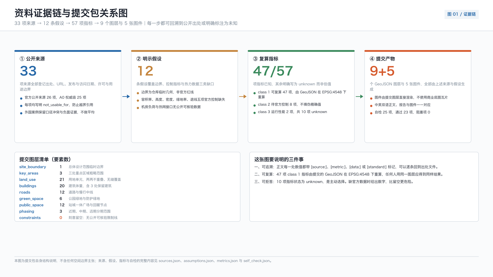
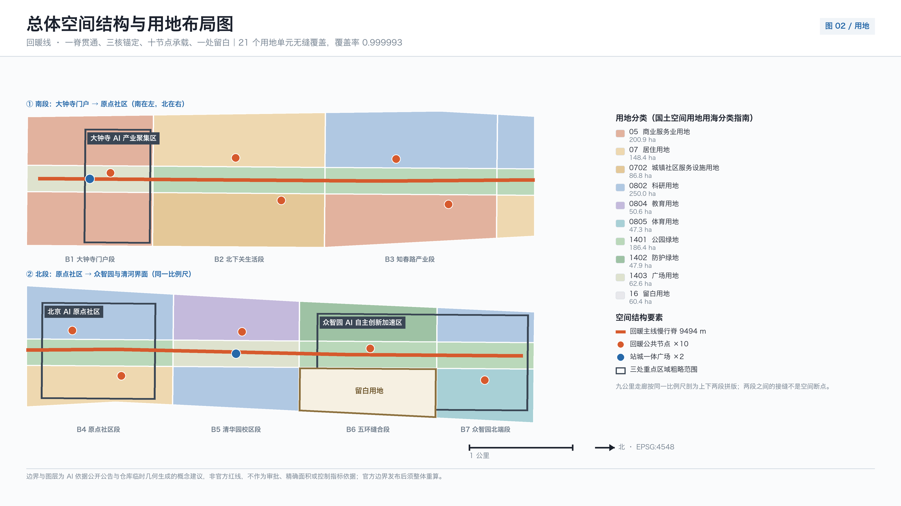
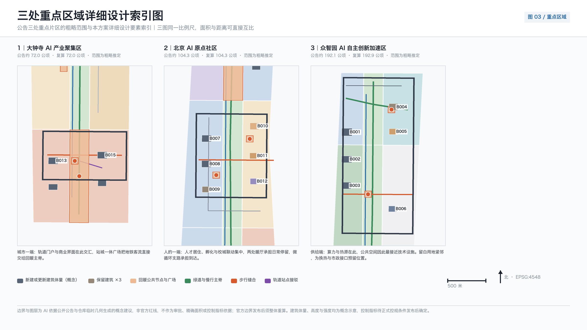
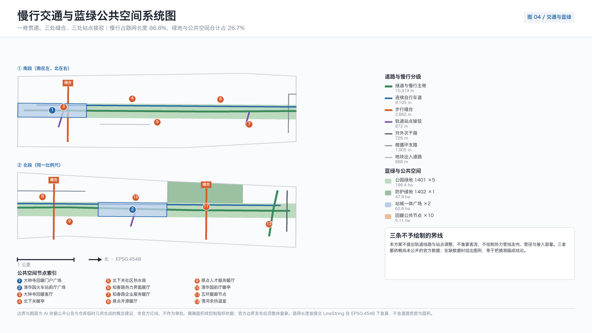
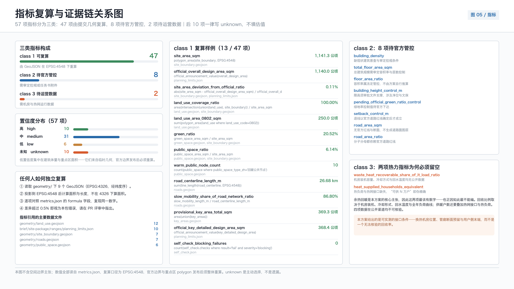

# 京张回暖线 THE WARM RETURN：把算力的热还给城市

## 设计依据与资料清单

本方案的第一依据是北京市规划和自然资源委员会海淀分局发布的资格预审公告，它确定了统筹研究、总体设计与重点区域三层范围、面积量级、设计任务与成果深度 [source:OFFICIAL-ANNOUNCEMENT]。面向全球智能体的开源征集任务书补充了场景卡数量、用户画像数量、命名与视觉识别、运营机制与边界条款等要求 [source:AGENT-TASKBOOK]。两份文件共同构成任务边界：前者是规划语境，后者是提交语境，缺一不可。本方案不把任何一句设计判断建立在两者之外的私下推断上。

方案的立意来自一条可以公开核验的历史线索，而不是修辞。京张铁路第一条支线——西直门至门头沟的京门支线——1906 年由京张铁路修建，是专为运煤而建的支线，京西煤炭由此快速大量输出 [source:BJ-JINGMEN-COAL-BRANCH]。需要立刻说明的是：核查未能找到可靠来源支持"京张铁路干线的修建动因是运煤进京"这一常见说法，官方叙述以自主修路、京张商贸与塞外交通为主。因此本方案只在支线这一确证范围内使用能源运输的起源叙事，并把它写进正文而不是藏在脚注里 [depth:existing_conditions_diagnosis]。

一百二十年后，同一条走廊运输的东西变了。走廊西端的张家口经国务院同意设立可再生能源示范区，张北云计算产业基地由北京市经信部门、河北省工信部门与张家口市政府共同谋划建设，目标是建成中国数坝 [source:ZJK-RENEWABLE-DEMO-ZONE] [source:ZHANGBEI-DATACENTER-BASE]。走廊东端的海淀，是把这些算力转化为模型、产品与服务的地方。绿电向东、算力向东、热量却大多消散在冷却塔里——这就是本方案要处理的城市设计问题。

空间基础必须诚实交代。官方红线与三处重点区精确 polygon 至今未在公开渠道发布可验证坐标系版本；本包使用仓库维护的临时粗略几何生成方案，并在正文、报告 HTML、来源清单与假设清单四处同步标注其临时性 [source:PROVISIONAL-BOUNDARIES]。提交边界复算面积与公告的 11.4 平方公里量级一致，偏差约千分之一，仅用于量级讨论 [metric:site_area_sqm]；三处重点区仅沿用原始矩形，未声明面积 [data:geometry/key_areas.geojson#PROV-KEY-001]。这些几何不是红线、不是审批依据、不是精确面积依据。

标准与深度依据分三层引用。城市设计的目的、公共空间与城市风貌统筹依据住房和城乡建设部的城市设计管理办法 [standard:MOHURD-URBAN-DESIGN-MEASURES]；控规深度的内容口径与规划许可边界依据控制性详细规划编制审批办法 [standard:MOHURD-CONTROL-DETAILED-PLANNING]；用地分类代码体系依据自然资源部的用地用海分类指南 [standard:MNR-LAND-USE-CLASSIFICATION-GUIDE]。容积率、建筑高度、建筑密度、绿地率与退线五项官方控制在场地包中均登记为缺失，本方案因此不填写这五项数值 [source:PLANNING-LIMITS]。

## 三层范围工作框架

三层范围不是三张比例不同的图，而是三种不同性质的问题。统筹研究范围 43.6 平方公里回答的是"这条走廊在国家 AI 版图中承担什么角色"；总体设计范围 11.4 平方公里回答的是"遗址公园两侧 1 至 2 公里的城市地区如何更新、如何承载"；重点区域 368.4 公顷回答的是"三个具体片区的地块、建筑、交通与公共空间怎么做"。三层面积量级均取自场地包的官方值登记，本方案不重新推算 [source:PLANNING-LIMITS] [depth:three_level_scope_framework]。

本方案给三层范围一个共同的组织母题：回暖线。它由一条能量链定义——张北的风光电向东，海淀的机柜把电变成算力，算力必然变成热，而这些热今天基本被排掉。国家层面已明确要求加强数据中心余热回收利用，鼓励企业自建热量回收系统用于园区供热、城市供暖与设施农业，并提出到 2030 年底北方采暖地区新建大型及以上数据中心余热利用率明显提升 [source:NDRC-DATACENTER-GREEN-ACTION]。北京市层面早在存量优化之前就明确鼓励数据中心采用余热回收利用措施为周边建筑提供热源 [source:BJ-DATACENTER-OPTIMIZATION]。政策方向是清楚的，缺的是空间。

回暖线要补的正是这个空间缺口。它把"回暖"落成三件可画、可算、可核的事：一条贯通南北的慢行主脊把九公里遗址公园串成连续步行体验 [data:geometry/roads.geojson#ROAD-001]；十处回暖公共节点让冬季的公共生活有可停留的地方 [metric:warm_public_node_count]；一块留白用地为未来的热力接口与新型基础设施预留位置，而不是现在就画一条无依据的管线 [data:geometry/land_use.geojson#LU-018]。

必须把话说到位：本方案不给出任何余热回收量、机房负荷、供暖户数或碳减排数值。核查确认，走廊范围内没有公开可核验的机房负荷数据，也没有公开的热网接口位置与容量。既有的可核验事实只到政策层面与区域层面——例如张北县数据中心项目 13 个、规划标准机柜 38.88 万架属于县域规划口径而非在运数据，不能用来推算海淀侧的任何热量 [source:ZHANGBEI-DATACENTER-BASE]。因此本方案把余热相关的全部数量写成待验证前置条件，相应指标状态为 unknown [metric:waste_heat_recoverable_share_of_it_load_ratio]。

| 层级 | 设计问题 | 回暖线的回答 | 数据落点 |
| --- | --- | --- | --- |
| 统筹研究范围 43.6 平方公里 | 走廊在 AI 版图中的角色 | 从"绿电—算力"单向链，补上"热—城市"的返回段 | [source:ZJK-RENEWABLE-DEMO-ZONE]、[source:PLANNING-LIMITS] |
| 总体设计范围 11.4 平方公里 | 城市更新与承载如何组织 | 一脊、十节点、三缝合、一处留白 | [metric:site_area_sqm]、[data:geometry/land_use.geojson#LU-001] |
| 重点区域 368.4 公顷 | 三片区如何达到详细设计深度 | 分别承担供给端、转化端与城市端 | [data:geometry/key_areas.geojson#PROV-KEY-002]、[metric:key_area_count] |

三层之间的传导关系是单向可追溯的：统筹研究得出的产业判断决定总体设计的功能配比与设施类型，总体设计的空间结构决定重点区域的边界条件，重点区域的详细设计反过来检验前两层是否可实施。任何一层出现无法从结构化数据复算的面积、比例或规模，都不得写入结论 [depth:overall_spatial_structure]。

## 统筹研究范围产业与未来城市研究

统筹研究范围的任务是构建世界级 AI 创新生态体系。海淀的资源结构已经足够清楚：高校院所密集、头部企业与独角兽集中、算力算法数据要素齐备、孵化与科技服务体系成熟。真正的稀缺项不是要素，而是要素之间的公共界面——开源社区没有固定的发布场所，初创团队没有低门槛的算力入口，企业展示与市民日常之间没有交集，而全球开发者来到这条走廊时没有一条可以走完的路线 [source:AGENT-TASKBOOK] [standard:PROJECT-AGENT-OPEN-CALL-TASKBOOK]。

回暖线把创新链组织为五段闭环：高校策源、开源协作、企业转化、公共体验、国际传播。它与常见的"创新走廊"叙事的区别在于，每一段都有对应的物理载体和可核验的空间指标，而不是箭头图。策源段落在清华园与五道口的教育科研用地 [data:geometry/land_use.geojson#LU-013]；协作段落在原点社区的开源发布与夜间协作空间 [data:geometry/public_space.geojson#PUBLIC-008]；转化段落在知春路的中试与工程验证空间；体验段落在十处回暖公共节点；传播段落在大钟寺的国际路演界面 [data:geometry/public_space.geojson#PUBLIC-003]。

命名与视觉识别系统同样从这条能量链推导，而不是外加一个口号。"回暖线"三个字同时指三件事：铁路把煤运进城取暖的历史、算力余热返回城市的技术命题、以及公共空间在冬季重新变得可用的日常体验。视觉识别以两个基本符号构成——代表返回的箭头与代表温度梯度的色阶；导视系统在公里标处标注该段落的公共功能与开放时段。所有标识、字体与图形均为本包原创，未使用任何企业标识、第三方字体文件或人物肖像 [depth:height_massing_character]。

未来城市形态研究要回答人工智能如何改变工作、生活、社交、学习、交通与公共服务。本方案的判断是：AI 对城市空间最直接的影响不是自动驾驶或无人配送这类交通形态变化，而是两件更基础的事——一是算力设施成为与水电燃气同级的城市基础设施，因而必须进入用地与市政统筹；二是公共服务的可获得性开始取决于界面设计而不是设施数量。这两条判断都落到本方案的空间动作上：留白用地对应第一条，回暖节点与人工兜底对应第二条 [depth:municipal_new_infrastructure]。

需要明确边界的是能耗与能效话语。国家层面对新建及改扩建大型和超大型数据中心的电能利用效率要求已降至 1.25 以内，国家枢纽节点不高于 1.2；北京市对存量数据中心以地方标准限定值 1.35 为红线，自 2026 年起对超限者征收差别电价 [source:NDRC-DATACENTER-GREEN-ACTION] [source:BJ-DATACENTER-OPTIMIZATION]。这些数值属于不同层级、不同对象，不可互换引用，本方案也不据此推断走廊内任何一处机房的实际能效。全球 AI 活动、开发者社区、开放场景与朝圣路线等运营建议，均为概念建议与参考方案，可供专业团队深化研究，不构成已确定的政府活动或实施安排。

## 总体设计范围城市更新与控规深度城市设计

总体设计范围要达到控制性详细规划的城市设计深度。本方案的空间结构可以用一句话概括：一脊贯通、三核锚定、十节点承载、一处留白。用地方案把提交边界完整划分为 21 个单元，两两不重叠、无缝覆盖，覆盖率达到千分之九百九十九以上，缺口仅 75.82 平方米且来自坐标取整 [metric:land_use_coverage_ratio] [data:geometry/land_use.geojson#LU-001]。用地代码体系严格采用国家分类标准，涵盖居住、公共管理与公共服务、商业服务业、交通、绿地与广场以及留白共十类 [standard:MNR-LAND-USE-CLASSIFICATION-GUIDE]。

这个结构的现实前提是京张高铁入地。清华园隧道全长 6.02 公里、开挖直径 12.64 米，为当时北京市内最大直径盾构隧道，2018 年 11 月 20 日贯通，京张高铁 2019 年 12 月 30 日开通运营 [source:NRA-QINGHUAYUAN-TUNNEL]。入地释放的地上空间成为遗址公园的用地基础：公园南起北京北站、北至北五环，全长约 9 公里，服务海淀 9 个街镇；一期位于清华东路至知春路、长约 2.4 至 2.5 公里、面积 16.8 公顷，2023 年 6 月全面建成开放；二期 2024 年 12 月开工、2026 年 8 月 6 日建成开放，全线总面积约 70 公顷 [source:BJ-HERITAGE-PARK-PLANNING] [source:BJ-HERITAGE-PARK-BUILD]。

也就是说，遗址公园本身已经建成，本方案不是提议建一个公园，而是提议把这条已经存在的九公里绿廊从"可看的线"变成"可用的带"。三个具体动作：其一，把绿廊的南北连续性从视觉连续升级为步行连续，主脊长度经复算为 26676.1 米的道路中心线中慢行长度占 23157.41 米，慢行占比达到 0.868 [metric:slow_mobility_share_of_road_network_ratio]。其二，在三处慢行断点做缝合，其中北五环跨环断点是最关键的一处 [metric:pedestrian_stitch_count] [data:geometry/roads.geojson#ROAD-003]。其三，在绿廊沿线布置十处可停留的回暖节点，让冬季四个月的公共生活有落点 [metric:warm_public_node_area_sqm]。

冬季这件事需要用可核验的口径说清楚。北京法定采暖期为当年 11 月 15 日至次年 3 月 15 日，市人民政府可根据气象等实际情况调整 [source:BJ-HEATING-MANAGEMENT-MEASURES]；北京地区冬季供暖室外计算温度为负 7.6 摄氏度，普通住宅卧室、起居室室内采暖计算温度不应低于 18 摄氏度 [source:BJ-INDOOR-TEMPERATURE-STANDARD]。九公里线性公共空间在这四个月里的实际使用强度会显著下降，这是本方案布置回暖节点的直接理由——不是为了展示技术，而是为了让公共空间在一年中最需要它的时候仍然可用。

建筑与强度部分必须交代清楚做了什么、没做什么。本方案生成了 20 个建筑基底作为概念示意，基底总面积经复算为 201535.051 平方米 [metric:building_footprint_area_sqm] [data:geometry/buildings.geojson#BLDG-001]。这 20 个对象不是现状普查结果，也不代表总建筑规模。容积率、总建筑规模、建筑密度、建筑高度控制与退线五项在官方控制条件发布前一律为 unknown，本方案不填写推测值 [depth:development_intensity_controls] [depth:land_use_layout]。这不是回避，而是因为在没有审定控规的情况下填入数值会让整份方案的可信度失效。

## 重点区域详细设计

三处重点区在回暖线中承担能量链的三个位置：众智园是供给端，北京 AI 原点社区是转化端，大钟寺是城市端。这个分工不是命名游戏，它决定了三处片区各自的功能配比、公共空间类型与实施依赖 [depth:three_key_area_detailed_design]。三处临时几何面积分别为 192.9 公顷、104.3 公顷与 72.0 公顷，合计与公告的 368.4 公顷偏差约千分之二 [metric:provisional_key_area_zhongzhiyuan_sqm] [data:geometry/key_areas.geojson#PROV-KEY-001]。

众智园 AI 自主创新加速区，作为供给端，围绕全栈自主创新、标准制定与安全治理组织空间。三个主要建筑对象是自主创新主楼、安全治理评测中心与创新交往综合体 [data:geometry/buildings.geojson#BLDG-002]。清河界面是这个片区最重要的公共资源：滨水绿道与余热温室联动，把技术设施的产出转成可进入的公共空间 [data:geometry/green_space.geojson#GREEN-005]。片区内保留一处既有厂房作为改造对象，用作换热站与展示空间——这是本方案唯一在建筑层面明确提出"保留改造"的对象之一，因为它同时满足工业遗存价值与技术功能需求。片区还布置体育健康用地，承担全天候运动与康复功能 [data:geometry/land_use.geojson#LU-021]。

北京 AI 原点社区，作为转化端，是三处片区中公共性要求最高的一处。它紧邻高校，任务是把成果转化、人才居住与开源协作组织在步行可达范围内。空间动作有四个：开源协作中心提供发布厅与夜间协作空间 [data:geometry/buildings.geojson#BLDG-008]；保留仓储改造为成果发布与展示场所；人才公寓组团作为余热供暖示范住区的候选位置 [data:geometry/land_use.geojson#LU-012]；东西向步行缝合把校区、园区与街区连起来 [data:geometry/roads.geojson#ROAD-004]。原点回暖园与两处暖厅构成片区的户外客厅 [data:geometry/public_space.geojson#PUBLIC-009]。

大钟寺 AI 产业聚集区，作为城市端，处理的是最复杂的界面问题。它同时面对轨道站点、城市干道交叉口与既有商业体。核心动作是路口四象限步行连通与站城一体广场 [data:geometry/roads.geojson#ROAD-005] [data:geometry/public_space.geojson#PUBLIC-001]。四象限连通是这个片区能否成立的关键——如果行人无法在路口四个方向之间安全穿行，任何关于国际交往与内容消费的功能设想都无从落地。片区内布置领军企业总部、智能终端综合体、商业服务楼与文化展示馆，并以回暖客厅作为全天候公共暖厅与国际路演前厅 [data:geometry/public_space.geojson#PUBLIC-003]。

三处片区的详细设计都受同一组条件限制，必须写明：临时几何的矩形形状不能作为片区红线；文保范围、控规控制线、道路红线、河道蓝线与市政管线均无可引用官方几何；清华园车站旧址已公布为北京市文物保护单位，其保护范围与建设控制地带的具体边界本方案无从获知，因此涉及车站周边的公共空间设计仅作为概念建议，任何实施动作须经文物主管部门另行审定 [source:BJ-QINGHUAYUAN-STATION-HERITAGE] [data:geometry/constraints.geojson#CONSTRAINTS]。

| 重点区 | 能量链位置 | 主导功能 | 关键空间动作 | 主要实施依赖 |
| --- | --- | --- | --- | --- |
| 众智园 AI 自主创新加速区 | 供给端 | 全栈自主创新、标准与安全治理 | 清河界面滨水绿道、余热温室、厂房改造换热站、体育健康用地 | 河道蓝线、生态与防洪条件、厂房权属 |
| 北京 AI 原点社区 | 转化端 | 成果转化、开源协作、人才居住 | 开源发布厅、仓储改造、示范住区、东西向步行缝合 | 校区边界、权属、热力接口条件 |
| 大钟寺 AI 产业聚集区 | 城市端 | 智能经济、内容消费、国际交往 | 四象限步行连通、站城一体广场、全天候回暖客厅 | 轨道站点、交叉口交通组织、地下管线 |

## AI 创新生态、人才画像与 AI+ 场景

本方案提出 6 类用户画像与 12 张 AI 场景卡 [metric:user_persona_count] [metric:ai_scenario_card_count]。每张场景卡都必须回答四个问题：服务谁、在哪里、用什么数据、出错时谁负责。缺少任何一项的场景不进入本方案 [source:AGENT-TASKBOOK]。

数据边界不是免责声明，而是设计约束。生成式人工智能服务管理暂行办法明确了适用范围、违法内容处置义务与投诉举报渠道及时处理要求；需要说明的是，该办法第 17 条的安全评估与备案要求仅针对具有舆论属性或社会动员能力的服务，本方案不据此推定任何服务已完成备案，也不从违法内容条款推出一般用户退出权 [source:GENERATIVE-AI-INTERIM-MEASURES]。本方案的全部场景遵循数据最小化：不采集个人轨迹、不输出个人画像、不将居民数据用于商业推荐。

人工兜底同样有明确依据与明确边界。无障碍环境建设法第 39 条要求在医疗、社会保障、金融、生活缴费等服务事项的公共服务场所保留现场指导与人工办理 [source:BARRIER-FREE-ENVIRONMENT-LAW]。本方案据此在涉及这四类服务事项的场景中保留人工通道，并且不把这一要求泛化到全部数字界面或全部公共空间。老年人运用智能技术困难实施方案提供了传统服务与智能化服务并行的政策背景，仅作背景参照，不用于推定本地落实情况或使用率 [source:ELDERLY-SMART-TECH-PLAN]。

| 用户画像 | 核心需求 | 空间响应 | 数据与责任边界 |
| --- | --- | --- | --- |
| 开源开发者 | 发布、协作、夜间工作、社区声誉 | 原点开源协作中心与暖厅、公里标导视 | 活动数据仅做聚合统计，不建个人贡献画像 |
| 初创团队 | 低成本空间、算力入口、试验场地 | 知春路中试验证厂、企业服务暖厅 | 算力与数据服务另行授权，不默认开放 |
| 头部企业与国际访客 | 展示、洽谈、媒体发布 | 大钟寺回暖客厅、门户广场、路演前厅 | 企业标识与案例须清权后使用 |
| 周边居民 | 通勤、休闲、社区服务、低扰动 | 北下关暖亭与社区服务带、慢行主脊 | 不将居民数据用于商业推荐或定价 |
| 高校师生 | 成果转化、跨校协作、日常步行 | 校城联动学堂、五道口共建实验楼 | 校园数据与科研成果须授权 |
| 供暖与设施运维人员 | 巡检、故障响应、冬季保障 | 换热站改造厂房、热力界面展厅 | 运维数据仅用于设施管理，不做人员绩效评价 |

十二张场景卡分为四组。第一组是慢行与交通：AI 慢行导航识别断点、拥挤与无障碍需求，服务于主脊与三处缝合 [data:geometry/roads.geojson#ROAD-001]；低速配送机器人在慢行主脊设定限定路权与避让规则，不进入暖亭内部；四象限过街辅助在大钟寺路口提供延长绿灯与语音提示。第二组是公共服务：社区健康服务导航、适老服务点与共享厨房，全部保留人工办理通道 [data:geometry/public_space.geojson#PUBLIC-005]。第三组是产业服务：企业服务副驾、开源发布协作、数据要素会客厅、算力入口咨询 [data:geometry/public_space.geojson#PUBLIC-007]。第四组是文化与安全：京张文化解说、公共空间安全运行复核，两者都以聚合数据与人工复核为前提。

四个产业测试验证场景对应可运营的物理载体 [metric:industry_test_scenario_count]：安全治理评测中心的模型评测与红队测试、知春路中试验证厂的工程验证、慢行主脊的低速配送路权试验、热力界面展厅的换热流程公开展示 [data:geometry/public_space.geojson#PUBLIC-006]。最后一项需要特别说明：热力界面展厅展示的是换热的物理流程与公开政策依据，不展示任何未经核验的回收数值。在没有机房负荷与热网数据之前，这个展厅的内容是"这件事怎么做"，而不是"这件事做到了多少"。

城市智能体可以辅助识别慢行断点、公共空间使用强度、设施维护需求与活动安全风险，但不能替代规划审批、不能输出未经授权的个人画像、不能声称获得官方实施承诺 [depth:blue_green_public_space]。

## 用地、建筑规模与拆改留方案

用地方案的技术前提是拓扑正确。提交边界被完整划分为 21 个用地单元，两两重叠面积为零，对边界的覆盖缺口 75.82 平方米、允许容差 1141.283 平方米，缺口来源是坐标取整而不是未标注空白 [metric:land_use_coverage_ratio] [data:geometry/land_use.geojson#LU-001]。这一点必须先说清楚：如果用地图层存在重叠或缝隙，后续所有面积、比例与强度讨论都不成立。用地代码严格采用国土空间调查规划用途分类，未自造代码 [standard:MNR-LAND-USE-CLASSIFICATION-GUIDE]。

十类用地的组织逻辑跟着回暖线走。绿地与广场用地沿遗址公园成带布置，构成主脊的空间基底 [data:geometry/land_use.geojson#LU-002]；公共管理与公共服务用地集中在原点社区与北下关一侧，靠近居住人口而不是靠近展示界面 [data:geometry/land_use.geojson#LU-012]；商业服务业用地集中在大钟寺城市端，与轨道站点耦合；工业与仓储类用地保留在众智园供给端，为中试、评测与换热等重资产功能留出条件；居住用地按既有格局延续，本方案不提出新增大规模居住开发。留白用地是本方案在用地层面最重要的一项主动设计 [data:geometry/land_use.geojson#LU-018]。

留白用地的作用需要解释清楚，否则容易被误读为"没想好"。回暖线依赖的热力接口、换热站、蓄热设施与算力配套市政设施，其位置与容量取决于三件本方案无法获知的事：机房实际负荷、热网可接入点与容量、以及权属与运维主体。政策方向是明确的，国家已要求加强数据中心余热回收利用并鼓励用于园区供热与城市供暖，北京市也明确鼓励为周边建筑提供热源 [source:NDRC-DATACENTER-GREEN-ACTION] [source:BJ-DATACENTER-OPTIMIZATION]。因此正确的做法是预留空间，而不是现在画一条无依据的管线。留白用地在官方控制条件与热力数据发布后可转为市政公用设施用地或其他必需用途 [depth:municipal_new_infrastructure]。

建筑规模部分必须把"做了什么"和"没做什么"分开写。本方案生成 20 个建筑基底作为概念示意，基底总面积经 EPSG:4548 复算为 201535.051 平方米 [metric:building_footprint_area_sqm] [data:geometry/buildings.geojson#BLDG-001]。这 20 个对象既不是现状建筑普查结果，也不代表规划总建筑规模。容积率、总建筑规模、建筑密度、建筑高度控制与退线五项官方控制在场地包中登记为缺失，本方案一律不填写推测值 [source:PLANNING-LIMITS] [depth:development_intensity_controls]。在没有审定控规的情况下填入这五项数值，会让整份方案的可信度失效——这是取舍，不是回避。

拆改留策略只提出可核验的对象，且以"留"为主。本方案在建筑层面明确提出保留改造的对象有两处：清河界面的既有厂房改造为换热站与热力展示空间 [data:geometry/buildings.geojson#BLDG-004]，原点社区的既有仓储改造为成果发布与展示场所 [data:geometry/buildings.geojson#BLDG-009]。选择这两处的理由一致：它们同时具备工业遗存价值与技术功能适配性，改造后承担的正是回暖线需要的重设备与大空间功能。清华园车站旧址已公布为北京市文物保护单位，但其保护范围与建设控制地带的具体边界本方案无从获知，因此车站周边的任何空间动作仅为概念建议，实施须经文物主管部门另行审定 [source:BJ-QINGHUAYUAN-STATION-HERITAGE]。

| 类别 | 本方案做法 | 依据与边界 |
| --- | --- | --- |
| 留 | 遗址公园既有绿廊、清华园车站旧址、两处既有厂房与仓储 | 文保范围未知，车站周边仅概念建议 [source:BJ-QINGHUAYUAN-STATION-HERITAGE] |
| 改 | 厂房改换热站与展厅、仓储改开源发布场所 | 权属与结构条件待核 [data:geometry/buildings.geojson#BLDG-004] |
| 拆 | 本方案不提出任何具体拆除对象 | 无现状普查与权属数据，不做拆除判断 [source:PLANNING-LIMITS] |
| 留白 | 一处留白用地预留热力接口与新型基础设施 | 待机房负荷与热网数据发布后确定用途 [data:geometry/land_use.geojson#LU-018] |

需要明确的是，本方案不提出任何具体的拆除对象。原因是缺少现状建筑普查、结构安全评估与权属信息，任何拆除判断都会越过可核验范围。全部用地与建筑建议为概念建议与参考方案，可供专业团队在取得官方控制条件后深化研究 [depth:land_use_layout]。

## 交通、轨道、市政与公共服务设施

交通部分的起点是一个已经发生的事实：京张高铁清华园隧道全长 6.02 公里、开挖直径 12.64 米，2018 年 11 月 20 日贯通，京张高铁 2019 年 12 月 30 日开通运营，原地面铁路走廊由此腾退 [source:NRA-QINGHUAYUAN-TUNNEL]。腾退出来的是一条南北向、宽度有限但长度可观的连续空间。本方案的交通策略因此不是新增机动车通行能力，而是把这条线性空间变成城市尺度的慢行骨架 [depth:traffic_rail_slow_parking]。

慢行系统由一脊、三缝合、三接驳构成。主脊即回暖主线慢行脊，沿遗址公园贯通南北 [data:geometry/roads.geojson#ROAD-001]；西侧设连续自行车道，与步行道分流以避免混行冲突 [data:geometry/roads.geojson#ROAD-002]。道路中心线总长经复算为 26676.1 米，其中慢行长度 23157.41 米，慢行占比 0.868 [metric:slow_mobility_share_of_road_network_ratio]。三处缝合针对三个真实的断点：北五环跨环步行缝合解决南北向被环路切断的问题 [data:geometry/roads.geojson#ROAD-003]；原点社区东西步行缝合把校区、园区与街区连起来 [data:geometry/roads.geojson#ROAD-004]；大钟寺路口四象限步行连通解决城市干道交叉口的过街问题 [data:geometry/roads.geojson#ROAD-005]。三处站点接驳把轨道出站客流引导至主脊 [data:geometry/roads.geojson#ROAD-006]。

轨道部分需要明确边界。本方案未获得可引用的轨道线路几何、站点出入口坐标与客流数据，因此不提出线路调整、站点新增或出入口改造方案，也不推算换乘量与步行接驳时间。轨道相关内容仅限于"在站点附近组织慢行接驳与站前公共空间"这一空间层面的概念建议，具体实施须以轨道主管部门与运营单位的资料为准 [source:PLANNING-LIMITS] [depth:traffic_rail_slow_parking]。道路等级仅使用允许编辑的层级，快速路与主干路走向未作改动。

市政设施部分是回暖线技术含量最集中、同时数据最缺的一段。国家层面已明确加强数据中心余热回收利用，鼓励企业自建热量回收系统用于园区供热、城市供暖与设施农业，并提出到 2030 年底北方采暖地区新建大型及以上数据中心余热利用率明显提升 [source:NDRC-DATACENTER-GREEN-ACTION]；北京市也明确鼓励数据中心采用余热回收利用措施为周边建筑提供热源 [source:BJ-DATACENTER-OPTIMIZATION]。本方案的市政动作因此只有两项：一是设置留白用地为热力接口、换热站与蓄热设施预留位置 [data:geometry/land_use.geojson#LU-018]；二是在热力界面展厅公开展示换热的物理流程与政策依据 [data:geometry/public_space.geojson#PUBLIC-006]。管线走向、管径、接入点与容量在缺少官方热网数据与机房负荷数据的前提下一律不予绘制 [depth:municipal_new_infrastructure]。

| 系统 | 本方案给出的内容 | 明确不给出的内容 |
| --- | --- | --- |
| 慢行 | 主脊、自行车道、三处缝合、三处站点接驳 | 不做交通量预测与信号配时设计 [metric:pedestrian_stitch_count] |
| 轨道 | 站前公共空间与接驳组织的概念建议 | 不提线路调整、出入口改造与客流推算 [source:PLANNING-LIMITS] |
| 热力 | 留白用地预留接口、展厅公开流程 | 不给管线、管径、容量与回收量 [data:geometry/land_use.geojson#LU-018] |
| 公共服务 | 暖亭、社区服务带、人工办理通道 | 不给设施规模指标与服务半径达标结论 [source:BARRIER-FREE-ENVIRONMENT-LAW] |

公共服务设施部分与冬季直接相关。北京法定采暖期为当年 11 月 15 日至次年 3 月 15 日，可根据气象等实际情况调整 [source:BJ-HEATING-MANAGEMENT-MEASURES]；冬季供暖室外计算温度为负 7.6 摄氏度，普通住宅卧室与起居室室内采暖计算温度不应低于 18 摄氏度 [source:BJ-INDOOR-TEMPERATURE-STANDARD]。这意味着九公里线性公共空间在一年中有四个月处于低使用强度状态。本方案的回应是在沿线布置暖亭、暖厅与社区热水房等可停留节点 [data:geometry/public_space.geojson#PUBLIC-004]，并在涉及医疗、社会保障、金融与生活缴费事项的服务点保留现场指导与人工办理通道 [source:BARRIER-FREE-ENVIRONMENT-LAW]。设施规模、服务半径与达标率不作结论，因为缺少人口分布与既有设施普查数据。

## 蓝绿空间、公共空间与城市风貌

蓝绿空间的骨架不需要本方案发明，它已经建成。遗址公园南起北京北站、北至北五环，全长约 9 公里，服务海淀 9 个街镇；一期位于清华东路至知春路、长约 2.4 至 2.5 公里、面积 16.8 公顷，2023 年 6 月全面建成开放；二期 2024 年 12 月开工、2026 年 8 月 6 日建成开放，全线总面积约 70 公顷 [source:BJ-HERITAGE-PARK-PLANNING] [source:BJ-HERITAGE-PARK-BUILD]。本方案的绿地图层在此基础上组织六处绿地单元，绿地总面积与绿地率由提交几何在 EPSG:4548 下复算写入 [metric:green_space_area_sqm] [data:geometry/green_space.geojson#GREEN-001]。需要说明的是，复算绿地率与审定控规的绿地率控制指标是两件事，后者在官方控制条件发布前为 unknown [source:PLANNING-LIMITS]。

蓝色空间只有一处可操作对象：清河界面。众智园片区的清河沿线设滨水绿道，与余热温室联动，把技术设施的产出转成可进入的公共空间 [data:geometry/roads.geojson#ROAD-011] [data:geometry/green_space.geojson#GREEN-005]。这里必须写明限制条件：河道蓝线、防洪标准、生态保护要求与岸线权属均无可引用官方几何，本方案的滨水动作因此全部止于概念建议，任何贴河设计须以水务与生态主管部门资料为准 [data:geometry/constraints.geojson#CONSTRAINTS]。本方案不提出河道改线、驳岸改造或水位调节内容。

公共空间系统由十二处节点构成，其中十处为回暖公共节点 [metric:warm_public_node_count] [metric:warm_public_node_area_sqm]。它们分三类。第一类是门户型，处理城市端的到达与展示，包括大钟寺回暖门户广场与站城一体广场 [data:geometry/public_space.geojson#PUBLIC-001]；第二类是社区型，服务日常与冬季生活，包括北下关暖亭、社区热水房与原点人才服务暖厅 [data:geometry/public_space.geojson#PUBLIC-004]；第三类是技术型，把基础设施变成可看可学的公共内容，包括热力界面展厅与清河余热温室 [data:geometry/public_space.geojson#PUBLIC-012]。公共空间总面积与占比同样由复算写入 [metric:public_space_ratio]。

回暖节点的设计要点是"低门槛的暖"。它不依赖复杂设备，也不预设余热已经接入：每处节点先满足遮蔽、挡风、座椅、照明与热水这五项基本条件，使其在余热接口落地之前就能独立使用；余热接入后再作为热源升级项，而不是前置条件。这个先后顺序是本方案在实施逻辑上最关键的一个判断——把公共空间的可用性与不确定的技术接入解耦，避免整条回暖线因为一项数据缺失而无法起步 [depth:blue_green_public_space]。

城市风貌部分从能量链推导，不外加口号。风貌控制的三条原则是：其一，遗址公园两侧的界面以连续、可穿越、低围墙为准，避免把绿廊做成被围合的孤岛；其二，历史线索以铺装、公里标、轨道遗存与解说系统表达，不做仿古建筑；其三，技术设施不隐藏——换热站、温室与展厅作为可见的公共内容出现，而不是藏进地下或围墙后面 [depth:height_massing_character]。视觉识别系统以两个基本符号构成：代表返回的箭头与代表温度梯度的色阶；导视在公里标处标注该段落的公共功能与开放时段。全部标识、字体与图形均为本包原创，未使用任何企业标识、第三方字体文件或人物肖像。

| 系统 | 复算依据 | 本方案的空间动作 | 不作结论的部分 |
| --- | --- | --- | --- |
| 绿地 | 六处绿地单元复算面积与绿地率 | 沿遗址公园成带、五环沿线防护 | 审定控规绿地率指标 [metric:green_ratio] |
| 蓝线 | 无可引用官方几何 | 清河滨水绿道与余热温室联动 | 蓝线位置、防洪标准、岸线权属 [data:geometry/constraints.geojson#CONSTRAINTS] |
| 公共空间 | 十二处节点复算面积与占比 | 门户型、社区型、技术型三类 | 使用强度与人流预测 [metric:public_space_area_sqm] |
| 风貌 | 无量化控制条件 | 连续界面、历史线索、技术可见 | 建筑高度与体量控制数值 [source:PLANNING-LIMITS] |

建筑高度、体量与天际线的量化控制在官方条件发布前不予填写，风貌部分因此以原则与意象表达为主，可供专业团队在取得控制条件后深化研究 [depth:height_massing_character]。

## 更新项目清单、实施政策与分期计划

更新项目清单共 12 项，全部落在提交几何的具体要素上，可逐项核对位置与范围 [metric:renewal_project_count]。清单的组织原则是"先做不依赖余热的部分"：慢行主脊贯通、三处缝合、暖亭与暖厅的基本条件、公园沿线导视系统，这些项目在热力接口落地之前就能独立成立并产生公共价值。依赖热力接入的项目——换热站改造、余热温室、示范住区供暖——单独成组，作为条件成熟后的升级项 [depth:renewal_project_list]。

分期计划分三期，与提交的分期图层一致，三期合计面积 11412844.268 平方米，与边界面积差 18.882 平方米，来自分段裁切取整 [metric:phasing_area_sqm] [data:geometry/phasing.geojson#PHASE-001]。近期以原点社区与清华园前厅为试点，面积 3171437.576 平方米 [metric:phase_1_area_sqm]；中期推进众智园与五环缝合，面积 2436748.65 平方米 [metric:phase_2_area_sqm]；远期完成大钟寺门户与南段，面积 5804658.041 平方米 [metric:phase_3_area_sqm]。分期边界为概念性分段，不构成实施时序承诺。

实施政策部分参照已建成的域外机制，而不是自创制度。斯德哥尔摩的开放供热市场把数据中心余热做成公开挂牌交易，按容量费加电量费计价、价格随室外温度分档，官方口径为每 1 兆瓦供热能力约 200 万瑞典克朗每年的收入；同一份欧盟案例页也记录了负面因素——瑞典取消数据中心用电税收优惠后入驻动力下降，且双方初始投资都很高 [source:STOCKHOLM-OPEN-DISTRICT-HEATING]。赫尔辛基的做法是热力公司出资建设热泵与接入设施、数据中心提供余热，并配合较低档电力税作为激励 [source:HELSINKI-TELIA-HELEN-HEAT]。欧登塞的做法更简单：数据中心免费提供余热，热泵资产与投资全部在热力公司侧 [source:ODENSE-META-FJERNVARME-FYN]。三种机制的共同点是把投资责任与收益归属写清楚，这正是本方案建议在实施阶段优先明确的事。

监管路径也有可参照的先例。德国能源效率法把数据中心余热回用写入国家法律：2026 年 7 月 1 日及以后投运的数据中心须满足电能利用效率不高于 1.2，且余热回用份额不低于 10%，2027 年起不低于 15%、2028 年起不低于 20%；若已与热网运营方签订供热协议，或已按成本价报价而热网方六个月内未接受，则免于余热份额义务 [source:DE-ENERGY-EFFICIENCY-ACT-DATACENTER]。这条豁免条款尤其值得注意——它把责任对称地分配给了数据中心与热网两侧，避免单方面加压。本方案不推定中国现行法规已有同类义务，仅将其作为域外参照。

国内的实践状态需要如实描述：技术已通，规模待放大。可核查的三例分别是北京亦庄的首个余热外供数据中心（水源热泵、外侧供热 45 至 55 摄氏度、约 12000 平方米）、张北小微企业创新园（供暖建筑 53000 平方米）、怀来云数据中心（2024 年 11 月起向居民小区供暖、约 40000 平方米、45 摄氏度直供）[source:CN-DATACENTER-WASTE-HEAT-CASES]。三例的规模都在数万平方米量级，尚无接入大型市政热网的百万平方米级案例。这说明回暖线在中国语境下不是无先例的构想，但也绝不能按已成熟工程来承诺规模。

| 分期 | 主要项目 | 是否依赖热力接入 | 数据落点 |
| --- | --- | --- | --- |
| 近期 | 原点社区试点、清华园前厅、开源发布场所改造、暖厅基本条件 | 否 | [data:geometry/phasing.geojson#PHASE-001] |
| 中期 | 众智园供给端建设、五环跨环缝合、清河滨水绿道 | 部分 | [data:geometry/phasing.geojson#PHASE-002] |
| 远期 | 大钟寺门户、四象限连通、站城一体广场、南段贯通 | 否 | [data:geometry/phasing.geojson#PHASE-003] |
| 条件成熟后 | 换热站改造、余热温室、示范住区供暖 | 是 | [data:geometry/land_use.geojson#LU-018] |

全部实施政策建议为概念建议与参考方案，不构成已确定的政府政策、财政安排或实施承诺；具体机制须由主管部门、热力企业与数据中心运营方另行商定 [depth:phasing_implementation]。

## 指标体系、面积复算与合规矩阵

指标体系共 57 项，按性质分三类。第一类是可由提交几何直接复算的空间指标，共 47 项，全部由 GeoJSON 在 EPSG:4548 投影下复算得到，不从正文文字抄录 [metric:site_area_sqm] [metric:land_use_feature_count]。第二类是需官方控规或任务书附件支撑的管控指标，共 8 项，状态一律为 unknown，包括容积率、总建筑规模、建筑密度、建筑高度控制、退线、审定绿地率与道路用地面积及占比 [metric:floor_area_ratio] [metric:setback_control_m]。第三类是需运营或产业数据持续校准的绩效指标，共 2 项，即余热可回收占比与等效供暖户数，同样为 unknown [metric:waste_heat_recoverable_share_of_it_load_ratio] [metric:heat_supplied_households_equivalent]。三类划分的意义在于：读者可以立刻分辨哪一项是本方案能负责的、哪一项必须等官方数据、哪一项必须等运营验证。

面积复算的口径必须交代。交换坐标系为 EPSG:4326，面积与长度计算坐标系为 EPSG:4548 [standard:MOHURD-CONTROL-DETAILED-PLANNING]。提交边界复算面积 11412825.386 平方米，与公告 11.4 平方公里量级偏差 0.001125，仅用于量级讨论而非红线依据 [metric:site_area_deviation_from_official_ratio] [source:PROVISIONAL-BOUNDARIES]。三处重点区临时几何合计 3692893.005 平方米，与公告 368.4 公顷偏差约千分之二 [metric:provisional_key_area_total_sqm]。绿地面积 2342327.771 平方米、绿地率 0.205236；公共空间面积 701201.672 平方米、占比 0.06144；两者合计占比 0.266676 [metric:green_and_public_space_ratio]。建筑基底 201535.051 平方米、基底率 0.017659，其中既有保留对象 3 处 [metric:building_footprint_ratio] [metric:retained_building_feature_count]。

| 指标类别 | 数量 | 代表指标 | 可信度依据 |
| --- | --- | --- | --- |
| 可复算空间指标 | 47 项 | 用地覆盖率 0.999993、慢行占比 0.868 | EPSG:4548 复算，脚本可复现 [metric:land_use_coverage_ratio] |
| 待官方控制指标 | 8 项 | 容积率、建筑高度、退线、道路用地 | 场地包登记为缺失，不填推测值 [source:PLANNING-LIMITS] |
| 待运营校准指标 | 2 项 | 余热可回收占比、等效供暖户数 | 无公开机房负荷与热网数据 [metric:heat_supplied_households_equivalent] |
| 自检阻断项 | 0 项 | 无 blocking 级失败 | 自检记录逐项可查 [metric:self_check_blocking_failures] |

合规矩阵由三份文件承担，互相不重复。合规矩阵登记 23 项任务要求，逐项给出对应正文章节、GeoJSON 图层、指标、图纸、展示章节、来源、假设与自检条目；标准矩阵登记 6 项标准依据与其覆盖状态；设计深度矩阵登记 15 项设计深度条目及完成状态 [standard:MOHURD-URBAN-DESIGN-MEASURES]。所有矩阵中引用的来源、假设与自检编号均已通过程序化校验，确认可在 sources.json、assumptions.json 与 self_check.json 中解析到实体，无悬挂编号。

关于余热相关指标为何保持 unknown，需要给出正面理由而非仅仅承认缺数据。域外已建成案例的取热温度普遍在 20 至 30 摄氏度区间，须经热泵提温才能入网：欧登塞为 27 摄氏度提至 70 摄氏度、斯德哥尔摩入网仅约 20 摄氏度 [source:ODENSE-META-FJERNVARME-FYN] [source:STOCKHOLM-OPEN-DISTRICT-HEATING]。回收比例高度依赖冷却方式——风冷机架约 25 至 30 千瓦、余热品位低且回收潜力有限，液冷侧出液温度显著更高 [source:CIBSE-LIQUID-COOLING-MODULE]。也就是说，在不知道本走廊机房采用何种冷却方式、负荷多少、热网接入点在哪里的前提下，任何回收量数值都只是把域外参数搬过来，属于伪精确。本方案选择不做这件事 [depth:metrics_recalculation]。

官方边界与三处重点区精确 polygon 发布后，本包承诺整体重跑几何生成、指标复算、图纸与展示页面生成，并重跑全部校验脚本；在此之前所有空间指标均为可讨论、可替换、可重算的概念性结果 [source:SUBMITTED-GEOMETRY]。

## 风险、版权与合规说明

第一类风险是空间数据风险，也是本方案最大的风险。官方红线与三处重点区精确 polygon 至今未在公开渠道发布可验证坐标系版本，本包使用仓库维护的临时粗略几何，并在正文、报告 HTML、来源清单与假设清单四处同步标注其临时性 [source:PROVISIONAL-BOUNDARIES]。这些几何不是红线、不是审批依据、不是精确面积依据。文保范围、控规控制线、道路红线、河道蓝线与市政管线均无可引用官方几何，约束图层因此刻意保持为空要素集合，而不是绘制推测控制线 [data:geometry/constraints.geojson#CONSTRAINTS]。这个缺口限制了所有临界设计动作的深化程度，本方案不掩盖这一点。

第二类风险是数据可得性风险。走廊范围内没有公开可核验的机房负荷数据，也没有公开的热网接口位置与容量，因此本方案不给出任何余热回收量、供暖户数或碳减排数值 [metric:waste_heat_recoverable_share_of_it_load_ratio]。域外案例可以证明机制可行，但不能替代本地数据——即使斯德哥尔摩、赫尔辛基与欧登塞都有完整的公开参数，它们也只能作为方法参照 [source:HELSINKI-TELIA-HELEN-HEAT]。同时必须记录反向证据：瑞典取消数据中心用电税收优惠后入驻动力下降，说明余热回收的商业可行性对政策环境高度敏感，不是纯技术问题 [source:STOCKHOLM-OPEN-DISTRICT-HEATING]。

第三类风险是运行与治理风险。域外案例中有项目因外部制裁失去电力合同而转为柴油发电、向热网供热量极少或中断，这提示单一热源依赖存在系统性脆弱。本方案的应对是设计层面的解耦：回暖节点先满足遮蔽、挡风、座椅、照明与热水五项基本条件而独立可用，余热接入仅作为热源升级项 [metric:warm_public_node_count]。这样即使热力接入长期无法落地，公共空间部分依然成立。

| 风险类别 | 具体内容 | 本方案的处理方式 |
| --- | --- | --- |
| 空间数据 | 无官方红线、无控制线几何 | 标注临时性、约束图层留空、不填五项控制指标 [source:PLANNING-LIMITS] |
| 数据可得 | 无机房负荷与热网数据 | 相关指标状态为 unknown，不给数值结论 [metric:heat_supplied_households_equivalent] |
| 运行治理 | 单一热源依赖、政策敏感 | 公共空间与热力接入解耦，分期清单区分依赖关系 [data:geometry/phasing.geojson#PHASE-001] |
| 合规 | AI 服务与个人数据边界 | 数据最小化、保留人工办理通道 [source:GENERATIVE-AI-INTERIM-MEASURES] |

版权与权利清理方面，本包的全部文本、图层、图件、展示页面与校验脚本调用均由本 agent 在本次会话内原创生成。未引入第三方地图瓦片、商业底图、企业标识、第三方字体文件或人物肖像；官方文本按引用方式使用并标注发布方、URL 与日期。图纸与图件中出现的所有标识与图形为本包原创。若评审方发现任何权利瑕疵，本包承诺按要求替换或撤除相应内容。

合规声明有四条，逐条对应可核验的事实。其一，本方案未声称获得政府批准、审定控规、最终权属或任何实施承诺，全部空间建议表述为概念建议、参考方案、可供专业团队深化研究。其二，提交遵循双语要求：中文为主文件，proposal.en.md 提供完整英文对照，报告 HTML、电子展示、A3 文册、A0 展板与含文字图件均提供英文副本，并在 manifest 中声明语言与对照关系。其三，电子展示页面完全离线，无远程脚本、远程瓦片、远程字体、iframe、表单与外部接口调用，不跟踪评审者行为。其四，全部 AI 场景遵循数据最小化，不采集个人轨迹、不输出个人画像、不将居民数据用于商业推荐，涉及医疗、社会保障、金融与生活缴费事项的场景保留现场指导与人工办理通道 [source:BARRIER-FREE-ENVIRONMENT-LAW]。

自检记录共 25 项，其中 blocking 级失败为 0 项 [metric:self_check_blocking_failures]。这里先把 formal-review-ready 的门槛写清楚：门槛是 submission_stage 为 formal，参赛者可控的四项复核（确定性校验、空间复核、视觉打包、专业证据链）均无 error，且不存在 result 为 fail 且 severity 为 blocking 的自检项；unknown 不等于 fail，unknown 表示结论所依赖的外部条件尚未公布因而无法核验，fail 表示已核验且不合格。按这一门槛，本包的状态是 formal-review-ready，同时仍有两项自检结论为 unknown 而非 pass：约束几何数据缺口，以及官方数据发布后的整体重算承诺——后者只有在取得官方 polygon 并完成重算后才能转为 pass [depth:risk_missing_data]。本方案认为把这两项写成 unknown 比写成 pass 更有价值，因为它们标出了这份提交真正的边界所在，因此不会为了呈现"全项 pass"而改写结论。

与此对应，包级数据置信度按下限口径申报：manifest 的 validation_claim.data_confidence 为 medium，而不是 high，因为 57 项指标中 31 项为 medium、6 项为 low、10 项为 unknown，且 site_area_sqm、green_ratio、public_space_ratio 等 8 项 known 指标明示依赖临时粗略边界这一假设 [metric:site_area_sqm]。字段级置信度仍以 metrics.json 每项的 confidence 为准，其中 10 项 high 均为不依赖临时边界的计数与公告口径值。validation_claim.self_checked 为 true，对应上述四项复核已实际运行并全部通过，而不是一句未经运行的声明。

## 参考资料

本节按性质分组列出全部引用资料。完整记录（发布方、URL、发布日期、访问日期、许可摘要、用途与用途禁区）保存在 sources.json，共 33 条 [source:SOURCE-REGISTRY]。凡未在该清单中出现的事实，一律不写入本方案结论。

任务与范围依据：资格预审公告确定三层范围、面积量级、设计任务与成果深度 [source:OFFICIAL-ANNOUNCEMENT]；面向全球智能体的开源征集任务书补充场景卡、用户画像、命名与视觉识别、运营机制与边界条款要求 [source:AGENT-TASKBOOK]；场地包提供枚举、范围与允许设计空间 [source:SITE-PACKAGE]；临时边界几何与其临时性声明 [source:PROVISIONAL-BOUNDARIES]；官方控制条件缺失登记 [source:PLANNING-LIMITS]。

标准与规范依据：城市设计管理办法界定城市设计的目的与公共空间统筹要求 [standard:MOHURD-URBAN-DESIGN-MEASURES]；控制性详细规划编制审批办法界定控规深度的内容口径与规划许可边界 [standard:MOHURD-CONTROL-DETAILED-PLANNING]；用地用海分类指南界定用地分类代码体系 [standard:MNR-LAND-USE-CLASSIFICATION-GUIDE]；建筑工程设计文件编制深度规定作为设计深度参照 [standard:MOHURD-ARCH-DESIGN-DEPTH-2016]。

历史与本地事实依据：京门支线为运煤而建的史实 [source:BJ-JINGMEN-COAL-BRANCH]；清华园隧道与京张高铁开通事实 [source:NRA-QINGHUAYUAN-TUNNEL]；遗址公园的规划范围与建设时序 [source:BJ-HERITAGE-PARK-PLANNING] [source:BJ-HERITAGE-PARK-BUILD]；清华园车站旧址的文物保护单位身份 [source:BJ-QINGHUAYUAN-STATION-HERITAGE]。需要重申：核查未能找到可靠来源支持"京张铁路干线的修建动因是运煤进京"这一常见说法，本方案只在支线这一确证范围内使用能源运输的起源叙事。

能源与算力依据：张家口可再生能源示范区的设立 [source:ZJK-RENEWABLE-DEMO-ZONE]；张北柔性直流电网工程 [source:ZHANGBEI-HVDC-GRID]；张北云计算产业基地的规划口径 [source:ZHANGBEI-DATACENTER-BASE]；数据中心绿色低碳发展专项行动计划关于余热回收利用的要求 [source:NDRC-DATACENTER-GREEN-ACTION]；北京市存量数据中心优化工作方案与鼓励余热供热的表述 [source:BJ-DATACENTER-OPTIMIZATION]；IEA《Energy and AI》报告的全球用电量级 [source:IEA-ENERGY-AND-AI-2025]；液冷与风冷的余热品位差异及 ASHRAE 水温等级转述 [source:CIBSE-LIQUID-COOLING-MODULE]。

采暖与温度依据：北京市供热采暖管理办法确定法定采暖期 [source:BJ-HEATING-MANAGEMENT-MEASURES]；住宅设计规范确定室内采暖计算温度与冬季室外计算温度 [source:BJ-INDOOR-TEMPERATURE-STANDARD]。两者不可互换归属——18 摄氏度这一数值出自住宅设计规范，不属于供热采暖管理办法。

域外与国内余热案例依据：斯德哥尔摩开放供热市场的市场化机制与其负面证据 [source:STOCKHOLM-OPEN-DISTRICT-HEATING]；赫尔辛基热力公司出资加电力税激励的机制 [source:HELSINKI-TELIA-HELEN-HEAT]；欧登塞 27 摄氏度提至 70 摄氏度的完整技术参数与免费供热安排 [source:ODENSE-META-FJERNVARME-FYN]；德国能源效率法的余热回用阶梯义务与豁免条款 [source:DE-ENERGY-EFFICIENCY-ACT-DATACENTER]；国内三个已投运项目的规模与温度参数 [source:CN-DATACENTER-WASTE-HEAT-CASES]。

法规与公共服务依据：生成式人工智能服务管理暂行办法界定适用范围与违法内容处置义务 [source:GENERATIVE-AI-INTERIM-MEASURES]；无障碍环境建设法第 39 条界定人工办理通道的适用事项 [source:BARRIER-FREE-ENVIRONMENT-LAW]；老年人运用智能技术困难实施方案作为政策背景参照 [source:ELDERLY-SMART-TECH-PLAN]。

结构化数据与复算依据：提交的八个 GeoJSON 图层为全部空间指标的唯一复算来源 [source:SUBMITTED-GEOMETRY] [data:geometry/site_boundary.geojson#SITE-001]；仓库加工事实包作为二次核对参照 [source:PROCESSED-FACT-PACK]。指标的复算口径、公式与状态记录在 metrics.json，假设与其影响记录在 assumptions.json，自检结论记录在 self_check.json，任务覆盖、标准覆盖与设计深度覆盖分别记录在三份矩阵文件中 [metric:official_geometry_data_gap_count]。
