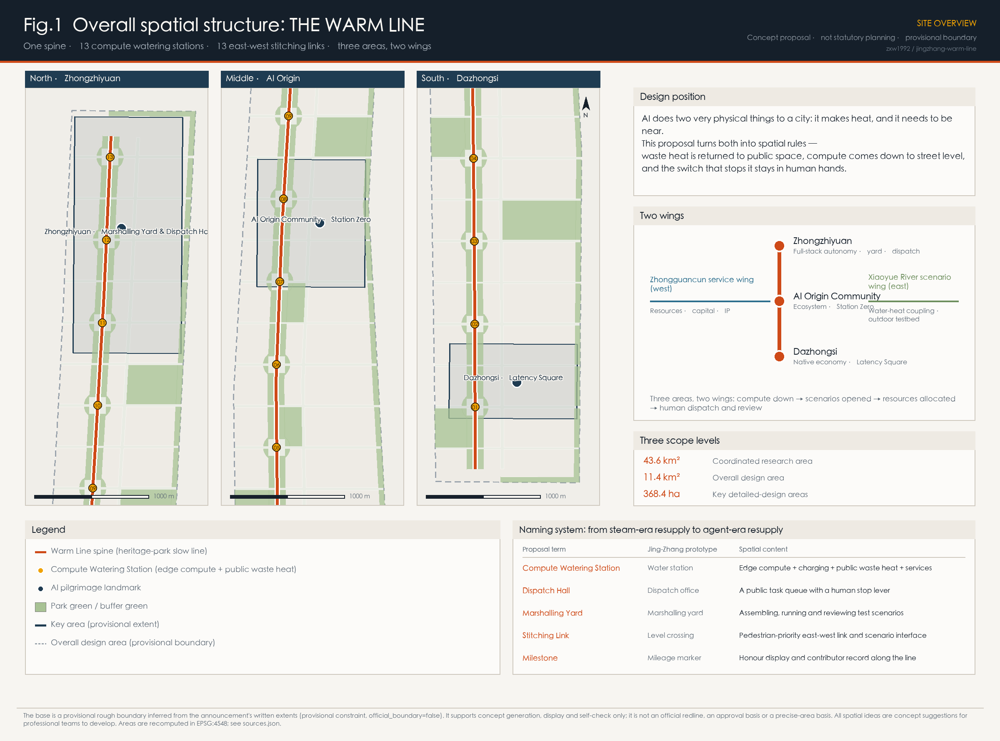
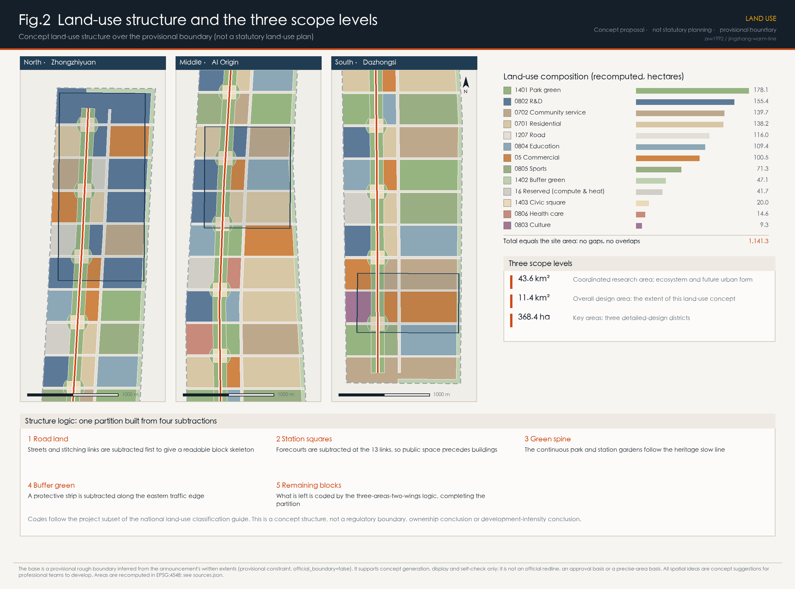
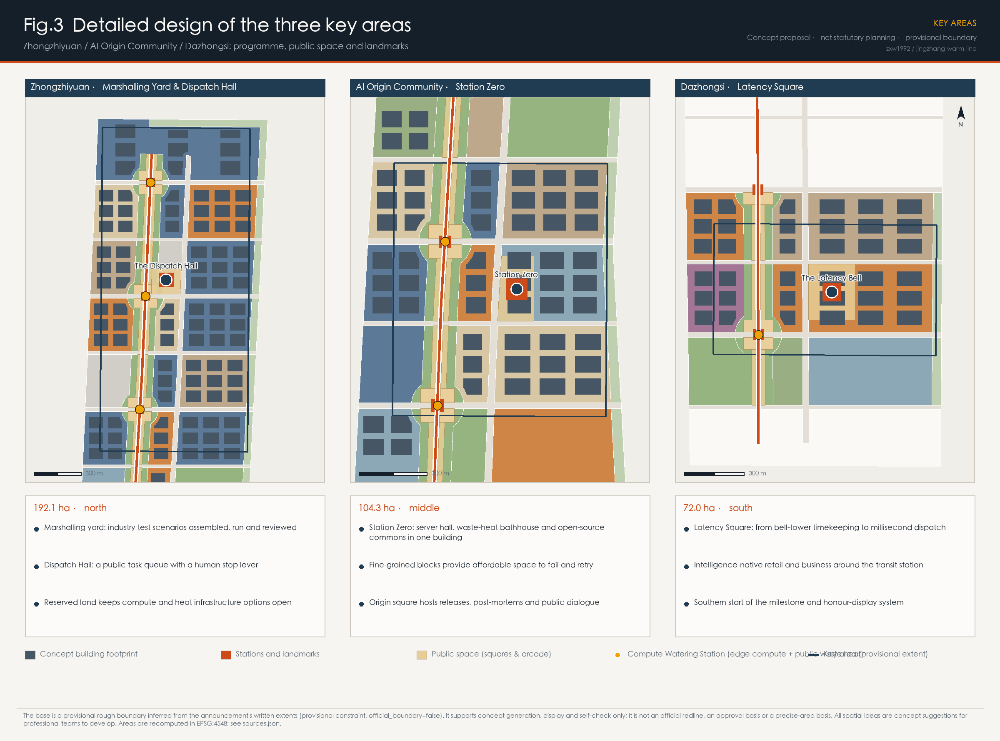
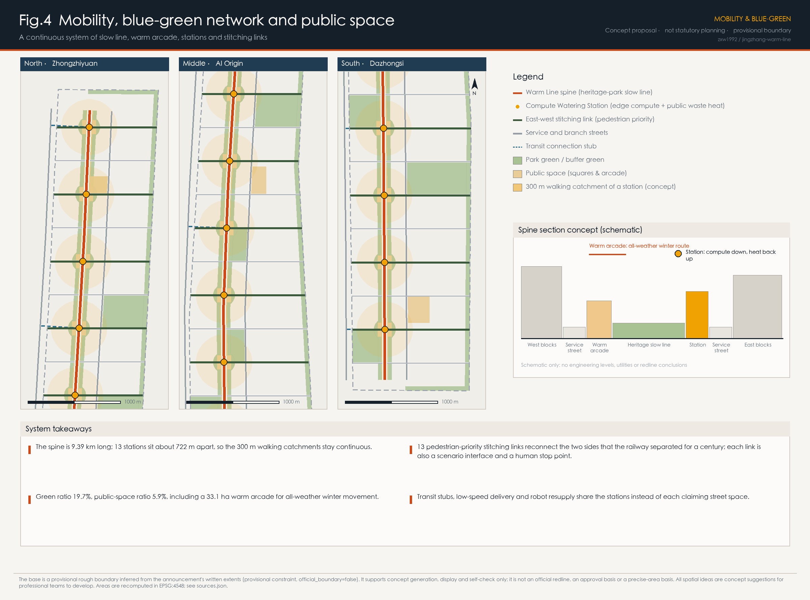
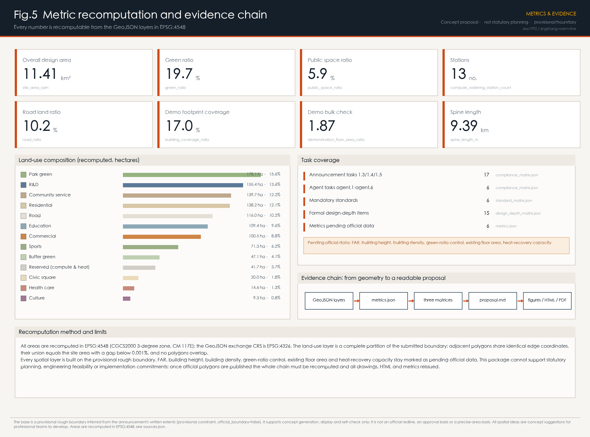

# THE WARM LINE: giving AI's waste heat, its compute and its off-switch back to the city

> Belt name: **THE WARM LINE** (Chinese: 京张暖线)
> In one sentence: AI does two very physical things to a city — it makes heat, and it needs to be near. This belt turns both into spatial rules, and keeps the switch that stops it in human hands.

Most "AI + city" proposals discuss how intelligence is displayed. This one discusses how intelligence is **supplied** and **constrained**: compute needs power, cooling and proximity to the people who use it, and a city has the right to decide who carries those costs, who receives the benefits, and when the machines can be told to stop. The Jing-Zhang Railway once had water stations along its route, where every steam locomotive had to stop and take on water. Today, along the same nine kilometres — now a heritage park — robots, delivery vehicles, embodied agents and real-time sensing must equally stop every so often to take on power, compute and data. This proposal renames that logic the **Compute Watering Station**, and attaches one hard condition to it: **the waste heat of every station must be handed back to a specific public space.**

## Design Basis and Source List

The primary basis is the pre-qualification announcement for the Centennial Jing-Zhang AI Innovation Belt international urban design open call, issued by the Haidian Branch of the Beijing Municipal Commission of Planning and Natural Resources. It fixes the 43.6 km² coordinated research area, the 11.4 km² overall design area, the 368.4 ha key detailed-design areas, and the three positioning statements [source:OFFICIAL-ANNOUNCEMENT] [standard:PROJECT-OFFICIAL-ANNOUNCEMENT]. The second basis is the agent-facing open-call taskbook, which sets tasks agent.1 to agent.6, the five functions, the three areas and two wings, and the clause that every spatial idea remains a concept suggestion [source:AGENT-TASKBOOK] [standard:PROJECT-AGENT-OPEN-CALL-TASKBOOK].

**An honest note on the boundary.** No downloadable official redline with a verifiable coordinate system is publicly available. This package therefore uses the repository's registered provisional rough boundary, inferred from the announcement's written extents, road names and approximate areas, and checked in EPSG:4548 [source:BOUNDARY-SOURCE] [data:geometry/site_boundary.geojson#SITE-001]. The three key areas are provisional in the same way [source:KEY-AREA-SOURCE] [data:geometry/key_areas.geojson#PROV-KEY-002]. All of this geometry carries `official_boundary=false` and `geometry_role=provisional_constraint`. It supports concept generation, visualisation and self-check only; it is not an official redline, an approval basis or a precise-area basis. When official polygons are published, land use, roads, green space, public space, buildings, phasing and every metric must be recomputed as one chain [depth:existing_conditions_diagnosis].

Sources are used according to their registered status: materials marked `usable_for_formal` in `data/source_registry.json` support scope, task and regulatory judgements; `provisional_only` geometry supports generation and display only; `background_only` policy documents inform narrative and design direction but never conclusions [source:SOURCE-REGISTRY]. Six additional public sources were collected (official information on the Jing-Zhang Railway Heritage Park, plus public material on Stockholm, Espoo, Odense, the German Energy Efficiency Act and Punggol Digital District). Each is recorded with publisher, link, retrieval date and limitation in `sources.json`, and is used as background reference only.

## Three-Level Scope Framework

The three levels are not three drawings at different scales; they are three different questions [depth:three_level_scope_framework].

**The 43.6 km² coordinated research area** answers a question of judgement: what physical constraints does artificial intelligence actually impose that planning must respond to? This proposal answers with two — **heat** (compute converts almost all of its electricity into low-grade heat) and **proximity** (embodied AI, robot delivery and real-time sensing are bound by last-mile latency, so compute must come down to street level). Together they mean the innovation belt cannot be an image project; it has to be an infrastructure institution.

**The 11.4 km² overall design area** answers a question of organisation: how does a corridor nine kilometres long and roughly 1.2 km wide organise three key areas, two wings and the neighbourhoods along it into one continuous system? The answer is a skeleton of "one spine, thirteen stations, thirteen links": a slow-mobility spine along the heritage park, 13 Compute Watering Stations and 13 east-west stitching links [metric:spine_length_m] [metric:compute_watering_station_count]. The recomputed site area is 11.41 km², consistent with the announced 11.4 km² [metric:site_area_sqm].

**The 368.4 ha key areas** answer a question of verification: can three districts carry the institution far enough to be seen, used and audited? Their recomputed provisional areas are 192.1, 104.3 and 72.0 hectares, each within 0.5% of the announced value [metric:key_area_total_area_sqm] [data:geometry/key_areas.geojson#PROV-KEY-001].

The transmission between levels is one-directional: the research level fixes the skeleton, the skeleton fixes the local moves. In reverse, problems exposed locally (for example the technical threshold of heat recovery) should correct the upper-level judgement rather than be hidden. Missing data on existing buildings, ownership, utilities and rail is registered, not guessed [depth:risk_missing_data].

## Coordinated Research Area: Industry and Future City Research

**Judgement 1: AI's heat is a civic resource, not a civic burden.** Data centres and edge compute turn almost all their electricity into low-grade heat, and Beijing needs heating for five months of the year; these two facts should meet. There are precedents at scale: Stockholm's data-park initiative, formed by the city, the energy company and the grid operator, buys data-centre waste heat through an open district-heating platform and feeds it into the city network [source:STOCKHOLM-DATA-PARKS]; the Espoo project in Finland plans zero-emission district heating from data-centre waste heat for a large metropolitan population [source:FORTUM-MICROSOFT-ESPOO]; Odense in Denmark upgrades low-grade data-centre heat with heat pumps and feeds the municipal network [source:ODENSE-META-HEAT]. Germany's 2023 Energy Efficiency Act goes further and makes energy reuse a condition of entry, requiring data centres commissioned from July 2026 to reach a minimum reuse share that rises in later years [source:DE-ENEFG-2023]. Waste-heat reuse is therefore not an aspiration; it can be written into admission conditions. This proposal localises it as the **Station Clause**: new edge-compute facilities on this belt must have a declared public destination for their waste heat.

**Judgement 2: AI's need to be near reshapes street-scale infrastructure.** Low-speed delivery, inspection robots, guidance terminals, AR and real-time vision are bound by latency and battery life, so they need a street-scale resupply network rather than one remote hall. The conventional 15-minute neighbourhood measures human access; this proposal adds a parallel measure — the **walking catchment of a station**. Thirteen stations cover the 9.4 km spine at roughly 722 m spacing, which keeps the 300 m catchments effectively continuous [metric:station_spacing_m] [data:geometry/buildings.geojson#BLDG-278].

**Judgement 3: stoppability is this belt's scarcest competitive asset.** AI districts are being built everywhere, but few cities have turned "how a person halts a running civic AI system" into visible public space. This is exactly where the announcement's function of global AI governance voice can be made distinctive [source:AGENT-TASKBOOK]. Internationally, Punggol Digital District connects its district and its university through an open digital platform and a testable digital base [source:PUNGGOL-DIGITAL-DISTRICT]; this proposal adds the spatial form of human interruption on top of that idea.

**Regional synergy.** In the north, Zhongzhiyuan connects through the 5th Ring and the Qinghe direction toward research and pilot-test resources further north; in the south, Dazhongsi connects by rail to the central city's consumption and business markets; the western wing carries capital, IP and resource allocation; the eastern wing carries outdoor testing and water-heat coupling. At the regional level, coordinating green power and compute across jurisdictions is a matter for energy and industry authorities; this proposal only reserves spatial interfaces and draws no resource-allocation conclusions [depth:overall_spatial_structure].

**Future urban form.** The three judgements produce a city of "three visibilities": visible compute (stations are street-facing buildings with public functions, not black boxes), visible energy (arcades, greenhouses and hot-water rooms turn waste heat into a felt public benefit), and visible responsibility (the Dispatch Hall makes system state and the right to stop it public).

## Overall Design Area: Urban Renewal and Regulatory-Plan-Level Urban Design

### Overall concept and naming system

**Name: THE WARM LINE.** "Warm" carries three meanings: the physical temperature of recovered heat, the usable temperature of winter public space, and the temperature of the relationship between people and machines — something that can be questioned and stopped, and therefore trusted.

The naming system is drawn entirely from Jing-Zhang railway operations, so it has a historical root and still travels internationally [depth:overall_spatial_structure]:

| Proposal term | Jing-Zhang prototype | Spatial content |
| --- | --- | --- |
| Compute Watering Station | Water station | Edge compute + charging + public waste heat + basic services (hot water, arcade, toilets, baby care, shelter) |
| Dispatch Hall | Dispatch office | A public queue of running civic AI tasks and a human stop lever |
| Marshalling Yard | Marshalling yard | Ground where industrial test scenarios are assembled, run and reviewed |
| Stitching Link | Level crossing | Pedestrian-priority east-west connection that doubles as a scenario interface |
| Milestone | Mileage marker | Continuous honour display and contributor record along the line |

**Visual identity and logo direction.** The motif is the geometry of a railway switch: one main line, a divergence at a point, and a solid dot at that point standing for the human dispatch position. The mark extends by moving the switch along the line, giving each key area and wing a sibling variant. The palette follows railway signalling: deep red (stop / human intervention), platform grey, Qinghe blue, locomotive green and waste-heat amber. All typefaces, images and marks must be self-made or redistributable; no third-party identity may be used without authorisation [depth:height_massing_character]. The three positioning statements are carried respectively by the cultural narrative system, the station and public-space system, and the industry and scenario system.

### Spatial structure: one spine, thirteen stations, thirteen links, three areas and two wings

**One spine.** A continuous 9.39 km slow-mobility spine along the Jing-Zhang Railway Heritage Park, barrier-free and usable in all weather [metric:spine_length_m] [data:geometry/roads.geojson#ROAD-001]. The heritage park is a real project already under construction: public information describes a linear public space of about nine kilometres, with phase one opened in 2023 and phase two started at the end of 2024 [source:JZ-HERITAGE-PARK]. This proposal therefore does not draw a line on empty land; it proposes the next functional step for a public space that is already taking shape.

**Thirteen stations.** Thirteen Compute Watering Stations sit along the spine at about 722 m spacing. Each contains four things: a visible edge server room, a charging and robot-resupply bay, a stretch of warm arcade or greenhouse, and a minimum package of public services. The forecourt is fixed before the building, so public space is never a residual [metric:compute_watering_station_count] [data:geometry/public_space.geojson#PUBLIC-001].

**Thirteen links.** The railway cut this part of the city in two for a century. At each station the proposal places a pedestrian-priority east-west stitching link that reconnects daily life on both sides; each link is also a scenario interface and a human stop point [metric:stitching_link_count]. The form of the crossing — at grade, ramped or bridged — is an engineering judgement for professional teams working with rail, utilities and heritage constraints, and this proposal draws no engineering conclusion.

**Three areas.** Zhongzhiyuan in the north carries the full-stack autonomous innovation system and the governance voice; the AI Origin Community in the middle carries the world-class innovation ecosystem; Dazhongsi in the south carries intelligence-native new business. **Two wings:** the Zhongguancun service wing to the west carries global resource allocation, capital and IP; the Xiaoyue River scenario wing to the east carries scenario empowerment and outdoor water-heat testing [depth:overall_spatial_structure].

### Renewal framework and character

Renewal follows "densify along the spine, permeate toward the wings": the 300 m band on both sides of the spine is renewed first to form a continuous public frontage, and each stitching link receives a mixed-use node at both ends so renewal never happens on one side only. The character principle is "quiet infrastructure, distinct public nodes": stations and landmarks may be recognisable, while ordinary blocks emphasise frontage continuity and active ground floors [depth:height_massing_character]. Height, density and floor area ratio are statutory controls; no approved values appear in public sources, so this proposal states no control conclusions and uses a demonstration bulk check only to test the order of magnitude of the spatial idea [metric:demonstration_floor_area_ratio] [depth:development_intensity_controls].

## Detailed Design of Key Areas

All three follow the same sequence: public space and stitching links first, programme and bulk second, AI scenario interfaces last [depth:three_key_area_detailed_design].

### Zhongzhiyuan AI Acceleration Area (north, 192.1 ha)

**Role:** the marshalling yard of the full-stack innovation system, and the governance centre of the belt [metric:key_area_zhongzhiyuan_ai_acceleration_area_sqm].

**Moves.** First, the **marshalling yard** — the larger block grain in the north supports repeatedly convertible pilot-test land where industrial validation scenarios are assembled, run and reviewed like rolling stock; research land dominates, and a contiguous reserve of "white land" keeps options open for compute and heat facilities instead of writing uncertainty down as certainty [data:geometry/land_use.geojson#LU-006]. Second, the **Dispatch Hall** — a publicly accessible building on the central square whose screens show the civic AI tasks currently running on the belt (delivery, inspection, guidance, energy dispatch), with an explicit human stop lever and an appeal desk. Third, a **northern interface** toward the 5th Ring and Qinghe for cooperation with the science cities further north.

**Missing data.** Ownership, structure and heritage value of existing sheds and compounds decide whether the yard can be located here; none of this is in public sources and it must be verified on site by professional teams [depth:retain_renovate_demolish].

### Beijing AI Origin Community (middle, 104.3 ha)

**Role:** kilometre zero of the innovation ecosystem, and the place on the belt that most needs density and affordability [metric:key_area_beijing_ai_origin_community_sqm].

**Moves.** First, **Station Zero** — server room, waste-heat bathhouse and greenhouse, and open-source community space in one building: the machine's heat becomes a temperature people can sit in, which is the single most important translation on this belt. Second, **fine-grained blocks** — a finer block division and a higher share of community service land give university teams and start-ups affordable room to fail and retry [metric:land_use_ratio_0702]. Third, the **Origin Square** — a place for open-source releases, post-mortems and public dialogue; the proposal suggests a "record of halted runs" here, publicly showing AI tasks that were stopped and models that failed validation, trading honesty for long-term trust.

**Missing data.** The middle section adjoins universities and established neighbourhoods; population, education and health service baselines, and the implemented boundary of heritage-park phase one, must be re-checked once official material is available [depth:existing_conditions_diagnosis].

### Dazhongsi AI Industry Cluster (south, 72.0 ha)

**Role:** the market end of intelligence-native business and the southern gateway of the belt [metric:key_area_dazhongsi_ai_industry_cluster_sqm].

**Moves.** First, **Latency Square** — Dazhongsi is known for its ancient bell, the pre-industrial civic instrument of time, while the civic unit of time in the AI era is the millisecond. Paving and lighting present the isochrones of urban response time: from millisecond edge response, through minute-scale delivery and travel, to renewal cycles measured in years. Second, a **bell-tower landmark** at one corner of the square marks the southern start of the line and completes the trio of landmarks with the Dispatch Hall and Station Zero. Third, **intelligence-native commerce** around the rail station accommodates unmanned retail, embodied services and content production [metric:land_use_ratio_05].

**Missing data.** Precise GIS boundaries of heritage protection zones and construction-control areas have not been obtained, so the position, bulk and materials of the square and the structure must be confirmed with the heritage authority and professional teams; no specific engineering proposal touching heritage control is made here [depth:risk_missing_data].

## AI Innovation Ecosystem, Personas, and AI+ Scenarios

### Global cases for compute, energy and innovation ecosystems

These cases support two institutional designs — public waste heat and an open testing base. All are public material and have not been verified against primary operating records; none is used as a local engineering or investment conclusion [source:SOURCE-REGISTRY]:

| # | Case | Relevance |
| --- | --- | --- |
| 1 | Stockholm Data Parks and open district heating (Sweden) | City, energy utility and grid turn data-centre waste heat into a tradable product, showing that public waste heat can have a stable commercial mechanism [source:STOCKHOLM-DATA-PARKS] |
| 2 | Espoo data-centre district heating (Finland) | A published plan for large-scale data-centre heat serving hundreds of thousands of residents, showing the technical path at scale [source:FORTUM-MICROSOFT-ESPOO] |
| 3 | Odense data-centre heat into the municipal network (Denmark) | Low-grade heat upgraded by heat pumps, the closest technical reference for a station [source:ODENSE-META-HEAT] |
| 4 | German Energy Efficiency Act, data-centre clause (Germany) | Energy-reuse share written into admission conditions — the most direct reference for the Station Clause [source:DE-ENEFG-2023] |
| 5 | Punggol Digital District and its Open Digital Platform (Singapore) | A shared open digital base with real-time district data, a reference for scenario opening [source:PUNGGOL-DIGITAL-DISTRICT] |
| 6 | Jing-Zhang Railway Heritage Park (Haidian, local baseline) | A linear public space of about nine kilometres, phase one open and phase two under construction, serving a large number of neighbourhoods, universities and research institutes [source:JZ-HERITAGE-PARK] |

**Ecosystem map.** Universities and institutes (origination) → affordable space in the Origin Community (incubation) → the Zhongzhiyuan marshalling yard (pilot testing and validation) → open scenarios along the line (application) → the Dazhongsi market end (conversion) → capital and IP in the western wing (amplification) → back to origination. Of the eight resource classes, only three can be promised on the spatial side: affordable room to fail, bookable test grounds, and connectable compute and data interfaces. The rest belong to industry and fiscal authorities; this proposal offers mechanism suggestions, not commitments [source:AGENT-TASKBOOK].

### Five user personas

Public information describes the heritage-park corridor as touching close to 70 neighbourhoods, roughly 450,000 residents, more than ten universities and about forty research institutes [source:JZ-HERITAGE-PARK]; this is the factual base for the personas.

1. **Graduate student / early-stage engineer** — needs cheap desks, usable compute and public space reachable late at night. Spaces: affordable units in the Origin Community, night-open station bays, warm arcade.
2. **Commuter** — needs reliable transfers and a continuous walking environment. Spaces: stitching links, transit stubs, station forecourts.
3. **Older resident** — benefits from AI services and is most easily excluded by digital thresholds. Spaces: the staffed counter and hot-water room at every station. Every AI service must retain a non-digital alternative, which is both a legal accessibility requirement and the direction of ageing-friendly policy [standard:BARRIER-FREE-ENVIRONMENT-LAW] [source:ELDERLY-SMART-TECH-PLAN].
4. **Parent with children** — cares about safety, shelter and places to stay. Spaces: forecourts, baby-care facilities, time-and-zone separation between delivery robots and pedestrians.
5. **International visitor and developer** — cares about what can be seen, tried and taken away. Spaces: the three landmarks, the milestone honour system, and booking entrances to open scenarios.

### Twelve AI scenario cards

Each card states the scenario, its spatial location, its data boundary and its human-review path. All follow the applicable requirements for generative AI services and keep a human intervention route [standard:GENERATIVE-AI-INTERIM-MEASURES].

| ID | Scenario | Location | Data boundary | Human review |
| --- | --- | --- | --- | --- |
| S01 | Low-speed delivery and robot resupply | 13 stations + stitching links | Task and road-condition data only, no facial data | Station staff can stop local tasks with one action |
| S02 | Walking-network gap and accessibility audit | Whole spine | Anonymous counts and asset condition | Monthly on-site verification |
| S03 | Waste-heat dispatch and winter arcade opening | Stations + arcade | Energy and temperature data | Opened only after heating engineers confirm |
| S04 | AI cultural guidance and Jing-Zhang narrative | Park and three landmarks | Public historical material and licensed assets | Historical content reviewed by cultural authority |
| S05 | Community health service navigation | Origin Community, health facility nodes | No individual clinical data | Clinicians remain the only decision makers |
| S06 | Enterprise service copilot | Zhongzhiyuan and western wing nodes | Public policy and voluntarily submitted material | Conclusions issued by a person |
| S07 | Public safety and event operations review | Forecourts and event grounds | Crowd density, not identity recognition | Incidents judged and handled by people |
| S08 | Embodied robot outdoor testing | Xiaoyue River wing | Data from closed test windows | A site supervisor is required |
| S09 | Station energy and carbon dashboard | All stations | Device-level energy data | Metrics defined with the municipal authority |
| S10 | Open-source release and post-mortem | Origin Square | Models and data within open licences | Community review plus failure archive |
| S11 | Civic task queue and interruption | Dispatch Hall | Task metadata, no personal data | Public appeal, human interruption |
| S12 | Latency visualisation and public explanation | Latency Square | Response-time statistics | Publisher discloses measurement basis |

Three **industrial test and validation scenarios** need dedicated ground and rules: **T1 low-speed autonomous driving and delivery marshalling test** (Zhongzhiyuan yard, closed → semi-open → open release); **T2 embodied robot outdoor adaptation test** (Xiaoyue River waterfront, including rain, snow, night and crowd interference); **T3 compute waste heat and thermal comfort demonstration** (Station Zero, one continuous heating season). All three share an "apply → assess → staged release → public review" process, and a test scenario is never an approved operation [source:AGENT-TASKBOOK].

**Scenario-space-operation mapping.** Card IDs enter the operating manual of each station and landmark; every space registers three facts — who is running it, what the data boundary is, and who can stop it — and these are published in the Dispatch Hall. Privacy is a hard constraint: no facial-recognition-driven public management scenarios, no immature technology described as ready for full deployment, and no dependence on data that has not been made public or cleared [standard:GENERATIVE-AI-INTERIM-MEASURES].

## Land Use, Building Scale, and Retain-Renovate-Demolish Strategy

The land-use layer is a complete partition of the submitted boundary, built as "one partition, four subtractions": road land first, then the 13 station forecourts, then the spine park and station gardens, then the eastern buffer strip; what remains is coded by the three-areas-two-wings logic. Adjacent parcels therefore share identical edge coordinates, their union equals the site area, and there are no gaps or overlaps [data:geometry/land_use.geojson#LU-001] [depth:land_use_layout].

| Code | Category | Area (ha) | Share |
| --- | --- | ---: | ---: |
| 1401 | Park green space | 178.1 | 15.6% |
| 0802 | Research and development | 155.4 | 13.6% |
| 0702 | Community service facility | 139.7 | 12.2% |
| 0701 | Urban residential | 138.2 | 12.1% |
| 1207 | Urban road | 116.0 | 10.2% |
| 0804 | Education | 109.4 | 9.6% |
| 05 | Commercial and business services | 100.5 | 8.8% |
| 0805 | Sports | 71.3 | 6.2% |
| 1402 | Buffer green space | 47.1 | 4.1% |
| 16 | Reserved (white land) | 41.7 | 3.7% |
| 1403 | Civic square | 20.0 | 1.8% |
| 0806 | Health care | 14.6 | 1.3% |
| 0803 | Culture | 9.3 | 0.8% |

Codes follow the project subset of the national land-use classification guide [standard:MNR-LAND-USE-CLASSIFICATION-GUIDE]. **Reserved land is a deliberate position**: 41.7 ha is kept open for compute and heat facilities, because the technical route, installed capacity and network conditions for heat recovery cannot be determined from public sources. Rather than inventing a precise plant layout, the proposal registers the uncertainty as space [metric:land_use_ratio_16].

**Building scale (demonstration).** The concept footprints total 194.2 ha, a coverage of 17.0%; at demonstration storey counts the floor area is 13.81 million m², and the bulk check over demonstration parcels is 1.87 [metric:building_footprint_area_sqm] [metric:demonstration_floor_area_ratio]. **These numbers test the order of magnitude of a spatial idea; they are not FAR, density or height control conclusions**, and the statutory values remain marked as pending official data [depth:development_intensity_controls]. Existing building stock data has not been obtained, so the figures exclude it [data:geometry/buildings.geojson#BLDG-001].

**Retain, renovate, demolish.** The order is retain first, renovate as the main mode, build new only to fill gaps; at concept level the footprint split is 61.3 ha retained, 64.0 ha renovated and 70.0 ha newly built [metric:renewal_retain_footprint_sqm] [depth:retain_renovate_demolish]. The rules are: structurally sound buildings that can carry new uses are retained; buildings along the spine and links with openable ground floors are renovated; new construction only where public space and interfaces cannot be achieved otherwise. **This is a classification logic, not a parcel-level conclusion** — actual decisions require existing footprints, storeys, age, ownership and structural assessment, and must be made by professional teams.

## Transport, Rail, Municipal Infrastructure, and Public Services

**Walking and stitching.** The spine runs continuously for 9.39 km and the 13 links are designed pedestrian-first, with forecourts handling gathering and dispersal [depth:traffic_rail_slow_parking]. Road land is 10.2% of the site, which sustains a fine-grained street network at concept level [metric:road_ratio]. Crossing form, cross-section and redlines are engineering judgements and are not concluded here.

**Rail and transfers.** Transit connection stubs make stations the shared node for interchange and robot resupply, so each mode does not claim street space separately [data:geometry/roads.geojson#ROAD-201]. Rail alignments, station boundaries and ridership are not available publicly, so the stubs are schematic [depth:risk_missing_data].

**Parking and low-speed traffic.** Low-speed delivery and robot resupply concentrate at the stations to reduce kerbside occupation; vehicle parking is assessed per renewal project and no ratios are proposed here.

**Municipal and new infrastructure.** The strategy has three layers: (1) a **compute layer**, edge compute in 13 stations sized to demand; (2) a **heat layer**, station waste heat upgraded by heat pumps for arcades, greenhouses, hot water and snow melting, with connection method and capacity to be calculated by municipal, heating and energy specialists — the recovery capacity is therefore marked pending [metric:waste_heat_recovery_capacity_mw]; (3) an **interface layer**, a registered catalogue of data and scenario interfaces following the open digital base practice [source:PUNGGOL-DIGITAL-DISTRICT] [depth:municipal_new_infrastructure]. Power, water, drainage, gas, fire and flood capacity calculations are outside this proposal's scope.

**Public services.** Community service land of 139.7 ha, education 109.4 ha, sports 71.3 ha and health care 14.6 ha form the base provision [metric:land_use_area_0702_sqm]. Each station carries a minimum public-service package — hot water, toilets, warm arcade, baby care and seating, and a staffed counter. **The staffed counter is mandatory**, so residents who do not use smart devices receive the same service [standard:BARRIER-FREE-ENVIRONMENT-LAW].

## Blue-Green Network, Public Space, and Urban Character

**Blue-green.** Green space has three parts: the linear spine park and station gardens, the eastern buffer strip, and neighbourhood parks. The recomputed green ratio is 19.7% [metric:green_ratio] [depth:blue_green_public_space]. The Xiaoyue River to the east offers a coupling opportunity between summer cooling and winter heat, but water boundaries, blue lines and water-quality data are unavailable, so only the direction is proposed and no hydraulic conclusion is drawn.

**Public space.** Public space totals 67.0 ha, or 5.9%, made of forecourts, three civic squares and the warm arcade [metric:public_space_ratio]. The **33.1 ha warm arcade** is the most concrete public benefit on this belt: with roughly five cold months in Beijing, a covered, heated, barrier-free, 24-hour linear route turns the park from a three-season amenity into a year-round one [metric:warm_arcade_area_sqm].

**Character and cultural narrative.** Three kinds of time meet here: the bell at Dazhongsi as pre-industrial civic timekeeping, the 1909 railway as industrial time, and forty years of Zhongguancun iteration plus today's weekly model cycles as information and intelligence time. Arranged from south to north, they let a person walk a timeline of Chinese technology in nine kilometres: **a pilgrimage here is not visiting one landmark, it is walking a whole line** [depth:height_massing_character].

**Wayfinding.** The milestone is the basic unit, placed continuously along the line, carrying three duties: position, historical note, and honour display for contributors and projects. The wayfinding system and the belt logo stay in separate layers. Historical statements follow public records; no distortion of history and no unauthorised portraits, trademarks or copyrighted images [depth:risk_missing_data].

**International message.** "A city that gives its machines' heat back to its people, and keeps the off-switch in human hands."

## Renewal Projects, Implementation Policy, and Phasing

### Renewal project list (concept suggestions)

| ID | Project | Location | Content |
| --- | --- | --- | --- |
| P01 | Station Zero | AI Origin Community | Edge server room + waste-heat bathhouse and greenhouse + open-source commons |
| P02 | Dispatch Hall and public gallery | Zhongzhiyuan | Civic task queue, human stop lever, appeal desk |
| P03 | Latency Square and bell tower | Dazhongsi | Time-narrative paving, southern gateway landmark |
| P04 | Warm arcade (in sections) | Whole line | Covered, barrier-free, all-weather linear route |
| P05 | Thirteen stations (rolling) | Whole line | Compute + resupply + minimum public-service package |
| P06 | Thirteen stitching links | Whole line | Pedestrian-priority links and scenario interfaces |
| P07 | Marshalling yard and pilot grounds | Zhongzhiyuan | Convertible test land and support |
| P08 | Xiaoyue River outdoor test section | Eastern wing | Embodied robots and water-heat demonstration |
| P09 | Affordable units in the Origin Community | AI Origin Community | Small, low-threshold space to fail and retry |
| P10 | Milestone honour system | Whole line | Continuous narrative and contributor display |
| P11 | Station transfer and low-speed traffic organisation | Whole line | Transit stubs, delivery and pedestrian time-sharing |
| P12 | Reserved-land management rule | Zhongzhiyuan and others | Space reservation and release conditions for compute and heat |

### Phasing

- **Phase 1 (concept):** spine, stations and arcade, 225.3 ha [metric:phase_1_area_sqm] [data:geometry/phasing.geojson#PHASE-001]. Build the line first so public space and the resupply network exist before anything else.
- **Phase 2 (concept):** detailed design of the three key areas, 281.7 ha [metric:phase_2_area_sqm].
- **Phase 3 (concept):** belt-block renewal and scenario scale-up, 634.3 ha [metric:phase_3_area_sqm] [depth:phasing_implementation].

Phasing expresses sequence and extent only; it contains no schedule commitment, investment estimate or approval judgement.

### Implementation mechanisms (suggestions, not settled arrangements)

1. **Station Clause** — new edge-compute facilities declare a public destination for their waste heat and publish energy and recovery data. Legislation elsewhere already writes reuse shares into admission conditions [source:DE-ENEFG-2023].
2. **Scenario opening** — one "apply → assess → staged release → public review" process, with test and operation strictly distinguished.
3. **Reserved-land rule** — release conditions and time limits so reserved land is neither idle forever nor casually consumed.
4. **Data and compute interfaces** — a public interface catalogue with declared data boundaries and responsible parties.
5. **Interruption and appeal** — each scenario registers who can stop it, how to appeal, and the response time.

### Long-term operation and global event system (agent.6)

**Annual events (suggested):** an Open-Source Release Week in spring (Origin Square), an Outdoor Test Season in summer (eastern wing), a Civic Dispatch Assembly in autumn (Dispatch Hall, a public review of the year's AI operations and interruptions), and a Warm Line Season in winter (cultural programming in the arcade and heated spaces). **Brand assets:** the belt logo, the milestone system and the record of halted runs together form assets that accumulate. **Developer community:** an open interface catalogue, bookable test grounds and published post-mortems give a reason to come here rather than elsewhere. **Conversion path:** visitor → developer (interfaces and grounds) → team (affordable units) → company (yard and market end) → staying on the belt. **International communication:** public waste heat plus stoppable AI as the narrative spine, supported by the three landmarks and the annual events. All of the above are mechanism suggestions and do not represent settled government arrangements, funding or investment commitments [source:AGENT-TASKBOOK].

## Metrics, Area Recalculation, and Compliance Matrix

All areas are recomputed in EPSG:4548 (CGCS2000 3-degree zone, central meridian 117°E); the GeoJSON exchange CRS is EPSG:4326 [depth:metrics_recalculation] [standard:MOHURD-CONTROL-DETAILED-PLANNING]. The land-use layer is a complete partition of the submitted boundary: the gap between its union and the site area is below 0.001% of the site, and no polygons overlap.

| Metric | Value | Note |
| --- | ---: | --- |
| Overall design area | 11.41 km² | Consistent with the announced 11.4 km² [metric:site_area_sqm] |
| Green ratio | 19.7% | Spine park + buffer + neighbourhood parks [metric:green_ratio] |
| Public space ratio | 5.9% | Forecourts + civic squares + arcade [metric:public_space_ratio] |
| Road land ratio | 10.2% | Concept network [metric:road_ratio] |
| Demonstration footprint coverage | 17.0% | Excludes existing stock [metric:building_coverage_ratio] |
| Demonstration bulk check | 1.87 | Not a statutory FAR [metric:demonstration_floor_area_ratio] |
| Stations | 13 | About 722 m apart [metric:compute_watering_station_count] |
| Spine length | 9.39 km | Along the heritage park [metric:spine_length_m] |
| Key areas total | 369.3 ha | 0.24% from the announced 368.4 ha [metric:key_area_total_area_sqm] |

**Six metrics remain pending official data**, each marked `unknown` with a reason: FAR, building height, building density, statutory green-ratio control, existing floor area and heat-recovery capacity [metric:floor_area_ratio] [metric:existing_building_floor_area_sqm].

**Matrices.** Seventeen announcement tasks and six agent tasks map to sections, layers, metrics, drawings and self-checks in the compliance matrix; nine professional standards are answered in the standard matrix; fifteen formal design-depth items are recorded as complete in the depth matrix [standard:MOHURD-URBAN-DESIGN-MEASURES] [standard:MOHURD-ARCH-DESIGN-DEPTH-2016]. The full indexes stay in the structured files and are not repeated in prose.

## Risk, Copyright, and Compliance

**Statutory boundary.** Everything here is a concept suggestion and reference material for professional teams under an open call addressed to AI agents. It does not replace statutory planning, does not constitute a government decision, and draws no conclusion on regulatory plan amendment, parcel-level demolition, road alignment, rail alignment, bridge or tunnel engineering, municipal capacity, investment or approval [source:AGENT-TASKBOOK] [standard:PROJECT-AGENT-OPEN-CALL-TASKBOOK].

**Main risks and responses.** (1) **Spatial dispute** — the provisional boundary may differ from the official redline; the response is a fully recomputable chain, regenerated when official polygons arrive. (2) **Technology maturity** — upgrading low-grade heat and connecting to networks has engineering thresholds; the response is one station demonstration (T3) before any rollout. (3) **Policy uncertainty** — public waste heat and scenario opening cross several authorities, so only mechanisms are proposed. (4) **Data privacy** — every card declares its data boundary, no facial-recognition-driven public management, human review and appeal retained [standard:GENERATIVE-AI-INTERIM-MEASURES]. (5) **Equity and inclusion** — staffed counters and non-digital alternatives at every station [standard:BARRIER-FREE-ENVIRONMENT-LAW]. (6) **Operating cost** — the public part of each station needs a long-term operator, suggested to be tied to scenario-opening revenue. (7) **Implementation complexity** — phasing moves from line to district. (8) **Public acceptance** — the openness of the Dispatch Hall and the halted-run archive is itself the acceptance mechanism [depth:risk_missing_data].

**Copyright and generation disclosure.** Text, geometry, figures, PDFs and static pages in this package were generated by the declared AI agent; base geometry comes from the repository's registered provisional boundary; external facts come from public sources with recorded provenance and retrieval dates. No unauthorised typefaces, images, trademarks, portraits or paper figures are used. See `report/copyright_statement.md`.

## References

Public sources used in this package; full records with retrieval dates, licences and use limits are in `sources.json` [source:SOURCE-REGISTRY]:

1. Haidian Branch, Beijing Municipal Commission of Planning and Natural Resources — pre-qualification announcement, https://ghzrzyw.beijing.gov.cn/zhengwuxinxi/tzgg/hd/202605/t20260509_4643047.html
2. Agent open-call taskbook extract, repository path brief/site-package/agent_taskbook.json
3. Ministry of Natural Resources — land and sea use classification guide, https://www.gov.cn/zhengce/zhengceku/202311/content_6917279.htm
4. MOHURD — Urban Design Management Measures, https://www.mohurd.gov.cn/gongkai/zc/wjk/art/2023/art_17339_775476.html
5. Measures for regulatory detailed planning of cities and towns, https://www.gov.cn/zhengce/2022-01/25/content_5711967.htm
6. Interim Measures for the Management of Generative AI Services, https://www.cac.gov.cn/2023-07/13/c_1690898327029107.htm
7. Barrier-free Environment Construction Law of the PRC, https://www.gov.cn/yaowen/liebiao/202306/content_6888910.htm
8. Beijing Municipal Forestry and Parks Bureau — Jing-Zhang Railway Heritage Park (Haidian), https://yllhj.beijing.gov.cn/ggfw/bjsggml/zhgy/hdq/202507/t20250724_4156668.shtml
9. Stockholm Data Parks, https://stockholmdataparks.com/
10. Fortum — data centres in the Helsinki region, https://www.fortum.com/services/heating-cooling/data-centres-helsinki-region
11. State of Green — data-centre surplus heat for district heating (Odense), https://stateofgreen.com/en/solutions/unprecedented-data-centre-surplus-heat-recovery-to-fuel-district-heat-network/
12. White & Case — data centre requirements under the German Energy Efficiency Act, https://www.whitecase.com/insight-alert/data-center-requirements-under-new-german-energy-efficiency-act
13. JTC — Punggol Digital District Open Digital Platform, https://www.jtc.gov.sg/punggoldigitaldistrict/odp

Machine-readable evidence is kept in `geometry/*.geojson`, `metrics.json`, `compliance_matrix.json`, `standard_matrix.json`, `design_depth_matrix.json`, `assumptions.json` and `self_check.json`; the prose keeps only the anchors next to the claims they support [data:geometry/constraints.geojson#PROV-RESEARCH-001] [data:geometry/green_space.geojson#GREEN-001].
