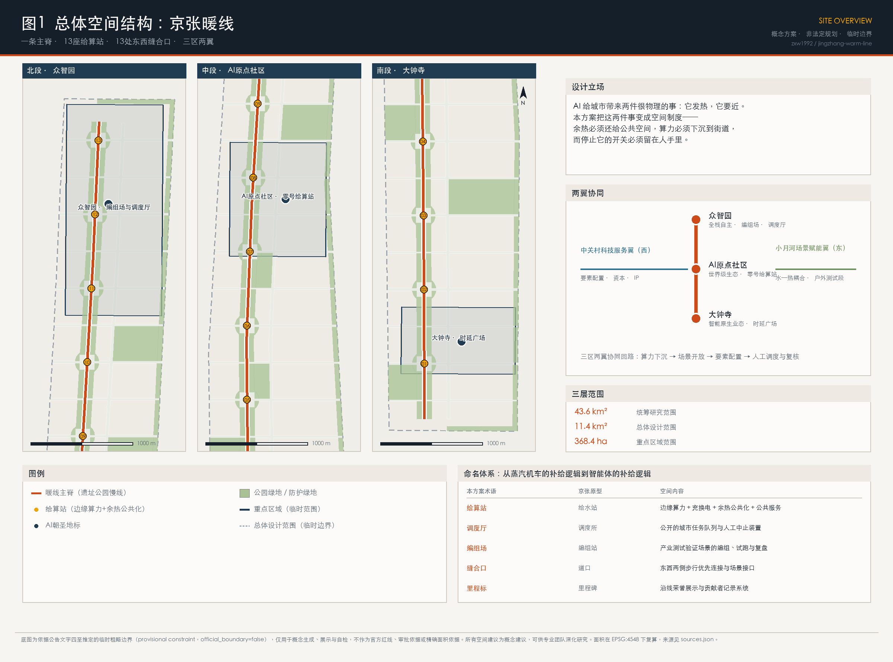
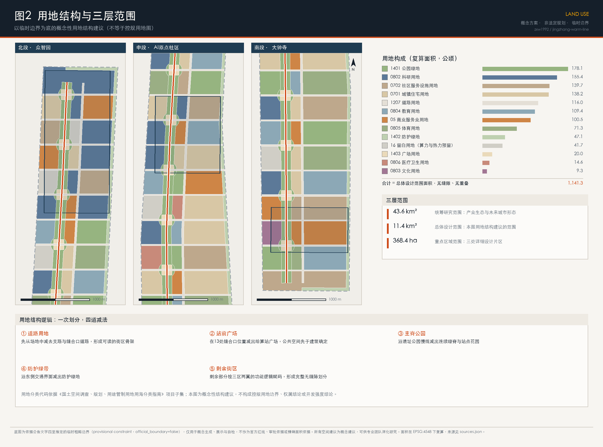
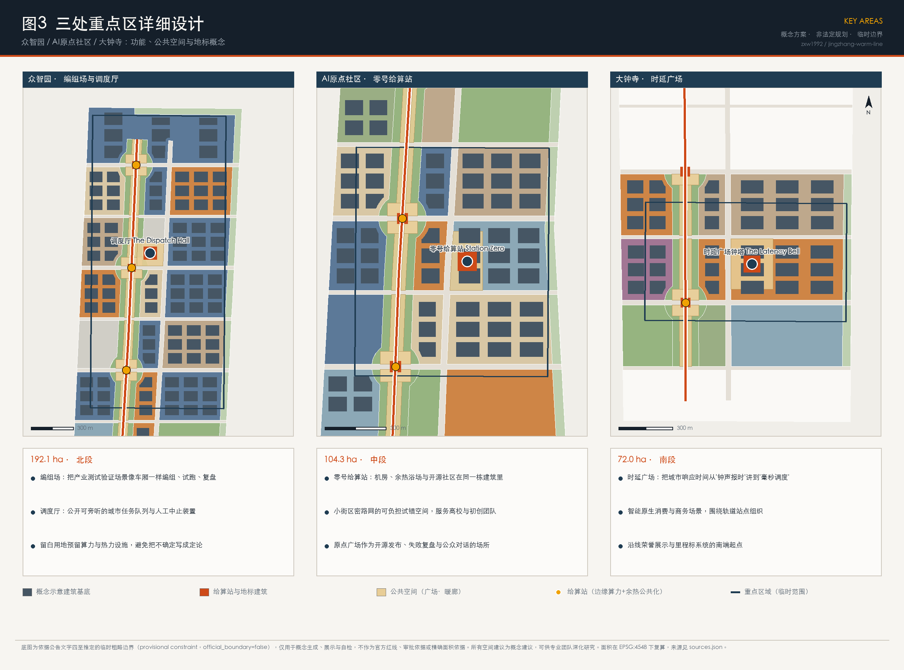
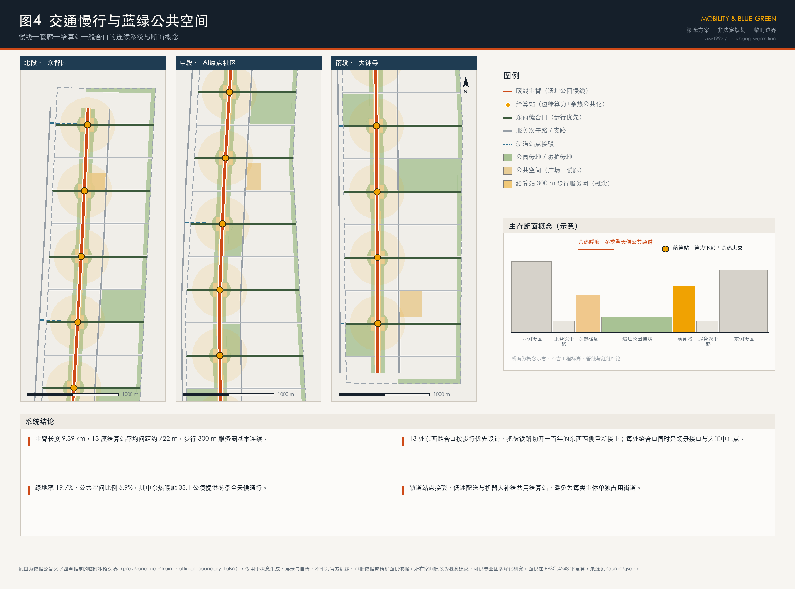
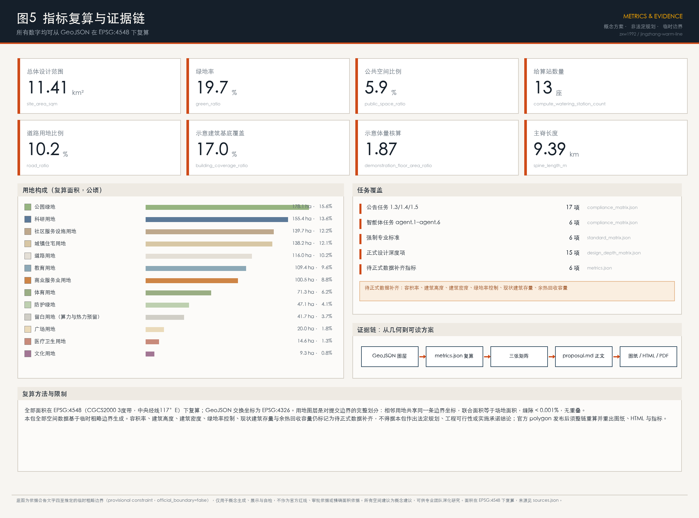

# 京张暖线 THE WARM LINE：把AI的余热、算力与停止开关还给城市

> 一带主名称：**京张暖线**（英文 **THE WARM LINE**）
> 一句话：AI 给城市带来两件很物理的事——它发热，它要近。这条带把这两件事变成空间制度，并把停止它的开关留在人手里。

大多数"AI+城市"的方案，讨论的是智能如何被展示。本方案讨论的是智能如何被**供养**和**约束**：算力需要电、需要冷却、需要靠近使用它的人；而一座城市有权决定这些代价由谁承担、收益归谁所有、什么时候可以停下来。京张铁路当年为蒸汽机车沿线设"给水站"，机车每隔一段必须停下补水；今天沿这条9公里的遗址公园，机器人、无人配送、具身智能体和实时感知同样需要每隔一段补电、补算、补数据。本方案把这种补给逻辑重新命名为**给算站**，并给它加上一条硬约束：**每一座给算站排出的余热，必须交还给一处具体的公共空间**。

## 设计依据与资料清单

本方案的第一依据是北京市规划和自然资源委员会海淀分局发布的《百年京张AI创新带城市设计国际方案征集资格预审公告》，它确定了43.6平方公里统筹研究范围、11.4平方公里总体设计范围、368.4公顷重点区域范围，以及三大定位与设计任务 [source:OFFICIAL-ANNOUNCEMENT] [standard:PROJECT-OFFICIAL-ANNOUNCEMENT]。第二依据是面向全球智能体的开源征集任务书，它规定了 agent.1 至 agent.6 六项必答任务、五大功能、三区两翼，以及"所有空间落地建议均为概念建议"的边界条款 [source:AGENT-TASKBOOK] [standard:PROJECT-AGENT-OPEN-CALL-TASKBOOK]。

**关于边界的诚实说明**：公开渠道目前没有可下载、可验证坐标系的官方精确红线。本方案使用仓库登记的临时粗略边界作为生成底图，它由公告文字四至、道路名称与约面积推定，在 EPSG:4548 下校核 [source:BOUNDARY-SOURCE] [data:geometry/site_boundary.geojson#SITE-001]。三处重点区同样为临时范围 [source:KEY-AREA-SOURCE] [data:geometry/key_areas.geojson#PROV-KEY-002]。这些几何一律标注 `official_boundary=false`、`geometry_role=provisional_constraint`，只用于概念生成、可视化与自检，不能作为官方红线、审批依据或精确面积依据；正式 polygon 发布后，用地、道路、绿地、公共空间、建筑、分期与全部指标必须整链重算 [depth:existing_conditions_diagnosis]。

资料按用途分级使用：`data/source_registry.json` 中标记为 `usable_for_formal` 的官方公告与国家标准文件，用于范围、任务与规范判断；标记为 `provisional_only` 的临时边界只用于生成与展示；标记为 `background_only` 的政策文件只用于叙述与设计取向，不用于结论 [source:SOURCE-REGISTRY]。本方案另行采集了六项外部公开资料（京张铁路遗址公园官方信息，以及斯德哥尔摩、埃斯波、欧登塞、德国能效法、新加坡榜鹅数字园区的公开资料），全部记录发布者、链接、检索日期与限制，并在 `sources.json` 中标注为背景参考，不作为本地空间结论的依据。

## 三层范围工作框架

三个层次不是三张比例尺不同的同类图纸，而是三种不同的问题 [depth:three_level_scope_framework]。

**43.6平方公里的统筹研究范围**回答的是判断题：人工智能到底给城市带来了什么必须由规划回应的物理约束？本方案的回答是两条——**热**（算力几乎把全部电能转成低品位热）与**近**（具身智能、机器人配送、实时感知受"最后一公里"时延约束，算力必须下沉到街道尺度）。这两条决定了创新带不能只做形象工程，而要做基础设施制度。

**11.4平方公里的总体设计范围**回答的是组织题：这条南北9公里、东西平均约1.2公里的带，如何把三处重点区、两翼资源和沿线社区组织成一个连续系统。方案给出的骨架是"一脊、十三站、十三口"：一条沿京张遗址公园的慢行主脊，13座给算站，13处东西缝合口 [metric:spine_length_m] [metric:compute_watering_station_count]。复算的场地面积为11.41平方公里，与公告约11.4平方公里一致 [metric:site_area_sqm]。

**368.4公顷的重点区域范围**回答的是验证题：三处片区能否把上述制度做到可看、可用、可复核的程度。三处临时范围的复算面积分别为192.1、104.3、72.0公顷，与公告值偏差均在0.5%以内 [metric:key_area_total_area_sqm] [data:geometry/key_areas.geojson#PROV-KEY-001]。

三层之间的传递关系是单向的：统筹层的判断决定总体层的骨架，总体层的骨架决定重点层的具体动作；反过来，重点层暴露的问题（例如余热接入的技术门槛）应回流修正上层判断，而不是被掩盖。当前尚未取得的现状建筑、权属、管线与轨道数据，均记入待补清单，不用推测填充 [depth:risk_missing_data]。

## 统筹研究范围产业与未来城市研究

**判断一：AI 的热是城市资源，不是城市负担。** 数据中心与边缘算力把电能几乎全部转化为低品位热，北京有五个月需要供暖，这两件事本应相遇。国际上已有成规模的先例：斯德哥尔摩由城市、能源公司与电网共建"数据公园"，通过开放区域供热平台收购数据中心余热并接入城市热网 [source:STOCKHOLM-DATA-PARKS]；芬兰埃斯波的数据中心区域余热项目，规划为地区提供零排放区域供热 [source:FORTUM-MICROSOFT-ESPOO]；丹麦欧登塞把数据中心余热经热泵提质后接入市政热网 [source:ODENSE-META-HEAT]。德国2023年《能源效率法》更进一步，把余热再利用变成新建数据中心的准入条件，规定自2026年7月起投运的数据中心须达到一定的能量再利用比例，并逐年提高 [source:DE-ENEFG-2023]。这说明"余热公共化"不是愿景，而是可以写进准入条件的制度。本方案把它本地化为**给算站条款**：在这条带上新增的边缘算力设施，其余热应当有明确的公共去向。

**判断二：AI 的"近"会重塑街道尺度的基础设施。** 低速配送、巡检机器人、导览终端、AR 与实时视觉都受时延与续航约束，因此需要一张街道尺度的补给网，而不是一座远端机房。传统"15分钟生活圈"管人的可达性，本方案增加一条并行标尺——**给算站的步行服务圈**，用13座站点覆盖9.4公里主脊，平均间距约722米，300米步行圈基本连续 [metric:station_spacing_m] [data:geometry/buildings.geojson#BLDG-278]。

**判断三：可停止性是这条带最稀缺的竞争力。** 全球都在建AI园区，但很少有城市把"人如何叫停一个正在运行的城市AI系统"做成可见的公共空间。这正是公告"AI治理全球话语权"功能可以差异化落地的地方 [source:AGENT-TASKBOOK]。国际上，新加坡榜鹅数字园区以开放数字平台把园区与高校连接起来，形成可测试的数字底座 [source:PUNGGOL-DIGITAL-DISTRICT]，本方案在此基础上追加"人工中止"的空间化。

**区域协同**：北端众智园通过五环与清河方向衔接北纬社区、未来科学城与怀柔科学城的科研与中试资源；南端大钟寺通过轨道衔接中心城消费与商务市场；西翼中关村科技服务翼承担资本、IP与要素配置；东翼小月河场景赋能翼承担户外测试与水—热耦合试验。京津冀层面，绿电与算力资源的跨区协同属于能源与产业主管部门事权，本方案只提出空间侧的接口预留，不做资源调配结论 [depth:overall_spatial_structure]。

**未来城市形态**：由上述三条判断推出的城市形态是"三个可见"——算力可见（给算站不是黑箱机房，而是有公共功能的沿街建筑）、能量可见（暖廊、温室、热水房把余热变成可感知的公共福利）、责任可见（调度厅与信号所把系统状态与中止权公开）。

## 总体设计范围城市更新与控规深度城市设计

### 总体概念与命名体系

**主名称**：京张暖线（THE WARM LINE）。"暖"有三层意思：余热的物理温度、冬季可用的公共空间温度、人对机器的态度温度——可被质询、可被停止、因而可被信任。

命名体系全部取自京张铁路的运营词汇，使它既有历史根，又能被国际读者理解 [depth:overall_spatial_structure]：

| 本方案术语 | 京张原型 | 空间内容 |
| --- | --- | --- |
| 给算站 Compute Watering Station | 给水站 | 边缘算力 + 充换电 + 余热公共化 + 公共服务（热水、暖廊、卫生间、母婴、避雨） |
| 调度厅 Dispatch Hall | 调度所 | 公开可旁听的城市任务队列与人工中止装置 |
| 编组场 Marshalling Yard | 编组站 | 产业测试验证场景的编组、试跑与复盘场地 |
| 缝合口 Stitching Link | 道口 | 东西两侧步行优先连接，同时是场景接口 |
| 里程标 Milestone | 里程碑 | 沿线荣誉展示与贡献者记录系统 |

**视觉识别与Logo方向**：以铁路"道岔"的分叉几何为母题——一条主线，在某一点分出岔口，岔口处是一个实心圆，代表人工调度点。该符号可延展：三处重点区与两翼各取岔口在主线上的不同位置，形成同族异构的子标识。色彩取京张信号色系：深红（停止/人工介入）、月台灰、清河蓝、机车绿、余热橙。字体、图片、商标等素材须使用可再分发或自制资源，不得未经授权使用他人标识 [depth:height_massing_character]。三大定位（百年京张文化带、都市AI生活体验带、AI融合创新带）分别由文化叙事系统、给算站与公共空间系统、产业与场景系统承接；五大功能与三区两翼的对应关系见下节。

### 空间结构：一脊、十三站、十三口、三区两翼

**一脊**：沿京张铁路遗址公园组织9.39公里连续慢行主脊，全线无障碍、全天候 [metric:spine_length_m] [data:geometry/roads.geojson#ROAD-001]。遗址公园本身是已经在建的真实城市项目——公开信息显示其全长约9公里，一期已于2023年开放，二期于2024年底开工 [source:JZ-HERITAGE-PARK]，因此本方案不是在空地上画线，而是为一条正在形成的公共空间提出下一步的功能升级。

**十三站**：13座给算站沿主脊布置，平均间距约722米。每座站包含四件事：一间可视的边缘机房、一处充换电与机器人补给位、一段余热暖廊或温室、一组基础公共服务。站前广场先于建筑确定，公共空间不是剩余空间 [metric:compute_watering_station_count] [data:geometry/public_space.geojson#PUBLIC-001]。

**十三口**：铁路把这片城市东西切开了一百年。方案在每座给算站的位置设一处步行优先的东西缝合口，把两侧的日常生活重新接上；缝合口同时承担场景接口与人工中止点的角色 [metric:stitching_link_count]。跨越形式（地面、坡道或桥）属工程判断，须由专业团队结合轨道、市政与文保条件确定，本方案不做工程结论。

**三区**：北段众智园承担AI全栈自主创新体系与治理话语权；中段AI原点社区承担世界级AI创新生态；南段大钟寺承担智能原生新业态。**两翼**：西翼中关村科技服务翼承担要素全球化配置与资本、IP赋能；东翼小月河场景赋能翼承担场景赋能与水—热耦合的户外测试 [depth:overall_spatial_structure]。

### 城市更新总体框架与风貌

更新采取"沿脊加密、向翼渗透"的框架：主脊两侧300米范围优先更新，形成连续的公共界面；缝合口两端各布置一处混合功能节点，避免更新只发生在单侧。风貌控制的原则是"低调的基础设施、明确的公共节点"——给算站与地标允许有识别度，一般街区强调界面连续与首层活性，避免整带被单一风格覆盖 [depth:height_massing_character]。建筑高度、密度与容积率属法定控规事权，公开资料中尚无经批准的控制值，本方案不给出控制结论，仅以示意体量核算检验空间设想的量级 [metric:demonstration_floor_area_ratio] [depth:development_intensity_controls]。

## 重点区域详细设计

三处重点区的详细设计遵循同一套逻辑：先确定公共空间与缝合口，再确定功能与体量，最后确定AI场景的接入点 [depth:three_key_area_detailed_design]。

### 众智园AI自主创新加速区（北段，192.1公顷）

**定位**：全栈自主创新体系的"编组场"，以及这条带的治理中枢 [metric:key_area_zhongzhiyuan_ai_acceleration_area_sqm]。

**空间动作**：一是**编组场**——利用北段较大的街区尺度，组织可反复改造的中试与测试用地，把产业测试验证场景像车厢一样编组、试跑、复盘；本方案在该片区安排科研用地为主导，并保留成片留白用地，为算力与热力设施留出选择余地，避免把不确定写成定论 [data:geometry/land_use.geojson#LU-006]。二是**调度厅**——在片区中心的公共广场设一处公众可进入的建筑，大屏公开这条带上正在运行的城市AI任务队列（配送、巡检、导览、能耗调度等），并设置显式的人工中止装置与申诉入口。三是**北向接口**——朝五环与清河方向预留与北纬社区、未来科学城的协同通道。

**待补数据**：现状厂房与院落的权属、结构与保留价值，是决定编组场能否落位的关键，目前不在公开资料中，须由专业团队现场核定 [depth:retain_renovate_demolish]。

### 北京AI原点社区（中段，104.3公顷）

**定位**：世界级AI创新生态的"零公里"，也是这条带最需要密度与可负担性的地方 [metric:key_area_beijing_ai_origin_community_sqm]。

**空间动作**：一是**零号给算站（Station Zero）**——把机房、余热浴场与温室、开源社区活动空间放进同一栋建筑：机器的热直接变成人能坐下来的温度，这是整条带最重要的一次"翻译"。二是**小街区密路网**——中段采用更细的街区划分与更高比例的社区服务设施用地，为高校团队和初创团队提供可负担的试错空间 [metric:land_use_ratio_0702]。三是**原点广场**——作为开源发布、失败复盘与公众对话的场所；本方案建议在此设"失败运行档案"，公开展示被中止的AI任务与未通过验证的模型，用诚实换取长期信任。

**待补数据**：中段紧邻高校与既有社区，人口、教育与医疗设施底数、以及遗址公园一期已实施的设计边界需要在正式资料到位后重新校核 [depth:existing_conditions_diagnosis]。

### 大钟寺AI产业聚集区（南段，72.0公顷）

**定位**：智能原生新业态的市场端，也是这条带的南入口 [metric:key_area_dazhongsi_ai_industry_cluster_sqm]。

**空间动作**：一是**时延广场（Latency Square）**——大钟寺以古钟闻名，钟是前工业时代的城市时间基础设施，而AI时代的城市时间单位是毫秒。广场以地面铺装与灯光呈现"城市响应时间"的等时关系：从毫秒级的边缘响应，到分钟级的配送与出行，到以年计的更新周期。二是**钟塔地标**——在广场一角设一处小型构筑物作为南端起点，与北段调度厅、中段零号给算站共同构成三处朝圣地标。三是**智能原生商业**——围绕轨道站点组织商业服务业用地，容纳无人零售、具身服务、内容创作等业态 [metric:land_use_ratio_05]。

**待补数据**：文物保护范围与建设控制地带的精确 GIS 边界尚未取得，广场与构筑物的位置、体量、材料必须在文保部门与专业团队复核后确定；本方案在该片区不提出任何触碰文保控制的具体工程建议 [depth:risk_missing_data]。

## AI 创新生态、人才画像与 AI+ 场景

### 全球AI与算力—能源创新生态案例

以下案例用于支撑"余热公共化"与"开放测试底座"两条制度设计，均为公开资料，未逐条核验原始台账，不作为本地工程或投资结论 [source:SOURCE-REGISTRY]：

| # | 案例 | 与本方案的关系 |
| --- | --- | --- |
| 1 | 斯德哥尔摩数据公园与开放区域供热平台（瑞典） | 城市、能源公司、电网联合把数据中心余热变成可交易产品，证明余热公共化可以有稳定的商业机制 [source:STOCKHOLM-DATA-PARKS] |
| 2 | 埃斯波数据中心区域供热项目（芬兰） | 大规模数据中心余热接入城市热网并服务数十万居民的公开规划，说明规模化余热利用的技术路径 [source:FORTUM-MICROSOFT-ESPOO] |
| 3 | 欧登塞数据中心余热接入市政热网（丹麦） | 低品位余热经热泵提质后进入供热管网，是给算站余热利用最接近的技术参照 [source:ODENSE-META-HEAT] |
| 4 | 德国《能源效率法》数据中心条款（德国） | 把能量再利用比例写成新建数据中心的准入门槛，是"给算站条款"最直接的制度参照 [source:DE-ENEFG-2023] |
| 5 | 榜鹅数字园区与开放数字平台（新加坡） | 园区与高校共用开放数字底座、提供实时数据接口，是场景开放机制的参照 [source:PUNGGOL-DIGITAL-DISTRICT] |
| 6 | 京张铁路遗址公园（北京海淀，本地基准） | 全长约9公里的带状公共空间，一期已开放、二期在建，服务沿线大量社区、高校与科研机构，是本方案的真实载体 [source:JZ-HERITAGE-PARK] |

**创新生态图谱**：高校与院所（策源）→ 原点社区的可负担空间（孵化）→ 众智园编组场（中试与验证）→ 沿线场景开放（应用）→ 大钟寺市场端（转化）→ 西翼资本与IP（放大）→ 回到策源。土地、空间、产业、资金、人才、算力、数据、场景八类要素中，本方案能在空间侧承诺的是三项：可负担的试错空间、可预约的测试场地、可接入的算力与数据接口；其余属产业与财政部门事权，本方案只作机制建议，不作承诺 [source:AGENT-TASKBOOK]。

### 五类用户画像

公开信息显示，京张铁路遗址公园沿线涉及近70个社区、约45万居民、10余所高校与40余家科研机构 [source:JZ-HERITAGE-PARK]，这是画像的现实基础。

1. **在读研究生 / 初创工程师**：需要便宜的工位、可用的算力、深夜可达的公共空间。对应空间：原点社区可负担单元、给算站夜间开放位、暖廊。
2. **通勤上班族**：需要可靠的接驳与连续的步行环境。对应空间：缝合口、轨道接驳线、站前广场。
3. **社区老人**：受益于AI服务，也最容易被数字门槛排除。对应空间：给算站的人工窗口与热水房；所有AI服务必须保留非数字化的替代路径，这既是无障碍环境建设的法定要求，也是适老化政策的方向 [standard:BARRIER-FREE-ENVIRONMENT-LAW] [source:ELDERLY-SMART-TECH-PLAN]。
4. **带孩子的家长**：关注安全、遮蔽与可停留。对应空间：站前广场、母婴设施、低速配送与人流的分时分区。
5. **国际访客与开发者**：关注可看、可试、可带走的东西。对应空间：三处地标、里程标荣誉系统、开放场景的预约入口。

### 十二张AI场景卡

每张场景卡包含：场景、空间落点、数据边界、人工复核方式。全部场景均须遵守生成式人工智能服务管理的相关要求，并保留人工介入路径 [standard:GENERATIVE-AI-INTERIM-MEASURES]。

| 编号 | 场景 | 空间落点 | 数据边界 | 人工复核 |
| --- | --- | --- | --- | --- |
| S01 | 低速无人配送与机器人补给 | 13座给算站 + 缝合口 | 仅用配送任务与路况数据，不采集人脸 | 站点值守可一键停运本站任务 |
| S02 | 慢行断点识别与无障碍评估 | 主脊全线 | 匿名通行计数与设施状态 | 每月人工现场复核清单 |
| S03 | 余热调度与冬季暖廊开放 | 给算站 + 暖廊 | 能耗与温度数据 | 供热专业人员确认后开放 |
| S04 | AI 文化导览与京张叙事 | 遗址公园沿线、三处地标 | 公开史料与授权素材 | 史实由文化部门审校 |
| S05 | 社区健康服务导航 | 原点社区、医疗卫生用地节点 | 不接触个人诊疗数据 | 医务人员为唯一决策方 |
| S06 | 企业服务 Copilot | 众智园、西翼服务节点 | 公开政策与企业自愿提交材料 | 结论须经人工出具 |
| S07 | 公共安全与活动运营复核 | 站前广场、活动场地 | 人流密度而非身份识别 | 事件由人工判定与处置 |
| S08 | 具身机器人户外测试 | 小月河场景赋能翼 | 测试段封闭时段数据 | 测试须有现场负责人 |
| S09 | 站点能耗与碳排看板 | 全部给算站 | 设备级能耗数据 | 数据口径由市政部门确认 |
| S10 | 开源模型公共发布与复盘 | 原点广场 | 开源许可范围内的模型与数据 | 社区评审 + 失败归档 |
| S11 | 城市任务队列公示与中止 | 调度厅 | 任务元数据，不含个人信息 | 公众可申诉，人工可中止 |
| S12 | 时延可视化与公众科普 | 时延广场 | 系统响应时间统计 | 展示口径由运营方公开说明 |

三项**产业测试验证场景**（相对场景卡更重，需要专门场地与制度）：**T1 低速无人驾驶与配送编组测试**（众智园编组场，封闭—半开放—开放三级放行）；**T2 具身机器人户外环境适应测试**（小月河翼滨水段，含雨雪、夜间、人流干扰工况）；**T3 算力余热与建筑热舒适实证**（零号给算站，一个供暖季的连续实证）。三者共用"申请—评估—分级放行—公开复盘"的同一套流程，测试场景不等于已批准运营 [source:AGENT-TASKBOOK]。

**场景—空间—运营映射**：场景卡编号写入给算站与地标的运营手册；每处空间同时登记"谁在运行、数据边界是什么、谁能叫停"三项信息，并在调度厅公示。隐私边界是硬约束：不做人脸识别驱动的公共管理场景，不把未成熟技术描述为可全面部署，不以未经公开或清权的数据作为必要条件 [standard:GENERATIVE-AI-INTERIM-MEASURES]。

## 用地、建筑规模与拆改留方案

用地结构是对提交边界的一次完整划分，采用"一次划分、四道减法"的方法：先减出道路用地，再减出13处站前广场，再减出主脊公园与站点花园，再减出东侧防护绿带，剩余部分按三区两翼的功能逻辑赋码。因此相邻用地共享同一条边界坐标，联合面积等于场地面积，无缝隙、无重叠 [data:geometry/land_use.geojson#LU-001] [depth:land_use_layout]。

| 用地代码 | 用地类别 | 面积（公顷） | 占比 |
| --- | --- | ---: | ---: |
| 1401 | 公园绿地 | 178.1 | 15.6% |
| 0802 | 科研用地 | 155.4 | 13.6% |
| 0702 | 城镇社区服务设施用地 | 139.7 | 12.2% |
| 0701 | 城镇住宅用地 | 138.2 | 12.1% |
| 1207 | 城镇村道路用地 | 116.0 | 10.2% |
| 0804 | 教育用地 | 109.4 | 9.6% |
| 05 | 商业服务业用地 | 100.5 | 8.8% |
| 0805 | 体育用地 | 71.3 | 6.2% |
| 1402 | 防护绿地 | 47.1 | 4.1% |
| 16 | 留白用地 | 41.7 | 3.7% |
| 1403 | 广场用地 | 20.0 | 1.8% |
| 0806 | 医疗卫生用地 | 14.6 | 1.3% |
| 0803 | 文化用地 | 9.3 | 0.8% |

用地分类代码采用《国土空间调查、规划、用途管制用地用海分类指南》的项目子集 [standard:MNR-LAND-USE-CLASSIFICATION-GUIDE]。**留白用地是本方案的一个明确态度**：41.7公顷留白用于算力与热力设施的选择余地，因为余热接入的技术路线、装机规模与热网条件目前无法从公开资料确定，与其编造一个精确的机房布局，不如把不确定性登记为空间 [metric:land_use_ratio_16]。

**建筑规模（示意）**：本方案提出的概念示意建筑基底合计194.2公顷，覆盖率17.0%；按示意层数核算的建筑面积为1381.0万平方米，在示意地块上的体量核算值为1.87 [metric:building_footprint_area_sqm] [metric:demonstration_floor_area_ratio]。**这些数字是用来检验空间设想量级的，不是容积率、建筑密度或高度控制结论**；法定控制指标在公开资料中缺失，仍标记为待正式数据补齐 [depth:development_intensity_controls]。同时，未取得现状建筑存量数据，上述数字不含既有建筑 [data:geometry/buildings.geojson#BLDG-001]。

**拆改留逻辑**：按"保留优先、改造为主、新建补缺"的顺序，在概念层面给出三类建筑基底的比例——保留61.3公顷、改造64.0公顷、新建70.0公顷 [metric:renewal_retain_footprint_sqm] [depth:retain_renovate_demolish]。判定规则是：结构安全且能承载新功能的优先保留；沿主脊与缝合口、首层可开放的优先改造；只有在公共空间与接口无法通过改造实现时才新建。**这是分类逻辑，不是具体地块的拆改留结论**——具体判定必须在取得现状建筑轮廓、层数、年代、权属与结构评估后由专业团队作出。

## 交通、轨道、市政与公共服务设施

**慢行与缝合**：主脊9.39公里全线连续，13处缝合口按步行优先设计，站前广场承担集散 [depth:traffic_rail_slow_parking]。道路用地占比10.2%，在概念层面维持了较密的支路网 [metric:road_ratio]。缝合口的具体跨越方式、断面与红线属工程判断，本方案不给结论。

**轨道与接驳**：沿线设轨道站点接驳线，把给算站作为接驳换乘与机器人补给的共用节点，避免每类主体各自占用街道 [data:geometry/roads.geojson#ROAD-201]。轨道线位、站点边界与客流数据未在公开资料中取得，接驳线为概念示意 [depth:risk_missing_data]。

**停车与低速交通**：建议把低速配送与机器人补给集中在给算站，减少路侧占用；机动车停车按更新项目单独核定，本方案不提供指标。

**市政与新型基础设施**：新型基础设施策略包括三层——(1) **算力层**：13座给算站的边缘算力，按需求分级配置；(2) **热力层**：给算站余热经热泵提质后接入暖廊、温室、热水与融雪等本地用途，接入方式与容量须由市政、供热与能源专业团队测算，本方案将余热回收容量标记为待补 [metric:waste_heat_recovery_capacity_mw]；(3) **接口层**：数据与场景的开放接口，参照开放数字底座的做法统一登记 [source:PUNGGOL-DIGITAL-DISTRICT] [depth:municipal_new_infrastructure]。供电、给排水、燃气、消防与防洪等专业容量核算不在本方案范围内，须专业团队完成。

**公共服务设施**：社区服务设施用地139.7公顷、教育用地109.4公顷、体育用地71.3公顷、医疗卫生用地14.6公顷构成基础配套 [metric:land_use_area_0702_sqm]。给算站承担"最小公共服务包"：热水、卫生间、暖廊、母婴与休息位、人工服务窗口——**人工窗口是必选项**，用于保证不使用智能设备的居民同样能获得服务 [standard:BARRIER-FREE-ENVIRONMENT-LAW]。

## 蓝绿空间、公共空间与城市风貌

**蓝绿系统**：绿地由三部分组成——主脊线性公园与站点花园、东侧防护绿带、街区级公园。复算绿地率19.7% [metric:green_ratio] [depth:blue_green_public_space]。东翼小月河方向的水系是夏季散热与冬季暖廊的耦合机会，但水系边界、蓝线与水质数据未取得，本方案只提出耦合方向，不做水工结论。

**公共空间**：公共空间面积67.0公顷，占比5.9%，由站前广场、三处市民广场与余热暖廊构成 [metric:public_space_ratio]。其中**余热暖廊33.1公顷**是这条带最具体的公共福利——北京冬季约五个月，一条有顶、有热源、无障碍、24小时可穿行的线性通道，能把"公园"从三季设施变成全年设施 [metric:warm_arcade_area_sqm]。

**城市风貌与文化叙事**：这条带上有三种时间——大钟寺的钟代表前工业的城市报时，1909年的京张铁路代表工业时间，中关村四十年的迭代与今天以周计的模型更新代表信息与智能时间。方案把这三种时间沿南北排布，让人可以用一次9公里的步行走完一条中国技术史的时间线：**朝圣不是去看一个地标，而是走完一条线** [depth:height_massing_character]。

**导视与标识系统**：以"里程标"为基本单元，沿线连续设置，承担三件事——位置指示、历史节点说明、贡献者与项目荣誉展示。标识系统与一带整体Logo系统分层：Logo 用于品牌识别，里程标用于沿线叙事，二者不混用。历史叙述以公开史料为准，不歪曲史实，不使用未经授权的肖像、商标与版权材料 [depth:risk_missing_data]。

**国际传播叙事**：对外表达的一句话是"A city that gives its machines' heat back to its people, and keeps the off-switch in human hands."（一座把机器的热还给市民、把停止开关留在人手里的城市）。

## 更新项目清单、实施政策与分期计划

### 更新项目清单（概念建议）

| 编号 | 项目 | 位置 | 主要内容 |
| --- | --- | --- | --- |
| P01 | 零号给算站 | AI原点社区 | 边缘机房 + 余热浴场与温室 + 开源社区空间 |
| P02 | 调度厅与公众旁听厅 | 众智园 | 城市任务队列公示、人工中止装置、申诉入口 |
| P03 | 时延广场与钟塔 | 大钟寺 | 时间叙事铺装、南端入口地标 |
| P04 | 主脊余热暖廊（分段） | 全线 | 有顶、无障碍、全天候线性通道 |
| P05 | 13座给算站（滚动） | 全线 | 算力 + 补给 + 最小公共服务包 |
| P06 | 13处东西缝合口 | 全线 | 步行优先连接与场景接口 |
| P07 | 编组场与中试场地 | 众智园 | 可反复改造的测试用地与配套 |
| P08 | 小月河户外测试段 | 东翼 | 具身机器人与水—热耦合实证 |
| P09 | 原点社区可负担单元 | AI原点社区 | 小面积、低门槛的试错空间 |
| P10 | 里程标荣誉系统 | 全线 | 沿线连续的叙事与贡献者展示 |
| P11 | 站点接驳与低速交通组织 | 全线 | 轨道接驳、配送与人流分时组织 |
| P12 | 留白用地管理规则 | 众智园等 | 算力与热力设施的空间预留与释放条件 |

### 分期计划

- **一期（概念）**：主脊、给算站与暖廊，范围225.3公顷 [metric:phase_1_area_sqm] [data:geometry/phasing.geojson#PHASE-001]。先做线，让公共空间与补给网先成立。
- **二期（概念）**：三处重点区详细设计落位，范围281.7公顷 [metric:phase_2_area_sqm]。
- **三期（概念）**：带状街区更新与场景扩容，范围634.3公顷 [metric:phase_3_area_sqm] [depth:phasing_implementation]。

分期只表达先后逻辑与空间范围，不包含时序承诺、投资测算与审批判断。

### 实施政策机制（建议，非既定安排）

1. **给算站条款**：新增边缘算力设施应说明余热的公共去向，并公开能耗与回收数据。国际上已有把能量再利用比例写入准入条件的立法先例可供参照 [source:DE-ENEFG-2023]。
2. **场景开放机制**：统一的"申请—评估—分级放行—公开复盘"流程，测试场景与运营场景严格区分。
3. **留白管理规则**：留白用地设置释放条件与期限，避免长期闲置或随意占用。
4. **数据与算力接口**：接口目录公开登记，明确数据边界与责任主体。
5. **人工中止与申诉**：每个场景登记"谁能叫停、如何申诉、多长时间回应"。

### 长期运营与全球活动体系（agent.6）

**年度活动体系（建议）**：春季"开源发布周"（原点广场）、夏季"户外测试季"（小月河翼）、秋季"城市调度大会"（调度厅，公开讨论这条带一年的AI运行记录与中止案例）、冬季"暖线季"（暖廊与余热空间的公共文化活动）。**品牌资产**：一带Logo + 里程标系统 + 失败运行档案，三者共同构成可持续积累的品牌资产。**开发者社区运营**：以开放接口目录、可预约测试场地、公开复盘记录为核心，形成"来这里能拿到别处拿不到的东西"的理由。**转化路径**：访客→开发者（接口与场地）→团队（可负担单元）→企业（编组场与市场端）→留在这条带上。**国际传播**：以"余热公共化 + 可停止的AI"为对外叙事主线，配合三处地标与年度活动。以上均为运营机制建议，不代表已确定的政府安排、资金或招商承诺 [source:AGENT-TASKBOOK]。

## 指标体系、面积复算与合规矩阵

全部面积在 EPSG:4548（CGCS2000 3度带，中央经线117°E）下复算，GeoJSON 交换坐标为 EPSG:4326 [depth:metrics_recalculation] [standard:MOHURD-CONTROL-DETAILED-PLANNING]。用地图层是对提交边界的完整划分，联合面积与场地面积的差值小于场地面积的0.001%，且相互不重叠。

| 指标 | 值 | 说明 |
| --- | ---: | --- |
| 总体设计范围面积 | 11.41 km² | 与公告约11.4 km² 一致 [metric:site_area_sqm] |
| 绿地率 | 19.7% | 主脊公园 + 防护绿带 + 街区公园 [metric:green_ratio] |
| 公共空间比例 | 5.9% | 广场 + 市民广场 + 暖廊 [metric:public_space_ratio] |
| 道路用地比例 | 10.2% | 概念路网 [metric:road_ratio] |
| 示意建筑基底覆盖 | 17.0% | 不含现状存量 [metric:building_coverage_ratio] |
| 示意体量核算 | 1.87 | 非控规容积率结论 [metric:demonstration_floor_area_ratio] |
| 给算站数量 | 13座 | 平均间距约722米 [metric:compute_watering_station_count] |
| 主脊长度 | 9.39 km | 沿遗址公园 [metric:spine_length_m] |
| 重点区合计面积 | 369.3 ha | 与公告368.4 ha 偏差0.24% [metric:key_area_total_area_sqm] |

**待正式数据补齐的指标**（六项，全部标记为 `unknown` 并写明原因）：容积率、建筑高度、建筑密度、绿地率控制值、现状建筑存量、余热回收容量 [metric:floor_area_ratio] [metric:existing_building_floor_area_sqm]。

**合规矩阵**：公告1.3、1.4、1.5共17项任务与 agent.1–agent.6 共6项任务，逐条映射到章节、图层、指标、图纸与自检项，记录在任务覆盖矩阵中；9项专业标准记录在专业标准矩阵中；15项正式设计深度项记录在设计深度矩阵中，且均为 `complete` [standard:MOHURD-URBAN-DESIGN-MEASURES] [standard:MOHURD-ARCH-DESIGN-DEPTH-2016]。完整索引保存在结构化文件中，不在正文重复。

## 风险、版权与合规说明

**法定边界声明**：本方案全部内容是面向智能体开源征集的概念建议、参考方案与可供专业团队深化研究的材料，不替代正式规划，不构成政府审定结论，不构成控规调整、地块拆改留、道路线形、轨道线位、桥隧工程、市政容量、投资测算或审批判断 [source:AGENT-TASKBOOK] [standard:PROJECT-AGENT-OPEN-CALL-TASKBOOK]。

**主要风险与应对**：(1) **空间争议**——临时边界与官方红线可能存在差异，应对方式是全链路可重算，官方 polygon 发布后重新生成全部图层与指标；(2) **技术成熟度**——余热回收的品位提升与热网接入存在工程门槛，应对方式是先做单站实证（T3）再推广；(3) **政策不确定性**——余热公共化与场景开放涉及多部门事权，本方案只提机制建议；(4) **数据隐私**——所有场景卡明确数据边界，不做人脸识别驱动的公共管理场景，保留人工复核与申诉 [standard:GENERATIVE-AI-INTERIM-MEASURES]；(5) **公平与包容**——每座给算站保留人工窗口与非数字化替代路径 [standard:BARRIER-FREE-ENVIRONMENT-LAW]；(6) **运维成本**——给算站的公共服务部分需要长期运维主体，建议与场景开放的收益机制绑定；(7) **实施复杂度**——分期从线到区，先易后难；(8) **公众接受度**——调度厅与失败运行档案的公开性本身就是接受度机制 [depth:risk_missing_data]。

**版权与生成方式披露**：本方案的文本、几何、图纸、PDF 与静态网页均由声明的AI智能体生成，底图几何来自仓库登记的临时边界，外部事实来自公开来源并已记录出处与检索日期。未使用未经授权的字体、图片、商标、人物肖像或论文图像。详细声明见 `report/copyright_statement.md`。

## 参考资料

以下为本方案使用的公开来源，完整记录（含检索日期、许可与使用边界）保存在 `sources.json` [source:SOURCE-REGISTRY]：

1. 北京市规划和自然资源委员会海淀分局《百年京张AI创新带城市设计国际方案征集资格预审公告》，https://ghzrzyw.beijing.gov.cn/zhengwuxinxi/tzgg/hd/202605/t20260509_4643047.html
2. 面向全球智能体开展"百年京张AI创新带城市设计开源征集"任务书摘录，仓库路径 brief/site-package/agent_taskbook.json
3. 自然资源部《国土空间调查、规划、用途管制用地用海分类指南》，https://www.gov.cn/zhengce/zhengceku/202311/content_6917279.htm
4. 住房和城乡建设部《城市设计管理办法》，https://www.mohurd.gov.cn/gongkai/zc/wjk/art/2023/art_17339_775476.html
5. 《城市、镇控制性详细规划编制审批办法》，https://www.gov.cn/zhengce/2022-01/25/content_5711967.htm
6. 《生成式人工智能服务管理暂行办法》，https://www.cac.gov.cn/2023-07/13/c_1690898327029107.htm
7. 《中华人民共和国无障碍环境建设法》，https://www.gov.cn/yaowen/liebiao/202306/content_6888910.htm
8. 北京市园林绿化局：京张铁路遗址公园（海淀区），https://yllhj.beijing.gov.cn/ggfw/bjsggml/zhgy/hdq/202507/t20250724_4156668.shtml
9. Stockholm Data Parks（斯德哥尔摩数据公园），https://stockholmdataparks.com/
10. Fortum：与微软合作的埃斯波数据中心余热区域供热项目，https://www.fortum.com/services/heating-cooling/data-centres-helsinki-region
11. State of Green：数据中心余热用于区域供热（欧登塞），https://stateofgreen.com/en/solutions/unprecedented-data-centre-surplus-heat-recovery-to-fuel-district-heat-network/
12. 德国《能源效率法》（EnEfG）数据中心要求综述，https://www.whitecase.com/insight-alert/data-center-requirements-under-new-german-energy-efficiency-act
13. JTC：Punggol Digital District 与 Open Digital Platform，https://www.jtc.gov.sg/punggoldigitaldistrict/odp

本方案的机器可读证据分别保存在 `geometry/*.geojson`、`metrics.json`、`compliance_matrix.json`、`standard_matrix.json`、`design_depth_matrix.json`、`assumptions.json` 与 `self_check.json` 中，正文只保留判断旁边的关键依据 [data:geometry/constraints.geojson#PROV-RESEARCH-001] [data:geometry/green_space.geojson#GREEN-001]。
