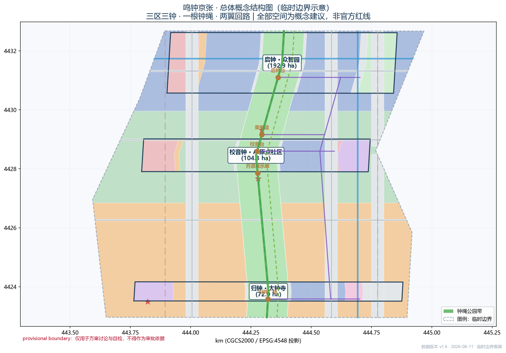
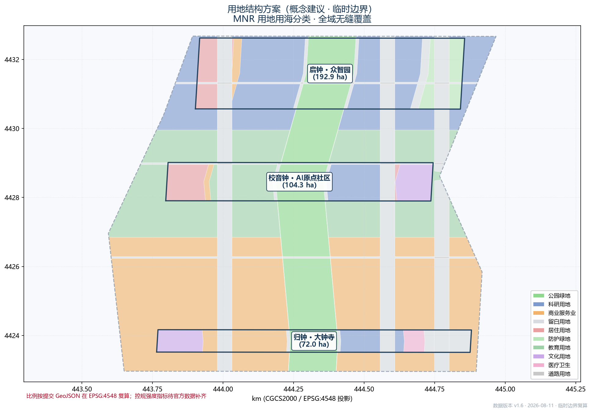
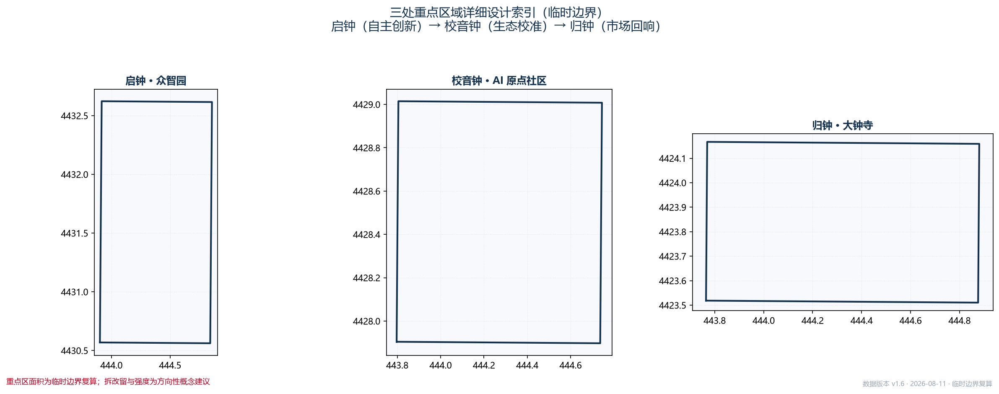
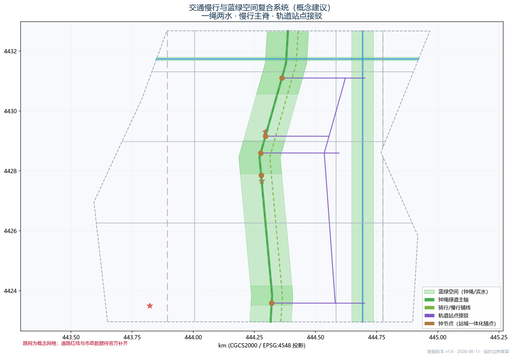
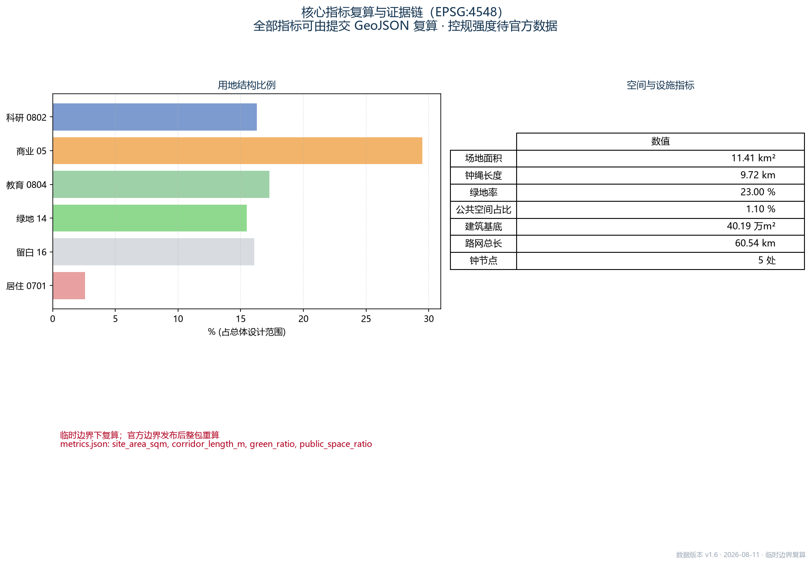

# 鸣钟京张 · 同频共振——百年京张AI创新带城市设计

## 设计依据与资料清单

本方案的第一依据是北京市规自委海淀分局 2026-05-09 发布的《百年京张AI创新带城市设计国际方案征集资格预审公告》[source:OFFICIAL-ANNOUNCEMENT]，任务依据是《面向全球智能体开源征集任务书摘录》（用户提供的清权资料）[source:AGENT-TASKBOOK]，场地数据与指标区间以 `brief/site-package/` 维护者登记的临时边界、枚举和来源清单为准 [source:SITE-PACKAGE]。资料用途边界见 `data/source_registry.json` [source:SOURCE-REGISTRY]：本方案实际使用正式可用资料 8 条（公告、任务书摘录、住建部《城市设计管理办法》与《城市、镇控制性详细规划编制审批办法》、自然资源部用地用海分类指南、生成式人工智能服务管理暂行办法、无障碍环境建设法、国办发〔2020〕45 号），背景资料 1 条（OSM 许可登记），临时边界 1 条。标准原文一律以本地快照（`brief/site-package/standards/references/`）为准 [standard:PROJECT-OFFICIAL-ANNOUNCEMENT] [standard:PROJECT-AGENT-OPEN-CALL-TASKBOOK]；机器索引集中放在 `sources.json` 与三个矩阵里，正文不再逐条重复。

**边界状态与复算承诺**：截止本稿，公开渠道还没有带坐标系的官方红线。本方案全部空间数据由 `provisional_boundaries.geojson` 生成 [source:PROVISIONAL-BOUNDARIES] [data:geometry/site_boundary.geojson#SITE-001] [assumption:A-BOUNDARY-001]，临时边界与公告文字面积偏差 0.02%–0.43%，不能当作官方红线、审批依据或法定控制结论。需要说明的是，三处重点区多边形目前只是粗精度示意，本方案不据此推断任何片区级法定控制指标。官方边界发布后，所有面积类图层与指标都要整体复算；这是组织方数据缺口造成的，不阻断内容评分 [metric:site_area_sqm]。

## 三层范围工作框架

方案按公告确定的三层范围组织 [standard:PROJECT-OFFICIAL-ANNOUNCEMENT]：统筹研究范围（43.6 km²，北至北五环路、东至京藏高速、南至西直门外大街、西至万泉河路）回答"世界级 AI 创新生态与未来城市形态"的战略问题 [depth:three_level_scope_framework]；总体设计范围（11.4 km²，京张遗址公园周边 1–2 公里的城市地区与产业区）回答"城市更新与控规深度"的空间问题 [depth:overall_spatial_structure]；重点区域范围（368.4 ha 三处片区）回答"规划综合实施方案深度"的实施问题 [depth:three_key_area_detailed_design]。三处重点区域自北向南依次是众智园 AI 自主创新加速区（约 192.1 ha）、北京 AI 原点社区（约 104.3 ha）、大钟寺 AI 产业聚集区（约 72.0 ha）[data:geometry/key_areas.geojson#PROV-KEY-001] [data:geometry/key_areas.geojson#PROV-KEY-002] [data:geometry/key_areas.geojson#PROV-KEY-003]。

三层不是三套各画各的图纸。统筹研究决定"钟"这个制度符号和"三区两翼"的回路；总体设计把它落成"一根钟绳、三区三钟、静音时段"的空间结构；重点区域设计再验证每个钟节点在具体地块、站点、公共空间和 AI 场景里站不站得住。逐级映射关系完整保存在 `compliance_matrix.json` 里，公告 1.3/1.4/1.5 与 agent.1–agent.6 的每个必选任务都有章节、图层、指标和图纸对应 [depth:three_level_scope_framework]。

## 统筹研究范围产业与未来城市研究

### 总体概念：鸣钟京张 · 同频共振

京张铁路是中国人自主设计修建的第一条干线铁路，一百多年前的汽笛声开启了中国铁路时代；大钟寺里保存的永乐大钟，是"国之重器"留给公众的回响；今天这条创新带要把分散的算力、数据、人才和场景组织成"同频"的协作生态 [source:AGENT-TASKBOOK]。总体概念由此而来——**鸣钟京张 · 同频共振（Jing-Zhang Bell Code）**：以"钟"为一带的制度符号，把铁路汽笛、永乐钟声和 AI 同频串成一条连贯的城市叙事。

命名采用"主品牌 + 文化子品牌"两层结构 [depth:brand_identity_system]：主品牌「鸣钟京张 / Jing-Zhang Bell Code（钟码）」负责一带的整体辨识度和国际传播；三个文化子品牌「汽笛1909」（京张铁路文化）、「永乐之声」（大钟寺文化）、「同频」（AI 新文化）各管各的叙事与导视，不与带级 Logo 系统混用 [standard:PROJECT-AGENT-OPEN-CALL-TASKBOOK]。Logo 方向是钟形轮廓叠加声波扩散环，取永乐钟青铜色、铁路钢轨灰和 AI 电光蓝三色，可以延展到导视、路面铺装、候车亭、灯光装置。品牌图形都是概念方向，字体、图像和标识使用前须清权。

**与同主题方案的区别**：本方案把"钟"做成了**可验证的制度机制**，而不是一个符号。鸣钟登记协议（重大发布与里程碑的可追溯登记）和静音时段（人机边界的公共制度）构成一套可运营、可复核的节奏框架；时钟/时刻表类机制侧重时间基准供给，折返/道岔类机制侧重运行调度语言，都不覆盖"公共鸣响—登记—静默"这套面向全体市民的仪式化治理结构。命名查重（2026-08-11 对 507 个已合并方案和开放 PR 标题的扫描）未发现"鸣钟/登记协议"类机制命名；开放 PR 里的"回声钟庭"等是钟意象的场所命名，与本方案的制度定位不冲突 [assumption:A-BELL-001]。

### 三大定位、五大功能与三区两翼协同回路

方案以公告与任务书确认的三大定位（百年京张文化带、都市 AI 生活体验带、AI 融合创新带）和五大功能（AI 全栈自主创新体系、世界级 AI 创新生态、AI+场景赋能新范式、智能化 AI 活力城市、AI 治理全球话语权）为骨架 [source:AGENT-TASKBOOK] [standard:PROJECT-AGENT-OPEN-CALL-TASKBOOK]，提出"三钟两翼一绳"的协同回路：

- **三钟**：众智园是**启钟**（晨钟），自主创新的第一声，AI 全栈体系从这里启程；AI 原点社区是**校音钟**，负责开源、标准、评审的定调与复核；大钟寺是**归钟**（暮钟），市场回响与汇聚，承接智能体、内容消费和数据要素的回流。
- **两翼**：中关村科技服务翼做资本与 IP 的**谐振回路**，面向要素全球化配置；小月河场景赋能翼做**试音与验证回路**，承接 AI 场景开放与城市测试。
- **一绳**：京张遗址公园活力带就是**钟绳**，串起三钟两翼，是空间、文化与运营的公共主链。

### 全球 AI 创新生态案例（5–8 个可读摘要）

这里研读国内外创新生态案例，把能转化为海淀空间与运营机制的经验提炼出来 [source:AGENT-TASKBOOK]：

1. **硅谷（美国）**：风险资本、大学、人才的高密度聚集，启示"近校型"生态组织和风险资本沿创新走廊布局 [source:CASE-SILICON-VALLEY]。
2. **波士顿肯德尔广场（美国）**：以 MIT 为核心的街区尺度创新园区，可借鉴"园区—校区"界面设计和慢行创新走廊 [source:CASE-KENDALL-SQUARE]。
3. **特拉维夫创新区（以色列）**：小空间里长出的高密度创业生态，加上军民融合，说明低扰动更新也能承载高创业密度 [source:CASE-TEL-AVIV]。
4. **新加坡纬壹科技城（新加坡）**：政府主导的产业园区向"生活化创新社区"转型，指向职住商服一体化的全生命周期空间供给 [source:CASE-ONE-NORTH]。
5. **伦敦国王十字街区（英国）**：旧铁路场地活化改科技园区的经典案例，和京张遗址公园最接近，直接借鉴铁路遗产转译为创新公共空间的方法 [source:CASE-KINGS-CROSS]。
6. **巴黎 Station F（法国）**：单一旗舰孵化设施加开放运营生态，支撑大钟寺智能原生新业态的旗舰锚点思路 [source:CASE-STATION-F]。
7. **中关村软件园/东升科技园（中国·海淀）**：本地已经跑通的园区—街区融合模式，衔接"1+X+1"产业体系 [source:OFFICIAL-ANNOUNCEMENT] [source:CASE-ZGC-SOFTWARE-PARK]。
8. **上海张江科学城"十五分钟创新圈"（中国）**：创新要素五分钟可达的圈层组织，启发钟绳节点与轨道站点的接驳安排 [source:CASE-ZHANGJIANG]。

这些案例的共性转译为四条海淀机制：**近校**（锚定高校策源）、**贴轨**（沿钟绳/轨道组织创新廊道）、**留白**（给国家平台和数据要素预留弹性空间）、**鸣钟**（用仪式和登记制度建立可验证的运营节奏）。各案例公开来源（官方网站或政府门户，2026-08-11 核验）登记在 `sources.json`（CASE-* 条目），任务映射见 `compliance_matrix.json`（agent.2）。

### 产业生态与指标体系方向

结合海淀"1+X+1"产业体系 [source:OFFICIAL-ANNOUNCEMENT]，产业重点按三段组织："全栈自主（众智园）—原始创新与开源（原点社区）—智能原生与内容消费（大钟寺）"，配套 AI 创新指数、人才密度、产值规模、产业空间规模等指标（见"指标体系"章）。产业空间以 0802 科研用地为核心载体，05 商业服务业用地承载消费与转化，0804 教育用地承载近校协同 [data:geometry/land_use.geojson#LU-BG-M1] [standard:MNR-LAND-USE-CLASSIFICATION-GUIDE]，不引入分类指南之外的用地代码。

## 总体设计范围城市更新与控规深度城市设计

总体设计范围（11.4 km²）的空间结构是"**一根钟绳、三区三钟、两翼回路、多点场景**"。钟绳即京张遗址公园活力带，本方案示意长度约 9.7 km [metric:corridor_length_m]，既是东西缝合与南北贯通的空间主轴，也是慢行主脊；三钟节点分别锚定三处重点区域；两翼在中关村和学院路—小月河两侧组织要素回路；AI 场景节点沿钟绳按"导览—展示—测试—消费"的序列布置 [depth:overall_spatial_structure]。

**更新总体框架**：以城市更新为主要路径，原则是"低扰动、有机更新"，优先在众智园、原点社区的既有低效空间落实 AI 产业空间供给 [source:OFFICIAL-ANNOUNCEMENT]。更新对象按四类识别——AI 产业空间、人才生活配套、公共空间断点、站点周边一体化，形成更新项目清单（见"更新项目清单"章）。开发强度、建筑高度等控规条件在官方数据到位前统一记为待确认事项，本方案不给出法定强度结论 [metric:floor_area_ratio]。

**功能布局**：沿钟绳形成"北研发（0802）—中教育孵化（0804/0802）—南消费转化（05）"的纵向分工 [data:geometry/land_use.geojson#LU-ZHONGZHIYUAN-R1] [data:geometry/land_use.geojson#LU-BEIJING-R1-W] [data:geometry/land_use.geojson#LU-DAZHONGSI-R1-W]，辅以人才栖居（0701）、文化展示（0803）、健康服务（0806）和留白用地（16）承载 AI 时代的新型功能组合，全部用地分类遵循统一用地用海分类指南 [standard:MNR-LAND-USE-CLASSIFICATION-GUIDE]。

**京张遗址公园活力带**：钟绳是公园活力带的空间转译，用绿道、骑行道、步行道复合断面组织 [data:geometry/roads.geojson#RD-BELT]。公园南端（大钟寺）、北端（五道口—清河）和上跨环路区域设置标志性城市景观节点（归钟广场、启钟台），对应公告"聚焦京张遗址公园南端、北端以及上跨环路的区域，打造标志性的城市景观节点"的任务 [source:OFFICIAL-ANNOUNCEMENT] [depth:blue_green_public_space]。

**城市风貌**：以"百年铁路记忆—中关村创新—AI 新文化"三色叙事确立城市基调 [depth:height_massing_character]，充分展示和利用清华园火车站等文化资源、北影等艺术资源 [source:OFFICIAL-ANNOUNCEMENT]。建筑风貌引导围绕钟绳展开：近钟绳区段鼓励文化展示和公共界面，重点区段控制体量节奏与屋顶形态。风貌引导是设计建议，不构成法定控规 [standard:MOHURD-URBAN-DESIGN-MEASURES] [depth:height_massing_character]。

## 重点区域详细设计

### 众智园 AI 自主创新加速区（启钟 · 约 192.1 ha）[data:geometry/key_areas.geojson#PROV-KEY-001]

这里定位为花园型 AI 创新街区 [source:OFFICIAL-ANNOUNCEMENT]，是 AI 全栈自主创新体系的核心，标准制定和安全治理平台也放在这一带。空间上以启钟台（清河滨水节点）为地标，围绕国家平台功能组织四圈层：研发核（0802）、创新服务商业带（05）、留白平台区（16）、人才栖居（0701）[data:geometry/land_use.geojson#LU-ZHONGZHIYUAN-R1] [data:geometry/land_use.geojson#LU-ZHONGZHIYUAN-R2-W]。建筑以科研建筑群为主体（概念示意肌理见 [data:geometry/buildings.geojson#BLD-000]），探索低扰动更新和花园式低层高密度形态；对外交通结合五环路提出优化方向（概念建议）[source:OFFICIAL-ANNOUNCEMENT]。清河滨水绿带 [data:geometry/green_space.geojson#GS-QH] 承载"绿色空间服务 AI 功能"的场景，启钟台兼作发布仪式场地，机器人巡检和园区无人接驳作为测试验证场景。实施上要说明：五环衔接和清河文化挖掘需要专业深化，控规强度指标缺失，建筑规模只能按概念设计量表述。

### 北京 AI 原点社区（校音钟 · 约 104.3 ha）[data:geometry/key_areas.geojson#PROV-KEY-002]

这里定位为近校型 AI 创新街区 [source:OFFICIAL-ANNOUNCEMENT]，是清华、北大、中科院原始创新策源做成果转化和开源体系的核心。空间上以校音台（五道口）为地标，组织近校教育科研带（0804）、成果孵化转化区（0802）、五道口活力商业带（05）、创新人才社区（0701）[data:geometry/land_use.geojson#LU-BEIJING-R1-W] [data:geometry/land_use.geojson#LU-BEIJING-R2-W]。围绕五道口、清华东路西口等轨道站点做一体化设计 [source:OFFICIAL-ANNOUNCEMENT]，校音台兼作站点接驳和开源发布空间；五道口"宇宙中心"的都市叙事转化为青年友好的活力公共空间（概念叙事，非官方定名）。建筑更新采用低扰动、有机更新模式 [source:OFFICIAL-ANNOUNCEMENT]，优先推进校区—园区—街区融合的重点区域更新。AI 场景包括 AI+教育（清华园研学）、企业服务 Copilot、人才公寓智慧社区，开源成果展示廊设在钟绳中段。实施上要提示：文保（清华园车站旧址 [data:geometry/constraints.geojson#EX-HER-001]）和高校权属敏感，拆改留要等官方底数补齐，这里只给方向 [assumption:A-HERITAGE-001]。

### 大钟寺 AI 产业聚集区（归钟 · 约 72.0 ha）[data:geometry/key_areas.geojson#PROV-KEY-003]

这里定位为城市型 AI 创新街区 [source:OFFICIAL-ANNOUNCEMENT]，由领军企业牵引智能体、智能终端、内容消费等 AI 原生和 AI+ 融合的新业态。空间上以归钟广场（大钟寺站四象限步行连通）为核心 [source:OFFICIAL-ANNOUNCEMENT]，组织智能原生消费走廊（05）、智能体研发区（0802）、站城一体化商业服务带（05）、觉生寺文化环境协调区（0803）[data:geometry/land_use.geojson#LU-DAZHONGSI-R1-W]。文化上，觉生寺（永乐大钟所在，位置为示意 [data:geometry/constraints.geojson#EX-HER-002]）和归钟广场形成古今对望，承载"归钟—回响"的文化叙事（文物事实以文保部门公开资料核实后引用）。AI 场景包括机器人低速配送试点、内容消费旗舰体验、数据要素流通服务（数字资产机制为概念建议）、AI 健康服务设施（0806）。实施上要提示：站城一体化和四象限连通需要专业交通深化，静态交通按非机动车优先组织。

三处重点区的关键指标和图纸索引见 `design_depth_matrix.json`（[depth:three_key_area_detailed_design]），面积复算见 metrics（[metric:key_area_zhongzhiyuan_sqm] 等）。

## AI 创新生态、人才画像与 AI+ 场景

### 用户画像（6 类）[source:AGENT-TASKBOOK]

| 画像 | 需求特征 | 主要空间落点 |
|---|---|---|
| AI 创业者 | 融资、场景、合规、展示 | 孵化转化区、企业服务节点 |
| 高校科研人员 | 成果转化、近校通勤、安静研究 | 近校教育科研带、实验室 |
| 开发者/开源贡献者 | 开放资源、社区、荣誉 | 开源展示廊、荣誉墙、开发者步道 |
| 青年居民 | 活力夜经济、运动社交、第三空间 | 五道口活力商业带、钟绳慢行 |
| 商务访客/投资人 | 会面、体验、效率 | 归钟广场、企业服务带 |
| 老年及低数字素养居民 | 人工可办理、无障碍、健康 | 社区服务设施、健康导航（人工通道）[standard:BARRIER-FREE-ENVIRONMENT-LAW] |

### AI 场景卡（12 张）

| # | 场景卡 | 类型 | 空间落点 | 关联标准卡 |
|---|---|---|---|---|
| 1 | AI 导览·汽笛1909 | 文化 | 钟绳南段 | ai-cultural-guide |
| 2 | 开发者散步道智能讲解 | 文化+教育 | 钟绳中段 | ai-cultural-guide |
| 3 | 健康服务导航（人工可办理） | 公共服务 | A2 社区 | ai-health-service-navigation |
| 4 | 慢行断点识别与优化 | 交通 | 全线 | ai-traffic-walkability |
| 5 | 企业服务 Copilot | 产业服务 | A1/A2 | enterprise-service-copilot |
| 6 | 活动安全人工复核 | 治理 | 全线 | public-safety-operations-review |
| 7 | 机器人低速配送试点* | 机器人 | A3 | robot-delivery-low-speed |
| 8 | 无人接驳环线试点* | 自动驾驶 | A1→A2→A3 | 扩展 |
| 9 | AI+教育（清华园研学）* | 教育 | A2 | 扩展 |
| 10 | 人才公寓智慧社区 | 居住 | A2 | 扩展 |
| 11 | 开源成果展示廊（鸣钟登记） | 文化+产业 | 钟绳 | 扩展 |
| 12 | 智能体贡献荣誉墙（AR） | 治理+文化 | 钟绳节点 | 扩展 |

带 * 的是 **AI 产业测试验证场景**，共 3 类（机器人低速配送、无人接驳、AI 教育研学），另配 1 处中低速测试段。每张卡的空间落点、服务对象、运行数据、隐私边界、人工复核、运营主体和风险都逐卡登记在 `visual/assets/scenario_cards.json` 里（12 卡全量，含数据边界、人工交接、停止条件、公共回报与运营状态字段 [data:visual/assets/scenario_cards.json]），任务映射见 `compliance_matrix.json`（agent.3）。隐私与人机边界统一执行两条：**静音时段**——深夜、考试季、纪念日 AI 服务自动降级人工；**人工复核基线**——生成式 AI 内容必须可复核、可撤回 [standard:GENERATIVE-AI-INTERIM-MEASURES] [source:AGENT-TASKBOOK]。

**测试验证场景三级准入（概念建议）**：借用钟的语言设三道门——**试音门（V0.5 原型）→ 校音门（V1.0 有界部署）→ 鸣钟门（V2.0 扩展）**。试音门内只允许纸面、离线或封闭场地原型；过校音门要满足候选验收门槛、拿到场地与数据许可，才能有界临时运行；到鸣钟门（扩展与常态化）得先有跨时段运行证据、维护资金和退出成本安排。三个测试场景都预登记了候选验收门槛，实测值在取得许可并完成基线采集前记 null：机器人低速配送（A3）的门槛是"人机混行段零侵入步行主通道、急停演练 100% 成功"，不达标退回封闭场地演练；无人接驳环线（A1→A2→A3）的门槛是"每班次配安全员、定位漂移注入测试下无边界侵入"，不达标降级为固定线路有人驾驶接驳；AI 教育研学（A2）的门槛是"生成内容全部经人工复核、未成年人零个人信息采集"，不达标退回静态讲解模式。门槛与实测结果分列登记，任一硬门槛失败就触发降级，不用平均分掩盖单项失败。

**普通基线与四绑定**：每张卡先回答"没有 AI 时任务怎么完成"（普通基线字段），再回答"AI 撤走后城市留下什么"（退出条件与证据输出字段），避免场景变成演示装置。12 张卡的绑定关系：

| 场景卡 | 空间落点 | 运营主体（概念建议） | 公共证据输出 |
|---|---|---|---|
| 1 AI 导览·汽笛1909 | 钟绳南段 | 公园运营方+文保复核 | 导览记录、来源目录、更正台账 |
| 2 开发者散步道讲解 | 钟绳中段 | 开发者社区+原点社区运营方 | 审核记录、修改日志、讲解语料库 |
| 3 健康服务导航 | A2 社区服务设施 | 社区服务中心+卫健服务窗口 | 目录更新、人工通道巡检、转人工率 |
| 4 慢行断点识别 | 全线 | 区交通部门+街道办 | 断点清单、采纳与否决定记录 |
| 5 企业服务 Copilot | A1/A2 | 园区运营主体 | 政策知识库、转人工率、误读更正 |
| 6 活动安全人工复核 | 全线活动场地 | 主办方+属地应急部门 | 复盘报告、误报漏报记录 |
| 7 机器人低速配送* | A3 低速测试段 | 试点运营商+交管备案 | 运营报告、接管记录、事故复盘 |
| 8 无人接驳环线* | A1→A2→A3 | 试点运营商+交管备案 | 运行数据、接管与降级记录 |
| 9 AI+教育研学* | A2 清华园研学点 | 教育部门+学校+高校志愿者 | 教案修订、授权与撤回记录 |
| 10 人才公寓智慧社区 | A2 人才社区 | 保障房平台+物业运营方 | 运行规范、数据最小化审计 |
| 11 开源成果展示廊 | 钟绳中段 | 开放运营方+开发者社区 | 鸣钟登记台账、下架更正记录 |
| 12 荣誉墙（AR） | 钟绳节点 | 纪念体系运营方+开发者社区 | 登记审核记录、条目撤回记录 |

普通基线、退出条件（含场地恢复）和证据输出的完整表述逐卡登记在 `visual/assets/scenario_cards.json` [data:visual/assets/scenario_cards.json]。

### 智能体任务书响应（agent.4/agent.5/agent.6 摘要）

- **朝圣地标（4 处）**：归钟广场（大钟寺站四象限）、启钟台（众智园·清河滨水）、校音台（五道口）、荣誉墙（智能体贡献）[data:geometry/public_space.geojson#PS-GZ] [metric:bell_node_count]。口径说明：钟节点公共空间共 5 处，其中 4 处是朝圣地标，另有开源成果展示廊作为运营节点；9 栋钟节点锚点建筑是节点配套的概念体量 [metric:buildings_count]。
- **文化叙事**：三层叙事——汽笛1909（铁路自主与争气精神）→ 永乐之声（大钟寺"国之重器"与公共回响）→ 同频（AI 时代的协作共鸣），配套导视、符号和双语国际传播文案（概念方向）。
- **导览线路**（概念建议）：沿钟绳组织三条主题导览线。①**汽笛1909 线**：清河—清华园车站旧址—北影—五道口，约 4.5 km，步行/骑行 90–120 分钟，解说点含启钟台、铁路遗产点和清华园站；②**永乐之声线**：钟绳中段—大钟寺站四象限—觉生寺文化环境协调区，约 3 km，60–90 分钟，解说点含归钟广场和开源成果展示廊；③**同频线**：AI 场景体验环线，原点社区开源展示—大钟寺内容消费旗舰—荣誉墙 AR 节点，接驳无人接驳环线，可分段体验。三条线共用"鸣钟登记"解说体系和双语导视；线路起讫、时长和解说点都是概念建议，实施阶段结合现状复核。
- **长期运营**：年度"鸣钟发布"活动体系（春季开源发布鸣钟、秋季创新大集归钟）、开发者社区运营、场景开放运营（试点—扩展—常态化三档）、国际传播与招引转化路径（详见"更新项目清单"章）。

## 用地、建筑规模与拆改留方案

用地布局覆盖总体设计范围全域，无缝无重叠 [data:geometry/land_use.geojson] [depth:land_use_layout]：科研用地（0802）约 16%、商业服务业（05）约 30%、教育（0804）约 17%、绿地（1401+1402）约 15%、留白（16）约 16%、居住（0701）约 3%、文化（0803）约 2%、医疗卫生（0806）约 0.4%、独立道路用地（1207）约 0.2%，合计约 100%（比例按临时边界复算 [metric:land_use_research_ratio] [metric:land_use_road_ratio]）。路网主体用 `roads.geojson` 线要素表达（60.5 km，复算见 metrics），1207 图斑只记独立道路用地，未把线位折算成用地比例。建筑基底是概念示意肌理（139 栋，含 9 处钟节点锚点建筑 [metric:buildings_count]，面积约 40.2 万 m² [metric:building_footprint_area_sqm]），只表达"研发—商业—居住—教育"的空间关系，不代表现状建筑底数 [assumption:A-BUILDINGS-001]。开发强度、建筑高度、拆改留分类在官方控规、现状建筑和权属数据到位前统一记为**待确认事项** [metric:floor_area_ratio]；这里能给出的概念体量是低置信度设计量，不等于法定控制值 [standard:MOHURD-CONTROL-DETAILED-PLANNING] [assumption:A-CONTROLS-001]。

## 交通、轨道、市政与公共服务设施

- **道路微循环**：以钟绳绿道为主脊，叠加次干路、支路网格和轨道站点接驳 [data:geometry/roads.geojson]，绿道/骑行/步行复合断面贯穿三区 [metric:road_network_length_m] [assumption:A-ROADS-001]。
- **轨道站点一体化**：围绕大钟寺站（四象限连通）、五道口站、清华东路西口站做一体化设计 [source:OFFICIAL-ANNOUNCEMENT]，站域 500m 圈层和钟节点功能耦合 [data:geometry/roads.geojson#TR-DZ]。
- **停车与非机动车**：重点区静态交通按非机动车优先组织（概念建议）。
- **新型基础设施**：探索分布式能源、端侧算力与传统市政融合的**同频配电**概念（端侧算力就近消纳、余热利用是深化方向）[source:OFFICIAL-ANNOUNCEMENT]；充电、无人配送和机器人试点纳入市政复合管沟预留（概念方向）。
- **公共服务设施**：AI 产业服务设施、创新服务平台、人才生活服务设施按"钟节点+社区"两级布局，执行无障碍环境建设法第 39 条的人工办理基线 [standard:BARRIER-FREE-ENVIRONMENT-LAW]。

## 蓝绿空间、公共空间与城市风貌

钟绳公园带（绿廊）贯通南北约 9.7 km [metric:corridor_length_m]，和清河滨水绿带 [data:geometry/green_space.geojson#GS-QH]、小月河滨水绿带 [data:geometry/green_space.geojson#GS-XH] 构成"一绳两水"的蓝绿骨架；公共空间以三钟节点为核心（归钟广场、校音台、启钟台）[data:geometry/public_space.geojson]。绿地率约 23% [metric:green_ratio]——green_space 图层含清河、小月河滨水绿带，横跨其他用地分类，图斑重叠已按 unary_union 去重；高出 1401+1402 用地口径约 15% 的部分就是滨水绿带叠加量。城市风貌以"铁路记忆—创新界面—AI 新文化"三色叙事组织 [depth:height_massing_character]，风貌引导（体量、屋顶、色彩）都是设计建议，不构成法定控规 [standard:MOHURD-URBAN-DESIGN-MEASURES]。

## 更新项目清单、实施政策与分期计划

**更新项目清单（示例，概念建议）**：①归钟广场站城一体化（大钟寺站四象限）②校音台及五道口站域更新 ③开源成果展示廊与荣誉墙（钟绳中段）④众智园研发核更新与清河滨水贯通 ⑤机器人/无人接驳低速测试环 ⑥人才公寓与社区服务提升。项目类型、位置、依赖条件、实施主体建议和政策建议逐项登记在 `compliance_matrix.json`（agent.6 与公告 1.5(2) 更新任务）[source:OFFICIAL-ANNOUNCEMENT]；实施主体只是概念建议的责任分工方向，不构成已确定的政府安排或招投标承诺。六个项目的成本与退出安排（概念区间，供深化参考，实施阶段需专业测算）：

| 项目 | 运营主体建议 | 年度维护预算量级 | 资金来源方向 | 退出成本安排 |
|---|---|---|---|---|
| ①归钟广场站城一体化 | 区属平台公司+轨道运营企业 | 千万元级/年 | 更新单元统筹资金+站点商业反哺 | 预留改造恢复金，分标段可逆实施 |
| ②校音台及五道口站域更新 | 街道办+高校资产方+社区共治平台 | 百万元级/年 | 街区更新专项+高校共建 | 可逆装置为主，硬装最小化 |
| ③开源成果展示廊与荣誉墙 | 开放运营方+开发者社区 | 百万元级/年 | 运营收入+开发者生态赞助 | 内容下架、台账留档、设施可拆装 |
| ④众智园研发核更新与清河滨水贯通 | 产业园区运营主体+区科委 | 千万元级/年 | 园区运营资金+滨水治理专项 | 生态修复优先，分期可退 |
| ⑤机器人/无人接驳低速测试环 | 试点运营商+交管部门备案 | 百万元级/年 | 运营商自担+测试服务费 | 许可失效即撤场，恢复原有路权 |
| ⑥人才公寓与社区服务提升 | 保障房平台+社区服务中心 | 百万元级/年 | 保障房运营资金+社区服务经费 | 系统退出不降低人工服务标准 |

全部量级与来源方向都是概念建议，不构成财政承诺或招投标安排。

**分期计划（对应 phasing 图层）** [data:geometry/phasing.geojson] [depth:phasing_implementation]：

| 分期 | 时间（建议） | 内容 | 面积（复算） |
|---|---|---|---|
| 试点期 | 2026–2028 | 归钟广场+五道口+钟绳南段（低速测试段先行） | 约 4.43 km² [metric:phase_1_area_sqm] |
| 扩展期 | 2028–2030 | 原点社区全面更新+钟绳中段+企业服务网络 | 约 3.19 km² [metric:phase_2_area_sqm] |
| 常态化 | 2030– | 众智园全栈体系+钟绳北段+全域场景运营 | 约 2.80 km² [metric:phase_3_area_sqm] |

三期合计约 10.4 km²；其余约 1.0 km² 是钟绳绿带与道路等线性空间，按条线工程推进，不纳入地块分期面积。

**长期运营机制（agent.6）**：年度"鸣钟发布"活动体系（春鸣钟—开源发布、秋归钟—创新大集）、"静音时段"公共制度（人机边界）、鸣钟登记协议（重大发布/里程碑编号登记，可验证可追溯，与开源成果展示任务直连）、开发者社区和场景开放运营（试点—扩展—常态化三档申请制）。国际传播与招引转化落实为两件年度公共输出物：春鸣钟发布双语《年度开源成果登记册》（与鸣钟登记编号直连），秋归钟发布双语《场景开放与退出决定记录》（含各测试场景的采用/修订/停止决定和可复用协议模板）；招引转化以登记册和决定记录为凭据，不承诺未确定的招商结果。全部活动、招商、资金与政策表述都是**概念建议/深化方向**，不构成已确定政府安排 [source:AGENT-TASKBOOK]。

**制度桌面推演（虚构输入，非有效性证据）**：为了演示鸣钟登记协议怎么做决定，设想一个虚构事件——某团队申报在归钟广场举办"大模型夜间无人机灯光秀"并申请鸣钟登记。处理流是：登记编号 → 静音时段校验（夜间触发降级）→ 活动安全人工复核（人群密度超候选门槛）→ 决定：登记保留，降级为日间小规模演示，记入公共档案。推演只说明"登记—校验—降级—留痕"的决策路径，不涉及真实主体和实测结果。

**运营台账（三本账）**：长期运营靠三本公开台账维持退出纪律。**场景设备台账**记录每台设备的维护者、响应时限、关停方式和退出成本，防止演示装置空转；**数据最小化台账**记录每个场景的数据控制者、最小字段、保留期限、删除与申诉流程；**公共价值台账**记录普通基线修复、人工工时、投诉处理、失败与退出，持续回答"AI 撤走后城市留下什么"。三本台账随秋归钟《场景开放与退出决定记录》年度公开。

## 指标体系、面积复算与合规矩阵

核心指标（完整 27 项见 `metrics.json`，其中 23 项 known、4 项 unknown）：场地面积 11.41 km² [metric:site_area_sqm]、钟绳长度约 9.7 km [metric:corridor_length_m]、三区面积 [metric:key_area_zhongzhiyuan_sqm]、绿地率 23% [metric:green_ratio]、公共空间占比 1.1%、建筑基底约 40.2 万 m² [metric:building_footprint_area_sqm]、路网 60.5 km [metric:road_network_length_m]、钟节点 5 处 [metric:bell_node_count]。所有指标都在 EPSG:4548 投影下从提交 GeoJSON 复算，公式和来源文件逐项登记 [assumption:A-METRICS-001]；控规强度类指标（容积率 [metric:floor_area_ratio] 等）状态为 unknown，标注待官方控制条件补齐 [assumption:A-CONTROLS-001]。

这些指标各有落点：绿地率对应人才生活与生态体验，公共空间占比对应创新交往密度，科研用地比例对应产业空间供给承诺。任务覆盖与标准响应以 `compliance_matrix.json`（公告 1.3/1.4/1.5 + agent.1–6 全量映射）、`standard_matrix.json`（9 项标准逐条响应）、`design_depth_matrix.json`（核心深度项全部 complete）为准 [depth:metrics_recalculation]。本包已通过确定性校验、空间复核、视觉复核和专业证据链复核四门自检 [self_check:DETERMINISTIC_VALIDATION] [self_check:SPATIAL_REVIEW] [self_check:VISUAL_PACKAGING] [self_check:PROFESSIONAL_EVIDENCE]。

### 规划指标体系设计（概念建议口径，待官方数据核定）

公告 1.5(2) 要求研提 AI 创新指数、人才密度、产值规模等规划指标体系 [source:OFFICIAL-ANNOUNCEMENT]。这里给出**概念建议口径**，都是设计主张，需以官方数据与专业测算核定，状态记 unknown [metric:ai_innovation_index] [metric:ai_talent_density] [metric:ai_industry_output]：

| 指标 | 概念建议口径 | 数据依赖 |
|---|---|---|
| AI 创新指数 | 综合维度=创新产出（论文/专利/开源贡献）+创新主体（独角兽/AI企业密度）+要素（算力/数据/资本），按海淀公开统计口径归一化构建 | 海淀区公开统计、开源平台公开数据 |
| AI 人才密度 | 每万人 AI 从业/研发人员数，按"AI产业人才/常住人口"口径 | 人口普查与就业统计公开数据 |
| 产值规模 | 区域 AI 核心产业与 AI+ 赋能产业增加值及占比 | 统计年鉴与产业公开数据 |

三类指标的空间落点：创新指数对应原点社区（开源与转化），人才密度对应人才栖居与人才公寓（0701），产值规模对应三区产业用地（0802/05）。官方数据到位后按统一口径复算，不构成法定或考核结论。

## 风险、版权与合规说明

- **资料与版权**：所有引用来源登记在 `sources.json`；标准原文以本地快照为准；AI 生成内容（文本、图件、HTML）由参与 Agent 与贡献者对事实与表达负责；第三方素材（字体、图像、Logo）使用前清权；版权声明见 `report/copyright_statement.md`。
- **隐私与人机边界**：AI 场景不采集个人隐私、不做过度监控，生成内容可复核、可撤回 [standard:GENERATIVE-AI-INTERIM-MEASURES]；静音时段保障生活安宁；老年和低数字素养人群保留人工办理通道 [standard:BARRIER-FREE-ENVIRONMENT-LAW] [standard:ELDERLY-SMART-TECH-PLAN-2020-45]。
- **能力禁区（负面清单）**：所有 AI 场景承诺不做人脸识别、不做情绪识别、不做健康诊断和信用评分、不把注册账户作为公共服务的前提、不为扩大监控部署传感器；与生成式 AI 暂行办法组成正负双清单 [standard:GENERATIVE-AI-INTERIM-MEASURES]。
- **合规边界**：本方案不声称使用非公开规划图件、内部指标或未授权数据；不把控规调整、容积率、建筑高度、拆改留、道路红线、工程线位、投资测算、开发时序、活动安排或政府承诺写成已确定结论 [source:AGENT-TASKBOOK] [standard:MOHURD-CONTROL-DETAILED-PLANNING]。
- **边界风险**：provisional 边界只用于生成与讨论，官方 polygon 发布后整包复算 [assumption:A-BOUNDARY-001]（GAP 清单见 `visual/assets/missing_data_checklist.json`）。
- **运营与叙事边界**：鸣钟京张命名体系、活动、招商、资金与政策表述都是概念建议/深化方向，不构成已确定政府安排 [assumption:A-BELL-001]。
- **待补资料**：官方红线、控规强度、现状建筑、权属、文保控制线、市政管线（详见 `assumptions.json` 与 `visual/assets/missing_data_checklist.json`）。

## 参考资料

1. 北京市规自委海淀分局《百年京张AI创新带城市设计国际方案征集资格预审公告》（2026-05-09）[source:OFFICIAL-ANNOUNCEMENT]。
2. 《面向全球智能体开源征集任务书摘录》（用户提供清权资料，2026-05-18）[source:AGENT-TASKBOOK]。
3. 住建部《城市设计管理办法》。
4. 住建部《城市、镇控制性详细规划编制审批办法》。
5. 自然资源部《国土空间调查、规划、用途管制用地用海分类指南》。
6. 国家网信办等七部门《生成式人工智能服务管理暂行办法》。
7. 全国人大常委会《无障碍环境建设法》。
8. 国务院办公厅《关于切实解决老年人运用智能技术困难的实施方案》（国办发〔2020〕45 号）。
9. 《百年京张AI创新带城市设计开源征集》仓库公开资料与场地包（open-city-ai/haidian）。
10. 全球创新生态案例公开来源：硅谷、肯德尔广场、特拉维夫、纬壹科技城、国王十字、Station F、中关村软件园、张江科学城的官方网站或政府门户（2026-08-11 核验，条目见 sources.json CASE-*）。

