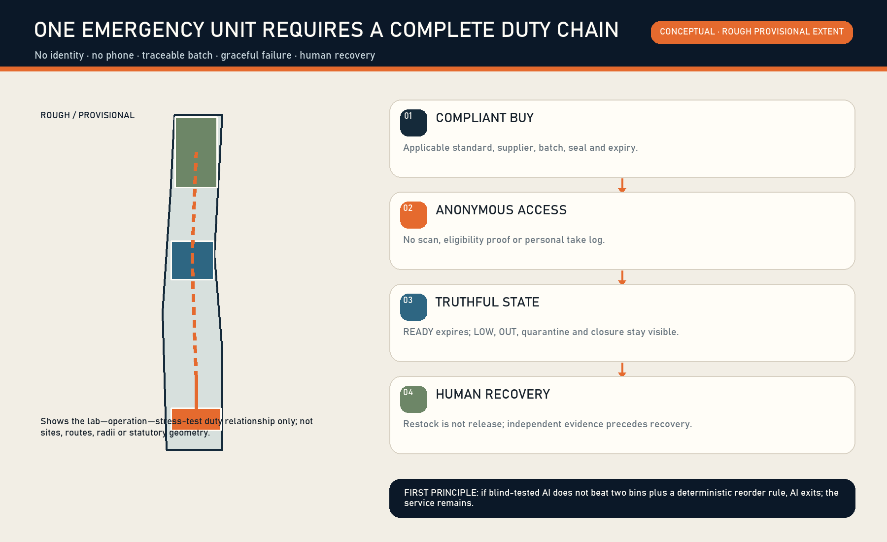
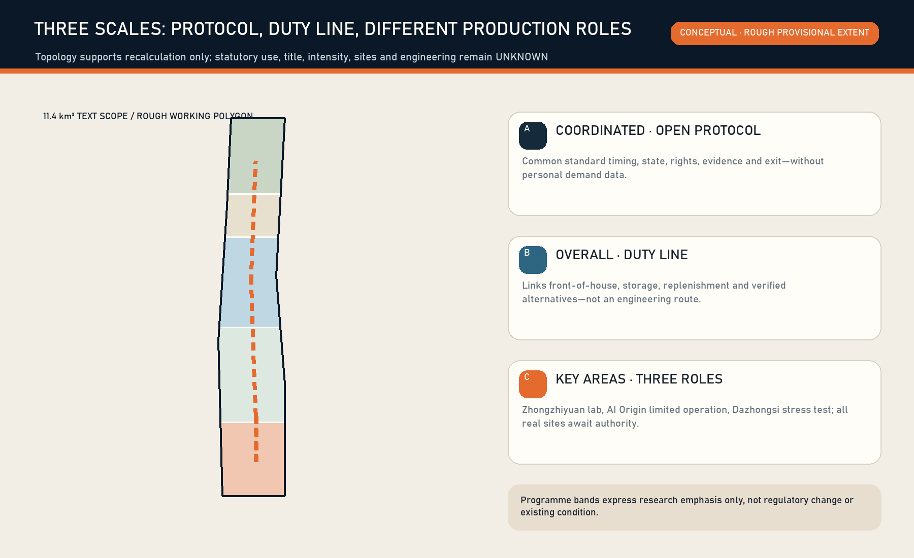
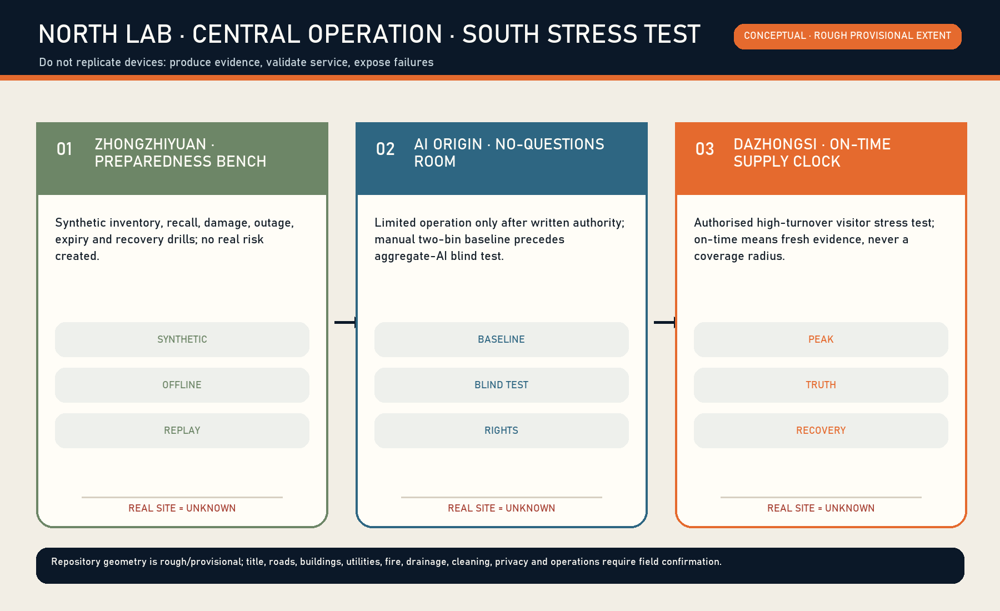
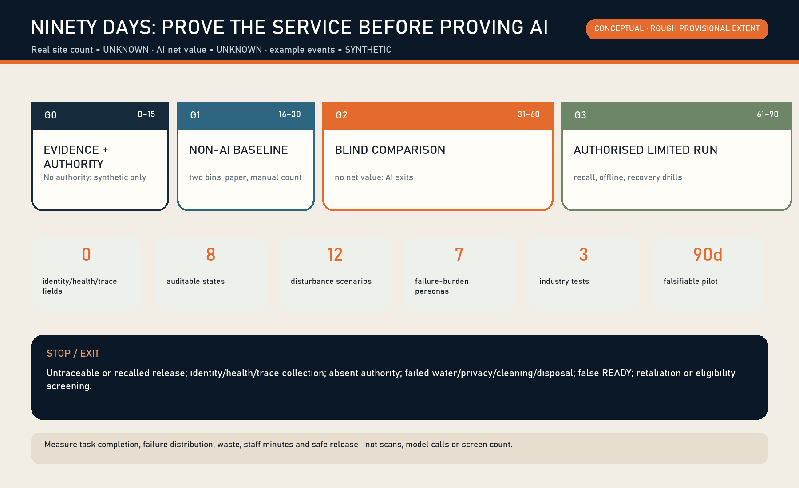
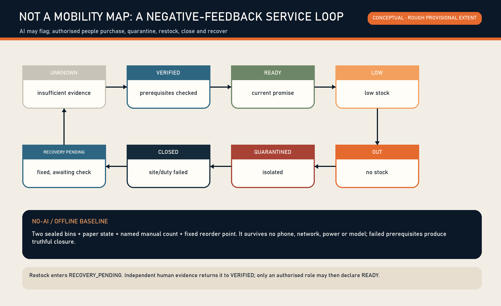

# THE DIGNITY SUPPLY LINE

## Period-care reliability infrastructure for an AI-native city

THE DIGNITY SUPPLY LINE is not a menstrual app, a health profile, or a vending-machine proposal. It answers one narrow public question: when someone unexpectedly needs a period product in a public or shared place, can they obtain one currently compliant, sealed and in-date emergency unit without proving identity, disclosing cycle or health information, or depending on a phone—and can shortage, damage, expiry or recall be recovered by an accountable role?

The proposal accepts a hard falsification rule. Without AI, two sealed bins, a paper status card, a named manual count and a deterministic reorder point must still deliver the minimum service. AI enters limited operation only if a blind comparison reduces stockout during open periods without increasing waste, unsafe release, prohibited data fields or staff minutes. Otherwise AI exits and the service remains [data:simulation.json#non_ai_baseline] [metric:ai_net_value].

> **Status**: this is an open co-creation formal v2 proposal. Exact official polygons for the overall site and three key areas have not been published. Every spatial layer uses the repository's rough provisional working geometry and is low-confidence and conceptual-only. No real point, site consent, operator, supplier or government commitment is claimed. Dazhongsi is a taskbook name; the current rectangle is not an official Dazhongsi boundary [source:SITE-PACKAGE] [source:AGENT-TASKBOOK] [assumption:A-BOUNDARY-001].

## 01 | Irreducible public harm and the service atom

Period needs can be sudden. Failure to obtain a product may interrupt work, study, visits or public activity; impose extra purchase time and expense; and create avoidable embarrassment and exclusion. WHO frames menstrual health across the life course and includes access to suitable products as well as water, sanitation and disposal. UNICEF similarly connects dignity, facilities and programme evaluation [source:WHO-MENSTRUAL-HEALTH-2022] [source:UNICEF-MHH-GUIDANCE]. These sources establish public value; they do not prove that any Jingzhang venue is ready.

The single service atom is:

`compliant procurement → batch/expiry registration → dry sealed storage → anonymous taking → named manual count → LOW/OUT/damage/recall → accountable restock or quarantine → qualified human recovery verification`

“A unit exists” does not mean the service is READY. The minimum spatial contract also includes handwashing water, basic privacy, appropriate cleaning and disposal, legible status information and a role able to handle shortage, recall and closure. If one prerequisite fails, the point is CLOSED or UNKNOWN—not permanently green [data:simulation.json#states].

On 12 August 2026, GB/T 8939-2018 remains the current Chinese national standard for sanitary pads. GB/T 8939-2025 has been published but takes effect on 1 January 2027. Procurement must therefore confirm the applicable standard when each batch enters; this proposal is not product certification [source:SAMR-GBT8939-2018] [source:SAMR-GBT8939-2025] [assumption:A-STANDARD-001].

The Beijing Measures for the Administration of Public Toilets provide local responsibility interfaces for setup, maintenance, cleanliness, intact facilities, service standards/contact information, faults and closure notices. They do not require government to provide free period products. This proposal suggests only a small pilot by venues or operators that voluntarily accept procurement and operating responsibility; it invents no government duty, unified community delivery or existing partnership [source:BEIJING-TOILET-MANAGEMENT-2021].

## 02 | Evidence hierarchy, three scales and why Jingzhang

The text-defined scopes—about 43.6 km² of coordinated research, 11.4 km² of overall design and about 368.4 ha across three key areas—come from the notice and taskbook. Submitted geometry may support generation, checks and discussion only; it is not a statutory redline, approval, survey or exact siting basis [source:OFFICIAL-ANNOUNCEMENT] [source:AGENT-TASKBOOK] [data:geometry/site_boundary.geojson#SITE-001] [metric:site_area_sqm].

Jingzhang is relevant not because machines should line a railway, but because the railway's durable organisational logic is traceable supplies, accountable handovers, isolation of anomalies and truthful operating states. An AI innovation belt that displays frontier models while basic bodily needs at work, study and public visits still depend on awkward personal requests is an incomplete “future city”. This proposal makes logistics, maintenance and often invisible care labour visible urban-design objects.

| Scale | Design action | Claim deliberately not made |
|---|---|---|
| Coordinated research | A portable anonymous-supply protocol, quality gates, accountable roles and aggregate evaluation | No claim of a real demand heatmap or existing network |
| Overall design | Connect responsibility with public space, work/learning venues, back-of-house paths and verified alternatives | No statutory point, service radius or user trace |
| Three key areas | Zhongzhiyuan: synthetic inventory/recall lab; AI Origin: authorised work/learning pilot; Dazhongsi: authorised high-turnover visitor stress test | Rough rectangles and concept nodes are not real sites |

The nine formal GeoJSON layers remain, but land-use partitions, lines, green/public space, modules and phases visualise a service-production relationship only. Development intensity, title, road redlines, utilities, fire, drainage and heritage remain UNKNOWN [depth:three_level_scope_framework] [depth:three_key_area_detailed_design] [assumption:A-CONTROLS-001].

## 03 | Seven people, designed by failure burden—not marketing profiles

The proposal never asks who is menstruating. It asks who bears what burden when service fails [data:simulation.json#personas].

1. **A visitor without a phone, or refusing a QR code**: digital access cannot become eligibility proof; mechanical access and paper status remain.
2. **Night cleaning and property staff**: they may be unable to leave work to purchase products and may inherit invisible restocking labour; shifts and minutes must be visible.
3. **Interns and new employees**: nobody should explain a body condition to a supervisor; employer, identity and reason are not recorded.
4. **Students, conference participants and short-stay visitors**: they need legible information and an objective issue route, not an informal favour.
5. **People with visual, cognitive or language-reading limitations**: QR-only, small type and colour-only states are insufficient.
6. **Counters and restockers**: the service must not add unpaid labour; manual minutes, shift handover and duplicate entry are core measures.
7. **Purchasing and quality roles**: without batch, expiry and recall evidence they cannot be accountable; AI cannot sign for them.

The AI scene processes aggregate public-service state, not bodies. Permitted data are point ID, aggregate time band, count, expiry band, replenishment lead-time band and staff minutes. An algorithm or model may flag a stock trend, record conflict or ageing task, but each recommendation meets human verification in the real venue workflow. Space, industry and governance share one interface: the public face protects anonymous access, the back-of-house face protects batch custody and labour accountability, and audit sees aggregate evidence only. The model creates no individual demand prediction or health judgement and never releases stock; the non-AI baseline, blind test and exit gate prove whether the AI scene deserves to remain [data:simulation.json#baseline_protocol] [metric:ai_net_value].

Public rights include anonymous access, digital refusal, privacy, truthful status, safe-product boundaries, complaint without retaliation and informed closure. Phone-number gates, individual take logs, camera-based demand estimation and employer-based rationing violate the contract [data:simulation.json#rights] [metric:identity_field_count].

## 04 | Control engineering: state, authority and negative feedback

The controlled object is not a person or a body condition. It is the **promise state of a supply point**. The state machine has UNKNOWN, VERIFIED, READY, LOW, OUT, QUARANTINED, CLOSED and RECOVERY_PENDING [data:simulation.json#states] [metric:operational_state_count].

- `UNKNOWN → VERIFIED`: an operator signs prerequisite evidence, but no public availability promise is made yet.
- `VERIFIED → READY`: a designated counter verifies batch, seal, expiry, count, spatial prerequisites and time band.
- `READY → LOW/OUT`: manual count or a deterministic threshold triggers a truthful downgrade.
- `any usable state → QUARANTINED`: damage, expiry, traceability conflict or recall lead appears; AI cannot release it.
- `any operating state → CLOSED`: water, privacy, cleaning/disposal, venue or duty fails.
- `LOW/OUT/QUARANTINED/CLOSED → RECOVERY_PENDING`: restock, removal or correction is recorded, but green is still prohibited.
- `RECOVERY_PENDING → VERIFIED`: an independent designated checker verifies recovery evidence before an authorised role may return to READY.

Evidence expiry is essential negative feedback. Without a fresh manual receipt at the agreed interval, READY falls to UNKNOWN. Failure, stops, refusal, false alerts, missing data and closure must remain visible. The minimum event schema contains only point, event, aggregate time band, role, batch reference, aggregate count and evidence reference. It forbids names, phones, accounts, faces/images, cycle/health data, individual trajectories, employers and individual take logs [data:simulation.json#properties].

The RACI separates recommendation from action. A venue/property operator is accountable for permission and scope; a purchasing operator for procurement and quality chain; designated people for count, restock, quarantine and recovery verification; a supplier/quality role for recalls. AI advises aggregate forecast or record conflict only [data:simulation.json#tasks].

## 05 | Reversible spatial kit and belt structure

The spatial unit is not a screen. It is a small, removable and repairable kit:

1. **Anonymous mechanical access face**: non-powered and no mandatory QR; one emergency unit without personal eligibility.
2. **Dry sealed storage face**: batch and expiry are verifiable by staff; reserve stock is protected.
3. **Paper state and duty card**: text plus icon for READY/LOW/OUT/QUARANTINED/CLOSED, last manual time band and accountable contact.
4. **Water, privacy, cleaning and disposal gate**: product stock alone never creates READY.
5. **Back-of-house handover face**: shift receipt, quarantine container and recovery evidence away from public movement.
6. **Power/network-free mode**: two bins, paper log and an on-site role deliver minimum continuity.

The concept line links Zhongzhiyuan—AI Origin—Dazhongsi as “lab—limited operation—stress test”. It is not a road, delivery alignment, user trace or service radius [data:geometry/roads.geojson#ROAD-001] [metric:service_reliability_line_length_m]. Real replenishment may be performed by an internal procurement/property role or a lawfully contracted supplier. Individuals participate through anonymous taking and object-level fault reporting only; they do not certify products, restock on behalf of government or assume operator duties.

## 06 | Twelve disturbance scenarios

Scenarios start with failure, not feature menus [data:simulation.json#scenarios] [metric:scenario_card_count].

| # | Disturbance | Minimum response | AI boundary |
|---:|---|---|---|
| 01 | Need without a phone | Anonymous mechanical access + paper state | No person recognition |
| 02 | Peak-period LOW | LOW + human restock | Suggest order only |
| 03 | No night restocker | Truthful OUT/CLOSED + verified alternative | Never invent alternatives |
| 04 | Damaged seal | QUARANTINED + human removal | No quality release |
| 05 | Near/past expiry | Block release + procurement handling | Cannot alter expiry |
| 06 | Batch recall | Isolate batch + human recovery verification | Cannot lift recall |
| 07 | Network outage | Two bins, paper, duty/phone | Local minimum remains |
| 08 | Power outage | Non-powered access or truthful CLOSED | No unsafe bypass |
| 09 | Digital refusal | No QR, account or reason | Rights do not degrade |
| 10 | Water/cleaning/disposal failure | CLOSED | Stock is not READY |
| 11 | Expired status evidence | READY falls to UNKNOWN | No permanent green |
| 12 | AI false/missed alert | Human rule prevails; score the error | AI may exit |

Every card is rehearsed synthetically at Zhongzhiyuan before consideration at an authorised point. Tests never release an unsafe product or manufacture a real privacy incident.

## 07 | Agent.1—agent.6 under constraints

**agent.1 generation** derives three-scale space and the 90-day plan from task, provisional geometry, current standards, rights and failure scenarios; it creates no statutory control.
**agent.2 case learning** borrows public-value framing from WHO/UNICEF; provenance and explicit uncertainty from Open Food Facts; custody history from Snipe-IT while forbidding personal issue tracking; issue/status semantics from Open311; and constrained offline audit from ODK. It imports no foreign authority, data or code [data:simulation.json#cases].
**agent.3 industry validation** covers product procurement/quality, facility operations/cleaning, and responsible AI/service design with pass and stop gates [data:simulation.json#tests] [metric:industry_test_count].
**agent.4 personas** turns seven failure burdens into twelve disturbance scenarios.
**agent.5 option evaluation** compares vending-first, two-bin/manual and aggregate-AI options; the smallest-data, lowest-failure-cost baseline wins by default.
**agent.6 dynamic optimisation** may use aggregate time bands, counts and staff minutes only; it creates no individual demand prediction.

The AI interface is flag—verify—human action—receipt—expiry. It controls no lock, purchase or product release. The service remains when the network, model or digital consent disappears.

## 08 | Public GitHub projects as a method library

The proposal studies four primary repositories: Open Food Facts for provenance and explicit uncertainty; Snipe-IT for custody and state history; Open311 for object issues, accountable organisations and status updates; ODK Collect for offline constrained repeatable audits [source:OPENFOODFACTS-METHOD] [source:SNIPEIT-METHOD] [source:OPEN311-SCHEMA-METHOD] [source:ODK-COLLECT-METHOD].

It explicitly does not import product/user records, track individual taking, copy foreign agency structures or SLAs, copy code/visuals, or treat community editing as product certification. The library improves source, state, offline and responsibility structure; reputation is not evidence.

Issue #1974's functional-convergence audit compares beneficiary, end-to-end task, spatial carrier, named human decision and failure outcome. Existing repository schemes cover toilet opening/cleaning/accessibility, women's routes or backstage labour. DIGNITY SUPPLY's distinct controlled chain is product standard/batch—anonymous access—restock—recall—human recovery. If a prior proposal with the same chain is found, this submission must explain substantive difference or stop, not rename.

## 09 | Three industry tests and the non-AI baseline

**Product quality and procurement**: can a named buyer demonstrate applicable standard, supplier, batch, seal, expiry and recall handling? Untraceable stock stops.
**Facility operation and cleaning**: can water, privacy, storage, cleaning/disposal, count, restock and truthful closure work across shifts? A missing duty keeps the real point UNKNOWN.
**Responsible AI**: can aggregate forecasting beat two-bin and deterministic reorder without added waste, unsafe release, privacy risk or workload? If not, AI exits.

The 15-day non-AI baseline uses two sealed bins, paper READY/LOW/OUT state, named daily count and a fixed reorder point. It measures open-period stockout minutes, expired/damaged units, wasted units, staff minutes, unsafe-release count and unresolved-state age—not people [data:simulation.json#minimum_metrics].

The blind test permits six inputs only: point ID, aggregate time band, aggregate count, expiry band, replenishment lead-time band and open/closed state. Evaluators do not see the method label. Because there is no authorised real point yet, authorised site count and AI net value remain UNKNOWN. Synthetic examples are not public performance [metric:authorized_real_pilot_site_count] [metric:ai_net_value].

## 10 | Ninety days, twelve weeks and a cost envelope

**G0, days 0–15—evidence and authority**: written site permission; accountable and responsible roles; current standard check; procurement/storage; water, privacy, cleaning/disposal, accessibility and complaint routes; zero prohibited fields. Missing a critical item means synthetic work only.
**G1, days 16–30—non-AI baseline**: two bins, paper state, manual counts and damage/expiry quarantine. An unstable service does not receive AI.
**G2, days 31–60—synthetic/aggregate blind test**: compare manual, deterministic and aggregate-AI methods against pre-agreed criteria. Privacy expansion, unsafe release or no net value removes AI.
**G3, days 61–90—authorised limited operation**: only at a written-authorisation point; rehearse recall, network/power loss, state expiry, closure and recovery. Independent recovery evidence precedes READY [data:simulation.json#gates].

The twelve-week table assigns evidence to a pilot convenor, site manager, stock/quality role, evaluation lead and independent reviewer. These are role definitions, not invented organisations or partnerships [data:simulation.json#weeks].

No precise total is fabricated. The envelope covers compliant stock; cleanable non-powered bins/mechanics; paper/accessibility information; count/restock/cleaning/quality/recovery labour; training and drills; optional local software after G2; insurance/legal/contingency; and exit/remaining-stock handling. Obtain at least two comparable quotes for material items and set a ceiling only after scope and baseline labour are known [data:simulation.json#cost_buckets].

Immediate stops are untraceable or recalled product release; identity/health/trajectory collection; missing authority; failed water/privacy/cleaning/disposal; false READY; retaliation; and eligibility screening.

## 11 | Culture, landmarks and an ecosystem that honours maintenance

The centennial Jingzhang story is not only speed. It is dispatch, inspection, handover and punctuality. Three conceptual honour nodes express that culture:

- **Zhongzhiyuan Preparedness Bench**: synthetic recall, outage and evidence-expiry tabletop exercises, never personal demand data.
- **AI Origin No-Questions Room**: if authorised, “no explanation, no scan” becomes the spatial promise; non-AI and AI blind results are shown.
- **Dazhongsi On-Time Supply Clock**: if authorised, a high-turnover visitor test displays the last human verification band and truthful state. “On time” means evidence is not stale, not a service radius.

A **Maintenance Contribution Ledger** records only authorised organisational/role contributions, repairs and public method versions. It records no recipient and ranks no individual worker. An annual Open Maintenance Day rehearses quarantine, paper degradation and recovery, making procurement, cleaning, replenishment and quality work visible AI-city culture [depth:blue_green_public_space] [depth:height_massing_character].

The ecosystem links compliant manufacturing/supply, venue/property operations, accessibility/service design, privacy engineering, offline software, evaluation/audit and open-source communities. What may be opened is synthetic test specification and aggregate evaluation—not bodies or personal consumption data.

## 12 | High availability, risk, long-term operation and exit

Minimum availability means that without a phone, network, electricity or model, someone can still take a unit anonymously or receive truthful OUT/CLOSED information. Conflicting batch/expiry evidence means quarantine; absent duty means UNKNOWN; an alternative appears only after current verification. AI is not a single point of failure [data:simulation.json#digital_refusal].

| Risk | Control | Remaining uncertainty |
|---|---|---|
| Quality/recall | batch, seal, expiry, quarantine, human recovery | real supplier and purchasing rules unconfirmed |
| Stockout/waste | two-bin baseline, fixed threshold, aggregate blind test | no authorised real demand data |
| Privacy/stigma | zero identity fields, no scan eligibility, no individual log | observe informal questioning in a real site |
| Invisible labour | staff minutes, shift handover, workload stop gate | real roster/labour agreement unknown |
| False state | evidence expiry to UNKNOWN, paper state, independent recovery | local verification interval to agree |
| Spatial prerequisite | water/privacy/cleaning/disposal veto | real engineering condition unknown |
| No AI value | non-AI first; failed blind test removes AI | net value currently UNKNOWN |
| Functional convergence | recurring Issue/PR/code review | community evolves daily |

Long-term operation uses a versioned public protocol. Quarterly review covers current standard, rights, failure distribution, waste, staff minutes and complaints; annual independent review decides continuation, reduction or removal of AI. Funding could be an authorised venue operation budget, an employer/park public-service budget or compliant social cooperation. Until agreed, each remains an option—not a government allocation or sponsor commitment.

If a point stops: mark CLOSED immediately; handle usable and quarantined stock; remove reversible components; delete any prohibited data collected in error; and publish reason and unresolved actions. Failure is evidence, not a communications defect.

## 13 | Reproducible package, copyright and professional deepening

The package contains nine GeoJSON layers, EPSG:4548 recalculated metrics, source/assumption/standard/depth/compliance matrices, an eight-state machine, RACI, rights ledger, event schema, synthetic receipts, twelve scenarios, seven personas, three industry tests, ninety-day gates, a twelve-week table, a cost envelope, five bilingual figure families, offline bilingual HTML and Chinese/English A3/A0 PDFs. `[source:]`, `[data:]`, `[metric:]`, `[standard:]` and `[depth:]` connect narrative and machine evidence.

Before implementation, obtain canonical site/key-area geometry; building/title/control-plan/road/utility/fire/drainage/heritage evidence; real site consent; procurement and supplier quality duties; dry storage, water, privacy, cleaning/disposal and accessibility review; named count/restock/quarantine/recovery roles; labour and complaint protections; comparable quotes; and data-protection/exit agreements [depth:risk_missing_data] [data:geometry/constraints.geojson#CONSTRAINTS].

This proposal claims no official approval, government commitment, real READY point, real service radius, demand heatmap, health improvement or proven AI superiority. External sources are cited only for their stated method/rule use. No external image, map tile, font, code or personal data enters the package. See `sources.json` and `report/copyright_statement.md` for provenance and limits.

## Reference entry points

- [source:OFFICIAL-ANNOUNCEMENT] Official qualification notice
- [source:AGENT-TASKBOOK] AI-agent open-call taskbook
- [source:SITE-PACKAGE] Repository site package, provisional geometry and missing-data record
- [source:SAMR-GBT8939-2018] and [source:SAMR-GBT8939-2025] product-standard timing
- [source:WHO-MENSTRUAL-HEALTH-2022] and [source:UNICEF-MHH-GUIDANCE] menstrual health, dignity and facilities methods
- [source:BEIJING-TOILET-MANAGEMENT-2021] local operation-duty interface
- Machine indexes: `sources.json`, `assumptions.json`, `metrics.json`, `compliance_matrix.json`, `standard_matrix.json`, `design_depth_matrix.json` and `simulation.json`
