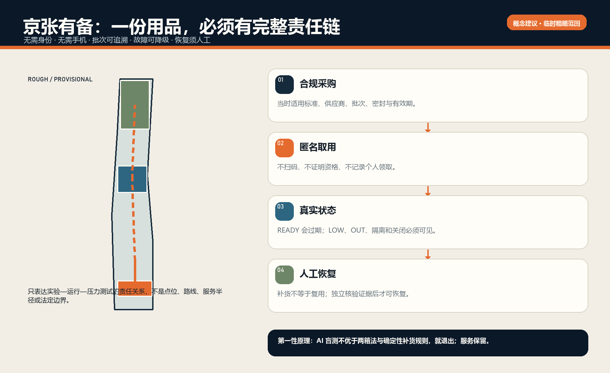
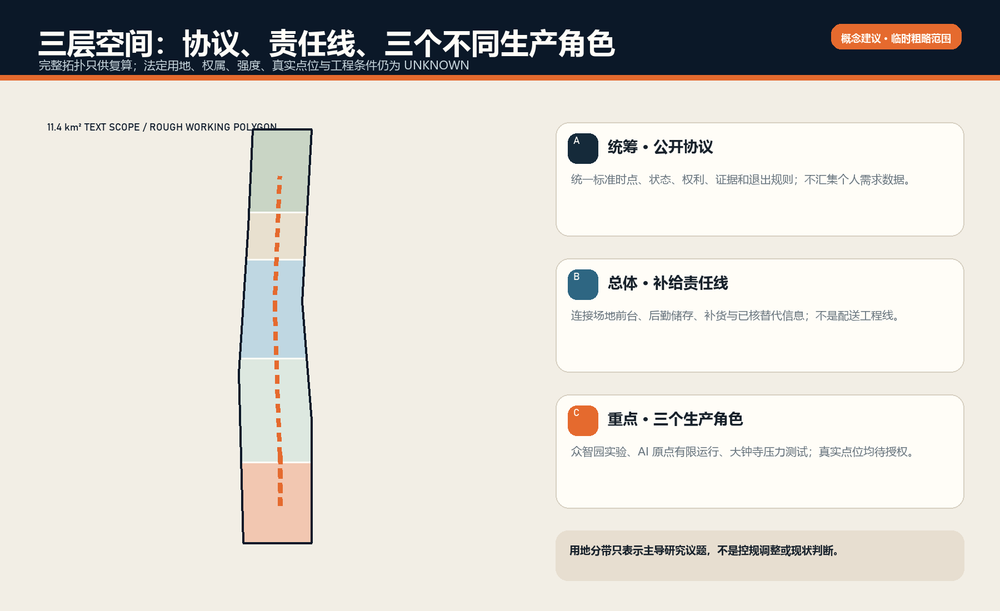
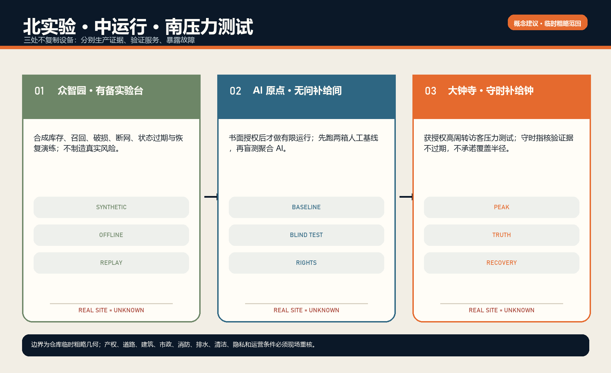
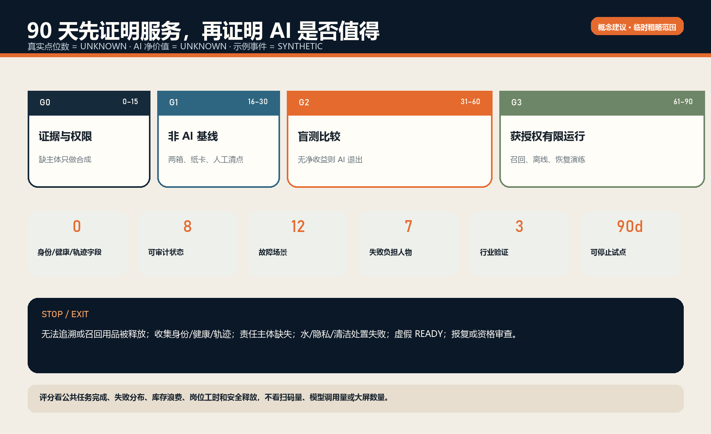
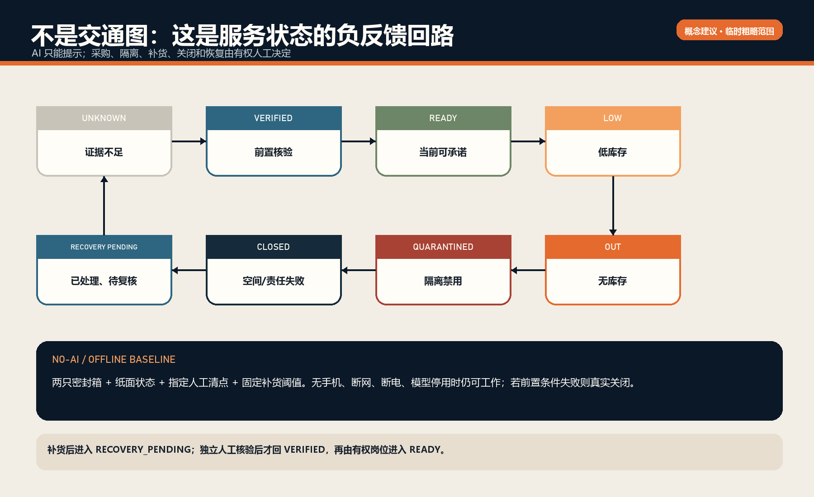

# 京张有备：AI 原生城市的经期尊严补给基础设施

**THE DIGNITY SUPPLY LINE** 不是经期 App、健康画像或无人售货机方案。它只回答一个窄而真实的公共问题：一个人在公共或共享空间临时需要经期用品时，能否在不证明身份、不暴露周期和健康信息、不依赖手机的条件下，取得一份当前合规、密封、未过期的应急用品；用品短缺、破损、过期或召回后，能否由明确岗位恢复服务。

方案接受最严格的反证：去掉 AI 后，两只密封箱、纸面状态卡、人工清点和确定性补货规则仍应完成最低服务；AI 只有在盲测中减少开放时段缺货，又不增加浪费、不安全释放、隐私字段和岗位工时，才可进入有限运行。否则 AI 退出，服务保留。这是第一性原理，也是工程控制论的退出条件 [data:simulation.json#non_ai_baseline] [metric:ai_net_value]。

> **状态声明**：本案是开放共创 formal v2 方案。官方总体设计范围和三处重点区精确 polygon 尚未发布；空间图层只使用仓库的临时粗略工作范围，全部为 low-confidence、conceptual-only。没有真实点位、场地许可、运营方、供应商或政府承诺。大钟寺名称来自任务书，但当前矩形不构成大钟寺官方边界 [source:SITE-PACKAGE] [source:AGENT-TASKBOOK] [assumption:A-BOUNDARY-001]。

## 设计依据与资料清单

经期需求可能突然发生；无法及时取得用品会造成中断工作、学习、参访或公共活动，额外购买时间和费用，以及不必要的尴尬和排斥。WHO 将经期健康放在全生命周期健康与权利框架中，强调可获得合适用品以及水、卫生和处置条件；UNICEF 的项目方法也把尊严、设施与参与连在一起 [source:WHO-MENSTRUAL-HEALTH-2022] [source:UNICEF-MHH-GUIDANCE]。这些材料证明问题有公共价值，不证明任何京张场地已具备条件。

本案的服务原子只有一个：

`合规采购 → 批次/有效期登记 → 干燥密封储存 → 匿名取用 → 人工日清点 → LOW/OUT/破损/召回 → 指定岗位补货或隔离 → 适格人工恢复核验`

“一份用品可取”不等于“服务 READY”。最低空间合同还包括：清洁水与洗手条件、基本隐私、适当清洁与处置、可理解状态标识，以及能处理缺货/召回/关闭的岗位。缺少其中一项，状态应为 CLOSED 或 UNKNOWN，而不是永久亮绿灯 [data:simulation.json#states]。

截至 2026-08-12，GB/T 8939-2018 仍是现行《卫生巾（护垫）》国家标准；GB/T 8939-2025 已发布但到 2027-01-01 才实施。因此采购必须在每个批次进入前复核“当时适用标准”，而不是把本方案写成产品认证 [source:SAMR-GBT8939-2018] [source:SAMR-GBT8939-2025] [assumption:A-STANDARD-001]。

《北京市公共厕所管理办法》为设置、维护、保洁、设施完好、服务标准/电话、故障和关闭公示提供本地责任接口，但没有规定政府必须免费提供经期用品。本案只建议由愿意承担采购与运营责任的场地/单位开展小规模试点，不虚构政府义务、社区统一配送或既有合作 [source:BEIJING-TOILET-MANAGEMENT-2021]。

## 三层范围工作框架

统筹研究范围约 43.6 平方公里、总体设计范围约 11.4 平方公里、三处重点区域合计约 368.4 公顷的文字任务来自公告与任务书 [source:OFFICIAL-ANNOUNCEMENT] [source:AGENT-TASKBOOK]。当前提交几何只允许生成、自检和讨论，不能作为法定红线、审批、测绘或精确选址依据 [data:geometry/site_boundary.geojson#SITE-001] [metric:site_area_sqm]。

京张的必要性不在“铁路沿线装一排机器”，而在百年铁路最基础的组织逻辑：物资可追溯、交接有责任、异常能隔离、运行状态必须真实。AI 创新带若只展示高端模型，却让日常工作、学习和参访中的基本身体需求仍靠临时求助，其“未来城市”是不完整的。本案把物流、后勤和维护这些容易被遮蔽的劳动转译为城市设计对象。

三层空间各承担不同任务：

| 层级 | 设计动作 | 不作出的主张 |
|---|---|---|
| 统筹研究范围 | 建立可移植的匿名补给协议、产品质量门、责任角色和聚合评估口径 | 不声称全带已有需求热力或真实设施网络 |
| 总体设计范围 | 把补给责任线与京张公共空间、工作/学习场所、后勤路径和已核替代信息联动 | 不画法定点位、服务半径或用户轨迹 |
| 三处重点区 | 众智园做合成库存/召回演练；AI 原点做获授权工作/学习空间有限运行；大钟寺做获授权高周转访客压力测试 | 不把临时矩形、名称或概念节点写成真实选址 |

九类 GeoJSON 继续满足 formal 包的专业空间结构，但用地分区、道路、绿地、公共空间、建筑模块与分期只是“服务生产关系”的可视化载体。建筑强度、权属、道路红线、市政、消防、排水和文保条件保持 UNKNOWN [depth:three_level_scope_framework] [depth:three_key_area_detailed_design] [assumption:A-CONTROLS-001]。

## 统筹研究范围产业与未来城市研究

统筹层不建立个人需求数据库，而是建立可跨场地复用的产品时点、批次、状态、权利、责任和退出协议。它把合规供应、物业运营、无障碍服务设计、隐私工程、离线软件和评估审计组织成公共品接口；AI 产业的价值由是否降低缺货、浪费和岗位负担来检验，而不是由调用量证明 [source:AGENT-TASKBOOK] [depth:overall_spatial_structure]。

在空间上，统筹范围只识别高校、园区、公共活动和后勤体系可能形成的协作类型，不推断个人需求位置。`service_reliability_line_length_m` 仅复算概念责任联系，不能解释成配送里程；`authorized_real_pilot_site_count` 保持 unknown，防止把产业愿景偷换成已落地网络 [metric:service_reliability_line_length_m] [metric:authorized_real_pilot_site_count]。正式深化需要公开、许可清楚的场地名录、运营制度、服务时段、采购与劳动数据，并逐项登记来源、用途、限制和不确定性。

## 总体设计范围城市更新与控规深度城市设计

总体设计只提出可逆补给构件、后台储存/交接、纸面状态、清洁处置前置条件和三个研究节点。用地、建筑、道路、绿地、公共空间和分期图层完整复算，但不改变控规、不确定拆改留、不认定真实设施；任何施工深化必须等待官方边界、权属和专业条件 [data:geometry/land_use.geojson#LU-001] [data:geometry/buildings.geojson#BLDG-001] [depth:development_intensity_controls]。

概念建筑模块只表达取用面、密封储存面、隔离容器和后台交接面之间的相对关系；其基底面积是程序化原型面积，不是现状或拟建建筑规模 [metric:building_footprint_area_sqm]。总体图中的五个主导研究分带用于检查拓扑闭合和不同运营环境，不是法定用地分类。正式阶段必须补充现状测绘、消防疏散、给排水、通风、防潮、保洁动线、无障碍、产权和可施工性审查；缺一项时，相应对象继续保持 conceptual-only。

## 重点区域详细设计

众智园、AI 原点、大钟寺分别承担合成实验、获授权有限运行和获授权压力测试。三处都从 UNKNOWN 开始，只有取得场地、运营、储存、水/隐私、清洁处置和人工岗位证据后，才能局部进入下一状态；概念模块可撤回，不构成规划审批或设备采购指令 [data:geometry/key_areas.geojson#PROV-KEY-001] [metric:key_area_count]。

众智园不接触公众真实需求，只验证 schema、批次冲突、断网、召回和恢复回放；AI 原点先测两箱人工基线和岗位工时，再决定是否允许聚合 AI 盲测；大钟寺只在高周转场地与运营方书面授权后检验峰值、夜间和替代信息。三处矩形面积只来自仓库临时几何，不用于预算、服务半径或设施数量。正式深化还需分别确认当前名称锚点、场地边界、建筑内部条件、管理权、开放时段和跨班责任 [data:geometry/key_areas.geojson#PROV-KEY-003] [assumption:A-SPATIAL-NODES-001]。

## AI 创新生态、人才画像与 AI+ 场景

本案不问“谁正在经期”，只问不同人面对服务失败时承担什么额外负担 [data:simulation.json#personas]：

1. **无手机或不愿扫码的访客**：数字入口不应成为用品资格证明；机械取用和纸卡必须存在。
2. **夜班保洁与物业人员**：夜间无法离岗购买，且常承担补货的隐形劳动；轮班责任和工时必须被看见。
3. **园区实习生和初入职员工**：陌生环境中不应向主管解释身体状况；不记录单位、身份或理由。
4. **短时到访的学生、会议参与者或游客**：需要可理解的标识和客观故障联系，不是“熟人帮忙”。
5. **视力、认知或语言阅读受限者**：不能只用 QR、小字或红绿颜色表达状态；图形、文字、位置和纸面信息需共同工作。
6. **指定清点与补货岗位**：服务不能把更多无偿劳动转嫁给保洁；人工分钟、跨班交接和重复录入是核心指标。
7. **采购与质量责任岗位**：没有批次、有效期和召回链，就无法负责；AI 不能替其签字。

AI 创新场景只处理公共服务对象的聚合状态，不处理人的身体。允许的数据是点位、聚合时段、库存、批次有效期档、补货提前期档和岗位工时；算法或模型可以提示库存趋势、记录冲突和工单老化，但每个建议都要在园区或公共空间的真实运营流程中接受人工复核。空间、产业与治理因此形成同一接口：前台保护匿名取得，后台保护批次和劳动责任，审计端只读取去标识聚合证据。模型不得生成个人需求预测、健康判断或自动放行；AI 场景的落地性由非 AI 基线、盲测和退出门共同证明 [data:simulation.json#baseline_protocol] [metric:ai_net_value]。

公众拥有匿名取得、拒绝数字工具、隐私、真实状态、质量边界、无报复投诉和知情关闭等权利。任何“先扫码填手机号”“记录个人取用”“用摄像头估计需求”“按员工身份限领”都违反本案契约 [data:simulation.json#rights] [metric:identity_field_count]。

## 04｜工程控制论：状态、权限与负反馈

受控对象不是人，也不是身体状态，而是一个**用品补给点的可承诺状态**。状态机包含 UNKNOWN、VERIFIED、READY、LOW、OUT、QUARANTINED、CLOSED、RECOVERY_PENDING 八态 [data:simulation.json#states] [metric:operational_state_count]。

- `UNKNOWN → VERIFIED`：场地运营方签署前置检查，但尚未对外承诺可取。
- `VERIFIED → READY`：指定清点岗位确认当前批次、密封、有效期、数量、空间条件和时间段。
- `READY → LOW/OUT`：由人工清点或确定性阈值触发；不得隐藏缺货。
- `任一可用态 → QUARANTINED`：破损、过期、追溯冲突或召回线索出现；AI 无权解除。
- `任一运行态 → CLOSED`：水、隐私、清洁/处置、场地或责任岗位失败。
- `LOW/OUT/QUARANTINED/CLOSED → RECOVERY_PENDING`：补货、移除或纠正已记录，但仍不能直接亮绿。
- `RECOVERY_PENDING → VERIFIED`：由独立指定人员核验恢复证据，再由有权岗位进入 READY。

负反馈的关键是证据过期：没有按约定时间获得新清点回执，READY 自动回落为 UNKNOWN。系统必须展示失败、停止、拒绝、误报、无数据和关闭，不能只展示成功案例。最小事件 schema 只含点位、事件类型、聚合时段、岗位、批次引用、聚合数量和证据引用；禁止姓名、电话、账户、脸/影像、周期/健康信息、个人轨迹、雇主和个人取用日志 [data:simulation.json#properties]。

责任矩阵把“建议”和“动作”分开：场地/物业运营方对许可和服务范围最终负责；采购运营方对采购和质量链最终负责；指定人员负责清点、补货、隔离和恢复核验；供应商或质量岗位处理召回；AI 只对聚合预测或记录冲突给建议 [data:simulation.json#tasks]。

## 用地、建筑规模与拆改留方案

空间不是大屏，而是一组能在 90 天后撤回、修正或复制的小构件：

1. **匿名机械取用面**：不依赖电、不强制 QR，控制一次应急取得但不建立个人资格。
2. **干燥密封储存面**：批次与有效期对工作人员可核，公众不接触备用库存。
3. **纸面状态与岗位卡**：READY/LOW/OUT/QUARANTINED/CLOSED 文字+图形表达，含上次人工核验时段和责任联系方式。
4. **洗手、隐私、清洁与处置前置清单**：不满足时用品存在也不得称 READY。
5. **后勤补货交接面**：跨班交接、隔离容器和恢复回执，不把库存暴露在公众动线上。
6. **无电/弱网模式**：两箱法、纸表和现场岗位完成最低闭环。

概念责任线连接众智园—AI 原点—大钟寺，只表达“实验—有限运行—压力测试”的知识和责任交接，不是道路、配送线路、个人轨迹或服务半径 [data:geometry/roads.geojson#ROAD-001] [metric:service_reliability_line_length_m]。真实补货可由场地内部采购/物业岗位完成，也可依法依约委托供应商；个人公众只参与匿名取得和客观故障反馈，不承担产品认证、补货责任或政府配送。

## 交通、轨道、市政与公共服务设施

责任线不是交通工程线。真实试点只利用经核验的公众入口、后台补货路径和已核替代信息；不采集用户轨迹，也不宣称全程无障碍或服务半径。给排水、清洁处置、电力、消防、疏散和轨道站点条件缺失时保持 UNKNOWN，必须由相应专业和场地运营方确认 [data:geometry/roads.geojson#ROAD-001] [data:geometry/constraints.geojson#CONSTRAINTS] [depth:traffic_rail_slow_parking]。

交通层的设计重点是把公众取用与后台补货分流：公众侧需要无台阶或有等价替代的可达入口、清楚状态和不暴露隐私的停留位置；后台侧需要不穿越拥挤等候区的密封库存、隔离品和清洁处置交接。断网或断电时不改变消防、疏散和站点管理规则。道路红线、站点接口、无障碍连续性、照明和夜间开放目前均无可引用的当前证据，因此图层只表达待核关系，不形成交通组织结论。

## 蓝绿空间、公共空间与城市风貌

蓝绿与公共空间图层仅承载低干预导视、公开状态和维护文化展示，不新增法定绿地。风貌采用京张调度、检修、交接和守时的语言，避免商业广告和身体标签；公众侧不显示批次安防或后台控制细节 [data:geometry/green_space.geojson#GREEN-001] [data:geometry/public_space.geojson#PUBLIC-001] [depth:blue_green_public_space]。

临时学习廊道和四个公共节点的面积比例只用于验证几何自洽，不能解释为新增绿地率或公共设施供给 [metric:green_ratio] [metric:public_space_ratio]。公共界面采用纸面状态、图形与文字并列、非红绿单一编码和可更新时段；文化展示表彰维护岗位和公开方法版本，不展示领取人或企业营销。正式落位前需评估遮雨、防潮、热环境、保洁、废弃物交接、夜间安全、文保和景观审批；若公共空间不适合保护库存，应把服务收回经授权室内空间。

## 06｜十二张故障场景卡

场景以扰动为起点，而不是以功能菜单为起点 [data:simulation.json#scenarios] [metric:scenario_card_count]：

| # | 扰动 | 最低响应 | AI 边界 |
|---:|---|---|---|
| 01 | 临时需求、无手机 | 匿名机械取用 + 纸面状态 | 不识别人 |
| 02 | 早高峰库存降至阈值 | LOW + 人工补货 | 可建议排序，不自动承诺 |
| 03 | 夜间无人补货 | OUT/关闭真实显示 + 已核替代信息 | 不编造替代点 |
| 04 | 包装破损 | QUARANTINED + 人工移除 | 不做质量放行 |
| 05 | 临近或超过有效期 | 禁止释放 + 采购处置 | 不修改有效期 |
| 06 | 批次召回 | 整批隔离 + 人工恢复核验 | 不解除召回 |
| 07 | 断网 | 两箱法、纸卡、岗位/电话 | 本地最低服务继续 |
| 08 | 断电 | 非电取用或 truthful CLOSED | 不危险旁路 |
| 09 | 拒绝数字工具 | 无需 QR、账号、理由 | 拒绝不降级权利 |
| 10 | 洗手水或清洁处置失败 | CLOSED | 库存不等于 READY |
| 11 | 状态过期 | READY 自动降 UNKNOWN | 不永久绿色 |
| 12 | AI 误告/漏告 | 人工规则优先，计入盲测 | 可直接退出 AI |

每张卡都要在众智园合成环境中先演练，再决定是否进入获授权点。不得为演练故意向公众释放不合格用品，也不得制造真实隐私事件。

## 07｜agent.1—agent.6：AI 城市设计如何被约束

**agent.1 方案生成**：从任务书、临时边界、现行标准、权利与失败场景生成三层空间和 90 天方案；不生成法定控制线 [source:AGENT-TASKBOOK]。
**agent.2 全球案例学习**：WHO/UNICEF 借公共价值与评估框架；Open Food Facts 借来源与显式不确定性；Snipe-IT 借保管与状态史但禁止个人领用跟踪；Open311 借工单语义；ODK 借离线对象审计。只借方法，不照搬治理结构、数据和代码 [data:simulation.json#cases]。
**agent.3 产业验证**：产品质量/采购、设施运营/保洁、负责任 AI/服务设计三类测试都有通过门和停止门 [data:simulation.json#tests] [metric:industry_test_count]。
**agent.4 典型人物**：以七类失败负担而非身体画像生成 12 个故障场景。
**agent.5 多方案评估**：比较“无人售货机优先”“两箱人工基线”“聚合 AI 辅助”三案；默认选择最少数据、最低失效代价的两箱基线。
**agent.6 动态优化**：只能用聚合时段、库存和岗位工时校准补货；不能创建个人需求预测。任何优化都受权利账本和人工放行约束。

AI 的工程接口是“提示—核验—人工动作—回执—过期”，不控制锁具、设备、采购或产品放行。断网、模型停用或公众拒绝数字工具时，服务仍存在。

## 08｜公开优秀项目作为方法库：借结构，不借光环

本案从 GitHub 一手仓库吸收四种通用架构：Open Food Facts 的产品来源与显式不确定性，以及 Snipe-IT 的库存保管与状态历史 [source:OPENFOODFACTS-METHOD] [source:SNIPEIT-METHOD]。Open311 提供对象级问题、责任组织和状态更新方法，ODK Collect 提供离线、受约束、可重复审计方法 [source:OPEN311-SCHEMA-METHOD] [source:ODK-COLLECT-METHOD]。

同时明确不复制：不导入任何产品/用户数据；不跟踪个人领用；不照搬国外机构、服务时限或授权；不复制代码和视觉；不把社区编辑等同于产品认证。方法库的价值是让来源、状态、离线和责任结构更成熟，而不是用知名项目为方案背书。

仓库内功能收敛审查按 Issue #1974 比较受益者、端到端任务、空间载体、人工决策和失败结果。已有公厕基线方案关注开放、清洁、无障碍或维修；女性路线方案关注出行和照护；后勤方案关注劳动者。京张有备的不可替代对象是“用品标准/批次—匿名取用—补货—召回—人工恢复”。若后续出现同一链条的更早方案，应公开差异或停止，而不是换名。

## 指标体系、面积复算与合规矩阵

空间 known 指标来自提交 GeoJSON 的 EPSG:4548 复算；服务结构指标来自机器文件；真实点位数和 AI 净价值保持 unknown。公告和 agent.1—agent.6 的任务映射保存在 `compliance_matrix.json`，专业标准与深度分别保存在 `standard_matrix.json` 和 `design_depth_matrix.json`，不以正文声量替代证据 [metric:site_area_sqm] [metric:authorized_real_pilot_site_count] [depth:metrics_recalculation]。

## 09｜三类行业验证与非 AI 基线

**测试一：产品质量与采购。** 采购岗位能否证明当时适用标准、供应商、批次、密封、有效期和召回处置？任何无法追溯的库存直接停止。
**测试二：场地运营与清洁。** 水、隐私、储存、清洁/处置、清点、补货和真实关闭能否跨班运行？任一职责无人承担，真实点保持 UNKNOWN。
**测试三：负责任 AI。** 聚合预测能否优于两箱法和确定性补货规则，同时不增加浪费、不安全释放、隐私风险和岗位工时？若不能，AI 退出。

非 AI 基线先运行 15 天：两只密封箱、纸面 READY/LOW/OUT 状态、每日指定清点和固定补货阈值。记录的不是用户，而是开放时段缺货分钟、过期/破损件、浪费件、岗位分钟、不安全释放次数和未解决状态时长 [data:simulation.json#minimum_metrics]。

AI 盲测只允许六类输入：点位 ID、聚合时段、聚合库存、批次有效期档、补货提前期档、开放/关闭。评价人员在比较建议时不看方法标签。由于尚无真实授权点，当前 `authorized_real_pilot_site_count` 和 `ai_net_value` 均为 UNKNOWN，不用合成结果冒充绩效 [metric:authorized_real_pilot_site_count] [metric:ai_net_value]。

## 更新项目清单、实施政策与分期计划

### G0｜0–15 天：证据与权限门

取得书面场地许可；具名最终负责和直接负责岗位；复核现行产品标准；确认采购、干燥储存、洗手水、隐私、清洁/处置、无障碍与投诉路径；确认零禁止字段。任一关键项缺失，只做众智园合成演练 [data:simulation.json#G0]。

### G1｜16–30 天：非 AI 基线

运行两箱法、纸卡和人工清点；完成破损/过期隔离；记录真实岗位分钟。服务本身不能稳定，就不引入 AI。

### G2｜31–60 天：合成/聚合盲测

比较两箱人工、确定性阈值、聚合 AI 三种方法。通过标准必须在测试前约定；出现隐私扩张、不安全释放或净价值不足，AI 退出。

### G3｜61–90 天：获授权有限运行

只在书面授权点运行；完成召回、断网、断电、状态过期、关闭和恢复演练。每次恢复需要独立指定人员回执，AI 无权从 RECOVERY_PENDING 直接改为 READY。

12 周责任表把交付物分配给试点召集人、场地经理、库存/质量岗位、评估负责人和独立复核岗位；所有真实组织仍是待确认，不以角色名伪装合作 [data:simulation.json#weeks]。

成本不伪造精确总额。成本包包括合规库存、可清洁非电两箱/机械构件、纸面与无障碍标识、清点/补货/清洁/质量/恢复岗位工时、培训演练、通过 G2 后才可能发生的本地软件、保险法务/预备、退出与剩余库存处置。实地试点前对物资项至少获取两份可比报价，场地/责任范围和基线工时确定后再设上限 [data:simulation.json#cost_buckets]。

立即停止条件：释放无法追溯或召回用品；收集身份/健康/轨迹；责任主体缺失；洗手水、隐私、清洁/处置门失败；虚假 READY；报复投诉者；建立资格审查。

## 11｜文化、地标与产业生态：让后勤成为公共荣誉

“百年京张”不只纪念速度，也纪念调度、检修、交接和守时。方案将三处概念节点命名为：

- **众智园·有备实验台**：公开展示合成召回、断网和状态过期的桌面演练，不展示个人需求数据。
- **AI 原点·无问补给间**：若获授权，以“无需解释、无需扫码”为空间承诺；展示非 AI 与 AI 盲测结果。
- **大钟寺·守时补给钟**：若获授权，在高周转访客场景展示上次人工核验时段和真实状态；“守时”指证据不过期，不承诺服务半径。

沿责任线设置**维护贡献账本**：只记录经授权的组织/岗位贡献、修复和公开方法版本，不记录谁领取用品，也不排名个人员工。年度“开放维护日”演示批次隔离、纸面降级和恢复回执，把采购、保洁、补货与质量劳动纳入 AI 城市文化，而不是藏在大屏背后 [depth:blue_green_public_space] [depth:height_massing_character]。

产业生态不以卖硬件为目标，而以可复用公共协议连接合规制造与供应、场地/物业运营、无障碍与服务设计、隐私工程、离线软件、评估审计和开源社区。对企业开放的是去标识的合成测试规范和聚合评价口径，不是身体或个人消费数据。

## 风险、版权与合规说明

高可用的最低级别是：无手机、断网、断电、模型不可用时仍能匿名取得或得到真实 CLOSED/OUT 信息；批次和有效期冲突时宁可隔离；责任岗位缺席时宁可降级 UNKNOWN；任何替代点只有经过当前核验才可展示。AI 不是单点依赖 [data:simulation.json#digital_refusal]。

主要风险及控制：

| 风险 | 控制 | 剩余不确定性 |
|---|---|---|
| 产品质量/召回 | 批次、密封、有效期、隔离与人工恢复 | 真实供应商和采购制度未确认 |
| 缺货或浪费 | 两箱基线、固定阈值、聚合盲测 | 真实需求尚无授权数据 |
| 隐私和污名 | 零身份字段、无扫码资格、无个人日志 | 需现场观察是否产生非正式询问 |
| 隐形劳动 | 记录岗位分钟、跨班交接、工时停止门 | 真实排班和劳动协议未确认 |
| 错误状态 | 证据过期降 UNKNOWN、纸面状态、独立恢复 | 本地核验频率待协商 |
| 空间条件不足 | 水/隐私/清洁/处置一票否决 | 真实场地工程条件未知 |
| AI 无净价值 | 先非 AI，盲测失败即退出 | 当前净价值为 UNKNOWN |
| 原创性收敛 | 周期搜索 Issues/PR/全文并登记差异 | 社区方案持续更新 |

长期运营采用版本化公开协议：每季度复核标准、权利、失败分布、库存浪费、岗位分钟和投诉；每年由独立角色复核是否继续、缩减或退出 AI。服务的资金可以是获授权场地运营预算、雇主/园区公共服务预算或合规社会合作，但在协议确认前均为备选，不写成政府拨款或赞助承诺。

若试点停止：立即将状态改为 CLOSED；处理剩余合规库存和隔离品；移除可逆构件；删除任何误收禁止数据；公开停止原因和未解决事项。失败是证据，不是需要隐藏的公关问题。

## 13｜可复算成果、版权与专业深化清单

本包包含九类 GeoJSON、EPSG:4548 复算指标、来源/假设/标准/深度/合规矩阵、八态状态机、RACI、权利账本、事件 schema、合成回执、12 场景、7 人物、3 行业测试、90 天闸门、12 周表、成本包络、五组双语图、双语离线 HTML 以及中英 A3/A0 PDF。机器文件与正文通过 `[source:]`、`[data:]`、`[metric:]`、`[standard:]`、`[depth:]` 互相索引。

正式落地前必须补齐：官方/canonical 总体及重点区几何；现状建筑、权属、控规、道路、市政、消防、排水、文保；真实场地许可；采购和供应商质量责任；干燥储存、洗手水、隐私、清洁/处置、无障碍；具名清点/补货/隔离/恢复岗位；劳动工时与投诉保护；两份可比报价；数据保护和退出协议 [depth:risk_missing_data] [data:geometry/constraints.geojson#CONSTRAINTS]。

本案不声称官方批准、政府承诺、真实点位已 READY、真实覆盖半径、真实需求热力、健康改善或 AI 已优于人工。所有外部资料只作注明用途的方法/规则引用；无外部图像、地图瓦片、字体、代码或个人数据进入成果。完整许可与限制见 `sources.json` 和 `report/copyright_statement.md`。

## 参考资料

- [source:OFFICIAL-ANNOUNCEMENT] 官方资格预审公告
- [source:AGENT-TASKBOOK] 面向智能体的开源征集任务书
- [source:SITE-PACKAGE] 仓库场地包、临时几何与数据缺口
- [source:SAMR-GBT8939-2018]、[source:SAMR-GBT8939-2025] 产品标准时点
- [source:WHO-MENSTRUAL-HEALTH-2022]、[source:UNICEF-MHH-GUIDANCE] 经期健康、尊严与设施方法
- [source:BEIJING-TOILET-MANAGEMENT-2021] 北京本地公共卫生空间运营责任接口

完整机器索引见 `sources.json`、`assumptions.json`、`metrics.json`、`compliance_matrix.json`、`standard_matrix.json`、`design_depth_matrix.json` 与 `simulation.json`。
