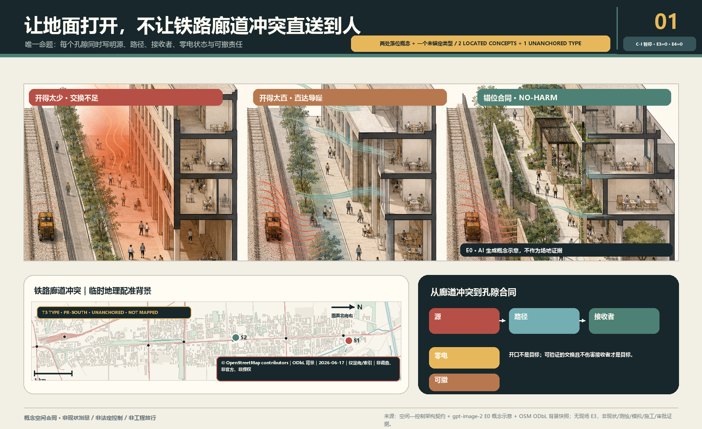
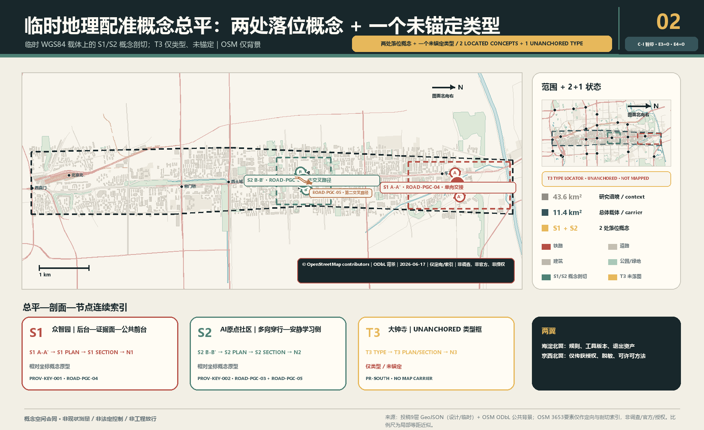
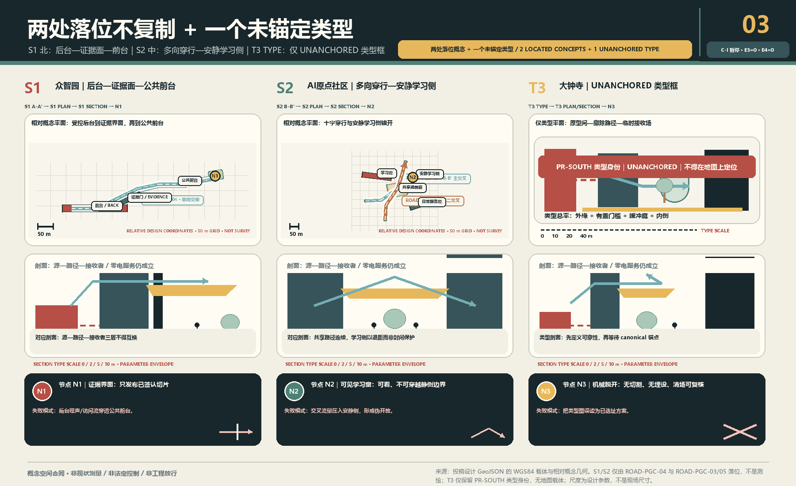
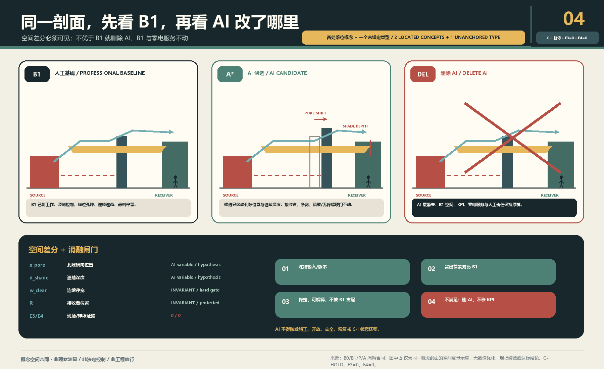
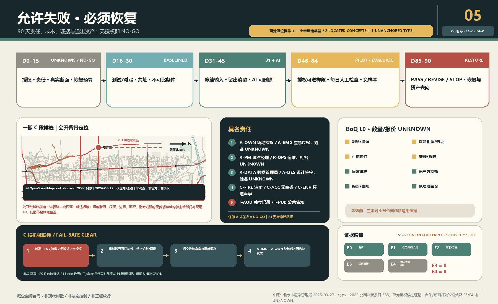

# 京张会呼吸——首层孔隙性能合同 / THE POROUS GROUND CONTRACT

> **让地面打开，不让噪声直送到人。** 先画源、传播路径与人的接收面，再决定哪里开、怎样折、何处遮荫、哪一侧可停留。传感器只验证，AI只在设计期比较候选；关掉电、网和模型，路、荫、错位孔隙与静侧仍必须成立。

**当前诚实状态：** `C-S` 是 formal v2 概念空间合同候选；机器门和独立盲审必须读取本包的确切记录，不能由状态文字代替。`C-I` 为 `HOLD`。本包没有真实断面、书面授权、E3现场基线或E4样段/恢复证据，不声称“已验证、已落地、全年改善、健康收益、法定达标或政府承诺”。仓库临时几何只支撑概念自洽：S1/S2是临时载体上的E0设计参数包络，均为`NOT_MEASURED`；`PROV-KEY-003` 未可靠锚定大钟寺站城关系，T3因此没有任何ROAD/GREEN/PUBLIC/BUILDING落图。[metric:located_prototype_count] [metric:mapped_t3_design_feature_count]

**五条可证伪合同：** ① 开口太少会积热或限制空气交换；开口太直会把噪声沿直达路径传到人的停留接收面。② `B0 / B1 / P / A`：B0是只读基线，B1是人工规则基线，P是可画参数族，A是设计期AI搜索；留出消融不稳定或不优于B1，就删除AI。③ `PROV-KEY-003` 是未锚定的临时粗略 polygon，不是大钟寺真实点位。④ E0是概念，E1是临时资料，E2是公开方法，E3是授权现场基线，E4是可逆样段与恢复证据；当前E3/E4不存在，`C-I HOLD`。⑤ AI无权批准开口、施工、状态迁移、安全放行或恢复；零电或断电、断网、模型退出后，路径、遮荫、错位孔隙与静侧仍继续服务。[metric:e3_site_evidence_count] [metric:e4_implementation_evidence_count]

## 设计依据与资料清单

本案响应官方三层范围、三区两翼和 agent.1—agent.6，但只提出一个不可移植的空间命题：北部S1用单向“受控后台→签署证据门→公共前台”处理研发边界；中部S2用两条非共线路径、共享庭、异形占用边和独立静侧学习带处理日常交叉；南部T3只保留未锚定的采用/退出类型。替换城市和三区名称后因果链若仍不变，方案即失败。[source:OFFICIAL-ANNOUNCEMENT] [source:AGENT-TASKBOOK] [source:SITE-PACKAGE]

总体与三处重点区均使用仓库粗略 provisional geometry。`SITE-001` 不是 official redline；三处矩形不是地块、道路或工程边界；大钟寺仅保留任务书名称和类型研究，不能下推站口、象限、距离与容量。[source:BOUNDARY-SOURCE] [source:KEY-AREA-SOURCE] [data:geometry/key_areas.geojson#PROV-KEY-003]

城市设计、控规边界和用地分类分别受本地标准矩阵约束；没有官方控规、建筑、道路、权属与市政条件时，分区只是非 statutory 研究覆盖，拆改留、FAR与高度保持 `UNKNOWN`。[standard:MOHURD-URBAN-DESIGN-MEASURES] [standard:MOHURD-CONTROL-DETAILED-PLANNING] [standard:MNR-LAND-USE-CLASSIFICATION-GUIDE]

空气、气候与声环境来源只定义专业方法边界，不证明京张现状或效果。声学采用源—路径—接收者分析逻辑；风、热、空气与声的真实变量必须在获授权断面上由适格人员确定。[source:MEE-GB3095-2026] [source:MEE-GB3096-2008] [source:MEE-HJ24-2021]

包内另登记一份公开 ODbL 的 OSM 背景快照：共 `3,653` 个要素，其中 railway 283、road 1,065、named context 55、station 24、water 96、park 147、building 1,911、landuse 72。它只为方位与剖切索引服务，**不是** current survey、official/canonical boundary、权属、无障碍路线、消防条件、声/热/排放源清单、现状运营或授权；每个要素在专业使用前仍须核验。[source:OSM-CORRIDOR-CONTEXT-2026] [metric:osm_context_feature_count]

## 三层范围工作框架

| 层级 | 不可替代的问题 | 本案交付 | 禁止下推 |
| --- | --- | --- | --- |
| 43.6 km²统筹研究 | 哪些专业、工具、区域背景与两翼能支持可复核方法 | 源—路径—接收者证据框架、版本化B1规则、专业复核与转移门 | 不画地块，不宣称官方通风廊道 |
| 11.4 km²总体设计 | 原铁路走廊的连续界面如何“开而不直送” | S1/S2两处落位概念的学习脊、三条不同路径、阴影与静侧；T3不落图 | 不把概念脊/路径当真实铁路、道路或无障碍路线 |
| 368.4 ha重点区 | 三种冲突怎样形成不可互换的合同 | S1单向交接、S2双轴共享庭、T3未锚定采用/退出类型 | 不从粗略矩形推断真实条件或给T3选址 |

三层不是一张图的缩放。统筹层管理方法和转移资格；总体层管理空间合同网络；重点区用一张可验收断面反证合同。[depth:three_level_scope_framework] [depth:overall_spatial_structure] [data:geometry/roads.geojson#ROAD-PGC-01]

任务书三大定位与五大功能不另起八个口号，而被同一合同逐项验收：百年京张文化带以真实铁路工程史、公开尺度和长期维护为策展输入；都市AI生活体验带以零手机、零电也可用的阴影通路与静侧为公共底线；AI融合创新带以北部提出约束—中部比较翻译—南部授权采用/退出为生产链。AI全栈自主创新体系由 `B0→B1→P→A→消融/删除` 实现；世界级AI创新生态由六案与八要素的申请—配给—留痕—退出实现；AI+场景赋能新范式由12张可停止场景卡实现；智能化AI活力城市由被动形态和人工运营先行实现；AI治理全球话语权只提出双语、可复演、公开负结果的“开放断面协议”，不声称代表政府或形成国际标准。[source:AGENT-TASKBOOK]

## 统筹研究范围产业与未来城市研究

本案把“AI全栈”理解为一条可删除AI的城市设计生产链，而非设备平台：B0只读基线；B1由规划、建筑、景观、环境、声学、消防和无障碍专业人员给出人工规则方案；P把开口位置、错位关系、缓冲深度、遮荫连续、接收面与维护通路转成可画参数；A只在冻结输入和留出情景中搜索Pareto候选。AI若不能稳定、可解释地找到不被B1支配的方案，就删除AI，B1公共服务不变。[source:LADYBUG-TOOLS-METHOD] [source:OPENFOAM-METHOD] [source:NOISEMODELLING-METHOD]

中关村科技服务翼只交换规则版本、工具清单、专业方法、失败与复演资产；小月河场景赋能翼只交换获授权、已脱敏的场景方法和普通维护经验。任何跨区复制必须重新做B1、来源登记、责任确认和no-harm审查，不能平移几何、阈值或效果。[source:AGENT-TASKBOOK] [depth:existing_conditions_diagnosis]

### agent.2：六案机制表，不做品牌榜

| 案例 | 可核验机制 | 不能照搬 | 反向改变京张空间 |
| --- | --- | --- | --- |
| one-north / LaunchPad | 公共主开发、模块空间、首层展示、组织化试场与一站式服务 | JTC土地/主开发权、园区规模、未来项目；Punggol平台不在one-north | 首层拆成时限模块、证据窗、受控试场；逐模块过疏散/无障碍/声热/复原门 [source:CASE-SG-JTC-LAUNCHPAD-2026] |
| Paris-Saclay / DATAIA / Jean Zay | 公共开发+研究教育网络+经申请配给的算力/数据基础 | 国家科研体系、超算规模、France 2030与热网 | 算力留在后台/外部；首层只公开申请—配给—能耗/来源—结果—删除/归档 [source:CASE-FR-IDRIS-ALLOCATIONS] [source:CASE-FR-GENCI-JEAN-ZAY] |
| MaRS / Vector | 历史建筑和公共中庭邻接湿/干实验室、受限研究后台、人才/采用服务 | 共址与机构自报规模不证明溢出；实验室不能无边界开放 | 每个孔隙画公众前台—隔界证据面—授权后台，分别控制门禁、空气、数据和关闭 [source:CASE-CA-MARS-CENTRE] [source:CASE-CA-VECTOR-ABOUT] |
| Brainport / HTCE | 三螺旋年度议程、共享实验/洁净/试制设施、空间与人才联动 | 国家资金、锚定企业和供应链；官方已承认住房/交通/能源压力 | 翼侧服务采用预约、资格、维护、退出；试验同步登记住房/通勤/电网/物流/公共路径负担 [source:CASE-NL-BRAINPORT-AGENDA] [source:CASE-NL-GOV-BEETHOVEN] |
| Hazelwood Green / CMU | 工业棕地再生、可重构室内外试场、公共共同空间与社区利益目标 | 社区目标不等于收益兑现；基金会/大学/联邦资金不可移植 | 先分公共路径、受控测试面、应急停止区与PARK/复原位；公共路径不能当机器缓冲区 [source:CASE-US-CMU-RIC] [source:CASE-US-HG-NEIGHBORHOOD-PLAN] |
| Barcelona 22@ | 工业用地长期转型、基础设施负担、旧厂再用及包容性修订 | 京张无已证同等改规/增值回收权；22@不是AI全栈绩效样板 | “孔隙义务随时限使用权走”：公共路径、静侧、维护、数据、安全、复原缺一不放行 [source:CASE-ES-BCN-IMU-2024] [source:CASE-ES-22AT-2008] |

六案只证明机制曾由相应第一方主体公开描述，不证明其因果成效，更不生成京张企业、资金、算力、政策或指标。30条一手来源逐条登记 publisher/title/URL/date/use/limits/license；除明确CC BY 4.0的2008年22@资料外均仅事实性转述、不复制图表。[metric:global_case_study_count] [metric:global_case_first_party_source_count]

### 七个指定近邻：五字段不可替代差异

| 近邻 | Claim差异 | Mechanism差异 | Spatial consequence差异 | Evidence差异 | Exit差异 |
| --- | --- | --- | --- | --- | --- |
| THE BREATHING LINE | 不做宽泛气候/呼吸廊道，只验“交换开口不得直送噪声” | 逐孔源—路径—接收者+六维否决，不是脊/气候庭/横缝+感知 | 每孔必须画源侧、折线、人的接收面、零电状态 | 授权断面和同工况B0/B1多物理配对，不只传感校准 | 不止AI下线；失败孔隙SX→撤除/删数→S10 [source:PEER-THE-BREATHING-LINE] |
| Urban-Form-First V6 | “形态优先/首层开放”不是差异，三物理冲突才是 | AI只搜冻结P域且不优于B1即删，不以算法改线面点/分期 | 后台—证据面—前台错位断面与静侧 | 六项硬门+B1/A同预算消融，不做综合价值护照 | 删A→B1/CLEAR；Day90须S10或新授权 [source:PEER-URBAN-FORM-FIRST-V6] |
| THE SEASON LINE | 不承诺四季/全年公共客厅 | 固定被动B1+逐次授权，不运行期季节切换 | 遮荫/避雨只是不可抵消约束，不是品牌节点 | 匹配天气/源条件配对；90日不外推全年 | 无有限PASS即撤除、复原、关闭数据 [source:PEER-THE-SEASON-LINE] |
| SHADE THE CLOUD | 不做算力换凉意；遮荫只服务零电路径/热门 | 资源配给/成本来源留痕+错位声热断面，不做热预算公地 | 无“一脊三凉岛”；逐孔同时过声/通行/应急/维护 | 热、声、空气、能耗分账，不能互相抵消 | 隔离复原准备金覆盖构件、表面、数据与验收 [source:PEER-SHADE-THE-CLOUD] |
| Smart Waiting | 不做智能候场/动态舒适，只保固定被动最低服务 | AI仅设计期；现场启停、应急、迁移全由人/机械 | 零电路+错位孔+静侧+C-CLEAR，不是六状态候场门 | 验B1零电、逐状态签署和机械清场，不验AI切换率 | 删A→冻P→B1→CLEAR/关→撤→RESTORED [source:PEER-SMART-WAITING] |
| Sonic Commons | 不做声景公地；声只否决直送噪声的开口 | 不机器聆听；物理错位/源控/静侧+配对测量 | 声改变每孔位置、折线、接收面，不形成声景网络 | 声与热/空气/无障碍/消防/维护共同硬门 | 投诉冲突先停，不能用仪器驳回；撤除复原 [source:PEER-SONIC-COMMONS] |
| THE SECOND SURVEY | 不再声称断面/首层开放/90日独特，只验三物理孔隙 | 不按综合低分选点；先授权源—路径—接收者再过门/消融 | 不普遍开低分首层；错位/阴影/静侧/应急维护齐才进P | 冻结源/天气/误差，单项越界失败，AI留出胜B1 | 不只重排优先级；无PASS或有伤害即SX→S10 [source:PEER-THE-SECOND-SURVEY] |

该矩阵的机器可读权威在 `simulation.json#design_evidence.nearest_neighbor_difference`，逐行含 `claim_difference / mechanism_difference / spatial_consequence_difference / evidence_difference / exit_difference`；只含上述七项，不扩大近邻集合。[metric:nearest_neighbor_difference_count]

### 八要素生态图谱：每条箭头都是 Gate

| 要素 | 首层/走廊载体 | 可交换资产 | 最小责任与放行门 | 当前状态 |
| --- | --- | --- | --- | --- |
| 地 | 前铁路长廊、站场/桥下、临界地块 | 授权边界、禁触清单、期限 | A-OWN/R-PM；权属、到期收回、遗产/通行 | `UNKNOWN/HOLD` |
| 空间 | 孔隙、阴影路、庭院、静侧、后台 | 源—路径—接收者断面、前台/界面/后台、零电状态 | A-DES/R-OPS及消防/无障碍/环境否决 | `E0 only` |
| 产业 | 北研发源—中转译—南采用/退出 | 真实问题、B1、原型、采用/退出条件 | 需求具名且先有较简单非AI基线 | 无企业承诺 |
| 资金 | 服务翼审计台与获授权工作包 | 用途、Gate、上限、利益冲突、复原预留 | A-OWN/I-AUD；失败、维护与复原都有钱 | `UNKNOWN/unfunded` |
| 人才 | 高校—园区—社区路径与值守班次 | 资格、工时、责任岗位、场景去向 | 培训必须进入获授权且可追责角色 | `UNKNOWN` |
| 算力 | 后台/外部受控节点；首层仅审计窗 | 作业ID、配额、版本、能耗、结果、删除/归档 | R-DATA/I-AUD；必要性、来源与处置可审 | 无资源/协议 |
| 数据 | 受控采集点、脱敏证据窗、来源库 | 目的、最小字段、权限、保留、删除证明 | R-DATA；可拒绝、无禁采个人数据、删除核验 | 无现场授权 |
| 场景 | 获授权可逆试场与公共体验路 | owner、时段、安全半径、停止、复原签收 | A-OWN/R-OPS；真实需求、投诉与RESTORED | `E3=0/E4=0 NO-GO` |

生产闭环为“地权→受控空间→真实产业问题→数据合同→算力配给→B1/原型→授权场景→正负证据→人类采用/修改/退出”；公共闭环从日常负担进入最小数据与可逆样段，再由投诉、维护和负结果返回人类Gate。北部因此是**发明并约束**，中部是**翻译并比较**，南部是**采用或退出**；中关村翼只提供IP/资金/人才/算力/专业复核，小月河翼只提供授权场景/反馈/维护/负证据，二者均无空间放行权。[metric:ecosystem_element_count]

品牌以“错位开口”的括号/折线为识别，不以风的箭头、传感器或绿色发光线为主体。国际表达固定为 `OPEN THE GROUND, NOT A DIRECT NOISE PATH.`，把AI治理转成可见的“可比较、可删除、可恢复”。

## 总体设计范围城市更新与控规深度城市设计

最小空间服务原子是：两个经授权控制点之间，一条零电可识别、连续无障碍的阴影通路，一个经权属/消防核验的空气路径，一个不被声源直线瞄准的静侧停留面，以及测试/对照、责任、停止与恢复证据。不是测量柱，也不是环境分数。[data:geometry/green_space.geojson#GREEN-PGC-01] [data:geometry/public_space.geojson#PUBLIC-PGC-03] [metric:passive_service_required_ratio]

所有开口先过六项no-harm：空气交换、热暴露、噪声、无障碍、消防疏散、维护。改善一项而伤害任一项即淘汰；平均值不能掩盖中午、热浪、源满负荷、活动散场和夜间等最差包络。GB/T 37529与QX/T 437只用于说明气候/通风判断需要资料与分析，本案不认定官方通风廊道。[standard:CMA-GBT37529-2019] [source:CMA-QXT437-2018]

五个用地 polygon 只完成包内完整覆盖，名称说明研究问题而非法定用途；四个建筑 footprint 只属于S1/S2：S1为长窄源界面+小证据门，S2为长边+短深边两种不等占用界面。它们的拆改留均为 `UNKNOWN`，T3没有建筑落图。取得 canonical geometry 后九图层、指标、图件、PDF和HTML必须整体重算。[data:geometry/land_use.geojson#LU-PGC-01] [data:geometry/buildings.geojson#BLDG-PGC-03] [metric:building_footprint_area_difference_ratio]

## 重点区域详细设计

### A 北部众智园：源—公众

真实设备、活动、热/排放和运营边界均未知。S1只画一条单向研究交接：`BLDG-PGC-05`长窄受控后台先到`BLDG-PGC-06`签署证据门，再进入较窄的`PUBLIC-PGC-03`遮荫公共步道，并连续接入终点小型`PUBLIC-PGC-06`静侧复核袋；没有对称庭，也没有第二条穿越路径。所有尺寸均是`E0_DESIGN_ENVELOPE / NOT_MEASURED`。开放展示不等于通风；临时构件不得占用无障碍路线或疏散路径。一期C段仍是另行申请授权的证据候选，不能反向把众智园临时矩形锚定为真实点位。[data:geometry/roads.geojson#ROAD-PGC-04] [data:geometry/public_space.geojson#PUBLIC-PGC-03] [metric:s1_primary_transect_length_m]

### B 中部AI原点：穿行—停留

S2由`ROAD-PGC-03`与新增`ROAD-PGC-05`两条非共线路径在偏置共享遮荫庭相交；长条学习边与短深日常服务边形态不同，`PUBLIC-PGC-05`静侧学习带与庭院分开。它的拓扑、尺度、公共空间和建筑面积均不得复用S1。为了“通透”做成声学直筒、为了“安静”重新封闭地面、让遮荫成为消费门槛，均判失败；所有尺寸仍是`E0_DESIGN_ENVELOPE / NOT_MEASURED`，真实校地/社区权属、开放时段和日程为`UNKNOWN`。[data:geometry/roads.geojson#ROAD-PGC-03] [data:geometry/roads.geojson#ROAD-PGC-05] [data:geometry/public_space.geojson#PUBLIC-PGC-02]

### C 南部大钟寺类型：换乘—静侧

只保留“外缘到达面—有盖门槛—折转缓冲庭—安静内侧”的采用/退出类型，不落真实站口，也不生成ROAD、GREEN、PUBLIC或BUILDING feature。当前 `PROV-KEY-003` 未锚定，故 `PHASE-PGC-01` 为NO-GO；canonical geometry、交通/声源、权属和管理主体缺一不可。[data:geometry/phasing.geojson#PHASE-PGC-01] [metric:mapped_t3_design_feature_count] [metric:dazhongsi_geometry_anchor]

结构固定为**2个落位概念+1个未锚定类型**：S1是一条单向后台交接，S2是双轴交叉与共享庭，T3只在类型/采用退出逻辑中存在。若两处落位概念的长度、面积、拓扑或建筑排布趋同，或T3被偷换成南部点位，本案应停止。[depth:three_key_area_detailed_design] [metric:primary_transect_length_difference_ratio] [metric:mapped_public_area_difference_ratio]

## AI 创新生态、人才画像与 AI+ 场景

六类画像只描述空间失败负担，不识别人、不推断健康与身份；每类都必须能追到场景、空间和运营责任。[metric:persona_count] [source:BARRIER-FREE-ENVIRONMENT-LAW]

| 画像 | 最低权利与场景 | 空间落点 | 运营/退出责任 |
| --- | --- | --- | --- |
| P01 行动不便者/照护者 | SC03/04/06：无手机、零电仍连续通行 | 中部连续净宽、阴影与可视路径 | C-ACC同行走查；一处障碍即关闭/复原 |
| P02 户外/夜班劳动者 | SC02/07/11：诚实条件与静侧休息 | 北部源侧屏、南部类型静侧 | R-OPS日检；投诉或伤害不得被收益抵消 |
| P03 高校/社区学习者 | SC04/05/11：穿行不把学习面变成噪声接收面 | 中部弯折庭与静侧学习边缘 | 校地授权主体+声学复核；静侧恶化即停 |
| P04 研发/试验人员 | SC01/02/10：源侧交换不暴露公众 | 北部后台—证据面—公共前台 | A-DES/C-ENV登记源与B1；AI不胜则删除 |
| P05 换乘/国际访客 | SC05/07/08：无需监控/App的可读到达 | 南部仅类型“门槛—缓冲—静侧” | canonical锚定前NO-GO；误当真实点位即撤回 |
| P06 维护/专业复核人员 | SC03/09/10/12：职责、缺测、负结果和复原可审计 | 维护通路、PARK位、开口账本/签收台 | 主责+替补、独立记录；Day90无新授权即RESTORED |

| 场景 | 空间冲突 | B1/AI关系 | 人工门与停止 |
| --- | --- | --- | --- |
| 01 北部源未知 | 无源清单 | B1=NO-GO；AI不运行 | 具名源清单；无法分离即停 |
| 02 源侧交换/公众安静（产业测试） | 开太少/开太直 | B1错位+阴影；AI只找非支配解 | 多专业no-harm，任一恶化即停 |
| 03 断电断网 | 数字层归零 | B1全服务；删除AI | 零电走查失败即停 |
| 04 中部穿行高峰 | 通路压力 | B1多向连续通路；AI比较权衡 | 主体+无障碍同行走查 |
| 05 学习面被导噪（产业测试） | 直线声路径 | B1弯折庭；AI不可认证 | 配对声学方案；静侧恶化即停 |
| 06 儿童/照护同行 | 可见/遮荫/无障碍 | 人工走查优先 | 任一障碍即停 |
| 07 南部到达/等待 | 到达源与静侧 | 类型B1；AI仅类型搜索 | canonical geometry前不落点 |
| 08 大钟寺未锚定 | polygon可能错位 | 禁用AI选址 | 声称站口/象限即停 |
| 09 传感器漂移 | 数据不可比 | 停结论，空间不自动调 | 共址/校准失败退UNKNOWN |
| 10 AI无增益（产业测试） | 留出/扰动失败 | 删除AI，保留B1 | 不得改KPI保AI |
| 11 投诉/负向结果 | 多物理伤害 | 人工关闭并恢复 | 单项收益不可抵消伤害 |
| 12 第90日退出 | 临时占用固化 | 签PASS/REVISE/STOP后复原 | 无新授权不得续占 |

12张卡、6类画像和3个产业测试的权威结构在 `simulation.json`；这里给人读，不把矩阵当正文。[metric:scenario_card_count] [metric:industry_test_count]

两处落位朝圣/荣誉节点加一个未锚定类型组件不是纪念算法，而是公开AI边界：S1“开口账本”与S2“弯折庭”是临时载体上的两个落位概念；T3“复原签收台”只是一项公开停止、恢复与资产去向的未锚定类型，没有PUBLIC_SPACE feature。[data:geometry/public_space.geojson#PUBLIC-PGC-06] [metric:pilgrimage_node_count] [metric:type_only_prototype_count]

荣誉展示不做名人墙：只展示可核验贡献单元——公开规则版本、复演记录、被淘汰方案、负结果、修复人与复原签收；个人/机构名称只在授权后发布。公共组件库也只含五种可逆义务件：错位门、连续阴影、静侧边缘、证据窗、机械PARK/清场件；每件绑定净宽、消防/无障碍、维护、拆除和归还字段，不能从概念图直接采购。两处落位节点+一个未锚定类型组件、荣誉单元与组件义务共同响应agent.4，不以消费或屏幕换取公共性。[source:AGENT-TASKBOOK]

## 用地、建筑规模与拆改留方案

用地图是非statutory功能研究分区，完整覆盖只为拓扑和空间叙事；建筑图只有四个S1/S2 E0界面，不代表现状或拟建，T3没有建筑feature。FAR、高度、密度、现状面积、产权与每一栋拆改留保持 `UNKNOWN`。建筑环境规范只作为专业深化接口，不把室内标准直接当室外达标结论。[standard:MOHURD-GB55016-2021] [metric:floor_area_ratio]

未来专业团队应以真实建筑测绘、权属/租约、消防、结构、机电、文保和运营调查建立 retain/renovate/demolish 台账；任何孔隙都需单独核查结构、围护、消防和噪声源，不能从本图自动出施工量。[depth:height_massing_character] [depth:retain_renovate_demolish]

## 交通、轨道、市政与公共服务设施

`ROAD-PGC-01`只连接S1/S2两个临时概念载体，不是铁路、道路、站口接驳或无障碍路线。`ROAD-PGC-04`是一条S1单向主路径；`ROAD-PGC-03/05`是两条S2非共线交叉路径；T3没有道路feature。这三条路径只是E0可画参数，不证明地形、坡度、路权、消防、交通安全或现场长度。[data:geometry/roads.geojson#ROAD-PGC-01] [data:geometry/roads.geojson#ROAD-PGC-05] [depth:traffic_rail_slow_parking]

环境仪器与本地计算只能服务共址校准、设计比较和证据归档；它们不能实时开合空间、控制建筑/设备、发布健康建议或法定环境结论。断电/断网时纸面告示、普通维护、路线、阴影和静侧不丢失。[depth:municipal_new_infrastructure]

## 蓝绿空间、公共空间与城市风貌

蓝绿层只表达“公共阴影+普通植物维护+静侧”的被动接口，不宣称树冠、降温、污染削减、雨洪或法定绿地。公共空间必须保持非消费性、连续无障碍和零手机可用。[data:geometry/green_space.geojson#GREEN-PGC-01] [metric:green_ratio] [metric:public_space_ratio]

文化叙事不复制铁路图像，而把百年工程文化中的“公开尺度、断面、复核、长期维护”转成AI新文化。历史资源先由适格策展人建立“实体/年代/来源/许可/可展示范围”台账，再进入空间；中关村创新文化以公开方法、复演与失败学习承接，不把企业logo或人物肖像当文化证据。导视分三层：全带识别只用孔隙/折线/接收面抽象语法；空间导视标源侧、公共前台、静侧、维护/疏散路径；证据标识只显示版本、E级、UNKNOWN、责任和退出状态。中英国际传播句固定为“Open the ground, not a direct noise path / 让地面打开，不让噪声直送到人”，不是整体Logo、标准或官方背书。[standard:PROJECT-AGENT-OPEN-CALL-TASKBOOK] [depth:blue_green_public_space]

年度运营不是活动清单而是闭环：春季“百年断面公开课”由策展/规划复核历史与断面；夏季“开合盲测周”由开发者社区提交同一冻结输入下的B1/AI匿名候选，专业组可全部淘汰；秋季“负样本展”公开缺测、投诉、不可迁移原因与删除决定；冬季“复原签收日”关闭临时占用并公布资产去向。开发者社区只维护版本、复现实验与issue，不操作现场；场景开放须经过申请—授权—B1—消融—可逆样段—退出状态机；公共体验沿开口账本—弯折庭—复原签收台读取因果链。双语“开放断面协议”只传播许可清楚的方法；国际伙伴或招引对象若要转化，必须依次通过来源许可、适用性、主体授权、公共no-harm、成本/维护和退出六门，未通过只形成研究记录，不形成招商、资金或政府承诺。[metric:culture_operation_count]

## 更新项目清单、实施政策与分期计划

官方公开资料使授权路径比“猜一个点”更具体：北京市应急管理局登记京张铁路遗址公园一期C段（知春路至北四环、11.83万㎡）为兼顾其他灾种的III类应急避难场所；2025公园名录将该段地址列为四环路至知春路，并列海淀区公园管理中心为主管单位；首都之窗确认一期2023年开放及桥下空间/少量铁轨开口的公共连通背景；2026海淀政府报告说明沿线控规已通过技术审查，“获批实施”仍是下一步，并称二期可实施区域主体已建设完成；它不是最终批准文本。[source:BEIJING-EMERGENCY-JZ-C-2025] [source:BEIJING-PARK-DIRECTORY-2025] [source:BEIJING-JZ-PARK-OPEN-2023]

因此一期C段可作为“申请书面授权与真实断面的证据样段候选”，不是三区中的 canonical 正式点位、不是获批试点。真实断面 `UNKNOWN`、环境性能 `UNKNOWN`、书面授权 `UNKNOWN`。名录中的海淀区公园管理中心只是需联系的候选责任入口，不代表同意、经费或承担本试点。任何样段不得削弱应急避难功能，不得阻塞疏散通道，不得阻塞无障碍通路，且不得妨碍消防通行；应急/消防/无障碍专业复核是比环境优化更高的硬门。当前仍为 `UNKNOWN / NO-GO`。[source:HAIDIAN-GOV-REPORT-2026] [metric:authorized_real_pilot_site_count]

| 天数 | 状态 | 具名交付 | 失败默认 |
| --- | --- | --- | --- |
| 0—15 | UNKNOWN/NO-GO | 授权、RACI、真实断面、源清单、消防/无障碍/隐私、复原预算 | 只做概念 |
| 16—30 | BASELINED | 测试/对照B0，共址/校准和数据质量签字 | 退UNKNOWN |
| 31—45 | B1_READY / AI_COMPARED | B1、冻结输入、留出消融、淘汰理由 | 删AI或重画 |
| 46—70 | MOCKUP_AUTHORIZED / PILOT_OPEN | 经批准可逆样段，每日人工开放检查 | 关闭并复原 |
| 71—84 | EVALUATING | 匹配复测、缺测、投诉和负结果 | 不作因果结论 |
| 85—90 | PASS/REVISE/STOP → RESTORED | 具名决定、撤除/保留授权、资产去向和复原证据 | 不得以试点名义续占 |

### 未签署的逐状态 RACI 与 SLO

以下全部是合同准入目标，**不是现有任命、响应绩效或服务承诺**。除公众渠道 `I-PUB` 外，12席位中的11个可签席位主责与替补均为 `UNKNOWN / UNSIGNED`；任一主责和替补同时空缺即按席位后果关闭，AI不是RACI席位。[source:CONTROL-CONTRACT-V2] [metric:unsigned_signable_raci_seat_count]

| 席位 | 主责 / 替补 | 空缺后果 |
| --- | --- | --- |
| A-OWN 资产/场地 | `UNKNOWN / UNKNOWN` | 无现场行为 |
| A-EMG 应急启停 | `UNKNOWN / UNKNOWN` | C段永久NO-GO |
| A-DES 设计冻结 | `UNKNOWN / UNKNOWN` | 仅B0 |
| R-PM 合同/状态账本 | `UNKNOWN / UNKNOWN` | 状态不升级 |
| R-OPS 开门/停用/维护 | `UNKNOWN / UNKNOWN` | 关闭或CLEAR |
| R-MEAS 测量/误差 | `UNKNOWN / UNKNOWN` | 无绩效结论 |
| R-DATA 最小化/删除 | `UNKNOWN / UNKNOWN` | 停采并删除 |
| C-FIRE / C-ACC / C-ENV | 三席均 `UNKNOWN / UNKNOWN` | 对应硬门不放行 |
| I-AUD 独立见证 | `UNKNOWN / UNKNOWN` | C-I保持HOLD |
| I-PUB 可达公告/申诉 | 公众渠道，非任命 | 无申诉闭环不得PASS |

| 转换 | A | R | 最小门；失败 |
| --- | --- | --- | --- |
| S0→S1 | A-OWN | R-PM/R-DATA | E4采集授权、签RACI、隐私/投诉；否则S0 |
| S1→S2 | A-DES | R-MEAS/R-DATA | E3真实断面、校准/配对/冻结；否则数据作废回S1 |
| S2→S3 | A-DES | R-PM | B1图纸、六维no-harm、维护/复原；否则回S2/STOP |
| S3→S4 | A-DES | R-PM | P参数域、约束相交、异质断面；否则S3 |
| S4→S5 | A-DES | R-PM/R-DATA | 留出/扰动/消融优于B1；否则删A回S4/S3 |
| S3/S4/S5→S6 | A-OWN | R-PM/R-OPS | E4许可、保险、BoQ/预算/复原金、值班/备件、C联锁；否则不安装 |
| S6→S7 | A-OWN | R-OPS | 当日100%开门检查与机械清空检查；否则关闭 |
| S7→S8 | A-DES | R-PM/R-MEAS/R-DATA | 冻结数据/投诉/负样本并停调参；否则REVISE/STOP |
| S8→S9 | A-OWN | R-PM | 全硬门、预注册收益MDE、独立复核；否则REVISE/STOP |
| 任意→SX | 事后A-OWN | 首见者/R-OPS/R-PM | 任一停止触发，不待批准；保持B1/CLEAR/关闭 |
| SX→S10 | A-OWN | R-OPS/R-PM/R-DATA | E4撤除、复原、独立验收、数据删除；否则继续关闭 |

| 等级 | 即时动作 | 主责确认目标 | 替补/升级目标 |
| --- | --- | --- | --- |
| P0生命安全/应急/禁采数据/失权 | 立即STOP、CLEAR/关闭、停采 | ≤5分钟 | 5分钟叫替补；≤15分钟升A-OWN/A-EMG |
| P1 no-harm越界/可信安全投诉 | 回B1；B1不明即关闭 | ≤15分钟（开放时） | ≤30分钟；≤2小时到场评估 |
| P2维护/漂移/非关键缺测 | 暂停结论；仅可使用经签署状态门准入的B1，否则关闭 | ≤4运营小时 | 下一开放周期前；按签署MTTR修复 |
| P3文档/普通投诉 | 登记回执 | ≤1工作日 | ≤2工作日升级；≤5工作日处置/说明 |

无人响应只延长关闭；达到目标也不自动解除风险。真实值班、MTTR和演练未签，故这些SLO不能作为可行性或绩效证据。

### N1—N10、Level-0 BoQ 与 C 段机械联锁

| 负样本 | 注入 | 必须结果 |
| --- | --- | --- |
| N1 | AI对B1无稳定净增益 | 删除A，回S4/S3 |
| N2 | 仪器断连/漂移/关键缺测 | 停结论，B1或关闭 |
| N3 | 任一no-harm越界 | SX、撤除、复原 |
| N4 | 可信投诉与仪器冲突 | 先停，独立调查 |
| N5 | 主责缺席且替补未接管 | 不开放或SX |
| N6 | C段真启用/演练/误触发 | 强制C-CLEAR |
| N7 | 极端天气/断网/断电 | B1保持，否则关闭 |
| N8 | 出现禁采个人数据 | 停采、隔离、删除、升级 |
| N9 | 构件卡滞/无备件 | C段验收失败；其他段B1/关闭 |
| N10 | Day90无PASS/主动退出 | SX→S10并完成撤除、复原、删除 |

N1—N10均为**必须真实运行并留证**的脚本，不是已通过结果。[metric:negative_test_count]

| WP | Level-0范围 | 单位变量 | 当前量/价 |
| --- | --- | --- | --- |
| 00 | 授权、法务、保险、告知/可达渠道 | 项、保单期、批次、工时 | `UNKNOWN / UNKNOWN` |
| 01 | 真实断面、权属/应急/消防/无障碍/源接收调查 | 断面、点、m、m²、工日 | `UNKNOWN / UNKNOWN` |
| 02 | B0/B1仪器、租赁、校准、共点、QA | 站·日、台、校准、样本 | `UNKNOWN / UNKNOWN` |
| 03 | 多专业设计与复核 | 工时、图纸、评审 | `UNKNOWN / UNKNOWN` |
| 04 | 可逆零动力构件与机械联锁 | m、m²、套、模块、钥匙组 | `UNKNOWN / UNKNOWN` |
| 05 | 安装、围护、运输、安全、开门检查 | 工时、车次、班次、日 | `UNKNOWN / UNKNOWN` |
| 06 | 运维、清洁、绿化、巡检、备件、仓储 | 班次、工时、件·月、m²·次 | `UNKNOWN / UNKNOWN` |
| 07 | 数据、日志、独立审计、投诉、负样本 | 工时、审计、演练 | `UNKNOWN / UNKNOWN` |
| 08 | C段撤除—清场—验收—复位联锁/演练 | 钥匙组、构件、演练、工时 | `UNKNOWN / UNKNOWN` |
| 09 | 撤除、运输、处置、复原、独立验收 | 件、车次、m²、工时、验收 | `UNKNOWN / UNKNOWN` |

符号上限为 `CAPEX_upper = CAPEX_direct,H × (1+c_CAPEX,E4)`；年度运维为高情景频次×数量×单价、人工、校准、备件、仓储、保险、审计之和再乘 `(1+e_y,E4)`；恢复准备金为撤除、运输、仓储/处置、场地恢复、独立验收、数据结案高情景之和再乘 `(1+c_restore,E4)`。只有 `CAPEX_upper≤B_CAPEX`、`OPEX_y,upper≤B_OPEX,y`、隔离的 `R_funded≥R_restore,upper` 且全部E4签署才能进S6；任一UNKNOWN即阻断，不能用未来赞助、残值或AI预测冲抵。[metric:level_0_boq_work_package_count]

C段默认安全状态是 `C-CLEAR`，但本包没有C段真实边界、硬件或演练。概念联锁为：`K_EMG`释放逐件撤除钥匙→模块锁入净空外获批`PARK_i`才释放`C_i`→全部`C_i`才能释放`KEY_CLEAR`并锁死重装钥匙→仅具名A-EMG解除、消防/无障碍/损伤复核与`KEY_STANDDOWN`才能反向复位。数字日志可镜像但不能覆盖机械事实；任一模块不能在E4签署的`T_C-clear`内完成就永久退出C段。日间、低照、主责缺席、断电通信、卡滞/丢钥匙、误触发、行动不便者和拒绝未授权复位须全套独立见证；此前C段物理NO-GO。[source:CONTROL-CONTRACT-V2]

AI永不触发状态迁移。立即停止包括：通路/疏散受阻、构件风险、噪声/风不适或其他维度恶化、校准/可比性失败、未授权数据、责任人缺席、维护失败、投诉无法关闭、越出授权范围。[data:geometry/phasing.geojson#PHASE-PGC-03] [depth:phasing_implementation]

成本不伪造总价。先锁定专业测绘与协议、仪器租赁/共址、可逆构件、安装拆除、日常维护、第三方复核、保险告知和恢复准备金；真实断面与数量明确后取得可比报价或适用采购依据，再批货币上限。[metric:pilot_cost_cny]

退出资产包括B1规则、模型/依赖清单或删除记录、被淘汰方案、无个人数据的数据字典、负样本/投诉账本、构件去向与复原签收。普通维护缺席即关闭；AI不能顶班。[depth:renewal_project_list]

## 指标体系、面积复算与合规矩阵

包内可知的是：6个机制案例/30条一手来源、8个生态要素、三处任务书名称、2个落位概念+1个未锚定类型、12场景、6画像、3产业测试、2个落位概念地标+1个类型组件、12个RACI席位定义、N1—N10、WP00—09、90日协议和3个provisional context constraints。[metric:global_case_study_count] [metric:located_prototype_count] [metric:type_only_prototype_count]

OSM快照含3653要素，E3=0、E4=0；这些与概念几何自身拓扑/面积都是包内容事实，不是生态成效、任命、性能或放行。[metric:osm_context_feature_count] [metric:e3_site_evidence_count] [metric:e4_implementation_evidence_count]

不可知的是：真实点位、实际性能、AI净增益、费用、FAR、现状绿地/公共空间和大钟寺锚点。[metric:ai_net_value]

面积以EPSG:4548对提交临时 polygon 内部复算，仅用于包内一致性；不能作为精确规划指标。来源、假设、九GeoJSON、三矩阵和self_check构成权威层，图件/HTML/生成插画只是解释层。[metric:site_area_sqm] [depth:metrics_recalculation]

## 风险、版权与合规说明

最主要的风险不是“模型不准”，而是把临时几何当真实场地、把多指标平均当no-harm、把AI建议当批准、把90天当全年、把可逆试点变长期占用、或让维护劳动隐形。`constraints.geojson` 用三个 provisional/context features 明示 canonical base 缺失和PROV-KEY-003未锚定。[depth:risk_missing_data] [data:geometry/constraints.geojson#CONSTRAINT-PGC-01] [data:geometry/constraints.geojson#CONSTRAINT-PGC-02]

第三个context feature明示E3/E4缺失；三者都是非工程放行阻断，不是C段边界，任何一项都要求降级、停止或复原。[data:geometry/constraints.geojson#CONSTRAINT-PGC-03]

最小数据不含姓名、手机号、账号、脸、图像、健康、精确个人定位、单位身份或连续轨迹。公众反馈只做对象级问题和聚合时段；专业数据按授权保存。发现禁用字段立即停止、删除并由责任主体处理。[source:SOURCE-REGISTRY]

文字、结构化数据和概念几何由zyaoii与OpenAI Codex生成。`porous-ground-cutaway-concept-v1` 无输入/参考图，仅为E0空间假设，必须标注“AI生成概念示意，不作为场地证据”；像素不推导geometry、尺寸或效果。[source:IMAGEGEN-PGC-001]

所有空间落地建议均为开放共创建议、概念建议、参考方案或可供专业团队深化研究；不替代正式规划，不构成政府审定、实施、资金、采购、许可、安全或环境结论。

## 参考资料

- 官方公告、agent任务书、场地包与处理索引。[source:OFFICIAL-ANNOUNCEMENT] [source:AGENT-TASKBOOK] [source:PROCESSED-FACT-PACK]

- 环境空气、声环境、噪声责任与声学方法边界。[source:MEE-GB3095-2026] [source:MEE-GB3096-2008] [source:MEE-NOISE-LAW-2021]

- 气候/通风和建筑环境专业深化入口。[source:CMA-GBT37529-2019] [source:CMA-QXT437-2018] [source:MOHURD-GB55016-2021]

- 可复核工具只作方法库，不移植模型、默认数据或结论。[source:PYTHERMALCOMFORT-METHOD] [source:LADYBUG-TOOLS-METHOD] [source:NOISEMODELLING-METHOD]

- 六案30条一手来源见 `sources.json`；亚洲、欧洲和加拿大案例只转译机制与失败边界。[source:CASE-SG-JTC-LAUNCHPAD-2026] [source:CASE-FR-IDRIS-ALLOCATIONS] [source:CASE-CA-VECTOR-ABOUT]

- 荷兰、美国和西班牙案例同样不转移规模、权力或绩效结论。[source:CASE-NL-GOV-BEETHOVEN] [source:CASE-US-CMU-RIC] [source:CASE-ES-22AT-2008]

- OSM公开背景、provenance与ODbL边界；v2控制合同为未签E0模板。[source:OSM-CORRIDOR-CONTEXT-2026] [source:CONTROL-CONTRACT-V2]
