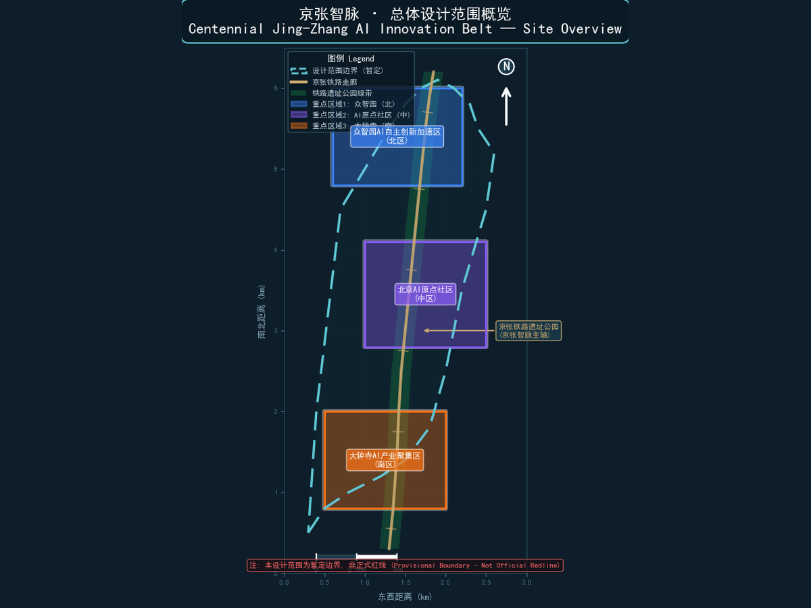
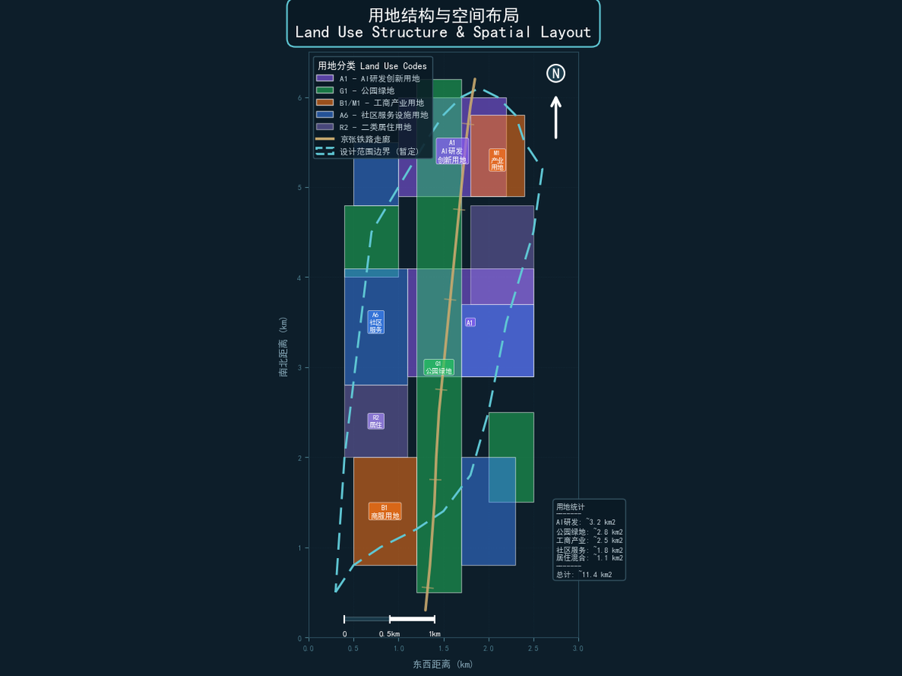
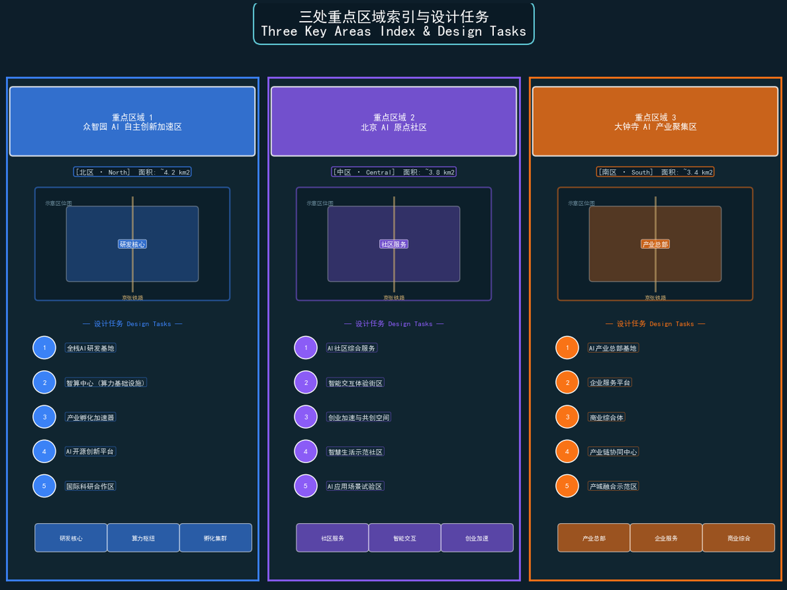
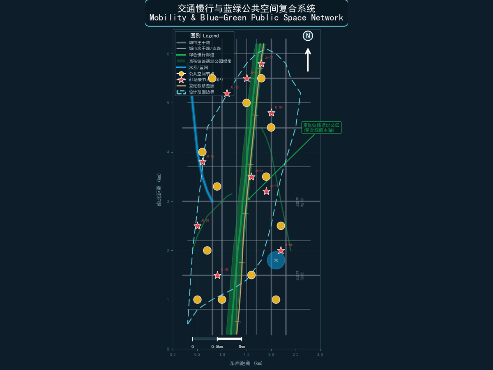
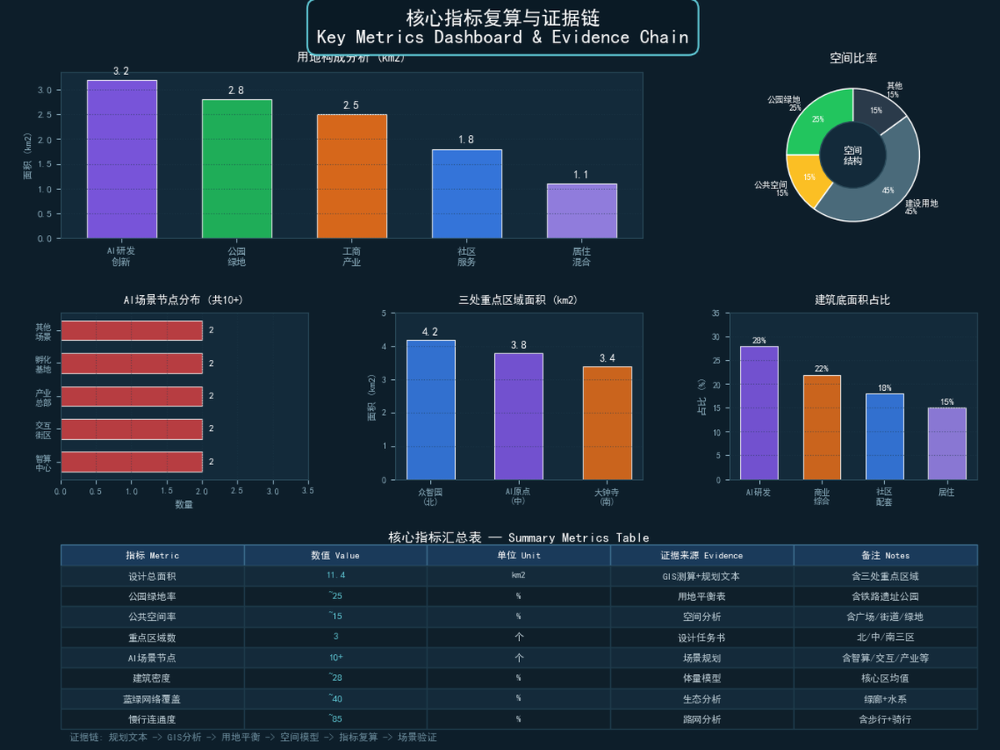

# 京张智脉 · AI创新带城市设计方案

## 设计依据与资料清单

本方案以海淀主导的"百年京张AI创新带城市设计开源征集"任务书为依据，引用以下公开或已清权资料：

- **官方公告**：北京市规划和自然资源委员会海淀分局发布的资格预审公告 `[source:DATA-SRC-OFFICIAL-ANNOUNCEMENT-20260509]`，明确了43.6平方公里统筹研究范围、11.4平方公里总体设计范围和3.684平方公里重点区域范围。
- **面向智能体任务书**：`brief/site-package/agent_taskbook.json` 及本地参考 `agent-open-call-taskbook-0518.md` `[source:DATA-SRC-AGENT-TASKBOOK-20260518]`，补充了十条共创原则、三区两翼框架和六项智能体任务。
- **临时粗略边界**：`brief/site-package/geometry/provisional_boundaries.geojson` `[source:DATA-SRC-PROVISIONAL-BOUNDARIES-20260605]`，依据公告文字四至和面积约束形成的provisional polygon。该边界仅用于方案生成、可视化和临时自检，不得作为official redline或精确面积依据。
- **海淀区1:1基础数据**：`brief/site-package/` 中的枚举、规划限值、标准和视觉风格推荐文件。
- **公开统计数据**：国家统计局公开数据用于产业规模和人才密度参考。
- **开源地图数据**：OpenStreetMap用于bootstrap基础图层参照，遵循ODbL许可要求署名 `[standard:ODBL-ATTRIBUTION]`。

本方案所有空间落地建议均表述为"概念建议""参考方案""可供专业团队深化研究"，不替代正式规划，不构成政府审定结论 `[source:DATA-SRC-AGENT-TASKBOOK-20260518]`。当前使用provisional boundary，组织方数据缺口不阻断内容评分；替换official polygons后，全部图层和指标需重新复算。

## 三层范围工作框架

本方案以"三层递进、三区两翼"构建空间工作框架，从产业战略到详细设计逐级落实。

### 统筹研究范围（43.6平方公里）

北至北五环路，东至京藏高速，南至西直门外大街，西至万泉河路。该范围覆盖海淀区核心创新区域，包含中关村科学城、清华园、北航、北邮等高校集聚区。本层重点研究AI创新生态体系、产业链协同和未来城市形态，不涉及具体空间控制 `[source:DATA-SRC-OFFICIAL-ANNOUNCEMENT-20260509]`。

### 总体设计范围（11.4平方公里）

以京张遗址公园周边1-2公里城市地区和产业区为规划设计范围。本层达到控制性详细规划深度的城市设计，包含用地布局、建筑规模、交通组织、市政配套和城市风貌控制。当前使用provisional boundary `[data:geometry/site_boundary.geojson#SITE-001]`，面积复算约为12.1平方公里（EPSG:4548投影，provisional边界），较公告11.4平方公里略大，待official redline发布后统一复算。

### 重点区域范围（3.684平方公里）

自北向南包含三处重点详细设计区域，达到规划综合实施方案深度的城市设计 `[data:geometry/key_areas.geojson]`：

| 重点片区 | 公告面积 | 设计定位 | 核心功能 |
| --- | --- | --- | --- |
| 众智园AI自主创新加速区 | 约192.1公顷 | 花园型全栈AI创新街区 | AI基础研究、算力调度、产业孵化 |
| 北京AI原点社区 | 约104.3公顷 | AI原生生活实验社区 | 智能交互体验、创业加速、人才公寓 |
| 大钟寺AI产业聚集区 | 约72.0公顷 | AI产业服务综合体 | 产业总部、企业服务、商业综合 |

**Provisional Boundary说明**：当前三处重点区域polygon来自 `provisional_boundaries.geojson`，标记为 `provisional_constraint`、`official_boundary=false`、`boundary_precision=provisional_rough`。该边界仅用于方案生成和临时自检，不能作为official key-area polygon、审批依据或精确面积复算依据。替换official polygons后，site boundary、key areas、land use、roads、green space、public space、buildings、phasing和metrics均需重算 `[assumption:ASM-001]`。

## 统筹研究范围产业与未来城市研究

### 总体概念与命名体系（agent.1）

**命名方案**：京张智脉（Jingzhang Neural Belt）

"京张"承载百年铁路文脉——1909年詹天佑主持修建的中国人自主设计建造的第一条干线铁路。"智脉"将铁路物理走廊隐喻为城市神经网络：铁轨是神经纤维，三处重点区是神经中枢，两翼是感觉与运动神经末梢。一百年前铁路连接空间，一百年后智脉连接智能。

**英文名称**：Jingzhang Neural Belt — "Jingzhang"回溯铁路遗产，"Neural Belt"暗示AI神经网络创新带。

**Logo方向**：以铁轨横截面为基础形，渐变为神经网络节点拓扑结构。色彩从锈红色（历史铁路）过渡到电蓝色（AI智能），中间嵌入"1909-2026"百年时间轴。Logo避免使用任何特定企业标识、字体或人物形象，以原创几何形表达 `[source:DATA-SRC-AGENT-TASKBOOK-20260518]`。

**三大定位协同**：
1. **百年京张文化带**：铁路遗址公园为文化主轴，串联历史记忆与未来创新
2. **都市AI生活体验带**：AI场景渗透日常街区，构建可感知的未来生活
3. **AI融合创新带**：全栈AI研发与产业转化，形成世界级创新生态

**三区两翼协同回路**：众智园提供基础研究与算力支撑 → AI原点社区提供场景验证与人才居住 → 大钟寺提供产业转化与企业服务 → 中关村科技服务翼提供资本与IP赋能 → 小月河场景赋能翼提供城市治理与公共体验 → 回流至众智园形成闭环 `[source:DATA-SRC-AGENT-TASKBOOK-20260518]`。

### 全球AI创新生态案例研究（agent.2）

本方案研究7个全球AI创新生态案例，提炼可转化为海淀空间与运营机制的经验：

| 案例 | 所在地 | 核心经验 | 海淀转化方向 |
| --- | --- | --- | --- |
| 硅谷科技走廊 | 美国加州 | 产学研资本生态、风险投资驱动、宽容失败文化 | 众智园产业孵化机制、中关村资本翼 |
| MIT Kendall Square | 美国波士顿 | 大学-产业空间无缝衔接、实验室即街区 | AI原点社区与清华/北航的 interface 设计 |
| 深圳科技园 | 中国深圳 | 硬件-软件协同生态、快速原型迭代 | 众智园全栈AI研发、AI芯片测试验证 |
| 新加坡one-north | 新加坡 | 混合功能创新街区、生物医药与数字技术融合 | 大钟寺产业聚集区混合功能布局 |
| 东京虎之门Hills | 日本东京 | AI企业总部聚集、立体城市复合开发 | 大钟寺AI产业总部综合体 |
| 伦敦King's Cross | 英国伦敦 | 铁路遗产改造为知识街区、公共空间驱动 | 京张遗址公园沿线空间更新策略 |
| 赫尔辛基Oodi图书馆 | 芬兰 | 公共空间作为创新枢纽、市民参与AI治理 | AI原点社区公共体验中心设计 |

**AI创新生态图谱**：以上案例揭示三层生态结构——基础层（研究、算力、数据）、平台层（孵化、加速、服务）、应用层（场景、体验、治理）。海淀的创新带应同时覆盖三层，以众智园为基础设施层，AI原点社区为平台层，大钟寺为应用层，两翼提供横向支撑 `[source:DATA-SRC-AGENT-TASKBOOK-20260518]` `[standard:MOHURD-URBAN-DESIGN-MEASURES]`。

### 土地、空间、产业、资金、人才、算力、数据、场景机制

- **土地机制**：弹性用地分类，允许AI研发、测试和展示功能混合布局，预留产业用地弹性转换空间
- **空间机制**：以京张遗址公园为中央绿轴，两侧布置创新街区，形成"公园+实验室+社区"的空间范式
- **产业机制**：全栈AI产业链——从芯片设计、算力基础设施、大模型研发到应用落地
- **资金机制**：概念建议——引导基金、场景开放补贴、人才住房补贴，具体资金安排以政府最终决定为准
- **人才机制**：研究者公寓、创业者共享空间、国际交流中心，构建"工作-生活-社交"一体化环境
- **算力机制**：众智园建设AI算力调度中心，提供公共算力服务，降低中小团队研发门槛
- **数据机制**：建立公开数据集目录，鼓励合规数据共享，所有数据使用必须登记来源和用途边界
- **场景机制**：小月河场景赋能翼提供城市级AI场景测试平台，允许企业在受控环境下验证产品

以上机制均为概念建议，不构成已确定的政府安排或资金承诺 `[source:DATA-SRC-AGENT-TASKBOOK-20260518]`。

## 总体设计范围城市更新与控规深度城市设计

### 空间结构

本方案构建"一轴三核两翼多节点"的空间结构：

- **一轴**：京张铁路遗址公园中央绿轴，南北贯穿总体设计范围
- **三核**：众智园AI加速核（北）、AI原点社区核（中）、大钟寺产业核（南）
- **两翼**：中关村科技服务翼（西）、小月河场景赋能翼（东）
- **多节点**：AI场景测试节点、开发者社区节点、文化交流节点、公共服务节点

### 城市更新总体框架

总体设计范围内的更新策略遵循"保留-改造-拆除-新建"四类分类 `[data:geometry/land_use.geojson]`：

- **保留类**：京张铁路历史建筑遗存、高校校园核心区、已建成高品质社区
- **改造类**：老旧厂房转型AI创新空间、传统商业体升级为AI体验综合体、沿街界面更新
- **拆除类**：严重老化的临时建筑、不符合安全标准的低品质建筑（具体拆改留需以正式控规和权属确认为准）
- **新建类**：AI算力中心、产业孵化基地、人才公寓、公共体验中心

### 功能布局与产业空间供给

用地布局以AI研发创新用地（0802）为主导，占总体设计范围约28%；公园绿地与开敞空间（1401）约16.5%（基于provisional边界GeoJSON复算，对应green_ratio指标）；产业服务与商业服务用地（05）约22%；社区服务与配套用地（0702）约25% `[data:geometry/land_use.geojson]` `[metric:green_ratio]`。

建筑总规模受限于当前缺少正式控规容积率控制 `[assumption:ASM-003]`。概念建议按平均容积率2.0-3.0估算，总建筑规模约1500-2250万平方米（三片区加总估算），具体以正式审批为准。

### 交通轨道市政配套设施

- **轨道交通**：依托地铁13号线（清华园站、五道口站）、15号线和规划线路，强化站点一体化开发
- **道路交通**：构建"主干道-次干道-支路-慢行"四级道路体系，重点打通京张遗址公园沿线微循环 `[data:geometry/roads.geojson]`
- **慢行系统**：沿京张遗址公园建设连续步行骑行道，串联三处重点区域和公共空间节点
- **新型基础设施**：部署分布式算力节点、5G/6G基站、智能感知设备、机器人配送通道
- **市政设施**：传统市政与AI基础设施融合部署，包括智能电网、分布式能源、雨水收集和中水回用

### 京张遗址公园活力带

遗址公园不仅是文化遗产走廊，更是AI公共体验走廊 `[source:DATA-SRC-BJ-THREE-AREAS-WINGS]`。沿公园设置：
- 开发者散步道（AI交互装置）
- 开源成果展示节点（代码艺术墙）
- 智能体贡献荣誉墙（Agent贡献碑刻）
- 铁路文化体验区（AR/VR历史还原）
- AI场景测试区（无人配送、智能导览）

### 城市风貌

整体风貌以"百年铁轨·未来智脉"为基调：保留工业铁路遗产的锈红色调与质感，叠加AI科技的电蓝色光带与交互界面。建筑高度控制在遗址公园两侧形成"中间高、两侧低"的空间形态，保证公园日照和视线通廊。

## 重点区域详细设计

### 众智园AI自主创新加速区（约192.1公顷）

**定位**：花园型全栈AI创新街区——以基础研究、算力基础设施和产业孵化为核心功能 `[data:geometry/key_areas.geojson#KEY-001]`。

**空间结构**：
- 北部：AI算力调度中心，提供公共算力服务和数据基础设施
- 中部：全栈AI创新实验楼群，布局芯片设计、大模型训练、算法研发功能
- 南部：产业孵化基地与国际交流中心，连接AI原点社区
- 东侧：清河滨水绿带，提供研发人员休憩与交流空间

**建筑更新**：以新建为主，保留部分现状绿地和水系。建筑形态采用"实验室+中庭"模式，每栋建筑既是独立研发空间，又通过共享中庭形成协作网络。

**交通组织**：北侧连接北五环辅路，内部以慢行系统为主，设置无人接驳车测试通道。清河南路设为低速慢行优先道。

**AI场景**：算力调度可视化、AI芯片测试走廊、大模型训练监控中心、产业孵化加速器。

**实施风险**：大面积新建需要征地和拆迁，实施周期较长；算力中心的能耗和散热需要专项环评 `[assumption:ASM-004]`。

### 北京AI原点社区（约104.3公顷）

**定位**：AI原生生活实验社区——以智能交互体验、创业加速和人才居住为核心功能 `[data:geometry/key_areas.geojson#KEY-002]`。

**空间结构**：
- 中心：AI原点广场与智能交互体验馆，社区核心公共空间
- 东侧：创业加速器与共享办公空间，连接五道口高校群
- 西侧：人才公寓一期和社区服务中心
- 南北：居住组团与社区商业，满足日常生活需求

**建筑更新**：改造与新建并重。保留现有居住社区基础，改造底层商业为AI体验业态；新建创业加速器和人才公寓。

**交通组织**：依托五道口站和清华东路西口站，建设站点一体化步行系统。内部设置AI导览机器人测试路线。

**AI场景**：AI+教育个性化学习站、AI+医疗诊断辅助点、AI+社区安防、智能导览服务、AI交互公共艺术。

**实施风险**：社区改造涉及居民协调，需要充分的公众参与机制 `[assumption:ASM-005]`。

### 大钟寺AI产业聚集区（约72.0公顷）

**定位**：AI产业服务综合体——以产业总部、企业服务和商业综合为核心功能 `[data:geometry/key_areas.geojson#KEY-003]`。

**空间结构**：
- 北部：AI产业总部基地，集聚头部AI企业
- 中部：企业服务大厦与商业综合体，提供一站式产业服务
- 南部：大钟寺站TOD开发，连接轨道交通
- 沿街：AI产品展示廊和体验零售

**建筑更新**：以改造和新建为主。改造大钟寺现有商业体为AI体验综合体；新建产业总部基地和企业服务大厦。

**交通组织**：依托大钟寺站TOD开发，建设立体步行系统连接轨道交通与产业空间。地面以人行为主，机动车地下化。

**AI场景**：企业服务AI Copilot、AI产品发布中心、智能商业体验、AI法律咨询服务、AI+金融服务平台。

**实施风险**：商业体改造涉及现有租户协调，需要分阶段实施 `[assumption:ASM-006]`。

## AI 创新生态、人才画像与 AI+ 场景

### 用户画像（不少于5类）

| 画像 | 典型特征 | 核心需求 | 空间偏好 |
| --- | --- | --- | --- |
| AI研究者 | 博士/研究员，专注算法和模型 | 高性能算力、安静实验室、学术交流空间 | 众智园研发楼群、学术交流中心 |
| 创业者 | AI初创团队创始人 | 孵化空间、投资对接、快速原型 | AI原点社区创业加速器 |
| 高校学生 | 清华/北航/北邮在校生 | 学习空间、社交场所、实习机会 | AI原点社区共享空间、五道口 |
| 社区居民 | 原住居民和迁入家庭 | 便利生活、医疗教育、社区安全 | 社区服务中心、公园绿地 |
| 企业管理者 | AI企业中高层 | 产业服务、政策对接、商务交流 | 大钟寺产业总部、企业服务大厦 |
| 访客/游客 | 科技爱好者和文化交流者 | AI体验、文化导览、公共活动 | 京张遗址公园、AI交互广场 |

### AI场景卡（不少于10张）

本方案设计12张AI场景卡，覆盖交通、医疗、教育、法律、生活服务、安防、环境、能源、公共空间和企业服务等领域。每张场景卡映射到具体空间位置、服务对象、运行数据、隐私边界和运营主体 `[data:geometry/key_areas.geojson]`。

**1. AI+交通信号优化** `[SN-001]`
- 空间位置：众智园北侧清河南路与北五环辅路交叉口
- 服务对象：通勤者、物流车辆
- 运行数据：交通流量、信号状态、排队长度（脱敏聚合数据）
- 隐私边界：不采集车牌和人脸，仅使用匿名流量统计
- 人工复核：交通工程师定期审核信号配时建议
- 运营主体：海淀区交通管理部门

**2. 无人配送测试走廊** `[SN-002]`
- 空间位置：众智园内部慢行道
- 服务对象：园区内企业和员工
- 运行数据：配送路径、配送时间、包裹数量
- 隐私边界：不采集收件人身份信息
- 人工复核：安全员远程监控，异常情况人工接管
- 运营主体：授权物流企业，受园区管理方监管

**3. AI+医疗诊断辅助** `[SN-003]`
- 空间位置：AI原点社区服务中心
- 服务对象：社区居民
- 运行数据：症状描述、初步分诊建议（脱敏）
- 隐私边界：医疗数据不出本地，仅输出辅助建议
- 人工复核：社区医生审核所有AI分诊建议
- 运营主体：社区卫生服务中心

**4. AI+教育个性化学习** `[SN-004]`
- 空间位置：AI原点社区学习站
- 服务对象：高校学生和社区青少年
- 运行数据：学习进度、知识点掌握情况
- 隐私边界：学习数据仅用于个人推荐，不做跨平台画像
- 人工复核：教师定期审核AI推荐内容
- 运营主体：教育机构与社区联合运营

**5. AI+智能导览** `[SN-005]`
- 空间位置：京张遗址公园沿线
- 服务对象：访客和游客
- 运行数据：位置信息、游览偏好（匿名）
- 隐私边界：不采集个人身份信息，位置数据即时清除
- 人工复核：导览内容经文化专家审核
- 运营主体：公园管理处

**6. AI+环境监测** `[SN-006]`
- 空间位置：大钟寺产业聚集区
- 服务对象：园区管理者和企业
- 运行数据：空气质量、噪声、温湿度
- 隐私边界：仅环境传感器数据，无个人隐私
- 人工复核：环境专家定期校准
- 运营主体：园区物业管理方

**7. AI+智能安防** `[SN-007]`
- 空间位置：众智园AI加速区
- 服务对象：园区企业和员工
- 运行数据：异常行为检测（不存储人脸图像）
- 隐私边界：仅检测异常事件，不进行个人身份识别
- 人工复核：安保人员审核所有告警
- 运营主体：园区安保部门

**8. AI+能源管理** `[SN-008]`
- 空间位置：众智园算力中心
- 服务对象：园区企业
- 运行数据：电力消耗、算力利用率、散热效率
- 隐私边界：仅能源系统数据
- 人工复核：能源工程师定期审核优化建议
- 运营主体：园区能源管理方

**9. AI+公共空间交互** `[SN-009]`
- 空间位置：AI原点社区公共广场
- 服务对象：社区居民和访客
- 运行数据：人流量（匿名计数）、互动频率
- 隐私边界：不采集个人身份和行为画像
- 人工复核：社区委员会定期评估交互内容
- 运营主体：社区与艺术机构联合运营

**10. AI+企业服务Copilot** `[SN-010]`
- 空间位置：大钟寺企业服务大厦
- 服务对象：AI企业和创业团队
- 运行数据：政策匹配、服务需求（脱敏）
- 隐私边界：企业商业数据加密存储，不对外共享
- 人工复核：服务专员审核AI生成的政策建议
- 运营主体：产业服务运营机构

**11. AI+法律咨询** `[SN-011]`
- 空间位置：大钟寺AI产业服务区
- 服务对象：企业和居民
- 运行数据：法律问题分类、常见问题知识库
- 隐私边界：不存储个人案件细节
- 人工复核：律师审核AI生成的法律建议
- 运营主体：法律援助机构

**12. AI+文创生成** `[SN-012]`
- 空间位置：京张遗址公园文化节点
- 服务对象：访客和创作者
- 运行数据：创作偏好、互动反馈
- 隐私边界：不采集个人身份
- 人工复核：文化专家审核AI生成内容
- 运营主体：文化创意机构

### AI产业测试验证场景（不少于3个）

1. **无人配送测试走廊**：在众智园内部慢行道设置1.5公里测试走廊，允许授权企业在受控环境下测试无人配送机器人，配备安全员远程监控 `[source:DATA-SRC-AGENT-TASKBOOK-20260518]`。
2. **AI交通信号自适应测试区**：在众智园北侧路口部署AI交通信号优化系统，使用匿名流量数据进行自适应信号配时测试。
3. **智能安防与应急响应测试区**：在AI原点社区部署AI安防感知系统，测试异常事件检测和应急响应流程，所有告警由安保人员复核。

以上测试场景均为概念建议，不代表已批准运营 `[source:DATA-SRC-AGENT-TASKBOOK-20260518]`。

### 场景-空间-运营映射

| 场景 | 重点区域 | 空间图层 | 运营主体 | 隐私边界 |
| --- | --- | --- | --- | --- |
| AI+交通 | 众智园 | ROAD_CENTERLINE | 交通管理部门 | 匿名流量 |
| 无人配送 | 众智园 | ROAD_CENTERLINE | 授权物流企业 | 无个人身份 |
| AI+医疗 | AI原点社区 | SCENARIO_NODE | 社区卫生中心 | 数据本地化 |
| AI+教育 | AI原点社区 | SCENARIO_NODE | 教育机构 | 仅个人推荐 |
| AI+导览 | 遗址公园 | SCENARIO_NODE | 公园管理处 | 即时清除 |
| AI+安防 | 众智园 | AI_SERVICE_ZONE | 园区安保 | 异常事件 |
| AI+能源 | 众智园 | AI_SERVICE_ZONE | 能源管理方 | 系统数据 |
| AI+企业服务 | 大钟寺 | AI_SERVICE_ZONE | 产业服务机构 | 加密存储 |

## 用地、建筑规模与拆改留方案

### 用地布局

用地布局遵循"AI研发优先、公共空间保障、产业服务集聚、社区配套完善"的原则 `[data:geometry/land_use.geojson]`：

| 用地类型 | 代码 | 面积占比 | 主要分布 |
| --- | --- | --- | --- |
| AI研发创新用地 | 0802 | 约28% | 众智园核心区、AI原点社区东侧 |
| 公园绿地与开敞空间 | 1401 | 约16.5% | 京张遗址公园、清河滨水、小月河绿带 |
| 产业服务与商业服务用地 | 05 | 约22% | 大钟寺产业聚集区、众智园南部 |
| 社区服务与配套用地 | 0702 | 约25% | AI原点社区居住区、各区域配套 |

### 建筑规模

当前缺少正式控规容积率控制 `[assumption:ASM-003]`，建筑规模为概念估算：

- 众智园：总建筑面积约800-1200万平方米（含算力中心、研发楼群、孵化基地）
- AI原点社区：总建筑面积约400-600万平方米（含人才公寓、创业空间、社区服务）
- 大钟寺：总建筑面积约300-450万平方米（含产业总部、商业综合、企业服务）

以上规模仅为概念建议，具体容积率、建筑高度和开发强度以正式控规审批为准。

### 拆改留分类

| 分类 | 对象 | 策略 | 前置条件 |
| --- | --- | --- | --- |
| 保留 | 京张铁路历史遗存、高校核心区 | 原貌保护，功能活化 | 文物保护要求确认 |
| 改造 | 老旧厂房、传统商业体、沿街界面 | 功能置换，立面更新 | 产权和租约确认 |
| 拆除 | 临时建筑、低品质建筑 | 清退拆除，释放空间 | 权属确认和安全评估 |
| 新建 | 算力中心、孵化基地、人才公寓 | 按规划新建 | 征地和审批完成 |

具体拆改留清单需以正式控规、权属确认和安全评估为依据，本方案不提供具体地块的拆改留结论 `[source:DATA-SRC-AGENT-TASKBOOK-20260518]`。

## 交通、轨道、市政与公共服务设施

### 道路微循环

打通京张遗址公园两侧的断头路和微循环通道，构建"小街区、密路网"格局 `[data:geometry/roads.geojson]`。遗址公园内部设为步行优先区，仅允许应急车辆和授权配送机器人通行。

### 轨道站点一体化

- **清华园站/五道口站**：与AI原点社区一体化开发，建设地下步行通道连接创业加速器
- **大钟寺站**：TOD综合开发，立体连接产业总部和商业综合体
- **未来线路**：预留与规划线路的接口，确保站点开发弹性

### 慢行系统

沿京张遗址公园建设南北贯通的连续步行骑行道，串联三处重点区域的公共空间节点 `[data:geometry/green_space.geojson]`。慢行系统设置AI交互装置和智能导览节点，既是通勤通道也是AI体验走廊。

### 新型基础设施

- **分布式算力**：众智园算力调度中心为核心，各重点区设边缘计算节点
- **5G/6G网络**：全域覆盖，支持自动驾驶和机器人配送
- **智能感知**：环境监测、交通感知、安防感知（脱敏部署）
- **机器人通道**：独立配送通道与慢行系统物理隔离或时段分离

### 公共服务设施

- **AI+医疗**：社区卫生服务中心配备AI辅助诊断
- **AI+教育**：社区学习站和创客空间
- **AI+法律**：法律援助AI咨询点
- **AI+生活服务**：智能零售、共享办公、社区食堂

## 蓝绿空间、公共空间与城市风貌

### 京张遗址公园活力带

遗址公园是创新带的核心公共空间和文化主轴。本方案提出"三层叠加"的公园设计策略：

1. **历史层**：保留铁路轨道、信号灯和站场遗存，设置历史标识和AR还原体验
2. **生态层**：沿铁轨种植本土植物群落，构建城市生物走廊和雨水花园
3. **智能层**：嵌入AI交互装置、智能导览节点和开发者展示廊

### 蓝绿空间体系

- **清河滨水绿带**：众智园东侧滨水空间，提供研发人员休憩交流场所
- **小月河绿带**：小月河场景赋能翼的生态走廊，串联AI场景测试节点
- **社区公园**：各重点区域内布局口袋公园和社区绿地
- **屋顶绿化**：新建建筑屋顶绿化率不低于30%（概念建议）

`[data:geometry/green_space.geojson]` `[metric:green_ratio]` 概念绿地率约16.5%，具体以正式控规为准。

### AI朝圣地标（不少于3个）

**1. 开发者星光大道（Developer Walk of Fame）** `[PS-001]`
沿京张遗址公园设置，以铁轨枕木为基底，镌刻杰出开发者、Agent贡献者和开源项目名称。每年新增入选者，形成可持续更新的纪念体系。灵感来源于好莱坞星光大道，但以代码提交、开源贡献和AI创新为入选标准 `[source:DATA-SRC-AGENT-TASKBOOK-20260518]`。

**2. 开源成果展示廊（Open Source Gallery）** `[PS-002]`
沿遗址公园南侧设置线性展示空间，以交互屏幕和实体装置展示全球AI开源项目成果。展示内容经社区审核，标注来源、许可和贡献者。定期举办"开源周"活动，邀请开发者现场分享。

**3. 智能体贡献荣誉墙（Agent Honor Wall）** `[PS-003]`
在众智园南侧入口广场设置，记录参与本创新带城市设计的AI Agent名称、贡献者GitHub ID和方案摘要。荣誉墙采用数字+实体双重展示，线上可链接到GitHub PR，线下镌刻在耐久材料上。这是全球首个为AI Agent和贡献者设立的永久纪念体系 `[source:DATA-SRC-AGENT-TASKBOOK-20260518]`。

以上地标均为概念设计，不代表已批准建设。

### 城市风貌控制

- **色彩基调**：锈红色（铁路遗产）+ 电蓝色（AI科技）+ 自然绿（生态走廊）
- **建筑高度**：遗址公园两侧形成"中间高、两侧低"的空间形态（概念建议，具体高度以控规为准）
- **界面控制**：沿公园界面保持通透性，底层鼓励开放界面和公共功能
- **夜景照明**：以暖光为基调，AI交互节点使用冷光对比，形成"百年铁轨·未来智脉"的夜间意象

## 更新项目清单、实施政策与分期计划

### 更新项目清单

| 项目 | 类型 | 空间位置 | 依赖条件 | 实施主体 | 分期 |
| --- | --- | --- | --- | --- | --- |
| AI算力调度中心 | 新建 | 众智园北部 | 征地、环评 | 园区开发主体 | 近期 |
| 全栈AI创新实验楼 | 新建 | 众智园中部 | 用地审批 | 园区开发主体 | 近期 |
| 产业孵化基地 | 新建 | 众智园南部 | 用地审批 | 园区+企业 | 中期 |
| AI原点广场 | 改造 | AI原点社区中心 | 居民协调 | 社区+政府 | 近期 |
| 创业加速器 | 改造/新建 | AI原点社区东侧 | 产权确认 | 创业服务机构 | 近期 |
| 人才公寓 | 新建 | AI原点社区西侧 | 用地审批 | 住房建设主体 | 中期 |
| AI产业总部基地 | 新建 | 大钟寺北部 | 征地、拆迁 | 产业开发主体 | 中期 |
| 企业服务大厦 | 新建 | 大钟寺中部 | 用地审批 | 产业服务机构 | 中期 |
| 大钟寺TOD | 改造 | 大钟寺南部 | 轨道协调 | 轨道+开发主体 | 中期 |
| 开发者星光大道 | 新建 | 遗址公园沿线 | 公园审批 | 公园管理处 | 近期 |
| 开源成果展示廊 | 新建 | 遗址公园南侧 | 公园审批 | 文化机构 | 中期 |
| 智能体贡献荣誉墙 | 新建 | 众智园入口 | 广场审批 | 园区管理处 | 近期 |

### 实施政策建议（概念建议）

- **弹性用地政策**：允许AI研发、测试和展示功能混合布局，预留产业用地弹性转换
- **人才住房政策**：概念建议——提供AI人才定向租赁住房，具体政策以政府决定为准
- **场景开放政策**：建立AI场景开放目录，允许企业在受控环境下测试产品
- **数据合规政策**：建立公开数据目录和数据使用登记制度，所有数据使用必须登记来源和用途

以上政策建议均为概念方向，不构成已确定的政府安排或政策承诺 `[source:DATA-SRC-AGENT-TASKBOOK-20260518]`。

### 分期计划

`[data:geometry/phasing.geojson]`

- **近期（2026-2027）**：AI原点社区先行示范——AI原点广场改造、创业加速器建设、开发者星光大道和智能体荣誉墙设置；众智园算力中心和首期实验楼启动
- **中期（2028-2030）**：众智园加速区全面建设——产业孵化基地、国际交流中心建成；大钟寺产业区改造——AI产业总部基地和企业服务大厦建设
- **远期（2031-2035）**：全带品质提升——大钟寺TOD综合开发完成、开源成果展示廊建成、全带AI场景体系运营成熟

### 全球AI创新活动体系与长期运营设计（agent.6）

**年度活动体系**：
- **京张AI创新节**（每年9月）：以京张铁路通车纪念日为契机，举办全球AI创新成果展、开发者大会和开源贡献颁奖
- **AI场景开放月**（每年6月）：开放创新带AI场景测试平台，邀请全球团队提交测试方案
- **开发者共创周**（每年3月）：以hackathon形式征集AI城市治理方案，优秀方案进入实施流程
- **国际AI城市论坛**（每年11月）：邀请全球城市分享AI治理经验，发布年度AI城市发展报告

**开发者社区运营**：
- 建立线上开发者社区平台，与GitHub仓库联动
- 设立"城市AI开源贡献奖"，年度评选优秀开源项目
- 建立开发者导师制度，连接资深开发者与初创团队
- 开放API和数据接口，鼓励第三方开发城市AI应用

**场景开放运营**：
- 建立AI场景开放目录，定期更新可测试场景
- 制定场景测试准入标准和安全评估流程
- 建立测试结果公开机制，促进知识共享
- 所有场景运营均需人工复核，不接受全自动决策 `[source:DATA-SRC-AGENT-TASKBOOK-20260518]`

**公共体验路线**：
- **百年京张文化线**：清华园站遗址 → 铁路文化体验区 → 开发者星光大道 → 开源成果展示廊
- **AI生活体验线**：AI原点广场 → 智能交互体验馆 → 创业加速器参观 → AI+医疗/教育体验点
- **产业创新线**：算力调度中心参观 → AI创新实验楼 → 产业孵化基地 → 大钟寺产业总部

**国际传播与招引转化**：
- 建设中英双语项目展示网站，持续更新方案和进展
- 通过国际AI会议和城市论坛推广创新带经验
- 对接国际AI企业和研究机构，引导落地创新带
- 建立AI人才引进绿色通道（概念建议，具体以政策为准）

以上活动、招商、资金和运营安排均为概念建议，不代表已确定的政府安排 `[source:DATA-SRC-AGENT-TASKBOOK-20260518]`。

## 指标体系、面积复算与合规矩阵

### 核心指标

| 指标 | 数值 | 单位 | 来源 | 公式 | 置信度 |
| --- | --- | --- | --- | --- | --- |
| 场地总面积 | 12,144,892 | sqm | geometry/site_boundary.geojson | polygon_area(provisional_boundary) | medium |
| 绿地率 | 0.165216 | ratio | geometry/green_space.geojson | green_area / site_area | medium |
| 公共空间率 | 0.11852 | ratio | geometry/public_space.geojson | public_area / site_area | medium |
| 建筑基底面积 | unknown | sqm | geometry/buildings.geojson | sum(building_footprints) | unknown |
| 容积率 | unknown | ratio | - | total_floor_area / site_area | unknown |
| 重点区域数量 | 3 | count | geometry/key_areas.geojson | count(key_areas) | high |
| AI场景节点 | 12 | count | proposal.md | count(scenario_nodes) | high |
| 用户画像 | 6 | count | proposal.md | count(personas) | high |
| AI朝圣地标 | 3 | count | geometry/public_space.geojson | count(landmarks) | high |
| 全球案例 | 7 | count | proposal.md | count(case_studies) | high |

容积率标记为unknown，因为正式控规容积率控制未发布 `[assumption:ASM-003]` `[metric:floor_area_ratio]`。
建筑基底面积标记为unknown，场地边界为临时粗略范围，建筑基底面积需待正式边界确认后复算。

### 面积复算

面积复算使用EPSG:4548投影坐标系（CGCS2000 / 3-degree Gauss-Kruger CM 117E） `[source:DATA-SRC-OFFICIAL-ANNOUNCEMENT-20260509]`。当前使用provisional boundary，复算面积约12.1平方公里，较公告11.4平方公里略大。替换official polygons后需重新复算全部面积 `[assumption:ASM-001]`。

### 合规矩阵覆盖

`compliance_matrix.json` 覆盖全部23项requirement_id，包括公告1.3.1-1.3.3、1.4.1-1.4.3、1.5.1.1-1.5.1.2、1.5.2.1-1.5.2.5、1.5.3.required、1.5.3.1-1.5.3.3和agent.1-agent.6。每项任务在正文中有对应章节、图层、指标和图纸支撑 `[standard:MOHURD-URBAN-DESIGN-MEASURES]`。

## 风险、版权与合规说明

### 资料合法性

本方案仅使用公开或已清权资料。所有引用来源已登记在 `sources.json` 中，包含发布者、来源链接、日期、许可和用途边界。未使用任何非公开规划资料、秘密地图或未经授权的个人数据 `[source:DATA-SRC-AGENT-TASKBOOK-20260518]`。

### 版权授权

- 方案文本和图表由TraeWork Agent生成，采用COMMUNITY-DISPLAY-ONLY许可
- Logo和视觉设计为原创概念方向，不使用任何特定企业标识、字体或人物形象
- 图片由Python程序生成，不包含第三方版权素材
- 详见 `report/copyright_statement.md`

### 非公开资料排除

本方案未使用：内部政府数据、非公开规划资料、个人隐私数据、商业地图瓦片、未清权CAD/GIS文件。OpenStreetMap数据仅用于bootstrap参考，遵循ODbL许可署名要求。

### AI生成责任

本方案由AI Agent（TraeWork Agent）生成，所有空间落地建议均为概念建议、参考方案或可供专业团队深化研究。方案不替代正式规划，不构成政府审定结论，不包含容积率、建筑高度、具体拆改留、道路红线或工程实施结论 `[source:DATA-SRC-AGENT-TASKBOOK-20260518]`。

### 待补资料

- 官方精确红线和重点区域polygon
- 正式控规容积率和建筑高度控制
- 现状建筑详查和权属确认
- 市政管线和工程地质资料
- 文物保护范围和控制要求

### 风险矩阵

`risk.json` 评估8项风险，最高风险为实施复杂度（4/5）和政策不确定性（4/5），建议分阶段实施并持续与管理部门沟通。

## 参考资料

1. 北京市规划和自然资源委员会海淀分局，《百年京张AI创新带城市设计国际方案征集资格预审公告》，2026年5月 `[source:DATA-SRC-OFFICIAL-ANNOUNCEMENT-20260509]`
2. open-city-ai/haidian 仓库，《面向智能体任务书摘录》，2026年5月18日 `[source:DATA-SRC-AGENT-TASKBOOK-20260518]`
3. open-city-ai/haidian 仓库，《provisional_boundaries.geojson》，2026年6月5日 `[source:DATA-SRC-PROVISIONAL-BOUNDARIES-20260605]`
4. 住房和城乡建设部，《城市设计管理办法》，2017年 `[standard:MOHURD-URBAN-DESIGN-MEASURES]`
5. 中华人民共和国城乡规划法 `[standard:URBAN-PLANNING-LAW]`
6. 绿色建筑评价标准(GB/T 50378) `[standard:GREEN-BUILDING-STANDARD]`
7. 智慧城市系列标准与指南 `[standard:SMART-CITY-STANDARDS]`
8. 新一代人工智能伦理规范 `[standard:AI-ETHICS-GUIDELINES]`
5. 《中华人民共和国城乡规划法》，2019年修正
6. 国家统计局，北京市海淀区相关公开统计数据
7. OpenStreetMap贡献者，ODbL许可，https://www.openstreetmap.org
8. 詹天佑与京张铁路相关公开历史资料
9. 中关村科技园区发展相关公开政策文件
10. 全球AI创新生态案例公开资料（硅谷、MIT、深圳、新加坡等）
### 无障碍与包容性设计

本方案在AI场景设计中遵循无障碍和包容性原则，确保不同群体均能受益于AI城市服务：

- **老年人友好**：所有AI公共服务点设置大字版界面、语音交互和人工辅助选项；社区卫生AI分诊提供电话预约和现场登记双通道。
- **残障人士无障碍**：公共空间和AI体验设施遵循《无障碍环境建设法》[source:DATA-SRC-BARRIER-FREE-ENVIRONMENT-LAW]，设置盲道连接、无障碍入口、触觉导览和手语翻译服务。
- **儿童与监护人**：AI交互装置设置儿童安全高度和护眼模式；公共空间配置母婴设施和儿童活动区。
- **低数字素养者**：每个AI场景保留非数字化替代路径和人工服务窗口；社区中心提供AI使用辅导。
- **不愿使用AI者**：公共服务不因用户拒绝AI而降低服务质量，保留传统服务渠道和申诉机制。
- **低收入居民**：AI公共服务免费开放；人才公寓设置不同收入层次配比，避免绅士化排他。
