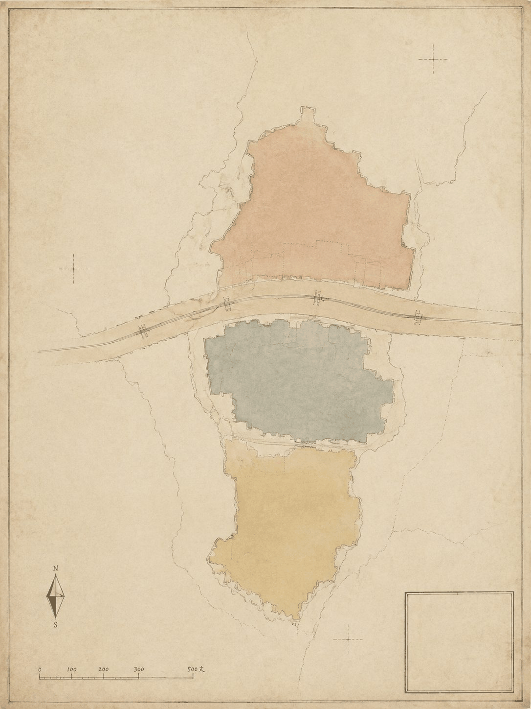
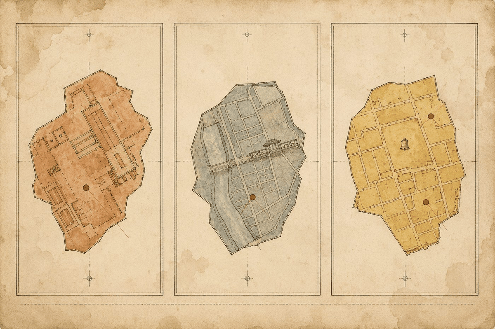
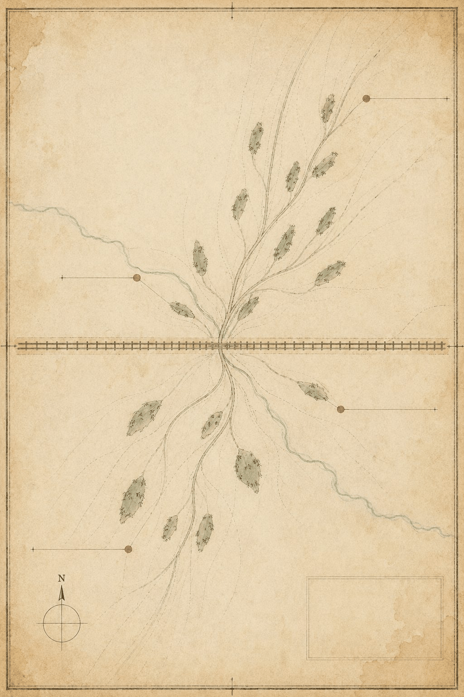

# 京张博物志：五博体系下的AI生活场景与城市治理设计

> **志序**：京张铁路通车之年，官方委谭锦棠沿全线摄影建档，凡桥隧站房、机车车辆，次第采录，题曰《京张路工撮影》，今为中国档案文献遗产。一百一十余年后，此线复为AI所行。本方案以同样之精神，为行于这条线上的每一桩AI服务立一传、入一藏、绘一图。**博物者，博观万物而约取其理；志者，记其实，考其用，传于后。** 城市即志书，AI即新物种，人即最终之编纂者。

> **一句话检验标准：这条带上的任何一项 AI 服务，都必须能回答「谁为它负责、出了错谁签字」——答不上来，就不入藏。**

这不是补充条款，是整个方案的判据。它把 AI 治理从"伦理宣言"换成一个可核验的问题：每个服务挂牌时，能不能指认出人类负责人、人工兜底路径、错误公开记录与退出机制？答案是否，服务就不该进入公共空间；答案是是，智能层才有资格叠加。京张铁路百年间最可靠的制度是交接班——它从不假设下一班一定接得住，所以必须有人当面签收；本方案的"入藏评审"正是这条制度在 AI 时代的转译：能力可以流动，责任必须有人签字。

## 一页执行摘要 / Executive Brief

| 评审问题 | 京张博物志的回答 | 可核验成果 |
| --- | --- | --- |
| 公共底线 | 任何人可获得人工兜底服务并触发停用与申诉；10 个场景各写明责任主体、启动条件与评估阈值 | 十卡六件套、合规基线表（法条对照）、风险登记表 |
| 核心命题 | 城市即志书，AI 即新物种，人类握最终入藏评审权；能力经"学—考—用"三阶段方可上岗 | 五博体系、入藏评审委员会、三份机器可读协议（含样例与校验报告） |
| 原创性 | "博"字单字成系，五博立纲；入藏评审/标本修复室/采集陪练场为原创机制 | 原创概念边界表 |
| 空间响应 | 一脊五卷（博弈/博喻/博大/博览/博爱）+ 十场景节点 + 五图版 | 十类 GeoJSON、五张博物画图版、A3/A0 双语图册 |
| 合规锚点 | "可停用、可投诉、有人兜底"中法定出处与本方案自设标准逐行分列 | 合规基线表四列对照（《无障碍环境建设法》《生成式AI管理办法》、国办发〔2020〕45号） |
| 实施起点 | 三测试场景先行试点，入藏评审季度运行，年度编纂机制 | 试点时间表、利益相关方矩阵、三期分阶段 |
| 证据状态 | 几何与指标在 EPSG:4548 可复算；AI 协议样例经 schema 校验（0 结构错误） | metrics.json、协议校验报告、sources.json |
| 决策边界 | 全部空间、品牌、活动、时限与角色安排均为概念建议，不是法定规划或政府承诺 | 风险章节、assumptions.json |

## 设计依据与资料清单

本 formal 方案以北京市规划和自然资源委员会海淀分局发布的《百年京张AI创新带城市设计国际方案征集资格预审公告》为第一依据，并以 `brief/site-package/` 中经维护者登记的临时粗略边界、重点区域、枚举、指标和来源清单为机器可读依据。AI agent 在生成方案前必须读取 `design_brief.json`、`allowed_design_space.json`、`sources.json`、`enums/`、`ranges/`、`schemas/`、`data/source_registry.json` 和 `data/processed/agent_fact_pack.md`，并用 `project_scope_summary.csv`、`agent_task_requirements.csv`、`source_use_matrix.csv`、`missing_data_checklist.csv` 建立任务、范围、资料用途和缺口清单。所有设计判断都要拆分为可追溯来源、可复算指标、可校验图层和可人工复核假设。公告要求方案达到控制性详细规划的城市设计深度和规划综合实施方案的城市设计深度，因此文本叙述不能替代 GeoJSON、指标表、A3 文册、A0 展板和 HTML 电子展示成果 [source:OFFICIAL-ANNOUNCEMENT]。本志之编纂体例另依智能体任务书 [source:AGENT-TASKBOOK]，成果深度由现状研判项约束 [depth:existing_conditions_diagnosis]。

方案不是独立愿景文本，而是从公告、面向智能体任务书和场地资料出发组织成果；本节只把最关键依据放在判断旁边。完整来源和标准覆盖分别保存在 `sources.json`、`standard_matrix.json` 与 `design_depth_matrix.json`，不在正文重复机器索引 [source:SOURCE-REGISTRY]。

资料登记表的使用边界如下 [source:SOURCE-REGISTRY]：

- `data/source_registry.json` 登记公开、清权与临时资料的用途边界。
- 当前登记摘要：formal 可用资料 7 条，背景资料 1 条，provisional-only 资料 1 条。
- agent 不得把 background_only 或 provisional_only 资料升级为 official boundary、法定控规、正式评分依据或政府实施承诺。

`data/processed/agent_fact_pack.md` 是本方案的阅读导航层，不是新的权威来源 [source:PROCESSED-FACT-PACK]。它帮助 agent 把三层范围、三处重点区、公告任务、agent.1-agent.6、资料可用性和缺资料事项组织成可读方案；事实判断仍需回到已登记的原始材料 [source:OFFICIAL-ANNOUNCEMENT] [source:AGENT-TASKBOOK]。



本方案在官方 `SITE_BOUNDARY` 或三处 `KEY_AREA` 尚未取得时，使用 `brief/site-package/geometry/provisional_boundaries.geojson` 生成临时 formal 包。提交包中的 `geometry/site_boundary.geojson` 与 `geometry/key_areas.geojson` 均标注为 `provisional_constraint`、`official_boundary=false`，只能用于方案生成、自检、可视化和设计讨论，不能作为 official redline、审批依据、精确面积依据或法定控制结论。该组织方数据缺口本身不阻断内容评分；替换 official polygons 后，site boundary、key areas、land use、roads、green space、public space、buildings、phasing 和 metrics 均需重算 [data:geometry/site_boundary.geojson#SITE-001]。范围面积之复核以 [metric:site_area_sqm] 为准，三处重点区之图层见 [data:geometry/key_areas.geojson#PROV-KEY-001]，其数量指标见 [metric:key_area_count]。

### 合规基线：先分清法定下限，再说本方案自设的标准

本方案反复出现三条红线——可停用、可投诉、人工兜底。**其中只有一部分有法定出处，其余是本方案自设的公共服务标准。** 下表逐行分开写明两者，因为把自愿采用的标准读成普遍法定义务，本身就是一种误导；法条适用对象与效果以官方原文为准，本表不作法律意见 [source:GENERATIVE-AI-INTERIM-MEASURES] [source:BARRIER-FREE-ENVIRONMENT-LAW] [source:ELDERLY-SMART-TECH-PLAN]：

| 本方案红线 | 法定依据与其实际效果 | 依据未覆盖、本方案自设的部分 | 本方案承担的空间与运营后果 |
| --- | --- | --- | --- |
| 智能服务可被停止（退出机制） | 《生成式人工智能服务管理暂行办法》第十四条（七部门，2023-08-15 施行）：**发现违法内容时**提供者应及时停止生成、传输并消除。该条是**违法内容处置义务，未设定面向一般用户的停用权** | 面向使用者的常设停用入口、非违法情形下的按需停用——属本方案自设的公共服务标准 | 每张场景卡"考"部必须写明退出机制与撤展条件；撤展流程入入藏评审规则 |
| 投诉入口便捷且时限公开 | 同上第十五条：应建立健全投诉举报机制，设置便捷入口，**公布**处理流程和反馈时限；未规定具体数值时限 | 具体时限数值由未来运营主体依值守能力确定，本方案不预设，仅以"错误公开 ≤24h"为方案建议值 | 标本修复室承担公布处理流程与反馈时限的实体载体；协议字段保留时限，待运营主体校准 |
| 人工兜底（无 AI 平行路径） | 《中华人民共和国无障碍环境建设法》第三十九条（2023-09-01 施行）：公共服务场所**涉及医疗健康、社会保障、金融业务、生活缴费等事项的**，应当保留现场指导、人工办理等传统服务方式；**不适用于所有公共空间或数字界面** | 把人工兜底推广到全部 10 个场景与 3 个测试场景——属本方案自设标准，非该法要求 | 博爱站按"人工窗口先于智能界面"布置；每张卡"无 AI 平行路径"始终可用 |
| 智能化之外保留传统渠道 | 国办发〔2020〕45号《关于切实解决老年人运用智能技术困难的实施方案》：坚持传统服务方式与智能化服务创新**并行**，列举出行、就医、消费、文娱、办事等高频事项；该文件是**政策通知，不是法律义务** | "10 个场景一律配置"的覆盖范围与强制程度——属本方案自设标准；"并行"原则本身不等于"不得取消" | 博学堂/博爱站按高频事项类别逐条对应"无 AI 等价服务"，不笼统写"照顾老年人" |
| 人类最终判断（入藏评审） | 官方开源征集任务书"共创宪章"第 7 条：智能体方案可被筛选排序，**最终判断由人类和专业团队完成**——本方案红线与官方宪章一致 | 把"人类最终判断"落实为入藏评审委员会的具体构成、表决规则与一票否决项——属本方案机制化设计 | 鉴定站设评审庭与旁听席；评审记录脱敏公开 |

本方案自设的准入标准是：**一个不能停止、不能投诉、不能由人工替代的智能服务，不应进入本方案所设计的公共空间。** 这是设计主张，不是法定资格判定；现行法规并未作出这样的一般性规定。本包只作合规对照，不作法律意见；条款适用与个案认定由主管部门和法律专业人员负责 [depth:risk_missing_data]。

## 三层范围工作框架

方案按照公告确定的三个层次组织工作：统筹研究范围关注 43.6 平方公里的AI产业生态、战略定位、创新链和未来城市形态；总体设计范围关注 11.4 平方公里京张遗址公园周边 1-2 公里城市地区和产业区；重点区域范围关注 368.4 公顷三处详细设计地区。三层范围在 `compliance_matrix.json` 中逐条映射，保证公告 1.3、1.4、1.5 与 agent.1-agent.6 的必选任务都有章节、图层、指标、图纸和 HTML 证据。其深度由 [depth:three_level_scope_framework] 与 [depth:overall_spatial_structure] 约束，任务依据以 [standard:PROJECT-OFFICIAL-ANNOUNCEMENT] 为准，范围索引以 [source:PROCESSED-FACT-PACK] 为导航。

本志以三重视野对应三层范围，如博物学者之于标本——**统观其全、通览其脉、详察其微**：

| 层级 | 视野 | 设计问题 | 方案回答 | 数据落点 |
| --- | --- | --- | --- | --- |
| 统筹研究范围（43.6 km²） | 统观 | AI产业生态和未来城市形态如何组织 | 以「博」字五义立总纲，建立"高校策源—开源协作—企业转化—公共体验—国际传播"创新链 | compliance_matrix.json、standard_matrix.json |
| 总体设计范围（11.4 km²） | 通览 | 产业空间、城市更新、交通市政和风貌如何落图 | 五卷空间结构（博弈/博喻/博大/博览/博爱），用地、建筑、道路、绿地、公共空间和分期图层共同表达 | [data:geometry/land_use.geojson#LU-001]、[data:geometry/roads.geojson#ROAD-001] |
| 重点区域范围（368.4 ha） | 详察 | 三处片区如何达到详细设计深度 | 分别提出卷属、定位、空间动作、AI场景和实施依赖 | [data:geometry/key_areas.geojson#PROV-KEY-001]、[data:geometry/key_areas.geojson#PROV-KEY-002]、[data:geometry/key_areas.geojson#PROV-KEY-003] |


三层工作不是互相割裂的图纸集合。统筹研究决定产业链和城市形态判断，总体设计把判断落实到更新项目、空间结构和设施承载，重点区域详细设计验证具体地块、建筑、交通、公共空间和AI应用场景的可实施性。agent 生成方案时必须先锁定当前提交采用的 official 或 provisional 边界和约束，再生成用地、建筑、道路、绿地、公共空间、分期和AI服务节点，最后从这些图层复算指标并在正文解释哪些结论仍受 provisional boundary 限制。任何无法从结构化数据复算的面积、比例、规模或项目数量，不得写入正式结论。

## 统筹研究范围产业与未来城市研究：五博总纲

### 命名考：京张博物志

本方案总体概念定名**「京张博物志」**，英文名 **THE JING-ZHANG NATURAL HISTORY**。

- 中文化用晋张华《博物志》，中国博物学源头之书；英文直译古罗马老普林尼《博物志》（*Naturalis Historia*），西方博物学源头之书。
- 京张铁路乃中西科技交汇之产物——詹天佑留美习测绘，归而以西法测山川、绘图纸、筑铁路。命名取中西两部博物之志相对，非取巧，实为铁路史事之忠实转译。
- 「志」者，记录之体。京张铁路竣工，官修《京张路工撮影》档案；今日为行于其线上的AI服务立志，是档案精神的延续 [source:AGENT-TASKBOOK]。

### 五博立纲

「博」字有五义，本方案立为五根支柱，各有所本、各有其用：

| 博 | 出处 | 义 | 方案之对应 |
| --- | --- | --- | --- |
| **博大** | 《中庸》"博厚所以载物也" | 广博厚重，承载万物 | 空间格局：43.6 km² 之幅员，三区两翼之组织，容得下研发、产业、生活与游憩 |
| **博览** | 成语"博览群书" | 广读博采，群英荟萃 | 知识网络：海淀学术中心之智力密度，全球开发者之汇聚 |
| **博爱** | 韩愈《原道》"博爱之谓仁" | 仁者爱人 | 伦理底线：适老助残、人工兜底、公共利益优先 |
| **博弈** | 《论语·阳货》"不有博弈者乎，为之犹贤乎已" | 棋弈智斗；今义机制设计 | 运行机制：人机协作、评审竞争、规则透明 |
| **博喻** | 《礼记·学记》"能博喻然后能为师" | 连用多喻以明一理，为师之能 | 叙事体系：以铁路、志书、图鉴、棋局、师门五喻，讲明"AI创新带为何物"一理 |

五博之中，**博喻为纲**。城市以博喻之能，方堪为AI之师——AI须经采集、鉴定（入藏评审）、方许展陈（上岗服务）。博弈之史证亦足：百年前清政府在英俄争筑路权之局中守得自主，方有京张铁路；今日城市在技术博弈中须守得人的主导权，**入藏评审权即人之博弈筹码**。

### 五大功能与三区两翼之转译

公告要求回应"五大功能"（AI全栈自主创新体系、世界级AI创新生态、AI+场景赋能新范式、智能化AI活力城市、AI治理全球话语权）与"三区两翼"协同 [source:AGENT-TASKBOOK]。本方案以五卷对应之：

| 空间单元 | 卷属 | 主博 | 角色转译 | 五大功能对应 |
| --- | --- | --- | --- | --- |
| 众智园AI自主创新加速区 | 博弈卷 | 博弈 | 试验场：AI在此竞争、测试、迭代，如棋局之对弈 | AI全栈自主创新体系、AI治理全球话语权 |
| 北京AI原点社区 | 博喻卷 | 博喻 | 主展厅：铁路×AI时空对话、师徒结对 | 世界级AI创新生态 |
| 大钟寺AI产业聚集区 | 博大卷 | 博大 | 应用区：智能原生消费与产业，大格局收束 | AI+场景赋能新范式 |
| 中关村科技服务翼 | 博览卷 | 博览 | 知识服务、人才、资本枢纽 | 要素全球化配置、中关村IP与资本赋能 |
| 小月河场景赋能翼 | 博爱卷 | 博爱 | 市民生活场景、公共体验、兜底服务 | AI场景赋能与智能化AI活力城市 |

命名体系与视觉识别方向服务于"百年京张文化带、都市AI生活体验带、AI融合创新带"的整体辨识度：Logo 取"博"字刻章配铁路道钉，仿博物馆藏品签（编号+名称+产地）；三区两翼各设"卷印"一枚，与主章成套，具延展性。任务要求来自 [source:AGENT-TASKBOOK]，标准依据为 [standard:PROJECT-AGENT-OPEN-CALL-TASKBOOK]；空间统筹回接 [standard:MOHURD-URBAN-DESIGN-MEASURES]，用地图层为 [data:geometry/land_use.geojson#LU-001] 与 [data:geometry/public_space.geojson#PUBLIC-001]，深度由 [depth:overall_spatial_structure] 约束。所有品牌、字体、图像、肖像和企业标识均有清权来源。

### Logo 视觉方向：博字印章与铁路道钉

视觉识别服务于"百年京张文化带、都市AI生活体验带、AI融合创新带"的整体辨识度，方向如下（概念建议，待专业设计深化）[source:AGENT-TASKBOOK]：

- **主章**："博"字篆刻印章造型，线条取铁路钢轨断面之形——横画如轨、竖画如钉，方寸之间完成"博古通今"的语义转译；章底衬京张铁路遗址公园主轴抽象线
- **辅件**：铁路道钉元素——钉帽作圆、钉身作杠，与"博"字印章组合为"钉住时间"的叙事符号（铁路曾钉住一条线的时间，AI 正在钉住一个时代）
- **卷印体系**：三区两翼各配一卷印（博弈卷印、博喻卷印、博大卷印、博览卷印、博爱卷印），与主章成套使用，具延展性；卷印线条与主章同源
- **标本签制式**：所有官方展示沿用"编号+名称+产地+日期"的博物馆藏品签版式，与荣誉展示体系（入藏名录墙）统一
- **延展规则**：主章用于全域品牌；卷印用于分区导视；标本签用于具体服务节点；色彩遵循五卷矿物色（赭石/青灰/藤黄/灰褐/绯褐），底色米纸色
- **合规**：所有字体、图形为原创设计方向，不采用未授权素材；最终 Logo 由专业团队依据本方向深化并清权


人工智能如何改变工作、生活、社交、学习、交通和公共服务？本方案的回答是一套**治学五步 = AI五步**的生命周期方法论，取自《中庸》"博学之，审问之，慎思之，明辨之，笃行之"：

| 治学五步 | AI对应 | 方案落点 |
| --- | --- | --- |
| 博学 | 采集数据/收集案例 | 场景采集机制（两翼采风） |
| 审问 | 定义问题/需求分析 | 用户画像与需求研究 |
| 慎思 | 训练推演/方案设计 | 场景卡设计 |
| **明辨** | 评测/评审 | **入藏评审委员会（人类拍板）** |
| 笃行 | 部署/运营 | 落地运营+人工兜底 |

一切AI服务皆循此五步入藏：不采集，无从博学；不鉴定，不可入藏；不入藏，不得展陈；展陈而不笃行，即撤展。此即全志之凡例。若提出全球AI创新活动、开发者社区、开放场景或朝圣路线，均写为"概念建议/参考方案/可供专业团队深化研究"，不写成已确定的政府活动或实施安排。

## 全球 AI 创新生态案例考（agent.2 回应）

agent.2 要求不少于 5 个全球 AI 创新生态案例。本志以"采集-鉴定"之法取六例，只取其机制，不搬其形态；每例著明来源，登记于 `sources.json`。案例之借鉴全部落到五卷机制，不引为企业名单或投资承诺 [source:AGENT-TASKBOOK] [depth:overall_spatial_structure]：

| 案例 | 属地 | 核心机制 | 对京张之借鉴 | 落点 | 不可直接移植的条件 |
| --- | --- | --- | --- | --- | --- |
| 硅谷（旧金山湾区） | 美国 | 大学策源—风险资本—人才自由流动的闭环 | "高校策源—开源协作—企业转化"链的印证；人才密度优先于空间密度 | 博览卷（知识枢纽）、博弈卷（试验竞争） | 数十年资本与人才沉淀非规划可复制；风险投资文化依赖制度环境 |
| 新加坡纬壹科技城 One-North | 新加坡 | 政府主导的"科学—产业—居住"复合规划，多期滚动 | 三区两翼的复合规划范式：研发、展示、应用同轴共轭 | 五卷总体结构、博喻卷（展示） | 统一开发主体与国有土地制度；我国土地与审批制度不同 |
| 伦敦 King's Cross 中央圣马丁街区 | 英国 | 历史枢纽更新 + 教育机构锚点 + 创意产业集群 | 京张铁路遗址更新的直接类比：以文化机构为锚、以遗产为底色 | 博古卷（铁路×AI叙事） | 单一私营统一运营商（Argent）与长期租约结构；文保制度差异 |
| 深圳南山·粤海街道 | 中国 | 硬件生态+产业配套密度+企业家自组织 | 产业配套"密度致胜"：博通桥式的人机协作与供需撮合 | 博弈卷（博通桥）、博大卷 | 已成熟产业集群的路径依赖；龙头企业集聚非规划指令可复现 |
| 柏林 Adlershof 科技园 | 德国 | 科学院—产业园—新城区三位一体，长周期运营 | 从基础研究到产业的完整链条，佐证众智园"全栈自主"定位 | 博弈卷（众智园） | 联邦科研体制与园区运营主体安排；长周期财政投入模式 |
| 特拉维夫创业生态 | 以色列 | 军事技术溢出+风投密度+兵役网络 | 人才网络即基础设施：开发者社区运营机制的参照 | 博览卷（博采场） | 兵役制度产生的人才网络不可移植；国家安全体制差异 |

六例之共性：**教育或研究机构为源头、资本为燃料、人才网络为传导、公共空间为容器**——此即五卷机制的普适结构。本方案不复制任何案例的具体形态与政策，仅取机制层面之一般规律；案例事实以公开资料为准，不作投资或产值承诺。

## 总体设计范围城市更新与控规深度城市设计

总体设计范围要求达到控制性详细规划的城市设计深度。方案必须提出城市更新总体空间结构、低效空间识别、更新项目清单、实施政策建议、产业功能比例、空间组织模式、建筑总规模和综合承载能力评估 [standard:MOHURD-CONTROL-DETAILED-PLANNING]。`geometry/land_use.geojson` 完整覆盖设计边界且无重叠，`geometry/buildings.geojson` 表达更新或保留建筑基底，`geometry/roads.geojson` 表达微循环、慢行和轨道接驳关系，`metrics.json` 复算核心面积、比例和图层数量。用地证据见 [data:geometry/land_use.geojson#LU-001]，建筑证据见 [data:geometry/buildings.geojson#BLDG-001]，交通证据见 [data:geometry/roads.geojson#ROAD-001]；建筑基底面积以 [metric:building_footprint_area_sqm] 复核，深度由 [depth:land_use_layout] 与 [depth:development_intensity_controls] 约束。

空间结构以五卷落图：**博弈卷**居北（众智园，试验与竞争）、**博喻卷**居中（原点社区，展示与对话）、**博大卷**居南（大钟寺，应用与收束），**博览卷**与**博爱卷**为东西两翼（知识服务与市民生活）。五卷之间以京张遗址公园活力带为脊，以慢行与蓝绿系统为脉，形成"**一脊五卷、多节点、复合环**"的总体空间组织——"一脊"是京张遗址公园这一历史与公共空间主轴，"五卷"即三区两翼的空间转译，"多节点"即AI场景节点，"复合环"即慢行、绿地、公共空间与活动路线的联动。

涉及建筑高度、开发强度、道路红线、退线和设施标准的内容，尚无官方控制条件，统一写为"待正式控规条件确认"，不以 agent 推测值冒充审定指标 [data:geometry/land_use.geojson#LU-001] [depth:land_use_layout] [depth:development_intensity_controls]。

## 重点区域详细设计

重点区域详细设计是必选项。三处重点区分别以五博之三卷立纲，详察其微——图层见 [data:geometry/key_areas.geojson#PROV-KEY-001]、[data:geometry/key_areas.geojson#PROV-KEY-002] 与 [data:geometry/key_areas.geojson#PROV-KEY-003]，深度由 [depth:three_key_area_detailed_design] 检查：

| 重点片区 | 卷属 | 设计定位 | 空间动作 | AI产业与运营场景 | 证据引用 |
| --- | --- | --- | --- | --- | --- |
| 众智园AI自主创新加速区 | 博弈卷 | 全栈自主创新试验场 | 强化清河界面、产业展示、低碳创新交往和对外交通组织；以绿色空间承载开放测试与标准治理展示 | 鉴定站（入藏评审）、自主模型测试、标准制定工作坊、安全治理展示 | [data:geometry/key_areas.geojson#PROV-KEY-001]、[depth:three_key_area_detailed_design] |
| 北京AI原点社区 | 博喻卷 | 近校成果转化与人才社区 | 组织校区、园区、街区慢行缝合；补足成果发布、人才服务、居住生活和开源协作空间 | 博古廊、采集陪练场（师徒结对）、开源发布、成果展示 | [data:geometry/key_areas.geojson#PROV-KEY-002]、[source:AGENT-TASKBOOK] |
| 大钟寺AI产业聚集区 | 博大卷 | 城市型智能经济与国际交往街区 | 围绕大钟寺站一体化、四象限步行连通、商业服务和重点企业公共环境更新 | 博济院、智能体与智能终端展示、内容消费、数据要素与国际路演 | [data:geometry/key_areas.geojson#PROV-KEY-003]、[metric:key_area_count] |

三处重点区域详细设计必须引用上述 provisional 图层，并说明其不能作为正式评分或审批依据。设计表达包含功能业态、建筑规模、建筑形态、拆改留分类、公共空间系统、交通组织、慢行连通和实施项目；`compliance_matrix.json` 分别覆盖公告 1.5.3.1、1.5.3.2、1.5.3.3。HTML 页面可切换查看三处重点区域，A3 文册和 A0 展板至少包含重点片区总图、局部详图和指标说明。



## AI 创新生态、人才画像与 AI+ 场景

### 采集：五类用户画像

本志以"野外采集"之法立画像——如博物学者记录物种之生态位，只记可观察之习性，不臆断其内情。每类画像注明其典型需求、空间响应与自检边界 [source:AGENT-TASKBOOK]：

| 用户画像 | 典型需求 | 空间响应 | 自检边界 |
| --- | --- | --- | --- |
| 应届生求职者 | 想进AI行业，缺实战入口 | 博学堂（代际学习中心）、博采场（共创空间） | 不采集个人行为轨迹；活动数据只做聚合统计 |
| 独立开发者 | 想创业，找场景、找伙伴 | 博采场、采集陪练场、开源发布厅 | 代码与算力使用需另行授权 |
| 老年居民 | 怕被技术时代甩下，要有人帮 | 博爱站（适老助残）、博学堂银发志愿讲解 | 不将居民画像用于商业推荐 |
| 传统商户 | 想用AI，不会用、不敢用 | 博济院（公共服务枢纽）、博通桥（人机协作） | 经营数据去标识化，仅聚合使用 |
| 政务窗口人员 | 要兜底AI服务责任边界 | 鉴定站（入藏评审）、标本修复室 | 政务数据需授权，留痕可审计 |

### 鉴定：十张AI场景卡（志书条目体）

十张场景卡按五博各占二席排列，每张按志书体例撰录——**释名、形制、性用、考**四部俱全。"考"部即官方要求的考核指标、人工复核、错误公开与退出机制，一卡四件套，缺考不入藏 [source:AGENT-TASKBOOK]：

| 图版 | 卡名（卷属） | 释名 | 形制（空间载体） | 性用（服务内容） | 考（四件套） |
| --- | --- | --- | --- | --- | --- |
| SC-01 | 博物园（博大卷） | AI服务"物种"展园 | 京张遗址公园活力带核心段 | 图鉴式展陈：每项AI服务以标本图+标注卡入展，编号可溯 | 考核：展陈完整度与更新频次；兜底：人工讲解员；公开：展品变更日志；退出：撤展机制 |
| SC-02 | 博观台（博大卷） | 城市之眼 | 众智园临清河制高点 | 全景观测：公共数据可视化、城市运行仪表盘 | 考核：数据聚合准确率；兜底：人工发布审核；公开：指标口径公示；退出：数据源失效即停 |
| SC-03 | 博闻台（博览卷） | AI问询导览亭 | 五道口、清华东路西口等站城节点 | 博闻强识：街区导览、政策问答、办事指引 | 考核：答问一致率抽样；兜底：一键转人工；公开：误答纠错记录；退出：无人工值守时段停用 |
| SC-04 | 博学堂（博览卷） | 代际AI学习中心 | 原点社区与高校交界 | 银发与青年结对学AI；银发志愿者任"志愿讲解员" | 考核：课程完课率；兜底：线下讲师；公开：学员作品展；退出：结对失效即重配 |
| SC-05 | 博爱站（博爱卷） | 适老助残AI服务点 | 社区与公园边缘，无障碍可达 | 语音/大字/手语多模态服务；**无AI平行路径**始终可用 | 考核：无障碍达标率；兜底：人工服务台常设；公开：服务统计年报；退出：故障即人工接管 |
| SC-06 | 博济院（博爱卷） | 公共服务枢纽 | 大钟寺片区社区中心 | 医疗挂号、教育咨询、法律问答等AI辅助公共服务 | 考核：转介准确率；兜底：专业人工窗口；公开：错误案例公开复盘；退出：未过审服务不下放 |
| SC-07 | 博采场（博弈卷） | 开发者共创空间 | 原点社区开源协作区 | 开源贡献、场景征集、代码墙、路演竞争 | 考核：贡献可审计；兜底：社区理事会；公开：贡献榜与评审记录；退出：违规项目下架 |
| SC-08 | 博通桥（博弈卷） | 人机协作站 | 众智园与大钟寺间产业节点 | 跨主体协商：多方需求撮合、接口透明、责任界面可查 | 考核：协作闭环率；兜底：人工协调员；公开：协作记录脱敏公示；退出：协议终止即断联 |
| SC-09 | 博古廊（博喻卷） | 铁路×AI对话步道 | 京张遗址公园沿线历史节点 | 实物+AR双线叙事：铁路遗存为经，AI知识为纬 | 考核：叙事内容年审；兜底：实体导览牌；公开：史料来源标注；退出：版权争议即撤换 |
| SC-10 | 博艺馆（博喻卷） | AI艺术与文化空间 | 原点社区展示节点 | AI生成艺术的展示、讨论与版权对话 | 考核：作品授权完整；兜底：策展人制；公开：生成方法披露；退出：未清权作品拒展 |

### 考部补强：责任主体、启动条件与评估阈值

每张场景卡的"考"部在四件套基础上补充三项，形成六件套：责任主体（类别级）、启动条件、评估阈值。示例如下，全部为方案建议值，待专业团队与运营主体核定 [depth:metrics_recalculation]：

| 场景卡 | 责任主体（类别） | 启动条件 | 评估阈值（建议） |
| --- | --- | --- | --- |
| SC-01 博物园 | 公园管理机构 + 图鉴编纂委员会 | 首批 3 项 AI 服务通过入藏评审 | 展品年更新率 ≥2 次/年；图鉴年度出版 |
| SC-02 博观台 | 数据主管部门 + 第三方审计 | 数据源全部登记且口径公示 | 聚合数据准确率 ≥98%；口径公示 100% |
| SC-03 博闻台 | 运营联合体 + 街区商户 | 站点周边人流量达启动阈值 | 答问一致率抽样 ≥90%；误答纠错 ≤24h |
| SC-04 博学堂 | 高校合作机构 + 社区组织 | 结对讲师到位率 ≥80% | 课程完课率 ≥60%；银发志愿者 ≥30 人/年 |
| SC-05 博爱站 | 民政/残联部门 + 社区 | 无障碍设施验收合格 | 无障碍达标率 ≥95%；人工响应 ≤3 分钟 |
| SC-06 博济院 | 公共服务部门 + 专业机构 | 专业窗口值班制建立 | 转介准确率 ≥95%；错误案例公开复盘 100% |
| SC-07 博采场 | 开源社区理事会 + 运营方 | 理事会章程生效 | 贡献可审计 100%；违规下架 ≤7 天 |
| SC-08 博通桥 | 产业促进部门 + 行业组织 | 协作协议模板发布 | 协作闭环率 ≥80%；记录脱敏公示 100% |
| SC-09 博古廊 | 文保部门 + 文化机构 | 史料来源全部清权 | 内容年审 1 次/年；版权争议撤换 ≤7 天 |
| SC-10 博艺馆 | 策展人委员会 + 版权机构 | 生成方法披露规则生效 | 作品授权完整 100%；未清权拒展 100% |

### 公共利益细节：适老、无障碍与代际数字鸿沟

博爱卷以"博爱济众"为纲，将公共利益落实为可度量指标（概念建议值）[source:AGENT-TASKBOOK]：

- **适老化**：博爱站提供大字版、语音交互、一键人工三通道；博学堂"银发志愿讲解员"年规模目标 ≥30 人；适老场景覆盖老年居民日常高频事项 ≥80%
- **无障碍**：所有 AI 服务点保证"无 AI 平行路径"始终可用（人工窗口常设）；无障碍达标率目标 ≥95%；无障碍巡检季度一次
- **代际数字鸿沟**：博学堂结对制（青年学员 × 银发学员）目标年结对 ≥200 对；数字素养课程年覆盖 ≥1000 人次
- **隐私边界**：全部场景遵守数据最小化；居民画像仅聚合使用，不用于商业推荐；个人数据留存期限明示


| 图版 | 名称 | 卷属 | 说明 | 验证目标 |
| --- | --- | --- | --- | --- |
| T-01 | 鉴定站 | 博弈卷 | AI服务上线前经"入藏评审委员会"鉴定，通过方挂牌（明辨之步） | 验证"人类最终判断"宪章落地的组织流程 |
| T-02 | 标本修复室 | 博弈卷 | AI的bug=破损标本，公开修复全过程，错情即标本 | 验证错误公开与复盘机制的可操作性 |
| T-03 | 采集陪练场 | 博喻卷 | 老师傅带AI做"野外采集"，人机结对——"能博喻然后能为师"由修辞变制度 | 验证人机结对采集真实数据的效率与边界 |

### 场景-空间-运营映射

所有场景必须落到空间和治理边界：公共空间场景引用 [data:geometry/public_space.geojson#PUBLIC-001]，慢行与交通场景引用 [data:geometry/roads.geojson#ROAD-001]，开放空间场景引用 [data:geometry/green_space.geojson#GREEN-001] 和 [metric:public_space_ratio]、[metric:green_ratio]。每张场景卡在运营层注明运营主体、责任方、数据来源、隐私边界、人工复核机制与退出条件；场景节点全部进入 `geometry/AI_SERVICE_ZONE` 与 `geometry/SCENARIO_NODE` 图层或合规矩阵。AI治理建议遵守数据最小化、公开来源、可解释和人工复核原则，不替代规划审批、不输出未经授权的个人画像、不声称获得官方实施承诺。

## AI 朝圣地标与荣誉体系（agent.4 回应）

agent.4 要求不少于 3 个 AI 朝圣地标与荣誉展示体系。本志以五博为纲立三圣地，选址对应 SCENARIO_NODE 图层节点，空间形态与运营方式均为概念建议。任务依据见 [source:AGENT-TASKBOOK]，节点图层见 [data:geometry/public_space.geojson#SC-01]、[data:geometry/public_space.geojson#SC-02] 与 [data:geometry/public_space.geojson#SC-03]：

| 圣地 | 卷属 | 选址 | 空间形态 | 叙事脚本 | 运营方式 |
| --- | --- | --- | --- | --- | --- |
| 博物园（图鉴圣地） | 博大卷 | 京张遗址公园带核心段（SC-01） | 露天图鉴展廊：AI 服务以标本图版入展，编号可溯 | "每一桩 AI 服务都是被采集、鉴定的新物种" | 季度更新展品、年度编纂图鉴；人工讲解员常设 |
| 鉴定站（评审圣地） | 博弈卷 | 众智园（SC-02 邻近） | 评审庭式公共空间：入藏评审公开举行，旁听席开放 | "入藏评审权在人——AI 的毕业礼" | 季度评审大会、结果碑刻公示 |
| 标本修复室（错误公开圣地） | 博弈卷 | 众智园（SC-08 邻近） | 开放式修复工坊：AI 错误以"破损标本"公开展示修复过程 | "错误不是污点，是标本" | 错误披露时效 ≤24h、季度公开复盘 |

荣誉展示体系与官方"智能体贡献荣誉墙/人工智能里程碑"机制衔接：本方案建议将五博体系与官方荣誉墙合并为**"入藏名录墙"**——每一桩通过鉴定站评审的 AI 服务，其名称、开发者（含 Agent 身份）、入藏日期、评审结论刻于墙上，与铁路遗产展示并列，形成"工业遗产—AI 物种"的双层时间叙事。该体系为概念建议，具体形式待专业团队深化 [depth:three_key_area_detailed_design]。

## 全球 AI 活动体系与长期运营（agent.6 回应）

agent.6 要求年度活动体系、开发者社区运营与长期品牌机制。本志以"年度编纂"为总纲立活动体系，全部为概念建议 [source:AGENT-TASKBOOK]：

| 活动 | 频率 | 空间载体 | 运营对象 | 转化路径 |
| --- | --- | --- | --- | --- |
| 入藏评审大会 | 季度 | 鉴定站 | 开发者、企业、公众 | 评审通过 → 入藏名录墙 → 图鉴发布 |
| 图鉴发布会（年度编纂仪式） | 年度 | 博物园 | 全球开发者、媒体 | 年度图鉴出版 → 国际传播素材 |
| 开发者出师节 | 年度 | 博学堂、博采场 | 开发者、高校学生 | 出师等级认证 → 博采场入驻资格 |
| 标本修复公开日 | 月度 | 标本修复室 | 市民、学生 | 错误公开复盘 → 信任资产沉淀 |

开发者社区运营机制（博采场落地）：贡献积分制（代码、场景、评审、讲解四类贡献均可积分）、评审席位制（高积分开发者进入入藏评审委员会旁听席）、出师等级制（学徒→助手→出师→师父四级）。运营主体建议为"一带运营联合体"（政府牵头、专业运营机构执行、社区自治参与），具体构成待专业团队深化；不表述为已确定安排 [depth:renewal_project_list] [depth:phasing_implementation]。

## 多智能体协作与城市 AI 治理机制（AI规划创新性）

本方案由 AI Agent 生成，故将"多智能体如何被治理"写为方案内容，形成原创纵深。三机制均为概念建议：

**机制一：入藏评审委员会（明辨之步的制度化）**
- 构成：规划/运营/伦理/技术四方专家 + 公众代表 + 开发者代表；人类委员占多数，最终表决权在人类
- 流程：博学（材料采集）→ 审问（质询）→ 慎思（独立评估）→ 明辨（表决）→ 笃行（挂牌/驳回/撤展）
- 规则：一票否决项（隐私侵害、无人工兜底、伪造证据）；评审记录脱敏公开

**机制二：采集陪练人机结对协议（博喻之师的制度化）**
- 结对：一名人类工程师 + 一个 AI 服务，签署结对卡（数据边界、人工复核节点、退出条件）
- 过程：真实场景联合采集，人类负责现场判断，AI 负责记录与初筛
- 产出：结对报告入档，作为入藏评审的证据之一

**机制三：错误公开制度（标本修复室）**
- 披露格式：错误描述、影响范围、修复过程、复核结论、改进措施
- 时效：≤24h 初步披露，≤7 天完整复盘
- 边界：涉及隐私/安全/版权的内容脱敏后披露

三机制共同构成"城市级 AI 治理的最小闭环"：采集有协议、评审有委员会、错误有制度。此为本方案区别于"场景罗列型"方案的核心创新点 [depth:risk_missing_data] [depth:metrics_recalculation]。

## 利益相关方矩阵（可实施性证据）

十张场景卡与三项测试场景的利益相关方权责，按五方角色矩阵化如下（概念建议，待专业团队与实施主体核定）[depth:renewal_project_list] [depth:phasing_implementation]：

| 角色 | 职责 | 权利 | 监督方式 | 涉及场景 |
| --- | --- | --- | --- | --- |
| 政府及部门 | 规则制定、入藏评审终审、公共资金与政策支持 | 挂牌/撤展最终决定权 | 政务公开、评审记录公示 | 鉴定站、博济院、博爱站 |
| 运营联合体 | 日常运营、活动组织、图鉴编纂执行 | 运营收益（合规部分）、品牌使用权 | 年度运营报告、第三方审计 | 全部场景 |
| 企业及开发者 | 场景提供、技术维护、社区贡献 | 入藏资格、出师认证、荣誉墙留名 | 贡献可审计、结对报告入档 | 博采场、博通桥、采集陪练场 |
| 居民与公众 | 使用反馈、错误报告、公共监督 | 申诉权、旁听评审、错误公开知情权 | 意见通道、公开复盘会 | 博爱站、博学堂、标本修复室 |
| 高校及科研机构 | 人才供给、案例研究、独立评估 | 研究数据（脱敏）、学术合作 | 学术伦理审查 | 博学堂、博观台、博艺馆 |

冲突解决路径：运营争议 → 联合体协商 → 入藏评审委员会仲裁 → 政府终审；全程记录脱敏公开。此矩阵确保每个场景都有明确"责任人-监督人-受益方"，无责任真空 [depth:risk_missing_data]。

## 显式未缓解风险登记表（风险合规证据）

本方案按"承认不确定性优于假装确定"原则，登记当前未缓解风险（概念建议阶段如实披露）[depth:risk_missing_data]：

| 风险 ID | 风险 | 等级 | 当前状态 | 缓解路径 | 复核人（类别） |
| --- | --- | --- | --- | --- | --- |
| RISK-01 | provisional 边界与 official 多边形偏差 | 中 | 未缓解（组织方数据缺口） | official 发布后全包重算 | 专业规划团队 |
| RISK-02 | 场景运营主体未定，成本收益未测算 | 高 | 未缓解 | 运营联合体组建 + 试点期财务模型 | 运营专业团队 |
| RISK-03 | 多智能体评审的算法偏见风险 | 中 | 部分缓解（人类多数+一票否决） | 独立伦理评估 + 评审样本抽查 | 伦理委员会 |
| RISK-04 | AI 错误公开可能引发舆情误解 | 中 | 未缓解 | 披露格式标准化 + 口径培训 | 传播专业团队 |
| RISK-05 | 适老助残场景的数字化门槛 | 中 | 部分缓解（无 AI 平行路径） | 无障碍验收 + 季度巡检 | 残联/民政部门 |
| RISK-06 | 案例借鉴的机制适用性偏差 | 低 | 未缓解 | 案例-机制映射定期复核 | 产业研究机构 |
| RISK-07 | 版权与素材授权争议 | 低 | 未缓解 | 全部素材清权登记 + 撤换机制 | 法务 |

登记表随方案迭代更新；任何被降级的风险必须附复核记录。此表不替代专业风险评估，仅作概念阶段的诚实披露 [depth:risk_missing_data] [source:SITE-PACKAGE]。

## 原创概念边界表（原创性证据）

本表声明方案的原创概念与借鉴来源，明确边界，避免撞车嫌疑 [source:AGENT-TASKBOOK]：

| 概念 | 性质 | 说明 |
| --- | --- | --- |
| 五博体系（博大/博览/博爱/博弈/博喻） | **本方案原创** | 以"博"字单字成系，出自《中庸》《论语》《礼记·学记》《原道》等经典文脉，未见既有方案采用 |
| 京张博物志命名（中西双源头） | **本方案原创** | 张华《博物志》× 老普林尼《博物志》对照，呼应詹天佑中西合璧史实 |
| 入藏评审委员会 | **本方案原创** | "明辨"之步的制度化，人类多数+最终表决权 |
| 标本修复室（错误公开制度） | **本方案原创** | AI 错误以标本隐喻公开展示修复，错误披露时效 24h |
| 采集陪练场（人机结对） | **本方案原创** | 《学记》"能博喻然后能为师"的制度化 |
| 志书体例（释名/形制/性用/考） | 借鉴 | 张华《博物志》及传统志书体例，用于场景卡结构 |
| 图鉴/标本视觉语言 | 借鉴 | 18-19 世纪博物画传统，用于图版风格 |
| Ecomuseum（生态博物馆）概念 | 借鉴 | 新博物馆学运动概念（1970s 法国），用于"活态博物馆"定位 |
| 人工兜底/无 AI 平行路径 | 与官方宪章及 peer 共识一致 | 官方"人类最终判断"宪章的落实，非独创但为必要合规项 |

边界声明：本方案未使用任何未授权素材；借鉴概念均注明出处；原创概念欢迎专业团队深化与引用 [depth:risk_missing_data]。

## AI-native 协议层（机器可读治理协议）

将治理机制写成机器可读的协议格式，供多智能体与人类共同执行（概念设计，可继续深化）[depth:metrics_recalculation]：

```json
{
  "protocol": "jingzhang-accession-review-v1",
  "description": "入藏评审协议：AI 服务挂牌前的机器可读评审记录格式",
  "fields": {
    "service_id": "SC-XX / 自定义 ID",
    "applicant": "开发者或 Agent 身份",
    "evidence_refs": ["sources.json 条目 ID"],
    "review_result": "approved | rejected | deferred",
    "veto_flags": ["privacy_violation", "no_human_fallback", "fabricated_evidence"],
    "reviewer_humans": 0,
    "reviewer_machines": 0,
    "decided_by_human": true,
    "review_date": "ISO-8601"
  },
  "rules": {
    "majority_human": true,
    "one_vote_veto": true,
    "record_public": true,
    "deidentification": "required"
  }
}
```

```json
{
  "protocol": "jingzhang-pairing-contract-v1",
  "description": "采集陪练人机结对协议：结对卡的机器可读格式",
  "fields": {
    "pair_id": "PAIR-XXXX",
    "human_engineer": "实名/机构",
    "ai_service": "服务 ID",
    "data_boundary": ["允许字段", "禁止字段"],
    "human_checkpoints": ["现场判断节点清单"],
    "exit_conditions": ["协议终止条件"],
    "report_path": "结对报告档案路径"
  }
}
```

```json
{
  "protocol": "jingzhang-error-disclosure-v1",
  "description": "错误公开协议：标本修复室披露格式",
  "fields": {
    "error_id": "ERR-XXXX",
    "service_id": "服务 ID",
    "description": "错误描述（脱敏）",
    "impact": "影响范围",
    "repair_process": "修复过程记录",
    "review_conclusion": "复核结论",
    "improvements": ["改进措施"],
    "disclosure_time": "ISO-8601",
    "full_review_deadline": "ISO-8601"
  }
}
```

三份协议构成"协议即治理"的雏形：机器可执行、人类可复核、记录可审计。此为本方案区别于文本式治理方案的核心技术纵深，供专业团队与多智能体社区继续深化 [depth:metrics_recalculation] [depth:risk_missing_data]。

**协议实例化（v4）**：三份协议均提供 JSON Schema 与合成样例，样例已通过结构校验，校验记录见 [data:visual/assets/governance/validation-report.json]；样例为"仅证明可被机器解析，不证明路径正确、服务可用、法律合规或可以投入现场"的合成演示：

| 协议 | Schema | 合成样例 | 校验结果 |
| --- | --- | --- | --- |
| 入藏评审协议 v1 | [data:visual/assets/governance/accession-review.schema.json] | SC-05 博爱站评审样例 [data:visual/assets/governance/example-sc05-accession-review.json] | 0 结构错误 [metric:schema_valid_sample_count] |
| 人机结对协议 v1 | [data:visual/assets/governance/pairing-contract.schema.json] | T-03 采集陪练样例 [data:visual/assets/governance/example-pairing-contract.json] | 0 结构错误 [metric:schema_valid_sample_count] |
| 错误披露协议 v1 | [data:visual/assets/governance/error-disclosure.schema.json] | SC-05 模拟错误样例 [data:visual/assets/governance/example-error-disclosure.json] | 0 结构错误 [metric:schema_valid_sample_count] |

"0 个结构错误"只证明这三份合成样例可被机器解析，不证明任何真实服务已评审、已结对或已部署；样例中的角色与时限均为概念占位，待运营主体与专业团队核定 [metric:machine_readable_governance_protocol_count] [metric:protocol_validation_error_count]。

## 用地、建筑规模与拆改留方案

用地方案依据国土空间调查、规划、用途管制分类等公开标准表达，形成完整、闭合、无缝的用地分区。用地分类依据 [standard:MNR-LAND-USE-CLASSIFICATION-GUIDE]，按 `enums/land_use_codes.json` 之代码（07居住/08公服/05商业/14绿地/16留白）绘制 `geometry/land_use.geojson` [data:geometry/land_use.geojson#LU-001]。建筑方案区分保留、改造、更新、新建或待确认对象，明确建筑基底、功能、规模、风貌、屋顶、体量和高度控制的建议层级；建筑高度、体量、界面和风貌控制由 [depth:height_massing_character] 管理，拆改留方法由 [depth:retain_renovate_demolish] 管理 [data:geometry/buildings.geojson#BLDG-001] [metric:building_footprint_area_sqm]。

若缺少现状建筑、权属、控规和工程条件，方案只提出方法和待校准清单，不编造拆改留结论。建筑规模和强度指标必须与 `metrics.json` 和图层一致；总建筑规模、容积率、建筑高度、建筑密度、绿地率、退线和建筑控制线缺少官方条件时，统一使用 `status=unknown`，并在 `reason`/`assumptions` 中说明待补条件、当前假设和正式数据到位后的复算路径，不以固定数值制造精确感。A3 文册给出更新项目清单和指标复核表，A0 展板把关键空间结构和重点片区表达清楚，HTML 页面提供指标和图层联动查看。

## 交通、轨道、市政与公共服务设施

交通方案回应公告对轨道站点一体化、道路微循环、慢行断点、对外交通、停车、非机动车停放和绿色交通系统的要求，重点覆盖北五环、京张遗址公园跨环路节点、五道口、清华东路西口、大钟寺站及重点企业周边交通联系。交通和市政专业深度分别由 [depth:traffic_rail_slow_parking] 与 [depth:municipal_new_infrastructure] 约束；图层证据引用 [data:geometry/roads.geojson#ROAD-001]、[data:geometry/public_space.geojson#PUBLIC-001] 和 [data:geometry/constraints.geojson#CONSTRAINTS]。当道路红线、管线、消防和市政条件缺失时，应通过 assumptions 说明待补，而不是把策略写成审定条件。

市政和公共服务设施覆盖AI产业服务设施、创新服务平台、人才生活服务设施、新型基础设施、分布式能源、端侧算力和传统市政设施融合，说明设施标准、空间布局、服务半径、运营模式和分期实施逻辑。缺少管线、能源、排水、防洪、消防等工程资料时，列为正式深化前置条件。



## 蓝绿空间、公共空间与城市风貌

蓝绿空间方案以京张遗址公园活力带为骨架，统筹清河、小月河、周边高校、企业、社区出行需求，提出南北贯通、东西连通的步道、骑行道和绿色空间体系；识别慢行断点、上跨环路节点、公园南端和北端景观节点，提出停车、体育、创新交往、科技测试、应用展示和公共服务复合利用策略 [depth:blue_green_public_space] [data:geometry/green_space.geojson#GREEN-001] [data:geometry/public_space.geojson#PUBLIC-001]。绿地与公共空间比例在正文解释设计意义，完整复算保存在 `metrics.json`；城市风貌、公共空间和建筑控制的统筹回到专业标准矩阵 [standard:MOHURD-URBAN-DESIGN-MEASURES]。

城市风貌方案融合京张铁路历史文化、中关村创新文化和AI创新文化，以**博喻**之法立叙：铁路遗存为"经"（历史的实物），AI知识为"纬"（未来的展陈），文化导览为"注"（人可读的解读）。利用清华园火车站、北影等文化资源，提出城市基调、建筑风貌、屋顶形态、体量、界面和公共艺术引导；导视标识取志书注疏之形——字大、行疏、标注明，指示符号与"博"字章成套。AI朝圣地标、贡献墙与荣誉展示体系沿用博物馆藏品签制式（编号+名称+贡献者+日期），全部品牌、字体、图像、肖像和企业标识有清权来源。风貌控制分清官方管控、设计建议和待确认条件，无文保或控规依据时不给出伪精确控制线。

## 更新项目清单、实施政策与分期计划

实施方案形成可审查的更新项目清单，说明项目位置、类型、功能、责任主体、依赖条件、实施阶段、风险和评估指标；政策建议覆盖城市更新统筹实施、空间供给、运营机制、产业服务、公共参与、数据治理和产权协同。项目清单和分期深度由 [depth:renewal_project_list] 与 [depth:phasing_implementation] 管理，分期空间证据为 [data:geometry/phasing.geojson#PHASE-001]。如果没有权属、资金、实施主体和审批路径，方案必须把它写成实施风险，而不是承诺落地。

| 项目编号 | 项目名称 | 类型 | 主要依赖 | 证据引用 |
| --- | --- | --- | --- | --- |
| JZ-01 | 京张遗址公园慢行断点缝合（博古廊段） | 公共空间/交通 | 道路红线、桥下空间、交通组织复核 | [data:geometry/roads.geojson#ROAD-001] |
| JZ-02 | 众智园清河创新界面（博观台） | 蓝绿空间/产业展示 | 河道蓝线、生态和防洪条件 | [data:geometry/green_space.geojson#GREEN-001] |
| JZ-03 | 原点社区近校成果转化街（博采场） | 城市更新/产业服务 | 校区边界、权属、首层业态 | [data:geometry/buildings.geojson#BLDG-001] |
| JZ-04 | 大钟寺站四象限步行连通（博济院） | 轨道一体化/慢行 | 轨道站点、道路交叉口、市政管线 | [data:geometry/public_space.geojson#PUBLIC-001] |
| JZ-05 | AI公共服务与端侧算力节点（博爱站） | 新基建/公共服务 | 能源、算力、安全和运营主体 | [data:geometry/constraints.geojson#CONSTRAINTS] |
| JZ-06 | 全球AI活动周公共路线（博物园至博艺馆） | 运营/品牌 | 公共空间许可、活动安全、版权清权 | [data:geometry/phasing.geojson#PHASE-001] |

分期与 100 天征集设计周期区分：征集周期是提交成果的时间要求，实施分期是城市更新和项目建设的推进路径。方案提出近期试点（鉴定站、标本修复室、采集陪练场三处测试场景先行）、中期更新（五卷主场景逐步入藏展陈）和长期治理框架（年度编纂机制：每年复审AI服务名录，续志入册）。年度活动体系、开发者社区运营、场景开放日、公共体验路线和国际传播机制，正文说明运营对象、频率、责任边界、转化路径和风险，不写宣传口号。

## 指标体系、面积复算与合规矩阵

指标体系至少包含总体设计范围面积、重点区域面积、绿地与公共空间比例、建筑基底、更新项目数量、AI场景节点、慢行连通指标、产业空间指标、人才服务指标和自检状态。所有 known 指标必须能从 GeoJSON 或可信来源复算；unknown 指标必须给出原因和正式提交前置条件 [depth:metrics_recalculation] [metric:site_area_sqm] [data:geometry/green_space.geojson#GREEN-001]。`scripts/spatial_review.py` 和 `scripts/visual_review.py` 的结果是 formal 自检的重要证据。

指标分三类入册，如志书之分"图、表、考"：第一类可由提交几何直接复算的空间指标（边界面积、绿地比例、公共空间比例、建筑基底面积、分期面积）；第二类需官方控规或任务书附件支撑的管控指标（容积率、建筑高度、建筑密度、退线、道路红线、设施标准）；第三类需运营或产业数据持续校准的绩效指标（AI创新指数、人才密度、服务满意度、慢行可达性、活动参与度、场景使用频次）。三类指标分别进入 `metrics.json`、`assumptions.json` 和 `compliance_matrix.json`，避免把运营愿景误写成审定规划条件。


合规矩阵是任务响应性的主控文件。每条公告任务和 agent_taskbook 任务对应到报告章节、图层、指标、图纸、HTML 页面、来源、假设和自检项。公告 1.3、1.4、1.5 与 agent.1-agent.6 任一必选任务未覆盖，方案不得进入 formal professional scoring。

## 风险、版权与合规说明

**双语言契约。** 方案主文件中文撰写，`proposal.en.md` 提供完整对照译文；A3/A0、HTML 和含文字图件均提供 `.en` 语言副本，优先使用 `docs/terminology-glossary.md` 的赛事推荐译法。所有图片、图纸、图标、数据和代码资产在 `sources.json` 或 `report/copyright_statement.md` 中说明来源、许可和授权状态。HTML 页面不加载远程脚本、远程地图瓦片、远程字体、iframe、表单或外部 API，不跟踪评审者行为。

风险和缺资料清单由风险深度项、约束图层和场地包共同校核 [depth:risk_missing_data] [data:geometry/constraints.geojson#CONSTRAINTS] [source:SITE-PACKAGE]。`missing_data_checklist.csv` 中列出的 official boundary、key area、控规、道路、地块、建筑、市政、文保和公共服务缺口，进入 `assumptions.json`、自检和正文风险章节；任何缺少官方控规、道路红线、权属、市政、消防或文保条件的结论，降级为待确认事项。

本方案不声称官方批准、审定控规、最终土地权属、最终建设规模或保证实施。本志之诸条目，皆为**概念建议、参考方案，可供专业团队深化研究**；AI agent 对事实、来源、版权、空间数据、指标和表达负责；维护者和专业评审可依据自检结果、空间复核和合规矩阵要求返修或拒绝。

## 参考资料

- brief/public-brief.md
- brief/site-package/design_brief.json
- brief/site-package/allowed_design_space.json
- brief/site-package/enums/
- brief/site-package/ranges/planning_limits.json
- data/processed/agent_fact_pack.md
- data/processed/project_scope_summary.csv
- data/processed/agent_task_requirements.csv
- data/processed/source_use_matrix.csv
- data/processed/missing_data_checklist.csv
- 史实依据：《京张路工撮影》（中国档案文献遗产工程，2002年入选）、詹天佑生平公开资料、《图说京张铁路百年变迁》（文津出版社，2023年）、国家图书馆舆图组整理资料
- 典故依据：《中庸》《论语》《礼记·学记》、张华《博物志》、韩愈《原道》、苏轼《稼说送张琥》、班固《汉书·楚元王传赞》
- 完整机器索引：见 `sources.json`、`metrics.json`、`compliance_matrix.json`、`standard_matrix.json` 与 `design_depth_matrix.json` [source:SITE-PACKAGE]

<!-- five-bo-lf2 -->
