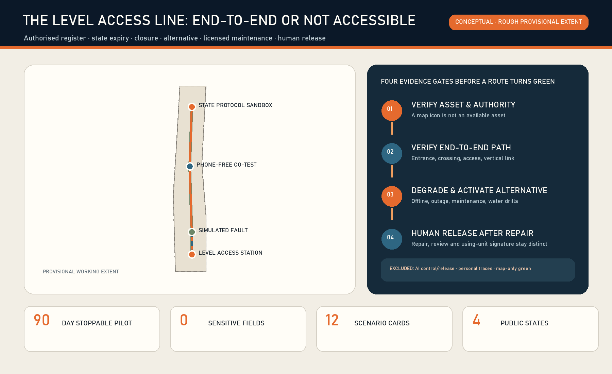
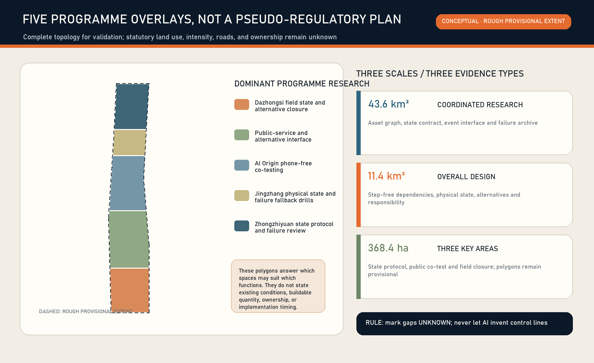
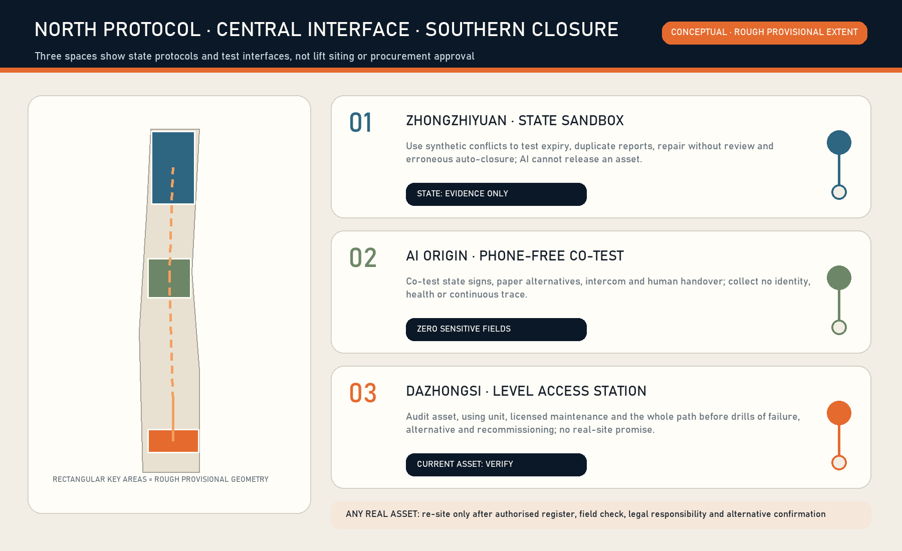
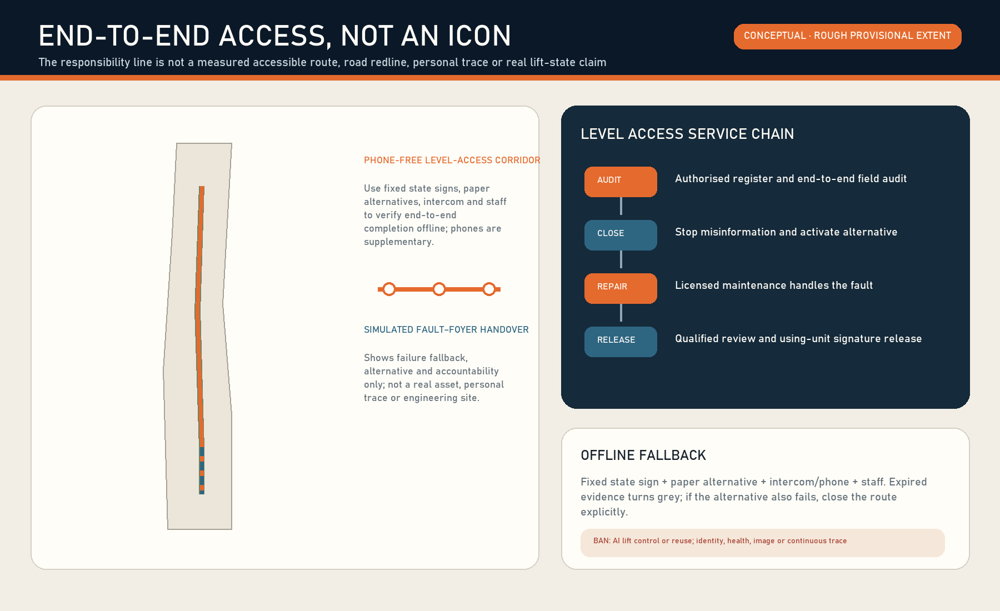
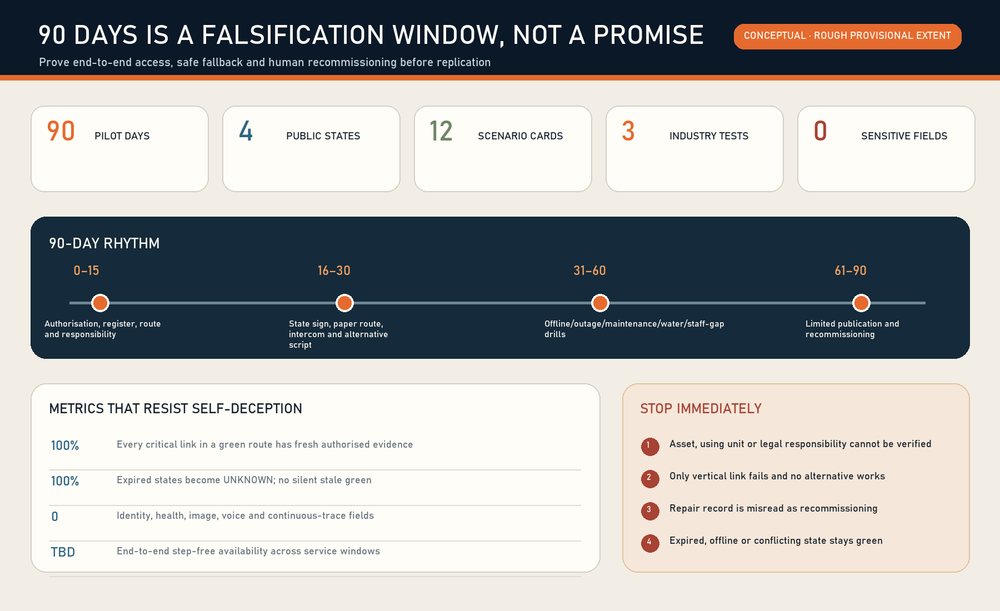

# THE LEVEL ACCESS LINE / 京张等高线

**A step-free journey is only as reliable as its least reliable vertical-mobility link.** A lift icon does not prove that a journey works now. The Level Access Line treats lifts, platform lifts and their alternatives as public services with state, accountability and expiry. It does not control equipment, declare safety, or replace licensed maintenance, inspection/testing, or the using unit's authority to release an asset. Every point, count, service hour and current performance remains `unknown`; all spatial work is conceptual on rough provisional geometry [assumption:A-CURRENT-SITE-001] [assumption:A-LEGAL-AUTHORITY-001].

Location verification note: reproducible community checks in repository Issue #1029 report that upstream provisional `PROV-KEY-003` is internally area/order-consistent but centred near Beijing North Station, about 2.26 km from Dazhongsi metro. This is not an official replacement boundary or permission to shift it. The package retains upstream geometry only as a placeholder; the Dazhongsi programme name comes from the brief, while any real lift, platform lift, step-free route or alternative service requires separate field and responsible-party verification. A canonical or official update triggers whole-package recalculation of layers, metrics, figures, PDFs and HTML.[source:ISSUE-1029] [assumption:A-BOUNDARY-001]

## Design Basis and Source List

The first-principles question is not whether a lift exists. It is whether a wheelchair or mobility-aid user, older person, temporarily injured person, caregiver with a stroller, or visitor with luggage can complete an entire step-free journey at a specific time. A single unavailable lift, closed entrance, stale state or unusable alternative invalidates the route.

Article 26 of the Barrier-Free Environment Construction Law assigns owners or managers responsibility for maintenance and management so facilities function normally and safely. The Special Equipment Safety Law separates using-unit records, checks, stop decisions and conditions for continued use after faults from licensed lift maintenance [source:PRC-BARRIER-FREE-LAW] [source:PRC-SPECIAL-EQUIPMENT-LAW].

Current Beijing rules further distinguish use management, maintenance, self-testing and inspection [source:BEIJING-ELEVATOR-RULES] [source:BEIJING-ELEVATOR-INSPECTION-2024]. Public reports and AI may therefore trigger verification, but cannot declare safety or recovery.

The official taskbook and local package provide the coordinated area, three key areas, conceptual road/building/public-space references and formal v2 delivery rules [source:SITE-PACKAGE] [source:AGENT-TASKBOOK] [source:FORMAL-SUBMISSION-GUIDE]. Official redlines, parcels, surveyed buildings, real lift/platform-lift assets, access controls, service hours, maintenance contracts, inspection states, fire conditions and measured step-free routes are unavailable and remain prerequisites [assumption:A-CONTROLS-001].

The method library contributes mechanisms only. Brick structures a space–equipment–service-path–responsibility graph, while ODK Collect supports offline field inspection [source:BRICKSCHEMA-GITHUB] [source:ODK-COLLECT-GITHUB]. Open311 and FixMyStreet provide fault classification, routing and status-update patterns [source:OPEN311-GITHUB] [source:FIXMYSTREET-GITHUB]. Open repositories are not local law, statutory registers or partner commitments.

## Three-Level Scope Framework

| Level | Question | Output | Not claimed |
|---|---|---|---|
| Coordinated research area | How can reliability become public value and industrial capability? | Open state contract, offline audit form, fault drills, auditable metrics | A complete corridor asset stock or single operator |
| Overall design area | How do public spaces, ground floors, station interfaces and walking chains degrade safely? | Physical state signs, human help, paper alternatives, state-event interface | Statutory land use, road redlines or engineering alignment |
| Three key areas | How can protocol, public interface and field closure be tested differently? | Zhongzhiyuan protocol test; AI Origin co-testing; Dazhongsi 90-day pilot | Real points, authorisation or current compliance |

The service state machine is `UNKNOWN → AUDITED → READY → DEGRADED/CLOSED → REPAIR → RECOMMISSION_REVIEW → READY`. The public sees only `UNKNOWN / READY / DEGRADED / CLOSED`; internal transitions retain append-only events and human signatures. Once the responsible party's confirmation expires, state automatically returns to `UNKNOWN` [data:visual/assets/service-state-contract.json].

High availability is not platform uptime. If digital services fail, fixed signs, telephone/intercom, paper alternatives and staff remain. If the only vertical link fails, a verified alternative is activated. If no equivalent exists, the step-free route is explicitly closed rather than optimistically routed.

## Coordinated Research Area: Industry and Future City Research

The proposal joins lift industry practice, urban operations, accessibility co-testing and AI engineering through a testable interface, not a new mega-platform. Four reusable capabilities matter: building-asset semantics and dependency graphs; offline inspection; interoperable fault/repair events; public state freshness and audit. Procurement favours exportable records, open interfaces, offline operation and replaceable vendors.

Open outputs are minimal schemas for `level_access_asset`, `status_event`, `alternative_service` and `recommission_record`. Equipment commands, security details, personal information and private phone numbers are excluded. The public layer exposes only authorised asset IDs, service windows, state, confirmation time, alternative instructions and aggregated recovery metrics. AI detects conflicts, clusters recurring faults, summarises work orders and prioritises risks. Qualified humans control, stop, repair, inspect/test and release assets [assumption:A-AI-BOUNDARY-001].

Case studies are mechanisms, not forms to copy. one-north mixes research, firms and daily services; Seoul AI Hub links skills and enterprise support; Mila connects research and industry [source:CASE-ONE-NORTH] [source:CASE-SEOUL-AI-HUB] [source:CASE-MILA]. ELLIS coordinates distributed nodes, while Smart Kalasatama uses reversible urban trials; together they support real tasks, bounded pilots, reproducible evidence and exit conditions [source:CASE-ELLIS] [source:CASE-SMART-KALASATAMA].

## Overall Design Area: Urban Renewal and Regulatory-Plan-Level Urban Design

The overall strategy builds a step-free service dependency graph rather than distributing devices. Candidate routes are decomposed into entrances, horizontal paths, crossings, access controls, vertical mobility, human services and destinations. If any critical segment lacks a fresh authorised state, the route cannot be `READY`. The conceptual learning line expresses responsibility and drill relationships, not a real road or human trace [data:geometry/roads.geojson#ROAD-001].

Spatial renewal follows “restore availability before adding assets.” First verify hours, thresholds, closure notices, help interfaces, alternatives and responsibility signs. Only demonstrated demand, faults, dependencies, ownership, fire safety, structure and lifecycle maintenance justify professional feasibility work for new lifts or platform lifts. This concept produces no demolition/retention conclusion, equipment specification, quantities, cost or schedule [assumption:A-PROFESSIONAL-DESIGN-001].

Five conceptual research bands cover the provisional extent for topology checks only: Dazhongsi field closure; public-service interface; AI Origin co-testing; physical fallback drills; Zhongzhiyuan protocol/failure review [data:geometry/land_use.geojson]. Building prototypes show the scale of reversible signs, co-testing tables and audit benches, not proposed floor area [data:geometry/buildings.geojson].

## Detailed Design of Key Areas

### Zhongzhiyuan: State Protocol and Failure Sandbox

A reversible relationship graph, synthetic event replay and vendor-interoperability bench tests state expiry, duplicate reports, repair without recommissioning, offline conflicts and erroneous automatic closure. Inputs are authorised anonymous samples or synthetic data. Outputs are open schemas, test cases and failure reports, not deployment claims [data:geometry/public_space.geojson#PUBLIC-001].

### Beijing AI Origin Community: Phone-Free Co-Testing Classroom

Disabled-user representatives, older people, caregivers, operators and engineering/design students co-test fixed signs, paper alternatives, help buttons and plain bilingual information. Participation is voluntary and withdrawable. No identity, health, face, voice or continuous trajectory is collected; individual difficulty becomes an anonymous task-failure category [data:geometry/public_space.geojson#PUBLIC-002] [assumption:A-DATA-001].

### Dazhongsi: Level Access Service Station (preferred 90-day type)

One authorised public-building or station interface is an evidence gate; no particular lift is assumed. The first 15 days verify the asset, hours, using unit, licensed maintenance, inspection/testing boundary, emergency alarm, route dependency and alternatives. If any statutory responsibility or safety boundary cannot close, stop. Only then add a fixed sign, paper alternative, escalation card and closure barrier. Synthetic drills never disable a real in-service lift [data:geometry/public_space.geojson#PUBLIC-003] [assumption:A-PILOT-001].

## AI Innovation Ecosystem, Personas, and AI+ Scenarios

Seven co-designers are wheelchair/mobility-aid users, older people, temporarily injured people, caregivers with strollers, visitors with luggage, site/station duty staff, and licensed maintenance plus inspection/accessibility professionals. The service verifies assets, responsibility and alternatives; it does not score people [data:visual/assets/raci.json].

| Scenario | User and task | AI support | Human/deterministic authority | Failure/exit |
|---|---|---|---|---|
| S01 First audit | Using unit checks asset and dependencies | Detect missing/conflicting fields | Authorised register and field staff | No authorisation means UNKNOWN |
| S02 Daily confirmation | Duty staff check entrance, alarm and operation | Flag missed/expired checks | Using-unit safety staff | No signature, no READY |
| S03 Public fault report | User sees closure or barrier | Deduplicate, classify, route | Field verification sets state | Report without identity |
| S04 Planned maintenance | Operator announces impact | List affected routes | Using unit and licensed maintainer | No alternative means CLOSED |
| S05 Sudden fault | Staff stop misinformation | Summarise conflicts | Using unit decides stop | Fixed sign if digital fails |
| S06 Alternative service | User still completes task | Suggest verified option | Human confirmation, fixed route/compliant shuttle | Explicit closure if no equivalent |
| S07 Licensed repair | Maintainer handles equipment | Summarise recurring history | Licensed maintainer and procedure | AI sends no control command |
| S08 Recommission | Using unit confirms continued service | Check document completeness | Qualified inspection/testing and using unit | No automatic close without signature |
| S09 Offline operation | Public judges state without network | None | Sign, intercom, paper, staff | Expired sign becomes UNKNOWN |
| S10 Night/weekend | Off-hours visitor arrives | Check hour conflicts | Real duty/access rules | Closed point is not routable |
| S11 Fire/earthquake | Everyone follows command | Show pre-reviewed note only | Fire, emergency and incident command | AI never decides lift evacuation/reuse |
| S12 Monthly audit | Public and management review | Cluster recurrence/overdue work | Independent audit/user co-test | Metrics do not certify safety |

Industry validation covers cross-vendor asset-state interoperability, offline inspection/synchronisation, and traceable privacy-minimal event logs. Tests use synthetic events and conceptual nodes, do not connect to real control systems, and do not certify equipment safety [assumption:A-SYNTHETIC-TEST-001].

## Land Use, Building Scale, and Retain-Renovate-Demolish Strategy

Official land use, surveyed buildings, structure, fire safety, shafts, ownership and statutory indicators are unavailable. FAR, total floor area, demolition and the number of new vertical assets are `unknown` [data:metrics.json#floor_area_ratio]. Three conceptual reversible modules are recalculated in EPSG:4548 only for package consistency, not as proposed construction [data:geometry/buildings.geojson] [assumption:A-BOUNDARY-001].

Professional work classifies each asset as retain, restore, substitute or add. Retain assets that can be maintained and keep routes continuous; first repair state information, entrances and help systems; provide verified alternatives during closure; study additions only where no reasonable alternative and stable demand are proven. Additions require joint structure, MEP, fire, accessibility, special-equipment, ownership, investment and lifecycle-maintenance feasibility.

## Transport, Rail, Municipal Infrastructure, and Public Services

The service dependency graph links station areas, public buildings, bridges/underground spaces and walking networks. Hours, access, staff assistance, accessible shuttles and lift state come from authorised parties; open maps only reveal candidate relations. `ROAD-002` is an operational link between a simulated fault and a service foyer, not an engineering alignment [data:geometry/roads.geojson#ROAD-002].

Availability boundaries include power, communications, alarms, drainage and fire interfaces. During outage or water ingress, equipment and site safety procedures prevail; the digital service never commands bypass or reuse. The public layer hides control networks, machine rooms, security weaknesses and private contacts. A fixed sign shows state, confirmation time, service hours, alternative and public service contact, with tactile/high-contrast/plain-language and human channels [depth:traffic_rail_slow_parking] [depth:municipal_new_infrastructure].

## Blue-Green Network, Public Space, and Urban Character

The conceptual level-access learning corridor carries fixed wayfinding, slope/step information, seating, weather/water checks, state explanations and co-testing. It does not claim new statutory green space [data:geometry/green_space.geojson#GREEN-001]. Its restrained railway-industrial palette reserves green for current human evidence, amber for degraded, red for closed and grey for unknown; blue-light screens never substitute for passage.

Reversible public nodes preserve clear width, turning space, seating, shelter and staff sightlines. Status information never blocks fire egress or statutory signs. QR codes are supplementary, not the basic-service gate. Character, paving, lighting and sign dimensions require survey and professional review [depth:blue_green_public_space_style].

## Renewal Projects, Implementation Policy, and Phasing

| Phase | Work package | Delivery gate | Stop condition |
|---|---|---|---|
| Days 0–15 | Authorisation, register, dependencies, responsibility, legal boundary | Asset/site consent, RACI, data and professional review plan | No using unit, licensed maintainer, verifiable route or emergency boundary |
| Days 16–30 | Sign, paper route, offline form, barrier and alternative script | Responsible role and version for each item | App, sensor or new equipment made prerequisite |
| Days 31–60 | Tabletop and field synthetic drills | Offline, outage, maintenance, fault, water and staffing gaps covered | Disabling real equipment, personal tracking or unauthorised operation |
| Days 61–90 | Limited publication, sampling, recommissioning and public review | Every recovery has qualified human signature; expired states become unknown | Misleading state, failed alternative, unresolved recurrence or broken accountability |

RACI: the using unit is accountable for safe use and stop/reuse; site/station staff perform daily checks and alternatives; a licensed maintainer performs legal maintenance and fault response; inspection/testing organisations provide technical verification under applicable rules; disabled-user representatives co-test routes; the data service maintains only the minimal state interface. These are proposed roles, not commitments [data:visual/assets/raci.json].

Design SLOs are to start human confirmation within 5 minutes of a conflict, activate alternative information within 10 minutes, downgrade expired states to `UNKNOWN`, and retain qualified human signatures for 100% of recovery events. They are proposed service targets, not current results, statutory deadlines or repair promises. Evidence-gated budgeting pays for audit and low-cost information repair first; no vendor becomes the sole gate to basic service.

## Metrics, Area Recalculation, and Compliance Matrix

Outcome metrics outrank activity counts: authorised-asset coverage, state freshness, correction time, alternative activation, phone-free completion, signed recommissioning, recurrence, continuous step-free availability across service windows, and post-closure public recheck. Baselines begin only after the evidence gate; current percentages remain unknown [data:metrics.json].

Concept geometry is recalculated in EPSG:4548 solely to prove consistency across nine GeoJSON layers and figures. Site, public-node, prototype-building areas and learning-line lengths are low-confidence design quantities, not survey, plan or engineering indicators. Official geometry requires topology and metric recalculation [assumption:A-BOUNDARY-001].

The compliance matrix covers 17 announcement and 6 Agent requirements; the depth matrix points to narrative, figures, geodata, metrics, sources and assumptions. `addressed/complete` means the package contains a substantive response, not that a site is legally compliant [depth:metrics_recalculation].

## Risk, Copyright, and Compliance

The highest risk is a false green state directing a user into a route with no alternative. Other risks are AI recommissioning, treating a public report as safety proof, absent accountability, merging repair and inspection, no offline fallback, prioritising by identity/health/trajectory, and unauthorised lift instructions during emergencies. Every risk has human stop authority, downgrade and audit evidence [data:visual/assets/risk-register.json].

No personal data, non-public planning, equipment commands, security details or unauthorised asset data is uploaded. The generated cover is a text-free conceptual section with no real place, identifiable person, official logo or protected third-party drawing. Figures are generated from submission data. External sources are attributed with licence, purpose, time and limitations in `sources.json`.

This proposal is not legal advice, safety certification, an inspection report, fire/evacuation plan, procurement specification or construction drawing. A real pilot requires review by the using unit, licensed maintenance, qualified inspection/testing, fire/emergency, accessibility, structure/MEP, data-protection and public-participation professionals.

## References

Sources have three layers. The official taskbook, site package and formal v2 guide define the scope, three key areas, package structure and evidence contract; they do not supply real lift assets, ownership or current state [source:SITE-PACKAGE] [source:AGENT-TASKBOOK] [source:FORMAL-SUBMISSION-GUIDE]. The Barrier-Free Environment Construction Law, Special Equipment Safety Law and Beijing lift use/inspection documents define responsibility across owners/managers, using units, licensed maintenance, inspection/testing and emergency command; they do not prove site compliance. Brick, ODK Collect, Open311 and FixMyStreet contribute only asset relationships, offline audit and work-order routing, not foreign organisational structures or physical safety proof [source:BRICKSCHEMA-GITHUB] [source:ODK-COLLECT-GITHUB] [source:OPEN311-GITHUB].

Nine GeoJSON layers express typologies, key-area transfer and pilot workload only on rough provisional geometry. EPSG:4548 areas, ratios and lengths prove package consistency and require complete recalculation when official geometry, survey and asset registers arrive [data:geometry/site_boundary.geojson#PROV-SITE-001] [data:metrics.json] [assumption:A-BOUNDARY-001]. Publisher, URL, date, use, licence and limits are in `sources.json`; gaps, professional prerequisites and stop conditions are in `assumptions.json`. Current asset count and end-to-end availability remain `unknown` rather than inferred from policy or map icons.
