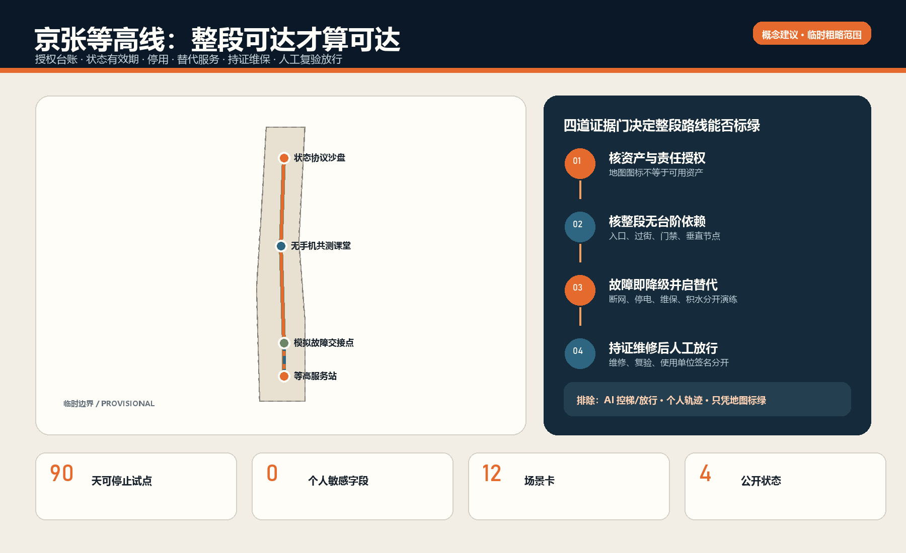
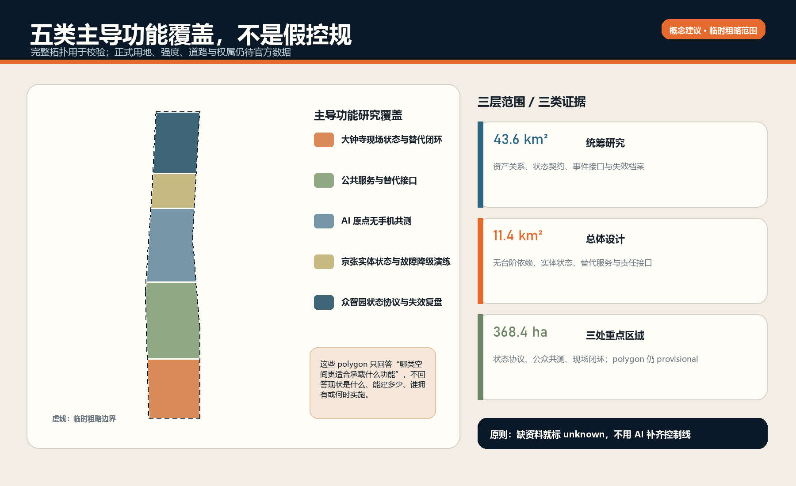
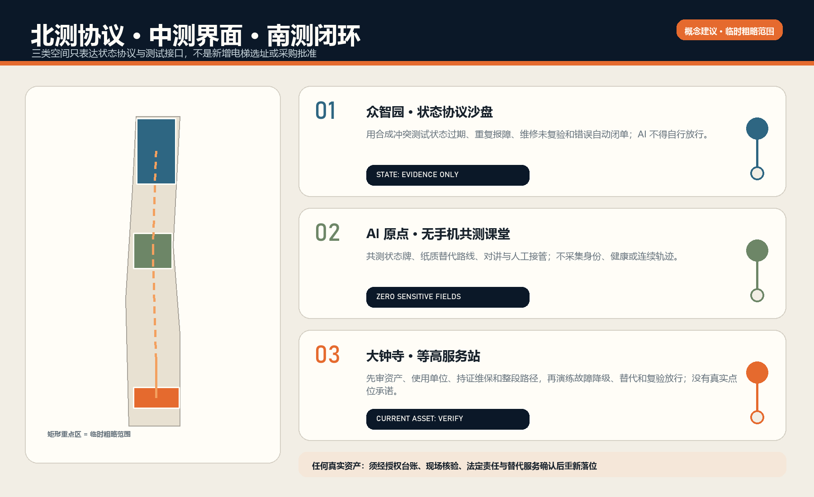
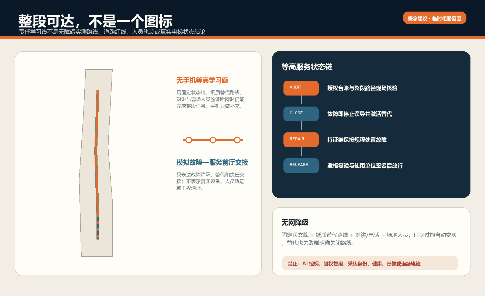
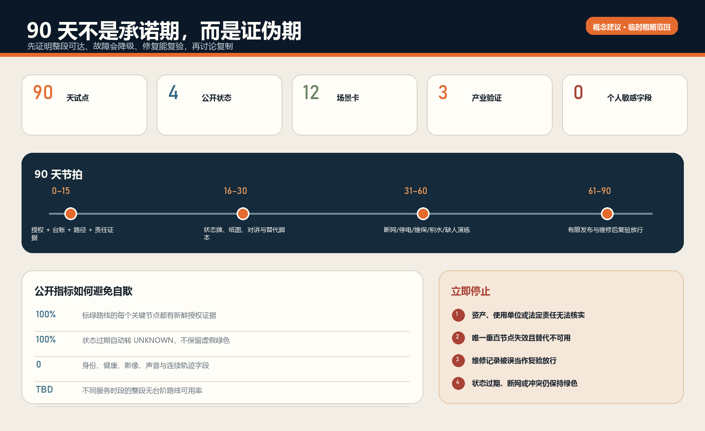

# 京张等高线 / THE LEVEL ACCESS LINE

**一条无障碍路线，只和其中最不可靠的垂直通行节点一样可靠。** 地图上有电梯不等于此刻能通行；“京张等高线”把电梯、升降平台及其替代服务视为一项有状态、有责任、有有效期的公共服务。它不控制设备、不作安全判定，也不替代持证维保、检验检测或使用单位的放行责任。所有点位、数量、开放时段和现状性能均为 `unknown`；图中空间仅是临时粗略工作边界上的概念建议 [assumption:A-CURRENT-SITE-001] [assumption:A-LEGAL-AUTHORITY-001]。

区位核验补充：仓库 Issue #1029 的公开复算记录指出，上游 `PROV-KEY-003` 临时 polygon 的面积与南北顺序自洽，但质心约位于北京北站一带，距大钟寺站约 2.26 km。该记录不是官方边界，也不是自行平移的授权。本案保留上游几何只作占位；“大钟寺”任务叙事来自公告名称，任何真实电梯、升降平台、无台阶路线和替代服务必须另行现场与责任主体核验。官方或 canonical 几何更新后，整体重算图层、指标、图件、PDF 与 HTML。[source:ISSUE-1029] [assumption:A-BOUNDARY-001]

## 设计依据与资料清单

第一性问题不是“有没有电梯”，而是轮椅使用者、老人、暂时受伤者、推婴儿车的照护者和携带行李者，能否在一个具体时段完成整段无台阶行程。只要唯一电梯停运、入口关闭、状态过期或替代路线不可用，整条路线就失败。

《中华人民共和国无障碍环境建设法》第二十六条要求无障碍设施所有权人或管理人履行维护和管理责任，保障功能正常和使用安全；《中华人民共和国特种设备安全法》把使用单位的记录、检查、停用和故障后继续使用条件，与获许可的电梯维护保养职责分开 [source:PRC-BARRIER-FREE-LAW] [source:PRC-SPECIAL-EQUIPMENT-LAW]。

北京市现行规则继续区分使用管理、维护保养、自行检测与检验 [source:BEIJING-ELEVATOR-RULES] [source:BEIJING-ELEVATOR-INSPECTION-2024]。这些依据支持一条清晰边界：公众报告和 AI 可以触发核验，但不能宣布设备安全或恢复。

官方任务书和本地资料提供总体研究范围、三个重点区、概念性道路/建筑/公共空间工作底图与 formal v2 交付规则 [source:SITE-PACKAGE] [source:AGENT-TASKBOOK] [source:FORMAL-SUBMISSION-GUIDE]。官方红线、地块权属、现状建筑、真实电梯/升降平台资产、门禁、运行时段、维保合同、检验状态、消防条件和无障碍实测尚未提供，因此均列为前置资料，不从公开地图反推 [assumption:A-CONTROLS-001]。

方法库只迁移机制：Brick 用于“空间—设备—服务路径—责任”关系图，ODK Collect 用于弱网离线巡检 [source:BRICKSCHEMA-GITHUB] [source:ODK-COLLECT-GITHUB]。Open311 与 FixMyStreet 用于故障分类、责任路由和状态更新 [source:OPEN311-GITHUB] [source:FIXMYSTREET-GITHUB]。开源项目不是本地法规、法定台账或合作承诺。

## 三层范围工作框架

| 层级 | 要回答的问题 | 本案输出 | 不能声称的内容 |
|---|---|---|---|
| 统筹研究范围 | 如何把可靠性方法输出为公共价值与产业能力？ | 开放状态契约、离线巡检表、故障演练、可审计指标 | 全线已有资产或统一运营主体 |
| 总体设计范围 | 如何让公共空间、首层、站区和慢行链在节点失效时降级？ | 物理状态牌、人工求助、纸质替代路线、状态事件接口 | 法定用地、道路红线或工程线位 |
| 三个重点区 | 如何分别验证协议、公众界面和现场闭环？ | 众智园协议测试、AI 原点共测课堂、大钟寺 90 天试点 | 真实点位、已获授权或现状达标率 |

核心服务状态机为：`UNKNOWN → AUDITED → READY → DEGRADED/CLOSED → REPAIR → RECOMMISSION_REVIEW → READY`。公开只显示 `UNKNOWN / READY / DEGRADED / CLOSED`；内部状态必须保存追加式事件与人工签名。状态超过责任主体确认的时效即自动退回 `UNKNOWN`，而不是继续显示绿色 [data:visual/assets/service-state-contract.json]。

高可用不是“平台在线率”，而是三层降级：数字层中断时仍有固定状态牌、服务电话/对讲和纸质路线；唯一垂直节点停运时激活经核验替代服务；连替代也不可用时明确关闭相关无台阶路线，不用乐观算法制造可达假象。

## 统筹研究范围产业与未来城市研究

本案把电梯企业、城市运营、无障碍共测与 AI 工程放在一个可检验接口上，而非新建“大平台”。产业价值来自四类可复用能力：建筑资产语义与依赖图、弱网巡检、故障/维修事件互操作、面向公众的状态新鲜度与审计。试点采购优先采购“可导出记录、开放接口、离线可用、能被替换”的服务，不锁定单一厂商。

开放成果包括 `level_access_asset`、`status_event`、`alternative_service`、`recommission_record` 四类最小 schema；不开放设备控制口令、安防细节、个人信息或内部手机号。公开层只发布经授权的资产编码、服务时段、可用状态、最近确认时间、替代说明和聚合恢复指标。AI 只做状态冲突识别、重复故障聚类、工单摘要和风险排序；控制、停用、修理、检验和放行由适格主体完成 [assumption:A-AI-BOUNDARY-001]。

案例研究采用机制对照而非形态复制：one-north 的研究—企业—日常服务混合、Seoul AI Hub 的人才与企业服务、Mila 的研究/产业伙伴关系，说明创新生态应把企业支持接到真实任务 [source:CASE-ONE-NORTH] [source:CASE-SEOUL-AI-HUB] [source:CASE-MILA]。

ELLIS 的多节点协作与 Smart Kalasatama 的可逆城市试验进一步支持“有限试点、可复现证据和退出条件”，而不是复制国外机构或空间形态 [source:CASE-ELLIS] [source:CASE-SMART-KALASATAMA]。

## 总体设计范围城市更新与控规深度城市设计

总体策略不是沿线铺设备，而是建立“无台阶服务依赖图”。每条候选路线拆成入口、水平路径、过街、门禁、垂直通行、人工服务和目的地七类段；任一关键段没有经授权的新鲜状态，整条路线不得标为 `READY`。概念图层用三重点区间的学习线表达责任与演练联系，不表示真实道路或人员轨迹 [data:geometry/roads.geojson#ROAD-001]。

空间改造遵循“先修复可用性，再决定增建”：先核验开放时段、门槛、停用告知、求助设施、替代路线和责任牌；只有在真实需求、资产故障、路径依赖、产权、消防、结构和全生命周期维保得到证明后，才进入新增电梯/升降平台的专业可研。未经调查不输出拆改留结论、设备规格、工程量、投资或工期 [assumption:A-PROFESSIONAL-DESIGN-001]。

五类概念性主导研究带覆盖临时工作边界以验证拓扑，不是控规用地：大钟寺现场闭环、公共服务接口、AI 原点共测、京张实体降级演练、众智园协议与失效复盘 [data:geometry/land_use.geojson]。建筑原型只表达可逆状态牌、桌面共测和审计工作台的尺度，不代表新建量 [data:geometry/buildings.geojson]。

## 重点区域详细设计

### 众智园：状态协议与故障沙盘

设置可逆的资产关系图、合成事件回放和供应商互操作测试台。输入全部为授权匿名资产样例或合成数据；测试状态过期、重复报障、维修未复验、断网冲突和错误自动闭单。退出成果是公开 schema、测试用例和失败报告，不是园区已部署证明 [data:geometry/public_space.geojson#PUBLIC-001]。

### AI 原点社区：无手机共测课堂

由残障使用者代表、老人、照护者、运营人员和设计/工程学生共测固定状态牌、纸质替代路线、求助按钮与简明双语信息。任何参与自愿、可退出，不采集身份、健康、面部、声音或连续轨迹；个体困难只转为匿名任务失败类型 [data:geometry/public_space.geojson#PUBLIC-002] [assumption:A-DATA-001]。

### 大钟寺：等高服务站（90 天首选类型）

以一个经授权的公共建筑或站区接口为证据门，不预设具体电梯。前 15 天只核验资产、开放时段、使用单位、持证维保、检验/检测资料边界、紧急报警、无台阶路径依赖和替代服务。任一法定责任或安全边界不能闭合即停止。通过后才布置固定状态牌、纸质替代路线、升级联系人卡和停运围护；合成演练不得人为关闭真实在用电梯 [data:geometry/public_space.geojson#PUBLIC-003] [assumption:A-PILOT-001]。

## AI 创新生态、人才画像与 AI+ 场景

七类共同设计者是：轮椅/助行器使用者、老人、暂时受伤者、推婴儿车的照护者、携带行李的访客、场地/站区值班人员、持证维保与检验/无障碍专业人员。服务不是为“被画像的人”打分，而是让资产状态、责任和替代方案可验证 [data:visual/assets/raci.json]。

| 场景卡 | 使用者与任务 | AI 辅助 | 确定性/人工权威 | 失败与退出 |
|---|---|---|---|---|
| S01 首次资产审计 | 使用单位核对设备与路径依赖 | 检查缺字段和矛盾 | 授权台账与现场人员 | 无授权即保持 UNKNOWN |
| S02 每日状态确认 | 值班员核对入口、报警与运行 | 提醒漏检和过期 | 使用单位安全人员 | 无签名不发布 READY |
| S03 公众报障 | 使用者发现停运/围挡 | 去重、分类、路由 | 现场核验决定状态 | 不上传身份也可报告 |
| S04 计划维保 | 运营方提前告知影响 | 生成受影响路线清单 | 使用单位与持证维保 | 替代未激活则路线 CLOSED |
| S05 突发故障 | 现场岗位停止误导 | 汇总状态冲突 | 使用单位决定停用 | 数字失效用实体状态牌 |
| S06 替代服务 | 轮椅使用者继续完成任务 | 推荐已核验备选 | 人工确认、固定路线/合规接驳 | 没有等价替代就明确关闭 |
| S07 持证维修 | 维保人员处置设备 | 摘要历史重复故障 | 获许可维保和作业规程 | AI 不发控制命令 |
| S08 复验放行 | 使用单位确认可继续服务 | 校验资料是否齐全 | 适格检验/检测与使用单位 | 无人工签名不能自动闭单 |
| S09 断网运行 | 公众在无网络时判断 | 无 | 状态牌、对讲、纸图、人员 | 过期牌降为 UNKNOWN |
| S10 夜间/周末 | 非工作时段到访者 | 检查服务时段冲突 | 真实值班与门禁规则 | 关门点不作为可达节点 |
| S11 火灾/地震 | 所有人服从应急指挥 | 只展示预审说明 | 消防、应急与现场指挥 | AI 不决定电梯疏散或复用 |
| S12 月度审计 | 公众与管理方复盘 | 聚类重复故障与超时 | 独立审计/使用者共测 | 指标不能证明安全合格 |

三类产业验证为：跨厂商资产状态互操作、弱网巡检与后同步、事件日志的可追溯与隐私最小化。测试使用合成事件和概念节点，不接入真实控制系统，不开展设备安全认证 [assumption:A-SYNTHETIC-TEST-001]。

## 用地、建筑规模与拆改留方案

现阶段没有官方用地、现状建筑普查、结构、消防、设备井道、产权和法定指标，因此容积率、建筑总量、拆除量与新增垂直设施数量均为 `unknown` [data:metrics.json#floor_area_ratio]。概念建筑图层仅放置三个可逆工作模块，面积经 EPSG:4548 复算用于文件自洽，不是拟建量 [data:geometry/buildings.geojson] [assumption:A-BOUNDARY-001]。

专业阶段以资产为单元执行“保留—修复—替代—增设”判定：能经维护恢复且路径连续的保留；状态信息、入口或求助系统缺陷先修复；停运期间提供经核验的等价替代；只有无合理替代且需求稳定时研究增设。新增方案必须进入结构、机电、消防、无障碍、特种设备、权属、投资和持续维保的联合可研，不能由本概念方案直接落地。

## 交通、轨道、市政与公共服务设施

轨道站区、公共建筑、连桥/地下空间和慢行网络通过“服务依赖图”连接。公共交通运营时段、门禁、站员协助、无障碍接驳和电梯状态必须取自授权责任主体；开放地图仅用于发现候选关系，不能当现场真相。`ROAD-002` 只表达模拟故障点与人工服务前厅的运营联系，不是工程线位 [data:geometry/roads.geojson#ROAD-002]。

市政与设备高可用边界包括供电、通信、报警、排水与消防接口。断电或进水等场景首先执行设备和现场安全规程；数字平台不得命令旁路或复用。公众层不暴露控制网络、机房、安防薄弱点或人员私人联系方式。固定状态牌采用“状态—确认时间—服务时段—替代方式—公共服务电话”五项信息，并为视障、低视力、听障与认知差异提供触觉/高对比/简明语言和人工通道 [depth:traffic_rail_slow_parking] [depth:municipal_new_infrastructure]。

## 蓝绿空间、公共空间与城市风貌

概念“等高学习廊道”承载固定导向、坡度/台阶提示、休息点、雨雪与积水检查、设备状态说明和共测，不主张新增法定绿地 [data:geometry/green_space.geojson#GREEN-001]。廊道在视觉上保持铁路工业遗产的克制材料与高对比状态色：绿色只表示有时效的人工作证据，琥珀表示降级，红色表示关闭，灰色表示未知；绝不以“科技蓝光屏”替代实体通行。

公共空间节点采用可逆构件，保留清晰净宽、轮椅回转、坐凳、遮雨和人工服务视线。设备故障信息不得遮挡消防疏散或法定标志；二维码只能提供附加信息，不能成为基本服务入口。所有风貌、铺装、照明和标识尺寸都需在现场测绘与专业审查后深化 [depth:blue_green_public_space_style]。

## 更新项目清单、实施政策与分期计划

| 阶段 | 工作包 | 交付门 | 停止条件 |
|---|---|---|---|
| 0–15 天 | 授权、台账、路径依赖、责任与法规边界 | 资产/场地授权，RACI，数据保护与专业评审计划 | 无使用单位、无持证维保、无法核验路径或应急边界 |
| 16–30 天 | 状态牌、纸图、离线表单、围护与替代脚本 | 每项都有责任岗位和版本号 | 把 App、传感器或新增设备当先决条件 |
| 31–60 天 | 桌面与现场合成演练 | 覆盖断网、停电、计划维保、故障、积水、值班缺位 | 人为关闭真实设备、采集个人轨迹或越权操作 |
| 61–90 天 | 有限状态发布、抽检、复验放行与公开复盘 | 所有恢复事件有适格人工签名，过期状态自动未知 | 状态误导、替代不可用、复发未整改或责任链断裂 |

工程管理采用 RACI：使用单位对安全使用与停用/复用最终负责；场地/站区岗位负责日常核验和替代服务；持证维保单位负责依法维护保养和故障处置；检验/检测机构依规则承担技术核验；无障碍使用者代表参与路径共测；数据服务方只维护最小状态接口。以上均为建议角色，不表示任何机构已承诺 [data:visual/assets/raci.json]。

试点的设计 SLO 为：状态冲突发现后 5 分钟内开始人工确认、10 分钟内激活替代信息、到期状态自动降为 `UNKNOWN`、恢复事件 100% 有人工签名。它们是待共同确认的服务目标，不是现状成绩、法定时限或维修承诺。预算采用证据门：先审计与低成本信息修复，再决定是否采购传感、软件或设备；任何单一厂商不可成为基本服务的唯一入口。

## 指标体系、面积复算与合规矩阵

结果指标优先于活动数量：经授权资产覆盖率、公开状态新鲜率、错误状态纠正时间、替代服务激活时间、无手机任务完成率、维修后人工放行完整率、重复故障率、不同服务时段的连续无台阶路线可用率、公众投诉关闭后复核率。所有基线须在证据门后建立，当前不填虚假百分比 [data:metrics.json]。

概念几何的面积与长度在 EPSG:4548 内复算，只证明九层 GeoJSON 与图件自洽。场地面积、公共节点面积、原型建筑面积和学习线长度均为低置信设计量，不是测绘、控规或工程指标；官方边界发布后必须重新拓扑、重算并更新所有图表 [assumption:A-BOUNDARY-001]。

合规矩阵覆盖公告 17 项与 Agent 6 项任务，设计深度矩阵逐项指向正文、图件、空间数据、指标、来源和假设；`addressed/complete` 只表示投稿包有实质响应，不表示现场或法定合规 [depth:metrics_recalculation]。

## 风险、版权与合规说明

最高风险不是“系统宕机”，而是错误绿色状态诱导使用者进入无替代的断点。其次是 AI 越权放行、公众报障被当作安全结论、责任主体缺位、维修与复验混为一谈、断网时无物理降级、通过身份/健康/轨迹做服务优先级，以及在应急中发布未经授权的电梯使用指令。每项风险都有人工停止权、降级状态和审计记录 [data:visual/assets/risk-register.json]。

不上传个人隐私、非公开规划、设备控制参数、安防细节或未获授权资产数据。生成封面为无文字概念剖面，不含真实场所、人物身份、官方标志或第三方受保护图样；图件由本方案脚本从提交内数据生成。外部资料只作署名引用，许可、用途、时间与限制登记于 `sources.json`。

本提案不是法律意见、安全认证、检验报告、消防/疏散方案、设备采购书或工程施工图。真实试点必须通过使用单位、持证维保、适格检验/检测、消防/应急、无障碍、结构机电、数据保护和公众参与等专业审查。

## 参考资料

核心来源分为三层。第一层是官方任务书、site package 与 formal v2 指南，用于确定研究范围、三处重点区、提交结构和证据契约；它们不提供真实电梯资产、权属或现场状态 [source:SITE-PACKAGE] [source:AGENT-TASKBOOK] [source:FORMAL-SUBMISSION-GUIDE]。第二层是《中华人民共和国无障碍环境建设法》《中华人民共和国特种设备安全法》及北京电梯使用、检验检测文件，用于划清所有权人/管理人、使用单位、持证维保、检验检测和应急指挥的责任边界，但本案不据此判断某处设施是否合规。第三层是 Brick、ODK Collect、Open311 与 FixMyStreet 等公开方法库，只借用资产关系、弱网巡检和工单路由机制，不复制国外组织结构或把数字状态当作现场安全事实 [source:BRICKSCHEMA-GITHUB] [source:ODK-COLLECT-GITHUB] [source:OPEN311-GITHUB]。

九层 GeoJSON 只在临时粗略边界上表达类型学、重点区传导和试点工作量；EPSG:4548 面积、比例与长度只证明文件自洽，官方边界、现场测绘和资产台账到位后必须整体重算 [data:geometry/site_boundary.geojson#PROV-SITE-001] [data:metrics.json] [assumption:A-BOUNDARY-001]。完整发布者、URL、日期、用途、许可与限制登记于 `sources.json`；缺资料、专业深化前置条件和停止条件登记于 `assumptions.json`；当前资产数与整段无台阶可用率保持 `unknown`，不以城市级政策或地图点位补齐。
