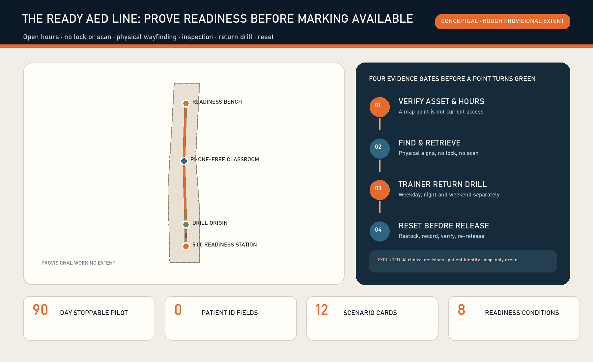
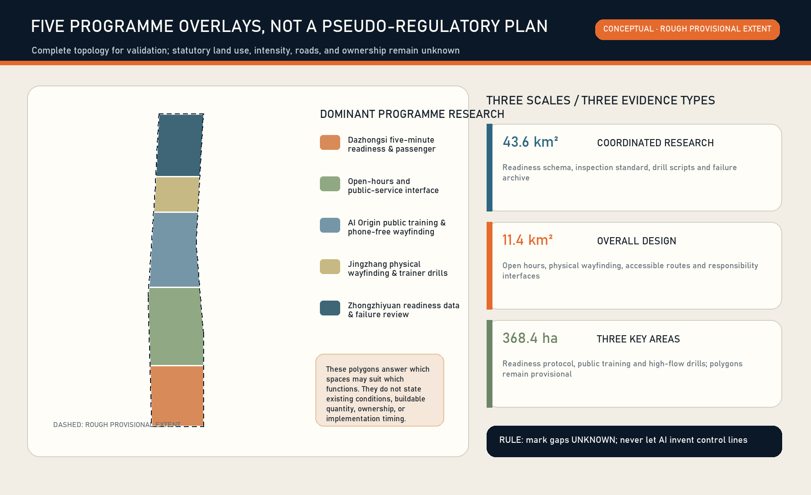
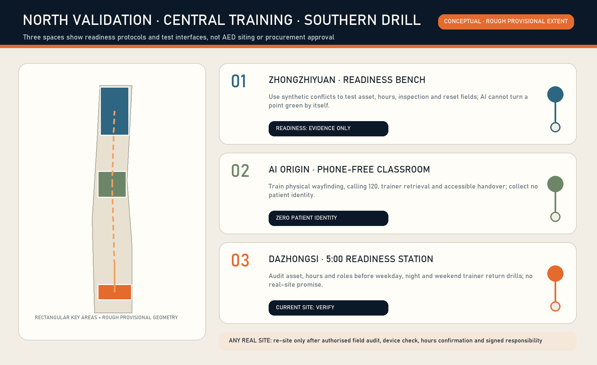
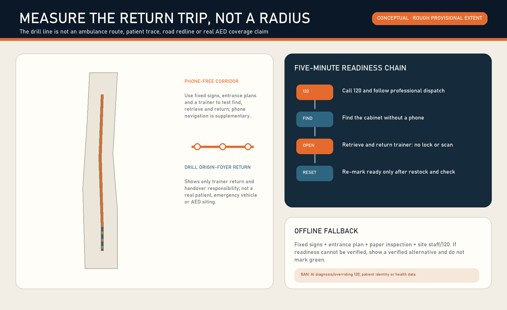
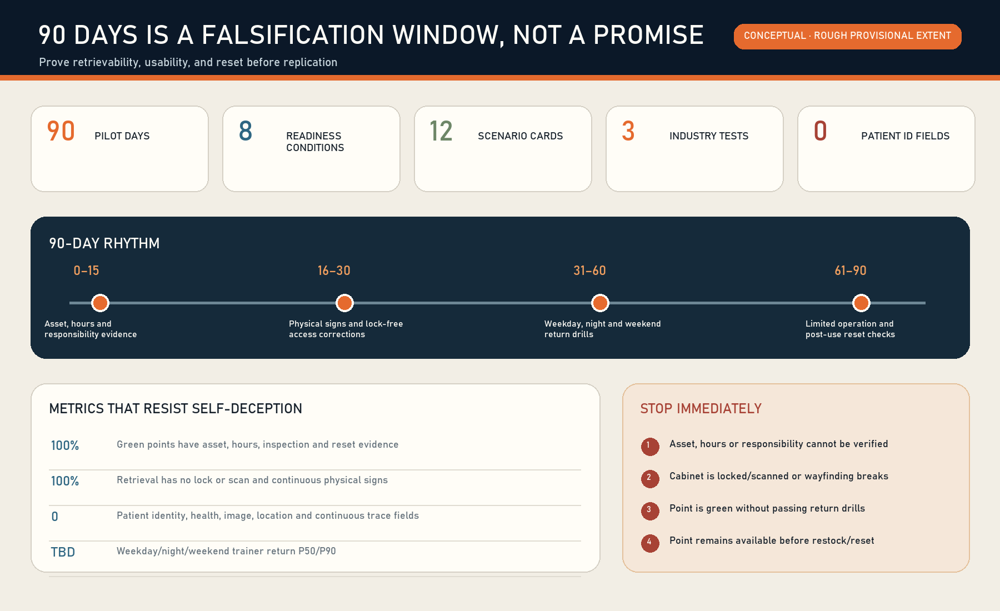

# THE READY AED LINE / 京张五分钟

**The question is not whether an AED is nearby, but whether a genuinely usable AED can be retrieved now.** Five minutes is a threshold measured with a training AED, actual access hours and a complete return route. It is not an unconditional promise, a survival-rate promise or a medical conclusion. Every spatial move is a concept based on rough provisional geometry; no current point, institutional partnership or field performance is claimed.

Location verification note: reproducible community checks in repository Issue #1029 report that upstream provisional `PROV-KEY-003` is internally area/order-consistent but centred near Beijing North Station, about 2.26 km from Dazhongsi metro. This is not an official replacement boundary or permission to shift it. The package retains upstream geometry only as a placeholder; the Dazhongsi programme name comes from the brief, while any real AED, service hour or retrieval route requires separate field and responsible-party verification. A canonical or official update triggers whole-package recalculation of layers, metrics, figures, PDFs and HTML.[source:ISSUE-1029] [assumption:A-BOUNDARY-001]

## Design Basis and Source List

The first-principles task is singular: after a suspected cardiac arrest is recognised and 120 has been called, can a bystander find, retrieve, return with, use under AED/120 guidance, and reset the device? A point that is closed, access-controlled, locked, scan-gated, poorly signed, expired or unowned is not ready. The national guide calls for visible, accessible, no-lock/no-scan cabinets and site inspection of devices, consumables, signs and management information; Beijing confirms public use and 120 guidance for an untrained caller [source:NHC-AED-GUIDE-2021] [source:BEIJING-WJW-AED-ACCESS-2021].

Beijing already operates a key-public-place AED map linked to the 120 dispatch system. A duplicate map is therefore rejected. Buying more devices before obtaining one key area's asset, opening-hour and route evidence is also rejected. The retained product is a time-bounded `ready_aed_point` proof [source:BEIJING-AED-120-MAP-2023] [depth:existing_conditions_diagnosis].

Beijing standard `DB11/T 2564-2026` was issued on 30 June 2026 but takes effect only on 1 October 2026. Its under-five-minute round-trip reference for high-flow public places, free public use, declared service hours, named responsibility and maintenance records are treated as published, future-effective implementation references—not current duties or site facts [source:BEIJING-AED-STANDARD-NOTICE-2026] [source:BEIJING-AED-FIVE-MINUTE-2026].

| Readiness condition | Required evidence | Honest state when missing |
| --- | --- | --- |
| 1 Asset and service hours | responsible-unit verification, timestamp, next review | unverified/closed |
| 2 Continuous physical wayfinding | entrance-turn-cabinet sign check | wayfinding failure |
| 3 No lock and no scan | actual cabinet-opening check | not retrievable |
| 4 Valid device and consumables | device, battery, pads, accessories and sign inspection | fault/expiring |
| 5 Accountable duty role | asset, site, inspection, escalation and reset roles | no accountable role |
| 6 Multi-period return drill | weekday, night and weekend training-AED records | failed/unknown |
| 7 Post-use reset | replenishment, restoration, review and release | closed after use |
| 8 Medical boundary | 120, AED voice and professional emergency system lead | AI stops output |

All eight must be current before a point is green [metric:readiness_condition_count]. AI is delegated no medical decision [metric:ai_medical_decision_count].

The official announcement, Agent taskbook, repository site package, registry and processed fact pack provide the project basis. Maintainer-supplied provisional geometry supports concept generation, topology checks and low-confidence recalculation only [source:OFFICIAL-ANNOUNCEMENT] [source:AGENT-TASKBOOK] [source:SITE-PACKAGE]. The overall extent and three key areas are not official redlines; official polygons would trigger full regeneration of layers, metrics, figures, HTML and PDFs [source:BOUNDARY-SOURCE] [source:KEY-AREA-SOURCE].

## Three-Level Scope Framework

The coordinated research area asks who can maintain a shared public-readiness capability; the overall design area asks how physical signs, drill routes and responsibility nodes remain continuous; the three key areas ask how protocol validation, public training and a high-flow pilot differ. One readiness contract is falsified in three spatial types rather than derived from a grand masterplan [depth:three_level_scope_framework] [depth:overall_spatial_structure].

The name is **THE READY AED LINE / 京张五分钟**. Its mark combines a railway timing board `5:00`, an open cabinet and a broken red line. Green means all eight records are current; amber means expiring or due for review; red means closed. It does not appropriate a red cross, company mark or official AED graphic as branding; any implementation must still use the nationally standardised AED direction signs.

| Scope | Core question | Spatial output | What cannot be claimed |
| --- | --- | --- | --- |
| 43.6 km² research area | How health/emergency actors, asset units, sites, trainers, universities and firms reuse one protocol | open schema, drill script, failure archive, responsibility template | institutional consent, full coverage |
| approx. 11.4 km² design area | How phone-free wayfinding and a return drill remain continuous | learning line, four study-node types, static components | road redline, ambulance route, precise radius |
| approx. 368.4 ha key areas | How three node types falsify the product | Zhongzhiyuan validation, Origin training, Dazhongsi pilot | a real AED, access, flow or five-minute result |

The submitted provisional-area calculation checks only package consistency [data:geometry/site_boundary.geojson#SITE-001] [metric:site_area_sqm]; the key-area count verifies required coverage, not official polygons [data:geometry/key_areas.geojson#PROV-KEY-001] [metric:key_area_count].

## Coordinated Research Area: Industry and Future City Research

The AI-industry contribution is not automated emergency medicine. It is a reliability chain linking research, standards, field verification, product maintenance and public accountability. Zhongzhiyuan tests a minimal event model and conflict detection; AI Origin translates professional rules into a phone-free public drill; Dazhongsi tests handover and reset in a high-flow type; the Zhongguancun wing supports standard, insurance, legal and evaluation interfaces; the Xiaoyuehe wing hosts public experience and review. Medical and device decisions stay with applicable professional systems [standard:PROJECT-AGENT-OPEN-CALL-TASKBOOK] [depth:overall_spatial_structure].

Five global ecosystems contribute mechanisms, not scale, governance or investment promises:

| Case | Transferable mechanism | Jingzhang translation | Not transferred |
| --- | --- | --- | --- |
| Singapore one-north | research, startups, trials and daily life co-located | put reliability tests and public experience on one corridor | land regime and investment metrics |
| Seoul AI Hub | training, company growth, shared facilities and community | connect AED training, enterprise validation and open review | programme counts and organisation |
| Montréal Mila | research-industry-talent-public-interest collaboration | AI handles readiness conflict and failure review only | partners and funding promises |
| ELLIS | distributed nodes share research protocols | one schema, three locally distinct test types | European network governance |
| Smart Kalasatama | reversible living lab, test before scale, transfer methods | 90-day training-AED pilot with kill gates | medical/site authorisation |

Primary pages support these limited readings [source:CASE-ONE-NORTH] [source:CASE-SEOUL-AI-HUB] [source:CASE-MILA]. Distributed and living-lab patterns are drawn from [source:CASE-ELLIS] [source:CASE-SMART-KALASATAMA]; none proves Beijing site conditions.

Public GitHub projects enter as a method library, not copied products. OpenAEDMap separates point, access and opening attributes; openrouteservice demonstrates network routing but cannot see doors or indoor signs; ODK contributes constrained offline field forms; FixMyStreet/Open311 contribute accountable fault routing and minimal state events. No code, image, data or foreign institutional model is copied [source:OPENAEDMAP-GITHUB] [source:OPENROUTESERVICE-GITHUB] [source:ODK-COLLECT-GITHUB]. Repair routing and event semantics refer to [source:FIXMYSTREET-GITHUB] [source:OPEN311-GITHUB].

## Overall Design Area: Urban Renewal and Regulatory-Plan-Level Urban Design

The concept is “one line, three stations, four gates, two ledgers”: a readiness-drill learning line links the key areas; three stations cover protocol, public training and high-flow validation; four gates are event-to-device, open, return and reset; the ledgers record device/consumable state and route/responsibility state. These are conceptual relationships, not alignments or confirmed sites [data:geometry/roads.geojson#ROAD-001] [data:geometry/public_space.geojson#PUBLIC-001].

Five land-use polygons are dominant-research partitions, not regulatory amendments; reversible modules test spatial scale, not proposed buildings [data:geometry/land_use.geojson#LU-001] [data:geometry/buildings.geojson#BLDG-001]. FAR, height, density, road redlines and existing-building actions await official data [standard:MOHURD-CONTROL-DETAILED-PLANNING] [depth:development_intensity_controls].

Renewal proceeds in this order: verify present facts; repair static directions and access rules; run training-AED drills; only then ask whether equipment or physical works are needed. Without an asset register, fault types and multi-period routes, no coverage circle is drawn. Without ownership, fire, accessibility and building surveys, no construction conclusion is made.

## Detailed Design of Key Areas

### Zhongzhiyuan: Readiness Protocol Test Bench

Synthetic points, training AEDs and fictional incident cards reproduce conflicting hours, expired inspection, invalid alternatives, offline operation, duplicate work orders and incomplete reset. AI flags inconsistency and drafts an aggregate review; it never infers green from missing evidence [data:geometry/key_areas.geojson#PROV-KEY-001] [data:geometry/buildings.geojson#BLDG-001].

### Beijing AI Origin Community: Phone-free Retrieval Classroom

Blind physical-wayfinding tests, AED voice familiarity, calling 120, two-person coordination and accessible retrieval turn a professional rule into a public action. No identity, voice, face or health information is collected. Phone navigation is supplementary, not the entrance [data:geometry/key_areas.geojson#PROV-KEY-002] [data:geometry/public_space.geojson#PUBLIC-002].

### Dazhongsi: Five-Minute Readiness Station (preferred 90-day type)

A Dazhongsi-type node can falsify high flow, transfer, service-hour and complex-entry assumptions. This package has no authoritative AED, access-control, flow or operator data and claims no five-minute result. With authorisation, one staffed, clear-hours public-place type is tested first. If asset accountability, inspection permission or 120/training coordination cannot close, the pilot stops [data:geometry/key_areas.geojson#PROV-KEY-003] [data:geometry/phasing.geojson#PHASE-001] [depth:three_key_area_detailed_design].

## AI Innovation Ecosystem, Personas, and AI+ Scenarios

Seven personas are not patient profiles: commuters/transferees, employees, students, visitors, night/maintenance workers, older/disabled visitors and frontline site staff. The MVP records no identity or health field [metric:persona_count] [metric:patient_identity_field_count].

| Card | Type and place | Measurable output | Human/stop boundary |
| --- | --- | --- | --- |
| T01 service-hour conflict | industry test, Zhongzhiyuan | conflicts and confirmation time | no human confirmation, no green |
| T02 inspection/expiry | industry test, Zhongzhiyuan | missed/early warnings, wrong escalation | AI never certifies equipment |
| T03 offline/alternative | industry test, Zhongzhiyuan | offline completion, wrong alternatives | paper and staff fallback |
| S04 phone-free finding | public training, Origin | find rate, turn errors, time | no continuous trajectory |
| S05 no-lock/no-scan opening | Origin/Dazhongsi | first-open success | key/scan with no staff stops test |
| S06 120 + training AED | synthetic drill | call, retrieve, AED voice sequence | no real patient or shock |
| S07 night service window | multi-period drill | actual vs declared opening | no staff means closed hours |
| S08 accessible retrieval | public realm | step, door, height and sign failures | professional review before repair |
| S09 event-time status | pre-event check | closure, detour, alternative | event command leads |
| S10 post-use reset | maintenance | replenish and rerelease time | no rerelease without review |
| S11 correction to owner | accountability | routing accuracy and closure time | work-order state is not readiness |
| S12 monthly failure archive | open learning | aggregate type and recurrence | no individual/patient data |

The twelve cards, three industry-test families and 90 days are auditable design counts [metric:scenario_card_count] [metric:industry_test_count] [metric:pilot_days]. AI is limited to finding stale/conflicting records, routing faults and summarising aggregate drills. Every output is human-overridable.

## Land Use, Building Scale, and Retain-Renovate-Demolish Strategy

Five partitions cover the provisional site only as dominant research content and use recognised land-use codes; they do not change statutory use [standard:MNR-LAND-USE-CLASSIFICATION-GUIDE] [depth:land_use_layout]. Three approximately 48m×22m reversible module prototypes test classroom, review-bench and service-foyer scale; their footprint is internally reproducible but is neither existing nor proposed building stock [metric:building_footprint_area_sqm].

The sequence is fixed: reuse staffed service counters; add static signs, paper maps and responsibility cards; pilot mobile training equipment; discuss alteration only after ownership, structural, fire, accessibility and emergency-professional review. Height, mass, material and lighting remain low-impact, reversible and qualitative [depth:retain_renovate_demolish] [depth:height_massing_character] [standard:MOHURD-ARCH-DESIGN-DEPTH-2016].

## Transport, Rail, Municipal Infrastructure, and Public Services

Distance means a complete walk from simulated incident to cabinet and back—not a straight radius. Actual doors, hours, floors, access control, crossings, works and accessible routes must be checked; the user must then see, open and carry the trainer back. The conceptual line length checks package relations only [metric:readiness_drill_line_length_m] [depth:traffic_rail_slow_parking].

Minimum service is network-independent: standard physical signs, entrance plans, cabinet instructions, staffed contact/120, paper inspection card and a verified alternative. Digital status never replaces 120 or sends medical control to an AED; remote data is a warning and a human field check authorises service [depth:municipal_new_infrastructure] [data:geometry/constraints.geojson#CONSTRAINTS].

## Blue-Green Network, Public Space, and Urban Character

The conceptual heritage-park learning corridor carries signs, rest points, training and the failure archive; it does not claim new green space or a real AED [data:geometry/green_space.geojson#GREEN-001]. Four study nodes prioritise visible entrances, uninterrupted passage, wheelchair approach and restrained night light. Ratios are concept-geometry checks only [metric:green_ratio] [metric:public_space_ratio] [depth:blue_green_public_space].

Three institutional landmarks are the Failure Review Bench, Phone-free Retrieval Classroom and 5:00 Readiness Board. The honour display credits professionally confirmed maintenance and training contributions while retaining closure records. The graphic language borrows railway timing clarity and handover discipline without turning emergency care into entertainment [standard:MOHURD-URBAN-DESIGN-MEASURES].

## Renewal Projects, Implementation Policy, and Phasing

The 90-day test precedes expansion:

| Phase | Work | Gate | Stop condition |
| --- | --- | --- | --- |
| days 0–15 evidence gate | authorised assets, RACI, hours, cabinet, device/consumables, 120/training interface, route | one lawful training point and all responsibilities accepted | no asset owner, inspection permission or training path |
| days 16–30 low-cost repair | static signs, entrance plan, responsibility card, paper alternative, opening rule | phone-free blind test succeeds | key/scan remains without staff |
| days 31–60 synthetic drills | weekday/night/weekend returns with training AED | reproducible key periods and routed failures | patient/identity/medical inference introduced |
| days 61–90 limited operation | daily inspection, weekly sampling, reset, aggregate report | responsible unit chooses continue/change/stop | unknown device/consumable or unmarked access conflict |

Six projects are proposed: asset/responsibility register, phone-free wayfinding kit, training drills, readiness event schema, fault/reset work orders, and a failure archive with quarterly review. They are concepts, not approved projects or procurement [depth:renewal_project_list] [depth:phasing_implementation].

Suggested RACI: the installation/asset unit is accountable for device maintenance; the site operator for opening, access, signs and staff; a named inspection role performs checks; 120/emergency and training professionals are consulted; an AI supplier owns only its data tool; any responsible frontline role may mark red, while only a complete review may rerelease. This does not imply consent.

Quarterly 5:00 blind-test days, an annual failure archive, developer schema reproduction and maintenance learning can build a long-term community. Every event requires site/emergency/safety review, uses no real patient, consumes no real emergency resource and never rewards speed over correct procedure.

## Metrics, Area Recalculation, and Compliance Matrix

The primary metrics are not device count: multi-period training-return distribution, phone-free completion, opening-state agreement, inspection completeness, time to red, repair time, reset time, recurrence and wrong alternatives. Verified current points and five-minute ready coverage remain unknown [depth:metrics_recalculation].

Known package metrics describe reproducible geometry or design counts only: three key areas, four concept nodes, twelve cards, three industry tests, seven personas, 90 days and eight readiness conditions [metric:concept_node_count]. Field performance requires a new authorised, dated and accountable dataset; it cannot be inferred from a line or a map point.

The compliance matrix covers announcement 1.3, 1.4, 1.5 and agent.1–agent.6. Standard and depth matrices connect narrative, figures, GeoJSON, metrics, sources, assumptions and checks [source:PROCESSED-FACT-PACK] [standard:PROJECT-OFFICIAL-ANNOUNCEMENT].

## Risk, Copyright, and Compliance

Four boundaries are absolute: AI makes no medical decision; no patient/bystander/trainee identity or health data is collected; unverified points are never green; a not-yet-effective standard is not described as current law. Offline operation retains signs, paper state and staff. A failed point turns red and names a verified alternative; there is no locked-but-available bypass [depth:risk_missing_data].

The constraint layer is intentionally empty because the repository has no cleared real AED, access, service hours, buildings, road redlines, ownership, fire or emergency-route geometry. Empty is safer than fabricated [data:geometry/constraints.geojson#CONSTRAINTS]. Official polygons would trigger EPSG:4548 recalculation.

All figures derive from package GeoJSON/JSON using local Python, Pillow, Shapely, pyproj and ReportLab. The cover is a synthetic concept, not a site photograph. No remote font, map tile, script, API, iframe, form, portrait or company mark is used. Generation, rights and limits are documented in `report/copyright_statement.md`.

## References

`sources.json` records publisher, URL, date, use, licence summary and limits; assumptions, formulae and task coverage remain in their dedicated machine-readable files. The source registry is a use boundary, not a new factual authority [source:SOURCE-REGISTRY].

Evidence order shapes the design. The national guide and Beijing notice define the minimum public-access boundary: visible/easy retrieval, no lock or scan, site inspection and 120 guidance [source:NHC-AED-GUIDE-2021] [source:BEIJING-WJW-AED-ACCESS-2021].

Beijing's 120-linked map shows that another map is not the first missing layer. The 2026 Beijing standard is published but not yet effective and is used only as a future-alignment reference, never as current law [source:BEIJING-WJW-AED-MAP-2023] [source:BEIJING-DB11-T-2564-2026]. OpenAEDMap, openrouteservice, ODK, FixMyStreet and Open311 contribute methods for asset/status separation, walking networks, offline audits, responsibility routing and open service requests; they contribute no real Jingzhang device, road, flow or partner fact.

Those sources therefore do not produce precise spatial claims. Concept GeoJSON checks topology, figures and references only; package areas, lengths and ratios cannot infer real coverage or five-minute performance [metric:site_area_sqm] [metric:readiness_drill_line_length_m]. Authorised field work must still supply asset identifiers and current state, open hours, entrances/access control, continuous physical signs, cabinet rules, device/battery/pad/accessory validity, named asset/site/inspection/reset roles, weekday/night/weekend trainer returns, and post-use restock/rerelease time. Every missing item remains unknown or red; AI does not fill it.

This is an open co-creation proposal, not a substitute for statutory planning, medical guidance, device instructions or government approval. A real pilot first requires site/asset authorisation and professional emergency, medical-device, fire, accessibility, data and operation review.
