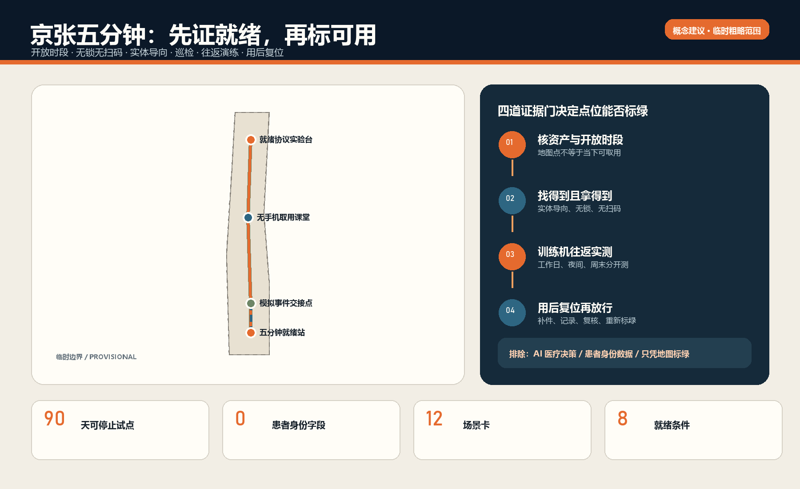
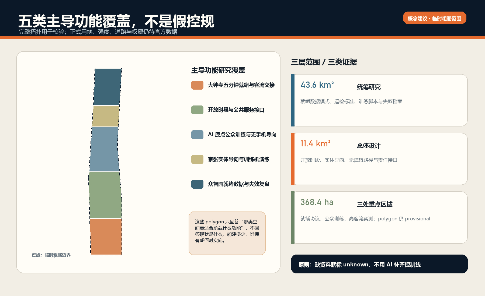
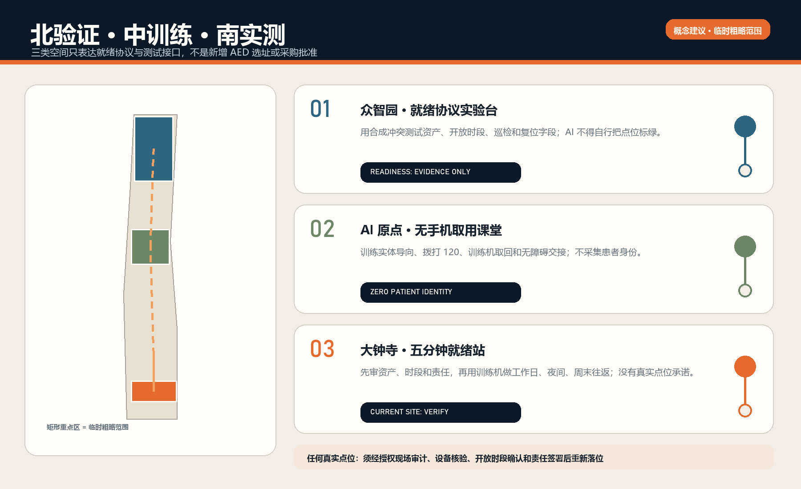
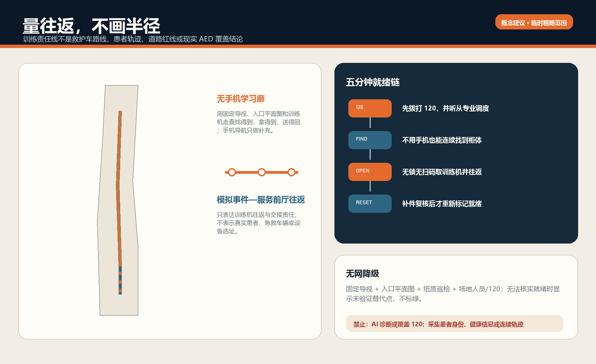
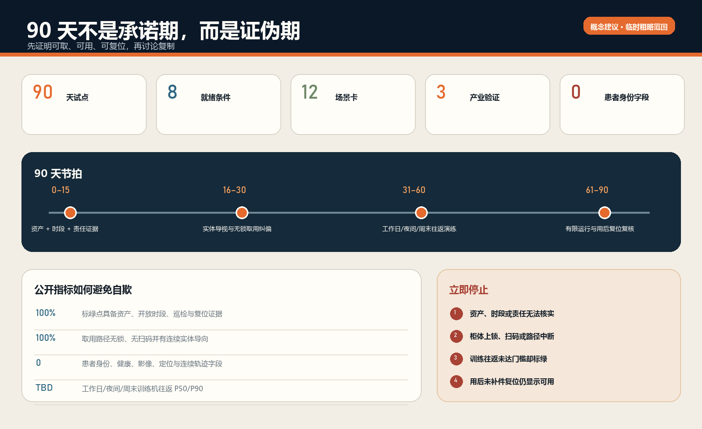

# 京张五分钟 / THE READY AED LINE

**不是“附近有 AED”，而是“现在拿得到一台真的可用的 AED”。** “五分钟”是按开放时段和真实路径进行训练机往返演练的阈值，不是无条件承诺、存活率承诺或医疗结论。所有空间动作均为基于临时粗略边界的概念建议；本方案不声明任何具体点位、机构合作或现场达标事实。

区位核验补充：仓库 Issue #1029 的公开复算记录指出，上游 `PROV-KEY-003` 临时 polygon 的面积与南北顺序自洽，但质心约位于北京北站一带，距大钟寺站约 2.26 km。该记录不是官方边界，也不是自行平移的授权。本案保留上游几何只作占位；“大钟寺”任务叙事来自公告名称，任何真实 AED、服务时段和取用路线必须另行现场与责任主体核验。官方或 canonical 几何更新后，整体重算图层、指标、图件、PDF 与 HTML。[source:ISSUE-1029] [assumption:A-BOUNDARY-001]

## 设计依据与资料清单

第一性问题只有一个：当有人疑似心脏骤停、旁人已经呼叫 120 时，能否完成“找到—取出—带回—按设备与 120 指导使用—用后复位”这条任务链。地图上的点若遇到关门、门禁、上锁、扫码、导向中断、电池/电极片过期或无人负责，就不是就绪点。国家卫健委指南要求点位明显、易取、柜门不上锁不扫码，并由场所单位巡检设备、耗材、标识和管理信息；北京通告明确公众可使用，未受训者可在 120 指导下操作 [source:NHC-AED-GUIDE-2021] [source:BEIJING-WJW-AED-ACCESS-2021]。

北京已经有与 120 调度系统联通的重点公共场所 AED 电子地图，因此本方案淘汰“再做一个地图”；未取得一个重点区的资产、开放和路线数据前，也淘汰“先买更多设备”。保留的产品是带有效期的 `ready_aed_point` 就绪证明 [source:BEIJING-AED-120-MAP-2023] [depth:existing_conditions_diagnosis]。

北京市地方标准 `DB11/T 2564-2026` 已于 2026 年 6 月 30 日发布，但到 2026 年 10 月 1 日才实施。本方案仅把人员密集场所步行取用往返宜短于 5 分钟、公众免费使用、服务时间公示、责任人与维护记录等条款作为“已发布、尚未生效的实施参照”，不写成当前义务或现场事实 [source:BEIJING-AED-STANDARD-NOTICE-2026] [source:BEIJING-AED-FIVE-MINUTE-2026]。

| 就绪条件 | 必须证据 | 失效时的诚实状态 |
| --- | --- | --- |
| 1 资产与服务时间 | 责任单位核验、时间戳、下次复核日 | 未核验/关闭 |
| 2 实体导向连续 | 入口—转角—柜体的静态标识检查 | 导向失败 |
| 3 无锁无扫码 | 柜门实际开启检查 | 不可取用 |
| 4 设备与耗材有效 | 设备、电池、电极片、附件、标识巡检 | 故障/临期 |
| 5 责任岗位在班 | 资产、场地、巡检、升级、复位职责 | 无人负责 |
| 6 多时段往返演练 | 工作日、夜间、周末训练机时间记录 | 未达标/未知 |
| 7 用后复位闭环 | 补耗材、恢复、复核、重新放行 | 使用后关闭 |
| 8 医疗边界清楚 | 120、设备语音、专业急救体系优先 | AI 停止输出 |

八项同时有效才显示“就绪”；任何一项缺失都降级并指向已核验替代点 [metric:readiness_condition_count]。AI 不诊断、不决定除颤，因此被委托的医疗决策数为零 [metric:ai_medical_decision_count]。

场地依据来自官方公告、智能体任务书、仓库场地包、来源注册和处理资料；几何使用维护者提供的 provisional boundary，只支持概念生成、拓扑自检和低置信度复算 [source:OFFICIAL-ANNOUNCEMENT] [source:AGENT-TASKBOOK] [source:SITE-PACKAGE]。总体边界与三处重点区均不是 official redline，正式 polygon 到位后需重算所有图层、指标、图件、HTML 与 PDF [source:BOUNDARY-SOURCE] [source:KEY-AREA-SOURCE]。

## 三层范围工作框架

统筹研究范围解决“谁共同维护公共就绪能力”；总体设计范围解决“物理导向、训练路线和责任节点怎样连续”；三处重点区解决“验证、公众训练、高客流试点分别需要什么”。这不是从一张大总图推导一切，而是把同一就绪契约放入不同空间类型中反证 [depth:three_level_scope_framework] [depth:overall_spatial_structure]。

品牌主名“京张五分钟”，英文 **THE READY AED LINE**。符号以铁路计时牌的 `5:00`、开放柜门和断开的红线组成：绿色只表示八项证据仍有效，琥珀表示临期/待复核，红色表示关闭。它不使用红十字、企业商标或官方 AED 标识图作为品牌资产；真实实施仍须使用国家统一导向标识。

| 层级 | 核心判断 | 空间产物 | 不能宣称 |
| --- | --- | --- | --- |
| 43.6 km² 统筹研究范围 | 卫健/急救、资产单位、场地运营、培训、高校与企业如何形成可复用协议 | 开放 schema、训练脚本、失败档案、责任模板 | 机构已同意、全域覆盖 |
| 约 11.4 km² 总体设计范围 | 无手机导向和训练机往返是否连续 | 一条学习线、四类研究节点、静态导向组件 | 道路红线、救护路线、精确服务半径 |
| 约 368.4 ha 重点区 | 三类节点如何证伪产品 | 众智验证、原点训练、大钟寺试点 | 具体 AED、门禁、客流或五分钟达标 |

临时总体边界的包内复算面积只证明文件一致性 [data:geometry/site_boundary.geojson#SITE-001] [metric:site_area_sqm]；三处 provisional 重点区只证明任务覆盖数量 [data:geometry/key_areas.geojson#PROV-KEY-001] [metric:key_area_count]。

## 统筹研究范围产业与未来城市研究

京张的 AI 产业价值不在于让模型“替人急救”，而在于让研究、标准、现场验证、产品运维和公共问责形成一条可迁移的可靠性产业链：众智园验证最小事件模型与冲突检测，AI 原点把专业规则翻译为公众可练习的无手机流程，大钟寺验证高客流空间的交接与复位，中关村科技服务翼提供标准、保险、法务与评测接口，小月河场景赋能翼承接公共体验和复盘。所有医疗和设备判断仍由法定/专业体系承担 [standard:PROJECT-AGENT-OPEN-CALL-TASKBOOK] [depth:overall_spatial_structure]。

五个全球创新生态案例只迁移机制，不复制规模、制度或投资：

| 案例 | 可迁移机制 | 京张转译 | 不迁移 |
| --- | --- | --- | --- |
| 新加坡 one-north | 研发、创业、试验与日常空间并置 | 把可靠性测试与公共体验放在同一走廊 | 土地制度与投资指标 |
| Seoul AI Hub | 培训、企业成长、共享设施、社群交流连续 | AED 训练、企业验证和开放复盘相邻 | 项目数量与组织架构 |
| Montréal Mila | 研究—产业—人才—公共利益协作 | 模型只做就绪冲突与失效复盘 | 伙伴名单与资金承诺 |
| ELLIS | 分布式节点共享研究协议 | 三处重点区共用 schema、各自验证类型 | 欧洲研究网络治理 |
| Smart Kalasatama | 可逆 living lab、先试后扩、方法迁移 | 90 天训练机试点与停止门 | 医疗/场地审批替代 |

案例分别由一手机构页面支撑 [source:CASE-ONE-NORTH] [source:CASE-SEOUL-AI-HUB] [source:CASE-MILA]。分布式与 living-lab 机制另见 [source:CASE-ELLIS] [source:CASE-SMART-KALASATAMA]；它们都不能证明北京现场条件。

GitHub 方法库进入的是架构而非成品：OpenAEDMap 提醒我们区分点位、开放和公众纠错；openrouteservice 提醒用路网而不是半径，但仍看不见门禁和室内导向；ODK 提供弱网现场表单方法；FixMyStreet/Open311 提供故障路由和状态事件。方案不复制代码、图件、数据或国外责任结构 [source:OPENAEDMAP-GITHUB] [source:OPENROUTESERVICE-GITHUB] [source:ODK-COLLECT-GITHUB]。维修路由和事件最小字段参考 [source:FIXMYSTREET-GITHUB] [source:OPEN311-GITHUB]。

## 总体设计范围城市更新与控规深度城市设计

空间结构为“一线、三站、四门、两本账”：一条 AED 就绪演练学习线串联三处重点区；三站分别承担协议验证、公众训练和高客流试点；四门是从模拟事件点到设备、取出、返回、复位的物理门；两本账分别记录设备/耗材状态与路线/责任状态。线和节点只表达概念关系，不是工程线位或已选址 [data:geometry/roads.geojson#ROAD-001] [data:geometry/public_space.geojson#PUBLIC-001]。

用地层是五类主导研究带的拓扑分区，不是控规调整；可逆模块只验证空间尺度，不是新建建筑 [data:geometry/land_use.geojson#LU-001] [data:geometry/buildings.geojson#BLDG-001]。容积率、建筑高度、建筑密度、道路红线和现状拆改留均待正式数据补齐 [standard:MOHURD-CONTROL-DETAILED-PLANNING] [depth:development_intensity_controls]。

真正的城市更新优先级是：先校准现场事实，再修静态导向与开门规则，再做训练机演练，最后才判断是否需要新增设备或空间改造。没有资产登记、故障类型和多时段路线证据时，不画设备覆盖半径；没有权属、消防、无障碍和现状建筑调查时，不作建设结论。

## 重点区域详细设计

### 众智园：就绪协议实验台

众智园承担“把失败变成可复现测试”。企业、高校和专业方可用合成点位、训练 AED 和虚构事件卡测试：开放时间冲突、巡检过期、替代点失效、断网、重复工单与用后未复位。AI 只标出不一致并生成复盘摘要，不能把缺证据状态推断为绿色 [data:geometry/key_areas.geojson#PROV-KEY-001] [data:geometry/buildings.geojson#BLDG-001]。

### AI 原点社区：无手机取用课堂

AI 原点承担“把专业要求翻译成公众能完成的动作”。训练空间以盲测式实体导向、设备语音熟悉、呼叫 120、两人协作与无障碍取用为核心；不收集身份、声音、面部或健康数据。手机导航是补充，不是入口 [data:geometry/key_areas.geojson#PROV-KEY-002] [data:geometry/public_space.geojson#PUBLIC-002]。

### 大钟寺：五分钟就绪站（90 天首选类型）

大钟寺类节点适合反证高客流、换乘、服务时段与复杂入口，但本包没有权威点位、门禁、客流和运营方数据，不能声称已有 AED 或五分钟达标。若取得授权，先选一个有人值守、服务时间清楚的公共场所类型做训练机试点；若资产责任人、巡检授权或 120 协调无法闭合，立即停止 [data:geometry/key_areas.geojson#PROV-KEY-003] [data:geometry/phasing.geojson#PHASE-001] [depth:three_key_area_detailed_design]。

## AI 创新生态、人才画像与 AI+ 场景

七类画像不是患者画像：通勤者/换乘者、园区员工、学生、访客、夜班和保洁维护人员、老年/残障访客、场地一线员工。MVP 不记录他们的身份或健康信息 [metric:persona_count] [metric:patient_identity_field_count]。

| 场景卡 | 类型与位置 | 可测输出 | 人工/停止边界 |
| --- | --- | --- | --- |
| T01 开放时段冲突测试 | 产业验证·众智园 | 冲突检出率、人工确认时长 | 无人工确认不转绿 |
| T02 巡检/耗材临期测试 | 产业验证·众智园 | 漏检、提前量、错误升级 | AI 不判断设备合格 |
| T03 断网与替代点测试 | 产业验证·众智园 | 离线完成率、错误替代数 | 纸质台账和人工值守兜底 |
| S04 无手机找柜 | 公众训练·原点 | 找对率、转弯错误、耗时 | 不采集连续轨迹 |
| S05 无锁无扫码开柜 | 取用测试·原点/大钟寺 | 首次开启成功率 | 需钥匙/扫码即停 |
| S06 120+训练机双线流程 | 合成演练 | 呼叫、取回、设备语音配合 | 不用真实患者、不放电 |
| S07 夜间服务窗核验 | 多时段演练 | 实际开门与公示一致率 | 无值守则关闭该时段 |
| S08 无障碍端到端取用 | 公共空间 | 台阶、门宽、柜高、导向失败 | 专业复核后整改 |
| S09 大型活动临时状态 | 活动前检查 | 临时封闭、客流绕行、替代点 | 活动许可与现场指挥优先 |
| S10 使用后复位工单 | 运维闭环 | 补耗材与重新放行时长 | 未复核不恢复绿色 |
| S11 公众纠错到责任人 | 公共问责 | 路由正确率、关闭时长 | 工单状态不等于现场就绪 |
| S12 月度失败档案 | 开放学习 | 聚合失败类型、复发率 | 不公开个体或患者数据 |

十二张场景卡、三类产业验证和 90 天试点均为方案可核对的计数 [metric:scenario_card_count] [metric:industry_test_count] [metric:pilot_days]。AI 层只允许三类功能：检测过期/冲突、将故障路由给责任人、生成不含个人数据的聚合复盘；其输出必须可被人工否决。

## 用地、建筑规模与拆改留方案

五个用地分区完整覆盖 provisional site，仅作为“主导研究内容”分区并采用现行用地分类代码，不改变法定用途 [standard:MNR-LAND-USE-CLASSIFICATION-GUIDE] [depth:land_use_layout]。三座约 48m×22m 的可逆模块原型用于验证课堂、复盘台和服务前厅尺度，包内基底面积可复算，但不代表现状或拟建规模 [metric:building_footprint_area_sqm]。

拆改留顺序固定为：利用既有有人值守服务台—增加静态标识/纸图/责任卡—用移动训练设备试运行—只有在权属、结构、消防、无障碍和专业急救评估完成后才讨论改造。高度、体量、材质与夜景仅提出低扰动、可逆、易维护的定性建议 [depth:retain_renovate_demolish] [depth:height_massing_character] [standard:MOHURD-ARCH-DESIGN-DEPTH-2016]。

## 交通、轨道、市政与公共服务设施

AED 的“距离”必须是模拟事件点到柜体再返回的完整步行时间，不是直线半径。路线记录要按实际入口、服务时段、楼层、门禁、过街、施工和无障碍条件核验；训练者到达后还要能看见、开柜、带回。概念学习线的长度只用于包内空间关系检查，不代表真实路线 [metric:readiness_drill_line_length_m] [depth:traffic_rail_slow_parking]。

最低服务不依赖网络：统一实体标识、入口纸质平面图、柜旁操作说明、值守电话/120、手工巡检卡和明确替代点。数字层不得替代 120，不向 AED 下发医疗控制；远程状态只能作为提示，现场人工核验决定开放状态 [depth:municipal_new_infrastructure] [data:geometry/constraints.geojson#CONSTRAINTS]。

## 蓝绿空间、公共空间与城市风貌

沿京张遗址公园的概念学习廊道只承载实体导向、休息点、训练活动和失败档案，不声称新增绿地或安装真实设备 [data:geometry/green_space.geojson#GREEN-001]。四个研究节点强调“入口一眼可见、道路不断行、轮椅可接近、夜间不过度发光”，公共空间比例只是概念几何复算 [metric:green_ratio] [metric:public_space_ratio] [depth:blue_green_public_space]。

三处制度型地标是：众智园“失效复盘台”、AI 原点“无手机取用课堂”、大钟寺“5:00 就绪牌”。荣誉墙不表彰“AI 救人”，而记录经过专业确认的维护班组、训练贡献和已修复失败；同时保留关闭记录，避免只展示成功。视觉语言借铁路时刻表的清晰层级和交接纪律，不把医疗急救娱乐化 [standard:MOHURD-URBAN-DESIGN-MEASURES]。

## 更新项目清单、实施政策与分期计划

90 天试点先于任何扩张：

| 阶段 | 动作 | 进入下一阶段的门 | 停止条件 |
| --- | --- | --- | --- |
| 0–15 天 证据门 | 授权资产盘点、责任 RACI、开放时段、柜门、设备/耗材、120/培训接口、路线 | 至少一个合法可练点，所有责任有人签收 | 无资产责任人、无巡检授权或无法训练 |
| 16–30 天 低成本修复 | 静态导向、入口平面图、责任卡、纸质替代点、开门规则 | 无手机盲测可完成 | 仍需扫码/钥匙且无人值守 |
| 31–60 天 合成演练 | 工作日/夜间/周末训练机往返，记录失败 | 关键班次可复现、失败可路由 | 引入患者/身份/医疗判断 |
| 61–90 天 有限运行 | 每日巡检、每周抽测、用后复位、聚合月报 | 责任单位决定继续/修改/停止 | 设备/耗材未知、门禁或路线冲突未标红 |

更新项目只有六项：资产与责任台账、无手机导向包、训练机演练、就绪事件 schema、故障/复位工单、失败档案与季度复盘。它们是概念建议，不是获批项目或采购计划 [depth:renewal_project_list] [depth:phasing_implementation]。

RACI 建议：安装/资产单位对设备与维护最终负责；场地运营对开放、门禁、导向和值守负责；指定巡检岗直接检查；120/急救与培训专业方提供流程协商；AI 供应方只对数据工具负责；任何现场责任人都可将点位标红，只有完整复核才能重新放行。责任表述不表示这些机构已经同意。

长期运营活动包括季度“5:00 盲测日”、年度失败档案展、开发者就绪 schema 复现赛和场地维护共学。所有活动先经场地、急救和安全审查，不模拟真实患者，不占用真实急救资源，不以比赛速度替代正确流程。

## 指标体系、面积复算与合规矩阵

最关键指标不是“安装数量”，而是：多时段训练机往返时间分布、无手机完成率、开放状态一致率、巡检完整率、失效到标红时间、故障到修复时间、用后复位时长、重复故障率、错误替代点数。当前经授权现场点位数和五分钟就绪覆盖率均为 unknown，绝不伪造 [depth:metrics_recalculation]。

包内 known 指标只描述可复算几何或方案内容：三处重点区、四个概念节点、十二场景、三类产业验证、七类画像、90 天和八项就绪条件 [metric:concept_node_count]。现场绩效要在授权试点后写入新的、带日期和责任人的数据集，不能从概念线长度或地图点推导。

合规矩阵覆盖公告 1.3、1.4、1.5 与 agent.1–agent.6；专业标准和设计深度矩阵把正文、图件、GeoJSON、指标、来源、假设和自检相互挂接 [source:PROCESSED-FACT-PACK] [standard:PROJECT-OFFICIAL-ANNOUNCEMENT]。

## 风险、版权与合规说明

四个不可越过的边界：第一，AI 不做医疗判断；第二，不收集真实患者、旁观者或训练者身份与健康数据；第三，未核验点位不能显示就绪；第四，尚未生效的标准不能写成现行义务。断网时保留实体导向、纸质状态和值守；点位失效时标红并指向已核验替代点，不存在“临时上锁但仍算可用”的旁路 [depth:risk_missing_data]。

约束图层刻意为空，因为仓库没有清权的真实 AED、门禁、开放时段、现状建筑、道路红线、权属、消防和急救路线几何；空集合优于编造 [data:geometry/constraints.geojson#CONSTRAINTS]。official polygons 到位后还须按 EPSG:4548 重算全部面积关系。

所有图件由包内 GeoJSON/JSON 和本地 Python、Pillow、Shapely、pyproj、ReportLab 生成；封面为合成概念表达，不是现场照片。无外部字体、地图瓦片、远程脚本、API、iframe、表单、人物肖像或企业商标。详细生成、许可和限制见 `report/copyright_statement.md`。

## 参考资料

完整来源登记在 `sources.json`，包括发布者、URL、日期、用途、许可摘要和限制；完整假设见 `assumptions.json`，指标公式见 `metrics.json`，任务覆盖见三个矩阵。正文只保留与判断相邻的证据标记，来源注册表作为用途边界而非新的事实来源 [source:SOURCE-REGISTRY]。

证据的使用顺序也决定了设计：国家卫健委指南与北京市公开通知用来界定“公众可取、柜门不锁不扫码、场所巡检、120 指导”的最低边界 [source:NHC-AED-GUIDE-2021] [source:BEIJING-WJW-AED-ACCESS-2021]。

北京市 120 地图说明“再造地图”不是首要缺口；2026 年已发布但尚未生效的地方标准仅用作未来对齐参考，不能冒充现行义务 [source:BEIJING-WJW-AED-MAP-2023] [source:BEIJING-DB11-T-2564-2026]。OpenAEDMap、openrouteservice、ODK、FixMyStreet 与 Open311 只提供资产/状态分层、步行路网、离线走查、责任路由和开放工单的方法，不提供京张真实设备、道路、客流或合作方事实。

这些来源因此不会直接生成精确空间结论：概念 GeoJSON 只验证三层范围、拓扑、图件和指标引用能否闭合；面积、线长和比例只用于包内复算，不能推导真实 AED 覆盖或五分钟达标 [metric:site_area_sqm] [metric:readiness_drill_line_length_m]。仍缺失且必须通过授权现场审计补齐的数据包括：设备资产编号与当前状态、开放时段、入口和门禁、连续实体导向、柜门规则、设备/电池/电极片/附件有效性、资产/场地/巡检/复位责任、工作日/夜间/周末训练机往返，以及使用后补件与重新放行时间。任何一项缺失都保持 unknown 或红色，不由 AI 猜测。

本方案为开放共创建议，不替代正式规划、医疗指南、设备说明书或政府审定结论。任何真实试点都必须先取得场地/资产授权，并由急救、医疗器械、消防、无障碍、数据与运营专业主体复核。
