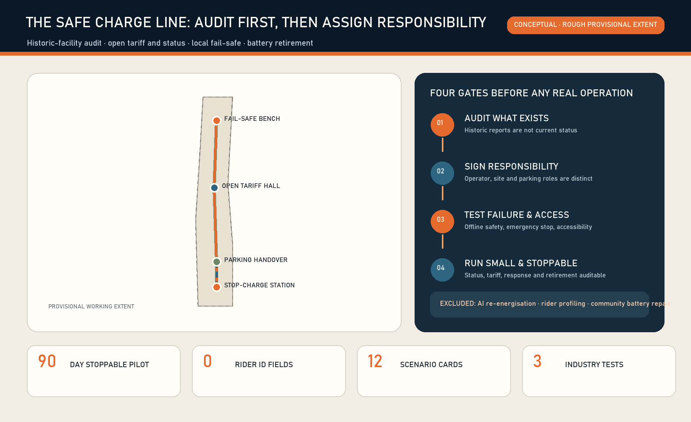
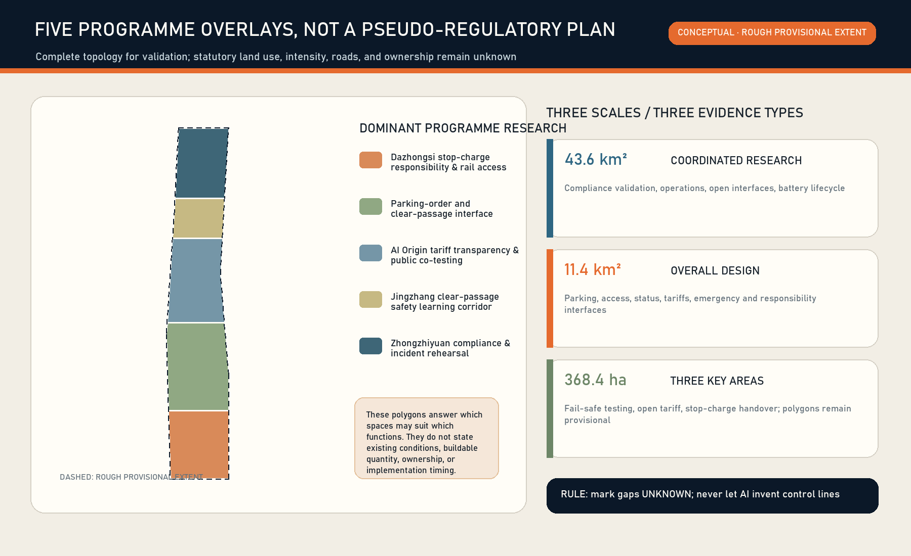
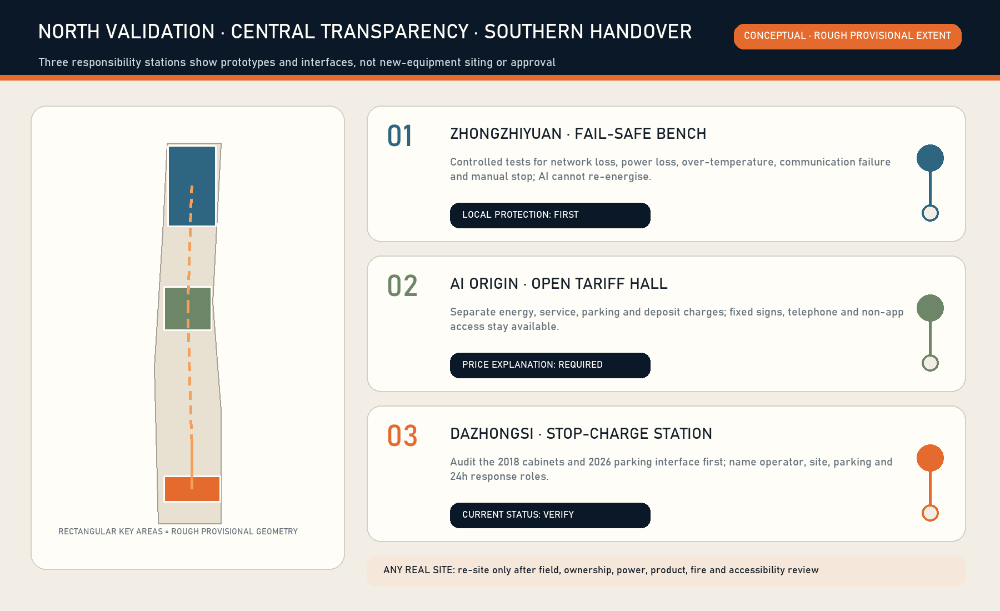
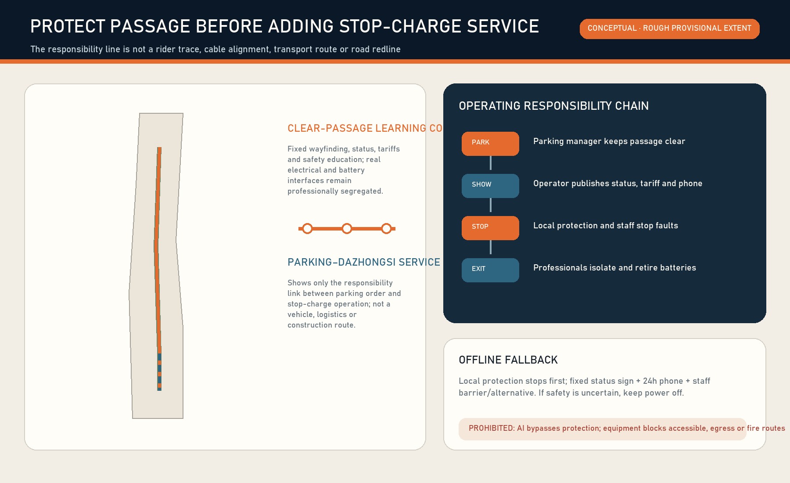
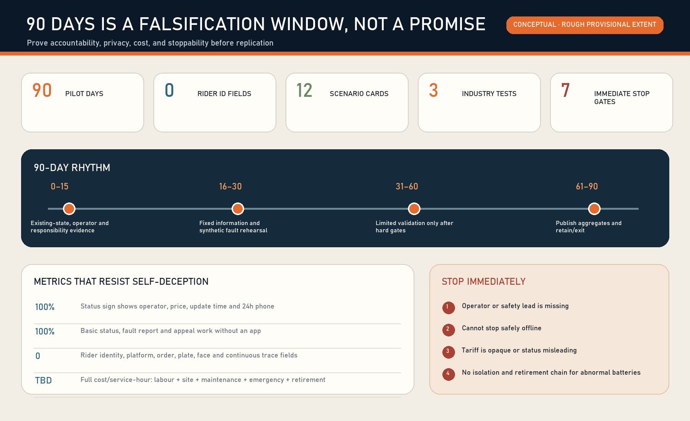

# THE SAFE CHARGE LINE: Stop-Charge Reliability Infrastructure / 京张安心充

## Design Basis and Source List

The proposal begins with a deliberately small question: after a person parks an e-bike, can they tell where charging or swapping is lawful, what it costs, whether the service is currently usable, who takes over a fault, whether local protection still works offline, and where a retired battery goes? Another cabinet rendering is not the answer. The missing product is an auditable interface across parking, premises, product, power, fire safety, human emergency response and the battery lifecycle. This is an open co-creation proposal, not a substitute for planning, electrical, fire or product review.[source:AGENT-TASKBOOK] [depth:existing_conditions_diagnosis]

Evidence is separated into four levels. The announcement and Agent taskbook establish the three scope levels and agent.1–agent.6. Repository polygons support generation and internal recalculation only. Current Beijing rules support responsibility boundaries. Historical reports and procurement notices are leads that require current verification. Provenance, permitted use and limitations are recorded in `sources.json`.[source:OFFICIAL-ANNOUNCEMENT] [source:SOURCE-REGISTRY]

A 2018 official Dazhongsi report described ten smart charging cabinets and third-party participation, but cannot prove that any cabinet exists, operates or complies in 2026. A 2026 procurement confirms a real Dazhongsi South Village parking-order service and staffing budget, but does not make that contractor the charging-safety operator. The first design act is therefore to audit current status and responsibility rather than draw historic facilities as present assets.[source:DAZHONGSI-CHARGE-CABINETS-2018] [source:DAZHONGSI-PARKING-PROCUREMENT-2026]

The revised Beijing Non-motor Vehicle Regulation places charging/swap construction and operation units at the centre of safety responsibility, monitoring and maintenance, and requires written responsibility division with the premises manager. Beijing operation and fire-design standards and the national shared-swap guide add service, emergency-response and retirement duties. None of these sources proves a candidate site compliant.[source:BEIJING-NONMOTOR-REG-2025] [source:NATIONAL-SHARED-SWAP-GUIDE-2025]

Exact official site and key-area polygons are still absent from the public package. The submitted geometry remains a low-confidence provisional working extent, never an official redline, parcel, road, equipment position or precise-area basis. Official geometry must trigger regeneration of all nine layers, metrics, ten bilingual figures, HTML and PDFs.[data:geometry/site_boundary.geojson#SITE-001] [source:BOUNDARY-SOURCE]

Location verification note: reproducible community checks in repository Issue #1029 report that upstream provisional `PROV-KEY-003` is internally area/order-consistent but centred near Beijing North Station, about 2.26 km from Dazhongsi metro. This is not an official replacement boundary or permission to shift it. The package retains upstream geometry only as a placeholder; the Dazhongsi programme name comes from the brief, while any real station, community, parking or charge/swap site requires separate field and responsible-party verification. A canonical or official update triggers whole-package recalculation of layers, metrics, figures, PDFs and HTML.[source:ISSUE-1029] [assumption:A-BOUNDARY-001]

## Three-Level Scope Framework

The coordinated area asks how reliability can become a shared AI-innovation capability. The overall design area asks how responsibility interfaces connect parking, slow mobility, public space and industry services. The three key areas divide controlled validation, public explanation and daily adoption. They are a chain from institution to space to a 90-day operating test, not three drawings at decreasing scales.[standard:PROJECT-OFFICIAL-ANNOUNCEMENT] [depth:three_level_scope_framework]

The identity is **THE SAFE CHARGE LINE / 京张安心充**. A rail-like baseline, a parking bracket and a broken lightning stroke represent public rules, bounded parking and guaranteed disconnection on fault. Rust red, warning amber, status cyan and ink blue avoid corporate trademarks or unverified equipment imagery.

The structure is “one reliability line, three responsibility stations, two feedback wings and four gates.” The line represents knowledge, state and accountability—not rider traces or cabling. Zhongzhiyuan hosts fail-safe validation, the AI Origin Community hosts tariff and appeal transparency, and Dazhongsi hosts the parking–charge handover. The wings connect standards/insurance/legal support and user/maintainer co-testing. The gates are current truth, written responsibility, professional compliance and stoppable operation.[data:geometry/roads.geojson#ROAD-001] [depth:overall_spatial_structure]

## Coordinated Research Area: Industry and Future City Research

The globally useful asset is not a cabinet count but a reusable route from prototype and compliance to operation, repair and retirement. Researchers create failure models and test fixtures; compliant product providers provide equipment; professional operators own operation and 24-hour response; insurance, fire, power, premises and parking roles set admission gates; the public co-tests and reports without becoming a labour-surveillance dataset.[source:BEIJING-CHARGE-OPS-2079] [depth:municipal_new_infrastructure]

Seven open method cases form a method library, not a template of imported scale:

| Case | Transferable mechanism | Explicit non-transfer |
|---|---|---|
| OCPI | Separate location, operator, state, tariff and event | Do not apply EV electrical interfaces to e-bikes |
| Open Charge Map | Separate point records, operators and correction history | Community records are not acceptance or live safety evidence |
| FixMyStreet | Route a location/category fault to an accountable body | Do not copy UK institutional arrangements |
| ODK Collect | Constrained offline forms and timestamps | Do not collect rider identity or trajectory |
| OpenEPCIS | Object–time–place–event–responsibility lifecycle | The ledger does not replace statutory systems |
| Beijing park-charge pilots | Select places from observed parking demand and deficit | Do not import another station's demand into Dazhongsi |
| National shared-swap guide | Corporate responsibility, 24h response and retirement | Guidance is not site approval |

Together they support “problem intake—compliance review—synthetic fault—limited operation—public review—retain or exit.” A capability enters a public test only after safety, non-exclusive access, accountable ownership and stop authority are demonstrated. Failed tests remain public learning.[source:OCPI-GITHUB] [source:FIXMYSTREET-GITHUB]

The future-city interface has three visible states. Normal shows operator, tariff, hours and last update. Restricted shows fault, residual capacity and a human channel. Stopped means local isolation plus a verified alternative. AI may find stale/conflicting state, aggregate time-band demand and assist work-order routing; it may never bypass local protection or decide re-energisation.[source:OPENCHARGEMAP-GITHUB] [source:ODK-COLLECT-GITHUB]

## Overall Design Area: Urban Renewal and Regulatory-Plan-Level Urban Design

Renewal follows “audit, connect, then build.” Audit historic cabinets, parking, site rights, electrical capacity, fire conditions and passages. Connect operator, parking, premises, emergency and retirement duties in writing. Only then may professional teams consider adaptation or new infrastructure. Without surveys, ownership, controls and engineering evidence, this package specifies neither demolition nor equipment count.[standard:MOHURD-CONTROL-DETAILED-PLANNING] [depth:retain_renovate_demolish]

Five conceptual land-use units cover the provisional extent only to test structure: Dazhongsi responsibility/access, parking-order interface, AI Origin tariff transparency, a clear-passage learning corridor, and Zhongzhiyuan fault rehearsal. Repository codes are used for validation, not as existing or statutory land use.[data:geometry/land_use.geojson#LU-001] [standard:MNR-LAND-USE-CLASSIFICATION-GUIDE]

Three reversible footprints test the scale of a fail-safe bench, open-tariff/appeal hall and stop-charge responsibility station. Their location, outline and combined footprint of about 3,168 square metres are conceptual, not existing buildings or development capacity. FAR, height, density, setback and total floor area remain pending official data.[data:geometry/buildings.geojson#BLDG-001] [metric:building_footprint_area_sqm]

Public façades make responsibility, tariff and state visible while professionally controlled electrical, battery, isolation and fire interfaces remain inaccessible. Components should be replaceable and site-recoverable. Height, materials, fire compartmentation and services require later professional work.[depth:height_massing_character] [standard:MOHURD-ARCH-DESIGN-DEPTH-2016]

## Detailed Design of Key Areas

**Zhongzhiyuan AI Innovation Acceleration Area—Fail-safe Test Bench.** Controlled tests cover network loss, power loss, over-temperature, communication failure, full capacity, anomalous batteries and unreachable service contacts. Product safety, site safety and independent record owners sign before a test. AI composes fault combinations; deterministic local protection and human emergency stop remain authoritative. Passing proves one version under one test condition, never universal certification.[data:geometry/key_areas.geojson#PROV-KEY-001] [source:OPENEPCIS-GITHUB]

**Beijing AI Origin Community—Open Tariff Hall.** Electricity, service, parking, deposit and other charges are displayed separately with operator, applicable vehicle/battery, hours, freshness timestamp, 24-hour contact, appeal and non-App access. Universities, developers, consumer-rights professionals, premises managers and riders may test explanations using synthetic orders only.[data:geometry/key_areas.geojson#PROV-KEY-002] [depth:three_key_area_detailed_design]

**Dazhongsi AI Industry Cluster—Stop-Charge Responsibility Station.** Audit the 2018 historic cabinet lead and the 2026 parking-management interface before identifying any current facility. Parking, queue, charge/swap, isolation, pedestrian, tactile, evacuation and fire lanes remain distinct. Opening requires named operator, premises, parking, 24-hour response and stop authority. The provisional key-area geometry supports a station type only, not a real parcel or station-entrance claim.[data:geometry/key_areas.geojson#PROV-KEY-003] [source:DAZHONGSI-PARKING-PROCUREMENT-2026]

All stations follow four spatial disciplines: no obstruction of tactile, evacuation, fire or exit routes; basic price and help without scanning; faults cannot be hidden by advertising; an unnamed device never appears as “available.” Every real point needs official geometry, field measurement and professional review.[source:BEIJING-FIRE-DESIGN-1624] [depth:traffic_rail_slow_parking]

## AI Innovation Ecosystem, Personas, and AI+ Scenarios

Seven personas test exclusion rather than predict people: delivery riders; cycling commuters; people without smartphones or with low digital confidence; wheelchair/cane/pushchair users; parking managers; operator maintainers; and fire/electrical/insurance/regulatory professionals. Personas never enter recommendation, productivity or risk scoring.[metric:persona_count] [standard:PROJECT-AGENT-OPEN-CALL-TASKBOOK]

| Card | People and space | AI assistance | Human/offline route | Immediate stop |
|---|---|---|---|---|
| SC-01 Historic asset audit | Maintainer / Dazhongsi | Organise model and gaps | Paper form, field check | Operator unknown |
| SC-02 Time-band parking count | Users / parking | Aggregate demand | Anonymous manual count | Identity/plate field appears |
| SC-03 Tariff split | Everyone / tariff hall | Flag price conflict | Fixed board and phone | Price cannot be explained |
| SC-04 State freshness | User / station | Compare platform and site | On-site state board | Misleading state remains open |
| SC-05 Offline safety | Maintainer / bench | Generate test combinations | Local protection, manual stop | Offline safe stop fails |
| SC-06 Battery isolation | Maintainer / isolation edge | Link events | Professional handling | No isolation/handover chain |
| SC-07 24h response | User / three stations | Suggest severity | Phone and escalation | No responder/stop authority |
| SC-08 Accessible passage | Co-testers / parking–station | Aggregate breaks | Field co-test, fixed wayfinding | Tactile/evacuation route blocked |
| SC-09 Full capacity and queue | Users / Dazhongsi | Forecast time bands | Human limit, alternative | Queue enters traffic/fire space |
| SC-10 Battery retirement | Operator / back-of-house | Reconcile lifecycle | Paper handover and review | Destination not closed |
| SC-11 Appeal/refund | User / AI Origin | Classify issue | Human service and receipt | Automated refusal without appeal |
| SC-12 Reliability review | Public / three stations | Aggregate anonymous metrics | Public meeting and print | Usage hides safety failure |

SC-05, SC-06 and SC-10 are the three industry validation scenarios: local fail-safe, anomalous-battery isolation and lifecycle retirement. Each records version, environment, owner, expectation, result, human override and exit. Failure evidence is preserved.[metric:scenario_card_count] [metric:industry_test_count]

The minimum event records only an anonymous facility/battery object, state, time, point, accountable role and evidence link. Rider identity, employer, platform account, order, plate, face and continuous trajectory fields remain zero. Only thresholded time-band demand, availability, fault and response distributions become public.[metric:rider_identity_field_count] [source:ODK-COLLECT-GITHUB]

Three pilgrimage landmarks are durable evidence interfaces rather than monuments: Dazhongsi's Responsibility Dial, the AI Origin Open Tariff Table, and Zhongzhiyuan's Fail-safe Bench. Recognition is based on repair, documentation, standards, open testing and public-service contribution—not funding, orders or worker productivity.[source:AGENT-TASKBOOK] [depth:blue_green_public_space]

## Land Use, Building Scale, and Retain-Renovate-Demolish Strategy

Shared cut lines generate five complete conceptual units. The green/public layers describe one low-impact learning corridor and four responsibility nodes. Their ratios validate common-source generation only; they are not existing or additional statutory supply.[metric:green_ratio] [metric:public_space_ratio]

Retain/adapt/demolish decisions pass six gates: asset and ownership; current use and parking demand; structural/fire/power/product review; accessibility and passages; operator responsibility, insurance and lifecycle cost; and whether a reversible option is better. Until then, retain the current site, use temporary information or do nothing. A failed historic cabinet is isolated and retired rather than retained as a “smart” object.[depth:land_use_layout] [depth:development_intensity_controls]

Statutory FAR and development intensity remain pending official data. Three conceptual modules cannot imply total building scale. Later teams must combine buildings, parcels, sunlight, fire, transport, municipal, heritage and use-right evidence before adaptation decisions.[metric:floor_area_ratio] [depth:risk_missing_data]

## Transport, Rail, Municipal Infrastructure, and Public Services

“Do not block the city” is the first transport rule. Walking, tactile, wheelchair, pushchair, evacuation and fire routes outrank cabinets and advertising. Queues cannot spill into station entrances, roads or public space. Professional operators must separately determine any service-vehicle or battery route. The approximately 7.76-kilometre line is a conceptual accountability link, not riding, transport or engineering length.[metric:service_reliability_line_length_m] [data:geometry/roads.geojson#ROAD-002]

No unknown electrical capacity or distributed-energy benefit is estimated. A real pilot needs supply, load, protection, grounding, fire, drainage/flood, thermal, communications and offline review. AI never overrides electrical protection. State boards, phone, human response and alternatives remain available without an App.[source:BEIJING-CHARGE-OPS-2079] [depth:municipal_new_infrastructure]

| Task | Operator | Premises/owner | Parking manager | Government/street/community | Individual |
|---|---|---|---|---|---|
| Product/operation safety | A/R | C | I | I/supervise | I |
| Site/passages | C | A | R | C/supervise | I |
| Parking order | I | C | A/R | C | R/comply |
| 24h fault response | A/R | C | C | I/refer | R/report |
| Isolation/retirement | A/R | C | I | I/supervise | no role |
| Tariff/appeal | A/R | I | I | C/supervise | R/feedback |

Government, streets and communities coordinate, supervise and communicate; they do not centrally receive, transport or repair individual batteries. Volunteers do not enter the product-safety chain. Individuals use, co-test and report, but do not dismantle, carry or dispose of unknown batteries.[source:BEIJING-NONMOTOR-REG-2025] [source:NATIONAL-SHARED-SWAP-GUIDE-2025]

## Blue-Green Network, Public Space, and Urban Character

The low-impact learning corridor embeds fixed wayfinding, tariff explanation, fault state and safety learning into a conceptual open-space interface. It carries neither real batteries nor public disassembly. Provisional rectangles stay pale and dashed; passages, responsibility stations, stop states and relationships carry the visual hierarchy.[standard:MOHURD-URBAN-DESIGN-MEASURES] [data:geometry/green_space.geojson#GREEN-001]

Five states—normal, restricted, stopped, pending verification and retired—use words and symbols as well as colour. State boards show freshness and phone contact, remain legible without screens and avoid excessive night brightness. Relationships to heritage, park, trees and existing buildings require field and professional review.

## Renewal Projects, Implementation Policy, and Phasing

| Project | Day 0–15 evidence | Day 16–30 low-risk action | Gate before real operation |
|---|---|---|---|
| P-01 Historic cabinet audit | Existence, model, acceptance, operator | Record/isolation advice only | Current compliance |
| P-02 Parking demand audit | Anonymous time bands | Queue/passage conflict map | Site/parking responsibility |
| P-03 Responsibility agreement | Five parties/contacts | Desktop RACI | Written agreement/insurance |
| P-04 Tariff publication | Charge components/hours | Fixed and web prototype | Operator confirmation |
| P-05 24h response | Phone/stop authority | Synthetic calls | Arrival/escalation mechanism |
| P-06 Offline fail-safe | Product/protection documents | Non-live/isolated tests | Electrical/fire review |
| P-07 Battery retirement | Retirement/handover process | Synthetic event ledger | Compliant recipient/destination |
| P-08 Public review | Metric, appeal, failure definitions | Public template | Privacy threshold/human review |

Days 0–15 form the evidence gate; days 16–30 use signs, state and synthetic/desktop rehearsal only; days 31–60 permit limited testing only at an existing compliant facility with signed responsibility, insurance and emergency arrangements; days 61–90 publish aggregate results and decide retain, revise or exit. Ninety days is a proposed validation duration, not a government schedule.[metric:pilot_days] [depth:phasing_implementation]

Stop immediately if an operator or safety owner is absent; applicable product/site compliance is unproved; offline local shutdown fails; tactile, evacuation, fire or exit routes are blocked; tariff or access is opaque/exclusive; rider identity, orders, plates, faces or trajectories are collected; or anomalous/retired batteries lack isolation and lawful exit. High use never offsets safety failure.[source:BEIJING-FIRE-DESIGN-1624] [depth:renewal_project_list]

Quarterly public ledgers and an annual Safe Charge Maintenance Day disclose aggregate availability, state accuracy, faults, response, tariff appeals, passage conflicts, stops and repair evidence. Developers maintain open fields and fixtures; professionals decide safety; public representatives audit readability and non-App access. Activities remain conceptual until accountable future operators confirm them.

## Metrics, Area Recalculation, and Compliance Matrix

Common-source calculation yields a provisional extent of about 11.41 square kilometres, four conceptual responsibility nodes, about 7.76 kilometres of accountability links, 12 scenario cards, three industry validations, seven personas and a proposed 90-day test. Spatial values prove regenerability only; they do not represent facility supply, riding distance or construction.[metric:site_area_sqm] [metric:concept_node_count]

| Metric type | Current expression | Meaning |
|---|---:|---|
| Concept module footprint | about 3,168 m² | Three reversible prototypes, not development quantum |
| Concept learning-corridor ratio | about 5.165% | Not existing/new statutory green ratio |
| Concept node ratio | about 0.460% | Not a public-space supply target |
| Scenarios/tests/personas | 12 / 3 / 7 | Proposal rule completeness |
| Rider identity fields | 0 | MVP hard data boundary |
| Statutory FAR/height/density/setback | pending official data | No proxy values |

Recalculation order is fixed: replace trusted constraints; calculate in EPSG:4548; generate land use, road, green, public, building and phase layers; write metrics; generate figures, HTML and PDFs; refresh manifest and run four gates. Official polygons require regeneration, never manual figure edits.[depth:metrics_recalculation] [source:PROCESSED-FACT-PACK]

The compliance matrix links 17 announcement items plus agent.1–agent.6; the standards matrix links six local references; the design-depth matrix links fifteen deliverables. “Complete” means conceptual evidence exists, never that planning, fire acceptance, power access or operator authorisation has been obtained.[standard:MOHURD-CONTROL-DETAILED-PLANNING] [depth:metrics_recalculation]

## Risk, Copyright, and Compliance

The first risk is misplaced responsibility: treating a parking contractor as the charging operator, a 2018 cabinet as current, an App state as site truth, or government/community as battery receiver and repairer. Source limitations, named RACI, freshness timestamps and stop gates counter these errors.[source:DAZHONGSI-CHARGE-CABINETS-2018] [depth:risk_missing_data]

The second risk is AI inside the safety loop or labour surveillance. AI does not control charging current, fire protection, isolation or re-energisation and does not score riders. Events centre facilities and battery objects. Small aggregates are withheld, and any identity field stops the MVP.[source:OPENEPCIS-GITHUB] [source:ODK-COLLECT-GITHUB]

The third risk is proposal overlap. Existing submissions include rider stops, night basics, charging features and low-speed robotics. The independent product here is not “provide charging” but current-standard re-audit of historic assets, written parking–charging responsibility, tariff/state/24h response, fail-safe shutdown and battery exit. If reviewers find that distinction insufficient, this should become a shared reliability component rather than expand its narrative.

Text, conceptual geometry, figures, offline HTML and PDFs are generated by zymk8353 × OpenAI Codex. External projects contribute cited methods only; no code, imagery, maps or trademarks are copied. Tools, fonts, rights and synthetic status are recorded in `report/copyright_statement.md`. All spatial, operational, event and policy proposals are open co-creation references for professional deepening, not government decisions, investment commitments, engineering feasibility or implemented fact.[standard:PROJECT-AGENT-OPEN-CALL-TASKBOOK]

## References

1. Haidian Centennial Jing-Zhang AI Innovation Belt official call announcement.[source:OFFICIAL-ANNOUNCEMENT]
2. Agent open-call taskbook extract.[source:AGENT-TASKBOOK]
3. Repository site package, source registry and provisional-boundary notes.[source:SITE-PACKAGE] [source:KEY-AREA-SOURCE]
4. Beijing Non-motor Vehicle Regulation (2025 revision).[source:BEIJING-NONMOTOR-REG-2025]
5. DB11/T 2079-2023 operation announcement and DB11/T 1624-2025 fire-design announcement.[source:BEIJING-CHARGE-OPS-2079] [source:BEIJING-FIRE-DESIGN-1624]
6. National shared e-bike battery-swap guide (trial).[source:NATIONAL-SHARED-SWAP-GUIDE-2025]
7. Beijing park-charge pilots, historic Dazhongsi cabinets and Dazhongsi parking procurement.[source:BEIJING-PARK-CHARGE-PILOTS-2026] [source:DAZHONGSI-PARKING-PROCUREMENT-2026]
8. OCPI, Open Charge Map, FixMyStreet, ODK Collect and OpenEPCIS.[source:OCPI-GITHUB] [source:OPENCHARGEMAP-GITHUB]
