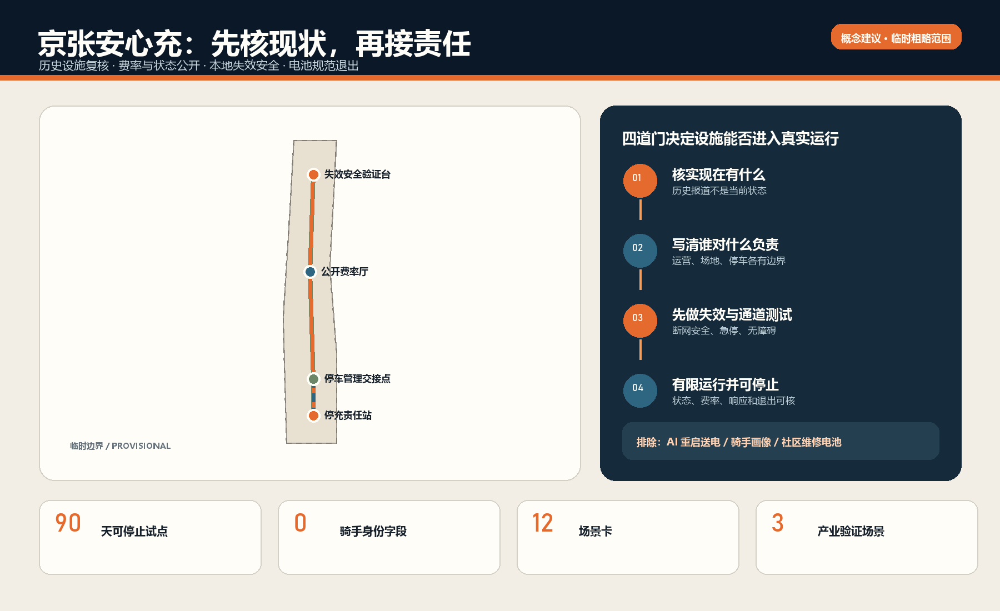
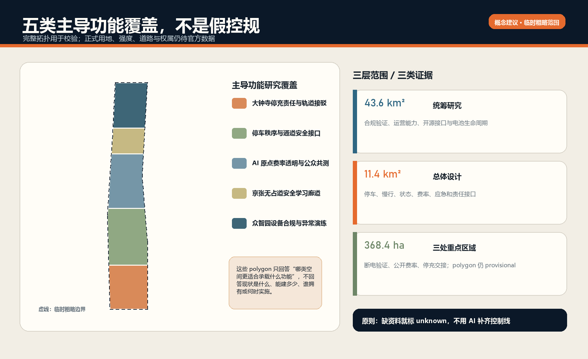
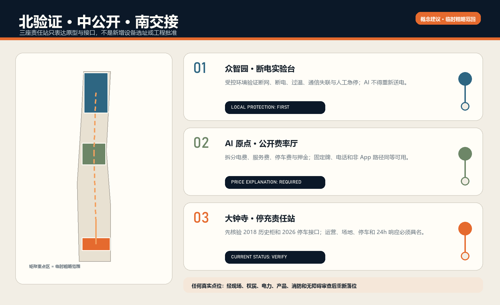
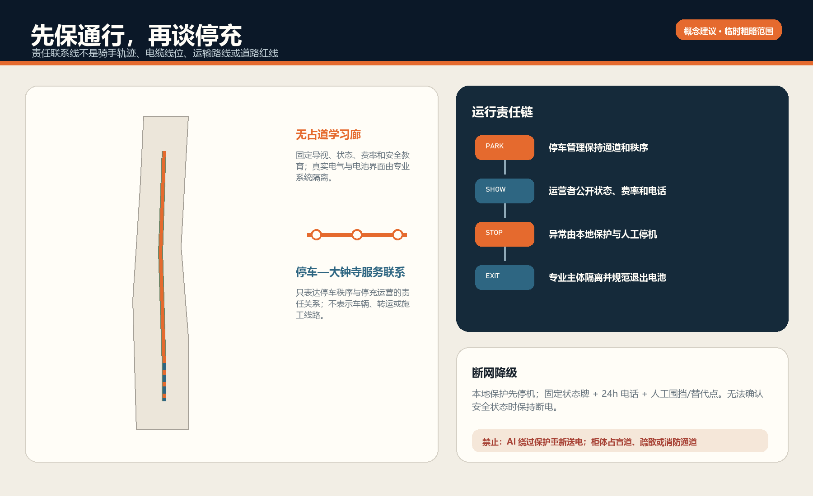
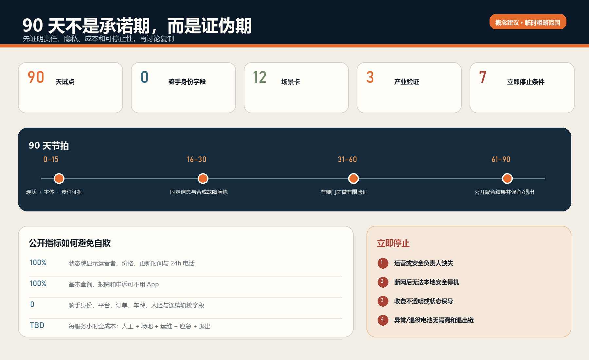

# 京张安心充：停充可靠性基础设施 / THE SAFE CHARGE LINE

## 设计依据与资料清单

本方案从一个不需要宏大叙事的问题出发：一个人把电动自行车停进停车场后，能否知道在哪里合法充或换、付多少钱、设备此刻是否可用、异常由谁接手、断网后是否仍能安全停机、退役电池最终去了哪里。城市缺的不是另一张柜体效果图，而是停车、场地、产品、电力、消防、人工应急和电池生命周期之间可验收的责任接口。这一判断只是一项开放共创建议，不替代规划、消防、电气或产品审查。[source:AGENT-TASKBOOK] [depth:existing_conditions_diagnosis]

资料分成四层。公告和任务书确定 43.6 平方公里统筹研究、11.4 平方公里总体设计、三处重点区域以及 agent.1—agent.6 的任务；仓库临时 polygon 只作生成和包内复算；北京现行法规与标准支持责任和服务边界；历史报道与采购只提供待核验线索。完整许可、时间、用途和不能证明什么均登记在 `sources.json`。[source:OFFICIAL-ANNOUNCEMENT] [source:SOURCE-REGISTRY]

大钟寺社区 2018 年公开报道记录过首批 10 个智能充电柜和第三方公司参与，但它不能证明 2026 年柜体仍在、仍运营或符合现行标准。2026 年大钟寺南村停车场管理采购证明停车秩序服务及人员预算真实存在，却不能把停车管理人员自动写成充换电安全运营者。两条证据共同定义本方案第一个任务：先复核现状与责任，不把历史设施画成当前基础设施。[source:DAZHONGSI-CHARGE-CABINETS-2018] [source:DAZHONGSI-PARKING-PROCUREMENT-2026]

《北京市非机动车管理条例（2025 年修订）》把充/换电设施建设运营单位置于安全责任中心，并要求其监测、巡检维护、上传相关状态，与场地管理方以书面协议划分责任。北京运营服务规范、防火设计标准和国家共享换电指南分别补充运营、消防、24 小时应急与电池退出要求。本方案只翻译这些责任关系，不宣称任何候选点已经合规。[source:BEIJING-NONMOTOR-REG-2025] [source:NATIONAL-SHARED-SWAP-GUIDE-2025]

当前官方精确总体边界与三处重点区域 polygon 仍未进入公开场地包。本提交沿用仓库 `provisional_boundaries.geojson`，所有临时边界均为低置信度工作范围，不是红线、地块、道路、设备位置或精确面积依据；官方数据发布后，九类图层、指标、十张双语图、HTML 与 PDF 必须整包再生。[data:geometry/site_boundary.geojson#SITE-001] [source:BOUNDARY-SOURCE]

区位核验补充：仓库 Issue #1029 的公开复算记录指出，上游 `PROV-KEY-003` 临时 polygon 的面积与南北顺序自洽，但质心约位于北京北站一带，距大钟寺站约 2.26 km。该记录不是官方边界，也不是自行平移的授权。本案保留上游几何只作占位；“大钟寺”任务叙事来自公告名称，所有真实站点、社区、停车场和充换电设施候选必须另行现场与责任主体核验。官方或 canonical 几何更新后，整体重算图层、指标、图件、PDF 与 HTML。[source:ISSUE-1029] [assumption:A-BOUNDARY-001]

## 三层范围工作框架

统筹研究范围回答“怎样把可靠性变成 AI 创新生态的共同能力”；总体设计范围回答“怎样让责任接口进入停车、慢行、公共空间和产业服务”；三处重点区域回答“验证、公众解释和日常采用分别在哪里发生”。这三层不是不同精度的同一总图，而是从制度、空间到 90 天运营的证据传导。[standard:PROJECT-OFFICIAL-ANNOUNCEMENT] [depth:three_level_scope_framework]

品牌名为 **京张安心充 / THE SAFE CHARGE LINE**。标识由一条铁轨式基线、一个停车括号和一个断开的闪电组成：基线代表公共规则，括号代表停放边界，断口代表任何异常都必须能本地断电。颜色采用铁锈红、警戒琥珀、状态青与墨蓝；不使用企业商标、具体设备外观或未经授权的现场照片。

空间结构为“一条可靠性线、三座责任站、两翼反馈、四道门”。可靠性线只表达知识、状态和责任的联系，不是骑手轨迹或电缆线位；众智园是断网断电验证站，AI 原点社区是费率与申诉公开站，大钟寺是停车—充换电责任交接站；中关村科技服务翼连接标准、保险、法务与产品服务，小月河场景赋能翼连接使用者、维护者和公众共测。四道门依次是现状真实、责任书面、专业合规、运行可停止。[data:geometry/roads.geojson#ROAD-001] [depth:overall_spatial_structure]

## 统筹研究范围产业与未来城市研究

京张可提供的世界级能力，不应是“装了多少充电柜”，而应是把城市设备从原型、合规、运营、维修到退出做成可复用的验证路径。高校与研究团队提出故障模型和可解释测试；设备与电池企业提交合规产品；运营企业承担运行和 24 小时响应；保险、消防、电力、物业与停车管理形成进入真实空间的共同门槛；公众只参与共测和报障，不被动成为劳动画像数据源。[source:BEIJING-CHARGE-OPS-2079] [depth:municipal_new_infrastructure]

七个开放方法案例构成方法库，而不是照搬规模或制度：

| 案例 | 可转译机制 | 不转译内容 |
|---|---|---|
| OCPI | 位置、运营者、状态、费率、事件分层 | 不把电动汽车电气接口套给电动自行车 |
| Open Charge Map | 点位与运营方分离、纠错留痕 | 众包记录不等于验收和实时安全 |
| FixMyStreet | 位置/故障类型路由到责任方、状态可追踪 | 不复制英国地方政府权责结构 |
| ODK Collect | 弱网现场走查、字段约束、时间戳 | 不采集骑手身份或连续轨迹 |
| OpenEPCIS | 对象—时间—地点—事件—责任的生命周期记录 | 事件账本不替代消防、产品和法定系统 |
| 北京停充一体试点 | 以真实停车量和缺口选择改造点 | 不把其他站点需求量移植到大钟寺 |
| 国家共享换电指南 | 企业主体、24h 应急、退役回收 | 不把指导文件写成单点批准 |

这套方法库支撑一个从“问题登记—合规审查—合成故障—有限运行—公开复盘—保留/退出”的创新链。只有完成公共安全、非排他接入、责任主体和停止权验证的能力，才进入小范围真实场景；测试失败同样沉淀为可复用知识。[source:OCPI-GITHUB] [source:FIXMYSTREET-GITHUB]

未来城市形态在这里表现为三种可辨识状态：正常服务显示运营者、费率、开放时间和最后更新时间；受限服务说明故障、剩余能力和人工渠道；停止服务断电、隔离并给出替代点。状态必须在线下可见，不能只存在于某个平台 App。AI 可发现状态冲突、聚合时段需求和辅助工单，不能绕过本地保护或自动判定重新送电。[source:OPENCHARGEMAP-GITHUB] [source:ODK-COLLECT-GITHUB]

## 总体设计范围城市更新与控规深度城市设计

总体设计采用“先查、再接、后建”的更新顺序。先查历史柜、停车场、场地产权/使用、电力容量、消防间距和既有通道；再把运营、停车、场地、应急和退役责任接成书面合同；只有供需、合规和责任都成立时，才由专业团队讨论改造或新增。没有建筑普查、权属、控规和工程条件，本包不指定拆除、不承诺新建、不提供设备数量。[standard:MOHURD-CONTROL-DETAILED-PLANNING] [depth:retain_renovate_demolish]

五个概念用地单元完整覆盖临时边界，只用于检查总体结构：大钟寺停充责任与轨道接驳、停车秩序接口、AI 原点费率透明、京张无占道学习廊道、众智园合规与异常演练。用地代码来自仓库枚举，但不构成现状或控规分类。[data:geometry/land_use.geojson#LU-001] [standard:MNR-LAND-USE-CLASSIFICATION-GUIDE]

三个小型建筑基底只是可逆模块的尺度测试：断网断电验证台、公开费率与申诉厅、停充责任站。其位置、轮廓和约 3168 平方米合计基底面积均为概念生成结果，不是现状建筑、拟建工程或允许建设量。容积率、建筑高度、建筑密度、退线和总建筑面积全部待正式数据和专业审查。[data:geometry/buildings.geojson#BLDG-001] [metric:building_footprint_area_sqm]

建筑风貌不复制充电柜工业外壳，而采用“可看见责任、隐藏高风险部件”的原则：公共界面显示责任卡、收费和状态；电气、电池、隔离与消防界面由专业规范决定并限制公众接触；构件优先可拆、可替换、可恢复场地。高度、材料、防火分隔和机电条件须由建筑、电气、消防专业深化，当前只提供信息层级与界面原型。[depth:height_massing_character] [standard:MOHURD-ARCH-DESIGN-DEPTH-2016]

## 重点区域详细设计

**众智园 AI 自主创新加速区：断电实验台。** 在受控、非公众运行的环境中验证断网、断电、过温、通信失联、满仓、异常电池和服务电话失联。测试开始前由产品安全、现场安全和独立记录三方签字；AI 只生成故障组合和比对日志，本地确定性保护与人工急停拥有最高权限。通过的只是某一版本在某一测试条件下的证据，不是通用安全认证。[data:geometry/key_areas.geojson#PROV-KEY-001] [source:OPENEPCIS-GITHUB]

**北京 AI 原点社区：公开费率厅。** 把电费、服务费、停车费、押金和其他费用拆开显示，公开运营主体、适用车辆/电池、服务时间、最后更新时间、24 小时电话、申诉和非 App 查询方式。高校、开发者、消费者权益人员、物业与骑手可用合成订单共同测试“同一服务是否得到同一价格解释”，不采集真实订单或平台身份。[data:geometry/key_areas.geojson#PROV-KEY-002] [depth:three_key_area_detailed_design]

**大钟寺 AI 产业聚集区：停充责任站。** 先对 2018 年历史柜和 2026 年停车管理接口做现场/主体核验，再决定是否存在可进入试点的当前设施。停车区、排队、充换电区、隔离区、人行、盲道、疏散和消防通道必须可区分；责任站只在运营企业、场地方、停车管理、24 小时响应和停止权均具名时开放。因临时重点区几何不是官方红线，本图只表达站型和接口，不声称落在真实地块或站口。[data:geometry/key_areas.geojson#PROV-KEY-003] [source:DAZHONGSI-PARKING-PROCUREMENT-2026]

三站共享四条空间纪律：柜体和停车不得占盲道、疏散、消防车道或安全出口；基本价格和求助不要求扫码；故障状态不能被广告界面遮盖；没有具名责任主体的设备不进入“可用”地图。任何具体点位都须在官方边界、现场测量和专业审查后重新落位。[source:BEIJING-FIRE-DESIGN-1624] [depth:traffic_rail_slow_parking]

## AI 创新生态、人才画像与 AI+ 场景

七类画像用来检查服务合同是否排除某类人，不用于预测个人：外卖/快递骑手关心时间、价格和 24 小时响应；骑行通勤者关心接驳与非排他使用；无智能手机或低数字能力者需要固定标识与电话；轮椅、盲杖或推车使用者需要完整通行链；停车管理人员需要明确边界和升级渠道；运营维护人员需要版本、巡检和停机权；消防、电气、保险与监管专业人员需要可审核证据。画像不进入推荐、绩效或风控评分。[metric:persona_count] [standard:PROJECT-AGENT-OPEN-CALL-TASKBOOK]

| 场景卡 | 人与空间 | AI 增强 | 人工/离线路径 | 立即停止条件 |
|---|---|---|---|---|
| SC-01 历史设施复核 | 维护员 / 大钟寺 | 整理型号与证据缺口 | 纸表、现场核验 | 无法确认运营者 |
| SC-02 分时停车计数 | 使用者 / 停车区 | 聚合时段需求 | 无人脸人工计数 | 出现身份或车牌字段 |
| SC-03 费率拆分 | 所有人 / 费率厅 | 检查价格冲突 | 固定价牌、电话 | 收费不可解释 |
| SC-04 状态新鲜度 | 使用者 / 责任站 | 对比平台与现场状态 | 现场状态牌 | 状态误导仍开放 |
| SC-05 断网安全 | 运维 / 验证台 | 生成测试组合 | 本地保护、人工急停 | 断网后无法安全停机 |
| SC-06 异常电池隔离 | 运维 / 隔离界面 | 提示事件关联 | 专业人员处置 | 无隔离与移交链 |
| SC-07 24h 响应 | 使用者 / 三站 | 工单分级建议 | 电话与现场升级 | 无人接单或无停止权 |
| SC-08 无障碍通行 | 共测者 / 停车—站点 | 汇总断点 | 现场共测与固定导向 | 占用盲道/疏散通道 |
| SC-09 满仓与排队 | 使用者 / 大钟寺 | 预测拥堵时段 | 人工限流、替代点 | 排队进入车行/消防空间 |
| SC-10 电池退出 | 运营者 / 后场 | 核对生命周期事件 | 纸质交接与人工复核 | 退役去向不闭合 |
| SC-11 申诉与退款 | 使用者 / 原点社区 | 归类问题 | 人工客服、票据 | 自动拒绝且无申诉 |
| SC-12 年度可靠性复盘 | 公众 / 三站 | 聚合无身份指标 | 公开会议与纸质报告 | 用使用量掩盖安全失败 |

其中 SC-05、SC-06、SC-10 是三项产业验证场景：本地失效安全、异常电池隔离、生命周期退出。每项测试都有输入版本、环境、责任人、预期、实际、人工覆盖和退出结果；失败记录保留，不能为了展示效果改写。[metric:scenario_card_count] [metric:industry_test_count]

最小事件只记录设施/电池对象的匿名编号、状态、时间、点位、责任角色和证据引用；骑手身份、雇主、平台账号、订单、车牌、人脸和连续轨迹字段为零。对公众发布的只是达到样本阈值的时段需求、可用率、故障和响应分布。[metric:rider_identity_field_count] [source:ODK-COLLECT-GITHUB]

三处“朝圣地标”不是巨型装置，而是可持续使用的公共证据界面：大钟寺责任表盘显示谁负责和何时更新；AI 原点公开费率长桌让价格、申诉和非 App 路径可比；众智园断电实验台公开通过与失败的版本。荣誉只授予修复、文档、标准、开源测试和公共服务贡献，不按融资额、订单量或个人劳动绩效排序。[source:AGENT-TASKBOOK] [depth:blue_green_public_space]

## 用地、建筑规模与拆改留方案

临时用地层通过共享切线生成五个完整单元，以验证功能关系和包内拓扑；它不是现状调查，也不构成法定用途调整。概念绿地与公共空间只表达一条低干扰学习廊和四个责任节点，比例仅用于检查图层是否同源生成，不表示新增绿地或公共空间指标。[metric:green_ratio] [metric:public_space_ratio]

拆改留采用六道门：资产和权属清楚；现状使用与停车需求核验；结构、消防、电力和产品审查完成；无障碍和通道安全完成；运营责任、保险与全生命周期成本成立；可逆方案优于永久建设。未过门时默认保留现状、采用临时标识或不实施。历史柜若失效，先隔离和合规退出，不因“智慧设施”身份而保留。[depth:land_use_layout] [depth:development_intensity_controls]

当前法定容积率和建设强度保持待正式数据补齐，不能用三座概念模块推导总建筑规模。正式深化应把现状建筑、地块、日照、消防、交通、市政、文保和使用权放进同一底图，再决定借用首层、停车边角或新建设施。[metric:floor_area_ratio] [depth:risk_missing_data]

## 交通、轨道、市政与公共服务设施

交通策略以“先不挡路”为底线：步行、盲道、轮椅、推车、疏散和消防路径优先于柜体与广告；停车排队不得回溢轨道站口、道路和公共空间；服务车辆和电池转运若存在，须由专业运营者另行确定路线、时窗和安全条件。本包约 7.76 公里的联系线只是三区责任传导图，不是实际骑行、运输或工程长度。[metric:service_reliability_line_length_m] [data:geometry/roads.geojson#ROAD-002]

市政策略不估算未知电力容量，也不承诺分布式能源。正式试点必须取得供电接入、负荷、保护、接地、消防、排水、防涝、热环境、通信和断网运行审查；任何“AI 优化”都不得覆盖电气保护。公共服务同时提供状态牌、电话、人工响应与替代点，App 只是可选入口。[source:BEIJING-CHARGE-OPS-2079] [depth:municipal_new_infrastructure]

责任 RACI 如下，`A` 是最终负责、`R` 是执行、`C` 是会签、`I` 是知情：

| 任务 | 运营企业 | 场地/产权 | 停车管理 | 政府/街道/社区 | 个人用户 |
|---|---|---|---|---|---|
| 产品与运行安全 | A/R | C | I | I/监督 | I |
| 场地与通道 | C | A | R | C/监督 | I |
| 停车秩序 | I | C | A/R | C | R/遵守 |
| 24h 异常响应 | A/R | C | C | I/转介 | R/报告 |
| 电池隔离与退出 | A/R | C | I | I/监督 | 不参与 |
| 费率与申诉 | A/R | I | I | C/监督 | R/反馈 |

政府、街道和社区负责规则、协调、公共空间与监督，不统一接收、运输或维修个人电池；志愿者也不进入产品安全链。个人能参与使用、共测和报障，但不拆修、搬运或处置不明电池。这正是方案与普通社区充电倡议的核心边界。[source:BEIJING-NONMOTOR-REG-2025] [source:NATIONAL-SHARED-SWAP-GUIDE-2025]

## 蓝绿空间、公共空间与城市风貌

低干扰责任学习廊将固定导视、费率说明、异常状态和安全教育嵌入既有慢行/开敞空间的概念界面；它不承载真实电池运输或公众拆解体验。临时边界在图上以淡色虚线表达，视觉重点放在通道、责任站、停止状态和三区关系，避免把粗略矩形伪装成总平面。[standard:MOHURD-URBAN-DESIGN-MEASURES] [data:geometry/green_space.geojson#GREEN-001]

公共界面遵循五种状态色，但不只依赖颜色：正常、受限、停止、待核验、已退役均配文字和符号；状态牌显示最后更新时间和电话；夜间不过度发光；无屏幕时仍可读。设备与铁路遗产、公园、树木和现有建筑的关系须经现场和文保/园林审查，本方案不主张改造任何真实遗产构件。

## 更新项目清单、实施政策与分期计划

八个概念更新项目按“证据优先、低风险先行”组织：

| 项目 | 0—15 天证据 | 16—30 天低风险动作 | 真实运行前硬门 |
|---|---|---|---|
| P-01 历史柜现状审计 | 存续、型号、验收、运营者 | 只做记录和隔离建议 | 当前合规证据 |
| P-02 停车需求审计 | 无身份分时计数 | 排队与通道冲突图 | 场地和停车责任 |
| P-03 责任协议 | 五类主体与联系人 | 桌面 RACI 演练 | 书面协议、保险 |
| P-04 费率公开 | 费用项和时段 | 固定牌与网页原型 | 运营者确认 |
| P-05 24h 响应 | 电话和停止权 | 合成呼叫演练 | 到场与升级机制 |
| P-06 断网断电测试 | 产品和保护说明 | 非带电/隔离测试 | 电气消防审查 |
| P-07 电池退出 | 退役和移交流程 | 合成事件账本 | 合规接收与去向 |
| P-08 公众复盘 | 指标、申诉和失败口径 | 公开模板 | 隐私阈值与人审 |

0—15 天是证据门；16—30 天只做导向、状态、桌面和合成演练；31—60 天只允许在“现有合规设施、协议签署、保险/应急明确”条件下有限验证；61—90 天公开聚合结果并作保留、修改或退出决定。90 天是建议验证周期，不是政府排期。[metric:pilot_days] [depth:phasing_implementation]

任一情况立即停止：运营或安全负责人缺失；产品/场地适用标准不能证明；断网后无法本地安全停机；占用盲道、疏散、消防车道或出口；收费不透明或排他；采集骑手身份、订单、车牌、人脸或连续轨迹；异常/退役电池没有隔离和规范退出。高使用量不能抵消安全失败。[source:BEIJING-FIRE-DESIGN-1624] [depth:renewal_project_list]

长期运营采用季度公开账本和年度“安心充检修日”，只公布聚合可用率、状态一致率、故障类型、响应时间、收费申诉、通道占用、停止原因和修复证据。开发者社区维护开放字段和测试夹具，专业机构负责安全判定，公众代表检查信息可读与非 App 路径。任何活动只是概念建议，须由未来责任主体确认。

## 指标体系、面积复算与合规矩阵

同源计算得到临时边界约 11.41 平方公里、4 个概念责任节点、约 7.76 公里责任联系线、12 张场景卡、3 项产业验证、7 类画像和 90 天建议试点。前三项空间数字只证明几何文件能闭合和再生，不代表真实设施供给、骑行距离或建设量。[metric:site_area_sqm] [metric:concept_node_count]

| 指标类型 | 当前表达 | 解释 |
|---|---:|---|
| 概念模块基底 | 约 3168 ㎡ | 三个可逆原型合计，非建设量 |
| 概念学习廊面积率 | 约 5.165% | 非现状/新增法定绿地率 |
| 概念节点面积率 | 约 0.460% | 非公共空间供给指标 |
| 场景/产业测试/画像 | 12 / 3 / 7 | 方案规则完整性 |
| 骑手身份字段 | 0 | MVP 数据硬边界 |
| 法定 FAR、高度、密度、退线 | 待正式数据补齐 | 不以代理值填充 |

复算顺序固定为：替换可信约束；在 EPSG:4548 计算；生成用地、道路、绿地、公共空间、建筑和分期；写入 `metrics.json`；由同一数据生成图件、HTML 和 PDF；最后刷新 manifest 并运行四门校验。官方 polygon 发布后不得只手改图面数字。[depth:metrics_recalculation] [source:PROCESSED-FACT-PACK]

任务覆盖矩阵逐条连接公告 17 项和 agent.1—agent.6，专业标准矩阵连接 6 项本地参考，设计深度矩阵连接 15 项成果。矩阵“complete”只表示方案提供了相应概念证据，不表示取得审批、消防验收、电力接入或运营授权。[standard:MOHURD-CONTROL-DETAILED-PLANNING] [depth:metrics_recalculation]

## 风险、版权与合规说明

首要风险不是模型误差，而是责任错位：把停车承包者当充换电安全运营者、把 2018 历史柜当 2026 现状、把 App 状态当现场事实、把政府/社区写成电池接收与维修主体。方案用来源限制、具名 RACI、最后核验时间和停止门抵抗这四类错误。[source:DAZHONGSI-CHARGE-CABINETS-2018] [depth:risk_missing_data]

第二类风险是“智能化”侵入安全回路或劳动数据。AI 不控制充电电流、消防保护、隔离和重新送电，不做个人风险评分或骑手绩效画像；事件模型以设施和电池对象为中心。聚合数据在小样本时不公开，任何身份字段出现即停止。[source:OPENEPCIS-GITHUB] [source:ODK-COLLECT-GITHUB]

第三类风险是同题重合。仓库已有骑手驿站、夜间基本服务、充换电功能和低速机器人方案。本方案不以“提供充电”作为原创点，而以现行标准下的历史设施复审、停车—充换电书面责任、费率/状态/24h 人工响应、异常停机和电池退出构成独立产品。若评审确认该差异不足，应合并为公共可靠性组件而非继续扩张叙事。

正文、概念几何、图件、离线 HTML 与 PDF 由 zymk8353 × OpenAI Codex 生成。外部项目只引用方法和公开页面，不复制代码、图像、地图或商标；字体、生成工具、许可和 synthetic 状态详见 `report/copyright_statement.md`。所有空间、运营、活动和政策建议均为开放共创建议，可供专业团队深化，不构成政府决定、投资承诺、工程可行性或已实施事实。[standard:PROJECT-AGENT-OPEN-CALL-TASKBOOK]

## 参考资料

1. 北京市规划和自然资源委员会海淀分局，百年京张 AI 创新带城市设计国际方案征集资格预审公告。[source:OFFICIAL-ANNOUNCEMENT]
2. 面向全球智能体开展百年京张 AI 创新带城市设计开源征集任务书摘录。[source:AGENT-TASKBOOK]
3. 仓库场地包、来源登记表及临时边界说明。[source:SITE-PACKAGE] [source:KEY-AREA-SOURCE]
4. 北京市非机动车管理条例（2025 年修订）。[source:BEIJING-NONMOTOR-REG-2025]
5. DB11/T 2079-2023 运营服务规范公告、DB11/T 1624-2025 防火设计标准公告。[source:BEIJING-CHARGE-OPS-2079] [source:BEIJING-FIRE-DESIGN-1624]
6. 国家电动自行车共享换电工作指南（试行）。[source:NATIONAL-SHARED-SWAP-GUIDE-2025]
7. 北京重点地铁站停充一体试点、大钟寺历史充电柜和停车管理采购。[source:BEIJING-PARK-CHARGE-PILOTS-2026] [source:DAZHONGSI-PARKING-PROCUREMENT-2026]
8. OCPI、Open Charge Map、FixMyStreet、ODK Collect、OpenEPCIS 开源项目。[source:OCPI-GITHUB] [source:OPENCHARGEMAP-GITHUB]
