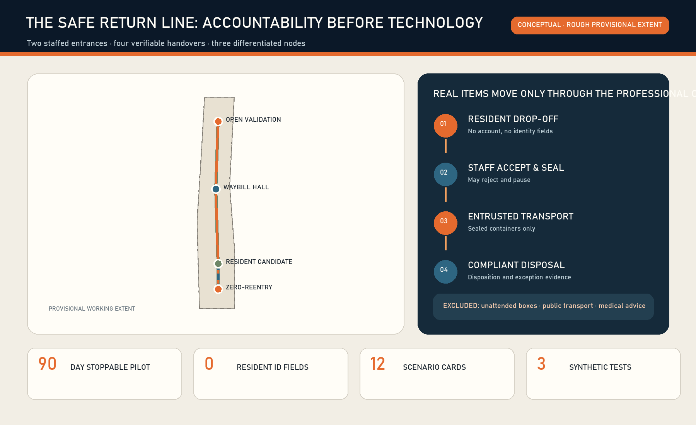
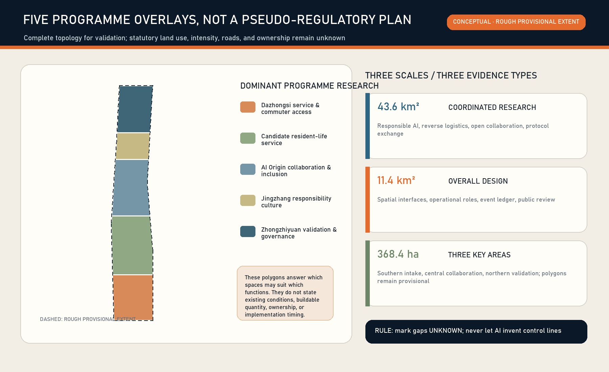
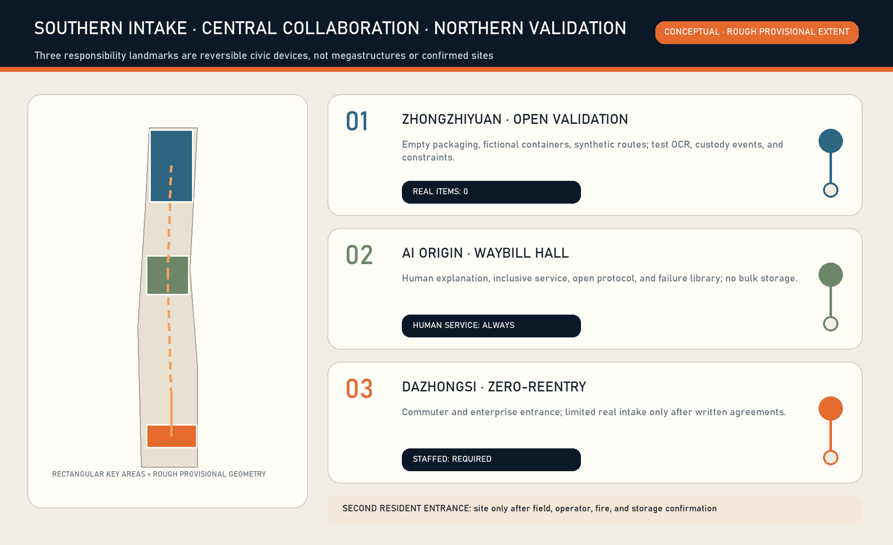
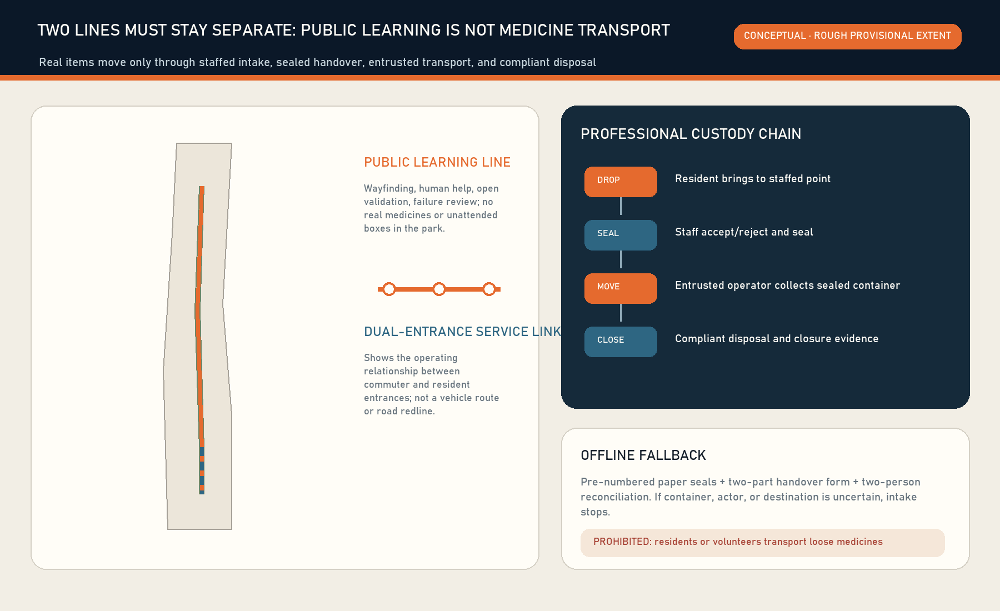
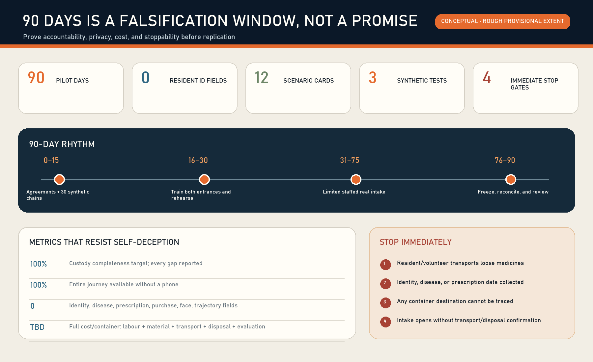

# THE SAFE RETURN LINE

## Design Basis and Source List

**Every product that enters urban life should also have a safe way out.** The proposal addresses a small but consequential public problem: expired or unwanted household medicines should neither re-enter use and trade nor be casually discarded. A campaign, an unattended box, or a clever recognition screen does not solve the problem if responsibility disappears after an item is deposited. The Safe Return Line therefore treats the chain of responsibility as the design object, AI as an auditable assistant rather than a spectacle, and urban space as a set of accountable service interfaces.[source:BEIJING-MED-WASTE-2025] [source:HAIDIAN-HOUSEHOLD-RETURN-2014]

The official announcement and the Agent-facing taskbook are the primary project references. Scope, formal chapters, the Three Areas and Two Wings, five functions, and open co-creation boundaries follow the repository's registered materials.[source:OFFICIAL-ANNOUNCEMENT] [source:AGENT-TASKBOOK] [standard:PROJECT-OFFICIAL-ANNOUNCEMENT] Every output is an open co-creation proposal. It does not replace statutory planning, government review, medical advice, administrative permission, or an implementation commitment. All spatial placements are conceptual suggestions for professional teams to investigate further.

The public package does not yet contain citable official redlines, regulatory controls, road redlines, ownership, heritage, blue-line, or complete existing-building data. This package retains the maintainers' provisional geometry, labels it `provisional_constraint` and `official_boundary=false`, and uses it only for generation, visualization, and method testing.[source:BOUNDARY-SOURCE] [data:geometry/site_boundary.geojson#SITE-001] The recalculated area of about 11.41 square kilometres demonstrates internal file consistency only; it is not a statutory or survey-grade claim.[metric:site_area_sqm]

Location verification note: reproducible community checks in repository Issue #1029 report that upstream provisional `PROV-KEY-003` is internally area/order-consistent but centred near Beijing North Station, about 2.26 km from Dazhongsi metro. This is not an official replacement boundary or permission to shift it. The package retains upstream geometry only as a placeholder; the Dazhongsi programme name comes from the brief, while any real station, community or medicine-return site requires separate field and responsible-party verification. A canonical or official update triggers whole-package recalculation of layers, metrics, figures, PDFs and HTML.[source:ISSUE-1029] [assumption:A-BOUNDARY-001]

Additional evidence comes only from public or cleared sources: Beijing's medicine-waste scheme, Haidian's historical household return information, public Beixiaguan and Dazhongsi pages, and first-party material from AI Verify, OpenEPCIS, OpenLMIS, OpenBoxes, OpenDP, Timefold, Australia's NatRUM, and France's unused-medicine responsibility system. `sources.json` records access dates, licences, uses, and limitations. The proposal borrows event modelling, modular logistics, privacy minimisation, constraint optimisation, and the separation of public drop-off from professional transport. It does not copy brands, interfaces, images, or unverified impact figures.

## Three-Level Scope Framework

The three project scopes answer different questions. At the approximately 43.6-square-kilometre coordinated research scale, the question is how Haidian can combine responsible AI, public-health resilience, reverse logistics, and open collaboration into a transferable innovation ecosystem. At the approximately 11.4-square-kilometre overall-design scale, the question is how that chain can be embedded in daily public, industrial, and service interfaces around the Jingzhang heritage park. At the approximately 368.4-hectare key-area scale, the question is what Zhongzhiyuan, the AI Origin Community, and Dazhongsi can each test and prove.[source:PROCESSED-FACT-PACK] [depth:three_level_scope_framework]

The spatial concept is not a parade in which medicines are carried along the park. It is **one responsibility protocol, three urban interfaces, two service entrances, and four verifiable handovers**. The protocol defines eligible categories, rejection, sealing, handover, exceptions, and disposal evidence. The interfaces are the Zero-Reentry Gate in Dazhongsi, the Responsibility Waybill Hall in the AI Origin Community, and the Open Validation Observatory in Zhongzhiyuan. The two entrances serve commuters/enterprises and residents respectively. The four handovers are acceptance, sealing, transport receipt, and disposal confirmation. A public learning route may follow the cultural spine, while real medicines move only through an authorised professional route.

| Scope | Core question | Safe Return Line output | Boundary not crossed |
| --- | --- | --- | --- |
| Coordinated research | Can a responsible-AI and reverse-logistics ecosystem be formed? | Eight method cases, open protocol, annual validation programme, regional collaboration | No invented company lists, investment, or policy commitments |
| Overall design | Can accountability be embedded in everyday urban interfaces? | Five conceptual programme zones, responsibility corridor, staffed services, public learning | Not a regulatory-plan amendment or statutory land-use conclusion |
| Key areas | Can three districts close different parts of the loop? | Southern intake, central collaboration, northern validation, and three honour nodes | No unauthorised building intervention or engineering feasibility claim |

The five polygons in `land_use.geojson` are dominant-programme research overlays. They make the submission topologically complete; they do not convert the entire belt into new statutory land uses. The three key-area polygons remain rough provisional constraints, and their rectangular edges must not be interpreted as roads, parcels, or construction boundaries.[data:geometry/land_use.geojson#LU-001] [data:geometry/key_areas.geojson#PROV-KEY-001]

## Coordinated Research Area: Industry and Future City Research

The proposal defines a world-class AI ecosystem as one that can publicly verify civic value, allow failure, preserve evidence, and be reused by other cities. It is not a competition in screens, model rankings, or firm counts. The stack has six layers: rules for eligibility, roles, and stop conditions; staffed space and synthetic test fields; a minimum handover-event ledger; AI assistance for OCR, anomaly detection, and routing options; human review, complaints, and failure review; and open release of anonymised samples, protocol versions, and evaluation reports. Algorithms never replace staff acceptance, verification of qualified transport, or the legal duties of disposal operators.

| Global/open case | Method absorbed | Translation into the proposal | What is not copied |
| --- | --- | --- | --- |
| Singapore AI Verify | Modular tests, principles translated into tests, and no claim of absolute safety | Three reproducible test families and risk cards at Zhongzhiyuan | Passing a test is not regulatory approval |
| OpenEPCIS / GS1 EPCIS 2.0 | Event questions: what, when, where, and why | Container and custody events without resident identities or diagnoses | No heavy Kafka/OpenSearch deployment in the first pilot |
| OpenLMIS | Modular public-health logistics services and reference distribution | Replaceable modules for intake, transport, disposal, and rule tables | No copying of forms or default deployment accounts |
| OpenBoxes | Visibility designed for constrained-resource supply chains | Paper/digital dual track, offline operation, and batch handovers | Forward inventory is not treated as waste disposal law |
| OpenDP | Verifiable privacy and privacy-budget thinking | Thresholded aggregate publication; first preference is collecting less | No collection of personal data merely to apply privacy algorithms |
| Timefold Solver | Explicit capacity, time-window, and routing constraints | Explainable route options subject to human dispatch approval | The algorithm cannot decide acceptance or waive compliance |
| Australia NatRUM | Public return, pharmacy containers, approved logistics, compliant disposal | Evidence that participation can be public while transport is professional | Australian pharmacy duties and funding are not imported |
| France Cyclamed / ADEME | Producer responsibility, pharmacy collection, specialist transport and treatment | Long-term study of shared responsibility and public communication | No claim that the same local EPR relationship already exists |

These sources form a method library, not a vendor shortlist.[source:AIVERIFY-GITHUB] [source:OPENEPCIS-GITHUB] [source:OPENLMIS-GITHUB] [source:OPENBOXES-GITHUB] The 90-day technical form is intentionally light: an offline-first event table, printable container labels, staff signatures, daily exports, and a basic audit view. Databases, message queues, or optimisation engines are considered only if observed volume, error, and coordination cost justify them. This reduces operational burden and procurement lock-in, and it keeps the process intelligible to communities and small organisations.

Within the Three Areas and Two Wings, Zhongzhiyuan hosts full-stack testing and responsible-AI governance; the AI Origin Community hosts open collaboration, training, and an inclusive life-service interface; Dazhongsi hosts commuter reach, enterprise responsibility, and a staffed urban front hall; the Zhongguancun Technology Service Wing provides standards, research, insurance, compliance, and operating methods; the Xiaoyuehe Scenario Empowerment Wing supplies low-impact public-space, accessibility, and extreme-weather test questions. Wider links to Future Science City, Huairou Science City, the Beijing Economic-Technological Development Area, and the Beijing-Tianjin-Hebei region are proposals for protocol exchange and synthetic challenges, not existing partnerships.

## Overall Design Area: Urban Renewal and Regulatory-Plan-Level Urban Design

The overall design uses four layers: physical service, operational responsibility, data events, and public review. The physical layer contains only staffed counters, sealable containers, controlled temporary-storage interfaces, wayfinding, and reversible modules. The operational layer defines residents, staff, point operators, entrusted transporters, disposal operators, and coordinating/supervisory bodies. The data layer stores container ID, event type, point, time bucket, actor role, quantity band, status, and exception code. The review layer publishes non-personal service status, failures, and evaluation conclusions. If any layer is absent, a real-medicine pilot does not open.

The provisional overall area is covered by five south-to-north dominant programmes: Dazhongsi responsibility service and commuter access; a candidate resident-life service band; AI Origin collaboration and inclusive service; a Jingzhang public responsibility culture band; and Zhongzhiyuan validation and governance. The overlay answers which types of space are suitable for which service. It does not diagnose current land use or propose floor-area ratio, height, density, or setback controls.[data:geometry/land_use.geojson#LU-001] [standard:MNR-LAND-USE-CLASSIFICATION-GUIDE]

Urban renewal follows three principles: operation before construction, reversible before permanent, and synthetic evidence before real items. The near term embeds staffed service in existing public, enterprise, pharmacy, or medical interfaces only after confirmation. A medium phase develops reusable modules after written agreements, public-acceptance evidence, and cost review. A long phase may study a shared protocol across districts. Footprint, fire, sanitation, pharmacy, medicine-waste, heritage, and traffic requirements remain subject to professional confirmation.

The digital model is an event ledger rather than a resident dossier. A minimum record can be expressed as `container_id / event_type / point_id / time_bucket / actor_role / quantity_band / status / exception_code / previous_event_hash`. It can answer whether a container completed its custody chain; it cannot answer which resident had which illness. OCR may alert staff to product name, dosage form, or expiry date on packaging, but images are deleted after local confirmation by default. Residents need no app, QR registration, or account; an optional paper receipt remains available.

Professional development should first obtain official polygons, existing public-service and licensed medicine points, road and loading conditions, heritage and blue-green controls, buildings and ownership, transport/disposal contract boundaries, and authoritative classification guidance. Missing evidence does not invalidate the concept, but it keeps the related decision `unknown`; AI must not fill it with plausible-looking estimates.[data:geometry/constraints.geojson#CONSTRAINTS] [depth:risk_missing_data]

## Detailed Design of Key Areas

The three areas form a southern intake, central collaboration, and northern validation loop, but they are not the only places that could ever handle real returns. **Dazhongsi** hosts a conceptual Zero-Reentry Gate for commuters, enterprise staff, nearby residents, and scheduled campaigns. It cannot rely on the assumption that the area has few residents: public evidence shows an industry/business orientation and an existing community life at the same time. The pilot compares commuter and resident entrances before any permanent siting decision.[source:DAZHONGSI-COMMUNITY-2020] [data:geometry/key_areas.geojson#PROV-KEY-003]

The **AI Origin Community** hosts the Responsibility Waybill Hall. It is not a bulk storage facility. Its functions are public explanation, human assistance for older people, open-protocol discussion, developer training, and anonymised evaluation display. Here, AI-native living means that the service works without a smartphone, every automated suggestion can be reviewed by a person, and each failure enters a visible version history.[data:geometry/key_areas.geojson#PROV-KEY-002] [standard:ELDERLY-SMART-TECH-PLAN-2020-45]

**Zhongzhiyuan** hosts the Open Validation Observatory. The first phase accepts no real public medicines; it uses empty packages, simulated labels, fictional container IDs, and synthetic routes. Tests cover packaging OCR and rule explanations, sealed-handover completeness and anomaly detection, and route options with capacity and time windows. Reports include false positives, false negatives, human overrides, offline degradation, and out-of-scope cases.[data:geometry/key_areas.geojson#PROV-KEY-001] [source:AIVERIFY-GITHUB]

The resident entrance is a candidate staffed interface somewhere in the Dazhongsi-Beixiaguan life circle after site and operator validation. The geometry is not a commitment by a named community, pharmacy, or medical institution. Public Beixiaguan figures demonstrate the existence of communities and medical resources at a broad scale; they do not establish a return duty or capacity for any specific site.[source:BEIXIAGUAN-2025-BUDGET] [data:geometry/public_space.geojson#PUBLIC-004]

| Node | Real medicines | Primary role | Reversible components | Gate to next stage |
| --- | --- | --- | --- | --- |
| Dazhongsi Zero-Reentry Gate | May accept during the agreed pilot | Point operator and designated staff | Low counter, bilingual rules, sealed container, exception bay | Written point, transport, and disposal agreements |
| AI Origin Responsibility Waybill Hall | Normally no bulk storage | Public learning and open operation | Event wall, human help desk, failure library | Material and privacy review |
| Zhongzhiyuan Open Validation Observatory | Real public medicines prohibited | Test operator and professional reviewers | Synthetic shelf, rules sandbox, audit display | Reproducible results in all three test families |
| Resident-life candidate entrance | May be the second pilot entrance | Confirmed professional/public service operator | Small staffed counter and controlled cabinet | Observed access, fire, and storage review |

## AI Innovation Ecosystem, Personas, and AI+ Scenarios

The system serves people with different tasks and risks. Residents need a low-friction, anonymous exit; older people need paper, human help, and supported explanation; intake staff need clear rejection rules; transport staff need sealed containers, time windows, and exception handovers; disposal staff need origin and container integrity; supervisors need aggregated evidence; developers need synthetic data, not resident histories. A scenario does not enter the pilot unless it says who has final authority, what happens when it is wrong, and how it works offline.

| Persona | Task | Minimum support | Responsibility not shifted to them |
| --- | --- | --- | --- |
| Resident | Bring eligible expired/unwanted household medicines and leave | No-registration service, clear eligibility, optional paper receipt | No compliance sorting or transport duty |
| Older/non-smartphone user | Complete the service verbally or on paper | Low counter, large print, human explanation, companion welcome | No mandatory QR code or face recognition |
| Designated intake worker | Accept/reject, seal, and log exceptions | Rule card, OCR prompt, optional two-person check | AI does not replace site judgment |
| Point manager | Schedule staff, containers, storage, and incident reporting | Opening checklist, capacity threshold, stop button | No informal transport arrangement |
| Entrusted transporter | Collect sealed containers and record custody | Seal verification, signed event, route option | No loose handover from residents |
| Compliant disposal worker | Receive, verify, dispose, and return evidence | Container-level chain and exception code | No medical assessment service |
| Supervisor/researcher | Review trends, failure, and continuation | De-identified aggregates, audit sample, complaint log | No access to disease or prescription records |

Twelve scenario cards cover the complete journey:

| # | Scenario | Space | Permitted AI role | Human/offline fallback |
| --- | --- | --- | --- | --- |
| 01 | No-phone drop-off | Two staffed entrances | None required | Printed rules and intake worker |
| 02 | Damaged or illegible package | Intake counter | Low-confidence OCR prompt | Isolate/reject uncertainty; never guess |
| 03 | Clearly out of scope | Intake counter | Rule lookup and explanation | Staff provide an alternative compliant direction |
| 04 | Container capacity threshold | Controlled storage | Capacity alert | Stop intake and trigger agreed handover |
| 05 | Seal mismatch | Handover point | Event-chain anomaly alert | Two-person review and rejected handover |
| 06 | Entrusted transport window | Back office | Constraint-based route options | Dispatcher confirms; public transport is prohibited |
| 07 | Arrival at disposal operator | Qualified facility | Missing-event reconciliation | Manual receiving and exception return |
| 08 | “Can I still take this?” question | Service desk | Display non-medical boundary only | Refer to a pharmacist or medical professional |
| 09 | Older person needs assistance | AI Origin/resident entrance | Large-text and read-aloud support | Human help always available |
| 10 | Short peak during an event | Dazhongsi front hall | Aggregate queue prompt | Limit, pause, or schedule professional pickup |
| 11 | Public performance view | Waybill Hall | Thresholded aggregate display | Suppress small samples and explain limits |
| 12 | Monthly failure review | Validation Observatory | Cluster exception codes and draft a review summary | A human panel changes the rules |

Three industry tests use synthetic data. T1 measures packaging OCR under glare, occlusion, small Chinese text, date formats, and similar names. T2 measures event-chain detection under missing, duplicate, out-of-order, offline, and seal-mismatch events. T3 tests route suggestions under capacity, time windows, closed points, vehicle qualifications, and mandatory human constraints. Success is demonstrated through reproducible samples, error distributions, human-override rates, offline recovery time, and zero out-of-authority recommendations—not a single high accuracy number.

## Land Use, Building Scale, and Retain-Renovate-Demolish Strategy

The public evidence is insufficient to classify existing buildings as retained, renovated, or demolished, and the proposal does not set total floor area, floor-area ratio, height, density, or setbacks. The three small footprints in `buildings.geojson` are **reversible module prototypes** for a synthetic validation table, a public collaboration table, and a staffed intake front hall. They are neither proposed construction sites nor permission to alter existing buildings. Professional work must first obtain survey, ownership, fire, structure, sanitation, heritage, and planning-control evidence.[data:geometry/buildings.geojson#BLDG-001] [metric:floor_area_ratio]

The component library includes a low accessible intake counter; a dual-lock sealed cabinet with separated staff and manager authority; an exception box for damaged, leaking, or unknown objects; a handover ruler for seal, container, time, and actor role; a public responsibility board that shows only aggregates; and a synthetic test rack for empty packaging. Components should enter confirmed existing indoor interfaces first. They do not occupy parkland, create unattended 24-hour boxes, or require large permanent structures.

Programme overlays express suitability only. Commercial/enterprise space may suit commuter intake; community-service space may suit a resident entrance; education and research space may suit training and synthetic tests; park space may carry wayfinding and no-real-medicine learning. Controlled storage and handover must occur indoors under an authorised operator, not because a public-space polygon appears on a map.

The retain-renovate-demolish sequence is therefore: retain existing space and add operations; renovate only reversible furniture, signs, and workflows; investigate construction only after durable demand and professional approval. The 90-day pilot treats zero permanent construction, zero public transport, zero resident identity fields, and the ability to stop as maturity metrics.[metric:building_footprint_area_sqm]

## Transport, Rail, Municipal Infrastructure, and Public Services

The role boundary is explicit: **individuals participate by dropping medicines off, not by transporting them professionally.** Residents bring eligible household medicines to a staffed point. Designated staff accept or reject, place items into marked containers, and seal them. The point operator schedules an entrusted transporter to collect sealed containers. The transporter and compliant disposal operator complete custody and return disposal evidence. Government, subdistrict, and community organisations may define rules, coordinate, organise access, communicate, and supervise; this does not mean every public body physically transports medicines.[source:BEIJING-MED-WASTE-2025] [source:AU-NATRUM]

| Task | Resident | Intake staff | Point operator | Transporter | Disposal operator | Government/subdistrict/community |
| --- | --- | --- | --- | --- | --- | --- |
| Bring to point | R | I | I | — | — | C (communication) |
| Accept/reject | I | R | A | — | — | C (rules) |
| Container and seal | — | R | A | I | — | C (oversight) |
| Schedule pickup | — | I | A/R | C | I | C |
| Sealed transport | — | — | C | A/R | I | I |
| Receive and dispose | — | — | I | C | A/R | I |
| Aggregate evaluation and complaints | C | C | R | C | C | A |

`R` executes, `A` is accountable, `C` is consulted, and `I` is informed. Actual responsibility remains subject to written pilot agreements and competent-authority guidance; this conceptual RACI does not create legal duties.

The route shown in `roads.geojson` is not a vehicle route. It contains a public responsibility-learning line across the three knowledge nodes and a conceptual service connection between the resident entrance and Dazhongsi. Neither is a road redline or engineering solution.[data:geometry/roads.geojson#ROAD-001] The entrusted transporter decides the actual route under vehicle, time, capacity, legal, and site constraints. AI may offer alternatives and disclose violated constraints, but a dispatcher approves the plan.[source:TIMEFOLD-GITHUB]

The service remains usable during outages. Staff can use pre-numbered paper seals and a two-part handover sheet; two people reconcile records after service recovery. If container, actor, or destination cannot be verified, intake pauses instead of accepting items “for later.” Professional development must assess ventilation, fire, leakage, cleaning, accessibility, waste separation, and emergency response. This proposal does not claim municipal or engineering feasibility.

## Blue-Green Network, Public Space, and Urban Character

The Jingzhang railway is not reduced to nostalgic decoration. Railways become trustworthy through timetables, rights-of-way, stations, signals, and handovers. The Safe Return Line translates that civic idea of accountable arrival. Its visual motif combines two parallel lines with an interrupted tablet shape: one line is the path of an object, the other the path of responsibility; every node leaves a verifiable mark. The direction is original and uses no existing railway logo, pharmaceutical trademark, or unauthorised typeface.

Public space performs three jobs: show where to go, provide human help without a smartphone, and make failures and improvements visible. The three “AI pilgrimage landmarks” are useful reversible devices rather than oversized sculptures. The Zero-Reentry Gate shows whether intake is open; the Responsibility Waybill Hall displays the evolution from problem to rule version; the Open Validation Observatory publishes synthetic tests and human overrides. The honour system records public risks that contributors helped identify and repair, crediting staff, professional operators, and public feedback as well as developers.

No real medicines and no unattended boxes enter the park experience. `green_space.geojson` represents a low-impact learning corridor, while `public_space.geojson` represents four reversible node study areas. Their areas are geometric proposal values only; they do not claim new parkland or approved public space.[data:geometry/green_space.geojson#GREEN-001] [metric:green_ratio] Night lighting, accessibility, rain, snow, heat, and event flow require field tests through the Xiaoyuehe Scenario Empowerment Wing.

Wayfinding uses an “action colour” and an “evidence colour.” Warm orange marks a task that still needs a person; deep blue marks a recorded custody event; grey marks unknown or pending conditions. Chinese primary text, English support, icons, and numeric identifiers work together, and colour is never the only code. The first sign answers four questions: Is a staff member present? What may be brought? What may not be brought? Who is responsible after drop-off?

## Renewal Projects, Implementation Policy, and Phasing

Phase one is a stoppable 90-day validation, not a citywide deployment. Days 0–15 establish agreements and synthetic rehearsals: point, transport, disposal, rejection, incident, and complaint procedures are confirmed, and Zhongzhiyuan runs 30 empty-package chains. Days 16–30 train both entrance teams and perform table-top tests without opening containers. Days 31–75 open one commuter and one resident entrance for limited hours. Days 76–90 freeze expansion and complete reconciliation, interviews, failure review, and a written continuation decision.

| Project | Minimum delivery | Prerequisite | Success evidence | Stop condition |
| --- | --- | --- | --- | --- |
| SR-01 Dual staffed entrances | Fixed hours each week | Written site agreement and trained staff | Reachable, rejectable, sealable service | No qualified staff or storage condition |
| SR-02 Sealed custody chain | Container events plus paper fallback | Transport and disposal agreement | Every container reconciled | Any destination cannot be traced |
| SR-03 Three synthetic tests | Samples, results, override records | Cleared rules and data | Reproducible by a third party | Unexplainable or out-of-authority outputs |
| SR-04 Inclusive explanation | Large print, human help, complaint entry | Staff and accessibility check | Full completion without a phone | Mandatory registration or identity collection |
| SR-05 Monthly failure review | Exception list and version decision | Multiple accountable actors present | Rule changes have evidence | Only positive outcomes are reported |

Costs are published by category: staffing and training, containers and seals, compliant transport and disposal, insurance/safety assessment, lightweight software and equipment, communication, independent evaluation, and emergency reserve. No total investment is invented without operator quotations and confirmed disposal classification. Funding or sponsorship is not presented as committed.

The phasing polygons correspond to southern pilot, central collaboration, and northern validation; they are not construction or land-development schedules.[data:geometry/phasing.geojson#PHASE-001] A second phase requires valid responsibility agreements, no major safety event, the agreed custody-completeness threshold, no forced resident data, affordable labour and transport/disposal cost, and at least one external review. If these are not met, the project contracts, pauses, or pivots to a pure “find the right service” direction rather than expanding regardless.

Four conceptual annual rhythms support long-term operation: a spring rules audit, summer synthetic stress tests, an autumn Public Return and Responsible Innovation Week, and a winter failure report and protocol release. The developer conversion pathway is public problem, synthetic test, professional review, small pilot, open retrospective, and cross-city reuse—not award followed automatically by recruitment or investment. Every event still requires separate site and competent-operator permission.

## Metrics, Area Recalculation, and Compliance Matrix

Metrics fall into three classes. First are geometric values recalculated from the submission: provisional area, programme coverage, conceptual green/public-space area, prototype footprints, nodes, and phases. They prove file consistency, not statutory planning. Second are operational pilot values: intake time, rejection rate, custody completeness, exception closure time, human override, no-phone completion, and full cost per container. They do not exist before the pilot. Third are official or professional controls such as FAR, height, road redlines, service radius, fire conditions, and storage capacity, which remain unknown.[depth:metrics_recalculation]

| 90-day indicator | Definition | Baseline | Suggested gate, subject to agreement | Counter-reading |
| --- | --- | --- | --- | --- |
| Custody completeness | Containers with complete accept-seal-transport-disposal events / all containers | None before pilot | 100% target; every gap requires an incident report | A high average cannot hide a missing container |
| No-phone completion | Share completing without registration or QR scanning | To be measured | Entire workflow must be available | Digital service cannot become an entrance gate |
| Resident identity fields | Fields that can identify a resident | 0 | Must stay 0 | Discovery triggers pause and deletion |
| Human override rate | Staff overrides / AI prompts | To be measured | Not minimised blindly; reasons must be reviewed | Overrides prove human authority is real |
| Exception closure time | Discovery to written closure | To be measured | Agreed by severity | Open exceptions block expansion |
| Full cost per container | Labour, materials, transport, disposal, evaluation / container | To be measured | Operator-defined ceiling | Public-service labour cannot be hidden |

Four conditions immediately stop real-item intake: residents or volunteers transport loose medicines; identity, disease, or prescription data are collected; a container's destination cannot be traced; or the service opens without confirmed entrusted transport and compliant disposal. Other stop signals include leakage, unresolved rejection disputes, staff overload, unsustainable cost, and repeated out-of-authority AI advice. The ability to stop is a system function, not an embarrassment.

Machine-readable values are in `metrics.json`. The provisional area has low confidence; the count of three key areas follows the task structure, while their polygons remain provisional; conceptual green, public-space, and footprint ratios describe agent-generated design only.[metric:key_area_count] [metric:public_space_ratio] The compliance matrix maps official tasks 1.3–1.5 and Agent tasks 1–6 to text, figures, GeoJSON, metrics, bilingual PDFs, and offline HTML. A passed package check means consistency, not planning or operational approval.

## Risk, Copyright, and Compliance

The medical boundary comes first. The service does not decide whether a medicine remains usable and provides no diagnosis, prescription, dose adjustment, interaction, or reuse advice. Such questions receive one response: consult a pharmacist or medical professional. Authoritative eligible and rejected categories must be confirmed in writing by the competent bodies, point operators, and disposal chain. A historical list is process evidence, not an automatically valid 2026 list.[source:HAIDIAN-HOUSEHOLD-RETURN-2014]

The data boundary comes second. Phase one collects no name, phone number, ID, address, disease, prescription, purchase record, face, or precise personal trajectory. It does not use rewards or personalised recommendations to induce data disclosure. Public displays show point/time aggregates only after a minimum-sample threshold. Generative AI used for rule explanation or review summaries shows source, confidence, and human-review status; generated text is neither legal nor medical advice.[standard:GENERATIVE-AI-INTERIM-MEASURES] [source:OPENDP-GITHUB]

Operational risks include incorrect acceptance, damage, child access, storage overflow, seal mismatch, delayed transport, failed reconciliation, fatigue, and public misunderstanding. Each uses a six-step response: prevent, detect, isolate, report, close, and publicly review. High-risk incidents block expansion. Unattended 24-hour boxes, resident/volunteer transport, disposal by the project team, and real medicine in the Zhongzhiyuan test field are explicitly excluded.

Spatial risks include mistaking provisional geometry for official redlines, study nodes for confirmed sites, and a cultural learning route for the actual transport route. Every figure, PDF, and HTML view retains “conceptual proposal / rough provisional extent / subject to professional development” markings.[data:geometry/constraints.geojson#CONSTRAINTS]

The text, structure, tables, original graphics, programmatic figures, and cover are co-generated for this call by zymk8353 and OpenAI Codex. Public GitHub repositories are cited as method cases; their code and visual assets are not copied. Licences for AI Verify, OpenEPCIS, Timefold, OpenDP, and other cases are recorded in `sources.json` and `report/copyright_statement.md`. Beijing public pages support attributed factual claims; no permission is inferred for page decoration, photographs, or third-party material. Generated visuals are labelled conceptual and do not impersonate site photographs.

## References

The full machine-readable index is `sources.json`. This short list is a navigation layer and embeds no remote resources:

- Project basis: `brief/site-package/design_brief.json`, `brief/site-package/agent_taskbook.json`, and `data/processed/agent_fact_pack.md`.[source:SITE-PACKAGE]
- Spatial constraints: `brief/site-package/geometry/provisional_boundaries.geojson` and its basis note, for provisional use only.[source:BOUNDARY-SOURCE]
- Planning and governance references: the Urban Design Measures, regulatory detailed-planning rules, territorial land-use classification guide, Barrier-Free Environment Construction Law, elderly smart-technology plan, and Interim Measures for Generative AI, with local snapshots in `brief/site-package/standards/references/`.[standard:MOHURD-URBAN-DESIGN-MEASURES]
- Beijing and Haidian operating evidence: `BEIJING-MED-WASTE-2025`, `HAIDIAN-HOUSEHOLD-RETURN-2014`, `HAIDIAN-MED-WASTE-QA-2021`, `BEIXIAGUAN-2025-BUDGET`, and `DAZHONGSI-COMMUNITY-2020`.[source:HAIDIAN-MED-WASTE-QA-2021]
- Global public return systems: `AU-NATRUM` and `FR-CYCLAMED`, for mechanism comparison only.[source:FR-CYCLAMED]
- Open method library: `AIVERIFY-GITHUB`, `OPENEPCIS-GITHUB`, `OPENLMIS-GITHUB`, `OPENBOXES-GITHUB`, `OPENDP-GITHUB`, and `TIMEFOLD-GITHUB`, with licence and reuse boundaries in the structured source entries.[source:AIVERIFY-GITHUB]

**Status:** this is the design narrative for a formal v2 bilingual submission. Its spatial and operational content remains conceptual. A 90-day pilot may start only after accountable actors, medical/medicine-waste boundaries, site conditions, entrusted transport, compliant disposal, and professional review are confirmed in writing.
