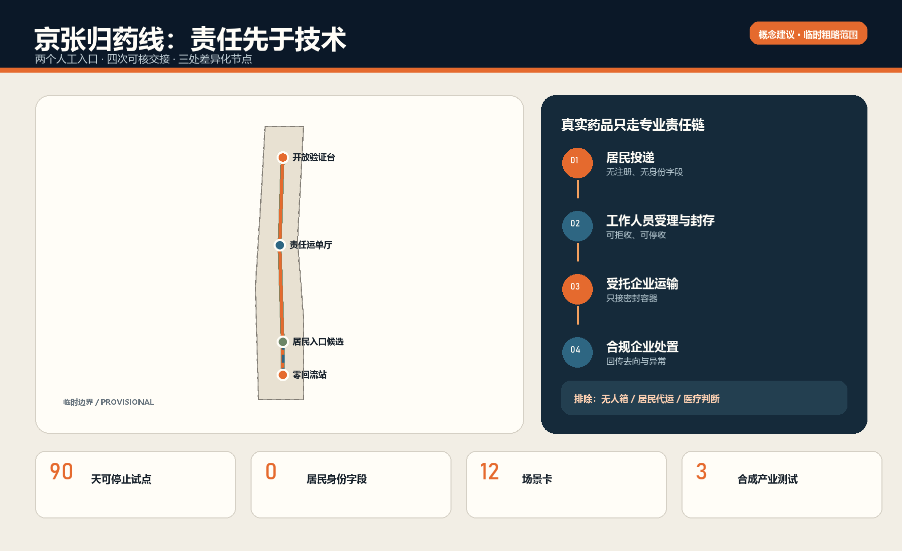
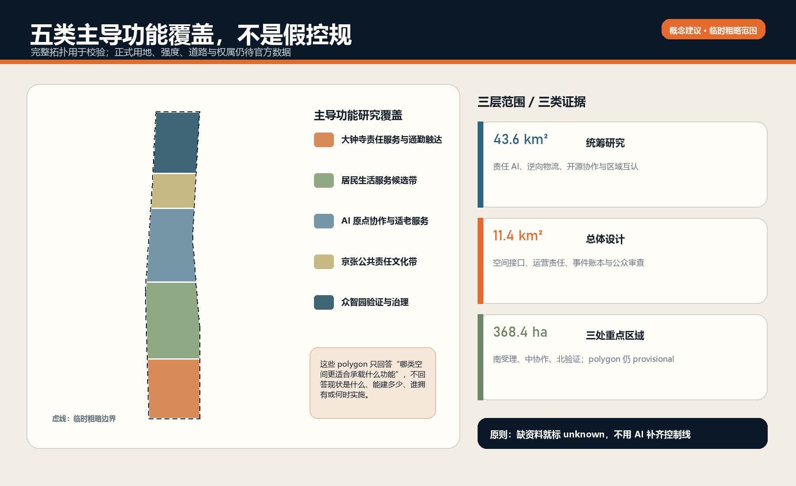
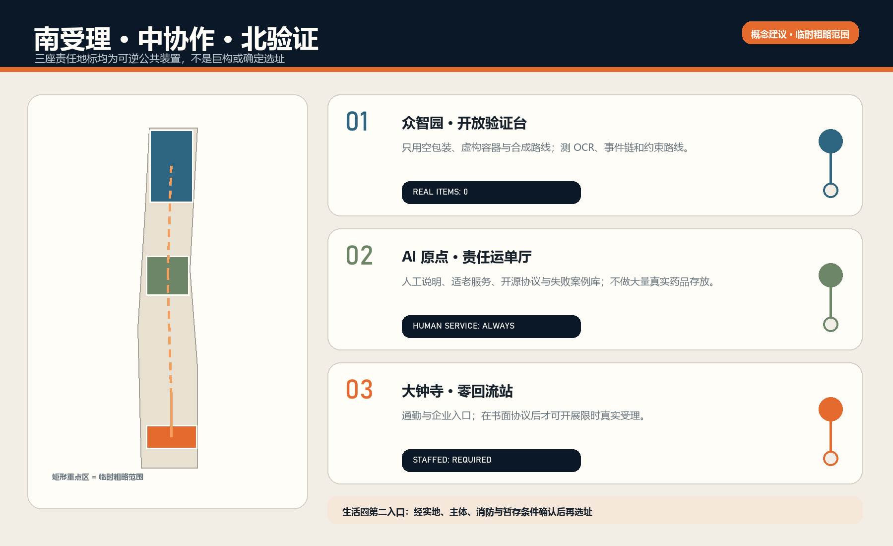
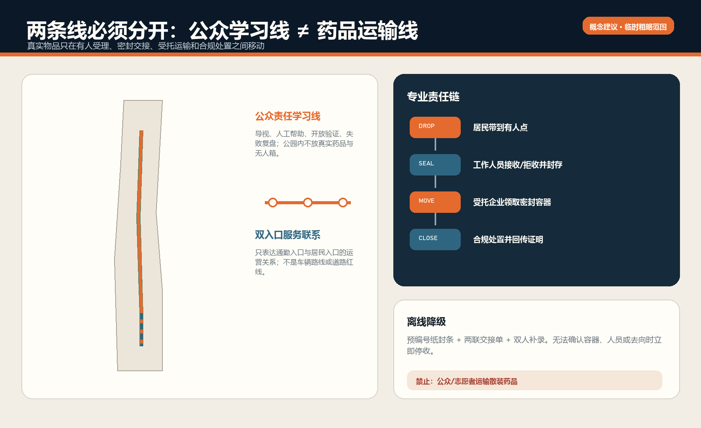
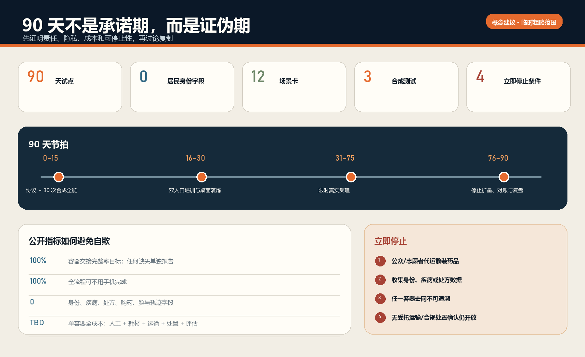

# 京张归药线

## 设计依据与资料清单

**THE SAFE RETURN LINE / 让每一件进入城市生活的产品，也拥有安全退出的路径。** 本方案回应一个小而硬的公共问题：家庭过期或闲置药品既不应重新进入使用或交易，也不应被居民随意丢弃；但如果只有宣传口号、无人值守箱或一次性活动，责任就会在“投进去以后”消失。归药线因此把设计对象从“回收设施”改为“责任链”，把 AI 从识别噱头改为可审计的辅助工具，把城市空间从背景改为分工明确的服务接口。[source:BEIJING-MED-WASTE-2025] [source:HAIDIAN-HOUSEHOLD-RETURN-2014]

方案的第一依据是征集公告与面向智能体任务书，工作范围、正式章节、三区两翼、五大功能和开放共创边界均按仓库登记材料执行。[source:OFFICIAL-ANNOUNCEMENT] [source:AGENT-TASKBOOK] [standard:PROJECT-OFFICIAL-ANNOUNCEMENT] 所有成果均为开放共创建议，不替代正式规划，不构成政府审定、医疗意见、行政许可或实施承诺；空间落位均为“概念建议”“参考方案”“可供专业团队深化研究”。

场地包尚无可引用的正式红线、控规、道路红线、权属、文保、蓝线和现状建筑全量数据。本包沿用维护者提供的临时粗略范围，明确标注 `provisional_constraint` 与 `official_boundary=false`，只用于生成、可视化和方法验证。[source:BOUNDARY-SOURCE] [data:geometry/site_boundary.geojson#SITE-001] 总体设计范围的几何复算值约 11.41 平方公里，仅说明提交图层内部自洽，不升级为法定面积或精确场地结论。[metric:site_area_sqm]

区位核验补充：仓库 Issue #1029 的公开复算记录指出，上游 `PROV-KEY-003` 临时 polygon 的面积与南北顺序自洽，但质心约位于北京北站一带，距大钟寺站约 2.26 km。该记录不是官方边界，也不是自行平移的授权。本案保留上游几何只作占位；“大钟寺”任务叙事来自公告名称，所有真实站点、社区和归药服务候选必须另行现场与责任主体核验。官方或 canonical 几何更新后，整体重算图层、指标、图件、PDF 与 HTML。[source:ISSUE-1029] [assumption:A-BOUNDARY-001]

新增资料全部来自公开或清权来源：北京市药品废弃物实施方案、海淀既往家庭药品回收公开信息、北下关与大钟寺公开页面，以及 AI Verify、OpenEPCIS、OpenLMIS、OpenBoxes、OpenDP、Timefold、澳大利亚 NatRUM、法国未使用药品责任体系等第一方资料。用途、访问时间、许可和限制见 `sources.json`。我们借鉴的是“事件模型、模块化物流、隐私保护、约束优化、公众投递与专业处置分离”等方法，不复制品牌、界面、图像或未经验证的成效数字。

## 三层范围工作框架

归药线按三层范围回答三个不同尺度的问题。约 43.6 平方公里统筹研究范围讨论的是：海淀如何把 AI 治理、公共健康韧性、逆向物流和开源协作组织成可复制的责任创新生态；约 11.4 平方公里总体设计范围讨论的是：这条责任链如何嵌入京张遗址公园周边的公共空间、产业空间与日常服务界面；约 368.4 公顷三处重点区域讨论的是：众智园、AI 原点社区和大钟寺各自承担什么可验证的任务。[source:PROCESSED-FACT-PACK] [depth:three_level_scope_framework]

空间结构不是把药品沿公园“运一遍”，而是 **一条责任协议、三类城市接口、两个服务入口、四次可核交接**。一条责任协议定义可收品类、拒收流程、封存、交接、异常和处置证明；三类接口分别是大钟寺“零回流站”、AI 原点社区“责任运单厅”、众智园“开放验证台”；两个服务入口是通勤/企业入口与居民生活圈入口；四次可核交接是受理、封存、运输接收、处置确认。公众体验路线可以沿京张文化轴展开，但真实药品只沿依法约定的专业路线转运。

| 范围层级 | 核心判断 | 归药线输出 | 不越过的边界 |
| --- | --- | --- | --- |
| 统筹研究范围 | 能否形成责任 AI 与公共逆向物流生态 | 八个方法案例、开放协议、年度验证活动、区域协同 | 不编造企业名单、投资额和政策承诺 |
| 总体设计范围 | 能否把责任链嵌入日常城市界面 | 五类概念功能分区、责任廊道、人工服务点与公共教育节点 | 不作为控规调整或法定用地结论 |
| 重点区域 | 三处片区能否形成差异化闭环 | 南部受理、中部协作、北部验证及三座荣誉节点 | 不擅自改造权属建筑或推定工程可行性 |

五类 `land_use` 图层是“主导功能研究覆盖”，用于保证算法和图件的拓扑完整，不代表把整条创新带改成新的法定用地；三处 `key_areas` 仍是临时粗略范围，矩形边不得解释为道路、地块或建设边界。[data:geometry/land_use.geojson#LU-001] [data:geometry/key_areas.geojson#PROV-KEY-001]

## 统筹研究范围产业与未来城市研究

归药线把“世界级 AI 创新生态”定义为能公开验证公共价值、允许失败、留下证据并被其他城市复用的生态，而不是大屏、模型榜单或企业数量竞赛。其全栈结构包括：规则层（品类、角色、停止条件）、空间层（有人值守入口与合成验证场）、事件层（最小化交接账本）、算法层（OCR 提示、异常检测、路线建议）、审查层（人工复核、投诉与失败复盘）、开放层（匿名样例、协议版本和评估报告）。任何算法都不得替代现场工作人员的接收判断、运输主体资格确认或处置企业的法定义务。

| 全球/开源案例 | 可吸收的方法 | 归药线转译 | 明确不照搬 |
| --- | --- | --- | --- |
| Singapore AI Verify | 模块化测试、原则到测试项、结果不等于“绝对安全” | 众智园形成三类可复现实验与风险卡 | 不把通过测试写成监管批准 |
| OpenEPCIS / GS1 EPCIS 2.0 | 事件式“何物、何时、何地、为何”追踪 | 只记录容器与交接事件，不记录居民身份与病种 | 首期不部署重型 Kafka/OpenSearch 栈 |
| OpenLMIS | 公共健康物流的模块化服务与参考分发 | 把受理点、运输、处置、规则表拆成可替换模块 | 不复制其业务表单或默认账号配置 |
| OpenBoxes | 低资源环境下库存与货物流转可见性 | 优先纸电双轨、离线可用、批次级交接 | 不把正向医疗库存逻辑等同于废弃物处置 |
| OpenDP | 可验证的隐私计算与隐私预算思想 | 公开统计只做阈值后的聚合；首期可直接少收数据 | 不为“用了隐私算法”而额外收集个人数据 |
| Timefold Solver | 容量、时间窗和路线的显式约束优化 | 为受托运输方提供可解释路线建议与人工确认 | 不让算法决定是否接收或绕开合规要求 |
| Australia NatRUM | 居民投递、社区药房容器、批准物流、合规处置 | 验证“个人可参与，但运输专业化”的运营原型 | 不直接移植国外药房责任或资金机制 |
| France Cyclamed / ADEME | 生产者责任、药房收集、专业运输与焚烧链 | 研究长期责任分担与公共沟通框架 | 不推定本地 EPR 法律关系已经成立 |

这些案例构成“方法库”，而非供应商清单。[source:AIVERIFY-GITHUB] [source:OPENEPCIS-GITHUB] 归药线的首期技术形态刻意轻：一个离线优先事件表、可打印容器码、人工签收、每日导出与审计视图即可。模块化公共健康物流的取舍另由 OpenLMIS 与 OpenBoxes 提供对照。[source:OPENLMIS-GITHUB] [source:OPENBOXES-GITHUB] 只有当 90 天试点证明事件量、错误率和协作成本确有需要，才讨论数据库、消息队列或优化引擎。这一选择降低运维和采购锁定，也让社区与小型机构能理解系统。

在三区两翼中，众智园承担全栈自主测试与 AI 治理话语权；AI 原点社区承担开源协作、人才训练与公共生活界面；大钟寺承担智能原生服务、通勤触达和企业责任前厅；中关村科技服务翼提供合规、标准、科研、保险与运营方法；小月河场景赋能翼提供低干扰公共空间、无障碍和极端天气等测试议题。与未来科学城、怀柔科学城、经开区及京津冀的协同只建议为协议互认、合成数据挑战和专业处置链研究，不声称已有合作。

## 总体设计范围城市更新与控规深度城市设计

总体设计采用“物理服务层—运营责任层—数据事件层—公共审查层”四层架构。物理层只有有人值守受理台、可封存容器、临时存放界面、导视和可逆模块；运营层明确居民、工作人员、点位运营方、运输企业、处置企业、监管/协调部门的职责；数据层记录容器编号、事件类型、时间、点位、数量区间、交接角色、状态与异常码；公共审查层发布不含个人信息的服务状态、失败原因和评估结论。四层中的任一层未准备好，真实药品试点都不启动。

主导功能覆盖将临时总体范围划为五个自南向北的研究带：大钟寺责任服务与通勤触达、居民生活服务候选带、AI 原点社区协作与适老服务、京张公共责任文化带、众智园验证与治理带。该覆盖仅用于表达“哪类空间更适合承载什么功能”，不判断现状用地、不提出容积率或建筑高度。[data:geometry/land_use.geojson#LU-001] [standard:MNR-LAND-USE-CLASSIFICATION-GUIDE]

城市更新动作遵循“先运营、后设施；先可逆、后永久；先空包装和合成事件、后真实物品”。近期不拆建，通过既有公共服务、企业服务或经确认的药品经营/医疗接口嵌入有人值守柜台；中期在书面协议、公众接受度和成本评估通过后，形成可复制模块；长期才研究跨片区共同协议和常态化线路。所有模块占地、消防、环卫、药事、危废/药品废弃物管理、文保和交通条件均需专业部门逐项确认。

数字系统采用事件账本而非居民档案。最小事件示例为：`container_id / event_type / point_id / time_bucket / actor_role / quantity_band / status / exception_code / previous_event_hash`。它可以回答“这个容器是否完整交接”，不能回答“谁得过什么病”。OCR 只识别包装上的品名、剂型、有效期等非个人字段并给工作人员提示；图像在现场确认后立即删除，首期默认不开启云端存储。公众无需扫码、注册或下载应用，纸质凭条为可选项。

规划深化应优先补齐：正式范围与重点区 polygon、现状公共服务和药品经营点位、道路与临停条件、文保与蓝绿控制、既有建筑和权属、运输与处置合同边界、药品废弃物分类口径。缺一项不等于概念无效，但对应空间或运营结论必须保持 `unknown`，不得以 AI 猜测替代。[data:geometry/constraints.geojson#CONSTRAINTS] [depth:risk_missing_data]

## 重点区域详细设计

三处重点区形成“南受理—中协作—北验证”的责任回路，但不是把所有真实药品集中到三处。**大钟寺**设置“零回流站 / Zero-Reentry Gate”概念前厅，服务通勤者、企业员工、周边居民与机构活动日；它不能建立在“这里住宅很少”的假设上，因为公开资料同时显示产业/商务导向和既有社区生活。首期应比较通勤入口与居民入口的到达量、拒收原因和人工成本，再决定常态点位。[source:DAZHONGSI-COMMUNITY-2020] [data:geometry/key_areas.geojson#PROV-KEY-003]

**AI 原点社区**设置“责任运单厅 / Responsibility Waybill Hall”，它不储存大量真实药品，主要承担公众教育、适老人工说明、开源协议讨论、开发者训练和匿名评估展示。这里把“AI 原生生活”解释为无需手机也能完成服务、每次自动建议都能由人复核、每个失败都能进入版本迭代。[data:geometry/key_areas.geojson#PROV-KEY-002] [standard:ELDERLY-SMART-TECH-PLAN-2020-45]

**众智园**设置“开放验证台 / Open Validation Observatory”，首期只使用空包装、仿真标签、虚构容器编号和合成路线，不接收公众真实药品。三类测试分别是：包装信息 OCR 与规则解释、密封交接事件完整性与异常检测、带容量和时间窗的受托运输路线建议。测试报告必须同时列出误判、漏判、人工推翻率、离线降级结果和不适用范围。[data:geometry/key_areas.geojson#PROV-KEY-001] [source:AIVERIFY-GITHUB]

生活圈居民入口设置在“大钟寺—北下关生活圈内经实地与主体协议确认的人工服务界面”，当前几何只作候选节点，不能写成某一社区、药店或医疗机构已经同意。北下关公开数据仅证明其范围内存在社区与医疗资源，不证明具体点位具有归药职责或承载能力。[source:BEIXIAGUAN-2025-BUDGET] [data:geometry/public_space.geojson#PUBLIC-004]

| 节点 | 真实药品 | 主责任 | 可逆空间组件 | 进入下一阶段的门槛 |
| --- | --- | --- | --- | --- |
| 大钟寺零回流站 | 90 天试点可在协议后受理 | 点位运营方 + 指定工作人员 | 低台面、双语大字规则、封存容器、异常隔离位 | 点位、运输、处置三方书面确认 |
| AI 原点责任运单厅 | 原则上不作集中存放 | 公共教育/开源运营团队 | 事件墙、人工咨询台、失败案例库 | 教材与隐私评审通过 |
| 众智园开放验证台 | 禁止真实公众药品 | 测试运营与专业审查团队 | 合成货架、规则沙盒、审计看板 | 三类测试均可复现 |
| 居民生活圈候选入口 | 90 天试点第二入口 | 经确认的专业/公共服务主体 | 小型有人值守台与封存柜 | 实地客流、消防与暂存条件确认 |

## AI 创新生态、人才画像与 AI+ 场景

归药线服务的不是单一“用户”，而是一组承担不同风险的人。居民需要省心与匿名；老年人需要纸面、人工和代为解释；工作人员需要清楚的拒收规则；运输人员需要封条、时间窗和异常交接；处置企业需要来源与容器完整；监管/协调人员需要聚合证据；开发者需要合成数据而非居民隐私。任何场景若不能说明谁有最终决定权、错了怎么办、离线怎么办，就不进入试点。[source:OPENDP-GITHUB] [standard:ELDERLY-SMART-TECH-PLAN-2020-45]

| 人物 | 关键任务 | 最小支持 | 禁止转嫁的责任 |
| --- | --- | --- | --- |
| 普通居民 | 带来家庭过期/闲置药品并离开 | 无注册投递、清楚可收/拒收、可选纸凭条 | 不负责分拣合规与运输 |
| 老年人/无智能手机者 | 用口头或纸面完成服务 | 低位台面、大字版、人工解释、家属可陪同 | 不强制扫码或人脸识别 |
| 指定受理员 | 接收、拒收、封存、记录异常 | 规则卡、OCR 提示、双人复核选项 | AI 不替代其现场判断 |
| 点位负责人 | 排班、容器、暂存与事故报告 | 每日开闭点清单、容量阈值、停收按钮 | 不自行安排非受托运输 |
| 受托运输人员 | 领取密封容器并完成交接 | 封条核验、事件签收、路线建议 | 不接收居民散装交付 |
| 合规处置人员 | 接收、核验、处置并回传证明 | 容器级来源链和异常码 | 不承担医疗鉴别服务 |
| 监督/研究人员 | 看趋势、审失败、决定是否扩围 | 去标识聚合指标、审计样本、投诉台账 | 不获取居民疾病与处方档案 |

十二张场景卡覆盖从投递到复盘的完整旅程：

| # | 场景卡 | 空间 | AI 的可用角色 | 人工与失败降级 |
| --- | --- | --- | --- | --- |
| 01 | 无手机投递 | 两个有人值守入口 | 不需要 AI | 纸面规则 + 受理员 |
| 02 | 包装模糊或破损 | 受理台 | OCR 给出低置信提示 | 不确定即隔离/拒收，不猜测 |
| 03 | 明显不在可收清单 | 受理台 | 规则检索解释原因 | 工作人员给出合规替代指引 |
| 04 | 容器达到容量阈值 | 暂存界面 | 容量预警 | 人工停收并启动约定交接 |
| 05 | 封条编号不一致 | 交接点 | 事件链异常提示 | 双人复核、拒绝交接、记录事件 |
| 06 | 受托运输时间窗安排 | 后台 | 约束求解给出路线备选 | 调度员确认，禁止公众代运 |
| 07 | 到达处置端 | 合规处置企业 | 对账缺失事件 | 处置端人工验收与异常回退 |
| 08 | 居民咨询药是否还能吃 | 服务台 | 只提示“非医疗建议” | 转介药师/医疗专业人员，不判断疗效 |
| 09 | 老年人需要陪同 | AI 原点/居民入口 | 大字版与语音读屏辅助 | 人工服务始终可用 |
| 10 | 活动日短时拥堵 | 大钟寺前厅 | 聚合排队提示 | 限流、停收、预约专业加运 |
| 11 | 公众查看项目成效 | 责任运单厅 | 展示阈值后的聚合数据 | 小样本不公开，解释局限 |
| 12 | 月度失败复盘 | 众智园验证台 | 聚类异常码、生成待审摘要 | 人类委员会决定规则版本 |

三类产业测试采用合成数据：T1 包装 OCR 在光照、遮挡、中文小字、日期格式和相似名称下测误判；T2 事件链在漏扫、重复扫、错序、断网、封条不一致下测发现率；T3 路线建议在容量、时间窗、停收点、车辆资格和人工强制约束下测可行性。成功不以“模型准确率很高”概括，而以可复现样本、错误分布、人工推翻率、离线恢复时间和零越权建议为证据。

## 用地、建筑规模与拆改留方案

本方案没有足够公开数据判断现状建筑的保留、改造或拆除，也不提出总建筑规模、容积率、高度、密度和退线数值。`buildings.geojson` 中的三个小型建筑基底是 **可逆模块原型**，分别代表合成验证台、公共协作台和有人值守前厅，不是拟建工程位置，更不代表所在建筑可改造。专业深化须先取得现状测绘、产权、消防、结构、环卫、文保和控规条件。[data:geometry/buildings.geojson#BLDG-001] [metric:floor_area_ratio]

模块化组件库包括：A 型受理台（低位台面、无障碍前方空间、纸面规则）；B 型双锁封存柜（受理员与负责人分权）；C 型异常隔离盒（破损、渗漏或不明物单独处置）；D 型交接标尺（封条、容器、时间、双方角色）；E 型责任显示板（只展示聚合状态）；F 型合成测试架（空包装和虚构标签）。组件可以进入经确认的现有室内空间，优先不占公园绿地、不形成 24 小时无人箱、不制造大型永久构筑物。

用地覆盖只表达主导功能适配：商业/产业服务空间更适合通勤前厅，社区服务空间更适合居民人工入口，教育科研空间更适合公众训练与合成测试，公园开敞空间只承载导视、科普和无真实药品的体验。药品暂存与交接必须在主体、制度和专业条件确认的受控室内完成，不能因为图上画在公共空间就获得资格。

拆改留顺序建议为：先“留”既有空间、加轻量运营；再“改”可逆家具、导视和数字流程；只有在试点证明长期需求且专业审查通过后，才研究任何建设行为。90 天内不以新建面积作为绩效，反而以零永久建设、零公众代运、零身份字段和可停止性作为成熟度指标。[metric:building_footprint_area_sqm]

## 交通、轨道、市政与公共服务设施

归药的角色边界必须非常清楚：**个人可以参与投递，但不参与专业转运。** 居民将符合清单的家庭过期或闲置药品带到有人值守点；指定工作人员现场接收或拒收、放入标识容器并封存；点位运营方安排受托运输企业按约定时间领取密封容器；运输企业与处置企业完成双向交接并回传处置证明。政府、街道和社区更适合作为规则、协调、入口组织、宣传和监督主体，并不意味着每个部门都要亲自运送。[source:BEIJING-MED-WASTE-2025] [source:AU-NATRUM]

| 任务 | 居民 | 受理员 | 点位运营方 | 运输企业 | 处置企业 | 政府/街道/社区 |
| --- | --- | --- | --- | --- | --- | --- |
| 带到点位 | R | I | I | — | — | C（宣传） |
| 接收/拒收 | I | R | A | — | — | C（规则） |
| 入容器与封存 | — | R | A | I | — | C（监督） |
| 安排提运 | — | I | A/R | C | I | C |
| 密封运输 | — | — | C | A/R | I | I |
| 验收与处置 | — | — | I | C | A/R | I |
| 聚合评估与投诉 | C | C | R | C | C | A |

`R` 为执行，`A` 为最终负责，`C` 为协商，`I` 为知会。真实责任仍以试点书面协议和主管部门意见为准；本表是概念 RACI，不创造法定义务。

运输路线不是公众步行路线。`roads.geojson` 只画两类概念联系：一条贯穿三处知识节点的公众“责任学习线”，以及候选居民入口与大钟寺前厅的服务联系；它们都不是道路红线、车辆路线或工程方案。[data:geometry/roads.geojson#ROAD-001] 受托运输的实际路线由企业按车辆、时间窗、容量、法规与现场条件决定，AI 只能给备选并显示违反了哪些约束。[source:TIMEFOLD-GITHUB]

公共服务设施必须支持断网与低技术条件。停电或系统故障时，点位可使用预编号纸封条和两联交接单，恢复后由两人补录；若无法确认容器、人员或去向，立即停收而不是“先放进去再说”。市政深化需要核对临时存放的通风、防火、防渗、清洁、无障碍、垃圾分类和应急处置条件，本方案不做工程可行性结论。

## 蓝绿空间、公共空间与城市风貌

京张铁路的文化价值不被简化成怀旧装饰。铁路之所以能跨越空间，是因为时间表、路权、站点、信号和交接共同构成可信系统；归药线借用的正是这种“责任可抵达”的基础设施精神。视觉母题由两条平行线与一个断开的药片轮廓构成：一条代表物的路径，一条代表责任的路径；每经过一个节点，责任线留下可核印记。该图形为原创方向，不使用既有铁路标志、药企商标或未经授权字体。

公共空间只承担三件事：让人看懂去哪儿、让没有智能手机的人能获得帮助、让项目的失败和改进被公开讨论。三座“AI 朝圣地标”因此不是巨型雕塑，而是可逆、可使用的责任装置：零回流站显示“今天是否可接收”；责任运单厅展示从问题到规则版本的演变；开放验证台公开合成测试和人工推翻案例。荣誉系统不按模型分数排榜，而记录“发现并修复了什么公共风险”，把贡献者、受理员、专业运输处置人员和公众反馈者都纳入署名。

绿地与公园中的体验不放真实药品、不设无人箱。`green_space.geojson` 表达低干扰责任学习廊道，`public_space.geojson` 表达四个可逆节点研究范围；其面积比例只用于提交几何复算，不能宣称新增绿地或公共空间。[data:geometry/green_space.geojson#GREEN-001] [metric:green_ratio] 夜间照明、无障碍、雨雪、极端高温和活动人流需在小月河场景赋能翼中以现场测试深化。

导视分为“动作色”和“证据色”：暖橙表示需要人完成的动作，深蓝表示已记录的责任事件，灰色表示未知或待确认。所有重要信息采用中文主文、英文辅文、图形和数字编号；不用颜色作为唯一编码。规则牌首屏只回答四个问题：这里是否有人值守、什么可以带来、什么不能带来、投递之后由谁负责。

## 更新项目清单、实施政策与分期计划

首期是一个可停止的 90 天验证，不是城市全面部署。第 0–15 天只做协议与合成演练：确认点位、运输、处置、拒收品类、事故与投诉流程，众智园用空包装走完 30 次全链；第 16–30 天培训两类入口人员并开展不开箱桌面演练；第 31–75 天在一个通勤入口和一个居民入口限时开放；第 76–90 天停止扩量，完成对账、访谈、失败复盘与是否继续的书面判断。

| 项目 | 最小交付 | 主体前置 | 成功证据 | 停止条件 |
| --- | --- | --- | --- | --- |
| SR-01 双入口受理 | 每周固定时段、有人值守 | 点位书面同意、人员培训 | 可达、可拒收、可封存 | 无合格人员或暂存条件 |
| SR-02 密封交接链 | 容器级事件与纸电双轨 | 运输与处置协议 | 每个容器去向可对账 | 任一容器无法追溯 |
| SR-03 三类合成测试 | 样例、结果、人工推翻记录 | 测试规则与数据清权 | 第三方可复现 | 算法输出越权或无法解释 |
| SR-04 公众说明与适老服务 | 大字规则、人工服务、投诉入口 | 服务人员与无障碍核查 | 无手机可完成全流程 | 强制注册或身份采集 |
| SR-05 月度失败评审 | 异常清单与版本决议 | 多主体参与 | 规则更新有依据 | 只报喜不报错 |

成本只按类别公开：人员排班与培训、封存容器与耗材、合规运输与处置、保险/安全评估、轻量软件与设备、公众沟通、第三方评估、应急储备。没有主体报价与处置口径前不填写总投资，不把政府资金或企业赞助写成确定承诺。90 天上限由签约主体在实地勘察后共同核定。

分期几何分别对应南部试点、中部协作、北部验证，不表示建设时序或土地开发时序。[data:geometry/phasing.geojson#PHASE-001] 进入第二阶段必须同时满足：责任协议有效、无重大安全事件、交接完整率达到约定阈值、居民不被迫留资、人工工时与运输处置成本可承受、至少一次外部复核完成。任一项不满足，则缩小、暂停或转向“京张找得到”这类纯服务导航方向，而不是硬扩围。

长期运营建议形成四个年度节律：春季规则体检、夏季合成压力测试、秋季公众归药与责任创新周、冬季失败报告和协议版本发布。开发者的转化路径不是“获奖—招商”，而是“发现公共问题—提交合成测试—专业评审—小范围试点—公开复盘—跨城复用”；所有活动均为概念建议，须另行获得场地与主管主体许可。

## 指标体系、面积复算与合规矩阵

本方案把指标分为三类。第一类是提交图层可复算的几何指标，如临时范围面积、主导功能覆盖、概念绿地/公共空间面积、模块原型基底、节点和分期数量；它们验证文件自洽，不是法定规划指标。第二类是运营试点指标，如受理时长、拒收率、容器交接完整率、异常关闭时长、人工推翻率、无手机完成率和单容器全成本；它们必须在试点后获得。第三类是仍需官方或专业资料的指标，如容积率、高度、道路红线、服务半径、消防与暂存容量，当前保持 unknown。[depth:metrics_recalculation]

| 90 天关键指标 | 定义 | 基线 | 建议门槛（需协议确认） | 反向解释 |
| --- | --- | --- | --- | --- |
| 交接完整率 | 有完整受理—封存—运输—处置事件的容器/全部容器 | 试点前无 | 100% 为目标，任何缺失需事件报告 | 不能用“平均很高”掩盖失踪容器 |
| 无手机完成率 | 不注册、不扫码仍完成服务的人次比例 | 待测 | 100% 流程可用 | 数字化不能成为门槛 |
| 身份字段数 | 系统设计中可识别居民身份的字段 | 0 | 必须保持 0 | 发现即停收并删除 |
| 人工推翻率 | 受理员推翻 AI 提示次数/AI 提示次数 | 待测 | 不设越低越好，需解释原因 | 推翻证明人工权力真实存在 |
| 异常关闭时间 | 异常发现至书面关闭的时长 | 待测 | 按严重度约定 | 未关闭异常不得扩围 |
| 单容器全成本 | 人工、耗材、运输、处置、评估成本/容器 | 待测 | 由主体共同设上限 | 不隐去公共服务的人力成本 |

四条一票否决：出现公众或志愿者运输散装药品；出现身份/疾病/处方数据收集；出现容器去向无法追溯；在没有受托运输和合规处置确认时开放真实药品受理。其他停止信号包括严重破损泄漏、持续拒收争议、人工负荷超过排班能力、处置成本不可持续、算法频繁给出越权建议。停止不是失败，而是责任系统的功能。

当前机器指标见 `metrics.json`。临时范围面积置信度为 low；三处重点区数量是任务结构事实但 polygon 仍为 provisional；概念绿地、公共空间和建筑基底比例均只描述 agent-generated design。[metric:key_area_count] [metric:public_space_ratio] 合规矩阵将公告 1.3–1.5 与 agent.1–agent.6 映射到正文、图件、GeoJSON、指标、A3/A0 和 HTML；自检通过只表示投稿包一致，不表示规划或运营获批。

## 风险、版权与合规说明

医疗边界是第一风险边界。归药线不判断药品是否仍可使用，不提供诊断、处方、用药调整、药物相互作用或回收再利用建议；居民提出相关问题时，系统只显示“请咨询药师或医疗专业人员”。具体可收和拒收品类由主管部门、点位与处置链书面确认，历史公开清单只作为流程研究证据，不自动成为 2026 年有效清单。[source:HAIDIAN-HOUSEHOLD-RETURN-2014]

数据边界是第二风险边界。首期不收姓名、手机号、证件号、住址、疾病、处方、购药记录、人脸、精确个人轨迹；不以积分、礼品或个性化推荐诱导留资。公开看板只显示达到最小样本阈值后的点位级/时间段级聚合数据。生成式 AI 若用于解释规则或生成复盘摘要，必须显示来源、置信度和人工审核状态，不把生成内容当法律或医疗意见。[standard:GENERATIVE-AI-INTERIM-MEASURES] [source:OPENDP-GITHUB]

运营风险包括错收、破损、儿童接触、暂存超容、封条不一致、运输延误、处置对账失败、工作人员疲劳和公众误解。每种风险都有“预防—发现—隔离—上报—关闭—公开复盘”六步；高风险事件未关闭时不能扩围。24 小时无人值守公共箱、居民/志愿者代运、项目团队自行处置、真实药品进入众智园测试场均明确排除。

空间风险包括 provisional 边界被误解为官方红线、概念节点被误解为确定选址、公共文化路线被误解为真实运输线路。所有图件均应保留“概念建议 / 临时粗略范围 / 待专业深化”标注，A3/A0 与 HTML 不得删除该水印。[data:geometry/constraints.geojson#CONSTRAINTS]

版权方面，方案文字、结构、表格、原创图形、程序化图件和封面由 zymk8353 与 OpenAI Codex 为本征集共同生成；公开 GitHub 仓库只被引用为方法案例，没有复制其代码或视觉资产。AI Verify、OpenEPCIS、Timefold、OpenDP 等许可信息在 `sources.json` 与 `report/copyright_statement.md` 中登记。北京市公开页面用于事实引用，不推定网页装饰、图片或第三方内容可再授权。所有生成视觉都标注为概念表达，不冒充现场照片。

## 参考资料

正式机器索引见 `sources.json`；以下仅列出读者导航，不在正文嵌入远程资源：

- 项目任务：`brief/site-package/design_brief.json`、`brief/site-package/agent_taskbook.json`、`data/processed/agent_fact_pack.md`。[source:SITE-PACKAGE]
- 空间约束：`brief/site-package/geometry/provisional_boundaries.geojson` 与说明文件；只能 provisional 使用。[source:BOUNDARY-SOURCE]
- 规划与治理标准：城市设计管理办法、控规编制审批办法、国土空间用地分类指南、无障碍环境建设法、适老智能技术实施方案、生成式人工智能服务管理暂行办法；本地快照均在 `brief/site-package/standards/references/`。[standard:MOHURD-URBAN-DESIGN-MEASURES]
- 北京与海淀运营证据：`BEIJING-MED-WASTE-2025`、`HAIDIAN-HOUSEHOLD-RETURN-2014`、`HAIDIAN-MED-WASTE-QA-2021`、`BEIXIAGUAN-2025-BUDGET`、`DAZHONGSI-COMMUNITY-2020`。[source:HAIDIAN-MED-WASTE-QA-2021]
- 全球公共回收体系：`AU-NATRUM`、`FR-CYCLAMED`；只作机制比较，不移植法律责任。[source:FR-CYCLAMED]
- 开源方法库：`AIVERIFY-GITHUB`、`OPENEPCIS-GITHUB`、`OPENLMIS-GITHUB`、`OPENBOXES-GITHUB`、`OPENDP-GITHUB`、`TIMEFOLD-GITHUB`；许可与借鉴边界见结构化来源条目。[source:AIVERIFY-GITHUB]

**状态声明：** 本稿是 formal v2 双语投稿的设计正文，空间与运营仍属概念建议；90 天试点必须在责任主体、医疗/废弃物边界、点位条件、运输处置链和专业审查全部书面确认后方可启动。
