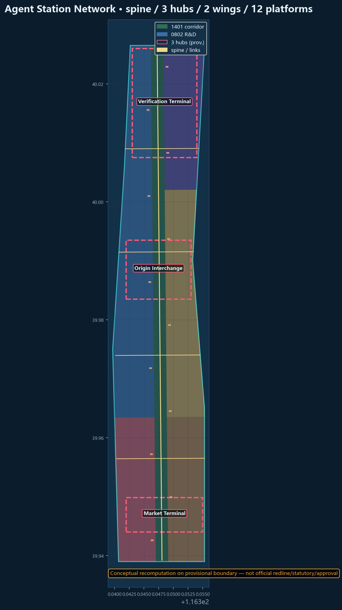
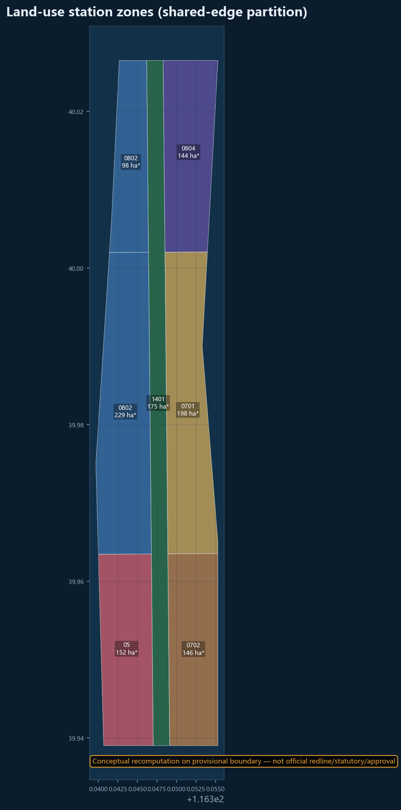
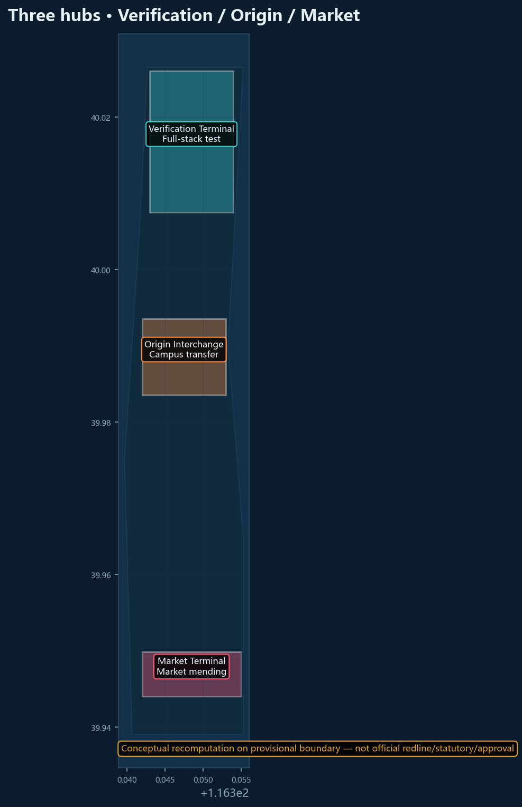
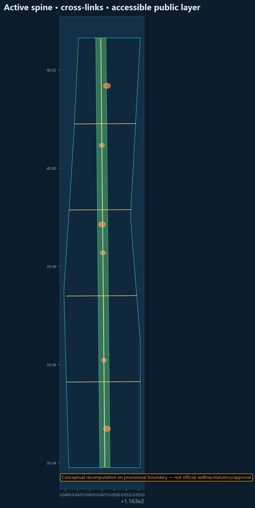
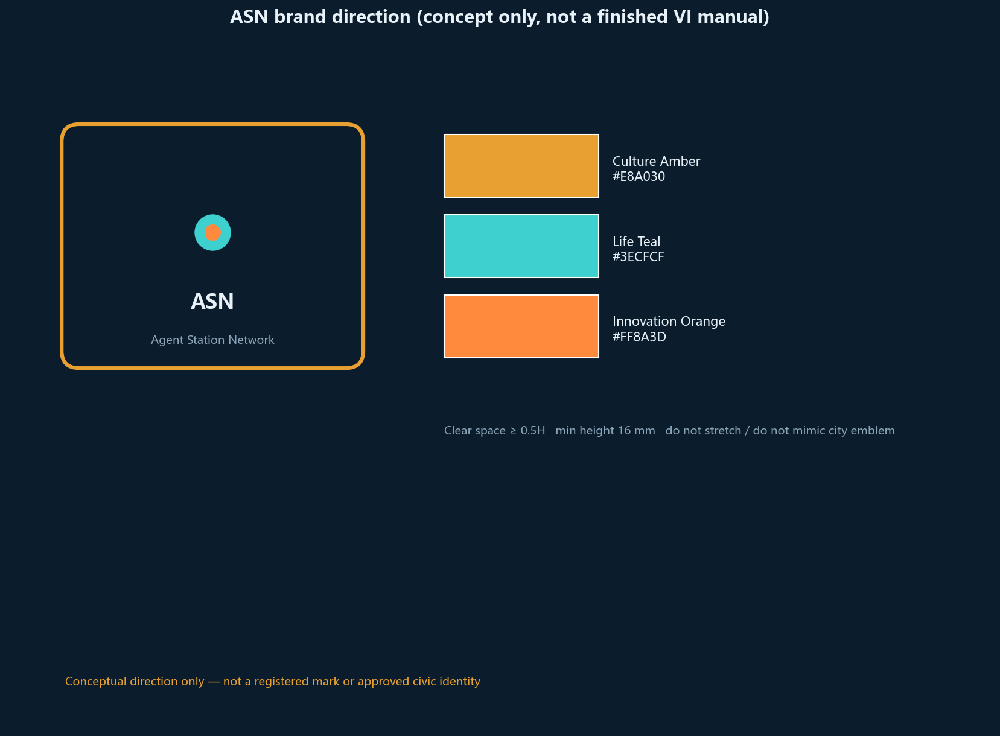
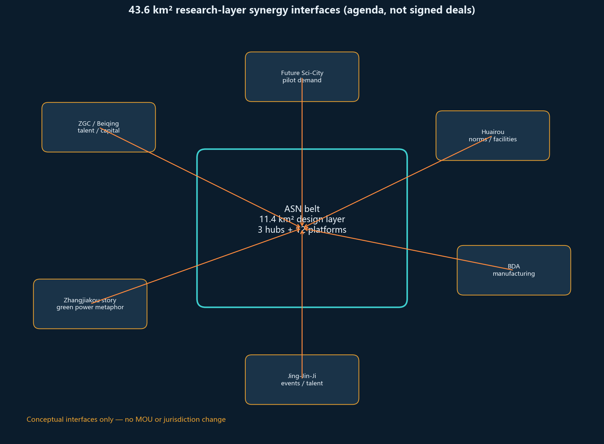
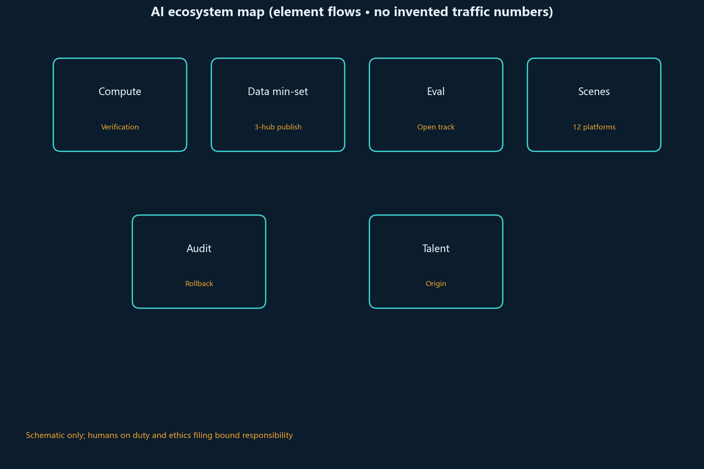
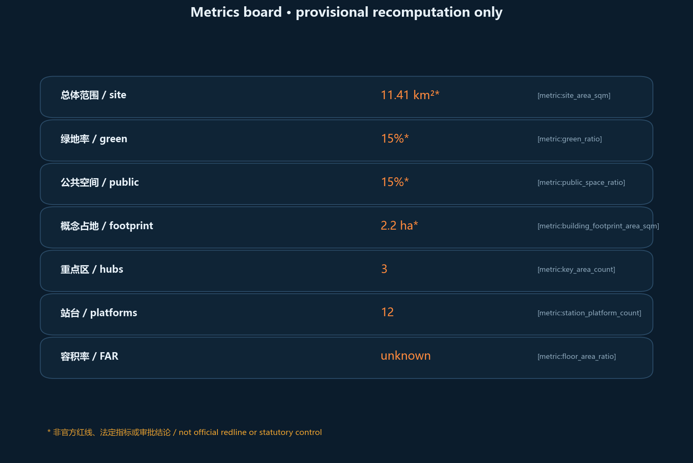

# Agent Station Network: A Multi-Agent Transfer Urban Design for the Jing-Zhang AI Belt

## Design basis and source inventory

This package responds to the Haidian open call for the Centennial Jing-Zhang AI Innovation Belt. It relies on the public announcement, the agent taskbook, the site package, and formal-ready rows in `data/source_registry.json`. Provisional boundaries are used only for generation, display, and intake checks—never as an official redline [source:OFFICIAL-ANNOUNCEMENT] [source:AGENT-TASKBOOK] [source:SOURCE-REGISTRY].

Complete source, standard, and task coverage lives in the JSON matrices. Prose keeps only claim-adjacent anchors [depth:existing_conditions_diagnosis] [data:geometry/site_boundary.geojson#SITE-001].

## Three-level scope framework

The coordinated research area (~43.6 km²) holds industry and future-city strategy. The overall design area (~11.4 km²) is represented with provisional geometry (recomputed ≈ 11.413 km²) [metric:site_area_sqm]. The three key areas are reinterpreted as hubs: Verification Terminal, Origin Interchange, and Market Terminal [data:geometry/key_areas.geojson].

## Coordinated research: industry and future city

**Agent Station Network** treats public AI services as timed trains: published, boardable, transferable, auditable, and reversible. The naming system uses Hub / Platform / Service Train / Boarding Compact. The three positionings map to the heritage spine, daily-life platforms, and innovation hubs; the five functions are organized by the same station protocol [source:AGENT-TASKBOOK] [depth:overall_spatial_structure].

Eight global references (Barcelona Superblocks [source:CASE-BARCELONA-SUPERBLOCKS], Singapore Smart Nation, the Sidewalk Toronto cautionary case, Kalasatama, Seoul DMC, UnternehmerTUM, X-Road, Takeshiba) are translated into station rules rather than copied forms [standard:PROJECT-AGENT-OPEN-CALL-TASKBOOK].

## Overall design area at regulatory urban-design depth

One heritage spine, three hubs, two wings (Zhongguancun service wing and Xiaoyuehe scenario wing), and twelve lightweight platforms structure the corridor [data:geometry/buildings.geojson#BLD-PLAT-01]. Renewal prefers reversible interfaces over mass demolition. FAR remains unknown without official controls [metric:floor_area_ratio] [standard:MOHURD-URBAN-DESIGN-MEASURES].

## Detailed design of key areas

### Zhongzhiyuan Verification Terminal

Role: origin/terminus technical hub for full-stack testing and governance discourse. Spatial diagram: test track (east) + open-source hall (center) + waterside cool-down (west). Industry pilots: public model evaluation, mixed-traffic robot segment, privacy/compliance sandbox. Deepening trigger = park-segment permission + evaluation ethics filing. Still conceptual [data:geometry/key_areas.geojson].

### Origin Interchange

Role: transfer hall among campus, community, and builders. Spatial diagram: quiet co-translation court (inner) + conversion street (frontage) + night study platform (south). Linked to education land (0804). Deepening trigger = joint campus-street duty protocol (to be confirmed).

### Market Terminal

Role: intelligent retail/service market hub. Spatial diagram: four quadrants of retail / service / exhibition / flexible work. East–west mending links reconnect daily paths cut by the historic rail. Deepening trigger = voluntary merchant opt-in with exit rights [depth:three_key_area_detailed_design].

### Three-hub mini-plans (concept zones)

- **Verification**: test track + open hall + cool-down; interface to the active spine.
- **Origin**: quiet court + conversion street + night platform; interface to education land.
- **Market**: four-quadrant hall; cross-links to living sides.

## AI ecosystem, personas, and AI+ scenarios

Personas: residents, students, developers, small merchants, street-level coordinators. Twelve scenario cards use the same fields—users / min-data / human veto / rollback / ethics / pass-fail—and stay conceptual pending ethics and legal review [source:AGENT-TASKBOOK].

**S01 Active-mobility conflict alert** (spine): anonymous local fragments; duty staff can mute; not for punishment; nuisance false alarms take it offline.  
**S02 Platform accessibility wayfinding** (12 platforms): offline map pack; human inquiry fallback; no mandatory biometrics; misleading audio is taken down.  
**S03 Elder companion scheduling** (Origin): slot + companion phone; human desk; no medical records; complaint threshold stops new bookings.  
**S04 Shop inventory / last-meter delivery** (Market): SKU + pickup window; merchant exit anytime; no customer-list sharing; forced onboarding kills the pilot.  
**S05 Open model-evaluation track** (Verification): model hash + public metrics; committee delist; no personal-data sets; unreproducible entries go.  
**S06 Shared campus lab booking** (Origin east wing): hashed student ID + slot; manager lockout; grades isolated; scalping returns to paper roster.  
**S07 Event crowd resilience** (corridor nodes): section counts only; public-safety plans first; no individual tracking; daily-life disruption cancels event-day algorithms.  
**S08 Heritage interpretation agents** (green corridor): exhibit text; one-tap mute; no face capture; nuisance defaults the system off.  
**S09 SME compliance assistant** (Market deck): public-rule Q&A; does not replace a lawyer; disclaimer always on; treated-as-legal-advice takes it down.  
**S10 Hackathon trains** (Verification): signup email + license; host stop; voluntary copyright filing; nuisance or infringement stops the season.  
**S11 Rain / thermal-comfort** (green corridor): switch-off sensors; shade without sensing; no private interiors; complaints remove the pole.  
**S12 Public-art workshop** (P07–P09): artwork files + credit; curator takedown; no passer-by scraping; infringement closes the workshop.

## Land use, building scale, and retain/renovate/demolish strategy

Land use is partitioned in EPSG:4548 with shared edges [data:geometry/land_use.geojson] [metric:green_ratio]. Concept footprints total about 2.24 ha [metric:building_footprint_area_sqm]. No parcel-level demolition verdict is claimed.

## Transport, rail, utilities, public facilities

The mobility framework uses a central active spine plus east–west transfer links so pedestrians, cyclists, and low-speed service vehicles can move between three hubs and twelve platforms without rewriting city expressway redlines [data:geometry/roads.geojson#RD-SPINE] [data:geometry/roads.geojson#RD-X01]. The spine carries north–south continuity and heritage walking; the cross links mend east–west daily life severed by the historic rail cut. Rail is treated as an information-transfer and last-mile interface at the hubs, not as an approved station reconstruction. Modular utilities favor sensors that can be switched off, platform power, and open-data cabinets. Public services at platforms support elder care scheduling, night-safe student routes, and shared merchant logistics, tied to the public-space ratio [metric:public_space_ratio]. Missing official road/rail/utility controls keep these moves conceptual for professional deepening [source:SOURCE-REGISTRY] [depth:traffic_rail_slow_parking].

## Blue-green space, public space, character

Green ratio and public-space ratio are recomputed on provisional geometry. Public-space accounting = **accessible heritage-corridor layer + three plazas + corridor nodes** [metric:green_ratio] [metric:public_space_ratio]. Pilgrimage landmarks: Verification Clocktower, Origin Transfer Ring, Market Bell—conceptual narrative nodes [depth:blue_green_public_space].

## Projects, policy hints, phasing

Near term: three-hub opening package and spine continuity. Medium term: twelve platforms and wing interfaces. Long term: global timetable operations. Annual program: spring pilgrimage week, summer junior station-master camp, autumn evaluation cup, winter governance roundtable.

## Indicator system, area recomputation, and compliance matrix

> Area and ratio figures below are **conceptual recomputation on a provisional boundary**, not official redlines, statutory indicators, or approvals; recompute the full package when official polygons arrive.

Known metrics are recomputed from this package’s GeoJSON in EPSG:4548; unknowns stay explicit. Matrices cover announcement tasks and agent.1–6. Official polygons are not yet available; current geometry is only for concept generation, display, and content review, and the full package must be recomputed when formal data arrives. Eligibility, scoring, acceptance, publication, and merge are decided by maintainers through trusted validation; this proposal does not prejudge those outcomes [metric:site_area_sqm] [depth:metrics_recalculation].

## Brand and logo direction (agent.1)

Primary name: **Agent Station Network** (ZH: 京张站场网). Motif: rounded railway station board × multi-agent node.

| Element | Direction | To be deepened professionally |
|---------|-----------|-------------------------------|
| Mark | Rounded board + central transfer node | Vector logo, clear space, min size |
| Color | Amber / teal / orange service lines | Exact values, contrast, a11y checks |
| Type | Sans display + timetable-like Latin | Open-licensed font substitution |
| Don'ts | No confusion with city emblems; no approval implication | Don't sheet |
| Bilingual lockups | ZH over EN or split board | Combination rules |

This package states direction only; it does **not** claim a finished VI manual. [source:AGENT-TASKBOOK]

## Regional synergy interfaces (conceptual, not signed deals)

| Interface | Flows (concept) | Local landing |
|-----------|-----------------|---------------|
| Zhongguancun / Beiqing corridor | Talent, capital, IP | Service wing transfer |
| Future Science City | Pilot demand | Verification test-track booking |
| Huairou Science City | Large facilities / data norms | Open evaluation track interface |
| BDA | Manufacturing scenarios | Market terminal business deck |
| Zhangjiakou direction (narrative) | Green power / compute story | Two-way timetable metaphor only |
| Jing-Jin-Ji innovation links | Events and talent exchange | Pilgrimage week international unit |

These are an **agenda list**, not executed MOUs. [depth:three_level_scope_framework]

## Implementation and exit (still conceptual)

| Phase | Trigger (concept) | Actor (TBD) | Acceptance sketch | Exit |
|-------|-------------------|-------------|-------------------|------|
| Near | Walkable park segment permission | District parks/street + pros | Three hub info interfaces live | Sensors off; pavilions demountable |
| Mid | Ethics filing + voluntary merchants | Ops commons + shops | At least 4 of 12 platforms host real scenarios | Scenario rollback; data deletion |
| Long | Events without traffic harm | Host + city managers | Revisable annual timetable | Downgrade to online/campus |

No government investment or approval claim is made. [depth:phasing_implementation]

## Component library and honor nodes (agent.4)

Components (concept): switch-off poles, open-data cabinets, accessible wayfinding, quiet co-translation seats, night safety light bands, reversible pavilions.  
Honor nodes: Verification Clocktower, Origin Transfer Ring, Market Bell — narrative only, not approved projects. [source:AGENT-TASKBOOK]

## Operations loop (agent.6)

- Developers: quarterly hackathon trains + contribution credits (non-statutory).
- Scenario opening: pilot application stating capability, data scope, rollback, human on-duty.
- International: pilgrimage-week unit with universities/OSS communities.
- Conversion: display/matchmaking space only; no tax or land-policy promise. [source:AGENT-TASKBOOK]

## Inclusion and non-digital channels (conceptual)

- Co-creation: quarterly offline station-master meeting; paper mailbox on pavilions.
- Non-digital: phone desk, paper wayfinding, tactile ground strips; no mandatory app.
- Complaints: suggested human reply within 5 working days (not a statutory SLA).
- Accessibility: wheelchair/low-vision walkthrough before a platform may claim access.
- Equity watch: count “exit-right uses”, not only active users. All are proposed procedures pending street-office confirmation.

## Risk, copyright, compliance

Main risks are provisional geometry precision and over-claiming. Areas and ratios must be recomputed after official redlines [data:geometry/site_boundary.geojson#SITE-001] [metric:site_area_sqm] [source:SOURCE-REGISTRY]. Conceptual station ideas are not approved plans or investment commitments [source:AGENT-TASKBOOK].

No secret maps, no forged approvals, no upgrade of provisional geometry to official redlines, no investment promises. See `report/copyright_statement.md`. Humans and professional teams retain final judgment.

## References

Aligned with `sources.json` and the registry [source:SOURCE-REGISTRY] [source:OFFICIAL-ANNOUNCEMENT].

1. Public prequalification announcement for the Centennial Jing-Zhang AI Innovation Belt
2. `brief/site-package/agent_taskbook.json`
3. `data/source_registry.json`
4. `brief/site-package/geometry/provisional_boundaries.geojson`
5. Local standard snapshots under `brief/site-package/standards/`
6. https://haidian.open-city.ai/
