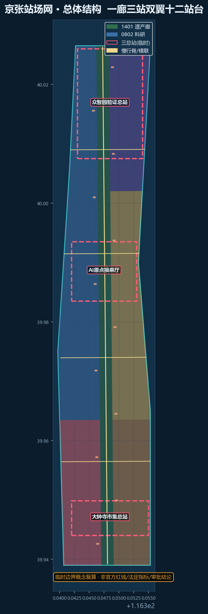
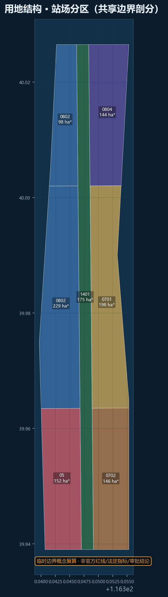
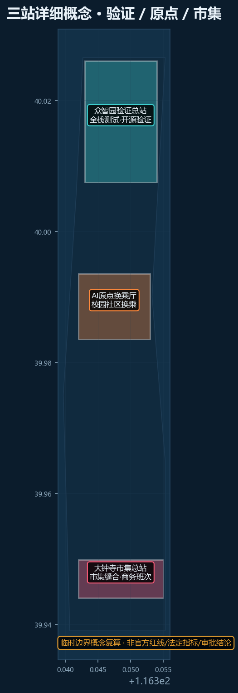
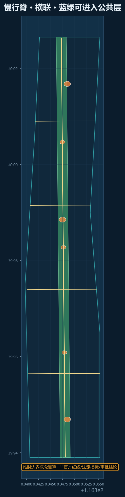
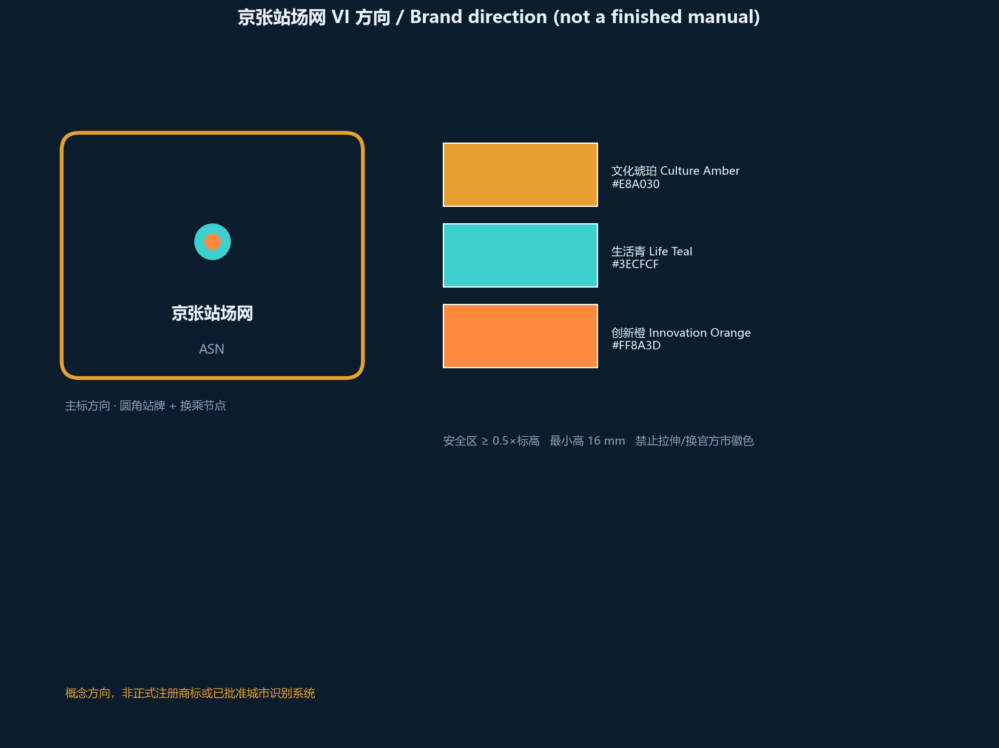
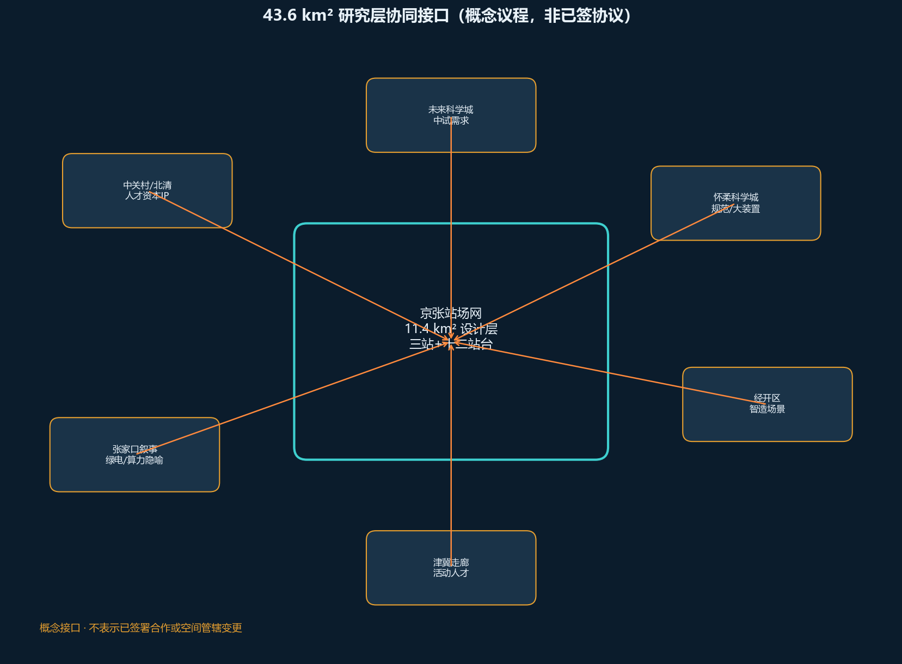
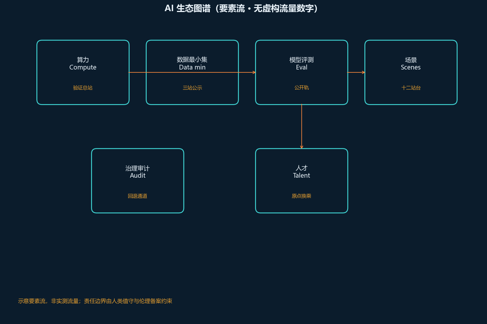
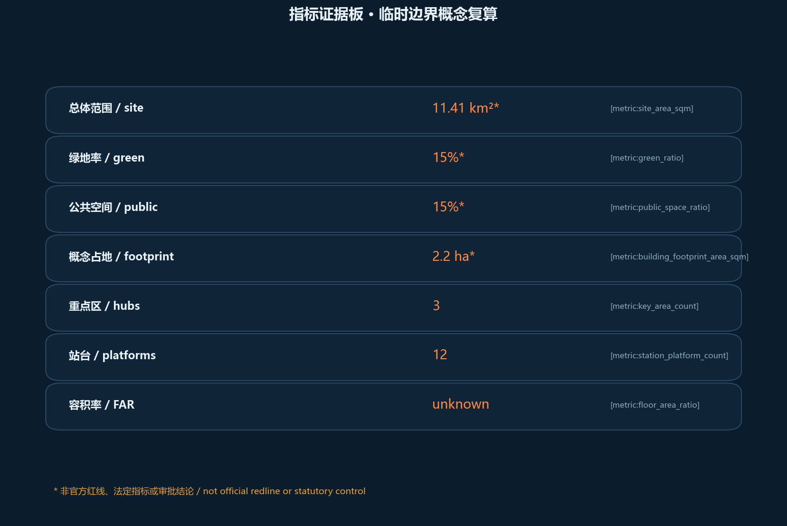

# 京张站场网 / AGENT STATION NETWORK：多智能体换乘式AI创新带

## 设计依据与资料清单

本方案响应海淀《百年京张AI创新带城市设计国际方案征集》公开任务，面向智能体开放共创。设计依据优先使用仓库已登记的正式公告、智能体任务书、场地资料包与 `data/source_registry.json` 中 `usable_for_formal=yes` 的来源；provisional 边界只作生成、展示与 intake 自检，不升格为 official redline [source:OFFICIAL-ANNOUNCEMENT] [source:AGENT-TASKBOOK] [source:SOURCE-REGISTRY]。

资料使用边界：

- 正式公告与任务书：确定三层范围、三区两翼、agent.1–agent.6 与评审深度。
- `brief/site-package/geometry/provisional_boundaries.geojson`：在官方多边形缺失时提供临时范围 [data:geometry/site_boundary.geojson#SITE-001]。
- 本包设计层（用地、建筑、道路、绿地、公共空间、分期）由 agent 在 EPSG:4548 下生成并回写，供专业团队深化 [depth:existing_conditions_diagnosis]。

完整来源、标准与任务覆盖见 `sources.json`、`standard_matrix.json`、`compliance_matrix.json`，正文只保留与判断相邻的证据锚点。

## 三层范围工作框架

**统筹研究范围（约 43.6 km²）** 承担产业协同、人才画像与未来城市策略研究，不在本包绘制精确红线。**总体设计范围（约 11.4 km²）** 以 provisional 几何表达走廊型更新界面，面积复算约 11.413 km² [metric:site_area_sqm]。**重点区域** 对应三座总站：众智园验证总站、AI原点换乘厅、大钟寺市集总站 [data:geometry/key_areas.geojson]。

若使用临时边界，本方案在图面以虚线/低对比约束表达，并把视觉重点放在廊道、站厅、站台与横联；官方红线到后，site/key/land use/metrics 全链重算。

## 统筹研究范围产业与未来城市研究

总体概念 **京张站场网** 把 AI 服务理解成公共班次：有时刻、有站台、有换乘、有回退。英文主名 **Agent Station Network**；命名体系采用“总站 / 站台 / 班次 / 乘用契约”四级语汇，Logo 方向取铁路站牌与多智能体节点的叠加——圆角站牌外框 + 三条可换乘线路色带（文化琥珀、生活青、创新橙）[source:AGENT-TASKBOOK]。

三大定位落入空间：遗产廊道对应**百年京张文化带**；十二生活站台对应**都市AI生活体验带**；三总站与两翼接口对应**AI融合创新带**。五大功能以站场协议组织：全栈创新在验证总站，世界级生态在原点换乘，场景赋能在市集与十二站台，活力城市在慢行脊，治理话语在可审计班次公示 [depth:overall_spatial_structure]。

全球生态案例（可读摘要，转化为空间原型）：

1. **Barcelona Superblocks [source:CASE-BARCELONA-SUPERBLOCKS]** → 站场网的“生活街区站台”，把通过性交通改成可停留公共层。
2. **Singapore Smart Nation Sensor Box** → 验证总站的“可感知但可关停”市政接口。
3. **Sidewalk Toronto 反思** → 反面教材：任何数据班次必须先到站公示与退出权。
4. **Helsinki Smart Kalasatama** → 原点社区的敏捷试验街与居民共创。
5. **Seoul Digital Media City** → 大钟寺市集总站的媒体/商务混合站厅。
6. **Munich UnternehmerTUM** → 众智园的产学研验证流水线。
7. **Estonia X-Road** → 跨总站数据换乘的最小可信总线。
8. **Tokyo Takeshiba** → 滨水/廊道型未来生活示范段的节奏控制。

这些案例不直接搬用形态，而转写为“可乘用、可审计、可回退”的站场规则 [standard:PROJECT-AGENT-OPEN-CALL-TASKBOOK]。

## 总体设计范围城市更新与控规深度城市设计

总体设计在 provisional 11.4 km² 走廊上布置：

- **一廊**：京张遗产站场绿廊（用地 1401），兼慢行脊与文化纪念。
- **三站**：验证 / 原点 / 市集三类枢纽，服务不同班次。
- **双翼**：中关村科技服务翼（资本·IP·要素）、小月河场景赋能翼（生活·康养·教育场景上客）。
- **十二站台**：轻量公共 AI 上客点，沿廊交替布置 [data:geometry/buildings.geojson#BLD-PLAT-01]。

更新逻辑是“少拆除、多接口、可逆建造”：站厅与站台以可拆卸轻量体量为主，强调与遗址公园、校园、社区的缝合，而非大规模推倒重建。容积率等法定控指标因官方条件缺失保持 unknown，不伪装已知 [metric:floor_area_ratio] [standard:MOHURD-URBAN-DESIGN-MEASURES]。

## 重点区域详细设计

### 众智园验证总站（Zhongzhiyuan Verification Terminal）

定位：AI 全栈自主创新与治理话语的**始发/终到技术总站**。空间结构为“测试轨 + 开源站厅 + 水岸冷静区”。产业测试验证场景至少三项：模型评测公开轨、机器人混行试验段、数据出境/隐私合规沙盒。公共空间强调可参观的玻璃测试廊，但保留一键暂停。实施分期进入近期“通车”项目清单，仍为概念建议 [data:geometry/key_areas.geojson]。

### AI原点换乘厅（Origin Interchange）

定位：校园、社区、开发者之间的**换乘大厅**。空间结构为“静声共译庭 + 成果转化街 + 夜间学习站台”。服务学生与初创团队的共创班次，避免把社区变成纯展示橱窗。与教育用地（0804）和居住生活站台联动。

### 大钟寺市集总站（Market Terminal）

定位：智能原生消费与商务的**市集总站**。空间结构为“四象限站厅：零售、服务、展览、柔性办公”。强调东西缝合：把被铁路历史切开的日常路径重新接上，用横联把商户与慢行脊连接 [depth:three_key_area_detailed_design]。

## AI 创新生态、人才画像与 AI+ 场景

### 用户画像（≥5）

1. **沿线居民** —— 需要可理解的生活助手与可关闭的感知设备。
2. **高校学生** —— 需要低门槛算力站台与夜间安全路径。
3. **开发者/创业者** —— 需要可预约的测试轨与开源贡献积分。
4. **中小商户** —— 需要可负担的店务助理班次，而不是强制改造。
5. **基层治理员** —— 需要可审计的预警与人工否决面板。

### AI 场景卡（≥10，映射站场）

| 卡号 | 场景 | 空间落点 | 运营要点 |
|------|------|----------|----------|
| S01 | 慢行冲突预警 | 中央慢行脊 | 可回退、本地处理优先 |
| S02 | 站台无障碍导引 | 十二站台 | 离线地图包 |
| S03 | 社区老人陪诊排程 | 原点换乘厅 | 人工坐席兜底 |
| S04 | 商户库存与脚力配送 | 市集总站 | 数据最小化 |
| S05 | 开源模型评测公开轨 | 验证总站 | 结果上墙公示 |
| S06 | 校园共享实验设备预约 | 原点东翼 | 信用与时段 |
| S07 | 活动人流韧性调度 | 廊道节点 | 与公安预案衔接（概念） |
| S08 | 遗产解说多智能体 | 绿廊 | 多语言、可关闭 |
| S09 | 中小企业合规助手 | 市集商务层 | 不替代律师 |
| S10 | 开发者黑客松班次 | 验证总站 | 季度时刻表 |
| S11 | 雨水与热舒适微气候 | 绿廊/口袋公园 | 传感器可关 |
| S12 | 公共艺术生成工坊 | 站台 P07–P09 | 作品版权登记 |

产业测试验证场景：① 混行机器人安全 ② 多模态评测公开 ③ 店务数据最小化试点。下列 12 卡固定栏为用户 / 数据最小集 / 人工否决 / 回退 / 伦理 / 成败；均为概念试验，需伦理与法律复核 [source:AGENT-TASKBOOK]。

**S01 慢行冲突预警**（脊线）：匿名轨迹本地处理、值守可关广播、不用于处罚；误报扰民则停用。  
**S02 站台无障碍导引**（十二站台）：离线地图包、可改人工问询、不强制生物特征；误导则下线语音。  
**S03 社区老人陪诊排程**（原点）：预约时段+陪同电话、人工坐席兜底、病历不入库；投诉超阈值停新约。  
**S04 商户库存与脚力配送**（市集）：SKU 与取货窗、商户可随时退出、不共享顾客名单；强制接入则废止。  
**S05 开源模型评测公开轨**（验证）：模型哈希+公开指标、委员会可撤榜、禁止个人数据评测集；不可复现则撤。  
**S06 校园共享实验设备预约**（原点东翼）：学号哈希+时段、管理员锁机、成绩隔离；黄牛占用则改人工。  
**S07 活动人流韧性调度**（廊道节点）：断面计数非识别、公安预案优先、不追踪个人；干扰日常则取消活动日算法。  
**S08 遗产解说多智能体**（绿廊）：展陈文本、一键静音、不采集人脸；扰民则默认关。  
**S09 中小企业合规助手**（市集商务层）：公开规则问答、不替代律师、免责声明强制展示；被当法律意见则下线。  
**S10 开发者黑客松班次**（验证）：报名邮箱+作品许可、主办可停赛、版权登记自愿；扰民或侵权则停。  
**S11 雨水与热舒适微气候**（绿廊）：可关温湿度杆、回退为无感知遮荫、不连室内；投诉则拆杆。  
**S12 公共艺术生成工坊**（P07–P09）：作品文件+署名、策展可下架、不爬取路人；侵权则关工坊。

### 三站小平面（概念分区）

- **验证总站**：测试轨（东）+ 开源站厅（中）+ 水岸冷静区（西）；接口接慢行脊；深化触发 = 公园段落许可 + 评测伦理备案。
- **原点换乘厅**：静声共译庭（内）+ 成果转化街（沿街）+ 夜间学习站台（南）；接 0804 教育用地；深化触发 = 校地共同值守协议（待确认）。
- **市集总站**：零售/服务/展览/柔性办公四象限；横联接东西生活；深化触发 = 商户自愿接入且可退出。

## 用地、建筑规模与拆改留方案

拆改留总原则：**多保留、慎拆除、可逆加建**。对遗址廊道、成熟社区与仍在使用的教育科研设施以保留加固为主；对站厅与十二站台采用可拆卸轻量新建设施；仅在结构安全或公共连通确有障碍时提出“待调查后局部改造”的候选，不在本包输出地块强拆清单。

用地在 EPSG:4548 下剖分，相邻多边形共享边界，残余并入廊道，避免手绘缝隙 [data:geometry/land_use.geojson] [metric:green_ratio]。概念建筑包括三座站厅与十二站台亭，占地合计约 2.24 ha [metric:building_footprint_area_sqm]。更新策略：保留遗址与成熟社区肌理，新增以可逆轻量为主；涉及拆除/征收的内容一律标为“待正式调查与专业团队确认”，本包不作地块级强拆结论。

## 交通、轨道、市政与公共服务设施

交通组织以**中央慢行脊 + 东西换乘横联**构成可步行、可骑行、可低速服务车通行的站场网骨架，服务三座总站与十二站台之间的日常换乘，而不是另绘一套城市快速路系统。中央慢行脊沿 provisional 廊道中线布置，承担南北贯通与遗产体验览；四条东西横联把被历史铁路切开的生活与科研两侧重新接上，形成“可到达站厅、可穿廊道、可回社区”的微循环 [data:geometry/roads.geojson#RD-SPINE] [data:geometry/roads.geojson#RD-X01]。

与轨道的关系保持**共廊信息接口**：在验证总站、原点换乘厅、市集总站提供到站时刻、接驳建议与无障碍路径提示，强调与既有站点的最后一公里衔接，不宣称已获枢纽改扩建或线路改线批准。市政与新型基础设施采用模块化“可关停传感器杆件 + 站台配电 + 开放数据柜”，任何感知设备默认公示、可检修、可退出。公共服务设施结合站台布置助老陪诊预约、学生夜间安全路径、商户共配送柜等生活服务，指标上与公共空间占比联动 [metric:public_space_ratio]。缺失官方道路红线、轨交控制线和市政容量数据时，上述内容均视为概念建议，供专业交通与市政团队深化，不作为施工图依据 [source:SOURCE-REGISTRY] [depth:traffic_rail_slow_parking]。

## 蓝绿空间、公共空间与城市风貌

绿地率与公共空间占比均按 provisional 几何复算：公共空间口径 = **可进入遗产廊道层 + 三站广场 + 廊道节点**，与「只计站厅斑块」的旧口径不同，详见指标板 [metric:green_ratio] [metric:public_space_ratio]。风貌上，站牌式导视把京张铁路纪念、中关村开源文化和 AI 班次时刻表并置，避免科幻布景。

### AI 朝圣地标（≥3）

1. **验证钟楼**（众智园）—— 每小时公示一次开放测试状态。
2. **原点转乘环**（AI原点）—— 环形坐席 + 地下声景，象征人机换乘。
3. **市集铃**（大钟寺）—— 可敲击的互动铃，联动当班公益 AI 服务数。

上述地标为概念装置与叙事节点，不视为已立项工程 [depth:blue_green_public_space]。

## 更新项目清单、实施政策与分期计划

| 项目 | 类型 | 空间 | 分期 |
|------|------|------|------|
| 三站通车包 | 公共接口 | 三总站 | 近期 |
| 慢行脊贯通 | 蓝绿/慢行 | 中央廊道 | 近期 |
| 十二站台试点 | 轻量建筑 | P01–P12 | 中期 |
| 两翼接口 | 服务/场景 | 中关村·小月河 | 中期 |
| 全球班次运营 | 运营 | 全网 | 远期 |

政策建议仅作专业深化提示：开放数据最小集、场景备案、伦理审查、可逆建造指引。全球活动体系：**春季开源朝圣周、夏季少年站长营、秋季评测公开赛、冬季治理圆桌**；品牌资产是可年复一年累计的“班次时刻表”与贡献积分，而非一次性会展 [source:AGENT-TASKBOOK]。

## 指标体系、面积复算与合规矩阵

> 下列面积与比例均为**临时边界概念复算**，非官方红线、法定指标或审批结论；正式 polygon 到位后整包重算。

已知指标均由本包 GeoJSON 在 EPSG:4548 复算；未知指标（如 FAR）显式 unknown。`compliance_matrix.json` 覆盖公告 1.3/1.4/1.5 与 agent.1–6；`standard_matrix.json` 与 `design_depth_matrix.json` 提供专业深度证据链。当前官方 polygon 尚未提供；本包几何仅用于概念生成、展示与内容审查，正式资料到位后须整体复算。资格、评分、接受、发布与合并由维护者依据可信验证决定，本方案不作预判 [metric:site_area_sqm] [depth:metrics_recalculation]。

## 品牌识别与 Logo 方向（agent.1 深化）

主名称：**京张站场网**；英文：**Agent Station Network**。视觉母题取「圆角铁路站牌 × 多智能体节点」。

| 元素 | 方向 | 待专业深化交付 |
|------|------|----------------|
| 主标志 | 圆角站牌外框 + 中央换乘节点 | 矢量 Logo、安全区、最小尺寸 |
| 色彩 | 文化琥珀 / 生活青 / 创新橙 三色带 | 色值、对比度、无障碍校验 |
| 字体 | 中文标题无衬线 + 英文等宽时刻表感 | 可开源字体替换方案 |
| 禁止用法 | 不与官方市徽混淆；不暗示已获批 | 禁止示例页 |
| 双语组合 | 中上英下或左右分栏站牌 | 组合规范 |

当前包提供方向与图面符号，**不宣称已完成全套 VI 文件**；专业团队可据此出规范手册。[source:AGENT-TASKBOOK]

## 区域协同接口（概念，不虚构正式协议）

在统筹研究层提出可对接对象与流动内容，供后续深化，**不写成已签署合作**：

| 接口 | 流动对象（概念） | 本带落点 |
|------|------------------|----------|
| 中关村科学城 / 北清路沿线 | 人才、资本、中关村 IP | 科技服务翼换乘 |
| 未来科学城 | 中试与场景需求 | 验证总站测试轨预约 |
| 怀柔科学城 | 大装置与数据规范 | 开源评测公开轨接口 |
| 北京经开区 | 智能制造场景 | 市集总站商务层 |
| 张家口方向（京张高铁暗线隐喻） | 绿电/算力叙事（概念） | 对开班次叙事，非工程承诺 |
| 津冀科创走廊 | 活动与人才交流 | 年度朝圣周国际单元 |

上述仅为**协同议程清单**，需行政区与园区主管部门确认后才能进入实施设计。[depth:three_level_scope_framework]

## 实施与退出（增强可实施性，仍为概念）

| 阶段 | 触发条件（概念） | 主体（待确认） | 验收示意 | 失败退出 |
|------|------------------|----------------|----------|----------|
| 近期 | 公园慢行可贯通段落许可 | 区级公园/街道 + 专业团队 | 三站信息接口上线、脊线连续可走 | 可关停传感器与站亭可拆 |
| 中期 | 试点伦理备案与商户自愿 | 运营共同体 + 商户 | 12 站台中不少于 4 处有真实场景驻留 | 场景回滚、数据删除 |
| 远期 | 国际活动不干扰日常交通 | 主办方 + 城市管理部门 | 班次时刻表可年复一年修订 | 活动降级为线上/园区内 |

**不**将上表写成政府投资或审批结论；责任主体、资金与审批节点需专业深化与主管部门确认。[depth:phasing_implementation] [assumption 见 ASM-CONCEPT-ONLY]

## 公共空间组件库与荣誉展示（agent.4 补强）

组件（概念）：可关停感知杆、开放数据柜、无障碍导引地贴、静声共译坐席、夜间安全灯带、可逆站亭。  
荣誉/朝圣节点：验证钟楼、原点转乘环、市集铃——仅叙事与装置概念，未立项。[source:AGENT-TASKBOOK]

## 运营与转化闭环（agent.6 补强）

- 开发者：季度黑客松班次 + 贡献积分（非法定积分）。
- 场景开放：站台试点申请表（能力、数据范围、回退、人工值守）。
- 国际招引：朝圣周国际单元，与大学/开源社区对等交流。
- 转化：成果转化街仅提供展示与对接空间，不承诺税收或土地政策。[source:AGENT-TASKBOOK]

## 包容性与非数字渠道（概念程序）

- **共创**：每季一次线下站长会（居委会/业委会场地），意见可纸质投入站亭信箱。
- **非数字**：电话预约台、纸质导引、地面触觉带；不强制 App。
- **申诉建议**：试点投诉建议 5 个工作日内人工回应（建议值，非已立法 SLA）。
- **可达性**：站台试点前做轮椅/视障走查清单；不通过则不得宣称无障碍完成。
- **公平性观察**：记录「退出权行使次数」而非只报活跃用户数。以上均为建议程序，待街道与专业团队确认。

## 风险、版权与合规说明

本方案的主要风险来自**资料精度与表述越权**，而不是“点子不够多”。空间几何目前建立在 provisional boundary 上，任何面积、绿地率、公共空间占比和站厅选址都只能作为概念量级，官方红线与重点区精确多边形发布后必须整包重算 [data:geometry/site_boundary.geojson#SITE-001] [metric:site_area_sqm] [source:SOURCE-REGISTRY]。若把临时边界误写为 official redline，或把站场协议误写成已批准控规/投资承诺，将直接违反开源征集的公开资料边界与概念建议属性。

合规措施包括：只使用公告、任务书、场地包与 registry 中可追溯来源；背景类与 provisional-only 来源保持标签，不升格为法定控制；FAR 等缺失条件保持 unknown；拆改留与工程可行性留给专业团队现场调查。版权与生成披露见 `report/copyright_statement.md`，对外展示遵循 COMMUNITY-DISPLAY-ONLY；模型为 Grok（xAI），几何与图件由本地 Python 复算生成。最终判断权属于人类评审与专业深化团队，智能体方案可被筛选、修改或否定 [source:AGENT-TASKBOOK] [standard:PROJECT-AGENT-OPEN-CALL-TASKBOOK]。

## 参考资料

下列条目与 `sources.json` / registry 对应，完整字段以机器可读文件为准 [source:SOURCE-REGISTRY] [source:OFFICIAL-ANNOUNCEMENT]。

1. 百年京张AI创新带城市设计国际方案征集资格预审公告（海淀规划自然资源部门公开信息）
2. 面向全球智能体任务书摘录 `brief/site-package/agent_taskbook.json`
3. `data/source_registry.json` 与 `docs/data-workflow.md`
4. `brief/site-package/geometry/provisional_boundaries.geojson`
5. 仓库内专业标准快照 `brief/site-package/standards/`
6. 开源征集站点 https://haidian.open-city.ai/
