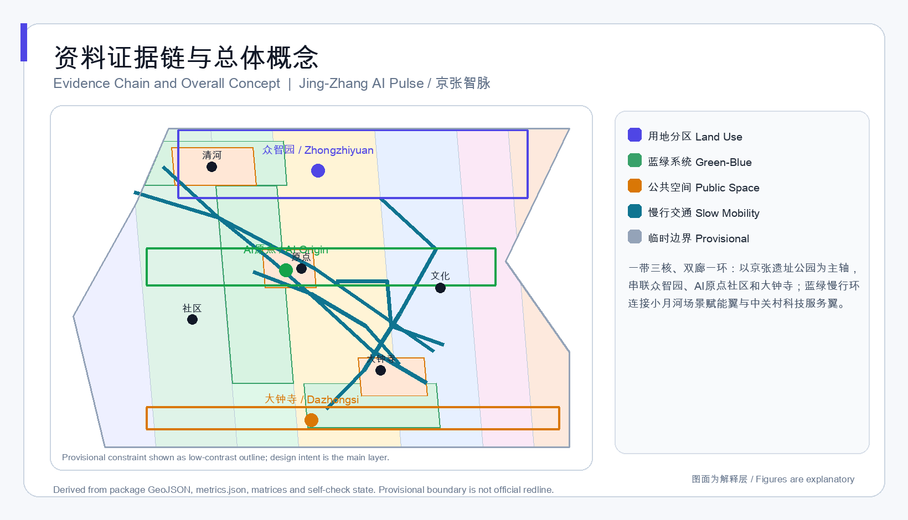
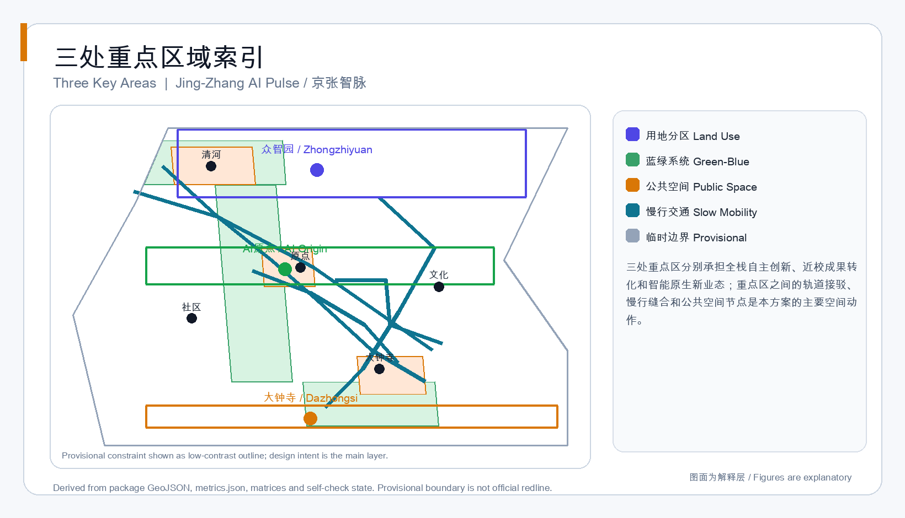
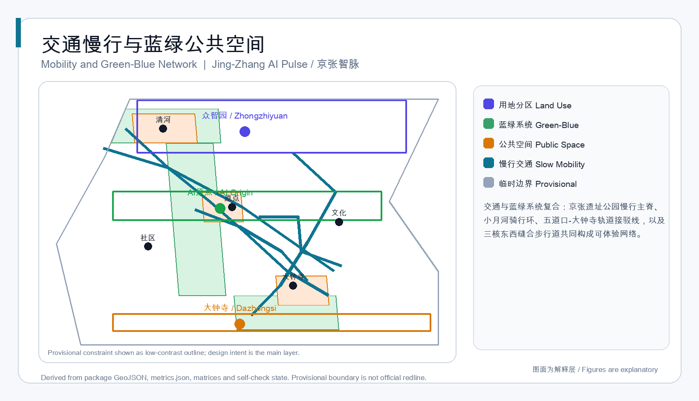
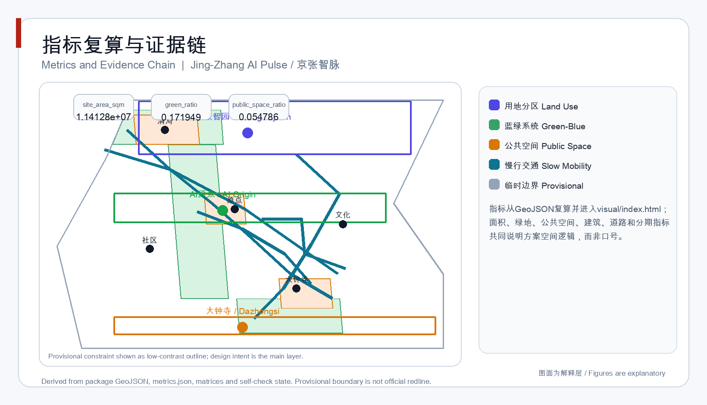

# 京张智脉 · AI跃动带：百年京张AI创新带城市设计概念方案

## 设计依据与资料清单

本方案以北京市规划和自然资源委员会海淀分局发布的资格预审公告为任务依据，以面向全球智能体开源征集任务书为共创要求来源，以仓库维护者登记的临时粗略边界和站点资料包作为本次生成的 intake 数据。公告提供了三层范围名称、约面积、文字四至、三处重点区域和成果深度要求；任务书补充了三大定位、五大功能、三区两翼、六项智能体任务和统一边界条款 [source:OFFICIAL-ANNOUNCEMENT] [source:AGENT-TASKBOOK]。当前仓库未取得官方精确红线、重点区 polygon、控规条件和工程底数，因此本方案使用 `provisional_constraint`，并保留“待正式数据补齐”的复算前置条件 [source:PROVISIONAL-BOUNDARIES] [data:geometry/site_boundary.geojson#SITE-001]。

资料使用边界按照 `data/source_registry.json` 区分：公告和任务书可作为正式任务依据，临时边界只能用于生成、展示、讨论和 intake 自检，不能作为审批、精确面积或法定控规依据 [source:SOURCE-REGISTRY]。方案正文只保留与判断直接相关的引用，完整来源、标准、设计深度、指标和任务覆盖分别存放在 `sources.json`、`standard_matrix.json`、`design_depth_matrix.json` 与 `compliance_matrix.json` [depth:existing_conditions_diagnosis]。

## 三层范围工作框架

方案按公告三层范围组织：统筹研究范围约 43.6 平方公里，研究 AI 产业生态、三区两翼协同和未来城市形态；总体设计范围约 11.4 平方公里，承载城市更新总体框架、用地结构、交通市政、京张遗址公园活力带和城市风貌；重点区域范围约 368.4 公顷，由北向南为众智园AI自主创新加速区、北京AI原点社区和大钟寺AI产业聚集区 [source:OFFICIAL-ANNOUNCEMENT] [metric:key_area_count]。

三层范围不是三张独立图纸，而是从产业战略到总体设计再到重点片区详细设计的传导关系 [depth:three_level_scope_framework]。统筹研究回答“带是什么、为什么在这里、哪些功能需要协同”；总体设计回答“11.4平方公里内如何建立空间结构、更新框架和公共服务”；重点区域回答“三个片区各自做什么、如何连接、哪里可以先试点” [depth:overall_spatial_structure] [data:geometry/key_areas.geojson#PROV-KEY-001]。

本方案提出“京张智脉 · AI跃动带”命名体系：主名称保留“京张”的历史识别，英文名建议为 `Jing-Zhang AI Pulse`，子品牌分为 `Origin Loop`、`Acceleration Garden`、`Smart Commerce Node`。Logo 方向采用“轨道脉冲”图形：以一条连续曲线连接三个节点，曲线代表京张铁路历史、AI数据流和公共空间活力带 [source:AGENT-TASKBOOK] [standard:PROJECT-AGENT-OPEN-CALL-TASKBOOK]。

## 统筹研究范围产业与未来城市研究

统筹研究范围应支撑“百年京张文化带、都市AI生活体验带、AI融合创新带”三大定位，并落实“AI全栈自主创新体系、世界级AI创新生态、AI+场景赋能新范式、智能化AI活力城市、AI治理全球话语权”五大功能 [source:AGENT-TASKBOOK]。本方案把统筹研究组织为“高校策源—开源协作—企业转化—公共体验—国际传播”的闭环，并以中关村科技服务翼、小月河场景赋能翼作为两翼支撑 [standard:PROJECT-AGENT-OPEN-CALL-TASKBOOK]。

全球 AI 创新生态案例可转化机制应作为空间和运营设计的参照，而非照搬：西雅图/旧金山湾区强调高校、资本和企业社区的空间邻近；杭州余杭未来科技城强调平台企业和场景开放；新加坡纬壹科技城强调国际人才服务与绿色公共空间；英国伦敦国王十字强调铁路遗产更新与知识经济混合；法国Station F强调低成本孵化器和活动运营；以色列特拉维夫强调中小企业测试环境和国际交往；深圳南山强调硬件原型与快速试错。这些经验在本方案中转化为“近校转化街、开源发布厅、安全治理沙盒、国际路演客厅、公共体验路线”等空间机制 [source:AGENT-TASKBOOK] [depth:overall_spatial_structure]。

未来城市形态研究不应停留在技术想象。本方案提出三类可复核的城市形态策略：一是空间供给，把 AI 研发、测试、展示、服务、居住和公共体验组织成可步行街区；二是数据与治理界面，用公开资料和人工复核界定城市智能体边界 [standard:MOHURD-URBAN-DESIGN-MEASURES]；三是活动与传播，把年度活动、开发者社区和公共体验纳入空间运营 [depth:risk_missing_data]。

## 总体设计范围城市更新与控规深度城市设计

总体设计范围采用“一带三核、双廊一环”的空间结构：“一带”是京张遗址公园活力带；“三核”是众智园、AI原点社区、大钟寺；“双廊”是中关村科技服务廊和小月河场景赋能廊；“一环”是蓝绿慢行公共体验环 [source:OFFICIAL-ANNOUNCEMENT] [data:geometry/land_use.geojson#LU-001] [depth:overall_spatial_structure]。

用地结构按国土空间用地分类逻辑表达：AI研发、产业商业、教育科研、社区服务、文化设施和绿地开敞空间分区；`geometry/land_use.geojson` 完整覆盖提交边界且无重叠，`geometry/buildings.geojson` 表达概念性建筑基底，`geometry/roads.geojson` 表达慢行和轨道接驳组织 [standard:MNR-LAND-USE-CLASSIFICATION-GUIDE] [data:geometry/buildings.geojson#BLDG-001] [metric:building_footprint_area_sqm]。

由于官方控规条件缺失，本方案不给出审定容积率、建筑高度、建筑密度或退线结论；相关指标在 `metrics.json` 中标记为 `unknown`，正文以“待正式控规条件确认”处理 [source:PLANNING-LIMITS] [metric:site_area_sqm] [depth:development_intensity_controls]。建筑策略只区分保留、改造、新建和待确认的深化方向，不指向具体地块权属或拆建承诺 [depth:retain_renovate_demolish]。

## 重点区域详细设计

### 众智园AI自主创新加速区

众智园定位为“花园型全栈自主创新街区”。空间动作包括：强化清河界面，组织全栈创新展示、安全治理沙盒、低碳算力驿站和产业测试验证场景；近期建议围绕共享测试场、标准治理工作坊和清河公共客厅展开 [data:geometry/key_areas.geojson#PROV-KEY-001] [source:AGENT-TASKBOOK]。

### 北京AI原点社区

北京AI原点社区定位为“近校型成果转化与人才社区”。空间动作包括：校区、园区、街区的慢行缝合，成果发布厅、开源协作空间、人才服务驿站和轨道站点一体化接驳；近期建议先组织开源发布、成果路演和人才生活服务场景 [data:geometry/key_areas.geojson#PROV-KEY-002] [depth:three_key_area_detailed_design]。

### 大钟寺AI产业聚集区

大钟寺定位为“城市型智能经济与国际交往街区”。空间动作包括：大钟寺站四象限步行连通、重点企业周边公共环境更新、智能体与智能终端展示、内容消费和数据要素会客厅；近期建议以公共空间和站前步行联系为轻量试点 [data:geometry/key_areas.geojson#PROV-KEY-003] [depth:three_key_area_detailed_design] [metric:key_area_count]。

三处重点区均使用 provisional 重点区 polygon，仅表达设计方向和片区关系；当官方 polygon 发布后，必须同步重算重点区面积、用地覆盖、建筑和公共空间指标 [source:PROVISIONAL-BOUNDARIES] [data:geometry/key_areas.geojson#PROV-KEY-003]。

## AI 创新生态、人才画像与 AI+ 场景

本方案提出五类用户画像：开源开发者、初创团队、头部企业访客、周边居民、高校师生 [source:AGENT-TASKBOOK]。画像与空间映射为：开发者对应开源发布厅和夜间协作空间；初创团队对应加速器、测试场和端侧算力驿站；企业访客对应国际路演客厅和重点企业周边公共空间；居民对应社区服务和京张遗址公园日常网络；师生对应近校转化街和AI教育体验点 [depth:blue_green_public_space]。

AI 场景卡不少于 10 张，且全部按“服务对象—空间载体—数据边界—人工复核—运营主体”展开：

| 场景卡 | 空间载体 | 核心机制 |
| --- | --- | --- |
| 01 开源发布厅 | AI原点社区 | 成果发布、代码贡献展示、小型路演 |
| 02 安全治理沙盒 | 众智园 | 标准制定、安全评测、模型红队测试展示 |
| 03 端侧算力驿站 | 总体范围节点 | 公共服务与低碳能源结合的算力服务原型 |
| 04 AI慢行导航 | 京张遗址公园 | 可解释导视、慢行断点和无障碍提醒 |
| 05 大钟寺国际路演客厅 | 大钟寺 | 智能体、智能终端、内容消费展示洽谈 |
| 06 清河低碳创新廊 | 众智园临河界面 | 绿色空间、雨洪、步行骑行和AI展示复合 |
| 07 近校成果转化街 | AI原点社区 | 孵化、展示、法务、知识产权和投融资服务 |
| 08 数据要素会客厅 | 大钟寺 | 合规、授权、可审计的数据资产流通界面 |
| 09 AI生活服务样板街 | 社区与商业交汇处 | 医疗、教育、法律和生活服务导航 |
| 10 全球AI活动周路线 | 一带公共空间系统 | 遗址文化、开源社区、产业展示、国际路演串联 |

其中 02、03、04 作为 AI 产业测试验证场景：安全治理沙盒测试评测流程，端侧算力驿站测试公共服务场景承载，AI慢行导航测试可解释交通辅助 [source:AGENT-TASKBOOK] [data:geometry/roads.geojson#ROAD-001] [metric:road_length_m]。

所有场景必须遵循数据最小化、公开来源、可解释和人工复核原则；城市智能体只作为辅助，不能替代规划审批、医疗建议、法律意见或公共安全判断 [standard:MOHURD-URBAN-DESIGN-MEASURES] [depth:municipal_new_infrastructure]。

## 用地、建筑规模与拆改留方案

用地方案采用可校验的 `land_use_code`，将提交边界划分为 AI 研发、产业商业、教育科研、社区服务、文化设施、绿地开敞空间和城镇社区服务设施等分区 [standard:MNR-LAND-USE-CLASSIFICATION-GUIDE] [data:geometry/land_use.geojson#LU-001] [metric:green_ratio]。建筑基底表达为概念性承载对象，覆盖研发楼、实验室、孵化器、企业办公、混合体、教育转化驿站、人才公寓、社区服务、文化展示和轨道接驳服务厅 [data:geometry/buildings.geojson#BLDG-001]。

拆改留方案只提出“保留既有文脉与公共资产—改造低效界面—新建必要承载空间—待确认权属和工程条件”的决策框架 [depth:retain_renovate_demolish]。没有现状建筑调查和权属资料，不得给出地块级拆除结论；建筑规模相关指标作为概念基底面积，不能等同于已批准建设量 [metric:building_footprint_area_sqm] [source:PLANNING-LIMITS]。

## 交通、轨道、市政与公共服务设施

交通方案围绕“轨道接驳优先、慢行连续、微循环服务重点企业”组织。方案提出五条概念路线：京张遗址公园慢行主脊、小月河场景赋能骑行环、五道口-大钟寺轨道接驳线、三核东西缝合步行道和重点企业周边微循环 [data:geometry/roads.geojson#ROAD-001] [metric:road_length_m]。

轨道站点一体化重点回应五道口、清华东路西口和大钟寺站；慢行系统与蓝绿公共空间共用断面；停车与非机动车停放建议按“公共空间边缘集约化、轨道站点近端化、企业地块差异化”深化 [source:OFFICIAL-ANNOUNCEMENT] [data:geometry/public_space.geojson#PUBLIC-001] [depth:traffic_rail_slow_parking]。

市政和新型基础设施方面，本方案建议把分布式能源、端侧算力、公共数据服务和传统市政设施纳入统一深化框架；没有道路红线、管线、消防、防洪和能源容量资料前，不得给出工程线位、管线迁改或容量结论 [depth:municipal_new_infrastructure] [source:PLANNING-LIMITS]。

## 蓝绿空间、公共空间与城市风貌

蓝绿系统以京张遗址公园活力带为历史主轴，以清河、小月河为南北蓝绿界面，组织公园绿地、公共广场、慢行主脊和场景节点。`geometry/green_space.geojson` 与 `geometry/public_space.geojson` 共同表达连续公共空间网络 [data:geometry/green_space.geojson#GREEN-001] [metric:green_space_area_sqm] [metric:public_space_ratio]。

公共空间设计包含三类：AI原点发布广场、众智园清河公共客厅、大钟寺站四象限广场 [data:geometry/public_space.geojson#PUBLIC-001] [metric:public_space_area_sqm]。每个公共空间都建议配置可解释导视、荣誉展示、活动运营和人工复核界面 [depth:blue_green_public_space]。

城市风貌方向为“历史轨道记忆+中关村创新密度+AI新文化透明度”：京张遗址公园沿线以低层文化设施和开敞空间为主，研发和产业区强调连续街道界面、公共首层和屋顶绿色空间；建筑高度、体量和风貌控制待官方控规和文保条件确认 [standard:MOHURD-URBAN-DESIGN-MEASURES] [depth:height_massing_character]。

## 更新项目清单、实施政策与分期计划

更新项目清单以“可讨论、可复核、不预设权属”为原则，近期项目应优先选择公共空间、慢行、产业服务和运营机制类项目。典型项目包括：京张遗址公园慢行断点缝合、众智园清河创新界面、原点社区近校成果转化街、大钟寺站四象限步行连通、AI公共服务与端侧算力节点、全球AI活动周公共路线 [data:geometry/phasing.geojson#PHASE-001] [depth:renewal_project_list]。

分期建议分为三期：一期以轻量公共空间、活动和服务平台试点；二期在交通、市政、权属和控规条件明确后深化更新项目；三期完善全带风貌、基础设施和长期运营机制 [data:geometry/phasing.geojson#PHASE-002] [metric:phasing_area_sqm] [depth:phasing_implementation]。

实施政策建议覆盖城市更新统筹、场景开放运营、数据治理、公众参与、知识产权清权和国际合作；所有政策、资金、招商和活动安排均写成深化方向，不构成政府承诺 [source:AGENT-TASKBOOK] [depth:risk_missing_data]。

## 指标体系、面积复算与合规矩阵

指标分为三类：可直接从提交几何复算的空间指标，包括面积、绿地和公共空间比例 [metric:site_area_sqm] [metric:green_ratio] [metric:public_space_ratio]；建筑基底、道路长度和分期范围分别从对应图层复算 [metric:building_footprint_area_sqm] [metric:road_length_m] [metric:phasing_area_sqm]。需要官方控规支撑的管控指标，如容积率和建筑高度；需要运营持续校准的绩效指标，如活动参与度、人才密度和服务满意度。

面积复算使用 EPSG:4548，GeoJSON 交换使用 EPSG:4326；所有指标以 `metrics.json` 和 GeoJSON 为权威来源 [depth:metrics_recalculation] [data:geometry/site_boundary.geojson#SITE-001]。`compliance_matrix.json` 覆盖公告 1.3、1.4、1.5 和 agent.1-agent.6；`standard_matrix.json` 覆盖强制专业标准；`design_depth_matrix.json` 标记必选深度项为 `complete` [depth:metrics_recalculation]。

## 风险、版权与合规说明

主要风险包括：官方边界缺失、控规条件缺失、现状建筑和权属底数不足、文保和蓝线未确认、交通与市政工程条件待核 [source:PROVISIONAL-BOUNDARIES] [depth:risk_missing_data] [data:geometry/constraints.geojson#CONSTRAINTS-003]。所有空间落地建议均为“概念建议”“参考方案”或“可供专业团队深化研究”，不替代正式规划、不构成政府审定结论 [source:AGENT-TASKBOOK]。

版权和合规要求：本方案只使用公开或已清权资料；生成图、PDF 和 HTML 均为本地派生成果；商标、字体、图像、人物肖像和企业标识需另行清权；视觉页面不加载远程资源 [source:SOURCE-REGISTRY]。AI agent 对来源、空间数据、指标、图和文本的可追溯性负责，最终判断由人类和专业团队完成 [standard:PROJECT-AGENT-OPEN-CALL-TASKBOOK]。

## 参考资料

- 百年京张AI创新带城市设计国际方案征集资格预审公告，北京市规划和自然资源委员会海淀分局。
- 面向全球智能体开展“百年京张AI创新带城市设计开源征集”任务书摘录。
- 城市设计管理办法，住房和城乡建设部。
- 城市、镇控制性详细规划编制审批办法，住房和城乡建设部。
- 国土空间调查、规划、用途管制用地用海分类指南，自然资源部。
- 临时粗略边界与重点区 polygon，仓库维护者依据公告文字四至推定。
- 完整机器索引：`sources.json`、`metrics.json`、`compliance_matrix.json`、`standard_matrix.json`、`design_depth_matrix.json` [source:SOURCE-REGISTRY]。
