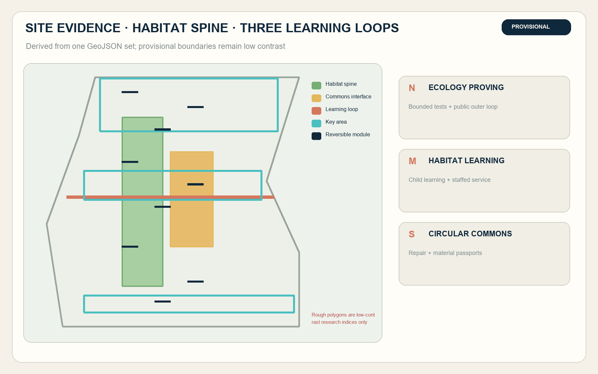
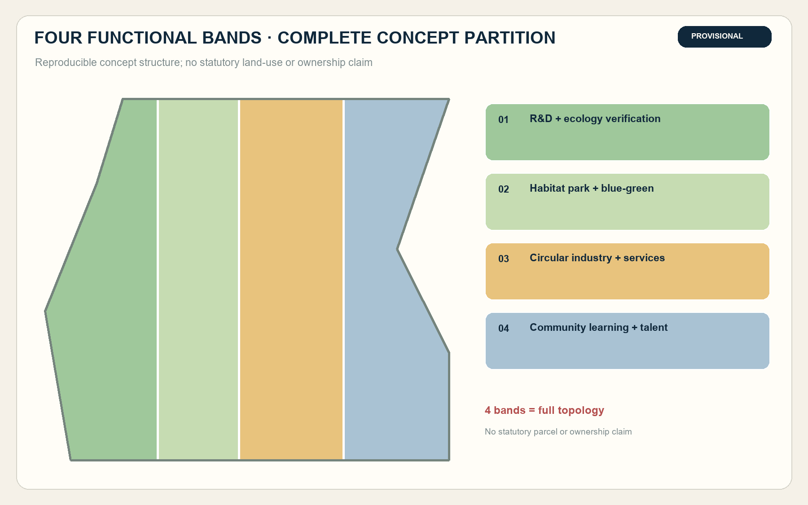
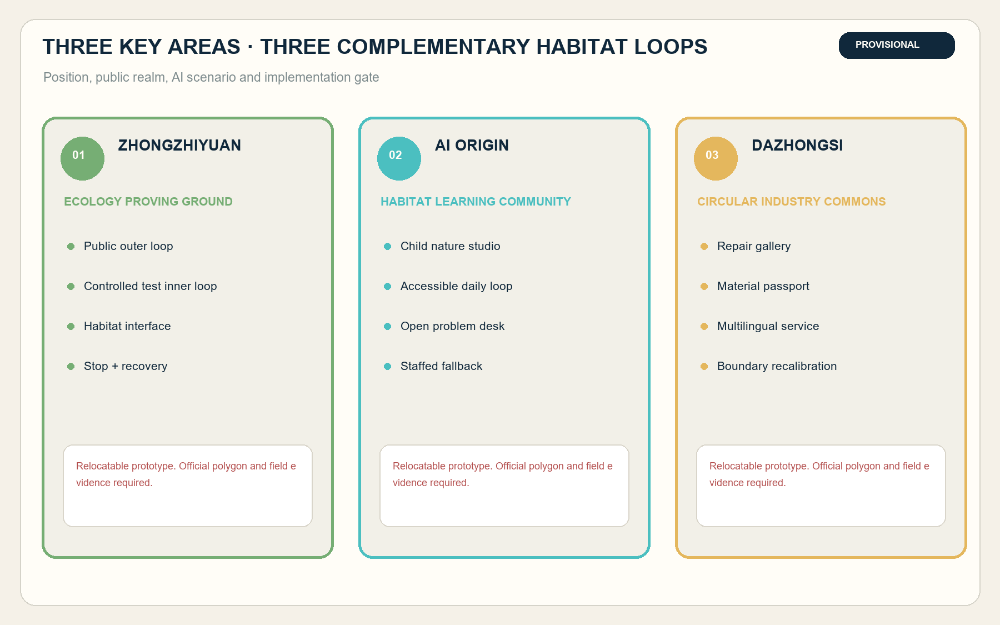
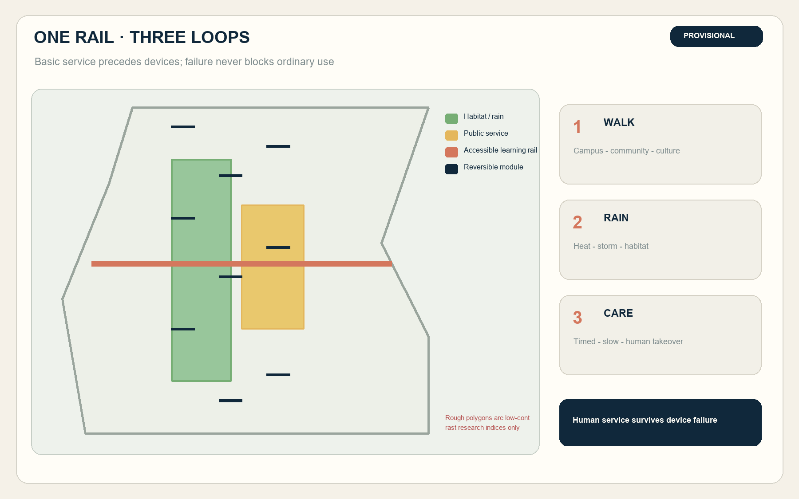
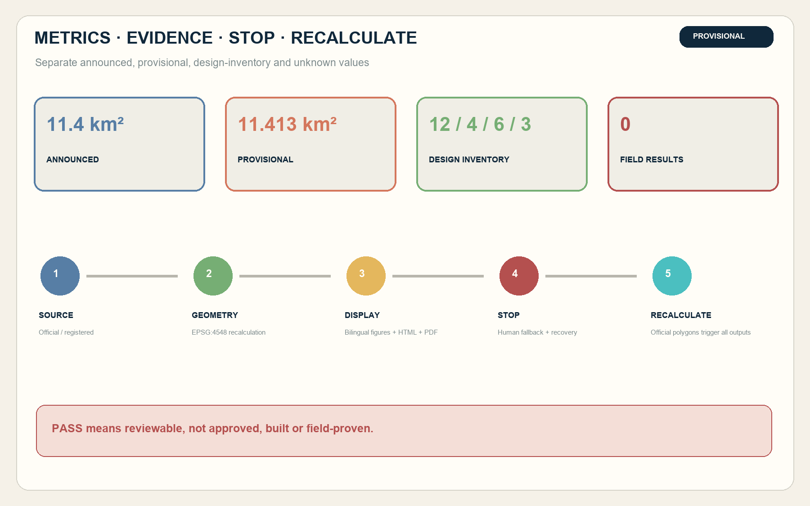

# Jing-Zhang Habitat Commons

**Subtitle: An AI innovation belt where people, city and habitat learn together**

The historic railway once brought speed into Beijing. Its next century can ask a harder question: can urban AI improve innovation without making daily life or nature pay the cost? The proposal treats the completed Jing-Zhang Railway Heritage Park as a public habitat spine. Zhongzhiyuan, Beijing AI Origin Community and Dazhongsi form three learning loops in which low-impact sensing, human review, stoppable trials and habitat repair allow industrial validation, children's nature learning, accessible mobility, stormwater management and public culture to share one infrastructure.

No field survey, tree inventory, species survey, travel survey, ownership record, approved regulatory plan or official precise GIS was available. Every added space is a relocatable concept. The provisional geometry supports generation, review and comparison only; it is not an official redline, parcel location, demolition finding or delivery commitment. Official data must trigger full regeneration of the nine GeoJSON layers, metrics, figures and bilingual outputs.

## Design basis and source inventory

The task boundary comes from the official announcement, Agent taskbook and repository site package. The announcement provides approximate areas at three scales, while the repository currently provides only rough polygons inferred from textual extents and checked against announced areas. The proposal preserves that limitation and does not use OSM, news imagery, satellite screenshots or AI inference as official geometry. [source:OFFICIAL-ANNOUNCEMENT] [source:BOUNDARY-SOURCE] [depth:existing_conditions_diagnosis]

Method references include the Beijing Garden City Plan's directions on ecology, city-green integration, participation and green accessibility, and national child-friendly guidance on safety, greenery, inclusion and children's participation. These guide design method but do not replace project controls, professional standards or field baselines. [source:BEIJING-GARDEN-CITY] [source:CHILD-FRIENDLY-GUIDE]

## Three-level scope framework

Each scope answers a different question. The coordinated area tests how an innovation ecosystem can align with garden-city, biodiversity and public-service goals. The overall area converts those relationships into one habitat spine, three cross-corridor commons loops and nine reversible plots. The key-area scale develops ecological validation, neighbourhood learning and circular-industry proposals. Announced areas are known approximations; the submitted geometry is a low-confidence recalculation and the two must not be substituted for one another. [metric:announced_overall_design_area_sqm] [data:geometry/site_boundary.geojson#SITE-001] [depth:three_level_scope_framework]

| Scale | Core question | Spatial response | Evidence gate before the next stage |
| --- | --- | --- | --- |
| 43.6 km² coordinated research | How do AI industry, talent, garden city and ecological governance work together? | A network of R&D, public validation, community learning, circular industry and global exchange | Official study polygon, industrial/population baseline and accountable cross-agency owners |
| Approx. 11.4 km² overall design | How do park, neighbourhoods, transit, campuses and firms connect? | One habitat spine plus learning, rain-habitat and maintenance-logistics loops | Official boundary, survey, roads/utilities, tree and habitat inventories |
| 368.4 ha key areas | How do three districts become complementary detailed designs? | Northern ecology proving ground, central learning community and southern circular-industry commons | Three official polygons, regulatory controls, ownership, engineering and operating permission |

## Coordinated-area industry and future-city strategy

The name is Jing-Zhang Habitat Commons. “Habitat” includes ecological habitat and the everyday places in which research, industry and communities coexist. The proposed mark turns two railway lines into a leaf vein and open data brackets while keeping an unscanned public passage between them. Railway oxide red, habitat green and audit cyan replace brain, robot-face or corporate-brand imagery. Trademark, typeface and public-legibility checks remain future requirements. [source:AGENT-TASKBOOK] [standard:PROJECT-AGENT-OPEN-CALL-TASKBOOK]

The three positions become a railway ecology-memory belt, an everyday AI learning belt and an AI-nature verification belt. Five functions are full-stack verification, open innovation, AI-enabled public scenarios, sustainable daily urbanism and auditable governance. Zhongzhiyuan frames technical and ecological questions; AI Origin Community translates them into public learning and services; Dazhongsi receives validated components through display, repair and circular maintenance. The west wing provides IP, capital and international services, while the east wing hosts bounded public-space and ecological trials.

Six global cases contribute mechanisms, not transferable controls. Singapore one-north joins research, firms, learning and park life; London's Knowledge Quarter is an institutional network; Barcelona 22@ pairs adaptive reuse with productive and residential urbanity; Kendall Square plans research, housing, retail and open space together; Smart Kalasatama supplies living-lab methods and resident participation; Toronto Quayside foregrounds digital governance, privacy, public realm and public scrutiny. None proves that Jing-Zhang can reproduce their investment, outcomes or authority. [source:CASE-ONE-NORTH] [source:CASE-QUAYSIDE]

## Overall-area urban renewal and regulatory-plan urban design

Four complete functional bands cover the provisional polygon without gaps or overlaps: R&D and ecological verification; habitat park and blue-green open space; circular industry and public services; and community learning and talent support. They are concept functions, not statutory parcels or ownership claims. [data:geometry/land_use.geojson#LU-001] [standard:MNR-LAND-USE-CLASSIFICATION-GUIDE] [depth:land_use_layout]

Renewal follows “retain, mend, test, then make permanent.” The completed park, usable streets, verified public facilities and heritage elements come first. Shade, seating, permeable surfaces, continuous ramps, dark-sky lighting and paper wayfinding are micro-upgrades. Nine commons plots test demand with movable components. Permanent construction waits for regulatory planning, ownership, structural, fire, heritage, utility, ecological and public procedures. No specific demolition, FAR, height or total-floor-area commitment is made. [metric:floor_area_ratio] [depth:retain_renovate_demolish]

Each reversible plot combines ordinary passage, non-digital explanation, human help, a sensor switch, a data-responsibility label, habitat or stormwater components, and a recovery path after shutdown. Basic passage, rest and human service remain available when technology is offline.

## Detailed design for the three key areas

All three areas use shared provisional rectangles and remain relocatable. The southern Dazhongsi polygon has a publicly discussed anchoring risk, so the proposal states no station distance, parcel location or interpretation of rectangle edges as road or ownership boundaries. [data:geometry/key_areas.geojson#PROV-KEY-003] [source:KEY-AREA-SOURCE] [depth:three_key_area_detailed_design]

| Key area | Position and structure | Buildings and public realm | First AI scenarios and gates |
| --- | --- | --- | --- |
| Zhongzhiyuan | Ecology proving ground with a public outer loop, controlled inner loop and habitat interface | Reuse ground floors, covered space and hardstand; add removable test plots, observation seats and physical stop points | Low-impact sensing, embodied-device avoidance and edge-energy comparison; requires site, ecology, safety, fire and data permission |
| AI Origin Community | Habitat learning community with campus-neighbourhood loop, children's nature studio and open problem desk | Shared ground floors, no-purchase seating, accessible sanitation and quiet space; no assumption of campus-gate opening | Child habitat mapping, accessible route audit, sourced railway guide and community garden helper; requires guardianship, human mentors and exit rights |
| Dazhongsi | Circular-industry commons linking arrival, display, repair, recovery and public feedback | Continuous ground access, repair gallery and material-passport desk; no station or ownership claim | Material passports, public-service agent, recovery logistics and multilingual guide; requires official boundary, station coordination and accountable operator |

The three public learning landmarks are the Habitat Observatory, AI Origin Seed Library and Dazhongsi Circular Works Hall. They honour reproducible contributions such as repairing an accessibility break, publishing a failed trial, restoring a habitat plot or closing a repair-and-recovery loop rather than ranking companies or creating monumental tech sculpture.

## AI ecosystem, personas and AI-enabled scenarios

Six personas take part in acceptance: children and carers; older residents; disabled and mobility-limited users; researchers and developers; startups and campus teams; and landscape, cleaning, repair and logistics workers. They bring safety, comprehension, rest, accessible continuity, reproducible testing, compliance, maintenance reality and labour safety into the same review. Every trial reports effects on the least advantaged group. [source:CHILD-FRIENDLY-GUIDE] [standard:MOHURD-URBAN-DESIGN-MEASURES]

| Scenario | Users and space | Minimum data and human alternative | Stop and recovery |
| --- | --- | --- | --- |
| S01 Accessible habitat navigation | Older and disabled users; mobility loop | Obstacle category and aggregate completion; paper map, phone and guide | Stop whenever a complete alternative is unavailable |
| S02 Heat and storm safety route | Children, older people and maintainers; spine | Public warnings and facility state; signs and announcements | Degrade to human information if source or route fails |
| S03 Child habitat mapping | Children and carers; Origin Community | Anonymous cards and guardian consent; paper and mentor | Stop without guardianship, safe content or safe space |
| S04 Sourced railway-nature guide | Residents and visitors; heritage park | Source ID, version and language; booklet and guide | Remove any disputed history or species card |
| S05 Garden maintenance assistant | Landscape and cleaning workers; plots | Facility status and human work order; phone and checklist | Stop if advice threatens work safety |
| S06 Health and quiet-route referral | Residents and older people; public space | Public service/environment state only; staffed desk | No diagnosis; escalate ambiguity or emergency |
| S07 Low-impact sensing test | Developers and ecologists; Zhongzhiyuan | Device state and aggregate environment data, no face capture | Remove equipment if unlicensed, excessive or misleading |
| S08 Embodied-device habitat avoidance | Device teams and maintainers; controlled loop | Speed, stop, takeover and near miss | Power off after habitat intrusion, pedestrian conflict or failed stop |
| S09 Edge-compute energy comparison | Startups and facilities staff; Zhongzhiyuan | Device power, temperature and latency | Shut down after power, heat, noise or cyber alert |
| S10 Equipment material passport | Firms and repairers; Dazhongsi | Component, repair, rights and recovery status | Stop display if provenance or rights cannot be verified |
| S11 Multilingual public-service agent | Residents, visitors and shops; commons hall | Language, task class and anonymous feedback; bilingual human | Remove a language when critical rights differ |
| S12 Habitat public-budget workshop | Residents, firms and professionals; landmarks | Options, reasons and aggregated vote | No conclusion when conflicts or sampling bias are undisclosed |

S07-S10 are industrial test/validation scenarios. All currently have `not_run` status and no field-performance, authorization or investment claim. A future pilot must first define spatial scope, sampling window, population and denominator, manual baseline, missingness, least-advantaged cohort, operator, stop threshold, recovery, privacy and authorization.

## Land use, building scale and retain-renovate-demolish logic

The four concept land-use bands cover the submitted boundary. Habitat-green and public-space ratios come from submitted design layers divided by the provisional polygon. They describe the package's concept components, not existing green ratio, public ownership or approved controls. [metric:green_ratio] [metric:public_space_ratio] [data:geometry/green_space.geojson#GREEN-001]

The building layer contains nine reversible modules: ecology test shelters, open nature studios, staffed service pavilions, repair stores and three landmark envelopes. Their footprints are reproducible, but floor count, approved floor area, official development land, ownership and structure are absent; FAR and building density therefore remain pending official data. Specific retain, renovate, demolish or build decisions require a verified building inventory and professional team. [metric:building_footprint_area_sqm] [metric:building_density] [depth:development_intensity_controls]

## Mobility, rail, utilities and public services

The mobility concept is “one rail, three loops.” The rail is a continuous accessible learning route along the heritage park. A learning loop links campuses, neighbourhoods and culture; a rain-habitat loop links blue-green interfaces; and a timed, low-speed maintenance loop supports campuses with human takeover. The road layer is a concept centreline, not a road redline, station entrance, bridge or feasibility claim. [data:geometry/roads.geojson#ROAD-001] [depth:traffic_rail_slow_parking]

Basic services precede smart devices. Drinking water, toilets, shade, drainage, lighting, waste, first aid and communications work through ordinary human systems. Sensors and edge computing are detachable overlays with separate metering, physical power-off, dark-sky mode, failure bypass and accountable labels. Actual utility, energy, drainage, flood, fire and service capacity remains pending professional review. [data:geometry/constraints.geojson#CONSTRAINTS] [depth:municipal_new_infrastructure]

## Blue-green public space and urban character

The habitat spine is deliberately differentiated. The north supports ecology verification and low-disturbance edges; the middle supports child learning, community gardens and quiet rest; the south supports urban arrival, circular maintenance and legible interpretation. Rain gardens, native plant communities, bird/insect-sensitive light, permeable paving, shaded rest and low-maintenance materials form a replaceable component library. Plants, species, soil and drainage capacity require field and professional study. [source:BEIJING-GARDEN-CITY] [source:BIODIVERSITY-OPINION] [depth:blue_green_public_space]

Railway material logic shapes the visual identity. Oxide red marks paths and history; deep blue marks responsibility and human service; habitat green marks ecological edges; audit cyan marks sensor status. No continuous bright media facade is proposed. Interactive elements default off and work briefly after active use. All three landmarks remain low, maintainable, removable and equally usable by wheelchair users, children and people without smart devices.

## Renewal projects, policy and phasing

| ID | Concept project | Primary dependency | Phase and exit condition |
| --- | --- | --- | --- |
| H01 | Habitat and tree baseline | Official boundary and seasonal professional study | P0; no permanent location without evidence |
| H02 | Complete accessible-chain audit | Roads, station actors and disabled-user participation | P0; no navigation release while a critical break remains |
| H03 | Nine reversible habitat plots | Ownership, fire, ecology and community consent | P1; remove after any safety or disturbance failure |
| H04 | Zhongzhiyuan ecology loops | Campus, safety, data and ecology permission | P1; no device operation without authorization |
| H05 | Origin Community child nature studio | Guardianship, education operation and access review | P1; no class without a human mentor |
| H06 | Dazhongsi circular-industry commons | Official boundary, station and ownership | P1; provisional rectangle is not a site |
| H07 | One-rail three-loop repairs | Transport, utilities, heritage and survey | P2; temporary test before permanence |
| H08 | Three habitat-contribution landmarks | Building, operation, rights and public process | P2; stay temporary without annual maintenance owner |
| H09 | Global AI and Nature Commons Week | Event, safety and content permission | P0-P2; events cannot replace maintenance |

Phasing is not a government commitment. P0 establishes evidence and human baselines. P1 runs one stoppable plot in each key area. P2 expands only components passing safety, equity, ecology and maintenance review. P3 considers permanence only after official geometry, controls and long-term operation exist. A quarterly Commons Problem List, annual AI and Nature Commons Week, open component library and developer residency publish failed trials, repairs and public questions together. [data:geometry/phasing.geojson#PHASE-001] [depth:phasing_implementation]

## Metrics, area recalculation and compliance

| Metric | Current value | Evidence class | Design meaning |
| --- | --- | --- | --- |
| Announced overall scope | 11.4 km² | Official approximation | Task scale, not provisional polygon area |
| Submitted provisional geometry | 11.413 km² | Low-confidence reproducible | Package topology and comparison only |
| Key areas | 3 | Official task + provisional geometry | All require detailed response; location pending |
| Concept green/public-space ratios | Recomputed in metrics.json | Design geometry | Package components, not statutory controls |
| Scenarios / industrial tests / personas / landmarks | 12 / 4 / 6 / 3 | Design inventory | Completeness, not operating status |
| FAR, density, height, travel and species baselines | Pending official data | Unknown | No certainty from diagrams |

All geometry metrics are recomputed in EPSG:4548. Figures and HTML read the same dataset. The task matrix covers announcement 1.3-1.5 and agent.1-agent.6; the standards matrix covers six local reference snapshots; all fifteen formal depth items link prose, geometry, metrics and drawings. A local PASS establishes reviewability only, not design merit, approval or field performance. [metric:site_area_sqm] [depth:metrics_recalculation] [standard:PROJECT-OFFICIAL-ANNOUNCEMENT]

## Risk, copyright and legal boundary

The greatest risks are missing official polygons, controls, building/ownership/utility data, ecology baselines and pilot authorization. Locations remain relocatable, every pilot defines manual baseline, stop and recovery, and every visible number retains source and status. Face recognition and persistent individual tracking are excluded. Sensitive-species locations are not published, and automated identification requires professional review. [data:geometry/constraints.geojson#CONSTRAINTS] [depth:risk_missing_data]

Text, design GeoJSON, figures, HTML and PDFs are original AI-generated expressions prepared for this entry and reviewed on behalf of the submitter. Government documents, global cases and project files are paraphrased and linked without copying maps, photographs, logos or layouts. System fonts are referenced but not distributed. Rights and generation methods are recorded in `report/copyright_statement.md`. The proposal is not a government approval, signed professional plan, building permit, procurement or investment commitment.

## References

1. Official Centennial Jing-Zhang AI Innovation Belt open-call announcement, 2026. [source:OFFICIAL-ANNOUNCEMENT]
2. Agent open-call taskbook, 2026. [source:AGENT-TASKBOOK]
3. Beijing Garden City Plan (2023-2035), 2024. [source:BEIJING-GARDEN-CITY]
4. National guidance on child-friendly cities, 2021. [source:CHILD-FRIENDLY-GUIDE]
5. Guidelines for Child-Friendly Urban Space (Trial), 2023. [source:CHILD-FRIENDLY-GUIDE]
6. National opinion on strengthening biodiversity protection, 2021. [source:BIODIVERSITY-OPINION]
7. one-north, JTC Singapore. [source:CASE-ONE-NORTH]
8. Knowledge Quarter London. [source:CASE-KNOWLEDGE-QUARTER]
9. Barcelona Innovation / 22@, Barcelona City Council. [source:CASE-BARCELONA-22]
10. Kendall Square Initiative, MIT and Cambridge Redevelopment Authority. [source:CASE-KENDALL]
11. Smart Kalasatama living-lab tools, Forum Virium Helsinki. [source:CASE-KALASATAMA]
12. Quayside digital-governance and public-realm materials, Waterfront Toronto. [source:CASE-QUAYSIDE]
