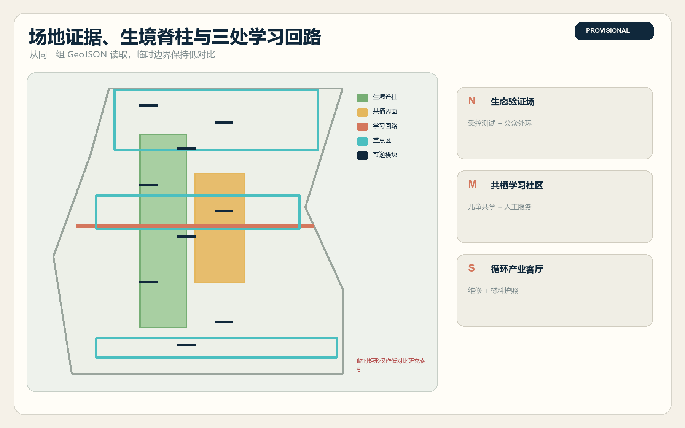
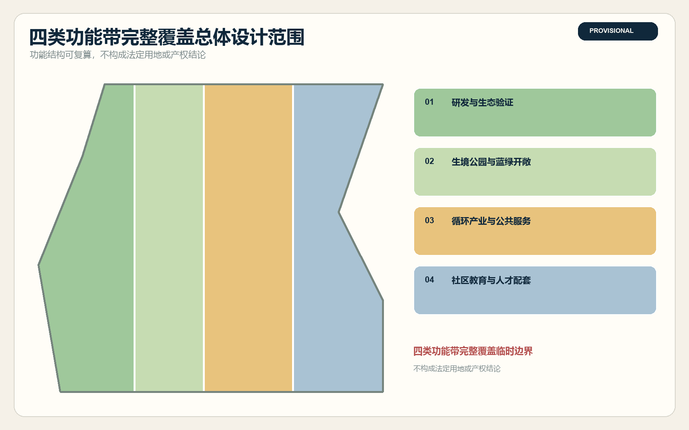
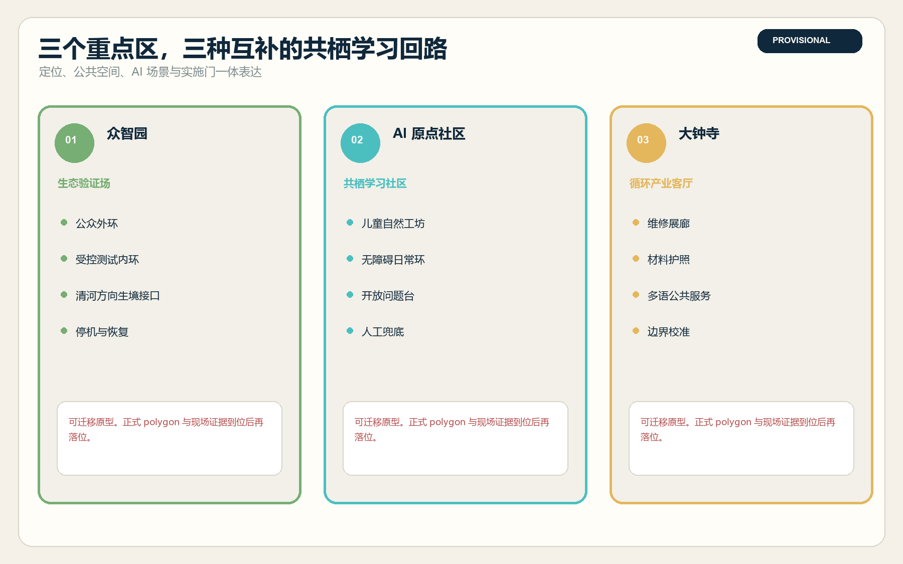
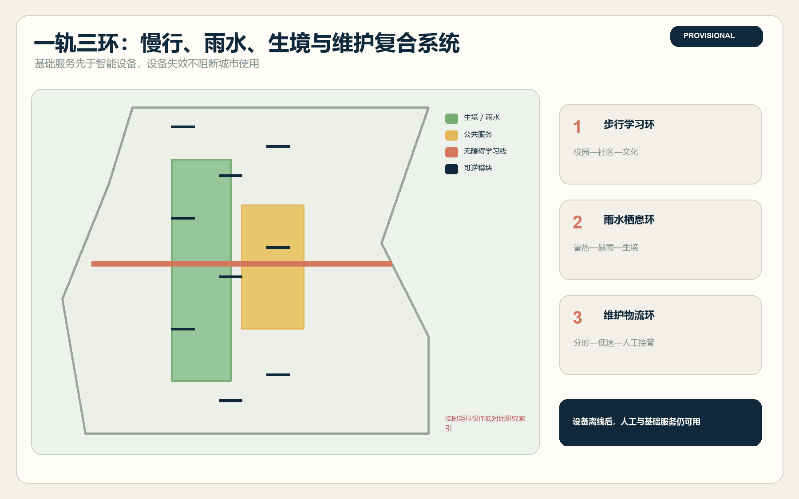
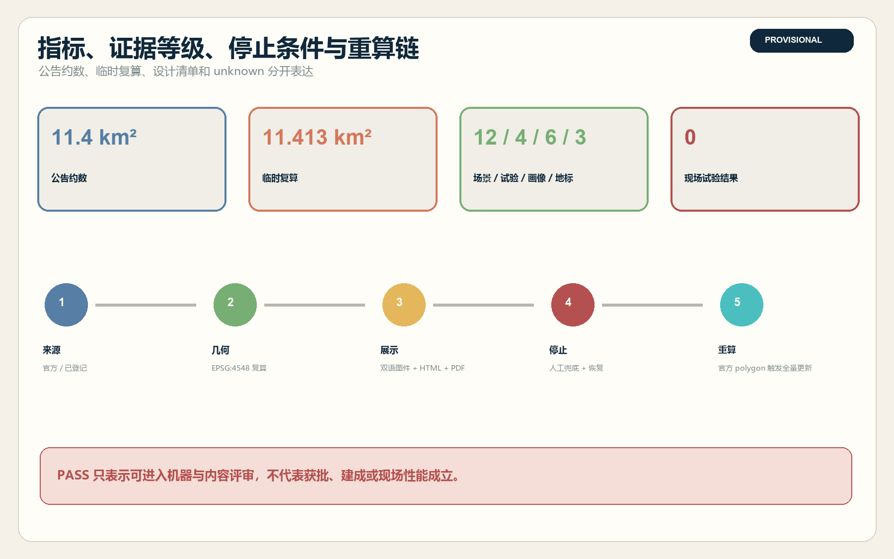

# 京张共栖带

**副标题：一条让人、城市与生境共同学习的 AI 创新带**

京张铁路曾经把速度带进北京。下一百年，这条廊道更值得回答一个难题：当 AI 进入城市，创新能否不以牺牲日常生活与自然环境为代价。方案把已建京张铁路遗址公园作为公共生境脊柱，把众智园、北京 AI 原点社区和大钟寺三处重点区组织成三个学习回路，以低侵扰传感、人工复核、可停止试验和生境修复，让产业验证、儿童自然学习、无障碍慢行、雨洪调蓄和公共文化共享同一套空间基础设施。

本方案没有现场踏勘、树木普查、物种调查、客流调查、权属资料、正式控规或官方精确 GIS。所有新增空间均为可迁移的概念建议。临时边界只用于生成、自检和比较，不能作为官方红线、精确选址、拆迁判断或工程承诺。官方数据到位后，九组 GeoJSON、指标、图件和双语成果必须整体重算。

## 设计依据与资料清单

任务边界来自征集公告、Agent 任务书和仓库场地包。公告给出 43.6 平方公里统筹研究范围、约 11.4 平方公里总体设计范围和 368.4 公顷重点设计范围；仓库目前只提供依据文字四至与公告面积校核的临时多边形。方案保留这一限制，不用 OSM、新闻图片、遥感截图或 AI 推测替代官方边界。[source:OFFICIAL-ANNOUNCEMENT] [source:BOUNDARY-SOURCE] [depth:existing_conditions_diagnosis]

设计方法同时参考《北京花园城市专项规划（2023—2035年）》关于生态优先、城绿融合、全民参与和绿色可达性的方向，以及国家儿童友好空间政策关于安全、绿色、普惠与儿童参与的要求。这些材料用于设计方法，不替代本项目的法定控规、专业标准和现场基线。[source:BEIJING-GARDEN-CITY] [source:CHILD-FRIENDLY-GUIDE]

## 三层范围工作框架

三层范围对应三种不同判断。统筹层研究创新生态怎样与花园城市、生物多样性和公共服务协同；总体层把关系落实为“一条生境脊柱、三类横向共栖环、九个可逆样方”；重点层在三个临时片区分别形成生态验证、社区共学和循环产业方案。公告面积是已知约数，提交几何面积是低置信复算值，两者不得互相替代。[metric:announced_overall_design_area_sqm] [data:geometry/site_boundary.geojson#SITE-001] [depth:three_level_scope_framework]

| 层级 | 核心问题 | 本方案的空间回答 | 进入下一阶段前的资料门槛 |
| --- | --- | --- | --- |
| 43.6 km² 统筹研究 | AI 产业、人才、花园城市和生态治理如何协同 | 形成研发、公共验证、社区学习、循环产业与全球交流的网络 | 正式研究范围、产业与人口基线、跨部门责任主体 |
| 约 11.4 km² 总体设计 | 公园、街区、轨道、校园和园区如何连续 | 一条生境脊柱、步行学习环、雨水栖息环、维护物流环 | 官方边界、现状测绘、道路市政、树木与生境调查 |
| 368.4 ha 重点区 | 三个片区怎样形成互补的详细设计 | 北部生态验证场、中部共学社区、南部循环产业客厅 | 三处官方 polygon、控规指标、权属、工程与运营许可 |

## 统筹研究范围产业与未来城市研究

方案命名为“京张共栖带”，英文为 “Jing-Zhang Habitat Commons”。“共栖”既指人与自然共生，也指研发、产业和社区共享同一条证据链。标志建议由两条铁路轨线逐渐转成叶脉与开放数据括号，中间留出一条不被扫描的公共通道。识别色采用铁路氧化红、生境绿和审计青，不使用大脑、机器人头像或企业商标。命名与视觉均为概念建议，后续需做商标、字体和公众辨识复核。[source:AGENT-TASKBOOK] [standard:PROJECT-AGENT-OPEN-CALL-TASKBOOK]

三大定位被转译为“百年铁路生态记忆带、都市 AI 日常共学带、AI 与自然协同验证带”。五项功能分别是全栈技术验证、开放创新生态、AI+公共场景、可持续日常城市和可审计治理。三区两翼形成问题回路：众智园提出技术与生态验证问题，原点社区把问题转成公众可理解的课程和服务，大钟寺把通过验证的组件带入产业展示与循环维护；中关村科技服务翼提供知识产权、资本与国际服务，小月河场景赋能翼承接公共空间和生态试验。

六个国际案例只提取机制，不移植指标。新加坡 one-north 提示研发、企业、学习和公园需要日常混合；伦敦 Knowledge Quarter 提示创新区首先是一张机构合作网；Barcelona 22@ 提示存量更新要同时保留生产与城市生活；Kendall Square 提示科研空间、住房、零售和开放空间需共同规划；Helsinki Smart Kalasatama 提示城市试验应有 living-lab 工具和居民参与；Toronto Quayside 提示数字治理、隐私、公共空间与公众审查必须同步进入设计。以上均为方法参照，不证明京张能够复制其投资、绩效或治理权限。[source:CASE-ONE-NORTH] [source:CASE-QUAYSIDE]

## 总体设计范围城市更新与控规深度城市设计

总体结构由四类完整用地带组成。研发与生态验证带承载低侵扰设备、开源实验和安全评测；生境公园与蓝绿开敞带构成连续生态骨架；循环产业与公共服务带连接维修、展示、法务和数据治理；社区教育与人才配套带承接儿童学习、居住服务和非消费停留。四个面在当前临时边界内无缝分区，只表达概念功能，不是法定用地或地块权属。[data:geometry/land_use.geojson#LU-001] [standard:MNR-LAND-USE-CLASSIFICATION-GUIDE] [depth:land_use_layout]

城市更新采用“先保留、再修补、后试验、最后永久化”。已建公园、可用道路、可确认公共设施和历史要素优先保留；遮阴座椅、透水铺装、连续坡道、暗夜友好照明和纸面导视作为微更新；九个共栖样方使用可移动构件验证需求；永久建筑必须等待控规、权属、结构、消防、文保、市政、生态和公众程序。当前不判断具体建筑拆除，不提出容积率、高度或总建面承诺。[metric:floor_area_ratio] [depth:retain_renovate_demolish]

九个样方并非九个已选址项目，而是三类可迁移原型。每个样方同时包含普通通行、非数字说明、人工求助、传感器开关、数据责任牌、雨水或微生境构件，以及触发停用后的恢复路径。技术离线时，基本通行、休息、饮水提示和人工服务仍然可用。

## 重点区域详细设计

三处重点区沿用仓库临时矩形，功能和节点都可在官方 polygon 到位后整体迁移。尤其南部大钟寺临时范围存在公开议题提示的站区锚定风险，本方案不写站口距离、不落具体地块，也不把矩形边解释为道路或权属线。[data:geometry/key_areas.geojson#PROV-KEY-003] [source:KEY-AREA-SOURCE] [depth:three_key_area_detailed_design]

| 重点区 | 定位与空间结构 | 建筑与公共空间 | 首批 AI 场景与实施门 |
| --- | --- | --- | --- |
| 众智园 AI 自主创新加速区 | “生态验证场”。形成公众外环、受控测试内环和清河方向生境接口 | 优先利用首层、灰空间和室外硬地，设置可撤回样方、人工观察席与一键停机点 | 低侵扰生态传感、具身设备避让测试、端侧能耗对照；需园区、生态、安全、消防和数据许可 |
| 北京 AI 原点社区 | “共栖学习社区”。形成校园—社区学习环、儿童自然工坊和开放问题台 | 首层共享、无消费门槛停留、无障碍卫生与安静空间优先，不推定校门开放 | 儿童共绘生境图、无障碍路线、可溯源铁路导览、社区花园助手；需监护、人工导师和退出权 |
| 大钟寺 AI 产业聚集区 | “循环产业客厅”。形成到达、展示、维修、回收和公共反馈链 | 提出站区地面层连续通行、维修展廊和材料护照台，不推断站口与产权 | 设备材料护照、公共服务智能体、回收物流和多语导览；需官方核边、站务协同与责任运营者 |

三处地标分别是“京张生境观测台”“AI 原点种子库”“大钟寺循环智造馆”。它们展示可复演的贡献，例如修复一处无障碍断点、公开一次失败试验、复育一块本地生境或完成一项设备回收闭环，不做企业排行榜或巨型科技雕塑。

## AI 创新生态、人才画像与 AI+ 场景

六类画像共同参与验收：儿童与照护者关注安全、理解和参与；老人关注熟悉路线、休息与人工服务；残障与行动不便者关注连续无障碍和非视觉信息；科研与开发者关注可重复测试和清晰许可；初创与园区团队关注共享设施、合规与小规模试验；园林、保洁、维修和物流人员关注真实维护、劳动安全与不过度算法加速。任何试验都必须报告对最不利人群的影响。[source:CHILD-FRIENDLY-GUIDE] [standard:MOHURD-URBAN-DESIGN-MEASURES]

| 场景卡 | 用户与空间 | 最小数据和人工替代 | 停止与恢复 |
| --- | --- | --- | --- |
| S01 无障碍共栖导航 | 老人、残障者；慢行环 | 障碍类别与聚合完成状态；纸图、电话、人工引导 | 任一推荐路线不可连续通行即停，撤下推荐并人工复核 |
| S02 暑热与暴雨安全路 | 儿童、老人、维护者；生境脊柱 | 公开预警与设施状态；现场标识和人工广播 | 预警源失效或替代路被阻断即降级 |
| S03 儿童共绘生境图 | 儿童与照护者；原点社区 | 匿名观察卡与监护同意；纸笔和导师 | 监护、内容或安全条件不完整即停课 |
| S04 可溯源铁路自然导览 | 居民、访客；遗址公园 | 来源 ID、版本与语言；纸本路线和人工讲解 | 历史或物种识别有争议即下架相关卡片 |
| S05 花园维护助手 | 园林与保洁人员；九个样方 | 设施状态、人工工单；电话和纸质巡检 | 错误建议影响作业安全即停用模型 |
| S06 社区健康与安静路线 | 居民、老人；公共空间 | 仅公开服务与环境状态；人工服务台 | 不采健康诊断，歧义或紧急情况立即转人工 |
| S07 低侵扰生态传感测试 | 开发者、生态顾问；众智园 | 设备状态与聚合环境读数，不做人脸 | 未获生态和数据许可、越采或误报即撤机 |
| S08 具身设备生境避让测试 | 设备团队、维护者；受控内环 | 速度、停机、接管和近失事件 | 侵入生境、挤占行人或急停失败立即断电 |
| S09 端侧算力能耗对照 | 初创、设施团队；众智园 | 设备级能耗、温度和任务延迟 | 功率、温度、噪声或网安告警越线即关停 |
| S10 设备材料护照 | 企业、维修者；大钟寺 | 部件、维修、授权与回收状态 | 来源、权利或材料信息不可核即停止展示 |
| S11 多语公共服务智能体 | 居民、访客、小商户；循环产业客厅 | 语言、任务类别和匿名反馈；双语人工 | 关键权利义务翻译不一致即撤下该语言 |
| S12 生境公共预算工作坊 | 居民、园区、专业者；三座地标 | 方案选项、理由和公开投票汇总 | 利益冲突未披露或样本失衡时不得形成结论 |

S07、S08、S09 和 S10 是四个产业测试验证场景。它们目前均为 `not_run`，没有现场性能、试点授权或投资承诺。每项未来 pilot 必须先记录地点边界、采样窗口、对象和分母、人工基线、缺失率、最不利人群、责任运营者、停止阈值、恢复步骤、隐私和许可状态。

## 用地、建筑规模与拆改留方案

四类概念用地完整覆盖提交边界，用于比较功能结构，不代表现状或法定分类。生境绿地和公共空间指标来自提交设计图层除以临时边界的复算，表示本方案画出的概念构件占比，不能称为现状绿地率、公共产权比例或审定指标。[metric:green_ratio] [metric:public_space_ratio] [data:geometry/green_space.geojson#GREEN-001]

建筑层只画九个可逆模块，包括生态验证棚、开源自然工坊、人工服务亭、维修材料库和三个地标的概念包络。总基底面积可从 GeoJSON 复算，但缺少层数、批准总建面、正式开发用地、权属和结构条件，因此容积率与建筑密度保持待正式数据补齐。任何具体建筑的保留、改造、拆除或新建结论必须由现状普查和专业团队完成。[metric:building_footprint_area_sqm] [metric:building_density] [depth:development_intensity_controls]

## 交通、轨道、市政与公共服务设施

慢行系统采用“一轨三环”。“一轨”是沿遗址公园的连续无障碍学习线；步行学习环连接校园、社区和公共文化，雨水栖息环连接清河、小月河方向与雨水花园，维护物流环用分时、低速和人工接管服务园区。道路图层只表达概念中心线，不声称道路红线、站口、桥涵或工程可行性。[data:geometry/roads.geojson#ROAD-001] [depth:traffic_rail_slow_parking]

市政策略坚持“基础服务先于智能设备”。饮水、卫生间、遮阴、排水、照明、垃圾分类、急救和通信先形成普通人工系统，传感器和端侧算力作为可断开的附加层。所有设备采用独立计量、物理断电、低照度暗夜模式、故障旁路和公开责任牌。实际管线、供电、排水、防洪、消防和服务容量仍待专业复核。[data:geometry/constraints.geojson#CONSTRAINTS] [depth:municipal_new_infrastructure]

## 蓝绿空间、公共空间与城市风貌

生境脊柱不追求把全部空间做成同一种景观。北段强调清河方向的生态验证和防扰动边缘，中段强调儿童学习、社区花园和安静停留，南段强调城市到达、循环维护和可理解导览。雨水花园、乡土植物群落、鸟虫友好照明、透水铺装、遮阴休息和低维护材料构成可替换的“共栖组件库”。具体植物、动物、土壤和雨洪容量必须以现场调查与专业设计为准。[source:BEIJING-GARDEN-CITY] [source:BIODIVERSITY-OPINION] [depth:blue_green_public_space]

城市风貌沿用铁路材料逻辑。氧化红用于路径与历史线索，深蓝用于责任和人工服务，生境绿用于不应进入的生态边缘，审计青用于传感器状态。夜间不做连续高亮媒体立面，交互装置默认熄屏，只有人在场并主动触发时短时工作。三座地标保持低姿态、可维护、可拆卸，并为轮椅、儿童和无智能设备者保留等价体验。

## 更新项目清单、实施政策与分期计划

| 编号 | 概念项目 | 首要依赖 | 阶段与退出条件 |
| --- | --- | --- | --- |
| H01 | 生境与树木基线调查 | 官方边界、专业调查、季节样本 | P0；资料不足则不定位永久设施 |
| H02 | 无障碍慢行完整链审计 | 道路、站务、残障者参与 | P0；任一关键断点未闭合则不发布导航 |
| H03 | 九个可逆共栖样方 | 权属、消防、生态与社区同意 | P1；任一安全或扰动门失败即撤场 |
| H04 | 众智园生态验证内外环 | 园区、安全、数据与生态许可 | P1；未获授权不运行设备 |
| H05 | 原点社区儿童自然工坊 | 监护、教育运营、无障碍审查 | P1；无人工导师不开课 |
| H06 | 大钟寺循环产业客厅 | 官方核边、站务与产权条件 | P1；临时矩形不做工程选址 |
| H07 | 一轨三环慢行修补 | 交通、市政、文保与现场测绘 | P2；先临时测试再决定永久化 |
| H08 | 三座共栖贡献地标 | 建筑、运营、版权和公众程序 | P2；年度运维责任不清则保持临时 |
| H09 | 全球 AI 与自然共栖周 | 活动许可、安全、内容清权 | P0-P2；不以活动替代长期维护 |

分期不是政府承诺。P0 先做资料、公众参与和人工基线；P1 在三区各运行一个可停止样方；P2 只把通过安全、公平、生态和运维审查的组件扩展到九个接口；P3 在官方边界、控规和长期运营明确后，才讨论永久工程。全球运营采用季度“共栖问题榜”、年度“AI 与自然共栖周”、开源生境组件库和开发者驻地，把失败记录、修复结果和公众提问一并公开。[data:geometry/phasing.geojson#PHASE-001] [depth:phasing_implementation]

## 指标体系、面积复算与合规矩阵

| 指标 | 当前值 | 证据等级 | 设计含义 |
| --- | --- | --- | --- |
| 公告总体设计范围 | 11.4 km² | 官方约数 | 任务规模，不等于临时 polygon 面积 |
| 提交临时几何面积 | 11.413 km² | 低置信可复算 | 仅用于包内拓扑和比较 |
| 三处重点区 | 3 | 官方任务 + 临时几何 | 必须全部详细回应，位置待核 |
| 概念绿地比例 | 由 metrics.json 复算 | 设计几何 | 衡量本包画出的生境构件，不是法定绿地率 |
| 概念公共空间比例 | 由 metrics.json 复算 | 设计几何 | 衡量开放接口包络，不代表产权 |
| 场景 / 产业试验 / 画像 / 地标 | 12 / 4 / 6 / 3 | 设计清单 | 检查任务完整性，不代表已运行 |
| 容积率、建筑密度、高度、客流、物种基线 | 待正式数据补齐 | unknown | 禁止用概念图制造确定值 |

指标在 EPSG:4548 下从同一套 GeoJSON 复算，图件和 HTML 从同一数据读取。任务覆盖矩阵覆盖公告 1.3、1.4、1.5 与 agent.1-agent.6，专业标准矩阵覆盖六项本地快照，十五项正式设计深度均链接到正文、图层、指标和图纸。机器检查 PASS 只代表包可进入评审，不代表方案优秀、官方批准或现场性能成立。[metric:site_area_sqm] [depth:metrics_recalculation] [standard:PROJECT-OFFICIAL-ANNOUNCEMENT]

## 风险、版权与合规说明

最高风险是官方 polygon、控规、现状建筑、权属、市政、生态基线和试点授权缺失。所有点位采用可迁移概念层，所有 pilot 先写人工基线、停止和恢复，所有公开数字绑定来源和状态。默认不做人脸识别、不持续追踪个体、不把儿童或居民数据用于商业推荐。生物多样性观察不得公开敏感物种精确位置，任何自动识别都要由专业人员复核。[data:geometry/constraints.geojson#CONSTRAINTS] [depth:risk_missing_data]

文字、GeoJSON 设计层、图件、HTML 与 PDF 为本次 AI 生成并由提交者代理复核的原创表达。政府文件、国际案例和项目资料只做短句转述与链接引用，不复制其地图、照片、Logo 或版式。字体使用本机系统字体，不随包分发。详细权利和生成方式见 `report/copyright_statement.md`。本方案不构成政府审定、规划执业签章、建设许可、采购或投资承诺。

## 参考资料

1. 百年京张 AI 创新带城市设计国际方案征集资格预审公告，2026。[source:OFFICIAL-ANNOUNCEMENT]
2. 面向全球智能体开展百年京张 AI 创新带城市设计开源征集任务书摘录，2026。[source:AGENT-TASKBOOK]
3. 北京花园城市专项规划（2023—2035年），北京市人民政府，2024。[source:BEIJING-GARDEN-CITY]
4. 关于推进儿童友好城市建设的指导意见，国家发展改革委等，2021。[source:CHILD-FRIENDLY-GUIDE]
5. 城市儿童友好空间建设导则（试行），住房城乡建设部等，2023。[source:CHILD-FRIENDLY-GUIDE]
6. 关于进一步加强生物多样性保护的意见，2021。[source:BIODIVERSITY-OPINION]
7. one-north，JTC Singapore。[source:CASE-ONE-NORTH]
8. Knowledge Quarter London。[source:CASE-KNOWLEDGE-QUARTER]
9. Barcelona Innovation / 22@，Barcelona City Council。[source:CASE-BARCELONA-22]
10. Kendall Square Initiative，MIT 与 Cambridge Redevelopment Authority。[source:CASE-KENDALL]
11. Smart Kalasatama living-lab tools，Forum Virium Helsinki。[source:CASE-KALASATAMA]
12. Quayside digital governance and public realm materials，Waterfront Toronto。[source:CASE-QUAYSIDE]
